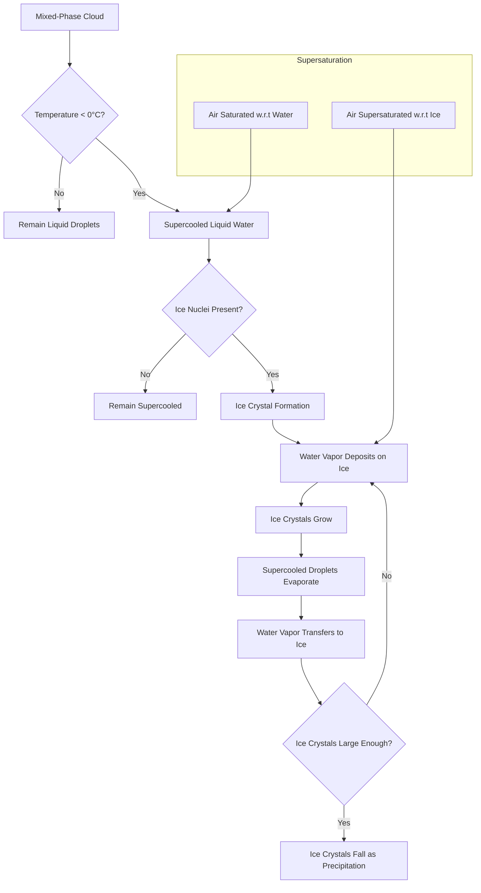

# Intro to Cloud Physics

## 1. Water Distribution on Earth

- 94.9% of Earth's water is found in the oceans.
- 0.001% of Earth's total water is in the atmosphere as water vapor.
  - This amounts to several thousand tons per person.
  - This atmospheric vapor has the potential to be harnessed.

## 2. Atmospheric Water and Cloud Formation

### 2.1 Nuclei and Cloud Formation

- Nuclei are crucial for cloud formation.
- Types of nuclei:
  - Natural: sea salt, dust, and organic particles.
  - Anthropogenic: industrial emissions, smoke.
- Nuclei provide surfaces for water vapor condensation in supersaturated conditions.

### 2.2 Supersaturation and Condensation

- Supersaturation occurs when relative humidity exceeds 100%.
- Condensation is the process of water vapor molecules aggregating to form liquid water.
- Relative humidity increases as air cools.
- At 100% relative humidity, saturation occurs, establishing an equilibrium between evaporation and condensation rates.

### 2.3 Vapor Pressure and Dew Point

- Saturation vapor pressure: The pressure at saturation, dependent only on air temperature.
- As temperature rises, saturation vapor pressure increases.
- Dew point: The point in the cooling process where condensation begins (at 100% relative humidity).
- Dew point temperature: The air temperature at which condensation begins.

### 2.4 Cloud Droplet Formation

- Atmospheric relative humidities rarely exceed 101%.
- Cloud droplets can form at lower relative humidities due to hygroscopic particles (e.g., sea salt).
- Relative humidity = (Actual water pressure / Saturation water pressure) * 100

## 3. Cloud Growth and Precipitation Processes

### 3.1 The Growth of a Cloud

- As air rises, pressure decreases and temperature reduces.
- Dry adiabatic lapse rate: 1°C cooling per 100 meters of ascent.
- As air rises and cools, relative humidity increases until saturation and condensation occur.
- Latent heat of vaporization: ~600 calories per gram, released during condensation.

### 3.2 Cloud Types and Vertical Motion

- Visible clouds indicate regions of rising air where condensation has occurred on condensation nuclei.
- Cloud forms depend on the character of the vertical motion field.

### 3.3 Cloud Growth Processes

#### 3.3.1 Natural Precipitation Processes

1. Collision-coalescence process
2. Wegener-Bergeron-Findeisen process

#### 3.3.2 Cloud Seeding

- Introduces nucleation agents (e.g., silver iodide) to increase precipitation efficiency.

#### 3.3.3 Ice Crystal Process

#### 3.3.4 Coalescence Process

- Cloud droplets grow by colliding and merging with other droplets.
- Larger drops fall faster, overtaking and colliding with smaller ones.
- Collision efficiency: The fraction of droplets in the vertical path that actually hit the large drop.

## 4. Atmospheric Processes

### 4.1 Fog Formation through Radiative Cooling

1. Lower atmosphere radiates heat
2. Earth's surface cools
3. Moist air near surface cools to dew point
4. Water vapor condenses into tiny droplets
5. Suspended droplets form fog layer
6. Upper dry air limits vertical extent

- Typically occurs on clear nights with calm winds, creating a shallow fog layer near the ground.

### 4.2 Evaporative Cooling

- Cooling effect caused by water evaporating from surfaces (e.g., skin after swimming).

## 5. Water States and Phase Changes

### 5.1 Supercooled Water

- Pure water can remain liquid below 32°F, especially in small quantities like cloud droplets.
- Cloud droplets can remain liquid down to -40°F before certainly freezing into ice.

### 5.2 Ice Crystal Formation

- Ice-crystal nuclei facilitate ice formation at modest degrees of supercooling.
- Without nuclei, ice forms through spontaneous arrangement of water molecules at very low temperatures (around -40°F).

### 5.3 Saturation Vapor Pressure Differences

- Saturation vapor pressure of water is higher than that of ice at the same subfreezing temperature.
- A cloud of supercooled water droplets may have air saturated with respect to water but supersaturated with respect to ice.

## 6. Hydrometeors

- Definition: Water or ice particles in the atmosphere.
- Examples: clouds, fog, rain, snow, hail, dew, rime, glaze, blowing snow, and blowing spray.

## 7. Droplet Growth and Raindrop Formation

- A raindrop's volume is approximately one million times larger than a cloud droplet.
- Condensation alone cannot lead to rainfall due to decreasing growth rate with droplet size.
- Higher supersaturation leads to a greater number of cloud droplets, not larger droplets.