# Meteorology 

94.9% of the quantity of water of various forms on Earth is found in the oceans. 0.001% of Earth's total water can be found in the atmosphere in the form of water vapor. However, in absolute terms, this is still a huge amount -- this entitles each person to several thousand tons of their own water. This atmosopheric vapor has the potential to be harnessed.

Nuclei are important and are the reason clouds form.

Supersaturation of water vapor occurs when the relative humidity exceeds 100%.

Nuclei provide surfaces for water vapor to condense upon, facilitating droplet formation in supersaturated conditions.

Natural nuclei include sea salt, dust, and organic particles. Anthropogenic nuclei are human-made particles such as industrial emissions or smoke.

A cloud is a visible aggregate of minute water droplets or ice crystals suspended in the atmosphere.

Cloud drops and raindrops differ primarily in size, with larger radii correlating to faster fall speeds and longer survival before evaporation.

Condensation is the process by which water vapor molecules aggregate to form liquid water.

Relative humidity increases as air cools. At 100%, saturation occurs, establishing an equilibrium between evaporation and condensation rates.

At saturation, the pressure is called the saturation vapor pressure. The vapor pressure of air saturated with water vapor depends only on the temperature of the air. As the temperature rises, the saturation vapor pressure increases.

The point in the cooling process at whivh condensation begins is called the dew point. It occurs when the relative humidity reaches 100%. The temperature of the air at which condensation begins is called the dew point temperature.

In the atmosphere, relative humidities rarely exceed 101%, and even those 1% supersaturations occur only in very strong updrafts in thunderstorms. So how then can cloud droplets form?

Because the tendency of very tiny droplets to evaporate is counteracted by the affinity of certain substances for water molecules -- for example, a particle of sea salt is very hygroscopic, so condensation can occur with relative humiidties of only 50-60%.

Relative humidity = (Actual water pressure \ Saturation water pressure) * 100

#### Fog formation through radiative cooling:
1. Lower atmosphere radiates heat
2. Earth's surface cools
3. Moist air near surface cools to dew point
4. Water vapor condenses into tiny droplets
5. Suspended droplets form fog layer
6. Upper dry air limits vertical extent

This process typically occurs on clear nights with calm winds, creating a shallow fog layer near the ground.

The Growth of a Cloud:

Pressure decreases with height -- when a body of air rises, it moves from higher pressure ot lower pressure, and expands as its temperature is reduced. If the air is dry and no heat is added or taken away as the air ascends, it cools at the rate of 1C per 100 meters.

The rate at which air cools as it rises is called the lapse rate. The dry adiabatic lapse rate is the rate at which air cools as it rises in the atmosphere.

As air rises and its temperature decreases, the relative humidity of thehair increases until saturation ocurs and condensation begins. 

When you step out of the pool into dry air, the cooling effects of water evaporating from your skin causes a cooling effect. This is called evaporative cooling. The opposite is true as the water vapor condenses in clouds; heat is added. The quantity of head transferred for each gram is known as the latent heat of vaporizatio and is equal to about 600 calories per gram.

The clouds we see every day are indications of regions of rising air in which condensation has occured on small condensation nuclei.  The forms of the clouds depend on the character of hte field of vertical motion.

Freezing Ice:

If you had a quantity of absolutely pure water, and sealed it in an absolutely clean bottle, and brought the temperature to 32F, the water would not freeze. It may not even freeze at 20F or 0F. It can in fact be supercooled by great amounts, especially if the quantity of water is small -- like a droplet in a cloud. It can fall to -40F before they are certainly frozen into ice.

Big idea: The saturation vapor pressure of water is higher than that of ice at the same subfreezing temperature. A cloud of supercooled water droplets may have air that is saturated with respect to water, but supersaturated with respect to ice.

It's been proposed that the relationship between smaller volumes of water and the amount of energy required to freeze them is a function of the probability that the water has a special particle on which the ice can begin to grow at modest degrees of supercooling. This particle is called an ice-crystal nucleus.

Without an ice-crystal nucleus, ice may form only by the accidental grouping of a large number of water molecules into an aggregation resembling ice. -40F is the temperature at which the molecules are cool enough, and therefore move slowly enough, that there is suddenly a strong enough possibility that the hydrogen and oxygen atoms spontaneously arrange themselves into a crystal structure that forms an ice nucleus.

One raindrop has a volume approximately one million times larger than a cloud droplet. However, a raindrop is not just a cloud droplet that has continued to grow in size to become large enough to fall to Earth.

The process of condensation does not go on indefinitely. Let's say water vapor condenses on fine particle of sea salt, when they air is supersaturated with respect to the growing droplet. The sea salt particle will attract water molecules even when the relative humidity is less than 100% because the equilibrium humidity over a salt solution is lower than that over pure water.

As the drop grows, the relative amount of salt that makes up the solution decreases and it gets closer and closer to a pure water solution. Now, the droplet may only continue to grow if the surrounding air is supersaturated with respect to pure water -- i.e, a relative humidity greater than 100%. 

Therefore: The larger the drop, the slower it grows. And, the higher the supersaturation, the greater the number of cloud droplets. Therefore, condensation alone cannot lead to rainfall. Instead, rainfall occurs in one of two ways. 

1) Formation via the ice-crystal process

Recall that a cloud of supercooled water droplets may have air that is saturated with respect to water, but supersaturated with respect to ice. If some ice-crystal nuclei are suddenly introduced into the cloud, the cloud system becomes unstable. 

Water vapor molecules deposit on the ice crystals, and immediately the air is no longer saturated with respect to water. Consequently, some water evaporates from the cloud droplets to make up for hte losses to the crystals. This evaporation again leads to supersaturation with respect to the ice -- the crystal grows larger -- water molecules deposit on the larger ice crystals -- the cycles continues. 

```mermaid
graph TD
    A[Mixed-Phase Cloud] --> B{Temperature < 0°C?}
    B -->|No| C[Remain Liquid Droplets]
    B -->|Yes| D[Supercooled Liquid Water]
    D --> E{Ice Nuclei Present?}
    E -->|No| F[Remain Supercooled]
    E -->|Yes| G[Ice Crystal Formation]
    G --> H[Water Vapor Deposits on Ice]
    H --> I[Ice Crystals Grow]
    I --> J[Supercooled Droplets Evaporate]
    J --> K[Water Vapor Transfers to Ice]
    K --> L{Ice Crystals Large Enough?}
    L -->|No| H
    L -->|Yes| M[Ice Crystals Fall as Precipitation]
    
    subgraph Supersaturation
    N[Air Saturated w.r.t Water]
    O[Air Supersaturated w.r.t Ice]
    end
    
    N --> D
    O --> H
```

2) Formation via the coalescence process

What about in the tropics, where it is clear that clouds much above freezing will create rain without the presence of ice nuclei?

The coalescence process is the process by which cloud droplets grow by colliding with other droplets and merging.

A droplet of 10-micron radius falls at a speed of 1cm/sec, while droplets of 50-micron radius fall at a speed of 26cm/sec. The larger drops overtake smaller ones and collide with them. 

Two colliding drops do not necessarily coalesce -- they may bounce off eachother. But still, as they fall, the larger droplets grow at the expense of the smaller ones. The fraction of the droplets within the vertical path of the falling droplet that actually hit the large drop is called the collision efficiency. 

pg70

## 1. Conditions for Cloud Seeding

### 1.1 Supercooled Liquid Water (SLW)

> SLW refers to water droplets that remain liquid below the freezing point

SLW is a necessary but not sufficient condition for initiating glaciogenic cloud seeding (atmospheric stability and vertical wind profiles need to be examined to determine if seeding is feasible). 

SLW:

| Characteristic | Range |
|----------------|-------|
| Vertical thickness | 100-500 m (typical), up to 1-2 km |
| Horizontal extent | Few hundred meters to over 100 km |

### 1.2 Temperature and Humidity Requirements

For glaciogenic seeding:

| Temperature Range | Effect |
|-------------------|--------|
| Above -10C | Seeding materials less effective at nucleating ice |
| -10C to -25C | **Optimal range** for seeding |
| Below -25C | Natural ice crystal concentrations may already be high |

### 1.3 Atmospheric Stability

> Atmospheric stability plays a crucial role in the effectiveness of cloud seeding operations

| Condition | Effect on Seeding |
|-----------|-------------------|
| Stable | May limit vertical mixing of seeding agents |
| Unstable | Can enhance vertical transport but may lead to rapid dispersal |

---

## 2. Challenges in Cloud Seeding

### 2.1 Distinguishing Seeded vs. Natural Precipitation

-  One of the primary challenges in cloud seeding research
-  Requires sophisticated measurement techniques and statistical analysis
-  Recent advances include Improved radar technology and Tracer studies

### 2.2 Variability in Cloud Microphysics

-  Cloud properties can vary significantly even within a single cloud system
-  Makes it difficult to predict and quantify seeding effects
-  Requires careful monitoring and adaptable seeding strategies

### 2.3 Environmental and Regulatory Concerns

1. Potential long-term impacts of seeding agents on ecosystems
2. Regulatory frameworks vary by region and country
3. Ongoing research into more environmentally friendly seeding materials

---

## 3. Cloud Types and Processes

'The underlying concept is to treat those storms or portions of storms that are naturally inefficient to make them more efficient througuh cloud seeding'. (ASCE)

### 3.1 Orographic Clouds

> Clouds that form as a result of air being forced to rise over topographical features like mountains or hills

Shallow widespread winter orographic cloud systems provided the best potential for precipitation augmentation through cloud seeding operations because their supercooled liquid water is long lasting and distributed over a large area'. (ASCE)

#### Orographic clouds are targeted for cloud seeding for several reasons.
- Predictable formation: Orographic clouds form reliably when moist air is forced up over mountains, making them easier to target.
- Supercooled liquid water: These clouds often contain supercooled liquid water, which is essential for glaciogenic seeding.
- Natural precipitation enhancement: Mountains already enhance precipitation naturally, so seeding can potentially augment this effect.
- Water resource management: Many regions rely on mountain snowpack for water supplies, making orographic cloud seeding attractive for water resource management.

#### Formation Process:
1. Moist air encounters a topographical barrier (e.g., mountain)
2. Air is forced to rise up the windward side
3. As air rises, it cools and expands
4. If air cools to its saturation point, water vapor condenses into cloud droplets

#### Characteristics:
-  Typically form on the windward side of mountains
-  Can appear as a "cap" over mountain peaks or a "collar" around them
-  May dissipate on the leeward side due to descending air motion (rain shadow effect)
-  Common cloud types: Altocumulus, Stratocumulus, Cumulus

### 3.2 Convective vs. Stratiform Clouds

'The effects of convective cloud seeding have been mixed and often inconclusive since the discovery of the effects of dry ice on supercooled stratiform cloud precipitation process efficiency'... but 'results indicated that rainfall was increased downwind of the seeding activity'. (ASCE) Randomized hygroscopic seeding in South Africa and Thailand reached statistical significance and increased rainfall up to 30-60%.

| Convective Clouds | Stratiform Clouds |
|-------------------|-------------------|
| Formed by rising air currents | Form in horizontal layers |
| Puffy, cauliflower-like appearance | Generally produce lighter, widespread precipitation |
| Range from small fair-weather cumulus to large cumulonimbus | Examples: stratus and altostratus clouds |
| Often associated with intense, localized precipitation | |

### 3.3 Cloud Growth Processes

Precipitation is naturally produced by either the collision-coalescence process or the Wegender-Bergeron-Findeisen process (or both working together).

Some clouds do not 'efficiently' produce precipitation (i.e. condense into droplets that fall to the ground) -- 'efficient' here has taken on a specific meaning defined by DeFelice and Czys (2016). I will use the term 'efficient' to refer to the process of producing precipitation.

Cloud seeding refers to the possibility that nucleation agents like silver iodide can be introduced at the right times to increase the efficiency of the natural process of precipitation production.

As air rises, it expands and cools. Although the amount of water in vapor form within the air stays around the same, the air becomes less dense and can hold less water vapor. This brings it closer and closer to saturation, i.e. the amount of vapor in the air has reached its carrying capacity (fully saturated). It can no longer hold any more water vapor. 

If more water vapor is added, or the carrying capacity is decreased further, it will condensed out in the form of cloud droplets or ice crystals. Over land, it is almost always small solution droplets, even if the temperature is below freezing -- these are supercooled droplets.

Water or ice particles blown from the ground into the atmosphere are also classed as hydrometeors.
> Some well-known hydrometeors are clouds, fog, rain, snow, hail, dew, rime, glaze, blowing snow, and blowing spray.

#### What makes a cloud a good candidate for precipitation / cloud seeding?

Clouds that have signifcant cloud condensate but lack an approopriate mechanism for hydrometeor growth to a precipitation-sized hydrometeor within their lifetime (i.e. are naturally inefficient / colloidally stable).

#### Where and when is it most efficient to seed?

If we have a cloud that is 32F at its base and 25F at the top, we want to seed at the bottom of the cloud, where the temperature is closest to 32F.

Even though seeding at temperatures farther below freezing is associated with a higher ice nucleation rate and growth rates, it's actually worse due to a nucleation delay -- seeding at this level leads to fewer activated ice nuclei. You miss out on opportunities to form precipitation that may have been present had you seeded closer to freezing.

#### Energy and heat
The rapid conversion of supercooled water droplets to ice particles adds heat (latent heat of fusion) to the cloud w.r.t. the surrounding air, which increases bouyancy. This heated air is less dense than the surrounding air, and thus rises, leading to even greater cloud development. So seeding idividual convective clouds results in more updrafts -> increased condensation -> increased precipitation.

It's generally understood that there is a short window of opportunity for most effective seeding: generally, when the top of the growing tower passes from 0C to -10C to -12C. 

Hygroscopic Seeding usually occurs just below cloud base in the area of maximum updraft to ensure that the cloud ingested the seeding agent early in the warm convective cloud's lifetime before the warm rain process is firmly established. 

Because the effects of seeding are not instantaneous, seeding agents must be applied to moving cloud systems sufficiently in advance of their entering the target area. The width of this buffer zone clearly is depndent on the speed at which the system is moving. 

#### 3.3.1 Vapor Deposition

> The process by which water vapor directly transforms into ice on a surface, without going through the liquid phase

#### **Process:**
1. Water vapor molecules in supersaturated air diffuse towards ice particles or droplets
2. Molecules adhere to the surface, growing the particle
3. Growth rate depends on factors like temperature, pressure, and particle size
4. As particles grow, they release latent heat, affecting further growth

#### 3.3.2 Epitaxial Riming

> Growth of small ice particles on the surface of larger ice particles along the same crystal axis

- Results in faceted particles
- Small particles inherit the same lattice structure as the underlying ice crystal
- More common at higher temperatures (near 0C)
- Tends to occur on larger ice particles

#### 3.3.3 Collision-coalescence

> Process by which cloud droplets collide and merge to form larger droplets

#### **Key Steps:**
1. Cloud droplets of different sizes fall at different speeds
2. Larger droplets fall faster and collide with smaller droplets
3. Upon collision, droplets merge to form even larger droplets
4. Process continues until droplets are large enough to fall as rain

##### **In Hygroscopic Seeding:**
- Hygroscopic particles released at cloud base rise in updrafts
- As they ascend, they grow by vapor deposition, becoming larger cloud droplets
- Larger droplets have higher collection efficiency and fall speed than natural droplets
- As they fall relative to smaller droplets, they collide and coalesce, growing larger
- Process initiates earlier and faster than in unseeded clouds
- Larger droplets continue growing as they fall, potentially becoming raindrops

---

## 4. Background Aerosol Concentrations

### 4.1 Natural vs. Anthropogenic Sources

| Natural Sources | Anthropogenic Sources |
|-----------------|------------------------|
| Sea spray (ocean aerosols) | Industrial emissions |
| Dust from arid regions | Vehicle exhaust |
| Volcanic emissions | Biomass burning |
| Biological particles (pollen, spores, etc.) | Agricultural activities |

### 4.2 Impact on Cloud Microphysics

-  Aerosols serve as cloud condensation nuclei (CCN) and ice nuclei (IN)
-  Higher aerosol concentrations can lead to more numerous but smaller cloud droplets
##### This can affect:
  - Cloud lifetime
  - Precipitation efficiency
  - Radiative properties

### 4.3 Role in Cloud Seeding Effectiveness

> Background aerosol concentrations can significantly impact the effectiveness of cloud seeding

**Effects on Seeding:**

| High Concentrations | Low Concentrations |
|---------------------|---------------------|
| Can reduce seeding effectiveness | May allow seeding particles to have a more significant impact |
| Compete with seeding particles for available water vapor | |
| Potentially overwhelm the impact of added seeding material | |

> The composition of background aerosols (e.g., their hygroscopicity) also affects seeding outcomes

#### **Optimal Seeding Conditions:**
- Generally, moderate background aerosol concentrations are ideal for seeding
- Too clean environments may lack sufficient CCN for initial cloud formation
- Too polluted environments may reduce the relative impact of seeding particles

