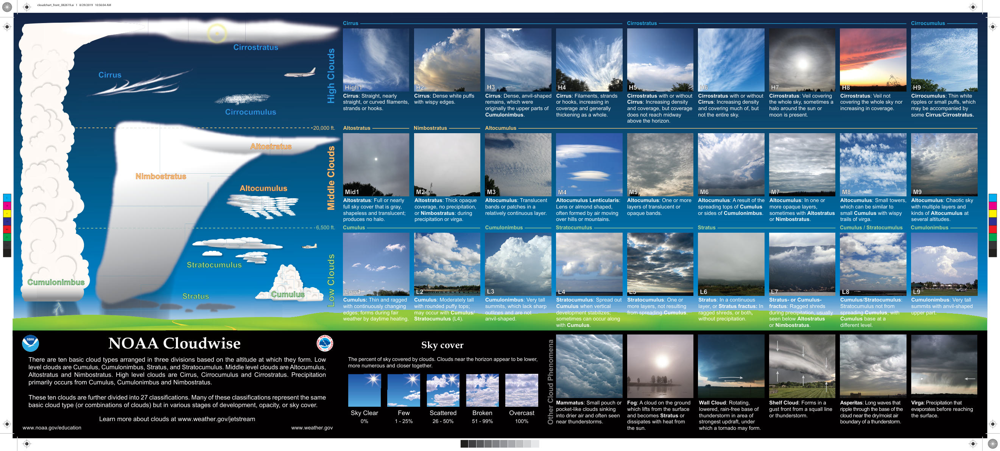

# Cloud Recognition — Cloud Poster

> Source: <https://www.noaa.gov/sites/default/files/2023-03/cloudchart-front.pdf>  
> Section: Clouds/Precipitation  
> Captured: 2026-08-19 06:00 UTC  
> PDF: [cloud-recognition-cloud-poster.pdf](cloud-recognition-cloud-poster.pdf) (1 pages)

---

## Page 1

Wall Cloud: Rotating, 
lowered, rain-free base of 
thunderstorm in area of
strongest updraft, under 
which a tornado may form.
Shelf Cloud: Forms in a 
gust front from a squall line 
or thunderstorm.
Mammatus: Small pouch or 
pocket-like clouds sinking 
into drier air and often seen
near thunderstorms.
Virga: Precipitation that 
evaporates before reaching 
the surface.     
Asperitas: Long waves that 
ripple through the base of the 
cloud near the dry/moist air 
boundary of a thunderstorm.
Fog: A cloud on the ground 
which lifts from the surface 
and becomes Stratus or 
dissipates with heat from 
the sun.
Other Cloud Phenomena
Cumulonimbus: Very tall 
summits with anvil-shaped 
upper part. 
Cumulus/Stratocumulus: 
Stratocumulus not from 
spreading Cumulus, with 
Cumulus base at a 
different level.
Stratus- or Cumulus-
fractus: Ragged shreds 
during precipitation, usually 
seen below Altostratus 
or Nimbostratus.
Stratus: In a continuous 
layer, or Stratus fractus: In 
ragged shreds, or both, 
without precipitation.
Stratocumulus: One or 
more layers, not resulting 
from spreading Cumulus.
Stratocumulus: Spread out 
Cumulus when vertical 
development stabilizes; 
sometimes can occur along 
with Cumulus.
Cumulonimbus: Very tall 
summits, which lack sharp 
outlines and are not 
anvil-shaped. 
Cumulus: Moderately tall 
with rounded puffy tops; 
may occur with Cumulus/ 
Stratocumulus (L4). 
Cumulus: Thin and ragged 
with continuously changing 
edges; forms during fair 
weather by daytime heating.
Altostratus: Full or nearly 
full sky cover that is gray, 
shapeless and translucent; 
produces no halo.
Altostratus: Thick opaque 
coverage, no precipitation, 
or Nimbostratus: during 
precipitation or virga.
Altocumulus: Translucent 
bands or patches in a 
relatively continuous layer.
Altocumulus Lenticularis: 
Lens or almond shaped, 
often formed by air moving 
over hills or mountains.
Altocumulus: One or more 
layers of translucent or 
opaque bands. 
Altocumulus: A result of the 
spreading tops of Cumulus 
or sides of Cumulonimbus.
Altocumulus: In one or 
more opaque layers, 
sometimes with Altostratus 
or Nimbostratus.
Altocumulus: Small towers, 
which can be similar to 
small Cumulus with wispy 
trails of virga.
Altocumulus: Chaotic sky 
with multiple layers and 
kinds of Altocumulus at 
several altitudes.
Cirrus: Straight, nearly 
straight, or curved filaments, 
strands or hooks.
Cirrus: Dense white puffs 
with wispy edges.
Cirrus: Dense, anvil-shaped 
remains, which were 
originally the upper parts of 
Cumulonimbus.
Cirrostratus with or without 
Cirrus: Increasing density 
and coverage, but coverage 
does not reach midway 
above the horizon.
Cirrostratus: Veil covering 
the whole sky, sometimes a 
halo around the sun or 
moon is present.
Cirrus: Filaments, strands 
or hooks, increasing in 
coverage and generally 
thickening as a whole.
Cirrostratus: Veil not 
covering the whole sky nor 
increasing in coverage.
Cirrocumulus: Thin white 
ripples or small puffs, which 
may be accompanied by 
some Cirrus/Cirrostratus.
Cirrostratus with or without 
Cirrus: Increasing density 
and covering much of, but 
not the entire sky.
Altostratus
Nimbostratus
Altocumulus 
Cirrostratus
Cirrocumulus
Cirrus
Cumulus
Cumulus / Stratocumulus
Stratus
Stratocumulus
Cumulonimbus
Cumulonimbus 
High1
High1
H2
H2
H3
H3
H4
H4
H5
H5
H6
H6
H7
H7
H8
H8
H9
H9
Mid1
Mid1
M2
M2
M3
M3
M4
M4
M5
M5
M6
M6
M7
M7
M8
M8
M9
M9
Low1
Low1
L2
L2
L3
L3
L4
L4
L5
L5
L6
L6
L7
L7
L8
L8
L9
L9
NOAA Cloudwise
Altocumulus
mulu
ulu
l
m
um
tocum
um
Alt
u
Alt
u
l
m
Alto
A
Altostr
s
Cirrus
Stratus
Stratus
Cirrocumulus
Cirrocumulus
Cirrostratus
Cirrostratus
Cirrus
Cirrus
Stratocumulus
Stratocumulus
Altostratus 
Altostratus 
Nimbostratus
Nimbostratus
Cumulus 
Cumulus 
Cumulonimbus
Cumulonimbus
Low Clouds
Low Clouds
Middle Clouds
Middle Clouds
High Clouds
High Clouds
There are ten basic cloud types arranged in three divisions based on the altitude at which they form. Low 
level clouds are Cumulus, Cumulonimbus, Stratus, and Stratocumulus. Middle level clouds are Altocumulus, 
Altostratus and Nimbostratus. High level clouds are Cirrus, Cirrocumulus and Cirrostratus. Precipitation 
primarily occurs from Cumulus, Cumulonimbus and Nimbostratus.
These ten clouds are further divided into 27 classifications. Many of these classifications represent the same 
basic cloud type (or combinations of clouds) but in various stages of development, opacity, or sky cover.
Learn more about clouds at www.weather.gov/jetstream
www.noaa.gov/education
               www.weather.gov
6,500 ft.
20,000 ft.
Sky Clear
0%
Few
1 - 25%
Scattered
26 - 50%
Broken
51 - 99%
Overcast
100%
Sky cover
The percent of sky covered by clouds. Clouds near the horizon appear to be lower, 
more numerous and closer together.
C
M
Y
CM
MY
CY
CMY
K
cloudchart_front_082619.ai   1   8/29/2019   10:56:04 AM
cloudchart_front_082619.ai   1   8/29/2019   10:56:04 AM
