# Cloud Recognition — Tutorial 2

> Source: <http://www.weather.gov/media/zhu/ZHU_Training_Page/clouds/cloud_recognition/cloud_recognition.pdf>  
> Section: Clouds/Precipitation  
> Captured: 2026-08-19 06:00 UTC  
> PDF: [cloud-recognition-tutorial-2.pdf](cloud-recognition-tutorial-2.pdf) (35 pages)

---

## Page 1

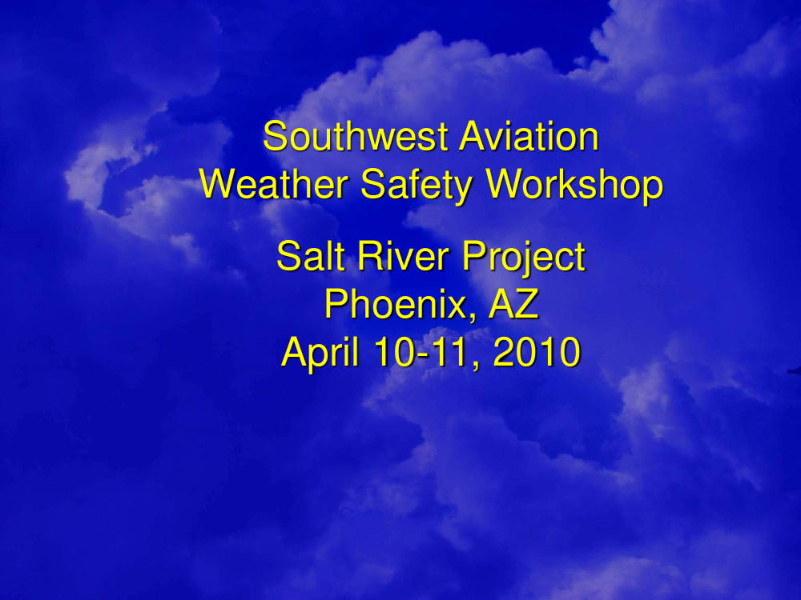

Southwest Aviation Weather Safety Workshop
 
Salt River Project 
 
Phoenix, AZ
 
April 10
-11, 2010
 
 
 
Southwest Aviation 
Weather Safety Workshop 
Salt River Project  
Phoenix, AZ 
April 10-11, 2010

## Page 2

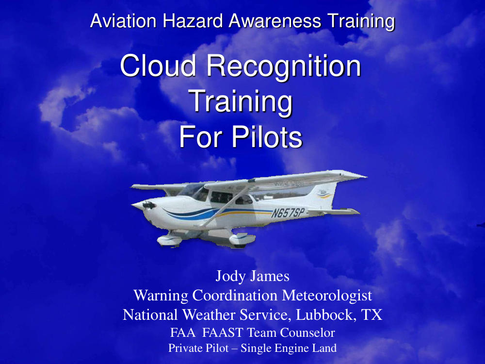

Aviation Hazard Awareness Training  
 
 
 
Aviation Hazard Awareness Training   
 
Cloud Recognition Training  
 
For Pilots
 
Cloud Recognition 
Training   
For Pilots 
 
Jody James 
Warning Coordination Meteorologist  
National Weather Service, Lubbock, TX 
FAA  FAAST Team Counselor 
Private Pilot – Single Engine Land

## Page 3

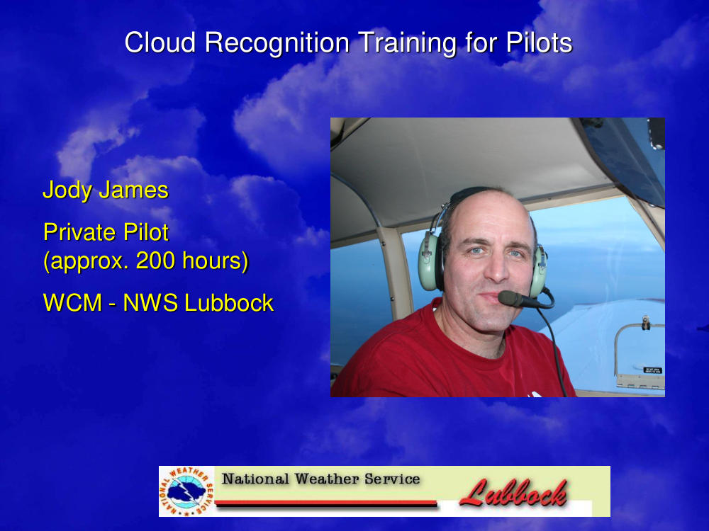

Cloud Recognition Training for Pilots
 
Cloud Recognition Training for Pilots 
Jody James
 
Private Pilot
 
(approx. 200 hours)
 
WCM 
- NWS Lubbock
 
Jody James 
Private Pilot 
(approx. 200 hours) 
WCM - NWS Lubbock

## Page 4

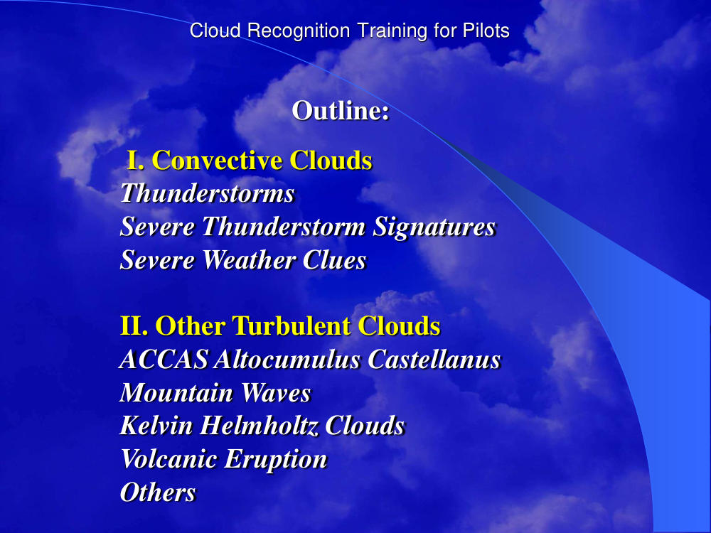

Cloud Recognition Training for Pilots
 
Cloud Recognition Training for Pilots 
Outline: 
 
 I. Convective Clouds
 
Thunderstorms
 
Severe Thunderstorm Signatures
 
Severe Weather Clues
 
 II. Other Turbulent Clouds
 
ACCAS Altocumulus 
Castellanus
 
Mountain Waves
 
Kelvin Helmholtz Clouds
 
Volcanic Eruption
 
Others
 
 
Outline:  
 I. Convective Clouds 
Thunderstorms 
Severe Thunderstorm Signatures 
Severe Weather Clues 
 
II. Other Turbulent Clouds 
ACCAS Altocumulus Castellanus 
Mountain Waves 
Kelvin Helmholtz Clouds 
Volcanic Eruption 
Others

## Page 5

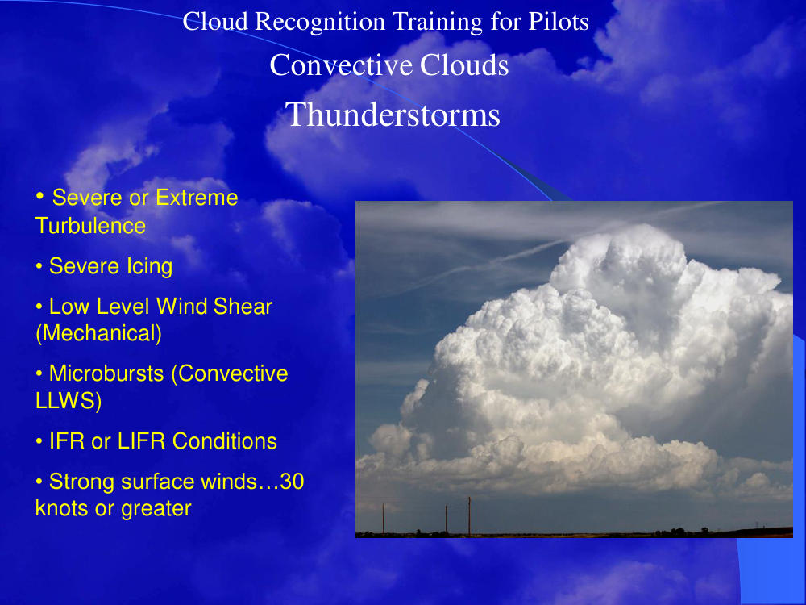

Cloud Recognition Training for Pilots 
Convective Clouds 
Thunderstorms  
• Severe or Extreme 
Turbulence 
• Severe Icing 
• Low Level Wind Shear         
(Mechanical) 
• Microbursts (Convective              
LLWS) 
• IFR or LIFR Conditions 
• Strong surface winds…30 
knots or greater

## Page 6

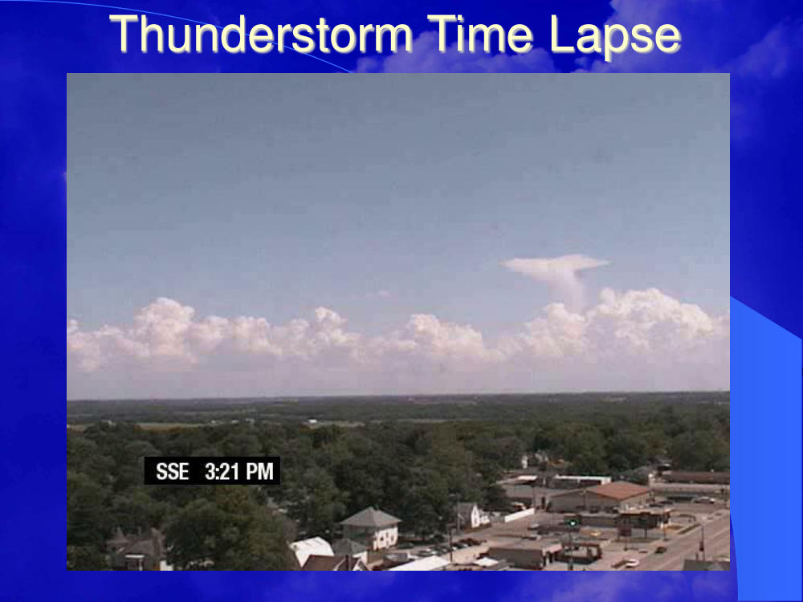

Thunderstorm Time Lapse
 
Thunderstorm Time Lapse

## Page 7

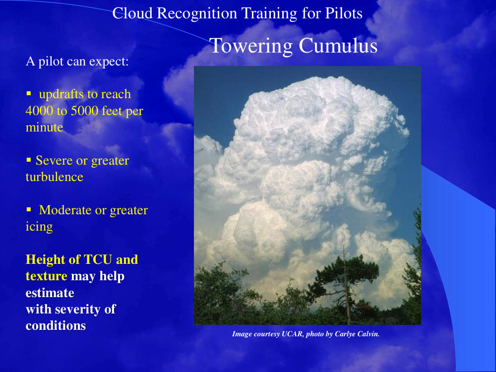

Cloud Recognition Training for Pilots 
Image courtesy UCAR, photo by Carlye Calvin. 
Height of TCU and texture 
may help 
estimate 
 
with severity of conditions
 
A pilot can expect: 
 
  updrafts to reach      
4000 to 5000 feet per 
minute 
 
 Severe or greater 
turbulence 
 
  Moderate or greater 
icing 
 
Height of TCU and 
texture may help 
estimate  
with severity of 
conditions 
Towering Cumulus

## Page 8

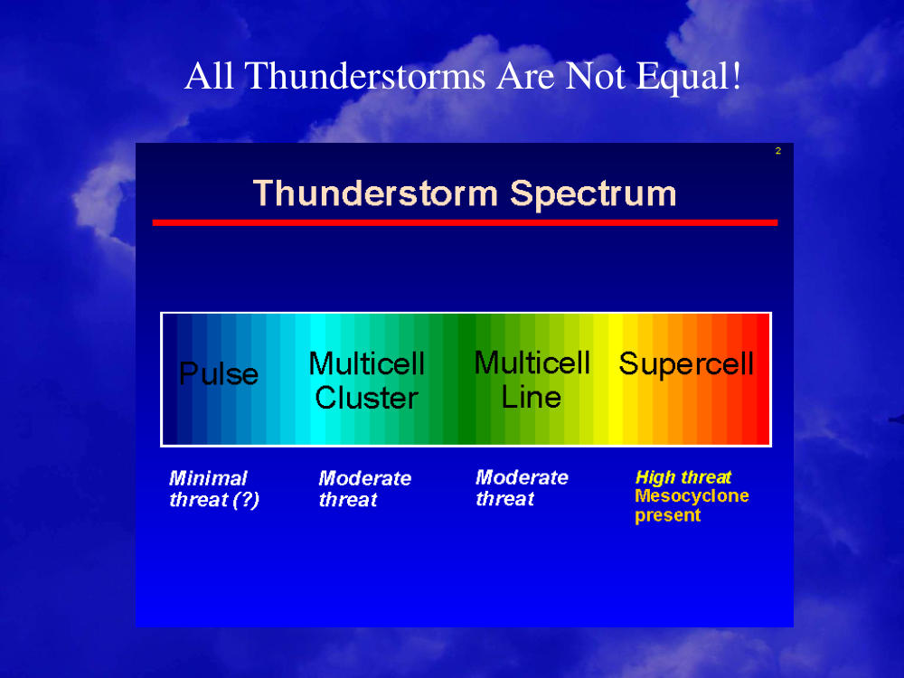

All Thunderstorms Are Not Equal!

## Page 9

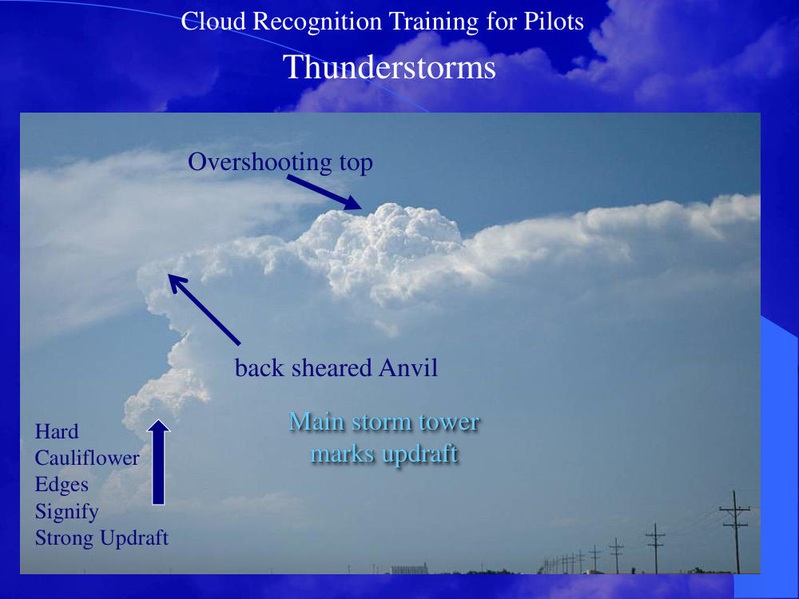

Cloud Recognition Training for Pilots 
Thunderstorms  
Overshooting top 
Main storm tower 
 
marks updraft
 
Main storm tower  
marks updraft 
Hard  
Cauliflower 
Edges 
Signify  
Strong Updraft 
back sheared Anvil

## Page 10

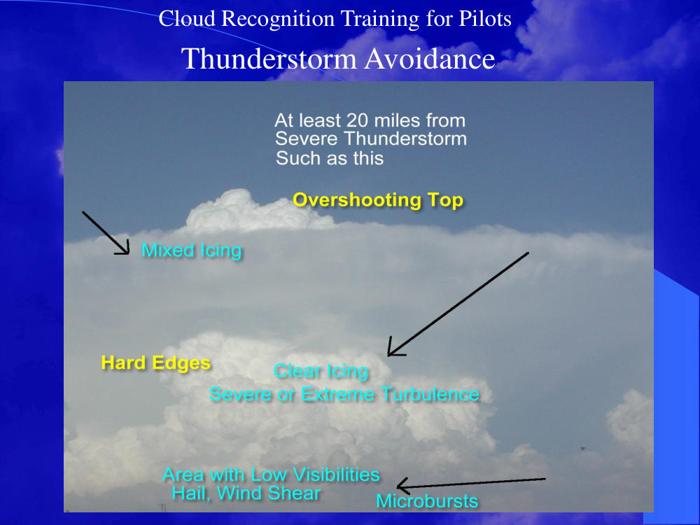

Cloud Recognition Training for Pilots 
Thunderstorm Avoidance

## Page 11

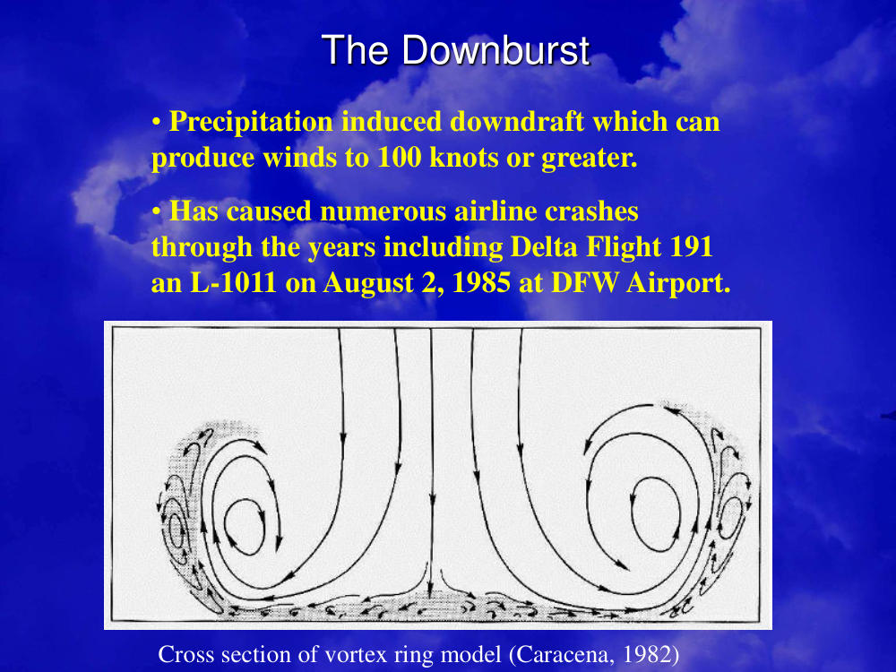

The Downburst
 
The Downburst 
• Precipitation induced downdraft which can 
produce winds to 100 knots or greater. 
• Has caused numerous airline crashes 
through the years including Delta Flight 191 
an L-1011 on August 2, 1985 at DFW Airport.   
Cross section of vortex ring model (Caracena, 1982)

## Page 12

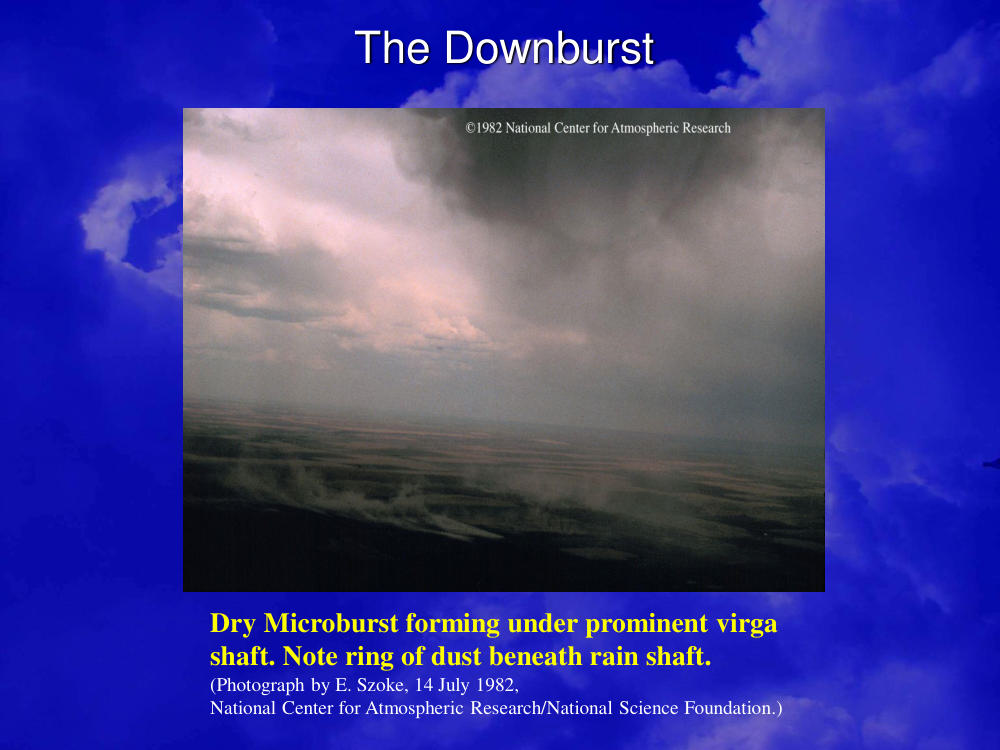

The Downburst
 
The Downburst 
Dry Microburst forming under prominent virga 
shaft. Note ring of dust beneath rain shaft. 
(Photograph by E. Szoke, 14 July 1982,  
National Center for Atmospheric Research/National Science Foundation.)

## Page 13

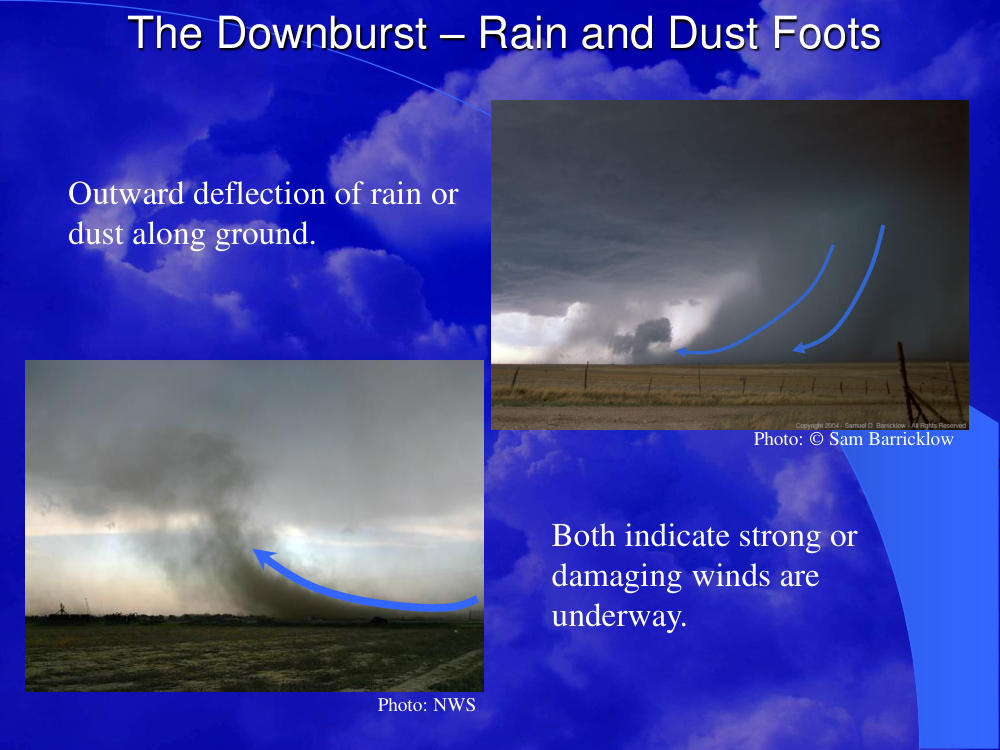

Outward deflection of rain or 
dust along ground. 
Both indicate strong or 
damaging winds are 
underway. 
Photo: NWS 
Photo: © Sam Barricklow 
The Downburst 
– Rain and Dust Foots
 
The Downburst – Rain and Dust Foots

## Page 14

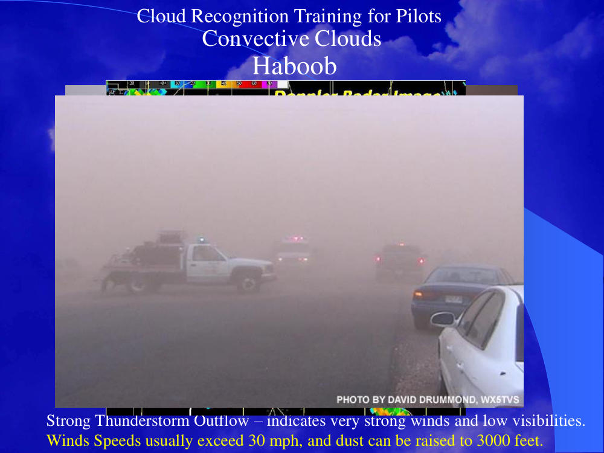

Cloud Recognition Training for Pilots 
Convective Clouds 
Haboob 
Strong Thunderstorm Outflow – indicates very strong winds and low visibilities. 
Winds Speeds usually exceed 30 mph, and dust can be raised to 3000 feet.  
Picture of a habob as it rolled into the southwest side of Lubbock sometime around 8:20 pm  
on 18 June 2009. The picture is by NWS meteorologist Todd Lindley.

## Page 15

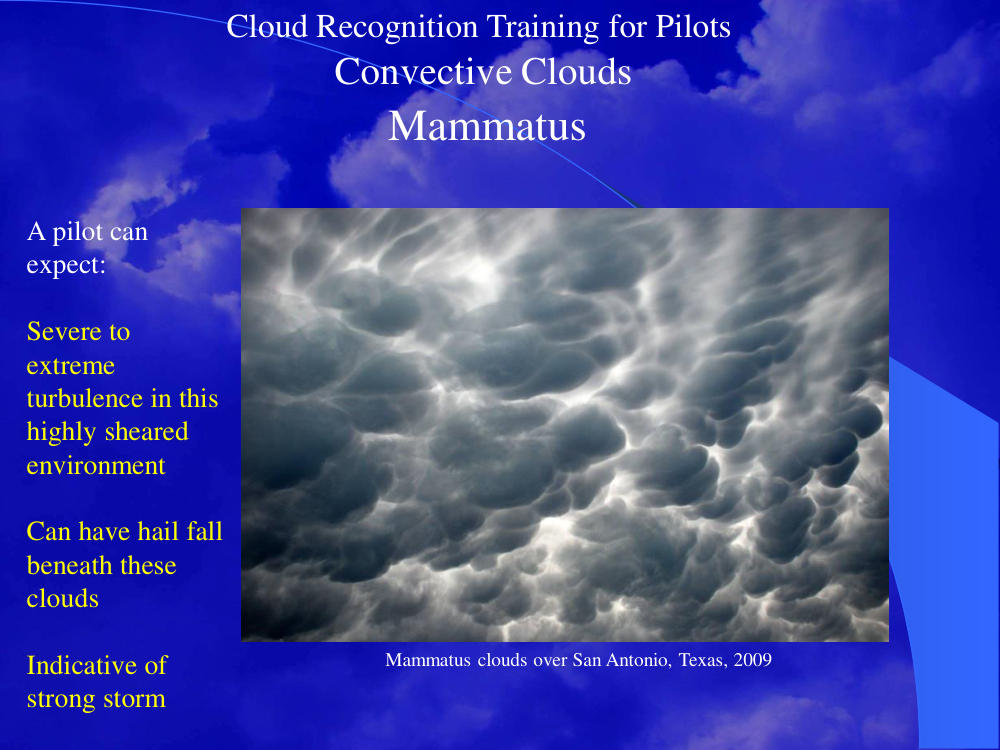

Cloud Recognition Training for Pilots 
Convective Clouds 
Mammatus 
Mammatus clouds over San Antonio, Texas, 2009 
A pilot can 
expect: 
 
Severe to 
extreme 
turbulence in this 
highly sheared 
environment 
 
Can have hail fall 
beneath these 
clouds 
 
Indicative of 
strong storm

## Page 16

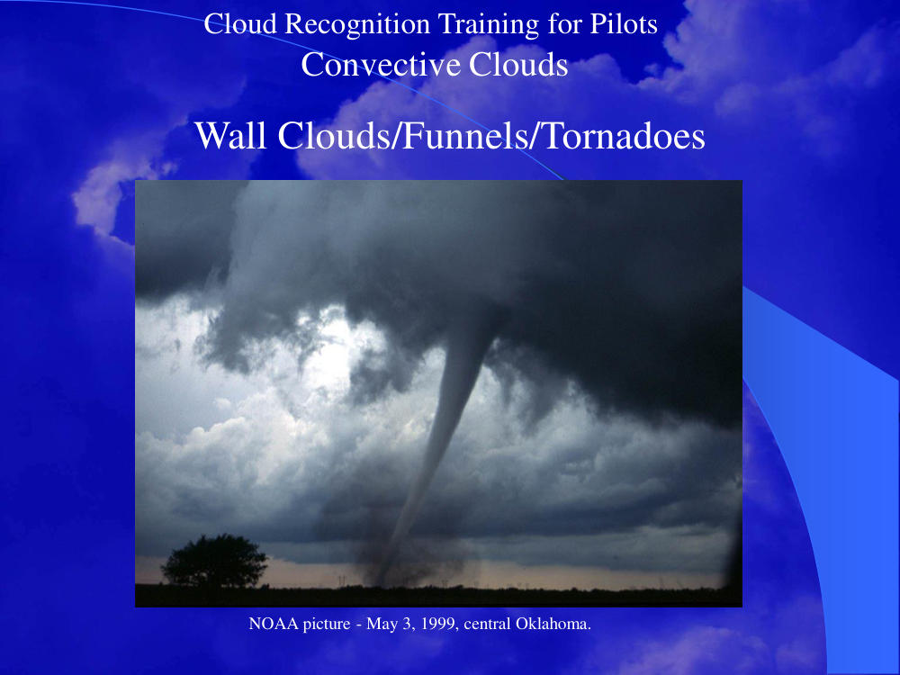

Cloud Recognition Training for Pilots 
Convective Clouds 
Wall Clouds/Funnels/Tornadoes 
NOAA picture - May 3, 1999, central Oklahoma.

## Page 17

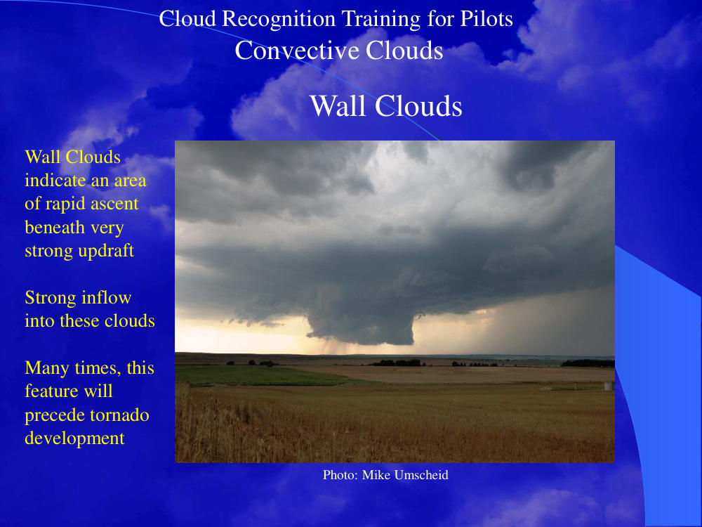

Cloud Recognition Training for Pilots 
Convective Clouds 
Wall Clouds 
Wall Clouds 
indicate an area 
of rapid ascent 
beneath very 
strong updraft 
 
Strong inflow 
into these clouds 
 
Many times, this 
feature will 
precede tornado 
development 
Photo: Mike Umscheid

## Page 18

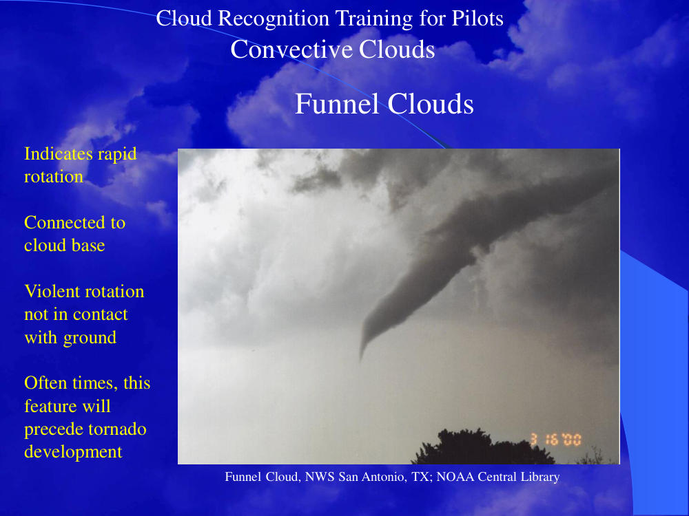

Cloud Recognition Training for Pilots 
Convective Clouds 
Funnel Clouds 
Indicates rapid 
rotation  
 
Connected to 
cloud base 
 
Violent rotation 
not in contact 
with ground 
 
Often times, this 
feature will 
precede tornado 
development 
Funnel Cloud, NWS San Antonio, TX; NOAA Central Library

## Page 19

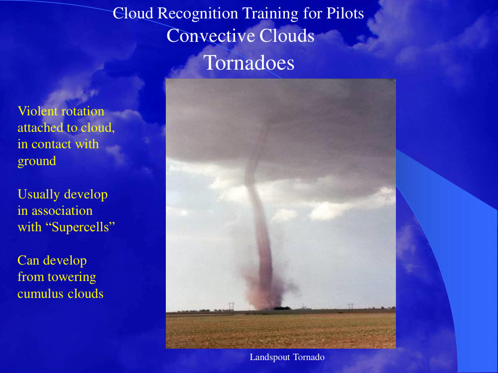

Cloud Recognition Training for Pilots 
Convective Clouds 
Tornadoes 
Violent rotation 
attached to cloud, 
in contact with 
ground  
 
Usually develop 
in association 
with “Supercells” 
 
Can develop 
from towering 
cumulus clouds 
Landspout Tornado

## Page 20

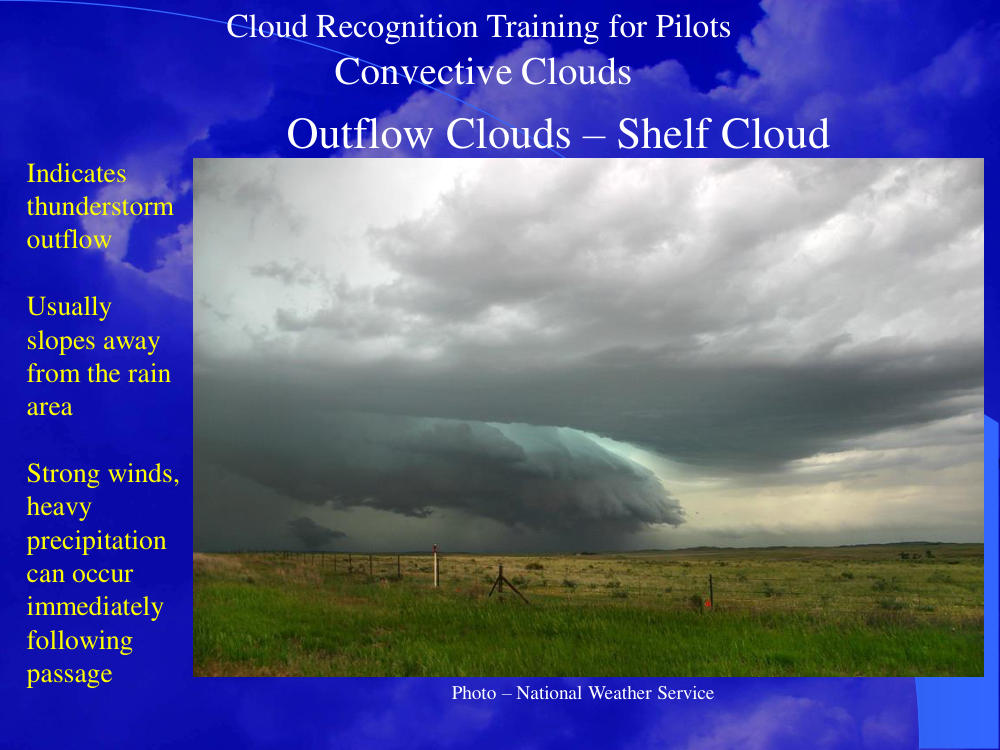

Cloud Recognition Training for Pilots 
Convective Clouds 
Outflow Clouds – Shelf Cloud 
Indicates 
thunderstorm 
outflow 
 
Usually 
slopes away 
from the rain 
area 
 
Strong winds, 
heavy 
precipitation  
can occur 
immediately 
following 
passage 
 
Photo – National Weather Service

## Page 21

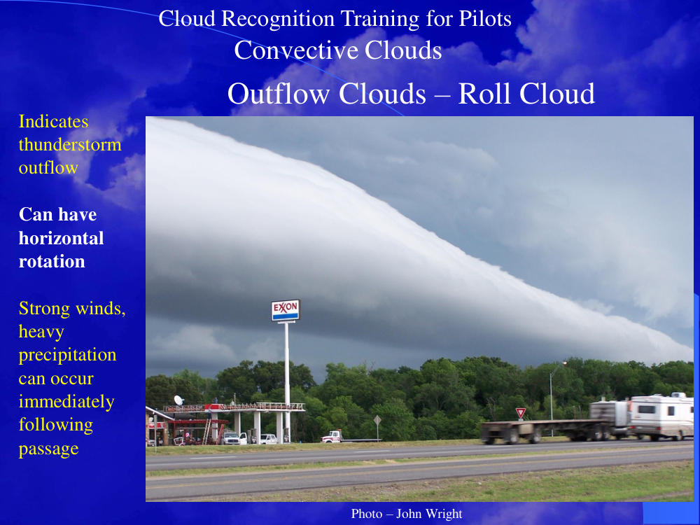

Cloud Recognition Training for Pilots 
Convective Clouds 
Outflow Clouds – Roll Cloud 
Indicates 
thunderstorm 
outflow 
 
Can have 
horizontal 
rotation  
 
Strong winds, 
heavy 
precipitation  
can occur 
immediately 
following 
passage 
 
Photo – John Wright

## Page 22

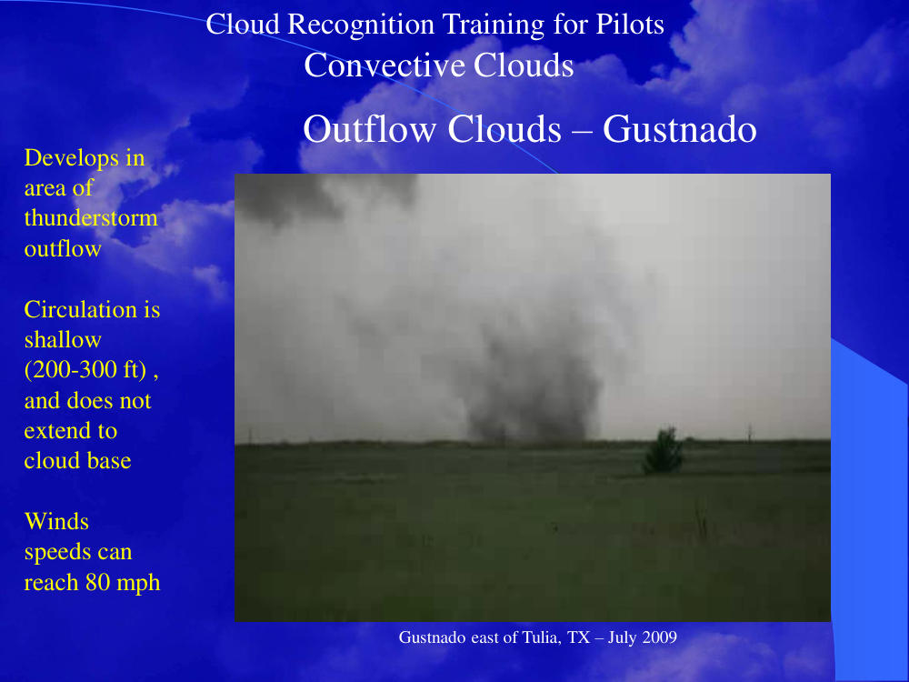

Cloud Recognition Training for Pilots 
Convective Clouds 
Outflow Clouds – Gustnado 
Develops in 
area of 
thunderstorm 
outflow 
 
Circulation is 
shallow  
(200-300 ft) , 
and does not 
extend to 
cloud base 
 
Winds  
speeds can 
reach 80 mph 
Gustnado east of Tulia, TX – July 2009

## Page 23

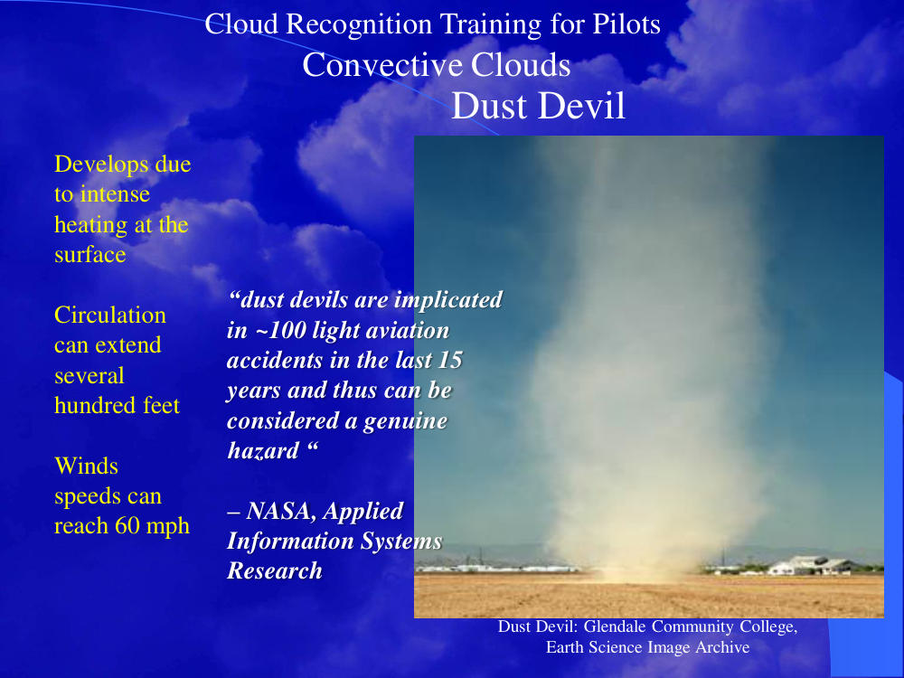

Cloud Recognition Training for Pilots 
Convective Clouds 
Dust Devil 
Develops due 
to intense 
heating at the 
surface 
 
Circulation 
can extend 
several 
hundred feet 
 
Winds  
speeds can 
reach 60 mph 
Dust Devil: Glendale Community College,  
Earth Science Image Archive 
“dust devils are implicated in ~100 light aviation accidents in the last 15 years and thus can be considered a genuine hazard “
 
 – NASA, Applied Information Systems Research
 
“dust devils are implicated 
in ~100 light aviation 
accidents in the last 15 
years and thus can be 
considered a genuine 
hazard “ 
 
– NASA, Applied 
Information Systems 
Research

## Page 24

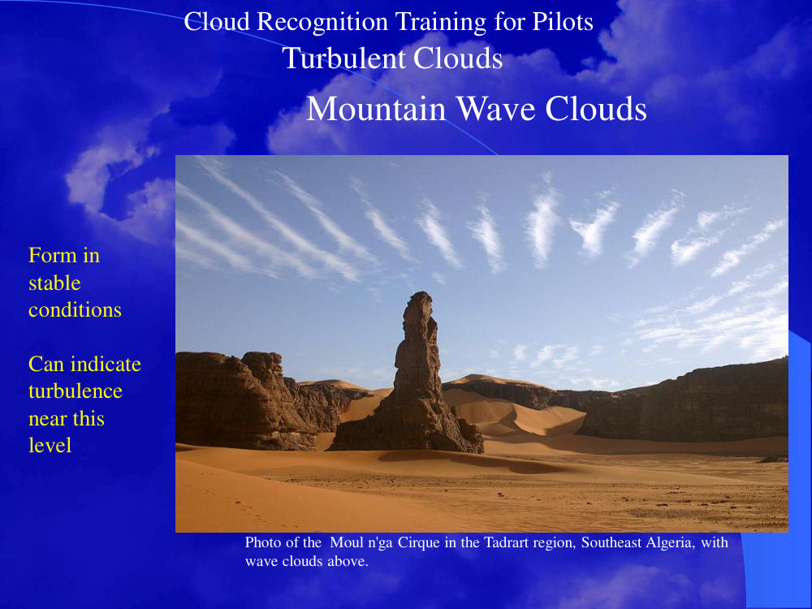

Cloud Recognition Training for Pilots 
Turbulent Clouds 
Mountain Wave Clouds 
Form in 
stable 
conditions 
 
Can indicate 
turbulence 
near this 
level 
Photo of the  Moul n'ga Cirque in the Tadrart region, Southeast Algeria, with 
wave clouds above.

## Page 25

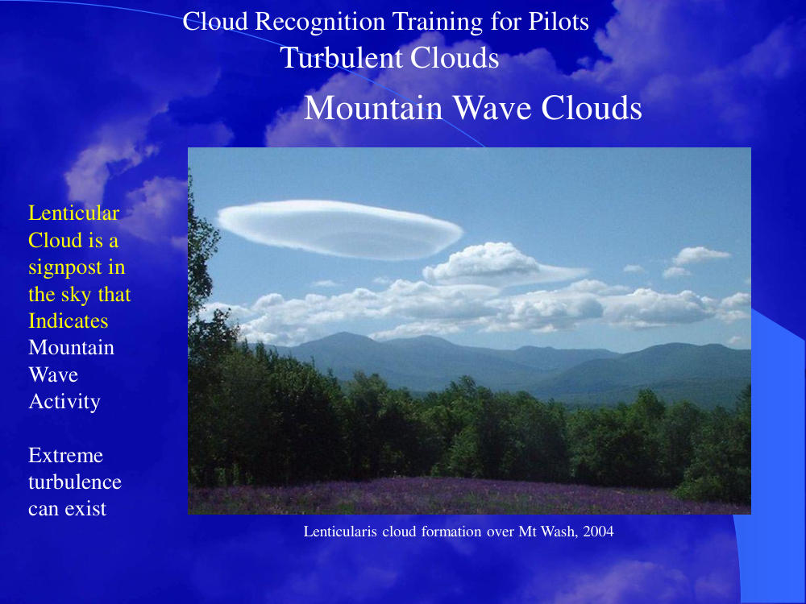

Cloud Recognition Training for Pilots 
Turbulent Clouds 
Mountain Wave Clouds 
Lenticularis cloud formation over Mt Wash, 2004  
Lenticular 
Cloud is a 
signpost in 
the sky that  
Indicates 
Mountain 
Wave 
Activity 
 
Extreme 
turbulence 
can exist

## Page 26

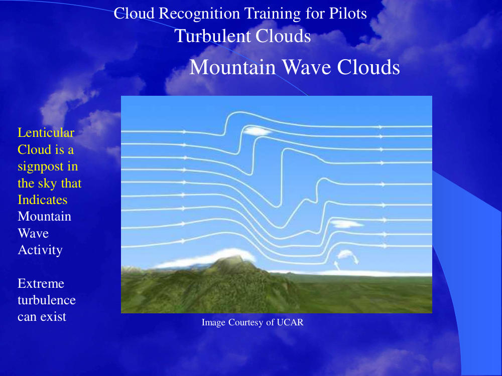

Cloud Recognition Training for Pilots 
Turbulent Clouds 
Mountain Wave Clouds 
Lenticular 
Cloud is a 
signpost in 
the sky that  
Indicates 
Mountain 
Wave 
Activity 
 
Extreme 
turbulence 
can exist 
 
 
Image Courtesy of UCAR

## Page 27

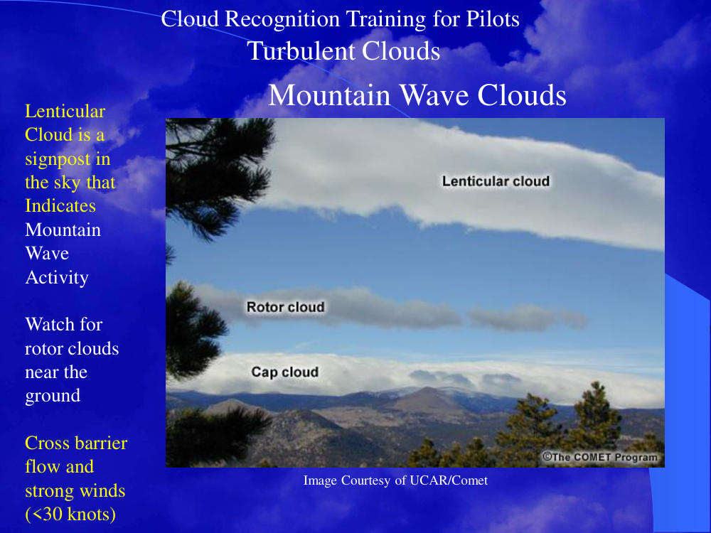

Cloud Recognition Training for Pilots 
Turbulent Clouds 
Mountain Wave Clouds 
Image Courtesy of UCAR/Comet 
Lenticular 
Cloud is a 
signpost in 
the sky that  
Indicates 
Mountain 
Wave 
Activity 
 
Watch for 
rotor clouds 
near the 
ground 
 
Cross barrier 
flow and 
strong winds 
(<30 knots)

## Page 28

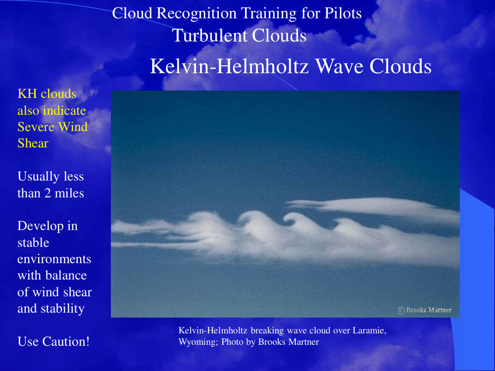

Cloud Recognition Training for Pilots 
Turbulent Clouds 
Kelvin-Helmholtz Wave Clouds 
KH clouds 
also indicate 
Severe Wind 
Shear 
 
Usually less 
than 2 miles 
 
Develop in 
stable 
environments 
with balance 
of wind shear 
and stability 
 
Use Caution! 
 
Kelvin-Helmholtz breaking wave cloud over Laramie,  
Wyoming; Photo by Brooks Martner

## Page 29

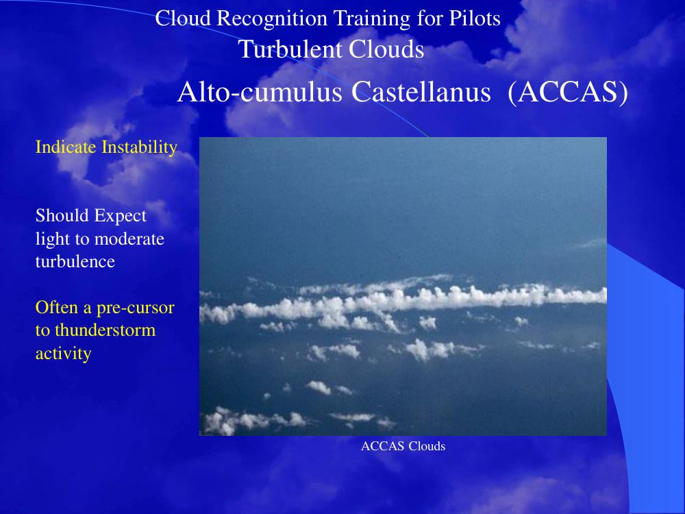

Cloud Recognition Training for Pilots 
Turbulent Clouds 
Alto-cumulus Castellanus  (ACCAS) 
Indicate Instability 
 
 
Should Expect 
light to moderate 
turbulence 
 
Often a pre-cursor 
to thunderstorm 
activity 
 
 
 
ACCAS Clouds

## Page 30

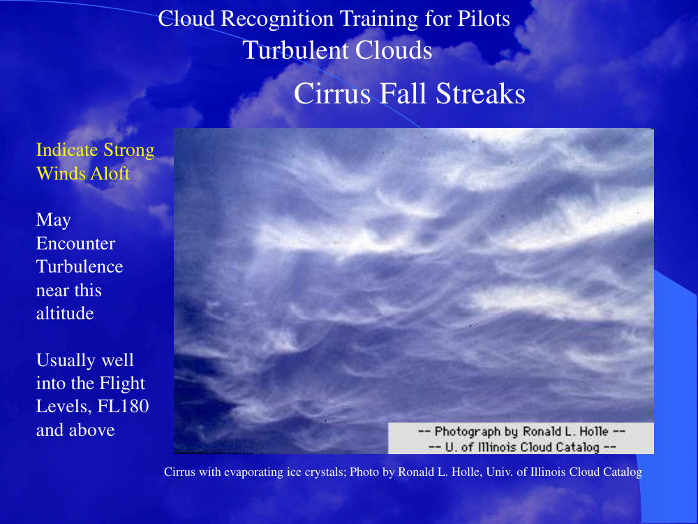

Cloud Recognition Training for Pilots 
Turbulent Clouds 
Cirrus Fall Streaks 
Indicate Strong 
Winds Aloft 
 
May 
Encounter 
Turbulence 
near this 
altitude 
 
Usually well 
into the Flight 
Levels, FL180 
and above 
Cirrus with evaporating ice crystals; Photo by Ronald L. Holle, Univ. of Illinois Cloud Catalog

## Page 31

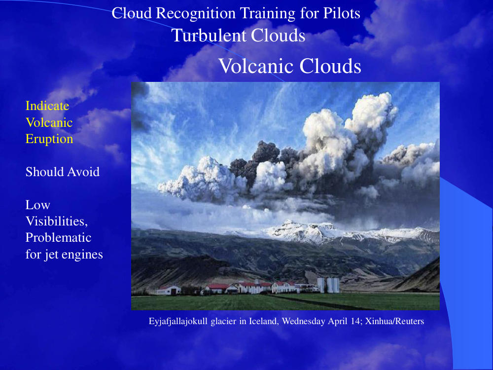

Cloud Recognition Training for Pilots 
Turbulent Clouds 
Volcanic Clouds 
Indicate 
Volcanic 
Eruption 
 
Should Avoid 
 
Low 
Visibilities,  
Problematic 
for jet engines 
 
 
Eyjafjallajokull glacier in Iceland, Wednesday April 14; Xinhua/Reuters

## Page 32

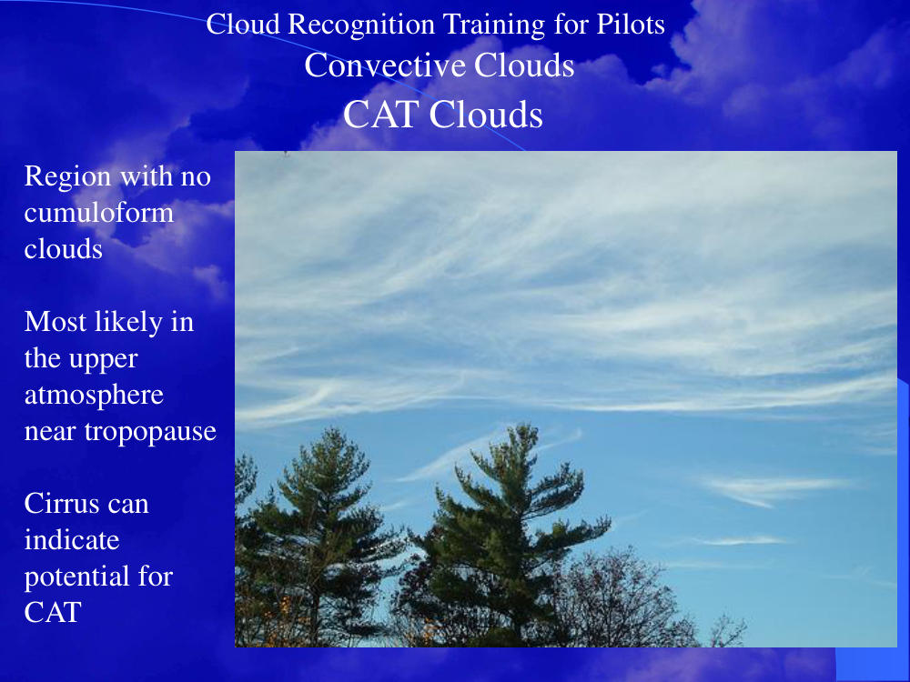

Cloud Recognition Training for Pilots 
Convective Clouds 
CAT Clouds 
Region with no 
cumuloform 
clouds 
 
Most likely in 
the upper 
atmosphere 
near tropopause 
 
Cirrus can 
indicate 
potential for 
CAT

## Page 33

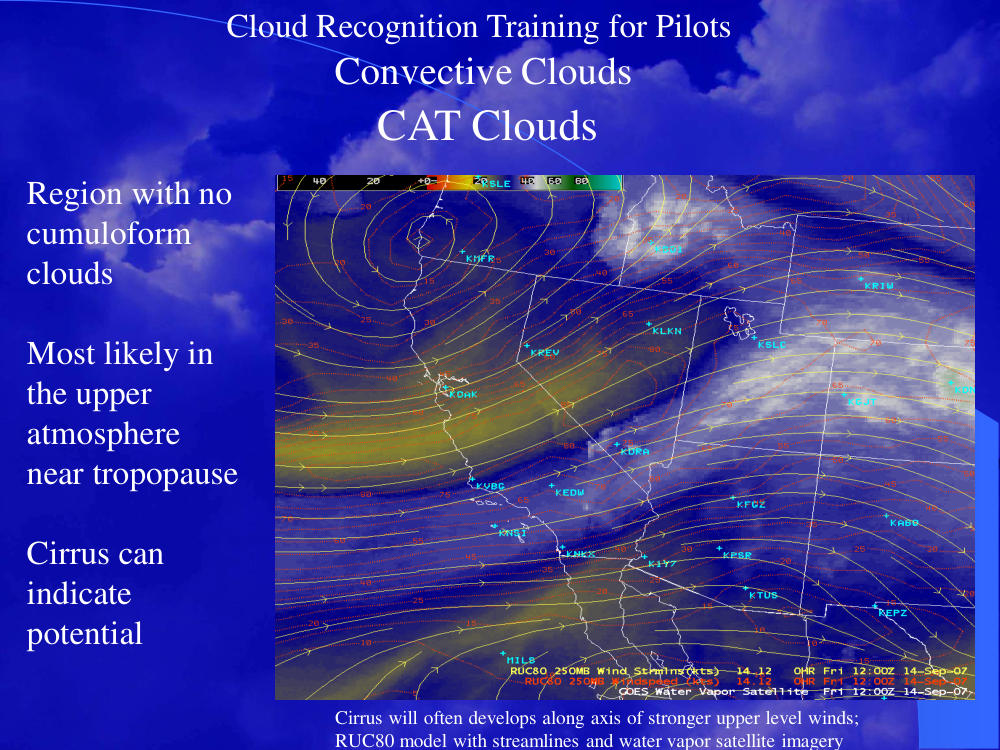

Cloud Recognition Training for Pilots 
Convective Clouds 
CAT Clouds 
Region with no 
cumuloform 
clouds 
 
Most likely in 
the upper 
atmosphere 
near tropopause 
 
Cirrus can 
indicate 
potential 
Cirrus will often develops along axis of stronger upper level winds; 
RUC80 model with streamlines and water vapor satellite imagery

## Page 34

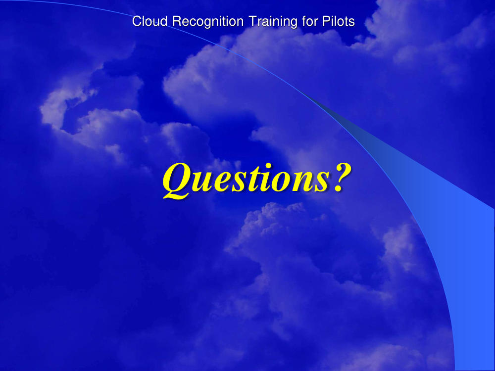

Cloud Recognition Training for Pilots
 
Cloud Recognition Training for Pilots 
Questions?
 
Questions?

## Page 35

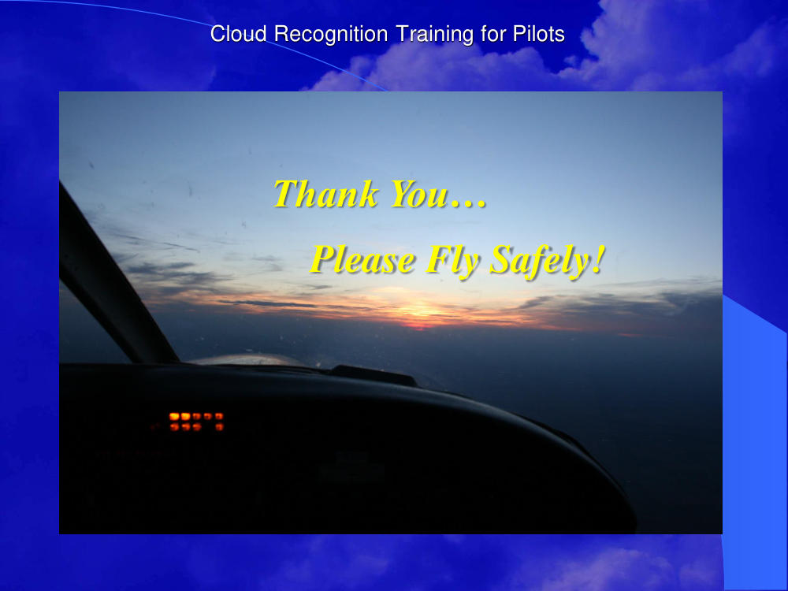

Cloud Recognition Training for Pilots
 
Cloud Recognition Training for Pilots 
Please Fly Safely!
 
Please Fly Safely! 
Thank You…
 
Thank You…
