# Cloud Recognition

> Source: <https://www.weather.gov/lmk/cloud_classification>  
> Section: Clouds/Precipitation  
> Captured: 2026-08-19 06:00 UTC  
> PDF: [cloud-recognition.pdf](cloud-recognition.pdf) · Original HTML: [source/original.html](source/original.html)

---

- [HOME](#)
- [FORECAST](https://www.weather.gov/forecastmaps/)

  - [Local](https://www.weather.gov)
  - [Graphical](https://digital.weather.gov)
  - [Aviation](https://aviationweather.gov)
  - [Marine](https://www.weather.gov/marine/)
  - [Rivers and Lakes](https://water.noaa.gov)
  - [Hurricanes](https://www.nhc.noaa.gov)
  - [Severe Weather](https://www.spc.noaa.gov)
  - [Fire Weather](https://www.weather.gov/fire/)
  - [Sunrise/Sunset](https://gml.noaa.gov/grad/solcalc/)
  - [Long Range Forecasts](https://www.cpc.ncep.noaa.gov)
  - [Climate Prediction](https://www.cpc.ncep.noaa.gov)
  - [Space Weather](https://www.swpc.noaa.gov)
- [PAST WEATHER](https://www.weather.gov/wrh/climate)

  - [Past Weather](https://www.weather.gov/wrh/climate)
  - [Astronomical Data](https://gml.noaa.gov/grad/solcalc/)
  - [Certified Weather Data](https://www.climate.gov/maps-data/dataset/past-weather-zip-code-data-table)
- [SAFETY](https://www.weather.gov/safety/)
- [INFORMATION](https://www.weather.gov/informationcenter)

  - [Wireless Emergency Alerts](https://www.weather.gov/wrn/wea)
  - [Weather-Ready Nation](https://www.weather.gov/wrn/)
  - [Brochures](https://www.weather.gov/owlie/publication_brochures)
  - [Cooperative Observers](https://www.weather.gov/coop/)
  - [Daily Briefing](https://www.weather.gov/briefing/)
  - [Damage/Fatality/Injury Statistics](https://www.weather.gov/hazstat)
  - [Forecast Models](http://mag.ncep.noaa.gov)
  - [GIS Data Portal](https://www.weather.gov/gis/)
  - [NOAA Weather Radio](https://www.weather.gov/nwr)
  - [Publications](https://www.weather.gov/publications/)
  - [SKYWARN Storm Spotters](https://www.weather.gov/skywarn/)
  - [StormReady](https://www.weather.gov/stormready)
  - [TsunamiReady](https://www.weather.gov/tsunamiready/)
  - [Service Change Notices](https://www.weather.gov/notification/)
- [EDUCATION](https://www.weather.gov/education/)
- [NEWS](https://www.weather.gov/news)
- [SEARCH](https://www.weather.gov/search/)

  - Search For

    NWS

    All NOAA
- [ABOUT](https://www.weather.gov/about/)

  - [About NWS](https://www.weather.gov/about/)
  - [Organization](https://www.weather.gov/organization)
  - [For NWS Employees](https://sites.google.com/a/noaa.gov/nws-insider/)
  - [National Centers](https://www.weather.gov/ncep/)
  - [Careers](https://www.noaa.gov/nws-careers)
  - [Contact Us](https://www.weather.gov/contact)
  - [Glossary](../../15-weather-glossaries/national-weather-service-glossary/national-weather-service-glossary.md)
  - [Social Media](https://www.weather.gov/socialmedia)
  - [NWS Transformation](https://www.noaa.gov/NWStransformation)

Local forecast by
"City, St" or ZIP code

Sorry, the location you searched for was not found. Please try another search.

Multiple locations were found. Please select one of the following:

[Location Help](javascript:void(window.open('https://www.weather.gov/ForecastSearchHelp.html','locsearchhelp','status=0,toolbar=0,location=0,menubar=0,directories=0,resizable=1,scrollbars=1,height=500,width=530').focus());)

#topnews.important {
background-color: #d2d2d2;
height: 100%;
margin-bottom: 5px;
position: relative;
}
#topnews .icon {
display: none;
}
#topnews.important .icon {
background-color: #135997;
display: table-cell;
height: 100%;
text-align: center;
vertical-align: middle;
width: 80px;
}
#topnews.important .body {
color: #141414;
display: table-cell;
padding: 10px;
}

# Severe Thunderstorms in the Central Plains and Lower Missouri Valley; Heat Continues in the Southeast and Southwest

Severe thunderstorms capable of large hail and damaging wind gusts are forecast to impact the central Plains into the Lower Missouri Valley through this afternoon. Dangerous heat persists across the southern Plains, Southeast U.S. and Puerto Rico this week, and will return to the Southwest today.
[Read More >](http://www.wpc.ncep.noaa.gov/discussions/hpcdiscussions.php?disc=pmdspd)

Customize Your **Weather.gov**

Enter Your City, ST or ZIP Code

Remember Me

[Privacy Policy](https://www.weather.gov/privacy.php)

LOADING...

Louisville, KY

Weather Forecast Office

# Cloud Classification

[Weather.gov](https://www.weather.gov)
> [Louisville, KY](https://www.weather.gov/lmk)
> Cloud Classification

- [Current Hazards](https://forecast.weather.gov/product.php?site=NWS&issuedby=LMK&product=HWO)

  - [Experimental Graphical Hazardous Weather Outlook](https://www.weather.gov/erh/ghwo?wfo=lmk)
  - [Storm and Precipitation Reports](http://forecast.weather.gov/product.php?site=LMK&issuedby=LMK&product=LSR&format=CI&version=1&glossary=1)
  - [Outlooks](http://www.weather.gov/crh/outlooks)
  - [Submit a Storm Report](https://www.weather.gov/crh/stormreports?sid=lmk)
- [Current Conditions](https://www.weather.gov/)

  - [Satellite](https://www.star.nesdis.noaa.gov/GOES/wfo.php?wfo=lmk)
  - [Local Snowfall Reports](http://www.weather.gov/source/crh/snowmap.html?sid=lmk)
  - [Local Ice Accumulation Reports](http://www.weather.gov/source/crh/icemap.html?sid=lmk)
  - [Observed Precipitation](http://water.noaa.gov/precip/)
  - [Snowfall Analysis](https://www.weather.gov/crh/snowfall)
  - [Observations](https://www.weather.gov/wrh/hazards?obs=true&wfo=lmk)
  - [Local Storm Reports](http://www.weather.gov/source/crh/lsrmap.html?sid=lmk)
- [Radar](https://radar.weather.gov)

  - [Local Enhanced Radar](https://radar.weather.gov/?settings=v1_eyJhZ2VuZGEiOnsiaWQiOiJsb2NhbCIsImNlbnRlciI6Wy04NS45NDQsMzcuOTc1XSwiem9vbSI6OC4xMjY4NzU3MjE4MDM4MiwiZmlsdGVyIjoiV1NSLTg4RCIsImxheWVyIjoiYnJlZl9yYXciLCJzdGF0aW9uIjoiS0xWWCIsInRyYW5zcGFyZW50Ijp0cnVlLCJhbGVydHNPdmVybGF5Ijp0cnVlLCJzdGF0aW9uSWNvbnNPdmVybGF5Ijp0cnVlfSwiYmFzZSI6InN0YW5kYXJkIiwiY291bnR5IjpmYWxzZSwiY3dhIjpmYWxzZSwic3RhdGUiOmZhbHNlLCJtZW51Ijp0cnVlLCJzaG9ydEZ1c2VkT25seSI6dHJ1ZX0%3D#/)
  - [Local Standard Radar (low bandwidth)](https://www.weather.gov/radarliteloop?radarid=KLVX)
  - [Regional Standard Radar (low bandwidth)](https://radar.weather.gov/region/centgrlakes/standard)
- [Forecasts](#)

  - [Experimental Heat Risk](https://www.wpc.ncep.noaa.gov/heatrisk/?wfo=lmk)
  - [Fire Weather](https://www.weather.gov/lmk/fire)
  - [Experimental Probabilistic Quantitative Precipitation Forecast](https://www.weather.gov/crh/pqpf?sid=lmk)
  - [Winter Weather](https://www.weather.gov/lmk/winter)
  - [Forecast Discussion](http://forecast.weather.gov/product.php?site=LMK&issuedby=LMK&product=AFD&format=CI&version=1&glossary=1)
  - [Hourly Forecasts](http://forecast.weather.gov/gridpoint.php?site=lmk&TypeDefault=graphical)
- [Rivers and Lakes](https://water.noaa.gov/wfo/lmk)

  - [National Water Prediction Service (NWPS)](https://water.noaa.gov/wfo/lmk)
- [Climate and Past Weather](https://www.weather.gov/wrh/climate?wfo=lmk)

  - [Local](https://www.weather.gov/wrh/climate?wfo=lmk)
  - [Event Summaries](https://www.weather.gov/lmk/events)
  - [NOAA Climate Service](https://www.climate.gov/)
  - [Drought](http://www.drought.gov/drought/)
  - [Drought Information Statement](https://www.weather.gov/lmk/drought)
- [Local Programs](https://www.weather.gov/lmk/)

  - [Publications](https://www.weather.gov/crh/publications)
  - [Blog](https://www.weather.gov/lmk/blog)
  - [Observations](http://www.weather.gov/lmk/hourly_observations)
  - [Point Forecast](https://www.weather.gov/forecastpoints)
  - [Decision Support - State of Indiana](https://www.weather.gov/ind/INwxbrief)
  - [Decision Support - State of Kentucky](https://www.weather.gov/lmk/KYWxBrief)
  - [Información en Español](https://www.weather.gov/lmk/espanol)
  - [Deaf and Hard of Hearing](https://www.weather.gov/lmk/DeafandHardofHearing)
  - [Event Ready](https://www.weather.gov/crh/eventready?sid=lmk)
  - [Local Climate](http://www.weather.gov/lmk/climate)
  - [Weather Map](http://www.wrh.noaa.gov/map/?wfo=lmk&obs=true&obs_type=tempcur)
  - [Weather History](https://www.weather.gov/lmk/wxhistory)
  - [Travel Forecasts](http://www.weather.gov/lmk/recreation)
  - [Spot Fire Forecast Request](https://www.weather.gov/spot/)
  - [Storm Reports](https://www.spc.noaa.gov/exper/reports/)
  - [El Nino/La Nina](http://www.weather.gov/lmk/enso_info)
  - [Aviation Forecasts](http://www.aviationweather.gov/)
  - [Spotter Training](https://www.weather.gov/lmk/skywarn)
  - [Science and Tech](http://www.weather.gov/lmk/scienceandtechnology)
  - [Weather Radio](http://www.weather.gov/lmk/weather_radio-lmk)
  - [Text Products](http://www.weather.gov/lmk/productguide)
  - [Past Kentucky Derby Weather](https://www.weather.gov/lmk/derby_oaks_thunder)
  - [Weather Safety](http://www.weather.gov/lmk/weathersafetyrules)
  - [Tornado History](http://www.weather.gov/lmk/tornado_climatology)
  - [Items of Interest](http://www.weather.gov/lmk/optional_links)
  - [Student Programs](http://weather.gov/lmk/students)

**Cloud Classification and Characteristics**

**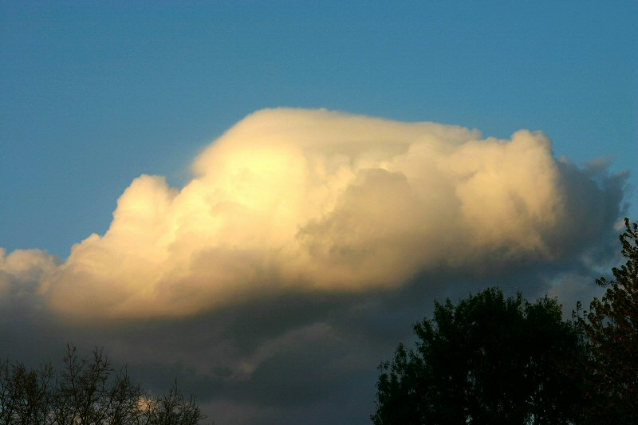**

 **Clouds** are classified according to their height above and appearance (texture) from the ground. 

 The following cloud *roots* and translations summarize the components of this ***classification system**:* 

 1) Cirro-: curl of hair, high.             3) Strato-: layer.                                   5) Cumulo-: heap.

 2) Alto-: mid.                                      4) Nimbo-: rain, precipitation.   

---

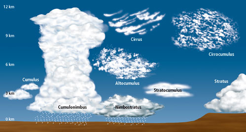

*Figure from:* *www.jason.org/digital\_library/201.aspx (defunct)*

***{ Refer to the chart below for examples of the various types of clouds. }*** 

---

High-level clouds:  

High-level clouds occur above about 20,000 feet and are given the prefix "cirro-". Due to cold tropospheric temperatures at these levels, the clouds primarily are  composed of ice crystals,  and often appear thin, streaky, and white (although a low sun angle, e.g., near sunset, can create an array  of color on the clouds).

   The three main types of *high clouds* are cirrus, cirrostratus, and cirrocumulus. 

 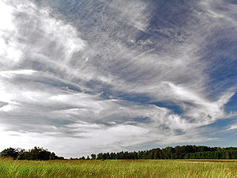   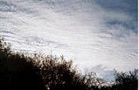   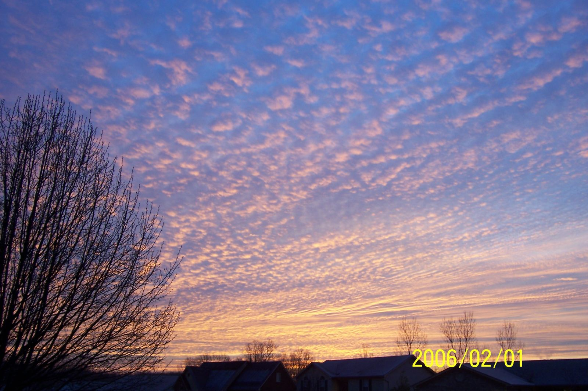

        Cirrus clouds over a field                                       cirrostratus                                       cirrocumulus Floyd County IN. 

                                                                                                                                                                  Ben Schott, NWS 

**Cirrus clouds** are wispy, feathery, and composed entirely of ice crystals. They often are the first sign of an approaching warm front or upper-level jet streak.

Unlike cirrus, **cirrostratus clouds** form more of a widespread, veil-like layer (similar to what stratus clouds do in low levels).  When sunlight or moonlight passes through the hexagonal-shaped ice crystals of cirrostratus clouds, the light is dispersed or refracted (similar to light passing through a prism) in such a way that a familiar ring or halo may form. As a warm front approaches, cirrus clouds tend to thicken into cirrostratus, which may, in turn, thicken and lower into altostratus, stratus, and even nimbostratus. 

Finally, **cirrocumulus clouds** are layered clouds permeated with small cumuliform lumpiness. They also may line up in streets or rows of clouds across the sky denoting localized areas of ascent (cloud axes) and descent (cloud-free channels). 

---

Mid-level clouds:

The bases of clouds in the middle level of the troposphere, given the prefix "alto-", appear between 6,500 and 20,000 feet. Depending on the altitude, time of year, and vertical temperature structure of the troposphere, these clouds may be composed of liquid water droplets, ice crystals, or a combination of the two, including supercooled droplets (i.e., liquid droplets whose temperatures are below freezing). 

The two main type of *mid-level clouds* are altostratus and altocumulus. 

        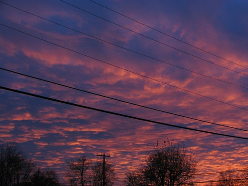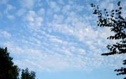

     Altostratus clouds over Kentucky               Altocumulus (sunset 23 Nov. 2005)

**Altostratus clouds** are "strato" type clouds (see below) that possess a flat and uniform type texture in the mid levels. They frequently indicate the approach of a warm front and may thicken and lower into stratus, then nimbostratus resulting in rain or snow. However, altostratus clouds themselves do not produce significant precipitation at the surface, although sprinkles or occasionally light showers may occur from a thick alto-stratus deck. 

**Altocumulus clouds** exhibit "cumulo" type characteristics (see below) in mid levels, i.e., heap-like clouds with convective elements.  Like *cirrocumulus*, altocumulus may align in rows or streets of clouds, with cloud axes indicating localized areas of ascending, moist air, and clear zones between rows suggesting locally descending, drier air. Altocumulus clouds with some vertical extent may denote the presence of elevated instability, especially in the morning, which could become boundary-layer based and be released into deep convection during the afternoon or evening. 

 

---

Low-level clouds:

*Low-level clouds* are not given a prefix, although their names are derived from "strato-" or "cumulo-", depending on their characteristics. Low clouds occur below 6500 feet, and normally consist of liquid water droplets or even supercooled droplets, except during cold winter storms when ice crystals (and snow) comprise much of the clouds.

The two main types of low clouds include stratus, which develop horizontally, and cumulus, which develop vertically.

**Stratus clouds** are uniform and flat, producing a gray layer of cloud cover which may be precipitation-free or may cause periods of light precipitation or drizzle.  *Low stratus decks* are common in winter in the Ohio Valley, especially behind a storm system when cold, dismal, gray weather can linger for several hours or even a day or two.

         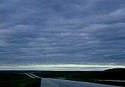            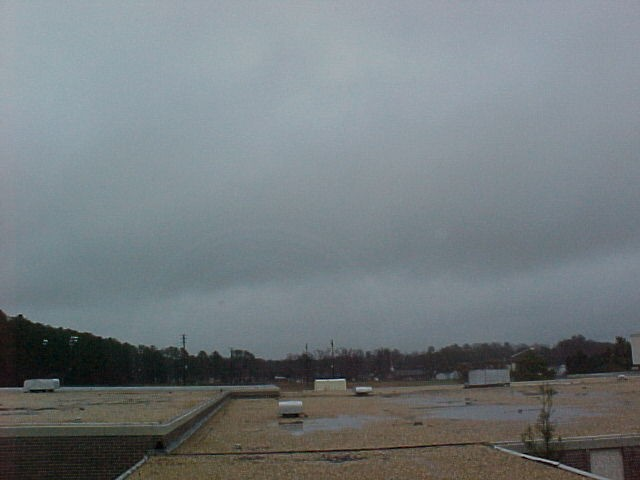

                       Stratocumulus                                                    NImbostratus                        

Stratocumulus clouds are hybrids of layered stratus and cellular cumulus, i.e., individual cloud elements, characteristic of cumulo type clouds, clumped together in a continuous distribution, characteristic of strato type clouds. Stratocumulus also can be thought of as a layer of cloud clumps with thick and thin areas. These clouds appear frequently in the atmosphere, either ahead of or behind a frontal system.

Nimbostratus clouds are generally thick, dense stratus or stratocumulus clouds producing steady rain or snow . 

In contrast to layered, **horizontal stratus**, cumulus clouds are more cellular (individual) in nature, have flat bottoms and rounded tops, and grow vertically. In fact, their name depends on the degree of vertical development. For instance, scattered cumulus clouds showing little vertical growth on an otherwise sunny day used to be termed "*cumulus humilis*" or "*fair weather cumulus*," although normally they simply are referred to just as cumulus or flat cumulus.

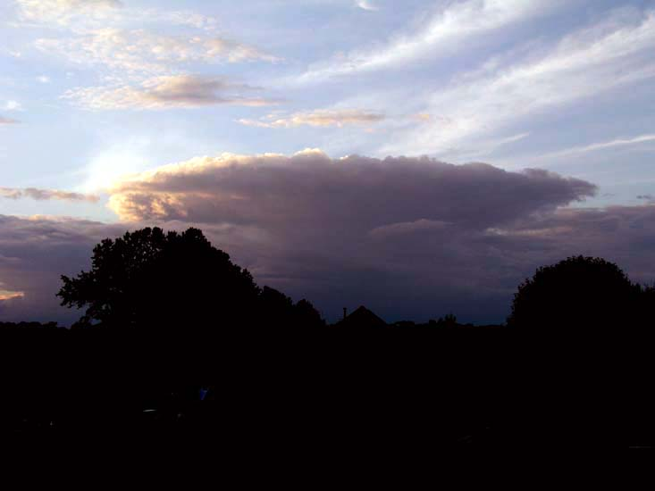                  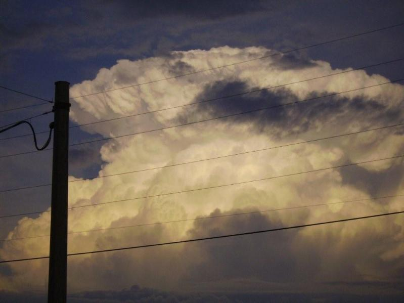

        Mayfield, Ky - Approaching Cumulus                         Glasgow, Ky June 2, 2009 - Mature cumulus

A **cumulus cloud** that exhibits significant vertical development (but is not yet a thunderstorm) is called cumulus congestus or towering cumulus. If enough atmospheric instability, moisture, and lift are present, then strong updrafts can develop in the cumulus cloud leading to a mature, deep cumulonimbus cloud, i.e., a thunderstorm producing heavy rain. In addition, cloud electrification occurs within cumulonimbus clouds due to many collisions between charged water droplet, graupel (ice-water mix), and ice crystal particles, resulting in lightning and thunder.   

**Cumulus clouds are all capable of producing some serious storms!!!**

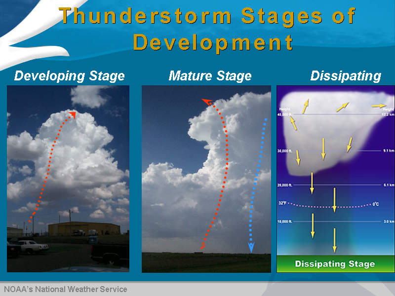

---

Other interesting clouds:

Wall Cloud:  A localized lowering from the rain-free base of a strong thunderstorm. The lowering denotes a storm's updraft where rapidly rising air causes lower pressure just below the main updraft, which enhances condensation and cloud formation just under the primary cloud base. Wall clouds take on many shapes and sizes. Some exhibit strong upward motion and cyclonic rotation, leading to tornado formation, while others do not rotate and essentially are harmless. 

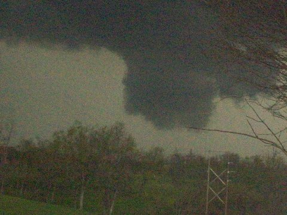          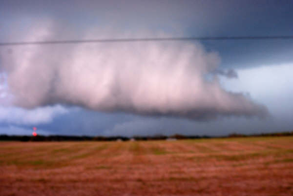

             Henderson County, Ky                                     Taylor County, Ky

Shelf Cloud: A low, horizontal, sometimes wedge-shaped cloud associated with the leading edge of a thunderstorm?s outflow or gust front and potentially strong winds. Although often appearing ominous, shelf clouds normally do not produce tornadoes.  

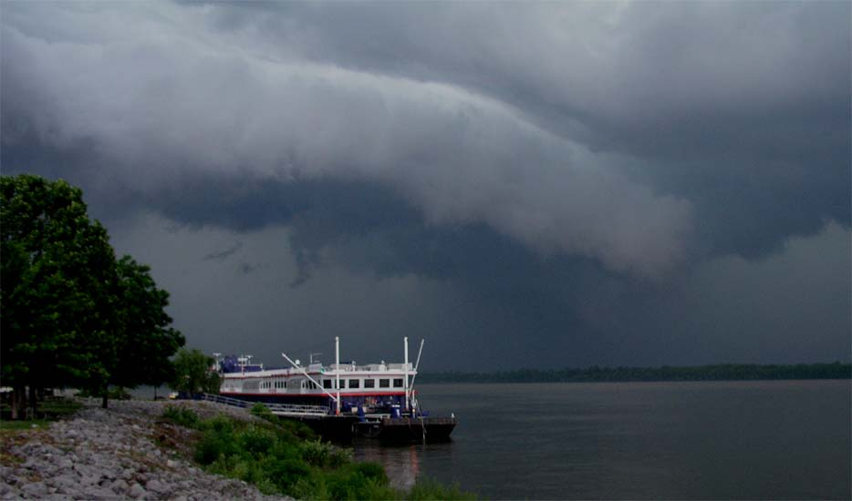                 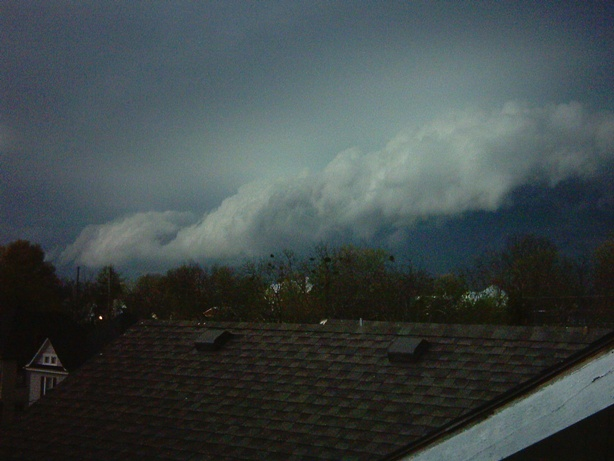

                          Paducah, Ky                                                               Winchester, Ky

Fractus: Low, ragged stratiform or cumuliform cloud elements that normally are unattached to larger thunderstorm or cold frontal cloud bases. Also known as scud, fractus clouds can look ominous, but by themselves are not dangerous.

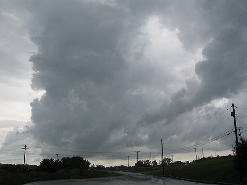            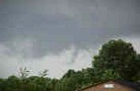

                        Berea, Ky                                                  Elkhart, IN

Mammatus: Drooping underside (pouch-like appearance) of a cumulonimbus cloud in its latter stage of development. Mammatus most often are seen hanging from the anvil of a severe thunderstorm, but do not produce severe weather. They can accompany non-severe storms as well.  

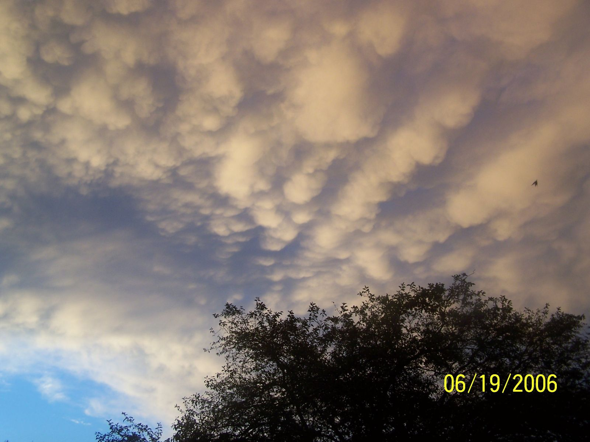               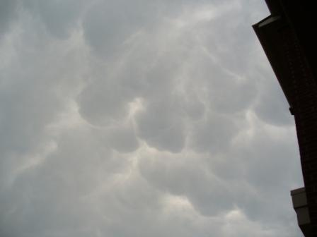

                     Lexington, Ky                                                 Jeffersontown, Ky

Contrail: Narrow, elongated cloud formed as jet aircraft exhaust condenses in cold air at high altitudes, indicative of upper level humidity and wind drift.

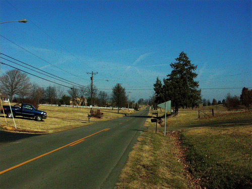                  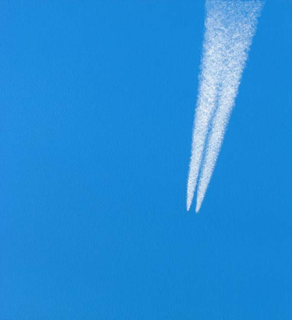

                           Contrails                                    Contrails in the sky from jets

Fog: Layer of stratus clouds on or near the ground. Different types include radiation fog (forms overnight and burns off in the morning) and advection fog. 

        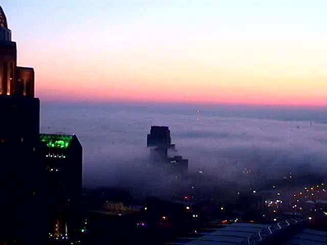               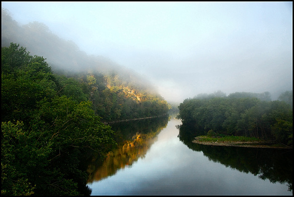

             Downtown Louisville, Ky                                 Fog over Kentucky River

Hole-Punch Clouds: Also known as a fallstreak hole, this type of cloud is usually formed when the water temperature in the cloud is below freezing but the water has not frozen.  When sections of the water starts to freeze, the surrounding water vapor will also freeze and begin to descend. This leaves a rounded hole in the cloud.

The theory on its creation is that a disruption of the cloud layer stability, which can be caused by a passing jet aircraft, creates a descending motion that can lead to the stimulation of evaporation, producing a hole.

        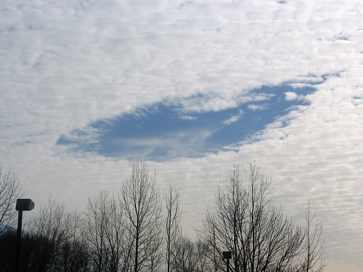               [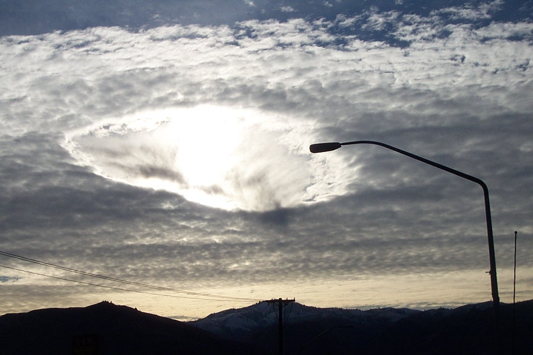](https://www.wrh.noaa.gov/otx/photo_gallery/hole_punch_clouds.php)

                       Louisville, KY                                          Wenatchee, WA

---

**Other Interesting pictures:**

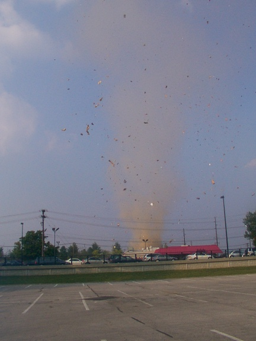            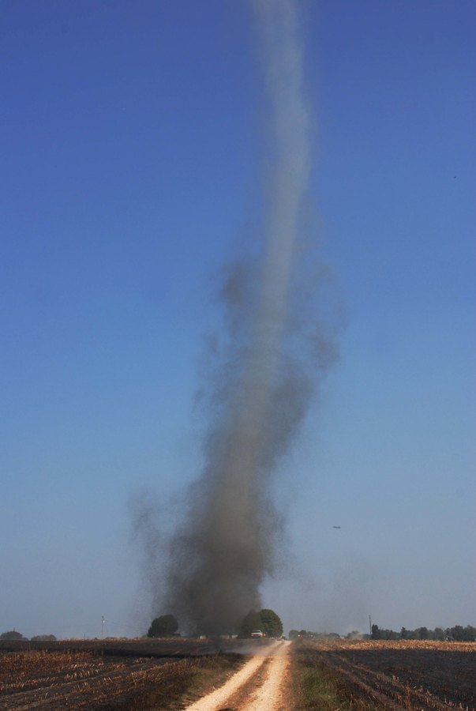

                Dust devil in Lexington, KY                     Dust devil in Glendale, KY

---

**STANDARD CLOUD TYPE CHART**

|  |  |  |  |
| --- | --- | --- | --- |
|  |  | 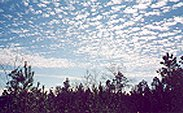 | 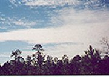 |
| **Cirrus (above)** | **Cirrostratus (above)** | **Cirrocumulus (above)** | **Altostratus (above)** |
|  | 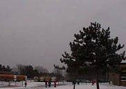 |  | 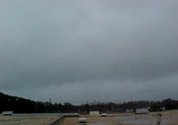 |
| **Altocumulus (above)** | **Stratus (above)** | **Stratocumulus (above)** | **Nimbostratus (above)** |
| 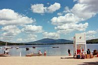 | 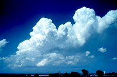 | 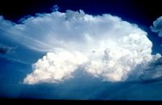 | 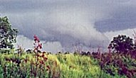 |
| **Cumulus (above)** | **Cumulus congestus (above)** | **Cumulonimbus (above)** | **Wall cloud (above)** |
| 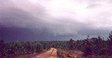 |  | 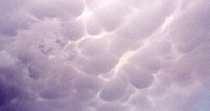 | 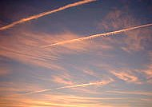 |
| **Shelf cloud (above)** | **Fractus (scud) (above)** | **Mammatus (above)** | **Contrails (above)** |
| 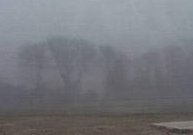 | **Cloud chart showing the different types of high, mid, and  low-level clouds, as well as a number of other interesting  cloud types and formations.** | | |
| **Fog (above)** |

---

[ Back to Training Documents](https://www.weather.gov/lmk/trainingdoc)

---

[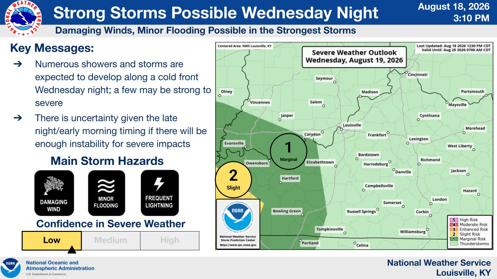Weather Story](https://www.weather.gov/lmk/weatherstory)

[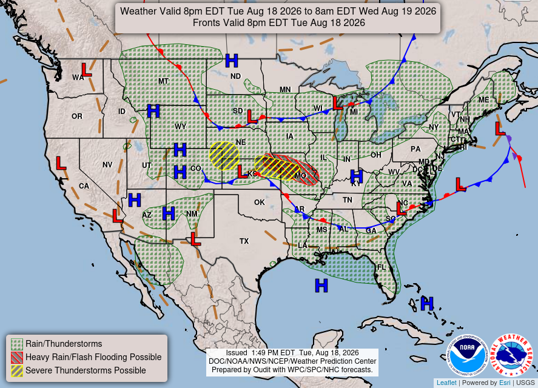Weather Map](https://www.wpc.ncep.noaa.gov/national_forecast/natfcst.php)

[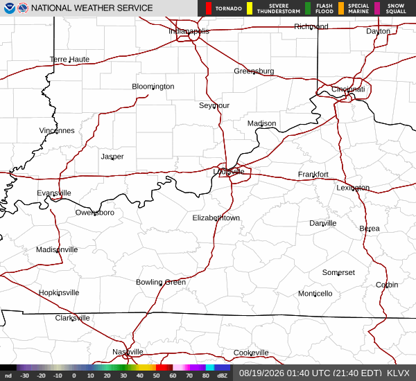Local Radar](https://radar.weather.gov/?settings=v1_eyJhZ2VuZGEiOnsiaWQiOiJsb2NhbCIsImNlbnRlciI6Wy04NS45NDQsMzcuOTc1XSwibG9jYXRpb24iOm51bGwsInpvb20iOjguMTI2ODc1NzIxODAzODIsImZpbHRlciI6IldTUi04OEQiLCJsYXllciI6InNyX2JyZWYiLCJzdGF0aW9uIjoiS0xWWCJ9LCJhbmltYXRpbmciOmZhbHNlLCJiYXNlIjoic3RhbmRhcmQiLCJhcnRjYyI6ZmFsc2UsImNvdW50eSI6ZmFsc2UsImN3YSI6ZmFsc2UsInJmYyI6ZmFsc2UsInN0YXRlIjpmYWxzZSwibWVudSI6dHJ1ZSwic2hvcnRGdXNlZE9ubHkiOnRydWUsIm9wYWNpdHkiOnsiYWxlcnRzIjowLjgsImxvY2FsIjowLjYsImxvY2FsU3RhdGlvbnMiOjAuOCwibmF0aW9uYWwiOjAuNn19#/)

[  Follow us on X](https://www.twitter.com/NWSLouisville)

[  Follow us on Facebook](https://www.facebook.com/NWSLouisville)

[  Follow us on YouTube](https://www.youtube.com/user/NWSLouisville)

[  LMK RSS Feed](https://www.weather.gov/rss_page.php?site_name=lmk)

.footer-column-head a:link, .footer-column-head a:visited {
color: #ED7A08;
}

[Current Hazards](http://forecast.weather.gov/hazards/?wfo=lmk)

[Hazardous Weather Outlook](http://forecast.weather.gov/product.php?site=lmk&product=HWO&issuedby=LMK)
[Storm Prediction Center](http://www.spc.noaa.gov/)
[Submit a Storm Report](https://www.weather.gov/crh/stormreports?sid=lmk)
[Advisory/Warning Criteria](https://www.weather.gov/media/lmk/pdf/LMK_Warning_and_Advisory_Criteria_2025.pdf)

[Radar](http://radar.weather.gov/)

[Fort Knox](http://radar.weather.gov/radar.php?rid=LVX)
[Evansville](http://radar.weather.gov/radar.php?rid=VWX)
[Fort Campbell](http://radar.weather.gov/radar.php?rid=HPX)
[Nashville](http://radar.weather.gov/radar.php?rid=OHX)
[Jackson](http://radar.weather.gov/radar.php?rid=JKL)
[Wilmington](http://radar.weather.gov/radar.php?rid=ILN)

[Current Conditions](http://w2.weather.gov/lmk/currentweather)

[Hourly Observations](http://www.weather.gov/lmk/hourly_observations)
[KY Mesonet](http://www.weather.gov/nwsexit.php?site=nws&url=http://www.kymesonet.org/)

[Latest Forecasts](http://w2.weather.gov/lmk/#)

[El Nino and La Nina](http://www.weather.gov/lmk/enso_info)
[Climate Prediction](http://www.cpc.ncep.noaa.gov/)
[Central U.S. Weather Stories](http://www.weather.gov/crh/wxstorygrid)
[1-Stop Winter Forecast](http://www.weather.gov/lmk/dss)
[Aviation](http://www.aviationweather.gov/)
[IDSS Forecast Points](https://www.weather.gov/forecastpoints)
[Air Quality](http://www.weather.gov/lmk/aqi)
[Fire Weather](http://www.weather.gov/lmk/fire)
[Recreation Forecasts](http://www.weather.gov/lmk/recreation)
[1-Stop Drought](http://www.weather.gov/lmk/drought)
[Event Ready](https://www.weather.gov/crh/eventready?sid=lmk)
[1-Stop Severe Forecast](http://www.weather.gov/lmk/DSS_Severe)

[Past Weather](https://www.weather.gov/lmk/climate)

[Climate Graphs](https://www.weather.gov/lmk/climate_graphs)
[1-Stop Climate](https://www.weather.gov/lmk/one-stop-climate)
[CoCoRaHS](http://www.cocorahs.org)
[Local Climate Pages](http://www.weather.gov/lmk/climate)
[Tornado History](http://www.weather.gov/lmk/tornado_climatology)
[Past Derby/Oaks/Thunder Weather](https://www.weather.gov/lmk/derby_oaks_thunder)
[Football Weather](https://www.weather.gov/lmk/football_weather)

[Local Information](https://www.weather.gov/lmk/optional_links)

[About the NWS](https://www.weather.gov/jetstream/nws_intro)
[Forecast Discussion](http://forecast.weather.gov/product.php?site=lmk&product=AFD&issuedby=LMK)
[Items of Interest](http://www.weather.gov/lmk/optional_links)
[Spotter Training](https://www.weather.gov/lmk/skywarn)
[Regional Weather Map](http://www.wrh.noaa.gov/map/?wfo=lmk&obs=true&obs_type=tempcur)
[Decision Support Page](http://www.weather.gov/lmk/dss)
[Text Products](http://www.weather.gov/lmk/productguide)
[Science and Technology](http://www.weather.gov/lmk/scienceandtechnology)
[Outreach](http://www.weather.gov/lmk/outreach)
[LMK Warning Area](http://www.weather.gov/lmk/lmkwarningarea)
[About Our Office](http://www.weather.gov/lmk/about_us)
[Station History](http://www.weather.gov/lmk/lmk_history)
[Hazardous Weather Outlook](http://forecast.weather.gov/product.php?site=lmk&product=HWO&issuedby=LMK)
[Local Climate Page](http://www.weather.gov/lmk/climate)
[Tornado Machine Plans](https://www.weather.gov/media/lmk/LMKtornadomachine.pdf)
[Weather Enterprise Resources](https://www.weather.gov/enterprise/)

[Weather Safety](https://www.weather.gov/lmk/preparedness)

[Weather Safety Rules](https://www.weather.gov/safety/)
[HEAT.gov](https://www.heat.gov/)
[Weather Radio](http://www.weather.gov/lmk/weather_radio-lmk)
[SKYWARN](https://www.weather.gov/lmk/skywarn)

[US Dept of Commerce](http://www.commerce.gov)
[National Oceanic and Atmospheric Administration](http://www.noaa.gov)
[National Weather Service](https://www.weather.gov)
Louisville, KY
 6201 Theiler Lane
Louisville, KY 40229-1476

502-969-8842

[Comments? Questions? Please Contact Us.](mailto:nws.louisville@noaa.gov)

[Disclaimer](https://www.weather.gov/disclaimer)
[Information Quality](http://www.cio.noaa.gov/services_programs/info_quality.html)
[Help](https://www.weather.gov/help)
[Glossary](https://www.weather.gov/glossary)

[Privacy Policy](https://www.weather.gov/privacy)
[Freedom of Information Act (FOIA)](https://www.noaa.gov/foia-freedom-of-information-act)
[About Us](https://www.weather.gov/about)
[Career Opportunities](https://www.weather.gov/careers)
