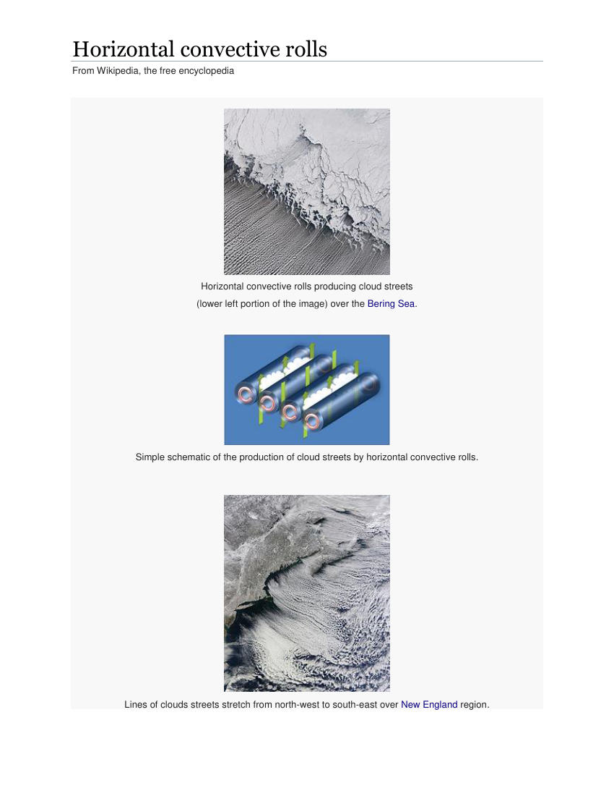
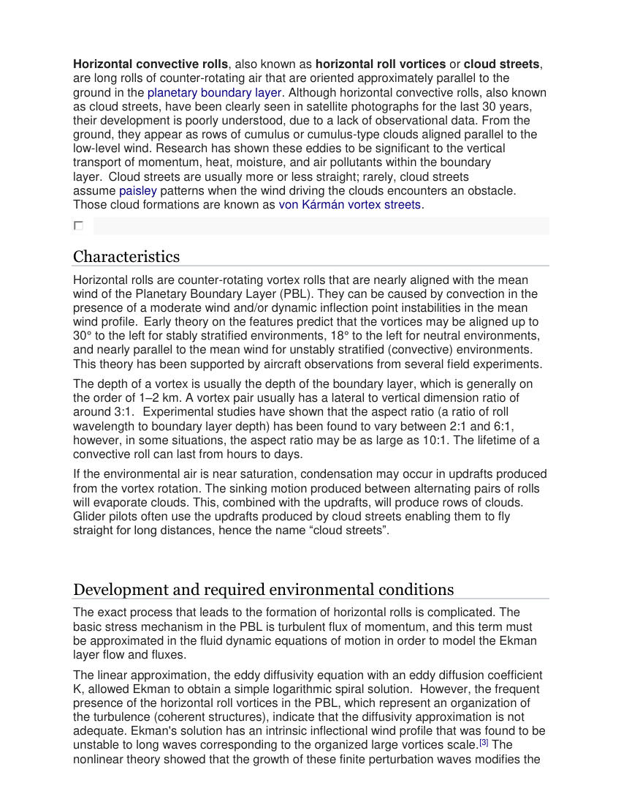
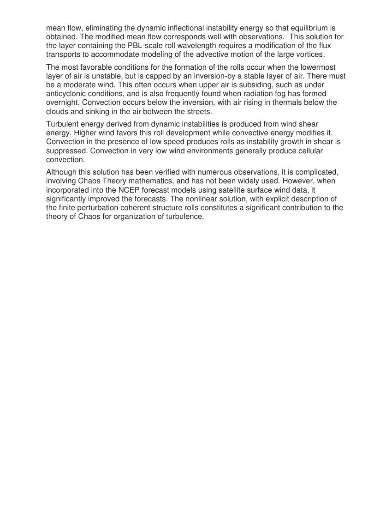

# Cloud Streets/Horizonal Rolls — Tutorial 2

> Source: <http://www.weather.gov/media/zhu/ZHU_Training_Page/clouds/planetary_boundary_layer/horizontal_convective_rolls.pdf>  
> Section: Clouds/Precipitation  
> Captured: 2026-08-19 06:00 UTC  
> PDF: [cloud-streets-horizonal-rolls-tutorial-2.pdf](cloud-streets-horizonal-rolls-tutorial-2.pdf) (3 pages)

---

## Page 1

Horizontal convective rolls 
From Wikipedia, the free encyclopedia 
 
 
 
 
Horizontal convective rolls producing cloud streets  
(lower left portion of the image) over the Bering Sea. 
 
 
Simple schematic of the production of cloud streets by horizontal convective rolls. 
 
 
Lines of clouds streets stretch from north-west to south-east over New England region.

## Page 2

Horizontal convective rolls, also known as horizontal roll vortices or cloud streets, 
are long rolls of counter-rotating air that are oriented approximately parallel to the 
ground in the planetary boundary layer. Although horizontal convective rolls, also known 
as cloud streets, have been clearly seen in satellite photographs for the last 30 years, 
their development is poorly understood, due to a lack of observational data. From the 
ground, they appear as rows of cumulus or cumulus-type clouds aligned parallel to the 
low-level wind. Research has shown these eddies to be significant to the vertical 
transport of momentum, heat, moisture, and air pollutants within the boundary 
layer.  Cloud streets are usually more or less straight; rarely, cloud streets 
assume paisley patterns when the wind driving the clouds encounters an obstacle. 
Those cloud formations are known as von Kármán vortex streets. 
 
Characteristics 
Horizontal rolls are counter-rotating vortex rolls that are nearly aligned with the mean 
wind of the Planetary Boundary Layer (PBL). They can be caused by convection in the 
presence of a moderate wind and/or dynamic inflection point instabilities in the mean 
wind profile.  Early theory on the features predict that the vortices may be aligned up to 
30° to the left for stably stratified environments, 18° to the left for neutral environments, 
and nearly parallel to the mean wind for unstably stratified (convective) environments. 
This theory has been supported by aircraft observations from several field experiments.  
The depth of a vortex is usually the depth of the boundary layer, which is generally on 
the order of 1–2 km. A vortex pair usually has a lateral to vertical dimension ratio of 
around 3:1.   Experimental studies have shown that the aspect ratio (a ratio of roll 
wavelength to boundary layer depth) has been found to vary between 2:1 and 6:1, 
however, in some situations, the aspect ratio may be as large as 10:1. The lifetime of a 
convective roll can last from hours to days.  
If the environmental air is near saturation, condensation may occur in updrafts produced 
from the vortex rotation. The sinking motion produced between alternating pairs of rolls 
will evaporate clouds. This, combined with the updrafts, will produce rows of clouds. 
Glider pilots often use the updrafts produced by cloud streets enabling them to fly 
straight for long distances, hence the name “cloud streets”. 
 
Development and required environmental conditions 
The exact process that leads to the formation of horizontal rolls is complicated. The 
basic stress mechanism in the PBL is turbulent flux of momentum, and this term must 
be approximated in the fluid dynamic equations of motion in order to model the Ekman 
layer flow and fluxes.  
The linear approximation, the eddy diffusivity equation with an eddy diffusion coefficient 
K, allowed Ekman to obtain a simple logarithmic spiral solution.  However, the frequent 
presence of the horizontal roll vortices in the PBL, which represent an organization of 
the turbulence (coherent structures), indicate that the diffusivity approximation is not 
adequate. Ekman's solution has an intrinsic inflectional wind profile that was found to be 
unstable to long waves corresponding to the organized large vortices scale.[3] The 
nonlinear theory showed that the growth of these finite perturbation waves modifies the

## Page 3

mean flow, eliminating the dynamic inflectional instability energy so that equilibrium is 
obtained. The modified mean flow corresponds well with observations.  This solution for 
the layer containing the PBL-scale roll wavelength requires a modification of the flux 
transports to accommodate modeling of the advective motion of the large vortices.  
The most favorable conditions for the formation of the rolls occur when the lowermost 
layer of air is unstable, but is capped by an inversion-by a stable layer of air. There must 
be a moderate wind. This often occurs when upper air is subsiding, such as under 
anticyclonic conditions, and is also frequently found when radiation fog has formed 
overnight. Convection occurs below the inversion, with air rising in thermals below the 
clouds and sinking in the air between the streets. 
Turbulent energy derived from dynamic instabilities is produced from wind shear 
energy. Higher wind favors this roll development while convective energy modifies it. 
Convection in the presence of low speed produces rolls as instability growth in shear is 
suppressed. Convection in very low wind environments generally produce cellular 
convection.  
Although this solution has been verified with numerous observations, it is complicated, 
involving Chaos Theory mathematics, and has not been widely used. However, when 
incorporated into the NCEP forecast models using satellite surface wind data, it 
significantly improved the forecasts. The nonlinear solution, with explicit description of 
the finite perturbation coherent structure rolls constitutes a significant contribution to the 
theory of Chaos for organization of turbulence.
