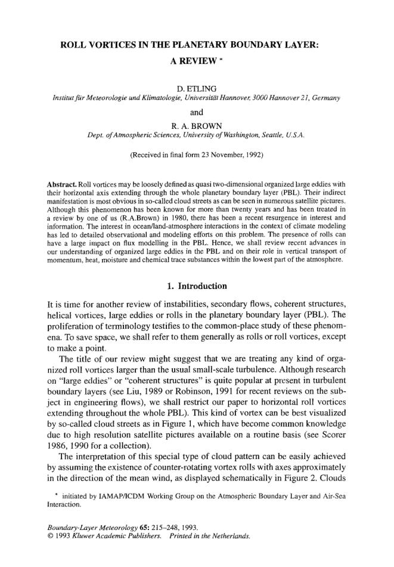
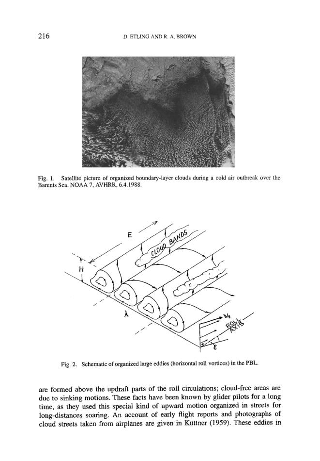

# Cloud Streets/Horizonal Rolls — Tutorial 3

> Source: <http://www.weather.gov/media/zhu/ZHU_Training_Page/clouds/planetary_boundary_layer/roll_vortices.pdf>  
> Section: Clouds/Precipitation  
> Captured: 2026-08-19 06:00 UTC  
> PDF: [cloud-streets-horizonal-rolls-tutorial-3.pdf](cloud-streets-horizonal-rolls-tutorial-3.pdf) (2 pages)

---

## Page 1

ROLL VORTICES IN THE PLANETARY BOUNDARY LAYER: 
A REVIEW * 
D. ETLING 
Institut fidr Meteorologie und Klimatologie, Universitiit Hannover, 3000 Hannover 21, Germany 
and 
R. A. BROWN 
Dept. of Atmospheric Sciences, University of Washington, Seattle, U.S.A. 
(Received in final form 23 November, 1992) 
Abstract. Roll vortices may be loosely defined as quasi two-dimensional organized large eddies with 
their horizontal axis extending through the whole planetary boundary layer (PBL). Their indirect 
manifestation is most obvious in so-called cloud streets as can be seen in numerous satellite pictures. 
Although this phenomenon has been known for more than twenty years and has been treated in 
a review by one of us (R.A.Brown) in 1980, there has been a recent resurgence in interest and 
information. The interest in ocean/land-atmosphere interactions in the context of climate modeling 
has led to detailed observational and modeling efforts on this problem. The presence of rolls can 
have a large impact on flux modelling in the PBL. Hence, we shall review recent advances in 
our understanding of organized large eddies in the PBL and on their role in vertical transport of 
momentum, heat, moisture and chemical trace substances within the lowest part of the atmosphere, 
1. Introduction 
It is time for another review of instabilities, secondary flows, coherent structures, 
helical vortices, large eddies or rolls in the planetary boundary layer (PBL). The 
proliferation of terminology testifies to the common-place study of these phenom- 
ena. To save space, we shall refer to them generally as rolls or roll vortices, except 
to make a point. 
The title of our review might suggest that we are treating any kind of orga- 
nized roll vortices larger than the usual small-scale turbulence. Although research 
on "large eddies" or "coherent structures" is quite popular at present in turbulent 
boundary layers (see Liu, 1989 or Robinson, 1991 for recent reviews on the sub- 
ject in engineering flows), we shall restrict our paper to horizontal roll vortices 
extending throughout the whole PBL). This kind of vortex can be best visualized 
by so-called cloud streets as in Figure 1, which have become common knowledge 
due to high resolution satellite pictures available on a routine basis (see Scorer 
1986, 1990 for a collection). 
The interpretation of this special type of cloud pattern can be easily achieved 
by assuming the existence of counter-rotating vortex roils with axes approximately 
in the direction of the mean wind, as displayed schematically in Figure 2. Clouds 
* initiated by IAMAP/ICDM Working Group on the Atmospheric Boundary Layer and Air-Sea 
Interaction. 
Boundary-Layer Meteorology 65: 215-248, 1993. 
9 1993 Kluwer Academic Publishers. 
Printed in the Netherlands.

## Page 2

2t6 
D. ETLING AND R. A. BROWN 
Fig. 1. Satellite picture of organized boundary-layer clouds during a cold air outbreak over the 
Barents Sea. NOAA 7, AVHRR, 6.4.1988. 
H 
Fig. 2. Schematic of organized large eddies (horizontal roll vortices) in the PBL. 
are formed above the updraft parts of the roll circulations; cloud-free areas are 
due to sinking motions. These facts have been known by glider pilots for a long 
time, as they used this special kind of upward motion organized in streets for 
long-distances soaring. An account of early flight reports and photographs of 
cloud streets taken from airplanes are given in Kiittner (1959). These eddies in
