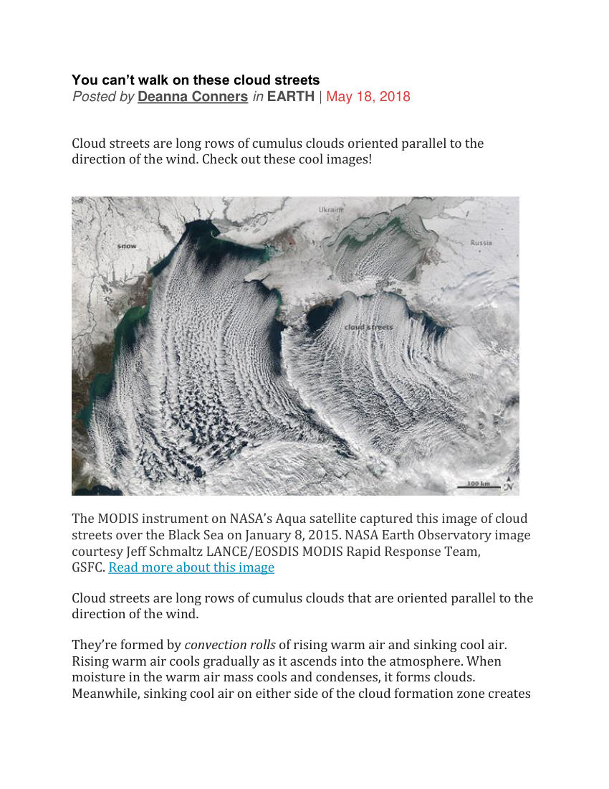
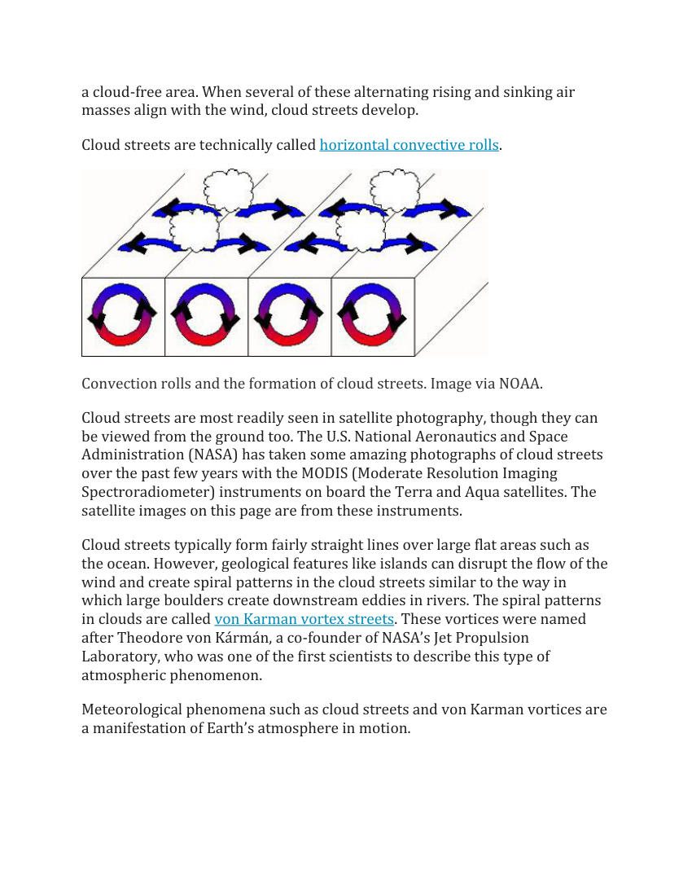
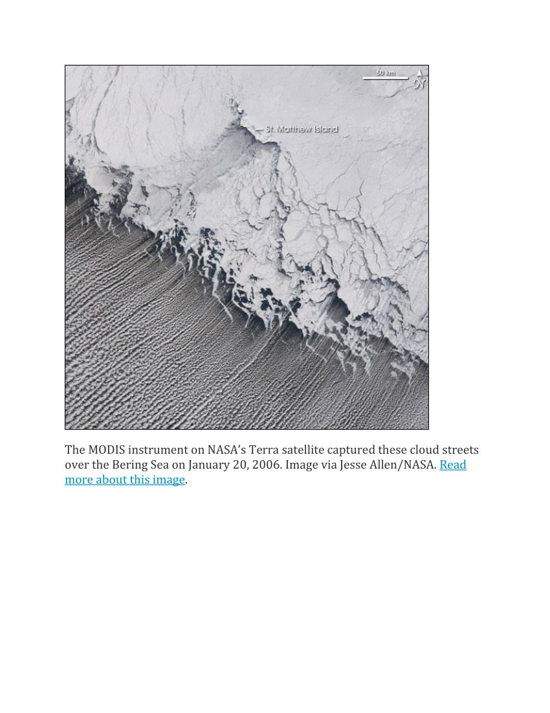
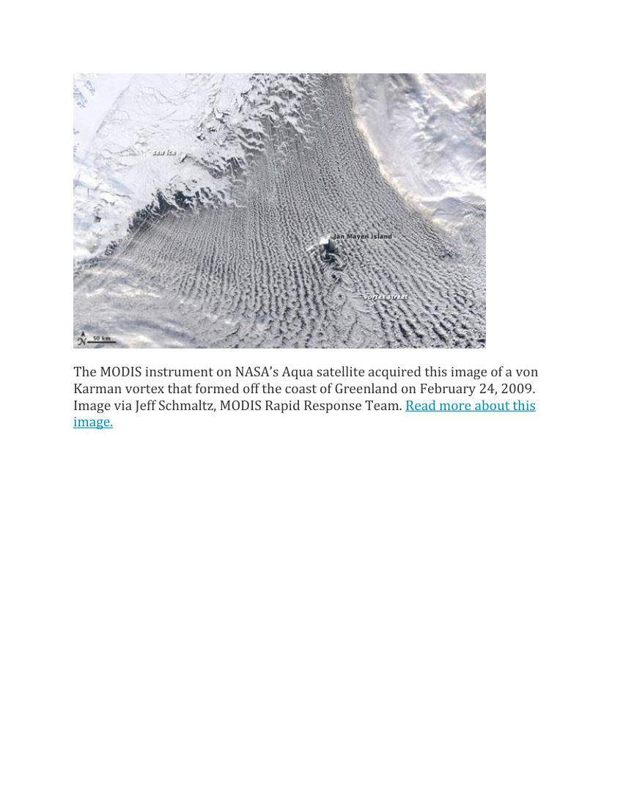
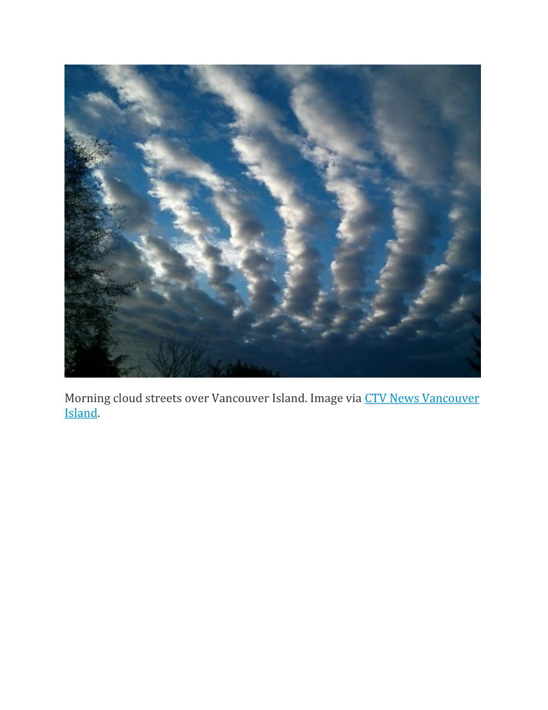
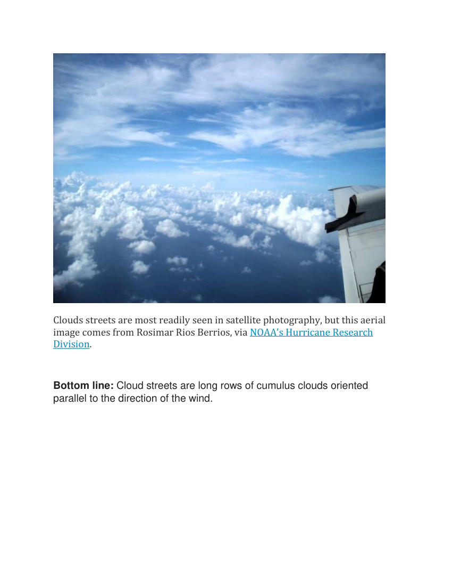

# Cloud Streets/Horizonal Rolls

> Source: <http://www.weather.gov/media/zhu/ZHU_Training_Page/clouds/planetary_boundary_layer/cloud_streets.pdf>  
> Section: Clouds/Precipitation  
> Captured: 2026-08-19 06:00 UTC  
> PDF: [cloud-streets-horizonal-rolls.pdf](cloud-streets-horizonal-rolls.pdf) (6 pages)

---

## Page 1

You can’t walk on these cloud streets 
Posted by Deanna Conners in EARTH | May 18, 2018 
 
Cloud streets are long rows of cumulus clouds oriented parallel to the 
direction of the wind. Check out these cool images! 
 
 
The MODIS instrument on NASA’s Aqua satellite captured this image of cloud 
streets over the Black Sea on January 8, 2015. NASA Earth Observatory image 
courtesy Jeff Schmaltz LANCE/EOSDIS MODIS Rapid Response Team, 
GSFC. Read more about this image 
Cloud streets are long rows of cumulus clouds that are oriented parallel to the 
direction of the wind. 
They’re formed by convection rolls of rising warm air and sinking cool air. 
Rising warm air cools gradually as it ascends into the atmosphere. When 
moisture in the warm air mass cools and condenses, it forms clouds. 
Meanwhile, sinking cool air on either side of the cloud formation zone creates

## Page 2

a cloud-free area. When several of these alternating rising and sinking air 
masses align with the wind, cloud streets develop. 
Cloud streets are technically called horizontal convective rolls. 
 
Convection rolls and the formation of cloud streets. Image via NOAA. 
Cloud streets are most readily seen in satellite photography, though they can 
be viewed from the ground too. The U.S. National Aeronautics and Space 
Administration (NASA) has taken some amazing photographs of cloud streets 
over the past few years with the MODIS (Moderate Resolution Imaging 
Spectroradiometer) instruments on board the Terra and Aqua satellites. The 
satellite images on this page are from these instruments. 
Cloud streets typically form fairly straight lines over large flat areas such as 
the ocean. However, geological features like islands can disrupt the flow of the 
wind and create spiral patterns in the cloud streets similar to the way in 
which large boulders create downstream eddies in rivers. The spiral patterns 
in clouds are called von Karman vortex streets. These vortices were named 
after Theodore von Kármán, a co-founder of NASA’s Jet Propulsion 
Laboratory, who was one of the first scientists to describe this type of 
atmospheric phenomenon. 
Meteorological phenomena such as cloud streets and von Karman vortices are 
a manifestation of Earth’s atmosphere in motion.

## Page 3

The MODIS instrument on NASA’s Terra satellite captured these cloud streets 
over the Bering Sea on January 20, 2006. Image via Jesse Allen/NASA. Read 
more about this image.

## Page 4

The MODIS instrument on NASA’s Aqua satellite acquired this image of a von 
Karman vortex that formed off the coast of Greenland on February 24, 2009. 
Image via Jeff Schmaltz, MODIS Rapid Response Team. Read more about this 
image.

## Page 5

Morning cloud streets over Vancouver Island. Image via CTV News Vancouver 
Island.

## Page 6

Clouds streets are most readily seen in satellite photography, but this aerial 
image comes from Rosimar Rios Berrios, via NOAA’s Hurricane Research 
Division. 
 
Bottom line: Cloud streets are long rows of cumulus clouds oriented 
parallel to the direction of the wind.
