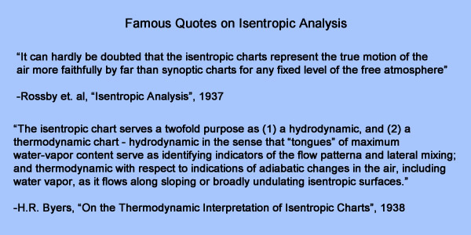

# COMET Module on Isentropic Analysis

> Source: <https://www.meted.ucar.edu/labs/synoptic/isentropic_analysis/navmenu.php>  
> Section: Clouds/Precipitation  
> Captured: 2026-08-19 06:00 UTC (via Wayback Machine: https://web.archive.org/web/20151212202816/https://www.meted.ucar.edu/labs/synoptic/isentropic_analysis/navmenu.php)  
> PDF: [comet-module-on-isentropic-analysis.pdf](comet-module-on-isentropic-analysis.pdf) · Original HTML: [source/original.html](source/original.html)

---

[Isentropic Analysis](https://www.meted.ucar.edu/labs/synoptic/isentropic_analysis/index.htm)

### Produced by The COMET® Program

#### [Navigation Menu](#collapse-toc)

- [Table of Contents](#)

- [Introduction](https://www.meted.ucar.edu/labs/synoptic/isentropic_analysis/navmenu.php?tab=1&page=1-0-0&type=flash)
- [Pre-Lab: Understanding Potential Temperature as a Vertical Coordinate](https://www.meted.ucar.edu/labs/synoptic/isentropic_analysis/navmenu.php?tab=1&page=2-0-0&type=flash)
- [Pre-Lab: Understanding Potential Temperature and Equivalent Potential Temperature as Airmass Identifiers](https://www.meted.ucar.edu/labs/synoptic/isentropic_analysis/navmenu.php?tab=1&page=3-0-0&type=flash)
- [Pre-Lab: Understanding Potential Temperature as a Tool to Diagnose Vertical Motion](https://www.meted.ucar.edu/labs/synoptic/isentropic_analysis/navmenu.php?tab=1&page=4-0-0&type=flash)
- [Next Steps: Lab Activity](https://www.meted.ucar.edu/labs/synoptic/isentropic_analysis/navmenu.php?tab=1&page=5-0-0&type=flash)

---

- [Home](https://www.meted.ucar.edu/labs/synoptic/isentropic_analysis/index.htm)
- [Lesson](#)
- [Printable Lesson](https://www.meted.ucar.edu/labs/synoptic/isentropic_analysis/print.php)

### Introduction

Before the switch to pressure coordinates prompted by aviation and WWII in the early 1940s, meteorologists regularly performed isentropic analysis as part of their analysis and diagnosis process. Isentropic analysis, as described by Rossby and many others, confers certain advantages in the forecasting process. Some utilities of isentropic analysis are outlined below:

- Diagnose and visualize vertical motion - through advection of pressure using system-relative flow
- Diagnose frontal boundaries and airmass types in the horizontal and vertical, and in a conveyor belts framework
- Depict frontogenetical and jet streak circulations
- Depict 3D transport of moisture
- Use isentropic potential vorticity (IPV) to depict the dynamic tropopause and tropopause folds
- Diagnose upper-level and dry static stability
- Diagnose symmetric instabilities

This lab will focus on the first two utilities, and will link the analyzed airmasses and frontal structures to the more standard way you have viewed weather structures and features in pressure coordinates.

- [Next →](https://www.meted.ucar.edu/labs/synoptic/isentropic_analysis/navmenu.php?tab=1&page=2-0-0&type=flash)

© Copyright 2015, [The University Corporation for Atmospheric Research](http://www.ucar.edu/).
All Rights Reserved. [Legal Notices](http://www.meted.ucar.edu/legal.htm).

- [MetEd Home](https://www.meted.ucar.edu/)
- [COMET Home](http://comet.ucar.edu)
