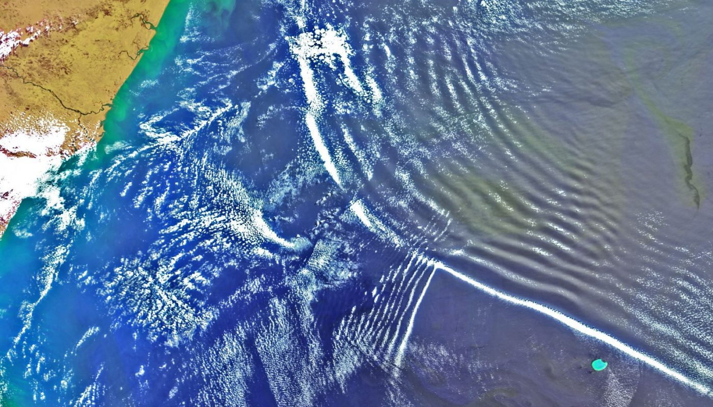
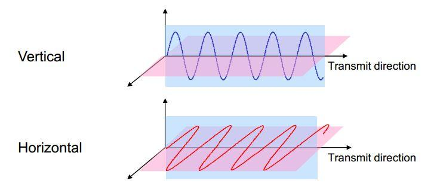
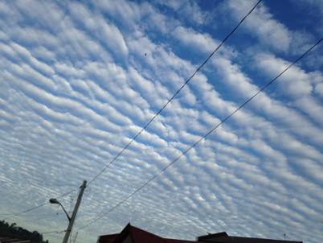
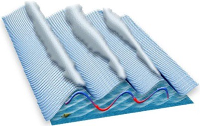
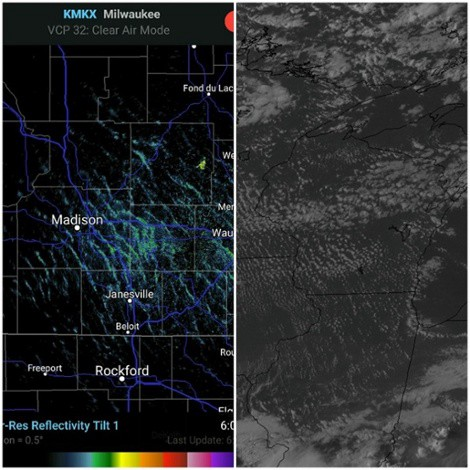
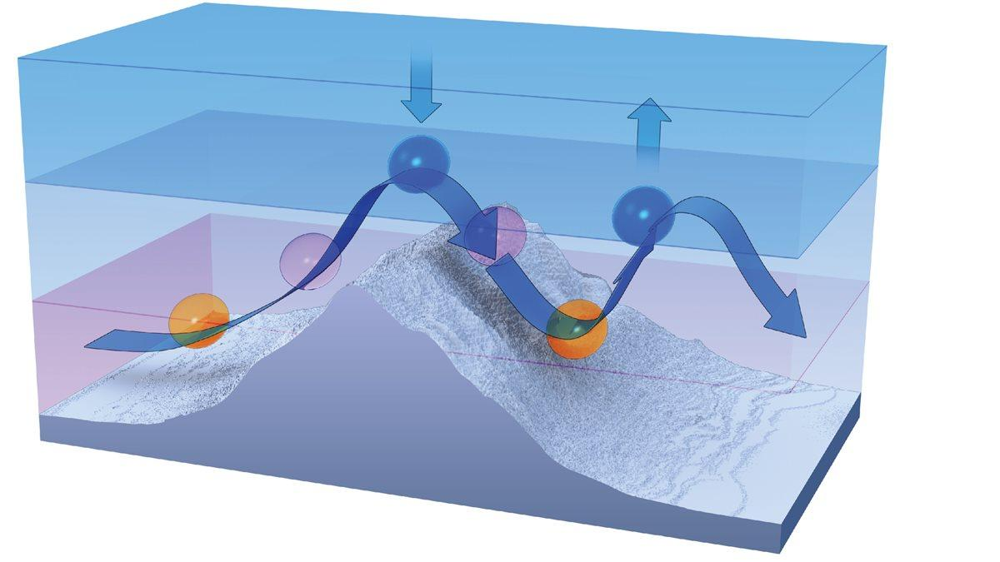
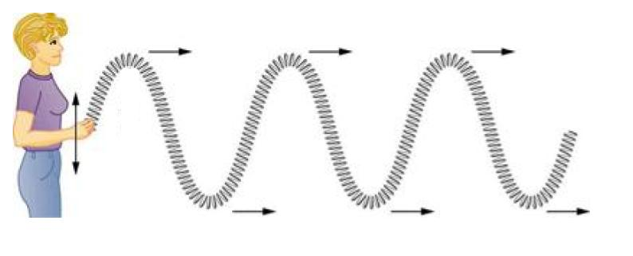
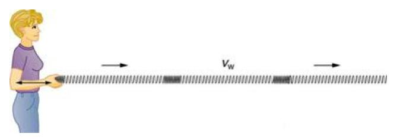
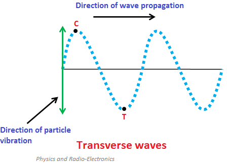
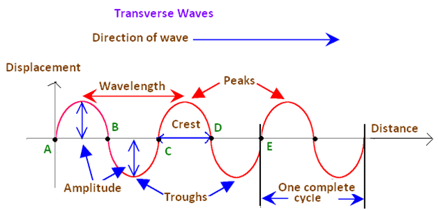

# Gravity Waves/Undular Bores

> Source: <http://www.weather.gov/source/zhu/ZHU_Training_Page/Miscellaneous/gravity_wave/gravity_wave.html>  
> Section: Clouds/Precipitation  
> Captured: 2026-08-19 06:00 UTC  
> PDF: [gravity-waves-undular-bores.pdf](gravity-waves-undular-bores.pdf) · Original HTML: [source/original.html](source/original.html)

---

**Gravity Wave/Undular Bore Defined**

The word "gravity" in the word gravity wave can make the term more confusing
than it really is. It has little to do with having a special relationship
with gravity. **ALL** air motions are influences by gravity. Once the word
gravity is eliminated, all that is left is the word wave. Air can have one
of two motions, which are either **STRAIGHT** or **WAVE**. These waves can be
vertical or horizontal. When you look at a 500-millibar chart with the
troughs and ridges you are looking at horizontal waves (waves on a more or
less horizontal plane).

A gravity wave is a vertical wave. The best example I can think of in
describing what a gravity wave looks like is to think of a rock being thrown
into a pond. Ripples or circles migrate from the point the rock hits the
water. An up and down motion is created. With increasing distance from the
point where the rock hit the water, the waves becomes less defined (the
waves are dampening).

Now let's look at what a gravity wave is in the atmosphere. To start a
gravity wave, a **TRIGGER** mechanism must cause the air to be displaced in the
vertical. Examples of trigger mechanisms that produce gravity waves are
mountains and thunderstorm updrafts. To generate a gravity wave, the air
must be forced to rise in **STABLE** air. Why? Because if air rises in unstable
air it will continue to rise and will NOT create a wave pattern. If air is
forced to rise up in stable air, the natural tendency will be for the air
to sink back down over time (usually because the parcel forced to rise is
colder than the environment). The momentum of the air imparted by the
trigger mechanism will force the parcel to rise and the stability of the
atmosphere will force the parcel of air to sink after it rises (you have now
undergone the first steps into creating a wave).

It is important to understand the concept of momentum. A rising or sinking
air parcel will "overshoot" its equilibrium point. In a gravity wave, the
parcel of air will try to remain at a location in the atmosphere where
there are no forces causing it to rise or sink. Once a force moves the
parcel from its natural state of equilibrium, the parcel will try to regain
its equilibrium. But in the process, it will overshoot and undershoot that
natural position each time it is rising or sinking because of its own
momentum. At a sufficient distance from where the trigger mechanism caused
the parcel to rise, the intensity of the gravity wave will decrease. At
increasing distance, the parcel of air becomes closer to remaining at its
natural state of equilibrium.

In a gravity wave, the upward moving region is the most favorable region for
cloud development and the sinking region favorable for clear skies. That
is why you may see rows of clouds and clear areas between the rows of
clouds. A gravity wave is nothing more than a wave moving through a stable
layer of the atmosphere. Thunderstorm updrafts will produce gravity waves
as they try to punch into the tropopause. The tropopause represents a region
of very stable air. This stable air combined with the upward momentum of a
thunderstorm updraft (trigger mechanism) will generate gravity waves within
the clouds trying to push into the tropopause.

Research has also shown that gravity waves/undular bores can locally enhance the formation of showers, aid in the intensification of thunderstorms, and may play a role in tornadogenesis...

The following radar loop is from the Doppler radar at Frederick, Oklahoma on the morning of July 30, 2016.

The following radar loop is from the Fort Worth Spinks TX Doppler Radar (KFWS) on the evening of April 23, 2015 between 9:55 pm and 11:15 pm.

**What are Gravity Waves?**

### *Written by David Moran (RadarScope) Jan 24, 2018 10:09:43 AM*

[**Link to article**](../../14-miscellaneous/the-inversion-cap/the-inversion-cap.md)

Weather can be thought of as the result of gradients in various atmospheric properties such as temperature, moisture, and pressure. The atmosphere is continually working to eliminate these gradients and restore itself back to equilibrium. Gravity waves are one of the mechanisms that the atmosphere utilizes in an attempt to restore itself to an equilibrium state. While these waves typically do not influence large-scale weather patterns, they can affect smaller scale weather events. They can sometimes be seen on radar images and produce some characteristic cloud patterns.

The stability of the atmosphere is vital in the generation of gravity waves; if the atmosphere is stable, the difference in temperature between the atmosphere and the rising air creates a force that returns this air to its original position. The air will continue to rise and sink, forming a wave pattern. An analog to this is to imagine throwing a rock into a pond. When the rock hits the water, ripples are generated and then spread outward. As the ripples spread outward, they eventually dissipate.

For a gravity wave to maintain itself, the vertical atmospheric structure is essential. A key feature of this arrangement is a deep low-level inversion (a layer in which the temperature increases with height). This layer is characteristically very stable and is typically located to the north of a warm front. The inversion itself plays two roles in the propagation of the wave. First, it enables the wave to continue horizontally spreading while maintaining its strength. Secondly, the inversion prevents the wave's energy from propagating vertically, which in turn, prevents the wave from dissipating.

So, what do gravity waves look like on radar? Below is an example of them on RadarScope, as well as an accompanying visible satellite image:

***Gravity Wave Radar and Satellite Image***

Gravity waves can produce atmospheric phenomena that have the potential to create significant impacts, especially in aviation. When over mountainous terrain, gravity waves can produce Clear Air Turbulence. This turbulence can occur at altitudes as high as 50,000 feet and up to 100 miles downwind from a mountain range. As much as 40% of all aviation accidents can be attributed to this turbulence. These waves can sometimes aid in thunderstorm development as well. If thunderstorms are ongoing during the time of a gravity wave passage, the wave can cause them to intensify.

**Weather: What is a Gravity Wave?**

### *By Jack Williams March 1, 2017*

### **Atmospheric gravity waves may Form when winds blow across mountains**

1. The wind blowing over a mountain pushes up a bubble of air.
2. Momentum carries the bubble up, opposing the pull of gravity, after it cools below the temperature of the surrounding air.
3. The cooling of the air as it rises makes the air denser; the air's ascent slows and it eventually begins sinking.
4. As it sinks, gravity accelerates the downward motion. The air warms as it sinks.
5. With the bubble of air now warmer and less dense than the surrounding air, the air begins rising again.
6. The up-and-down motion continues, slowly dying as the wind carries the wave along.

Flight instructor Gregory Bean described a strange weather encounter in an April 8, 2004, "Never Again" column on AOPA Online.

Bean says he "noticed no significant wind" on an April afternoon as he was preparing to take off from Burlington, Vermont. His weather briefing didn't hint of any weather to worry about. Nevertheless, as he was preparing for takeoff, the airport’s automated terminal information service reported "winds from 140 degrees at 20 knots gusting to 35 knots with an altimeter setting of 29.74-pressure falling rapidly." Pressure continued to drop; during his takeoff roll the controller said, "Altimeter 29.65!"

After takeoff, "The turbulence was as rough as I had ever encountered. My hand flailed wildly as I made the frequency change to Departure, and my eyeballs were rattling around as I tried to focus on my instruments," Bean said. During the climb, "my altimeter wound up through 3,600 feet. The vertical speed indicator was pegged up." After telling the controller he was coming back to land, "reading my instruments was hard enough, let alone reading a checklist! Thankfully my landing was uneventful."

Bean had encountered a gravity wave. Gravity waves form on the boundary of fluids with different densities. Probably the most familiar gravity waves are those on top of a body of water. As wind blows against the water, it pushes some of it up. As the water rises, gravity pulls it down. Eventually gravity wins, but wind continues pushing the water, creating more waves.

In atmospheric gravity waves, the density differences are caused by different temperatures. Fortunately, atmospheric gravity waves don't travel as far as ocean waves before they die out. Nevertheless, they can travel far from the disturbance that created them. For example, wind flowing over the Rocky Mountains sometimes creates gravity waves that are felt as turbulence by airliners high above Kansas.

### **Thunderstorms can cause gravity waves**

Thunderstorms, like mountains, also create gravity waves as wind flows over them. One striking example occurred in June 1996, when Air Force One, with President Bill Clinton aboard, hit severe turbulence while flying 33,000 feet over the Texas Panhandle. Afterward, those eating in the press area said it looked like they had had a huge food fight. The investigation showed that wind blowing over a distant thunderstorm formed a gravity wave that shook Air Force One. - JW

### **Gravity waves vs gravitational waves**

Gravity waves aren't 'gravitational' waves. The Oxford Dictionary of English defines gravity waves as "a hypothetical wave carrying gravitational energy, postulated by Albert Einstein to be emitted when a massive body is accelerated." No, no, no, that definition is for a "gravitational wave." Gravity waves aren't difficult to imagine, especially when we have billow clouds to show us what they look like. One reason for the confusion, in addition to the similarity of the names, is that in February 2016 scientists announced they had found the first evidence that gravitational waves had been detected. Einstein's idea was proven to be correct. -JW

**Primer on Waves (Khan Academy)**

# **Transverse and Longitudinal Waves Review**

**Wave -** An oscillation that transfers energy and momentum.
**Mechanical wave -** A disturbance of matter that travels along a medium. Examples include waves on a string, sound, and water waves.
**Wave speed -** Speed at which the wave disturbance moves. Depends only on the properties of the medium. Also called the propagation speed.
**Transverse wave -** Oscillations where particles are displaced perpendicular to the wave direction.
**Longitudinal wave -** Oscillations where particles are displaced parallel to the wave direction.

**## How to identify types of waves**

In a transverse wave, the particles are displaced perpendicular to the direction the wave travels. Examples of transverse waves include vibrations on a string and ripples on the surface of water. We can make a horizontal transverse wave by moving the slinky vertically up and down.

***Figure 1: The parts of the slinky in a transverse wave move vertically up and down while the wave disturbance travels horizontally.***

In a longitudinal wave the particles are displaced parallel to the direction the wave travels. An example of longitudinal waves is compressions moving along a slinky. We can make a horizontal longitudinal wave by pushing and pulling the slinky horizontally.

***Figure 2: The parts of the slinky in a longitudinal wave and the wave disturbance travel horizontally.***

**## Types of Transverse Waves**

***Common mistakes and misconceptions***
Sometimes people forget wave speed isn't the same as the speed of the particles in the medium. The wave speed is how quickly the disturbance travels through a medium. The particle speed is how quickly a particle moves about its equilibrium position.
