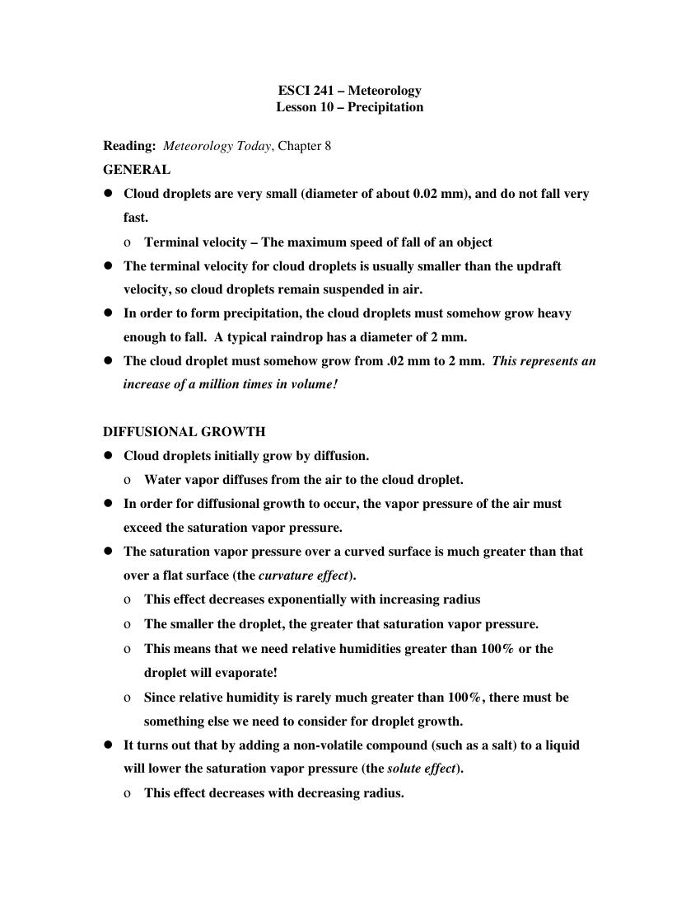
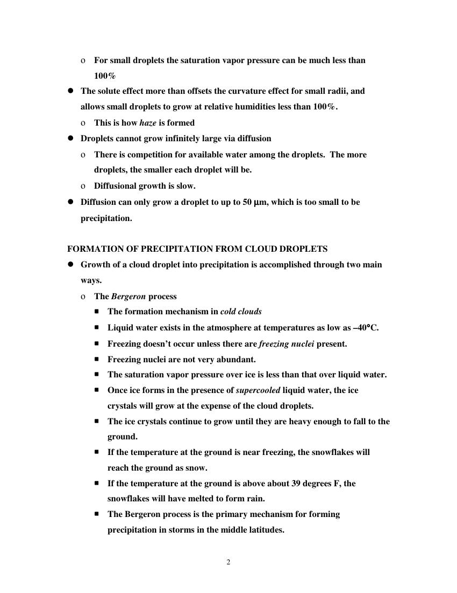
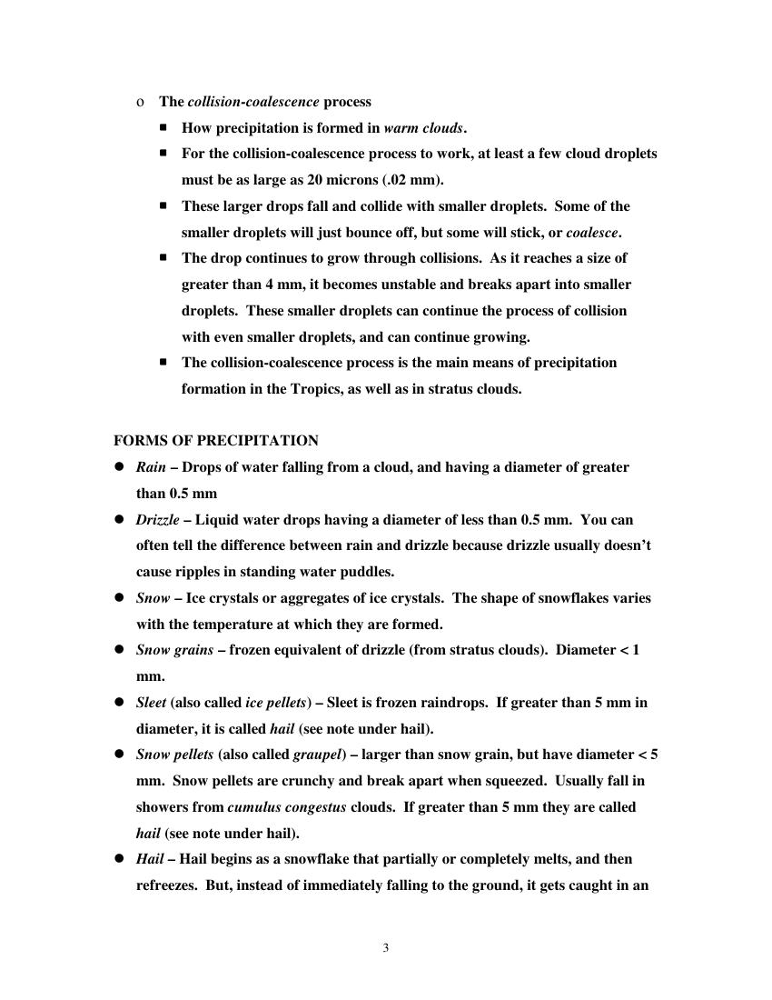
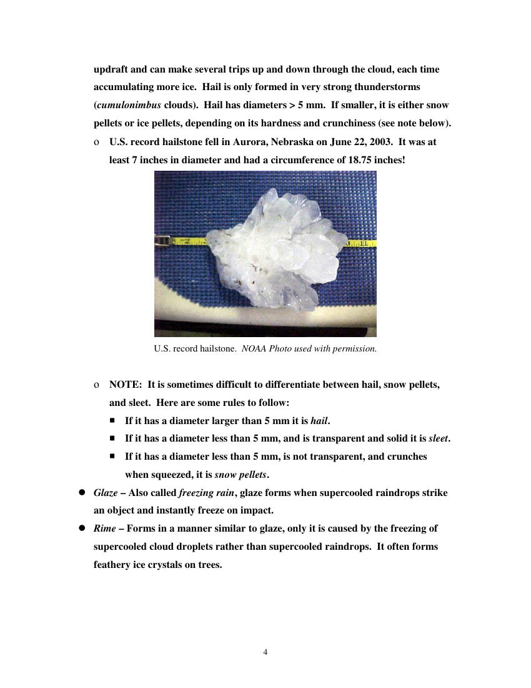
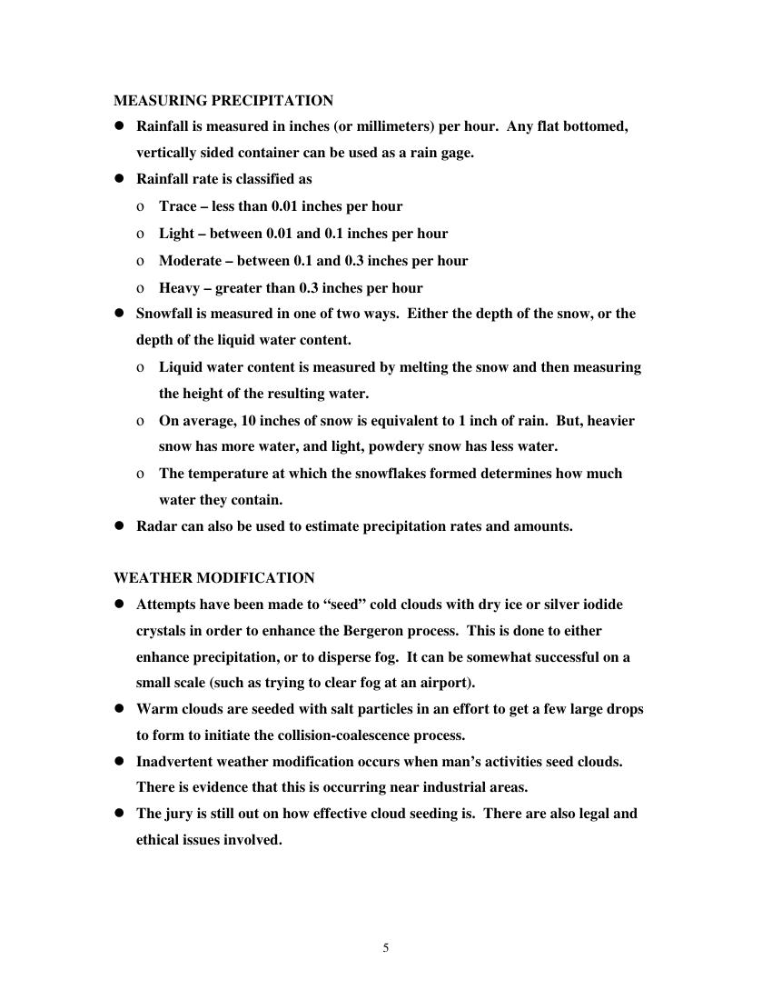

# How do Clouds and Rain Form? — Tutorial 2

> Source: <http://www.weather.gov/media/zhu/ZHU_Training_Page/clouds/cloud_precipitation/cloud_precipitation.pdf>  
> Section: Clouds/Precipitation  
> Captured: 2026-08-19 06:00 UTC  
> PDF: [how-do-clouds-and-rain-form-tutorial-2.pdf](how-do-clouds-and-rain-form-tutorial-2.pdf) (5 pages)

---

## Page 1

ESCI 241 – Meteorology 
Lesson 10 – Precipitation 
 
Reading:  Meteorology Today, Chapter 8 
GENERAL 
 Cloud droplets are very small (diameter of about 0.02 mm), and do not fall very 
fast. 
ο Terminal velocity – The maximum speed of fall of an object 
 The terminal velocity for cloud droplets is usually smaller than the updraft 
velocity, so cloud droplets remain suspended in air. 
 In order to form precipitation, the cloud droplets must somehow grow heavy 
enough to fall.  A typical raindrop has a diameter of 2 mm. 
 The cloud droplet must somehow grow from .02 mm to 2 mm.  This represents an 
increase of a million times in volume! 
 
DIFFUSIONAL GROWTH 
 Cloud droplets initially grow by diffusion. 
ο Water vapor diffuses from the air to the cloud droplet. 
 In order for diffusional growth to occur, the vapor pressure of the air must 
exceed the saturation vapor pressure. 
 The saturation vapor pressure over a curved surface is much greater than that 
over a flat surface (the curvature effect). 
ο This effect decreases exponentially with increasing radius 
ο The smaller the droplet, the greater that saturation vapor pressure. 
ο This means that we need relative humidities greater than 100% or the 
droplet will evaporate! 
ο Since relative humidity is rarely much greater than 100%, there must be 
something else we need to consider for droplet growth. 
 It turns out that by adding a non-volatile compound (such as a salt) to a liquid 
will lower the saturation vapor pressure (the solute effect). 
ο This effect decreases with decreasing radius.

## Page 2

2
ο For small droplets the saturation vapor pressure can be much less than 
100% 
 The solute effect more than offsets the curvature effect for small radii, and 
allows small droplets to grow at relative humidities less than 100%. 
ο This is how haze is formed 
 Droplets cannot grow infinitely large via diffusion 
ο There is competition for available water among the droplets.  The more 
droplets, the smaller each droplet will be. 
ο Diffusional growth is slow. 
 Diffusion can only grow a droplet to up to 50 µm, which is too small to be 
precipitation. 
 
FORMATION OF PRECIPITATION FROM CLOUD DROPLETS 
 Growth of a cloud droplet into precipitation is accomplished through two main 
ways. 
ο The Bergeron process  
 The formation mechanism in cold clouds 
 Liquid water exists in the atmosphere at temperatures as low as –40°C. 
 Freezing doesn’t occur unless there are freezing nuclei present. 
 Freezing nuclei are not very abundant. 
 The saturation vapor pressure over ice is less than that over liquid water. 
 Once ice forms in the presence of supercooled liquid water, the ice 
crystals will grow at the expense of the cloud droplets. 
 The ice crystals continue to grow until they are heavy enough to fall to the 
ground. 
 If the temperature at the ground is near freezing, the snowflakes will 
reach the ground as snow. 
 If the temperature at the ground is above about 39 degrees F, the 
snowflakes will have melted to form rain. 
 The Bergeron process is the primary mechanism for forming 
precipitation in storms in the middle latitudes.

## Page 3

3
ο The collision-coalescence process 
 How precipitation is formed in warm clouds. 
 For the collision-coalescence process to work, at least a few cloud droplets 
must be as large as 20 microns (.02 mm). 
 These larger drops fall and collide with smaller droplets.  Some of the 
smaller droplets will just bounce off, but some will stick, or coalesce. 
 The drop continues to grow through collisions.  As it reaches a size of 
greater than 4 mm, it becomes unstable and breaks apart into smaller 
droplets.  These smaller droplets can continue the process of collision 
with even smaller droplets, and can continue growing. 
 The collision-coalescence process is the main means of precipitation 
formation in the Tropics, as well as in stratus clouds. 
 
FORMS OF PRECIPITATION 
 Rain – Drops of water falling from a cloud, and having a diameter of greater 
than 0.5 mm 
 Drizzle – Liquid water drops having a diameter of less than 0.5 mm.  You can 
often tell the difference between rain and drizzle because drizzle usually doesn’t 
cause ripples in standing water puddles. 
 Snow – Ice crystals or aggregates of ice crystals.  The shape of snowflakes varies 
with the temperature at which they are formed. 
 Snow grains – frozen equivalent of drizzle (from stratus clouds).  Diameter < 1 
mm. 
 Sleet (also called ice pellets) – Sleet is frozen raindrops.  If greater than 5 mm in 
diameter, it is called hail (see note under hail). 
 Snow pellets (also called graupel) – larger than snow grain, but have diameter < 5 
mm.  Snow pellets are crunchy and break apart when squeezed.  Usually fall in 
showers from cumulus congestus clouds.  If greater than 5 mm they are called 
hail (see note under hail). 
 Hail – Hail begins as a snowflake that partially or completely melts, and then 
refreezes.  But, instead of immediately falling to the ground, it gets caught in an

## Page 4

4
updraft and can make several trips up and down through the cloud, each time 
accumulating more ice.  Hail is only formed in very strong thunderstorms 
(cumulonimbus clouds).  Hail has diameters > 5 mm.  If smaller, it is either snow 
pellets or ice pellets, depending on its hardness and crunchiness (see note below). 
ο U.S. record hailstone fell in Aurora, Nebraska on June 22, 2003.  It was at 
least 7 inches in diameter and had a circumference of 18.75 inches! 
 
U.S. record hailstone.  NOAA Photo used with permission. 
 
ο NOTE:  It is sometimes difficult to differentiate between hail, snow pellets, 
and sleet.  Here are some rules to follow: 
 If it has a diameter larger than 5 mm it is hail. 
 If it has a diameter less than 5 mm, and is transparent and solid it is sleet. 
 If it has a diameter less than 5 mm, is not transparent, and crunches 
when squeezed, it is snow pellets. 
 Glaze – Also called freezing rain, glaze forms when supercooled raindrops strike 
an object and instantly freeze on impact. 
 Rime – Forms in a manner similar to glaze, only it is caused by the freezing of 
supercooled cloud droplets rather than supercooled raindrops.  It often forms 
feathery ice crystals on trees.

## Page 5

5
MEASURING PRECIPITATION 
 Rainfall is measured in inches (or millimeters) per hour.  Any flat bottomed, 
vertically sided container can be used as a rain gage. 
 Rainfall rate is classified as 
ο Trace – less than 0.01 inches per hour 
ο Light – between 0.01 and 0.1 inches per hour 
ο Moderate – between 0.1 and 0.3 inches per hour 
ο Heavy – greater than 0.3 inches per hour 
 Snowfall is measured in one of two ways.  Either the depth of the snow, or the 
depth of the liquid water content. 
ο Liquid water content is measured by melting the snow and then measuring 
the height of the resulting water. 
ο On average, 10 inches of snow is equivalent to 1 inch of rain.  But, heavier 
snow has more water, and light, powdery snow has less water. 
ο The temperature at which the snowflakes formed determines how much 
water they contain. 
 Radar can also be used to estimate precipitation rates and amounts. 
 
WEATHER MODIFICATION 
 Attempts have been made to “seed” cold clouds with dry ice or silver iodide 
crystals in order to enhance the Bergeron process.  This is done to either 
enhance precipitation, or to disperse fog.  It can be somewhat successful on a 
small scale (such as trying to clear fog at an airport). 
 Warm clouds are seeded with salt particles in an effort to get a few large drops 
to form to initiate the collision-coalescence process. 
 Inadvertent weather modification occurs when man’s activities seed clouds.  
There is evidence that this is occurring near industrial areas. 
 The jury is still out on how effective cloud seeding is.  There are also legal and 
ethical issues involved.
