# How do Clouds and Rain Form? — Tutorial 3

> Source: <http://www.weather.gov/media/zhu/ZHU_Training_Page/clouds/cloud_ams_presentation/Clouds.pdf>  
> Section: Clouds/Precipitation  
> Captured: 2026-08-19 06:00 UTC  
> PDF: [how-do-clouds-and-rain-form-tutorial-3.pdf](how-do-clouds-and-rain-form-tutorial-3.pdf) (20 pages)

---

## Page 1

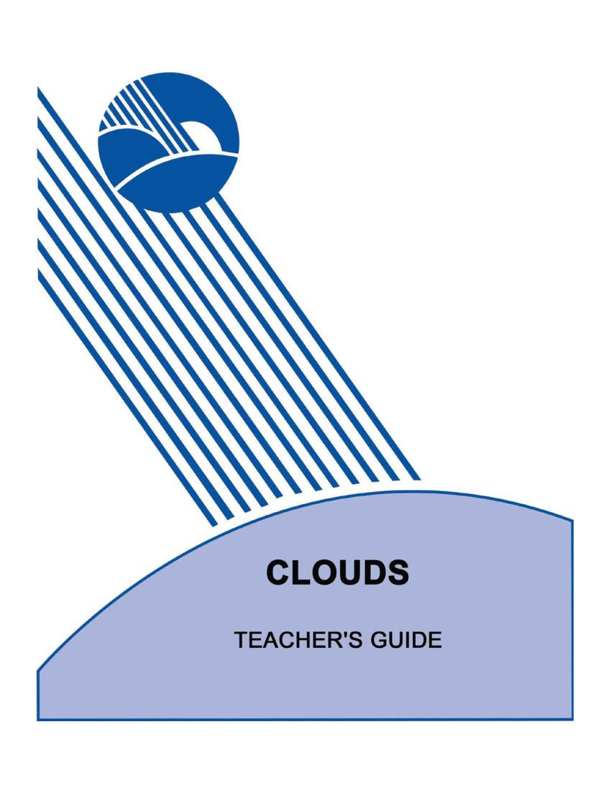

_(no extractable text on this page — see rendered image above)_

## Page 2

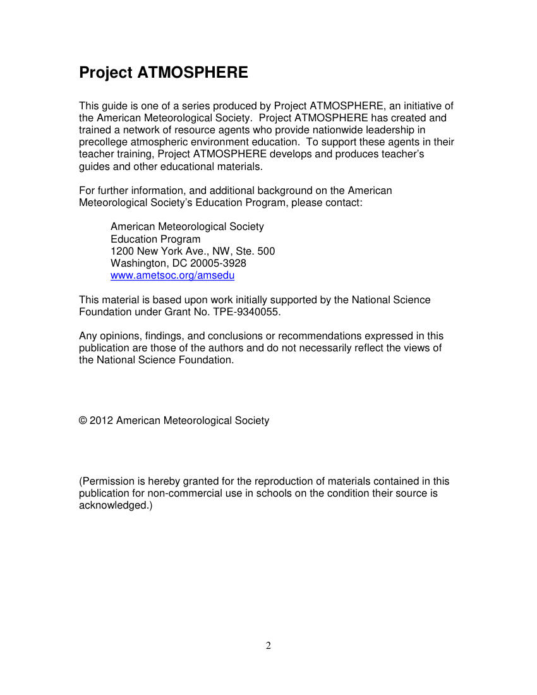

2 
 
Project ATMOSPHERE 
 
This guide is one of a series produced by Project ATMOSPHERE, an initiative of 
the American Meteorological Society.  Project ATMOSPHERE has created and 
trained a network of resource agents who provide nationwide leadership in 
precollege atmospheric environment education.  To support these agents in their 
teacher training, Project ATMOSPHERE develops and produces teacher’s 
guides and other educational materials. 
 
For further information, and additional background on the American 
Meteorological Society’s Education Program, please contact: 
 
American Meteorological Society 
Education Program 
1200 New York Ave., NW, Ste. 500 
Washington, DC 20005-3928 
www.ametsoc.org/amsedu 
 
This material is based upon work initially supported by the National Science 
Foundation under Grant No. TPE-9340055. 
 
Any opinions, findings, and conclusions or recommendations expressed in this 
publication are those of the authors and do not necessarily reflect the views of 
the National Science Foundation. 
 
 
 
 
© 2012 American Meteorological Society 
 
 
 
 
(Permission is hereby granted for the reproduction of materials contained in this 
publication for non-commercial use in schools on the condition their source is 
acknowledged.)

## Page 3

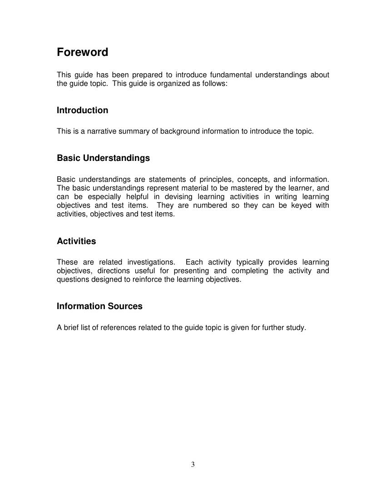

3 
 
Foreword 
 
This guide has been prepared to introduce fundamental understandings about 
the guide topic.  This guide is organized as follows: 
 
 
Introduction 
 
This is a narrative summary of background information to introduce the topic. 
 
 
Basic Understandings 
 
Basic understandings are statements of principles, concepts, and information.  
The basic understandings represent material to be mastered by the learner, and 
can be especially helpful in devising learning activities in writing learning 
objectives and test items.  They are numbered so they can be keyed with 
activities, objectives and test items. 
 
 
Activities 
 
These are related investigations.  Each activity typically provides learning 
objectives, directions useful for presenting and completing the activity and 
questions designed to reinforce the learning objectives. 
 
 
Information Sources 
 
A brief list of references related to the guide topic is given for further study.

## Page 4

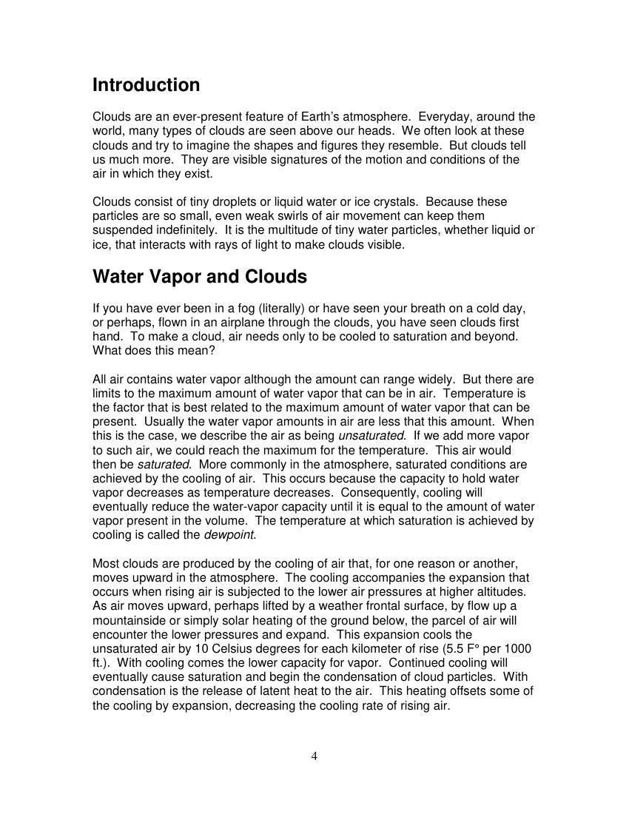

4 
 
Introduction 
 
Clouds are an ever-present feature of Earth’s atmosphere.  Everyday, around the 
world, many types of clouds are seen above our heads.  We often look at these 
clouds and try to imagine the shapes and figures they resemble.  But clouds tell 
us much more.  They are visible signatures of the motion and conditions of the 
air in which they exist. 
 
Clouds consist of tiny droplets or liquid water or ice crystals.  Because these 
particles are so small, even weak swirls of air movement can keep them 
suspended indefinitely.  It is the multitude of tiny water particles, whether liquid or 
ice, that interacts with rays of light to make clouds visible. 
 
Water Vapor and Clouds 
 
If you have ever been in a fog (literally) or have seen your breath on a cold day, 
or perhaps, flown in an airplane through the clouds, you have seen clouds first 
hand.  To make a cloud, air needs only to be cooled to saturation and beyond.  
What does this mean? 
 
All air contains water vapor although the amount can range widely.  But there are 
limits to the maximum amount of water vapor that can be in air.  Temperature is 
the factor that is best related to the maximum amount of water vapor that can be 
present.  Usually the water vapor amounts in air are less that this amount.  When 
this is the case, we describe the air as being unsaturated.  If we add more vapor 
to such air, we could reach the maximum for the temperature.  This air would 
then be saturated.  More commonly in the atmosphere, saturated conditions are 
achieved by the cooling of air.  This occurs because the capacity to hold water 
vapor decreases as temperature decreases.  Consequently, cooling will 
eventually reduce the water-vapor capacity until it is equal to the amount of water 
vapor present in the volume.  The temperature at which saturation is achieved by 
cooling is called the dewpoint. 
 
Most clouds are produced by the cooling of air that, for one reason or another, 
moves upward in the atmosphere.  The cooling accompanies the expansion that 
occurs when rising air is subjected to the lower air pressures at higher altitudes.  
As air moves upward, perhaps lifted by a weather frontal surface, by flow up a 
mountainside or simply solar heating of the ground below, the parcel of air will 
encounter the lower pressures and expand.  This expansion cools the 
unsaturated air by 10 Celsius degrees for each kilometer of rise (5.5 F° per 1000 
ft.).  With cooling comes the lower capacity for vapor.  Continued cooling will 
eventually cause saturation and begin the condensation of cloud particles.  With 
condensation is the release of latent heat to the air.  This heating offsets some of 
the cooling by expansion, decreasing the cooling rate of rising air.

## Page 5

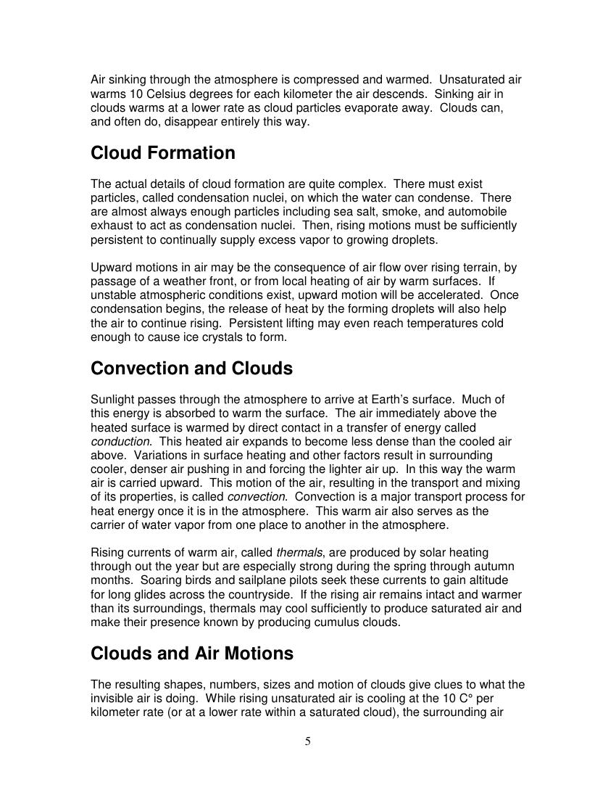

5 
 
Air sinking through the atmosphere is compressed and warmed.  Unsaturated air 
warms 10 Celsius degrees for each kilometer the air descends.  Sinking air in 
clouds warms at a lower rate as cloud particles evaporate away.  Clouds can, 
and often do, disappear entirely this way. 
 
Cloud Formation 
 
The actual details of cloud formation are quite complex.  There must exist 
particles, called condensation nuclei, on which the water can condense.  There 
are almost always enough particles including sea salt, smoke, and automobile 
exhaust to act as condensation nuclei.  Then, rising motions must be sufficiently 
persistent to continually supply excess vapor to growing droplets. 
 
Upward motions in air may be the consequence of air flow over rising terrain, by 
passage of a weather front, or from local heating of air by warm surfaces.  If 
unstable atmospheric conditions exist, upward motion will be accelerated.  Once 
condensation begins, the release of heat by the forming droplets will also help 
the air to continue rising.  Persistent lifting may even reach temperatures cold 
enough to cause ice crystals to form. 
 
Convection and Clouds 
 
Sunlight passes through the atmosphere to arrive at Earth’s surface.  Much of 
this energy is absorbed to warm the surface.  The air immediately above the 
heated surface is warmed by direct contact in a transfer of energy called 
conduction.  This heated air expands to become less dense than the cooled air 
above.  Variations in surface heating and other factors result in surrounding 
cooler, denser air pushing in and forcing the lighter air up.  In this way the warm 
air is carried upward.  This motion of the air, resulting in the transport and mixing 
of its properties, is called convection.  Convection is a major transport process for 
heat energy once it is in the atmosphere.  This warm air also serves as the 
carrier of water vapor from one place to another in the atmosphere. 
 
Rising currents of warm air, called thermals, are produced by solar heating 
through out the year but are especially strong during the spring through autumn 
months.  Soaring birds and sailplane pilots seek these currents to gain altitude 
for long glides across the countryside.  If the rising air remains intact and warmer 
than its surroundings, thermals may cool sufficiently to produce saturated air and 
make their presence known by producing cumulus clouds. 
 
Clouds and Air Motions 
 
The resulting shapes, numbers, sizes and motion of clouds give clues to what the 
invisible air is doing.  While rising unsaturated air is cooling at the 10 C° per 
kilometer rate (or at a lower rate within a saturated cloud), the surrounding air

## Page 6

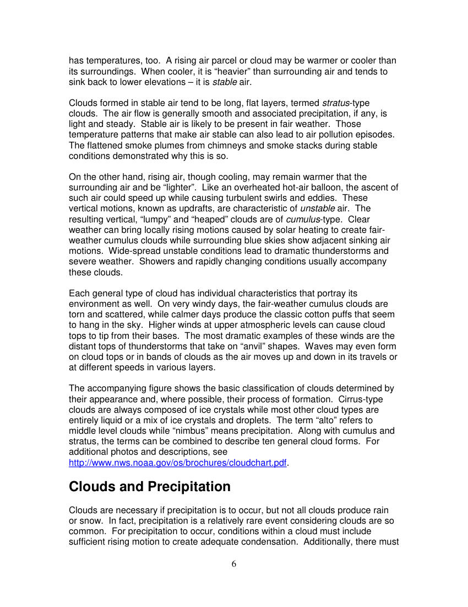

6 
 
has temperatures, too.  A rising air parcel or cloud may be warmer or cooler than 
its surroundings.  When cooler, it is “heavier” than surrounding air and tends to 
sink back to lower elevations – it is stable air. 
 
Clouds formed in stable air tend to be long, flat layers, termed stratus-type 
clouds.  The air flow is generally smooth and associated precipitation, if any, is 
light and steady.  Stable air is likely to be present in fair weather.  Those 
temperature patterns that make air stable can also lead to air pollution episodes.  
The flattened smoke plumes from chimneys and smoke stacks during stable 
conditions demonstrated why this is so. 
 
On the other hand, rising air, though cooling, may remain warmer that the 
surrounding air and be “lighter”.  Like an overheated hot-air balloon, the ascent of 
such air could speed up while causing turbulent swirls and eddies.  These 
vertical motions, known as updrafts, are characteristic of unstable air.  The 
resulting vertical, “lumpy” and “heaped” clouds are of cumulus-type.  Clear 
weather can bring locally rising motions caused by solar heating to create fair-
weather cumulus clouds while surrounding blue skies show adjacent sinking air 
motions.  Wide-spread unstable conditions lead to dramatic thunderstorms and 
severe weather.  Showers and rapidly changing conditions usually accompany 
these clouds. 
 
Each general type of cloud has individual characteristics that portray its 
environment as well.  On very windy days, the fair-weather cumulus clouds are 
torn and scattered, while calmer days produce the classic cotton puffs that seem 
to hang in the sky.  Higher winds at upper atmospheric levels can cause cloud 
tops to tip from their bases.  The most dramatic examples of these winds are the 
distant tops of thunderstorms that take on “anvil” shapes.  Waves may even form 
on cloud tops or in bands of clouds as the air moves up and down in its travels or 
at different speeds in various layers. 
 
The accompanying figure shows the basic classification of clouds determined by 
their appearance and, where possible, their process of formation.  Cirrus-type 
clouds are always composed of ice crystals while most other cloud types are 
entirely liquid or a mix of ice crystals and droplets.  The term “alto” refers to 
middle level clouds while “nimbus” means precipitation.  Along with cumulus and 
stratus, the terms can be combined to describe ten general cloud forms.  For 
additional photos and descriptions, see 
http://www.nws.noaa.gov/os/brochures/cloudchart.pdf. 
 
Clouds and Precipitation 
 
Clouds are necessary if precipitation is to occur, but not all clouds produce rain 
or snow.  In fact, precipitation is a relatively rare event considering clouds are so 
common.  For precipitation to occur, conditions within a cloud must include 
sufficient rising motion to create adequate condensation.  Additionally, there must

## Page 7

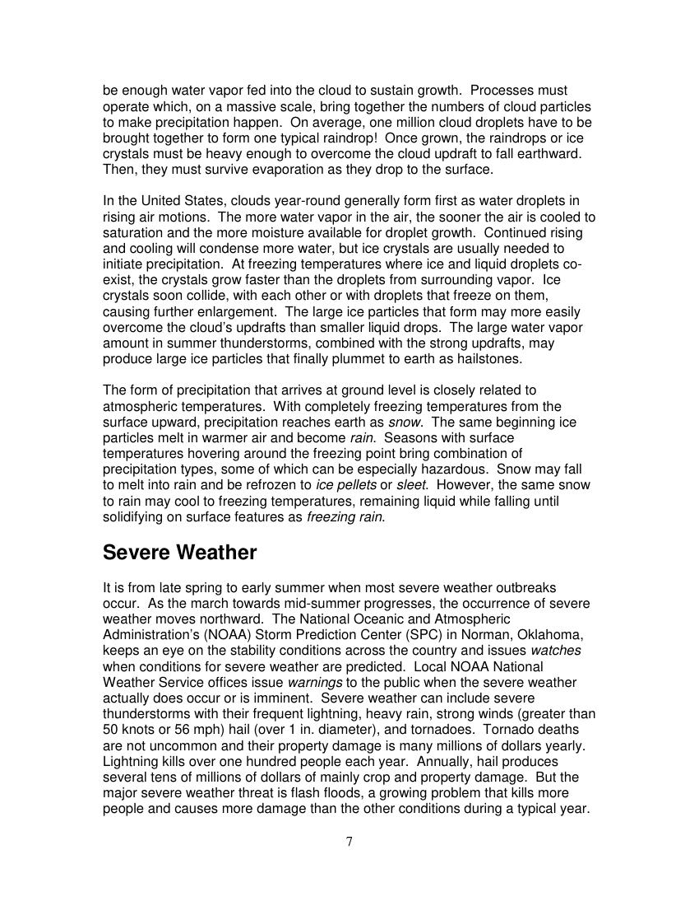

7 
 
be enough water vapor fed into the cloud to sustain growth.  Processes must 
operate which, on a massive scale, bring together the numbers of cloud particles 
to make precipitation happen.  On average, one million cloud droplets have to be 
brought together to form one typical raindrop!  Once grown, the raindrops or ice 
crystals must be heavy enough to overcome the cloud updraft to fall earthward.  
Then, they must survive evaporation as they drop to the surface. 
 
In the United States, clouds year-round generally form first as water droplets in 
rising air motions.  The more water vapor in the air, the sooner the air is cooled to 
saturation and the more moisture available for droplet growth.  Continued rising 
and cooling will condense more water, but ice crystals are usually needed to 
initiate precipitation.  At freezing temperatures where ice and liquid droplets co-
exist, the crystals grow faster than the droplets from surrounding vapor.  Ice 
crystals soon collide, with each other or with droplets that freeze on them, 
causing further enlargement.  The large ice particles that form may more easily 
overcome the cloud’s updrafts than smaller liquid drops.  The large water vapor 
amount in summer thunderstorms, combined with the strong updrafts, may 
produce large ice particles that finally plummet to earth as hailstones. 
 
The form of precipitation that arrives at ground level is closely related to 
atmospheric temperatures.  With completely freezing temperatures from the 
surface upward, precipitation reaches earth as snow.  The same beginning ice 
particles melt in warmer air and become rain.  Seasons with surface 
temperatures hovering around the freezing point bring combination of 
precipitation types, some of which can be especially hazardous.  Snow may fall 
to melt into rain and be refrozen to ice pellets or sleet.  However, the same snow 
to rain may cool to freezing temperatures, remaining liquid while falling until 
solidifying on surface features as freezing rain. 
 
Severe Weather 
 
It is from late spring to early summer when most severe weather outbreaks 
occur.  As the march towards mid-summer progresses, the occurrence of severe 
weather moves northward.  The National Oceanic and Atmospheric 
Administration’s (NOAA) Storm Prediction Center (SPC) in Norman, Oklahoma, 
keeps an eye on the stability conditions across the country and issues watches 
when conditions for severe weather are predicted.  Local NOAA National 
Weather Service offices issue warnings to the public when the severe weather 
actually does occur or is imminent.  Severe weather can include severe 
thunderstorms with their frequent lightning, heavy rain, strong winds (greater than 
50 knots or 56 mph) hail (over 1 in. diameter), and tornadoes.  Tornado deaths 
are not uncommon and their property damage is many millions of dollars yearly.  
Lightning kills over one hundred people each year.  Annually, hail produces 
several tens of millions of dollars of mainly crop and property damage.  But the 
major severe weather threat is flash floods, a growing problem that kills more 
people and causes more damage than the other conditions during a typical year.

## Page 8

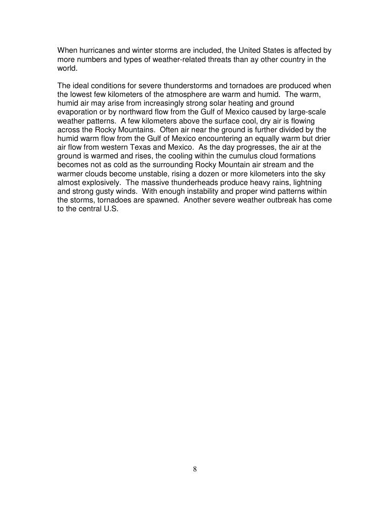

8 
 
When hurricanes and winter storms are included, the United States is affected by 
more numbers and types of weather-related threats than ay other country in the 
world. 
 
The ideal conditions for severe thunderstorms and tornadoes are produced when 
the lowest few kilometers of the atmosphere are warm and humid.  The warm, 
humid air may arise from increasingly strong solar heating and ground 
evaporation or by northward flow from the Gulf of Mexico caused by large-scale 
weather patterns.  A few kilometers above the surface cool, dry air is flowing 
across the Rocky Mountains.  Often air near the ground is further divided by the 
humid warm flow from the Gulf of Mexico encountering an equally warm but drier 
air flow from western Texas and Mexico.  As the day progresses, the air at the 
ground is warmed and rises, the cooling within the cumulus cloud formations 
becomes not as cold as the surrounding Rocky Mountain air stream and the 
warmer clouds become unstable, rising a dozen or more kilometers into the sky 
almost explosively.  The massive thunderheads produce heavy rains, lightning 
and strong gusty winds.  With enough instability and proper wind patterns within 
the storms, tornadoes are spawned.  Another severe weather outbreak has come 
to the central U.S.

## Page 9

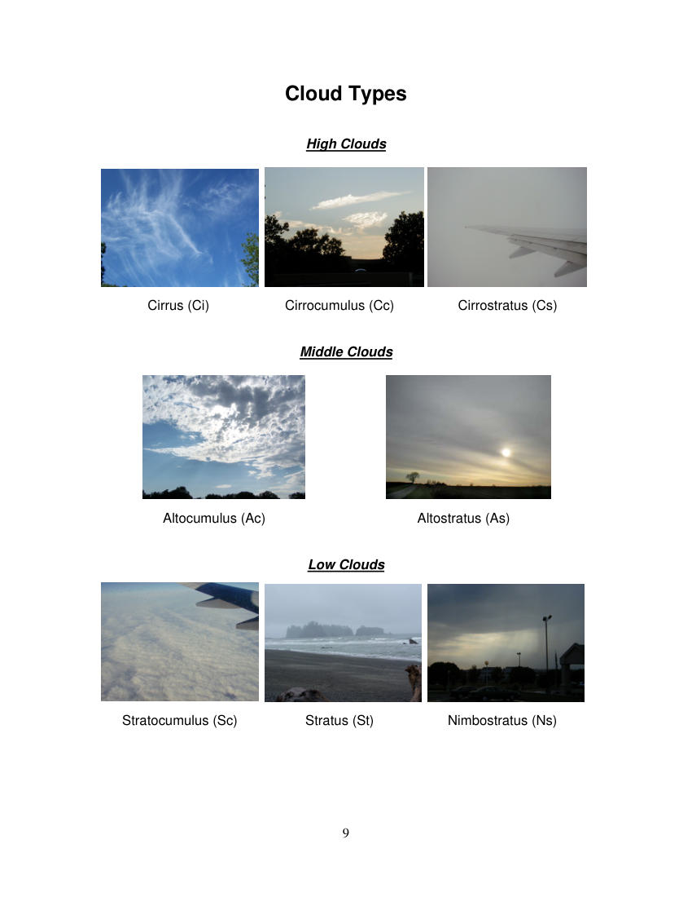

9 
 
Cloud Types 
 
 
High Clouds 
 
 
 
 
 
Cirrus (Ci) 
Cirrocumulus (Cc) 
Cirrostratus (Cs) 
 
 
Middle Clouds 
 
 
 
 
Altocumulus (Ac) 
Altostratus (As) 
 
 
Low Clouds 
 
 
 
 
 
Stratocumulus (Sc) 
Stratus (St) 
Nimbostratus (Ns)

## Page 10

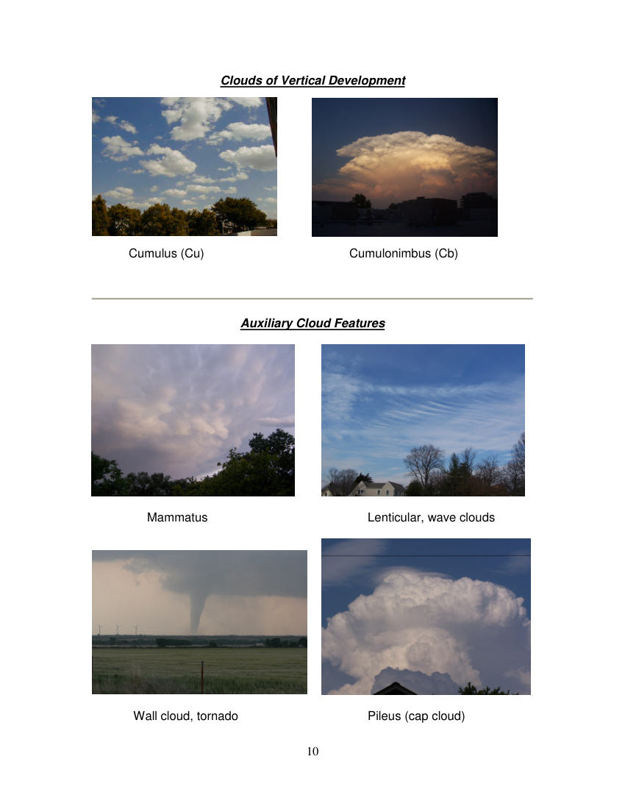

10 
 
Clouds of Vertical Development 
 
 
 
 
Cumulus (Cu) 
Cumulonimbus (Cb) 
 
 
 
 
Auxiliary Cloud Features 
 
 
 
 
Mammatus 
Lenticular, wave clouds 
 
 
 
 
Wall cloud, tornado 
Pileus (cap cloud)

## Page 11

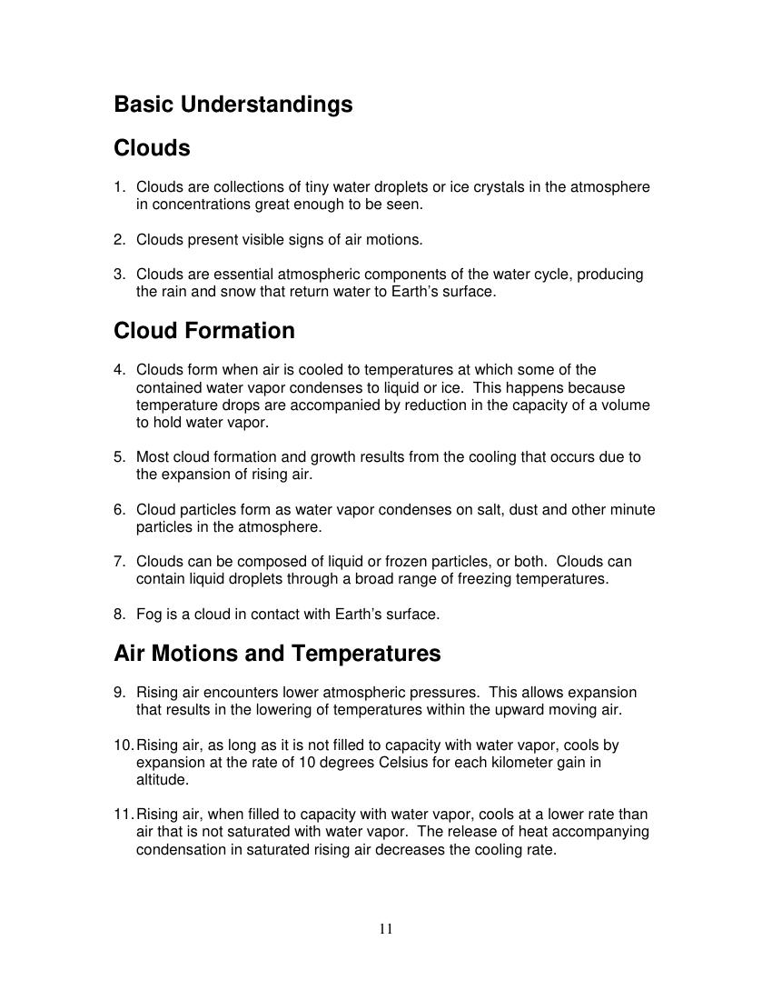

11 
 
Basic Understandings 
 
Clouds 
 
1. Clouds are collections of tiny water droplets or ice crystals in the atmosphere 
in concentrations great enough to be seen. 
 
2. Clouds present visible signs of air motions. 
 
3. Clouds are essential atmospheric components of the water cycle, producing 
the rain and snow that return water to Earth’s surface. 
 
Cloud Formation 
 
4. Clouds form when air is cooled to temperatures at which some of the 
contained water vapor condenses to liquid or ice.  This happens because 
temperature drops are accompanied by reduction in the capacity of a volume 
to hold water vapor. 
 
5. Most cloud formation and growth results from the cooling that occurs due to 
the expansion of rising air. 
 
6. Cloud particles form as water vapor condenses on salt, dust and other minute 
particles in the atmosphere. 
 
7. Clouds can be composed of liquid or frozen particles, or both.  Clouds can 
contain liquid droplets through a broad range of freezing temperatures. 
 
8. Fog is a cloud in contact with Earth’s surface. 
 
Air Motions and Temperatures 
 
9. Rising air encounters lower atmospheric pressures.  This allows expansion 
that results in the lowering of temperatures within the upward moving air. 
 
10. Rising air, as long as it is not filled to capacity with water vapor, cools by 
expansion at the rate of 10 degrees Celsius for each kilometer gain in 
altitude. 
 
11. Rising air, when filled to capacity with water vapor, cools at a lower rate than 
air that is not saturated with water vapor.  The release of heat accompanying 
condensation in saturated rising air decreases the cooling rate.

## Page 12

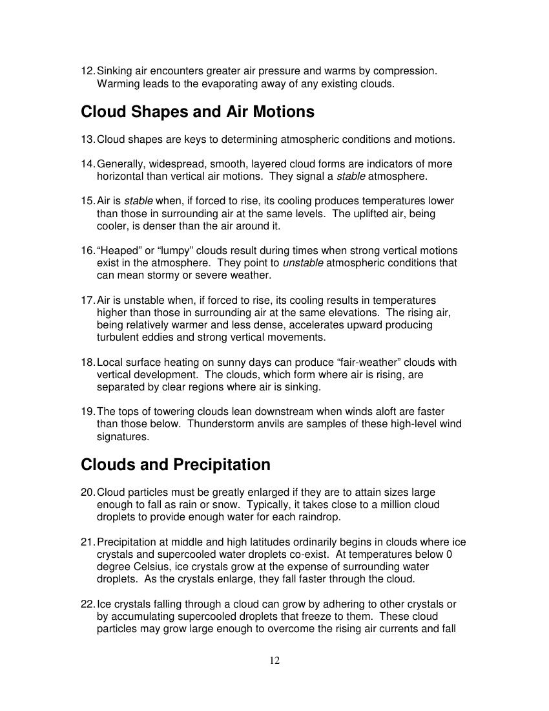

12 
 
12. Sinking air encounters greater air pressure and warms by compression.  
Warming leads to the evaporating away of any existing clouds. 
 
Cloud Shapes and Air Motions 
 
13. Cloud shapes are keys to determining atmospheric conditions and motions. 
 
14. Generally, widespread, smooth, layered cloud forms are indicators of more 
horizontal than vertical air motions.  They signal a stable atmosphere. 
 
15. Air is stable when, if forced to rise, its cooling produces temperatures lower 
than those in surrounding air at the same levels.  The uplifted air, being 
cooler, is denser than the air around it. 
 
16. “Heaped” or “lumpy” clouds result during times when strong vertical motions 
exist in the atmosphere.  They point to unstable atmospheric conditions that 
can mean stormy or severe weather. 
 
17. Air is unstable when, if forced to rise, its cooling results in temperatures 
higher than those in surrounding air at the same elevations.  The rising air, 
being relatively warmer and less dense, accelerates upward producing 
turbulent eddies and strong vertical movements. 
 
18. Local surface heating on sunny days can produce “fair-weather” clouds with 
vertical development.  The clouds, which form where air is rising, are 
separated by clear regions where air is sinking. 
 
19. The tops of towering clouds lean downstream when winds aloft are faster 
than those below.  Thunderstorm anvils are samples of these high-level wind 
signatures. 
 
Clouds and Precipitation 
 
20. Cloud particles must be greatly enlarged if they are to attain sizes large 
enough to fall as rain or snow.  Typically, it takes close to a million cloud 
droplets to provide enough water for each raindrop. 
 
21. Precipitation at middle and high latitudes ordinarily begins in clouds where ice 
crystals and supercooled water droplets co-exist.  At temperatures below 0 
degree Celsius, ice crystals grow at the expense of surrounding water 
droplets.  As the crystals enlarge, they fall faster through the cloud. 
 
22. Ice crystals falling through a cloud can grow by adhering to other crystals or 
by accumulating supercooled droplets that freeze to them.  These cloud 
particles may grow large enough to overcome the rising air currents and fall

## Page 13

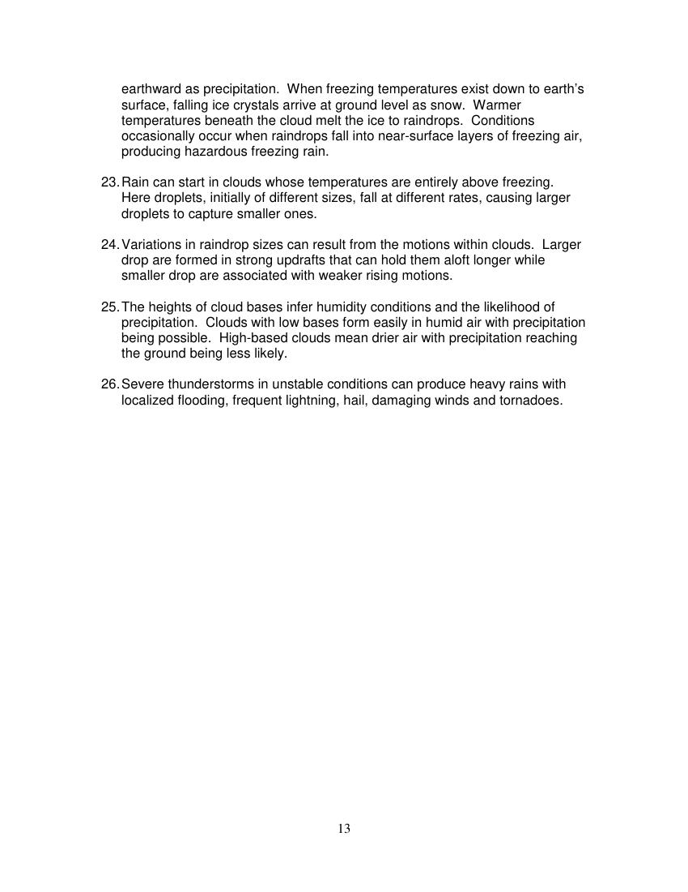

13 
 
earthward as precipitation.  When freezing temperatures exist down to earth’s 
surface, falling ice crystals arrive at ground level as snow.  Warmer 
temperatures beneath the cloud melt the ice to raindrops.  Conditions 
occasionally occur when raindrops fall into near-surface layers of freezing air, 
producing hazardous freezing rain. 
 
23. Rain can start in clouds whose temperatures are entirely above freezing.  
Here droplets, initially of different sizes, fall at different rates, causing larger 
droplets to capture smaller ones. 
 
24. Variations in raindrop sizes can result from the motions within clouds.  Larger 
drop are formed in strong updrafts that can hold them aloft longer while 
smaller drop are associated with weaker rising motions. 
 
25. The heights of cloud bases infer humidity conditions and the likelihood of 
precipitation.  Clouds with low bases form easily in humid air with precipitation 
being possible.  High-based clouds mean drier air with precipitation reaching 
the ground being less likely. 
 
26. Severe thunderstorms in unstable conditions can produce heavy rains with 
localized flooding, frequent lightning, hail, damaging winds and tornadoes.

## Page 14

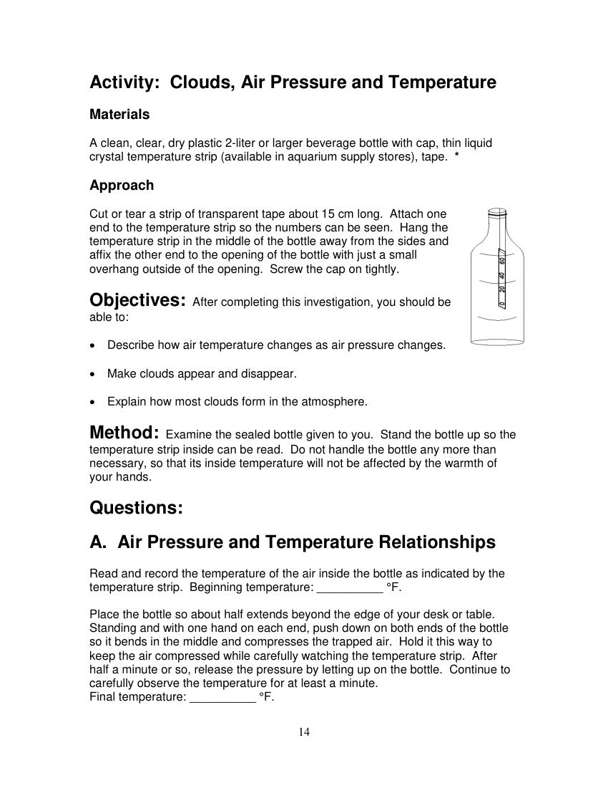

14 
 
Activity:  Clouds, Air Pressure and Temperature 
 
Materials 
 
A clean, clear, dry plastic 2-liter or larger beverage bottle with cap, thin liquid 
crystal temperature strip (available in aquarium supply stores), tape.  * 
 
Approach 
 
Cut or tear a strip of transparent tape about 15 cm long.  Attach one 
end to the temperature strip so the numbers can be seen.  Hang the 
temperature strip in the middle of the bottle away from the sides and 
affix the other end to the opening of the bottle with just a small 
overhang outside of the opening.  Screw the cap on tightly. 
 
Objectives:  After completing this investigation, you should be 
able to: 
 
• Describe how air temperature changes as air pressure changes. 
 
• Make clouds appear and disappear. 
 
• Explain how most clouds form in the atmosphere. 
 
Method:  Examine the sealed bottle given to you.  Stand the bottle up so the 
temperature strip inside can be read.  Do not handle the bottle any more than 
necessary, so that its inside temperature will not be affected by the warmth of 
your hands. 
 
Questions: 
 
A.  Air Pressure and Temperature Relationships 
 
Read and record the temperature of the air inside the bottle as indicated by the 
temperature strip.  Beginning temperature: __________ °F. 
 
Place the bottle so about half extends beyond the edge of your desk or table.  
Standing and with one hand on each end, push down on both ends of the bottle 
so it bends in the middle and compresses the trapped air.  Hold it this way to 
keep the air compressed while carefully watching the temperature strip.  After 
half a minute or so, release the pressure by letting up on the bottle.  Continue to 
carefully observe the temperature for at least a minute. 
Final temperature: __________ °F.

## Page 15

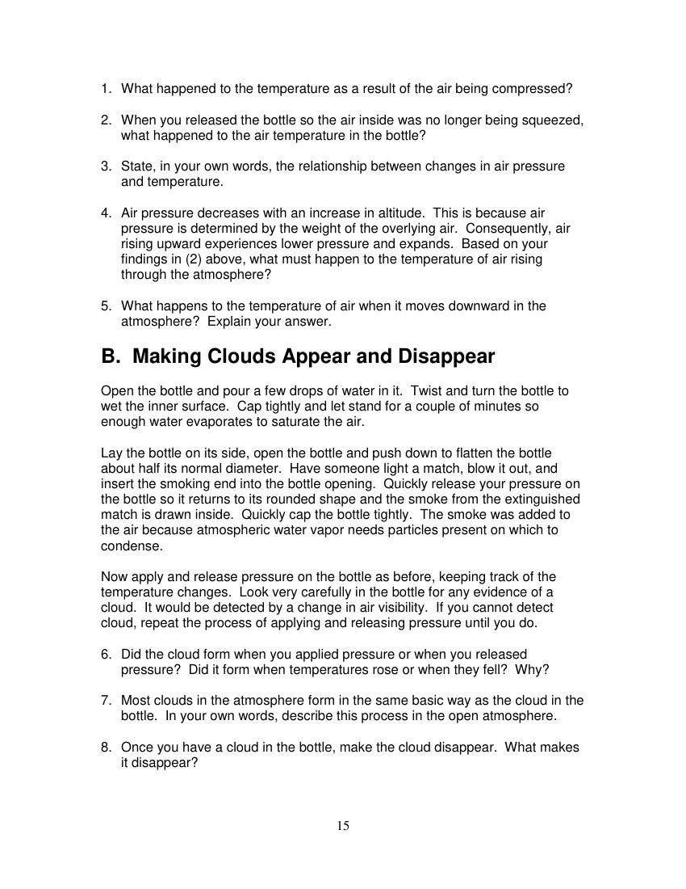

15 
 
1. What happened to the temperature as a result of the air being compressed? 
 
2. When you released the bottle so the air inside was no longer being squeezed, 
what happened to the air temperature in the bottle? 
 
3. State, in your own words, the relationship between changes in air pressure 
and temperature. 
 
4. Air pressure decreases with an increase in altitude.  This is because air 
pressure is determined by the weight of the overlying air.  Consequently, air 
rising upward experiences lower pressure and expands.  Based on your 
findings in (2) above, what must happen to the temperature of air rising 
through the atmosphere? 
 
5. What happens to the temperature of air when it moves downward in the 
atmosphere?  Explain your answer. 
 
B.  Making Clouds Appear and Disappear 
 
Open the bottle and pour a few drops of water in it.  Twist and turn the bottle to 
wet the inner surface.  Cap tightly and let stand for a couple of minutes so 
enough water evaporates to saturate the air. 
 
Lay the bottle on its side, open the bottle and push down to flatten the bottle 
about half its normal diameter.  Have someone light a match, blow it out, and 
insert the smoking end into the bottle opening.  Quickly release your pressure on 
the bottle so it returns to its rounded shape and the smoke from the extinguished 
match is drawn inside.  Quickly cap the bottle tightly.  The smoke was added to 
the air because atmospheric water vapor needs particles present on which to 
condense. 
 
Now apply and release pressure on the bottle as before, keeping track of the 
temperature changes.  Look very carefully in the bottle for any evidence of a 
cloud.  It would be detected by a change in air visibility.  If you cannot detect 
cloud, repeat the process of applying and releasing pressure until you do. 
 
6. Did the cloud form when you applied pressure or when you released 
pressure?  Did it form when temperatures rose or when they fell?  Why? 
 
7. Most clouds in the atmosphere form in the same basic way as the cloud in the 
bottle.  In your own words, describe this process in the open atmosphere. 
 
8. Once you have a cloud in the bottle, make the cloud disappear.  What makes 
it disappear?

## Page 16

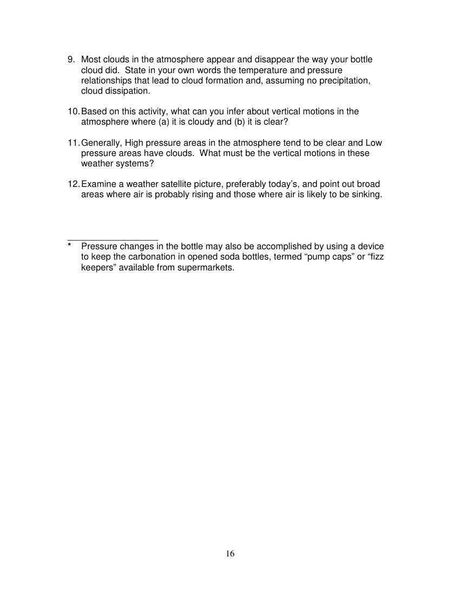

16 
 
9. Most clouds in the atmosphere appear and disappear the way your bottle 
cloud did.  State in your own words the temperature and pressure 
relationships that lead to cloud formation and, assuming no precipitation, 
cloud dissipation. 
 
10. Based on this activity, what can you infer about vertical motions in the 
atmosphere where (a) it is cloudy and (b) it is clear? 
 
11. Generally, High pressure areas in the atmosphere tend to be clear and Low 
pressure areas have clouds.  What must be the vertical motions in these 
weather systems? 
 
12. Examine a weather satellite picture, preferably today’s, and point out broad 
areas where air is probably rising and those where air is likely to be sinking. 
 
 
 
__________________ 
* 
Pressure changes in the bottle may also be accomplished by using a device 
to keep the carbonation in opened soda bottles, termed “pump caps” or “fizz 
keepers” available from supermarkets.

## Page 17

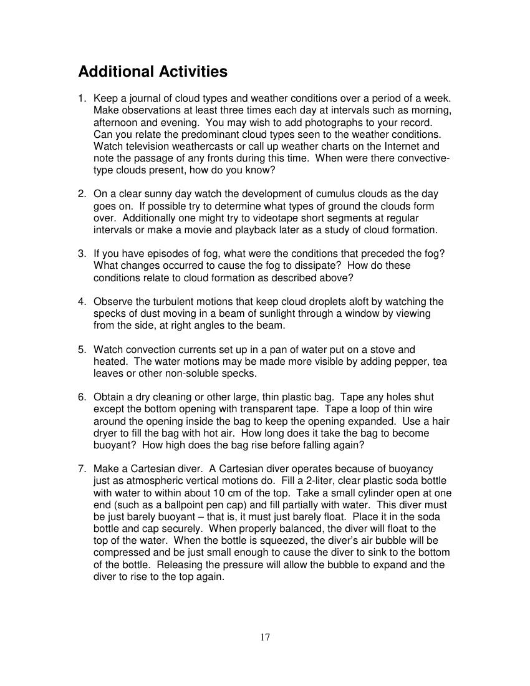

17 
 
Additional Activities 
 
1. Keep a journal of cloud types and weather conditions over a period of a week.  
Make observations at least three times each day at intervals such as morning, 
afternoon and evening.  You may wish to add photographs to your record.  
Can you relate the predominant cloud types seen to the weather conditions.  
Watch television weathercasts or call up weather charts on the Internet and 
note the passage of any fronts during this time.  When were there convective-
type clouds present, how do you know? 
 
2. On a clear sunny day watch the development of cumulus clouds as the day 
goes on.  If possible try to determine what types of ground the clouds form 
over.  Additionally one might try to videotape short segments at regular 
intervals or make a movie and playback later as a study of cloud formation. 
 
3. If you have episodes of fog, what were the conditions that preceded the fog?  
What changes occurred to cause the fog to dissipate?  How do these 
conditions relate to cloud formation as described above? 
 
4. Observe the turbulent motions that keep cloud droplets aloft by watching the 
specks of dust moving in a beam of sunlight through a window by viewing 
from the side, at right angles to the beam. 
 
5. Watch convection currents set up in a pan of water put on a stove and 
heated.  The water motions may be made more visible by adding pepper, tea 
leaves or other non-soluble specks. 
 
6. Obtain a dry cleaning or other large, thin plastic bag.  Tape any holes shut 
except the bottom opening with transparent tape.  Tape a loop of thin wire 
around the opening inside the bag to keep the opening expanded.  Use a hair 
dryer to fill the bag with hot air.  How long does it take the bag to become 
buoyant?  How high does the bag rise before falling again? 
 
7. Make a Cartesian diver.  A Cartesian diver operates because of buoyancy 
just as atmospheric vertical motions do.  Fill a 2-liter, clear plastic soda bottle 
with water to within about 10 cm of the top.  Take a small cylinder open at one 
end (such as a ballpoint pen cap) and fill partially with water.  This diver must 
be just barely buoyant – that is, it must just barely float.  Place it in the soda 
bottle and cap securely.  When properly balanced, the diver will float to the 
top of the water.  When the bottle is squeezed, the diver’s air bubble will be 
compressed and be just small enough to cause the diver to sink to the bottom 
of the bottle.  Releasing the pressure will allow the bubble to expand and the 
diver to rise to the top again.

## Page 18

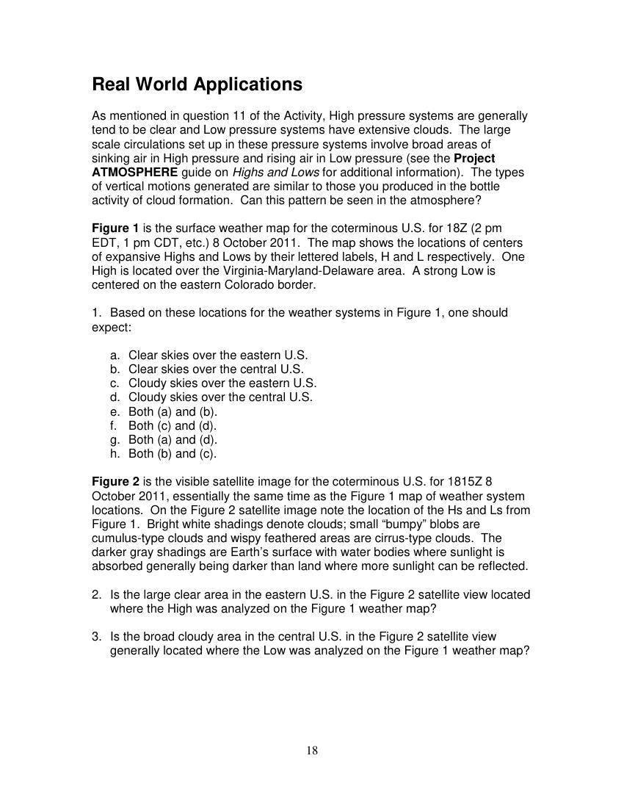

18 
 
Real World Applications 
 
As mentioned in question 11 of the Activity, High pressure systems are generally 
tend to be clear and Low pressure systems have extensive clouds.  The large 
scale circulations set up in these pressure systems involve broad areas of 
sinking air in High pressure and rising air in Low pressure (see the Project 
ATMOSPHERE guide on Highs and Lows for additional information).  The types 
of vertical motions generated are similar to those you produced in the bottle 
activity of cloud formation.  Can this pattern be seen in the atmosphere? 
 
Figure 1 is the surface weather map for the coterminous U.S. for 18Z (2 pm 
EDT, 1 pm CDT, etc.) 8 October 2011.  The map shows the locations of centers 
of expansive Highs and Lows by their lettered labels, H and L respectively.  One 
High is located over the Virginia-Maryland-Delaware area.  A strong Low is 
centered on the eastern Colorado border. 
 
1. Based on these locations for the weather systems in Figure 1, one should 
expect: 
 
a. Clear skies over the eastern U.S. 
b. Clear skies over the central U.S. 
c. Cloudy skies over the eastern U.S. 
d. Cloudy skies over the central U.S. 
e. Both (a) and (b). 
f. Both (c) and (d). 
g. Both (a) and (d). 
h. Both (b) and (c). 
 
Figure 2 is the visible satellite image for the coterminous U.S. for 1815Z 8 
October 2011, essentially the same time as the Figure 1 map of weather system 
locations.  On the Figure 2 satellite image note the location of the Hs and Ls from 
Figure 1.  Bright white shadings denote clouds; small “bumpy” blobs are 
cumulus-type clouds and wispy feathered areas are cirrus-type clouds.  The 
darker gray shadings are Earth’s surface with water bodies where sunlight is 
absorbed generally being darker than land where more sunlight can be reflected. 
 
2. Is the large clear area in the eastern U.S. in the Figure 2 satellite view located 
where the High was analyzed on the Figure 1 weather map? 
 
3. Is the broad cloudy area in the central U.S. in the Figure 2 satellite view 
generally located where the Low was analyzed on the Figure 1 weather map?

## Page 19

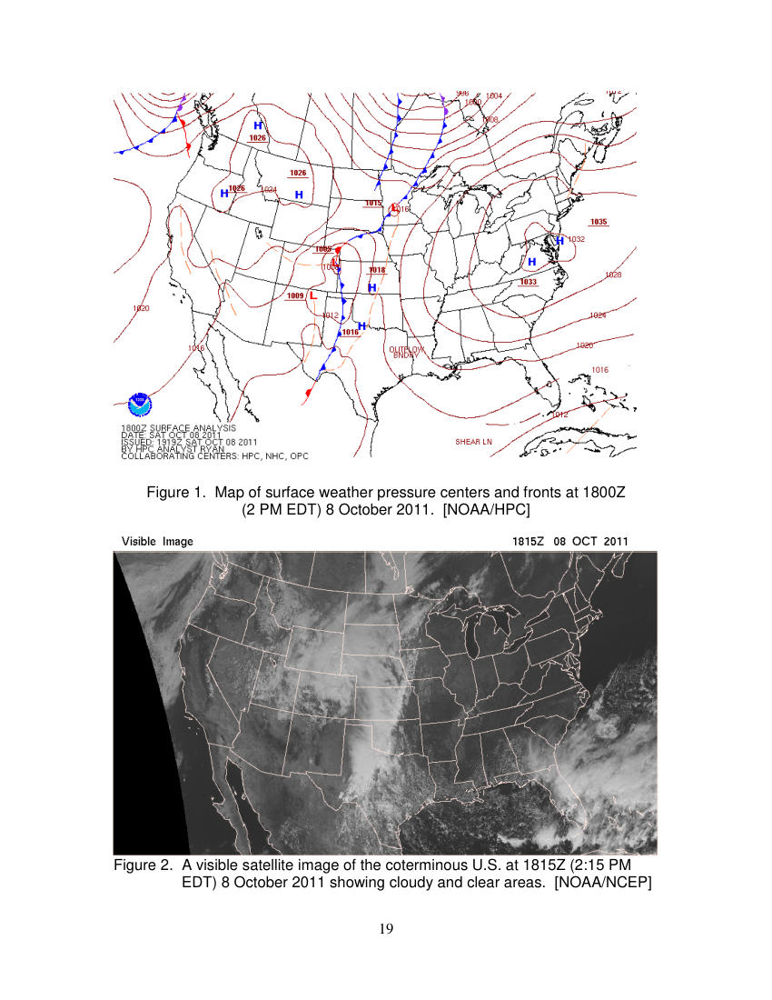

19 
 
 
Figure 1.  Map of surface weather pressure centers and fronts at 1800Z  
(2 PM EDT) 8 October 2011.  [NOAA/HPC] 
 
 
Figure 2.  A visible satellite image of the coterminous U.S. at 1815Z (2:15 PM 
EDT) 8 October 2011 showing cloudy and clear areas.  [NOAA/NCEP]

## Page 20

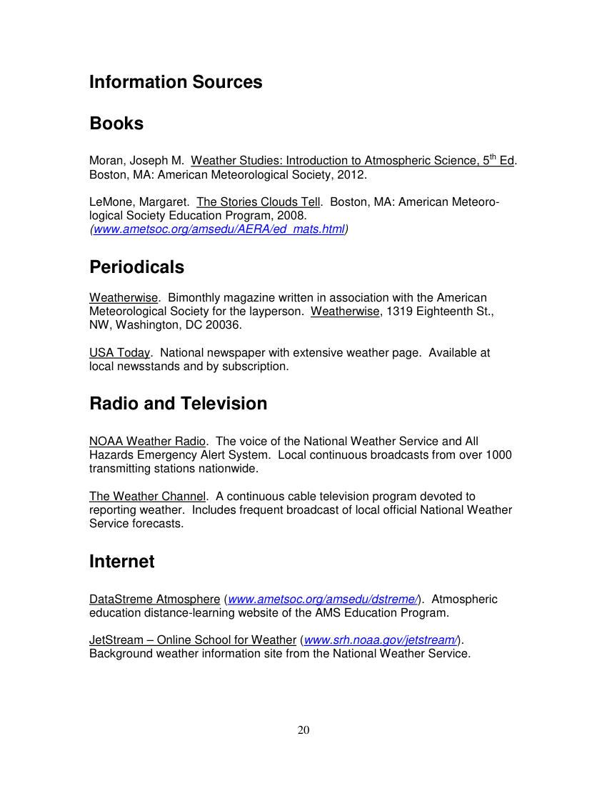

20 
 
Information Sources 
 
Books 
 
Moran, Joseph M.  Weather Studies: Introduction to Atmospheric Science, 5th Ed.  
Boston, MA: American Meteorological Society, 2012. 
 
LeMone, Margaret.  The Stories Clouds Tell.  Boston, MA: American Meteoro-
logical Society Education Program, 2008.  
(www.ametsoc.org/amsedu/AERA/ed_mats.html) 
 
Periodicals 
 
Weatherwise.  Bimonthly magazine written in association with the American 
Meteorological Society for the layperson.  Weatherwise, 1319 Eighteenth St., 
NW, Washington, DC 20036. 
 
USA Today.  National newspaper with extensive weather page.  Available at 
local newsstands and by subscription. 
 
Radio and Television 
 
NOAA Weather Radio.  The voice of the National Weather Service and All 
Hazards Emergency Alert System.  Local continuous broadcasts from over 1000 
transmitting stations nationwide. 
 
The Weather Channel.  A continuous cable television program devoted to 
reporting weather.  Includes frequent broadcast of local official National Weather 
Service forecasts. 
 
Internet 
 
DataStreme Atmosphere (www.ametsoc.org/amsedu/dstreme/).  Atmospheric 
education distance-learning website of the AMS Education Program. 
 
JetStream – Online School for Weather (www.srh.noaa.gov/jetstream/).  
Background weather information site from the National Weather Service.
