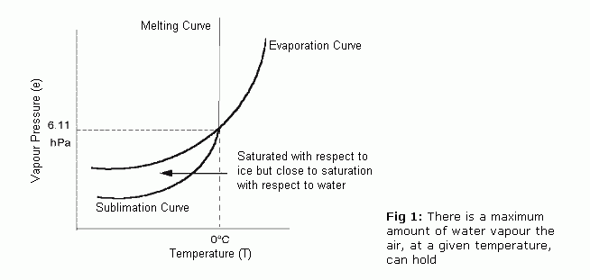
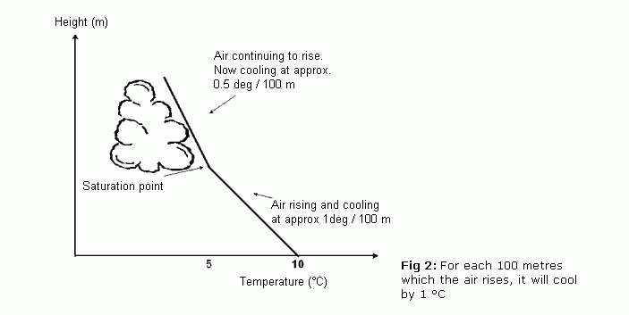
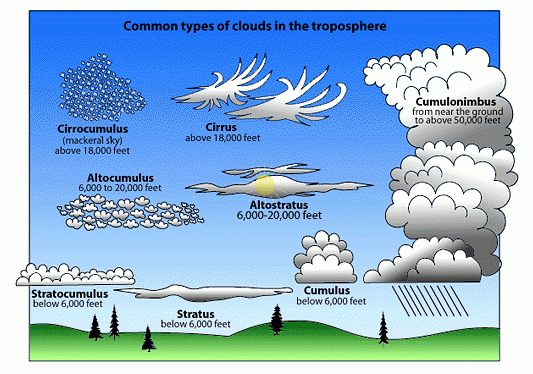
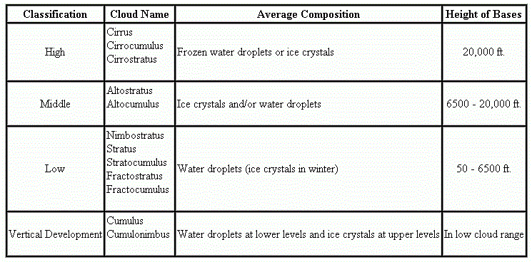
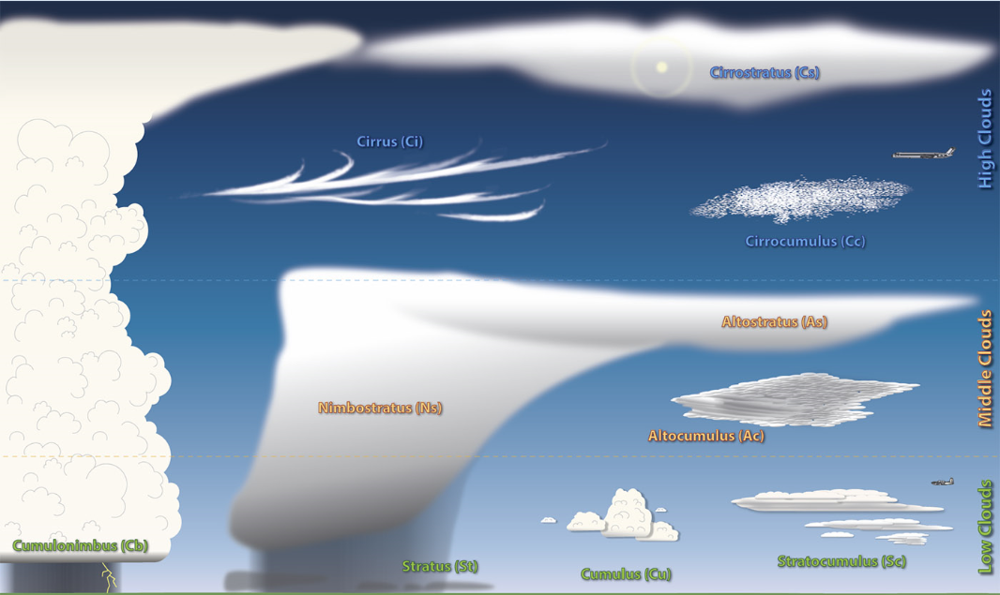

# How do Clouds and Rain Form?

> Source: <http://www.weather.gov/source/zhu/ZHU_Training_Page/clouds/cloud_development/clouds.htm>  
> Section: Clouds/Precipitation  
> Captured: 2026-08-19 06:00 UTC  
> PDF: [how-do-clouds-and-rain-form.pdf](how-do-clouds-and-rain-form.pdf) · Original HTML: [source/original.html](source/original.html)

---

**Select a tutorial below or scroll down...**- **[Cloud Tutorial](#CLOUD1)**
- **[Making Clouds and Rain](#CLOUD2)**
- **[Good Outline](#OUTLINE)**
- **[Another Cloud Tutorial](#CLOUD3)**
- **[Cloud Poster](#POSTER)**

**CLOUDS - HOW DO THEY FORM?**

Wind is the horizontal movement of air, transporting energy transferred from the earth's surface as sensible
and latent heat. Sensible heat is transferred by the processes of conduction and convection. Conduction
transfers energy within a substance, and convection transfers energy through the vertical movement of the
heated substance. Latent heat is the transfer of energy by transforming the substance itself. As you recall,
water has the ability to exist as liquid, gas or solid. The transformation from liquid to gas is called
evaporation; the reverse process, from gas to liquid, is called condensation; from liquid to solid is known as
solidification (freezing); and from solid to liquid, fusion (melting). Water can also be transformed directly
from solid to gas (sublimation), or the reverse, through a process called deposition. We will see these various processes in
the formation of clouds.

**Clouds are formed when air contains as much water vapor (gas) as it can hold. This is called the saturation
point, and it can be reached in two ways. First, moisture accumulates until it reaches the maximum amount the
volume of air can hold. The other method reduces the temperature of the moisture filled air, which in turn
lowers the amount of moisture it can contain. Saturation, therefore, is reached through evaporation and
condensation, respectively. When saturation occurs, moisture becomes visible water droplets in the form of
fog and clouds.**

It should be noted that condensation by itself does not cause precipitation (rain, snow, sleet, hail). The
moisture in clouds must become heavy enough to succumb to gravity and return to earth's surface. This occurs
through two processes. In cold clouds ice crystals and water droplets exist side by side. Due to an imbalance
of water vapor pressure, the water droplets transfer to the ice crystals. The crystals eventually grow heavy
enough to fall to earth. In the second process, water droplets in warm clouds collide and change their electric
charge. Droplets of unlike charge attract one another and merge, thereby growing until they have sufficient
weight to fall.

There is no difference between fog and clouds other than altitude. Fog is defined as a visible moisture that
begins at a height lower than 50 feet. If the visible moisture begins at or above 50 feet, it is called a cloud.
Two common types of fog are called radiation fog and advection fog. Radiation fog forms during the night as the
earth's surface cools and the air immediately above it cools in turn by conduction. If the air is moist enough,
the cooling causes it to reach saturation and visible water droplets form. We often call this type of fog ground
fog because it lies so close to the surface. Advection fog forms when warm moist air moves over a colder surface
(advection means to move horizontally). A perfect example is on the west coast of continents. Prevailing westerly
winds move moist air from over a warm ocean area to over the colder waters off the coast. Fog forms and is
carried by the westerly over the land.

[**TOP**](how-do-clouds-and-rain-form.md#top)

**MAKING CLOUDS AND RAIN**

Although the formation of clouds and precipitation can be quite complex in full detail, we can simplify the
process into a simple recipe, good for the vast majority of situations.

First, we need two basic ingredients: water and dust.

On Planet Earth, naturally occurring clouds are composed primarily of water in its liquid or solid state. (On
other planets, clouds may form from other compounds such as the sulphuric acid clouds on Venus.) Thus, we begin
our recipe by collecting a sufficient quantity of water in the vapor state that we will soon transform into
the liquid or solid states. The water vapor content of the atmosphere varies from near zero to about 4 percent,
depending on the moisture on the surface beneath and the air temperature.

Next, we need some dust. Not a large amount nor large particles and not all dusts will do. Without "dirty air"
there would likely be no clouds at all or only high altitude ice clouds. Even the "cleanest" air found on Earth
contains about 1000 dust particles per cubic meter of air. Dust is needed for condensation nuclei, sites on
which water vapor may condense or deposit as a liquid or solid. Certain types and shapes of dust and salt
particles, such as sea salts and clay, make the best condensation nuclei.

With proper quantities of water vapor and dust in an air parcel, the next step is for the air parcel mass to be
cooled to a temperature at which cloud droplets or ice crystals can form. And, voila, we have clouds.

This simple recipe is a lot like cooking chicken -- you take a chicken and some spices, apply heat and after a
time you have a cooked chicken. But just as there are many ways to cook chicken, there are many different ways
to form clouds.

**THE PRECIPITATION LADDER**
**11.** PRECIPITATION
**10.** DROPLET GROWTH
**9.** BUOYANCY/CLOUDINESS
**8.** CONDENSATION
**7.** SATURATION
**6.** HUMIDIFICATION
**5.** COOLING
**4.** EXPANSION
**3.** ASCENT
**2.** DIRTY AIR
**1.** WATER VAPOR

Let us now expand our recipe and add precipitation. Professor John Day, the Cloud Man, has taken the simple
cloud recipe, added a few more details and continued it until it also makes precipitation. He calls this The
Precipitation Ladder. As with our simple recipe, he begins the process with the basic ingredients of dirty air
and water vapor. In Rungs 3 through 8, he takes the ingredients through several processes to form a cloud.

**Ascent and Expansion are two of the main processes that result in the cooling of an air parcel in which clouds
will form. We mostly think of moving air as wind flowing horizontally across the surface. But air moving
vertically is extremely important in weather processes, particularly with respect to clouds and precipitation.**
Ascending air currents take us up the Precipitation Ladder. (Where descending currents are present, we come
down the Ladder with processes reversing until we are finally left with water vapor and dust in an air mass.)

**There are four main processes occurring at or near the earth's surface which give can rise to ascending air:
convergence, convection, frontal lifting and physical lifting.**

Convergence occurs when several surface air currents in the horizontal flow move toward each other to meet in a
common space. When they converge, there is only one way to go: Up. A surface low pressure cell is an example of
an area of convergence and air at its center must rise as a result.

Convection occurs when air is heated from below by sunlight or by contact with a warmer land or water surface
until it becomes less dense than the air above it. The heated parcel of air will rise until it has again cooled
to the temperature of the surrounding air.

Frontal lifting occurs when a warmer air mass meets a colder one. Since warm air is less dense than cold, a warm
air mass approaching a cold one will ascend over the cold air. This forms a warm front. When a cold air mass
approaches a warm one, it wedges under the warmer air, lifting it above the ground. This forms a cold front. In
either case, there is ascending air at the frontal boundary.

Physical lifting, also known as orographic lifting, occurs when horizontal winds are forced to rise in order to
cross topographical barriers such as hills and mountains.

**Whatever the process causing an air parcel to ascend, the result is that the rising air parcel must change its
pressure to be in equilibrium with the surrounding air. Since atmospheric pressure decreases with altitude, so
too must the pressure of the ascending air parcel. As air ascends, it expands. And as it expands, it cools. And
the higher the parcel rises, the cooler it becomes.**

Now that we have begun cooling the air parcel, we are almost ready to form a cloud. We must continue to cool the
parcel until condensation is reached. The next several rungs of the Precipitation Ladder describe the processes
through to the condensation of liquid water.

As the air cools, its relative humidity will increase - a process Day terms humidification (Rung 6). Although
nothing has yet happened to change the water vapor content of the air, the saturation threshold of the air
parcel has decreased as the air cooled. By decreasing the saturation threshold, the relative humidity increases.
Cooling is the most important method for increasing the relative humidity but it is not the only one. Another
is to add more water vapor through evaporation or mixing with a more humid air mass.

**If we are to form a cloud, humidification may eventually bring the air within the parcel to saturation. At
saturation the relative humidity is 100 percent. Usually a little more humidification is required which brings
the relative humidity to over 100 percent, a state known as supersaturation, before a cloud will form. When air
becomes supersaturated, its water vapor looks for ways to condense out. If the quantity and composition of the
dust content is ideal, condensation may begin at a relative humidity below 100 percent. If the air is very
clean, it may take high levels of supersaturation to produce cloud droplets. But typically condensation begins
at relative humidity a few tenths of a percent above saturation.**

Condensation of water onto condensation nuclei (or deposition of water vapor as ice on freezing nuclei) begins
at a particular altitude known as the cloud base or lifting condensation level. Water molecules attach to the
particles and form cloud droplets which have a radius of about 20 micrometers (0.02 mm) or less. The droplet
volume is generally a million times greater than the typical condensation nuclei.

**Clouds are composed of large numbers of cloud droplets, or ice crystals, or both. Because of their small size
and relatively high air resistance, they can remain suspended in the air for a long time, particularly if they
remain in ascending air currents.** The average cloud droplet has a terminal fall velocity of 1.3 cm per second in
still air. To put this into perspective, the average cloud droplet falling from a typical low cloud base of 500
meters/1,650 feet would take more than 10 hours to reach the ground.

We now know that cirrus clouds in their various forms are composed of ice crystals, and the upper levels of tall
cumulus may also have ice in them even in the summer.

While clouds in their varied forms and appearances (See Cloud Atlas) are a source of much interest, we will
leave them now and continue up the Precipitation Ladder toward the top rung: Precipitation.
Forming Precipitation
Light Rain

We know that not all clouds produce rain that strikes the ground. Some may produce rain or snow that evaporates
before reaching the ground, and most clouds produce no precipitation at all. When rain falls, we know from
measurements that the drops are larger than one millimeter. A raindrop of diameter 2 mm contains the water
equivalent of a million cloud droplets (0.02 mm diameter). So if we are to get some precipitation from a cloud,
there must be additional process within the cloud to form raindrops from cloud droplets.

The next rung of the Precipitation Ladder is Buoyancy or Cloudiness which signifies that we must increase the
cloud water content before we can expect any precipitation.

This requires a continuation of the lifting process. It is assisted by the property of water of giving off heat
when changing from vapor to liquid and solid states, the latent heats of condensation and of deposition,
respectively. (If the vapor first changes to a liquid before freezing, then we also have the latent heat of
condensation released and followed by the release of the latent heat of freezing.) This additional heat release
warms the air parcel. In doing so, the buoyancy of the parcel relative to the surrounding air increases, and
this contributes to the parcel's further rise. We can see the continued ascent of these parcels in cumulus
clouds that reach great vertical growth.

Now in the cloud, there must be Growth of cloud droplets to sizes that can fall to the ground as rain (we will
look at snow in a minute) without evaporating. Cloud droplets can grow to a larger size in three ways.

The first is by the continued condensation of water vapor into cloud droplets and thus increasing their volume/
size until they become droplets. While the first condensation of water onto condensation nuclei to form cloud
droplets occurs rather quickly, continued growth of cloud droplets in this manner will proceed very slowly.

Second, growth by collision and coalescence of cloud droplets (and then the collision of rain drops with cloud
droplets and other drops) is a much quicker process. Turbulent currents in the clouds provide the first
collisions between droplets. The combination forms a larger drop which can further collide with other droplets,
thus growing rapidly in size.

As the drops grow, their fall velocity also increases, and thus they can collide with slower falling droplets.
A 0.5 mm-radius drop falling at a rate of 4 m/s can quickly overtake a 0.05 mm (50 micrometer) drop falling at
0.27 m/s. When drops are too large, however, their collection efficiency for the smallest drops and droplets is
not as great as when the drops are nearer in size. Small droplets may bounce off or flow around much larger
drops and therefore do not coalesce. A drop about 60% smaller in diameter is most likely to be collected by a
large drop.

Clouds with strong updraft areas have the best drop growth because the drops and droplets stay in the cloud
longer and thus have many more collision opportunities.

Finally, it may seem odd, but the best conditions for drop growth occur when ice crystals are present in a
cloud. When in small droplet form, liquid water must be cooled well below 0 ° C (32 °F) before freezing. In fact,
under optimal conditions, a pure droplet may reach -40 °C before freezing. Therefore, there are areas
within a cloud were ice crystals and water droplets co-exist.

When ice crystals and supercooled droplets are near each other, there is a movement of water molecules from the
droplet to the crystal. This increases the size of the ice crystal at the expense of the droplet. When the
crystals grow at temperatures around -10 °C (14 °F), they begin to develop arms and branches, the stereotypical
snow crystal. Such crystals not only are efficient at growing at the expense of water droplets, they also
easily stick to one another forming large aggregates we call snowflakes.

Finally, the drops have grown to a size that they can fall in a reasonable time to the surface without
evaporating, and we have reached the top rung Precipitation. (For more on raindrops, click here.)The following
table gives some typical drop diameters for various rain types, using cloud droplets as a reference size. Most
rain falls in the range of 0.2 to 5 mm (0.008 to 0.20 inch).

Of course, not all precipitation falls as rain. A fair amount of the world's precipitation falls as snow or some
other solid water form. Actually, outside the tropical regions, it is likely that the much of the precipitation
begins in the solid form and only becomes liquid rain when it melts while falling through air with temperatures
above freezing.

Most people call almost any frozen form of precipitation, other than hail or ice pellets, a snowflake. But
meteorologists are a bit more fussy. Technically the term snowflake refers to an assemblage of individual snow
crystals that have bumped together and remain joined during their fall. Snowflakes typically fall when air
temperatures near the earth's surface are not far from the freezing mark. Snow crystals adhere to each other
better at these temperatures. At very cold temperatures, snowflakes are uncommon and we see mostly snow crystals
during a snow fall.

Snow crystals are typically 0.5 to 5 millimeters ( 0.02 to 0.20 inches) in size whereas snowflakes are about 10
mm in size (0.4 inches) and may be as large as 200 to 400 mm (0.79 to 1.57 inches).

Other common forms of solid precipitation are: hail, sleet or ice pellets, graupel or soft hail or snow grains,
and a special form: freezing rain, also known as glaze or rime. The latter falls as a liquid but freezes on
contact with an object. When clear ice forms, freezing rain is called glaze. When the ice is milky, it is called
rime.

Hail is a phenomenon of severe thunderstorms, requiring strong updrafts to form hailstones by passing the
hailstone seed many times through air laden with drops and ice crystals.

[**TOP**](how-do-clouds-and-rain-form.md#top)

**OUTLINE - CAUSES OF CLOUDINESS**

1) Formation over area

A) Cooling of air to dew point

1) Lifting

a) Convection

1) Heating from below

A) Advection over warmer surface

B) Insolation

C) Advection of warm air in the lowest layers

2) Cooling from above

A) Radiation from top of cloud deck

B) Advection of cold air aloft

b) Mechanical lifting along a surface

1) Orographic

2) Overrunning along a potential temperature surface

3) Upglide along a frontal surface

c) Convergence

1) Low pressure center of trough

2) Wind shear (speed and/or directional convergence)

3) Latitudinal change (northward moving current)

4) Vorticity increase (southward moving current)

2) Radiation (fog)

3) Conduction from cooler surface (fog)

4) Mixing with cooler air mass

B) Increase in moisture (warming dew point to temperature)

1) Mixing

a) Caused by convection

b) Caused by strong winds

2) Contact with moist surface

3) Evaporation from falling precipitation
2) Advection from elsewhere

A) Formation in other area covered above

B) Changes during advection as indicated above for the various operating processes

[**TOP**](how-do-clouds-and-rain-form.md#top)

**ANOTHER CLOUD TUTORIAL**
What causes clouds?
What influences the color of clouds?
Why do clouds stop growing upwards?
Why are there no clouds on some days?
Types of clouds
Low clouds
Medium clouds
High clouds
Measuring clouds
The formation of precipitation

---

**What causes clouds?**

A cloud is defined as 'a visible aggregate of minute droplets of water or particles of ice or a mixture of both
floating in the free air'. Each droplet has a diameter of about a hundredth of a millimeter and each cubic
meter of air will contain 100 million droplets. Because the droplets are so small, they can remain in liquid
form in temperatures of -30 °C. If so, they are called supercooled droplets.

Clouds at higher and extremely cold levels in the atmosphere are composed of ice crystals - these can be
about a tenth of a millimeter long.

Clouds form when the invisible water vapor in the air condenses into visible water droplets or ice crystals.
For this to happen, the parcel of air must be saturated, i.e. unable to hold all the water it contains in
vapor form, so it starts to condense into a liquid or solid form. **There are two ways by which saturation is
reached.**

(a) **By increasing the water content in the air, e.g. through evaporation, to a point where the air can hold no
more.**

(b) **By cooling the air so that it reaches its dew point - this is the temperature at which condensation
occurs, and is unable to 'hold' any more water.** **Figure 1** shows how there is a maximum amount of water
vapor the air, at a given temperature, can hold. In general, the warmer the air, the more water vapor it
can hold. Therefore, reducing its temperature decreases its ability to hold water vapor so that
condensation occurs.

Method (b) is the usual way that clouds are produced, and it is associated with air rising in the lower part of
the atmosphere. As the air rises it expands due to lower atmospheric pressure, and the energy used in
expansion causes the air to cool. Generally speaking, for each 100 meters/330 feet which the air rises, it will cool by
1 °C, as shown in **Figure 2**. The rate of cooling will vary depending on the water content, or humidity, of
the air. Moist parcels of air may cool more slowly, at a rate of 0.5 ° C per 100 meters/330 feet.

Therefore, the vertical ascent of air will reduce its ability to hold water vapor, so that condensation occurs.
The height at which dew point is reached and clouds form is called the condensation level.

**There are five factors which can lead to air rising and cooling:**

1. **Surface heating**. The ground is heated by the sun which heats the air in contact with it causing it to rise.
The rising columns are often called thermals.
2. **Topography**. Air forced to rise over a barrier of mountains or hills. This is known as orographic uplift.
3. **Frontal**. A mass of warm air rising up over a mass of cold, dense air. The boundary is called a 'front'.
4. **Convergence**. Streams of air flowing from different directions are forced to rise where they meet.
5. **Turbulence**. A sudden change in wind speed with height creating turbulent eddies in the air.

Another important factor to consider is that water vapor needs something to condense onto. Floating in
the air are millions of minute salt, dust and smoke particles known as condensation nuclei which enable
condensation to take place when the air is just saturated.

---

**What influences the color of clouds?**

Light from both the sky and from clouds is sunlight which has been scattered. In the case of the sky, the
molecules of air (nitrogen and oxygen) undertake the scattering, but the molecules are so small that the
blue part of the spectrum is scattered more strongly than other colors.

The water droplets in the cloud are much larger, and these larger particles scatter all of the colors of the
spectrum by about the same amount, so white light from the sun emerges from the clouds still white.

Sometimes, clouds have a yellowish or brownish tinge - this is a sign of air pollution.

---

**Why do clouds stop growing upwards?**

Condensation involves the release of latent heat. This is the 'invisible' heat which a water droplet 'stores'
when it changes from a liquid into a vapor. Its subsequent change of form again releases enough latent
heat to make the damp parcel of air warmer than the air surrounding it. This allows the parcel of air to rise
until all of the 'surplus' water vapor has condensed and all the latent heat has been released.

Therefore, the main reason which stops clouds growing upwards is the end of the release of latent heat
through the condensation process. There are two other factors which also play a role. Faster upper
atmospheric winds can plane off the tops of tall clouds, whilst in very high clouds, the cloud might cross the
tropopause, and enter the stratosphere where temperatures rise, rather than decrease, with altitude. This
thermal change will prevent further condensation.

---

**Why are there no clouds on some days?**

Even when it is very warm and sunny, there might not be any clouds and the sky is a clear blue. The usual
reason for the absence of clouds will be the type of pressure, with the area being under the influence of a
high pressure or anticyclone. Air would be sinking slowly, rather than rising and cooling. As the air sinks
into the lower part of the atmosphere, the pressure rises, it becomes compressed and warms up, so that no
condensation takes place. In simple terms, there are no mechanisms for clouds to form under these
pressure conditions.

---

**Types of clouds**

In 1803 a retail chemist and amateur meteorologist called Luke Howard proposed a system which has
subsequently become the basis of the present international classification. Howard also become known by
some people as "the father of British meteorology", and his pioneering work stemmed from his curiosity
into the vivid sunsets in the late 18th century following a series of violent volcanic eruptions. They had
ejected dust high up into the atmosphere, thereby increasing the amount of condensation nuclei, and
producing spectacular cloud formations and sunsets.

Howard recognised four types of cloud and gave them the following Latin names:

Cumulus - heaped or in a pile
Stratus - in a sheet or layer
Cirrus - thread-like, hairy or curled
Nimbus - a rain bearer

If we include another Latin word altum meaning height, the names of the ten main cloud types are all
derived from these five words and based upon their appearance from ground level and visual
characteristics.

The cloud types are split into three groups according to the height of their base above mean sea level.
Note that 'medium' level clouds are prefixed by the word alto and 'high' clouds by the word cirro (see Table
1). All heights given are approximate above sea level in mid-latitudes. If observing from a hill top or
mountain site, the range of bases will accordingly be lower.

Low clouds Surface - 7,000 ft
Medium clouds 7,000 - 17,000 ft
High clouds 17,000 - 35,000 ft

---

**LOW CLOUDS**

**Cumulus (Cu)**
 **Height of base:** 1,200-6,000 ft
 **Color:** White on its sunlit parts but with darker undersides.
 **Shape:** This cloud appears in the form of detached heaps. Shallow cumulus may appear quite ragged,
especially in strong winds, but well formed clouds have flattened bases and sharp outlines. Large cumulus
clouds have a distinctive "cauliflower" shape.
 **Other features:** Well developed cumulus may produce showers.

 **Cumulonimbus (Cb)**
 **Height of base:** 1,000-5,000 ft
 **Color:** White upper parts with dark, threatening undersides.
 **Shape:** A cumulus-type cloud of considerable vertical extent. When the top of a cumulus reaches great
heights, the water droplets are transformed into ice crystals and it loses its clear, sharp outline. At this
stage the cloud has become a cumulonimbus. Often, the fibrous cloud top spreads out into a distinctive
wedge or anvil shape.
 **Other features:** Accompanied by heavy showers, perhaps with hail and thunder. By convention Cb is usually
reported if hail or thunder occur, even if the observer does not immediately recognise the cloud as Cb; (it
may be embedded within layers of other cloud types).

 **Stratus (St)**
 **Height of base:** surface-1,500 ft
 **Color:** Usually grey.
 **Shape:** May appear as a layer with a fairly uniform base or in ragged patches, especially during precipitation
falling from a cloud layer above. Fog will often lift into a layer of stratus due to an increase in wind or
rise in temperature. As the sun heats the ground the base of stratus cloud may rise and break becoming shallow
cumulus cloud as its edges take on a more distinctive form.
 **Other features:** If thin, the disc of the sun or moon will be visible (providing there are no other cloud layers
above). If thick, it may produce drizzle or snow grains.

 **Stratocumulus (Sc)**
 **Height of base:** 1,200-7,000 ft
 **Color:** Grey or white, generally with shading.
 **Shape:** Either patches or a sheet of rounded elements but may also appear as an undulating layer. When
viewed from the ground, the size of individual elements will have an apparent width of more than 5degree when
at an elevation greater than 30degree (the width of 3 fingers at arm's length).
 **Other features:** May produce light rain or snow. Sometimes the cloud may result from the spreading out of
cumulus, giving a light shower.

---

**MEDIUM CLOUDS**

 **Altocumulus (Ac)**
 **Height of base:** 7,000-17,000 ft
 **Color:** Grey or white, generally with some shading.
 **Shape:** Several different types, the most common being either patches or a sheet of rounded elements but may
also appear as a layer without much form. When viewed from the ground, the size of individual elements will
have an apparent width of 1 to 5degree when at an elevation greater than 30degree (the width of 1 to 3
fingers at arm's length). Even if the elements appear smaller than this the cloud is still classified
altocumulus if it shows shading.
 **Other features:** Occasionally some slight rain or snow, perhaps in the form of a shower may reach the
ground. On rare occasions, a thunderstorm may occur from one type of Ac known as altocumulus
castellanus — so called because in outline, the cloud tops look like a series of turrets and towers along a
castle wall.

 **Altostratus (As)**
 **Height of base:** 8,000-17,000 ft
 **Color:** Greyish or bluish.
 **Shape:** A sheet of uniform appearance totally or partly covering the sky.
 **Other features:** Sometimes thin enough to reveal the sun or moon vaguely, as through ground glass.
Objects on the ground do not cast shadows. May give generally light rain or snow, occasionally ice pellets, if
the cloud base is no higher than about 10,000 ft.

 **Nimbostratus (Ns)**
 **Height of base:** 1,500-10,000 ft
 **Color:** Dark grey.
 **Shape:** A thick, diffuse layer covering all or most of the sky.
 **Other features:** Sun or moon always blotted out. Accompanied by moderate or heavy rain or snow,
occasionally ice pellets. Although classed as a medium cloud, its base frequently descends to low cloud
levels. May be partly or even totally obscured by stratus forming underneath in precipitation.

---

**HIGH CLOUDS**

**Cirrus (Ci)**
 **Height of base:** 17,000-35,000 ft
 **Color:** Composed of ice crystals, therefore white.
 **Shape:** Delicate hair-like filaments, sometimes hooked at the end; or in denser, entangled patches; or
occasionally in parallel bands which appear to converge towards the horizon.
 **Other features:** The remains of the upper portion of a cumulonimbus is also classified as cirrus.

**Cirrocumulus (Cc)**
 **Height of base:** 17,000-35,000 ft
 **Color:** Composed of ice crystals, therefore white.
 **Shape:** Patches or sheet of very small elements in the form of grains or ripples or a honeycomb. When
viewed from the ground, the size of individual elements will have an apparent width of less than 1degree when
at an elevation greater than 30degree (no greater than the width of a little finger at arm's length).
 **Other features:** Sometimes its appearance in a regular pattern of 'waves' and small gaps may resemble
the scales of a fish, thus giving rise to the popular name 'mackerel sky'. (this name may also be attributed
to high altocumulus clouds).

**Cirrostratus (Cs)**
 **Height of base:** 17,000-35,000 ft
 **Color:** Composed of ice crystals, therefore white.
 **Shape:** A transparent veil of fibrous or smooth appearance totally or partly covering the sky.
 **Other features:** Thin enough to allow the sun to cast shadows on the ground unless it is low in the sky.
Produces halo phenomena, the most frequent being the small (22degree ) halo around the sun or moon — a little
more than the distance between the top of the thumb and the little finger spread wide apart at arm's
length.

**Condensation trails (contrails)**
These are thin trails of condensation, formed by the water vapor rushing out from the engines of jet
aircraft flying at high altitudes. They are not true clouds, but can remain in the sky for a long time, and
grow into cirrus clouds.

---

**Measuring clouds**

The cloud amount is defined as 'the proportion of the celestial dome which is covered by cloud. The scale
used is eighths, or oktas, with observers standing in an open space or on a rooftop to get a good view or
panorama of the sky.

Complete cloud cover is reported as 8 oktas, half cover as 4 oktas, and a completely clear sky as zero
oktas. If there is low-lying mist or fog, the observer will report sky obscured.

The reporter will also report the amount of each cloud level — 2 oktas of cumulus and 3 oktas of cirrus, etc.

The frequent passage of depressions across the United Kingdom means that the most commonly reported
cloud amount is, not surprisingly, 8 oktas. A clear blue sky, i.e. zero oktas, is less common, as often on
hot, sunny days, there are small wispy layers of cirrostratus or fine tufts of thin cirrus at high altitudes.

---

**The formation of precipitation**

Cooling, condensation and cloud formation is the start of the process which results in precipitation. But not
all clouds will produce raindrops or snowflakes — many are so short-lived and small that there are no
opportunities for precipitation mechanisms to start.

There are two theories that explain how minute cloud droplets develop into precipitation.

1. The Bergeron-Findeisen ice-crystal mechanism

If parcels of air are uplifted to a sufficient height in the troposphere, the dew point temperature will be very
low, and minute ice crystals will start to form. The supercooled water droplets will also freeze on contact with
these ice nuclei.

The ice crystals subsequently combine to form larger flakes which attract more supercooled droplets. This
process continues until the flakes fall back towards the ground. As they fall through the warmer layers of
air, the ice particles melt to form raindrops. However, some ice pellets or snowflakes might be carried down
to ground level by cold downdraughts.

2. Longmuir's collision and coalescence theory

This applies to 'warm' clouds i.e. those without large numbers of ice crystals. Instead they contain water
droplets of many differing sizes, which are swept upwards at different velocities so that they collide and
combine with other droplets.

It is thought that when the droplets have a radius of 3 mm, their movement causes them to splinter and
disintegrate, forming a fresh supply of water droplets.

---

**Man-made rain**

In recent years, experiments have taken place, chiefly in the USA and the former USSR, adding particles
into clouds that act as condensation or freezing nuclei. This cloud seeding involves the addition into the
atmosphere from aircraft of dry ice, silver iodide or other hygroscopic substances. These experiments have
largely taken place on the margins of farming areas where rainfall is needed for crop growth.

[**TOP**](how-do-clouds-and-rain-form.md#top)

**POSTER**

Clouds can form anywhere in the troposphere, and although condensed liquid, they are light enough to float in
the air and move from place to place by the wind. Clouds are classified according to appearance and height.
Based on appearance, there are two major types: Clouds of vertical development, formed by the condensation of
rising air; and clouds that are layered, formed by condensation of air without vertical movement. When clouds
are classified by height, there are four classes: high, middle, low, and vertical development.

Cloud names, of which there are twelve, combine appearance and height. A brief description of the root name will
indicate this combination of features.

Stratus, strato....Layered or sheetlike
Cumulus, cumulo....Puffy, heaped (vertical)
Nimbus, nimbo......Dark and rainy
Cirrus, cirro......Curly, featherlike (high cloud)
Alto...............High (but used to describe a middle cloud)
Fracto.............Broken

Let's describe a few familiar cloud formations. The opposite of fog, in terms of altitude, are cirrus clouds.
These clouds develop at an average height of 20,000 feet. Cirrus clouds look like a person's hair, or feathers
blowing in the wind. At this altitude, the air is so cold that the cloud is composed of ice crystals rather than
water droplets found at lower altitudes. The strong wind at this high altitude blow the clouds in long streamers
across the sky.

Another cloud that is formed looks like sheets across the sky. These are stratus clouds. Stratus clouds form
when condensation happens at the same level at which the air stops rising. We notice this on days when the
stratus clouds are spread across the sky and it becomes overcast. The skies may have these stratus clouds for
days and it also brings rain.

Cumulus clouds are the clouds that seem to make pictures in the sky. One can make many shapes and designs by
watching the clouds pass by overhead. These clouds have a flat bottom and a billowy top. The base of the cloud
forms at the altitude at which the rising air cools and condensation starts. However, rising air remains warmer
than the surrounding air and continues to rise. As it rises, more vapor condenses, forming the billowing
columns.

The remaining clouds have been named by combining terms. For example, clouds that are sheet-like yet have
vertical structure are called stratocumulus. The table below shows all 12 cloud names. While most rain clouds
are in the low cloud range, because most moisture is nearer to the earth's surface, special mention should be
made of those clouds in the vertical development category. We mentioned earlier hurricanes and tornadoes earlier.
These thunderstorms arise from cumulonimbus clouds, which can attain heights of 65,000 feet and builds through
all the layers. When the cloud reaches the top of the troposphere it is virtually lopped off by the lid which the
stratosphere creates, and the cumulonimbus cloud resembles a giant anvil.

***Click image below for larger vesion***

[**TOP**](how-do-clouds-and-rain-form.md#top)
