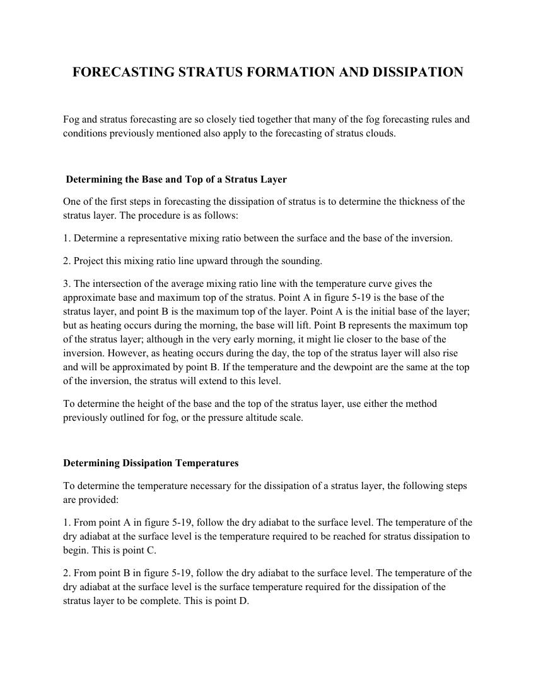
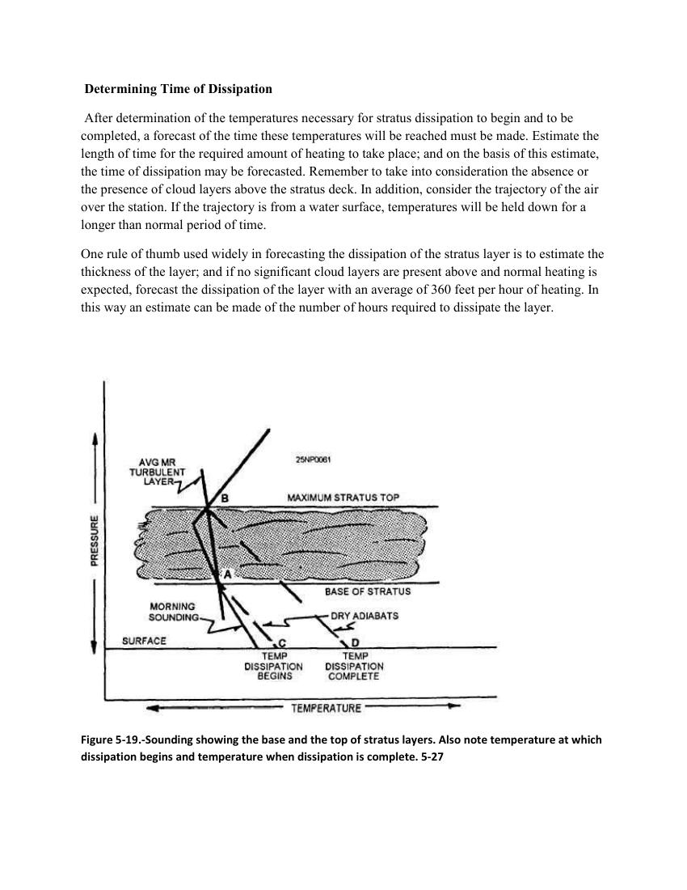

# How to Clouds Dissipate? — Stratus Dissipation

> Source: <https://www.weather.gov/media/zhu/ZHU_Training_Page/clouds/stratus_form_dissipate/stratus_form_dissipate.pdf>  
> Section: Clouds/Precipitation  
> Captured: 2026-08-19 06:00 UTC  
> PDF: [how-to-clouds-dissipate-stratus-dissipation.pdf](how-to-clouds-dissipate-stratus-dissipation.pdf) (2 pages)

---

## Page 1

FORECASTING STRATUS FORMATION AND DISSIPATION 
 
Fog and stratus forecasting are so closely tied together that many of the fog forecasting rules and 
conditions previously mentioned also apply to the forecasting of stratus clouds. 
 
 Determining the Base and Top of a Stratus Layer 
One of the first steps in forecasting the dissipation of stratus is to determine the thickness of the 
stratus layer. The procedure is as follows:  
1. Determine a representative mixing ratio between the surface and the base of the inversion.  
2. Project this mixing ratio line upward through the sounding. 
3. The intersection of the average mixing ratio line with the temperature curve gives the 
approximate base and maximum top of the stratus. Point A in figure 5-19 is the base of the 
stratus layer, and point B is the maximum top of the layer. Point A is the initial base of the layer; 
but as heating occurs during the morning, the base will lift. Point B represents the maximum top 
of the stratus layer; although in the very early morning, it might lie closer to the base of the 
inversion. However, as heating occurs during the day, the top of the stratus layer will also rise 
and will be approximated by point B. If the temperature and the dewpoint are the same at the top 
of the inversion, the stratus will extend to this level.  
To determine the height of the base and the top of the stratus layer, use either the method 
previously outlined for fog, or the pressure altitude scale.  
 
Determining Dissipation Temperatures  
To determine the temperature necessary for the dissipation of a stratus layer, the following steps 
are provided: 
1. From point A in figure 5-19, follow the dry adiabat to the surface level. The temperature of the 
dry adiabat at the surface level is the temperature required to be reached for stratus dissipation to 
begin. This is point C.  
2. From point B in figure 5-19, follow the dry adiabat to the surface level. The temperature of the 
dry adiabat at the surface level is the surface temperature required for the dissipation of the 
stratus layer to be complete. This is point D.

## Page 2

Determining Time of Dissipation 
 After determination of the temperatures necessary for stratus dissipation to begin and to be 
completed, a forecast of the time these temperatures will be reached must be made. Estimate the 
length of time for the required amount of heating to take place; and on the basis of this estimate, 
the time of dissipation may be forecasted. Remember to take into consideration the absence or 
the presence of cloud layers above the stratus deck. In addition, consider the trajectory of the air 
over the station. If the trajectory is from a water surface, temperatures will be held down for a 
longer than normal period of time.  
One rule of thumb used widely in forecasting the dissipation of the stratus layer is to estimate the 
thickness of the layer; and if no significant cloud layers are present above and normal heating is 
expected, forecast the dissipation of the layer with an average of 360 feet per hour of heating. In 
this way an estimate can be made of the number of hours required to dissipate the layer. 
 
 
 
Figure 5-19.-Sounding showing the base and the top of stratus layers. Also note temperature at which 
dissipation begins and temperature when dissipation is complete. 5-27
