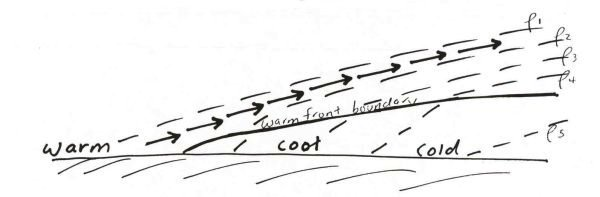
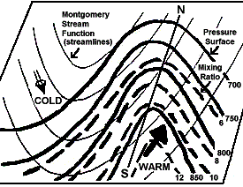
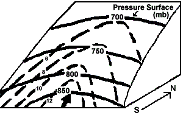
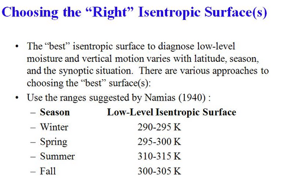

# Isentropic Lifting and Cloud Development

> Source: <http://www.weather.gov/source/zhu/ZHU_Training_Page/clouds/Isentropic_Analysis/ISENTROPIC_LIFTING.htm>  
> Section: Clouds/Precipitation  
> Captured: 2026-08-19 06:00 UTC  
> PDF: [isentropic-lifting-and-cloud-development.pdf](isentropic-lifting-and-cloud-development.pdf) · Original HTML: [source/original.html](source/original.html)

---

**ISENTROPIC LIFTING**

**METEOROLOGIST JEFF HABY**
[theweatherprediction.com](https://theweatherprediction.com/)

The density varies between cold air and warm air with cold air being relatively more dense. Due to the higher
density, cold dense air sinks to the surface and has a high resistance to being lifted in the vertical. In a
[differential advection](http://www.theweatherprediction.com/habyhints/348/)
situation, relatively warm air will lift over shallow surface cold air because the warm air is less dense.
The idea of isentropic lifting is air "prefers" to move toward a region with the same density (potential temperature
surfaces (a.k.a. along a constant theta surface)).

Warm air resists undercutting cold air. To stay at the same density (by preserving [potential temperature](http://www.theweatherprediction.com/habyhints/162/)) it must override the cold air. The depth of cool air on the cool side of a
warm front generally increases moving to the north of the surface warm front boundary. As warm air advects over
colder air, it advects to a higher altitude above sea level as it moves north of the warm
front boundary. The warm, less dense
air rises gradually in the vertical as it overrides the sloping cold dense air (less potential temperature air).
It must do this to stay at the same potential temperature (same relative density). This is why warm fronts tend
to bring
[widespread](http://www.theweatherprediction.com/habyhints/187/) light to moderate precipitation. See diagram below:

The uplift is at a lower angle than uplift that is generally
associated with cold fronts and
[thermodynamic thunderstorms](http://www.theweatherprediction.com/habyhints/141/). You will often come across this complicated concept
when reading NWS forecast discussions. Terms that they will mention that relate to this concept include (theta
surface, potential temperature surface, isentropic upglide, differential advection, and density perturbation).
For another explanation of this process of isentropic lifting (and diagrams) see Chuck Doswell's article at:

<http://www.cimms.ou.edu/~doswell/overrun/overrunning.html>

**ISENTROPIC ANALYSIS**

**BY: NWS LOUISVILLE**

***ISENTROPIC ANALYSIS***

- An isentropic process is an adiabatic process (i.e., no parcel heat exchange with its environment). For synoptic scale weather systems, air parcels generally move along constant potential temperature/theta (i.e., isentropic) surfaces, NOT constant pressure (isobaric) surfaces (Figs. 5a and 5b). In other words, air moves in 3 dimensions, not on horizontal pressure surfaces.

  

  

  **Fig. 5a:** *Example of an isentropic surface in 2-dimensions. Bold solid (dashed) lines are lines of constant pressure/isobars (mixing ratio/isohumes) while the bold arrow is wind direction on the surface. Flow is from higher-to-lower values of pressure and moisture. Thus, ascent/upward moisture transport is occurring.*

  **Fig. 5b:** *Same as Fig. 5a except the isentropic surface is shown in 3 dimensions to more clearly show ascent and upward moisture transport.*

- Isentropic analysis allows the ability to attain quantitative estimates of vertical motion and coherently track air flow and the 3-dimensional transport of moisture in space and time (unlike pressure coordinates).
- Vertical motion on an isentropic surface is determined via pressure advection, which is analogous to temperature advection on a constant pressure surface (e.g., 850 mb). In other words, an area of warm air advection at 850 mb likely also is an area of isentropic lift.
- Isentropic ascent and upward moisture transport  (Fig. 5) are present in areas where winds on the theta surface cross isobars and isohumes (mixing ratio lines) from higher-to-lower values of pressure (similar to warm advection on a pressure surface) and mixing ratio.
- For descent, wind flow is from lower-to-higher pressure, and often from lower-to-higher values of mixing ratio which produces drying.
- The stronger the winds, the tighter the pressure gradient (i.e., the steeper the slope of the isentropic surface), and the more perpendicular the winds are to the isotherms and isohumes, the stronger the upward motion and moisture transport will be. This can lead to significant precipitation.
- Vertical motion values associated with isentropic lift usually are "synoptic-scale" values, i.e., on the order of several (perhaps 5-10) cm/s.
- Divergence within entrance and exit regions of jet streaks can increase the flow along isentropic surfaces and isentropic lift.
- Significant diabatic effects, e.g., latent heat release or diurnal heating/cooling, and isentropic analysis near the ground are limitations and can make accurate isentropic analysis difficult.

**Choosing the "Right" Isentropic Surface(s)**

