# More Low Cloud Forecasting

> Source: <http://www.weather.gov/media/zhu/ZHU_Training_Page/clouds/forecast_layer_clouds/Layer_Cloud_Forecasting2.pdf>  
> Section: Clouds/Precipitation  
> Captured: 2026-08-19 06:00 UTC  
> PDF: [more-low-cloud-forecasting.pdf](more-low-cloud-forecasting.pdf) (28 pages)

---

## Page 1

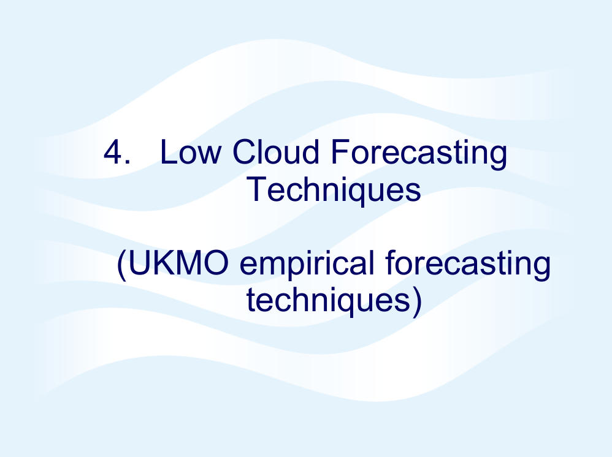

4.
Low Cloud Forecasting 
Techniques
(UKMO empirical forecasting 
techniques)

## Page 2

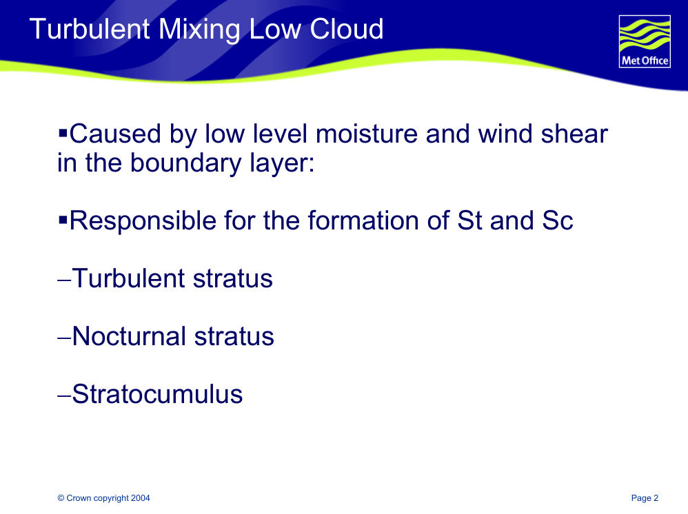

© Crown copyright 2004
Page 2
Turbulent Mixing Low Cloud
ƒCaused by low level moisture and wind shear 
in the boundary layer:
ƒResponsible for the formation of St and Sc
−Turbulent stratus
−Nocturnal stratus
−Stratocumulus

## Page 3

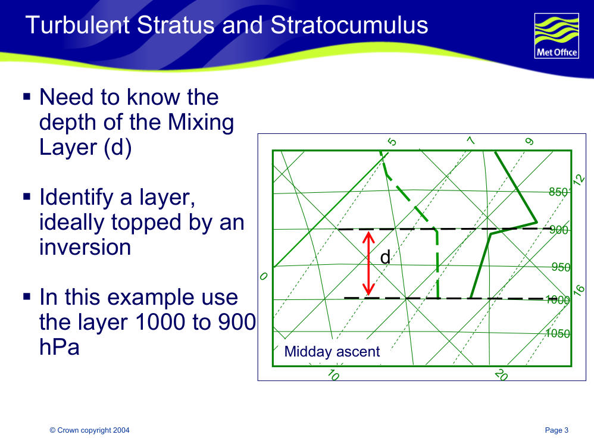

© Crown copyright 2004
Page 3
Turbulent Stratus and Stratocumulus
ƒ Need to know the 
depth of the Mixing 
Layer (d)
ƒ Identify a layer, 
ideally topped by an 
inversion
ƒ In this example use 
the layer 1000 to 900 
hPa
0
10
20
850
900
950
1000
1050
5
7
9
12
16
d
Midday ascent

## Page 4

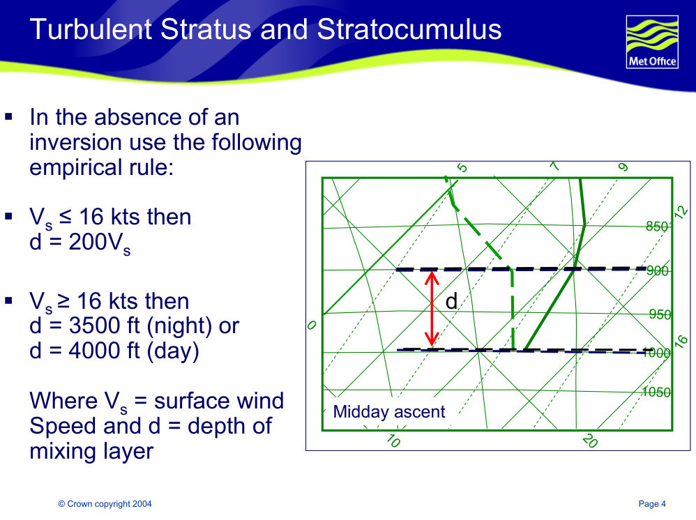

© Crown copyright 2004
Page 4
Turbulent Stratus and Stratocumulus
ƒ In the absence of an 
inversion use the following 
empirical rule:
ƒ Vs ≤16 kts then
d = 200Vs
ƒ Vs ≥16 kts then
d = 3500 ft (night) or
d = 4000 ft (day)
Where Vs = surface wind
Speed and d = depth of 
mixing layer
0
10
20
850
900
950
1000
1050
5
7
9
12
16
Midday ascent
d

## Page 5

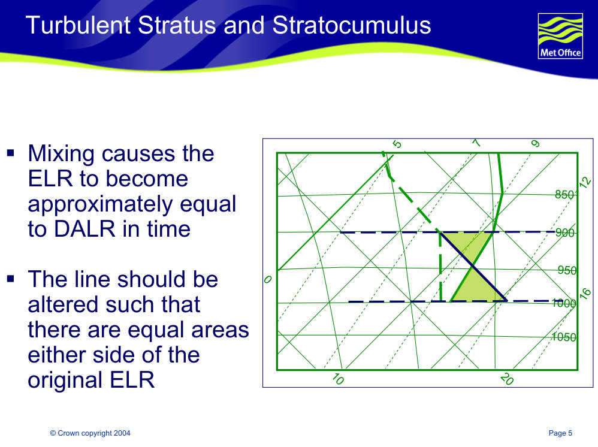

© Crown copyright 2004
Page 5
Turbulent Stratus and Stratocumulus
ƒ Mixing causes the 
ELR to become 
approximately equal 
to DALR in time
ƒ The line should be 
altered such that 
there are equal areas 
either side of the 
original ELR
0
10
20
850
900
950
1000
1050
5
7
9
12
16

## Page 6

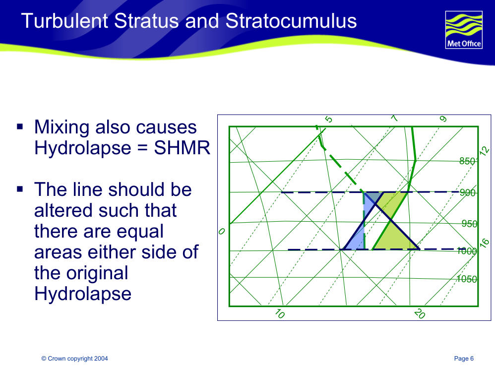

© Crown copyright 2004
Page 6
Turbulent Stratus and Stratocumulus
ƒ Mixing also causes 
Hydrolapse = SHMR
ƒ The line should be 
altered such that 
there are equal 
areas either side of 
the original 
Hydrolapse
0
10
20
850
900
950
1000
1050
5
7
9
12
16

## Page 7

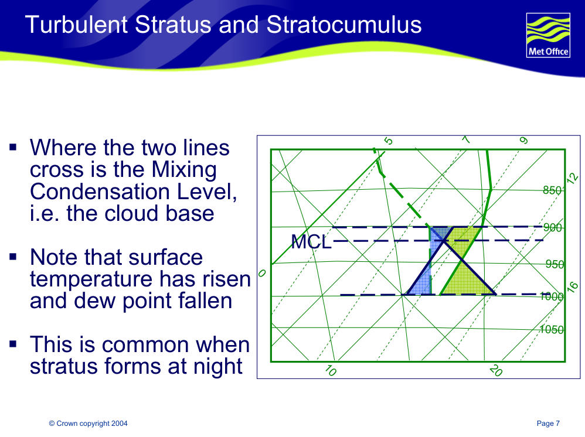

© Crown copyright 2004
Page 7
Turbulent Stratus and Stratocumulus
ƒ Where the two lines 
cross is the Mixing 
Condensation Level, 
i.e. the cloud base
ƒ Note that surface 
temperature has risen 
and dew point fallen
ƒ This is common when 
stratus forms at night
0
10
20
850
900
950
1000
1050
5
7
9
12
16
MCL

## Page 8

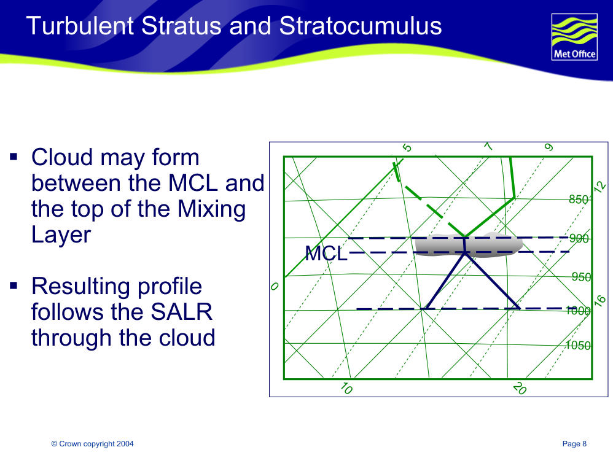

© Crown copyright 2004
Page 8
Turbulent Stratus and Stratocumulus
ƒ Cloud may form 
between the MCL and 
the top of the Mixing 
Layer
ƒ Resulting profile 
follows the SALR 
through the cloud
0
10
20
850
900
950
1000
1050
5
7
9
12
16
MCL

## Page 9

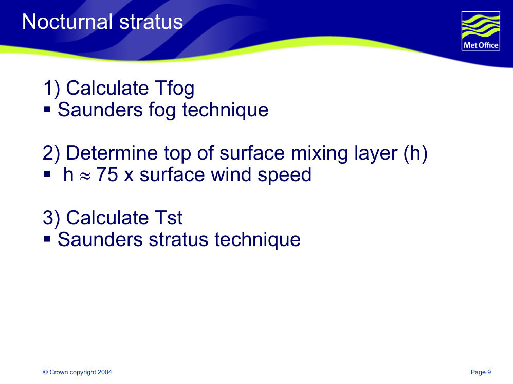

© Crown copyright 2004
Page 9
Nocturnal stratus
1) Calculate Tfog
ƒ Saunders fog technique
2) Determine top of surface mixing layer (h)
ƒ h ≈75 x surface wind speed
3) Calculate Tst
ƒ Saunders stratus technique

## Page 10

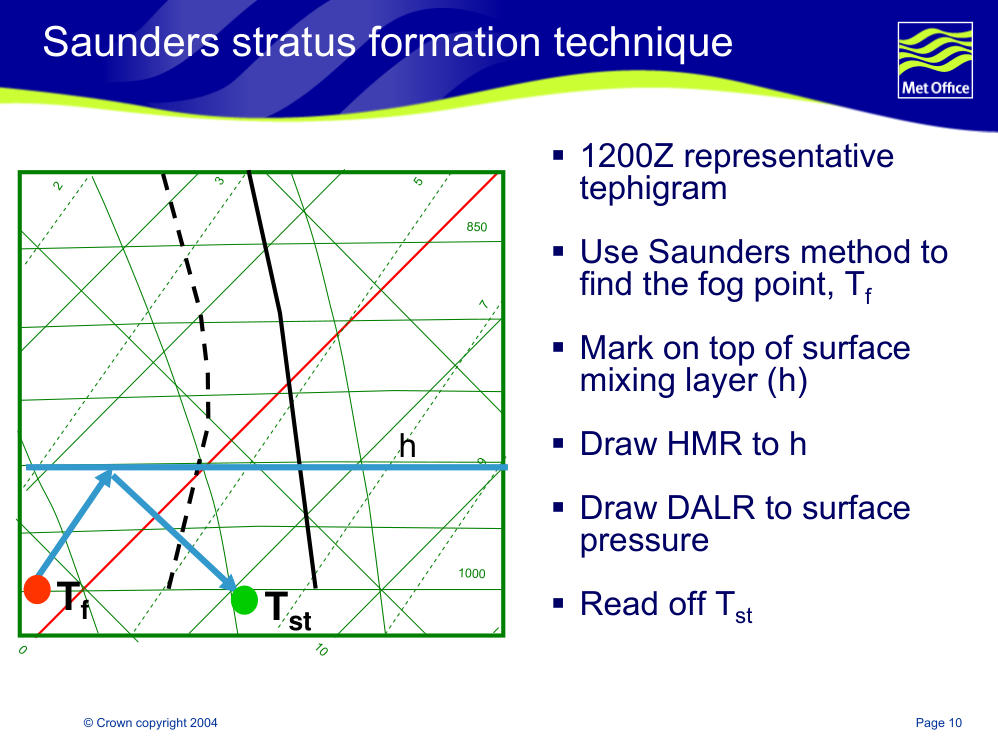

© Crown copyright 2004
Page 10
Saunders stratus formation technique
ƒ 1200Z representative 
tephigram
ƒ Use Saunders method to 
find the fog point, Tf
ƒ Mark on top of surface 
mixing layer (h)
ƒ Draw HMR to h
ƒ Draw DALR to surface 
pressure
ƒ Read off Tst
0
10
850
1000
2
3
5
7
9
h
Tf
Tst

## Page 11

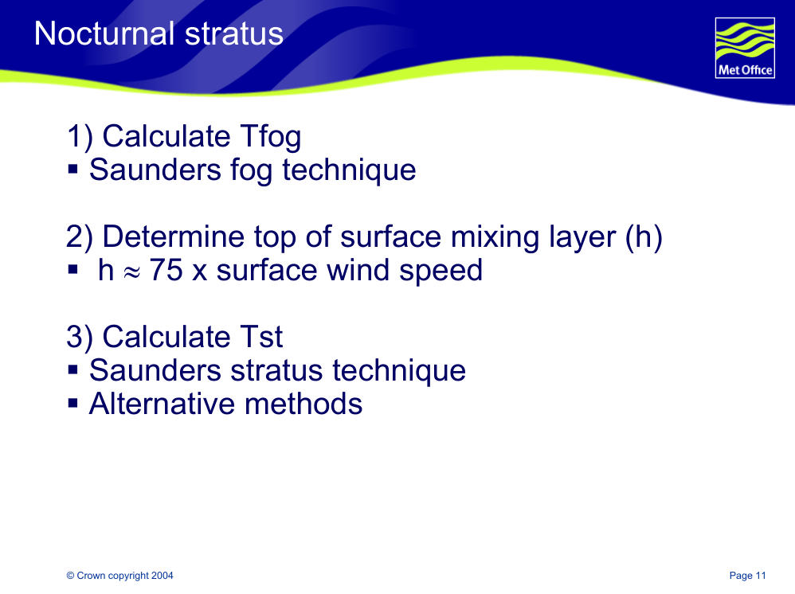

© Crown copyright 2004
Page 11
Nocturnal stratus
1) Calculate Tfog
ƒ Saunders fog technique
2) Determine top of surface mixing layer (h)
ƒ h ≈75 x surface wind speed
3) Calculate Tst
ƒ Saunders stratus technique
ƒ Alternative methods

## Page 12

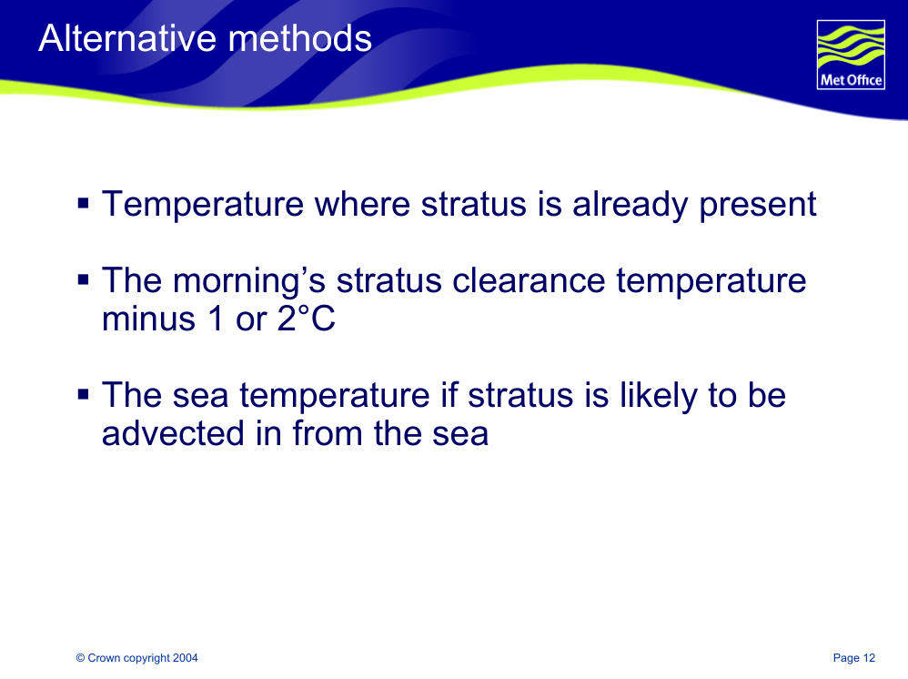

© Crown copyright 2004
Page 12
Alternative methods
ƒ Temperature where stratus is already present
ƒ The morning’s stratus clearance temperature 
minus 1 or 2°C
ƒ The sea temperature if stratus is likely to be 
advected in from the sea

## Page 13

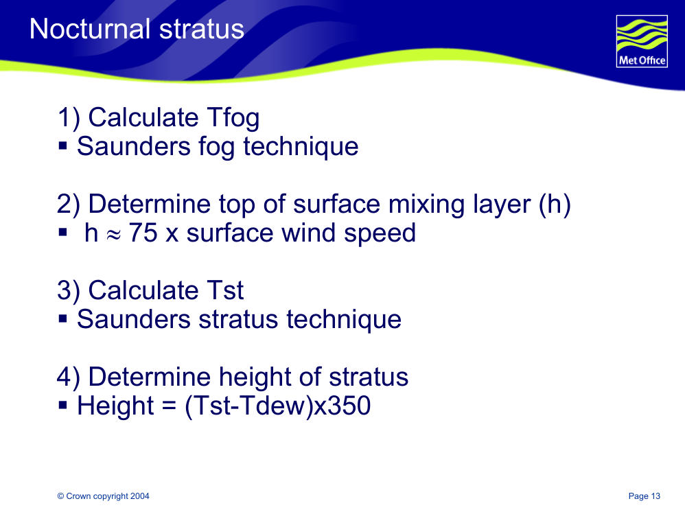

© Crown copyright 2004
Page 13
Nocturnal stratus
1) Calculate Tfog
ƒ Saunders fog technique
2) Determine top of surface mixing layer (h)
ƒ h ≈75 x surface wind speed
3) Calculate Tst
ƒ Saunders stratus technique
4) Determine height of stratus
ƒ Height = (Tst-Tdew)x350

## Page 14

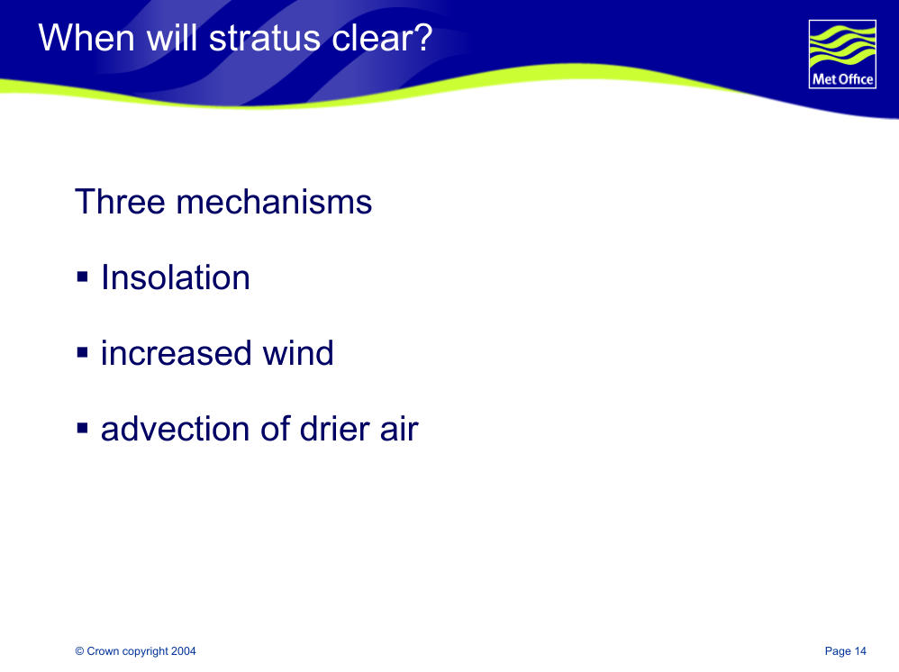

© Crown copyright 2004
Page 14
When will stratus clear?
Three mechanisms
ƒ Insolation
ƒ increased wind
ƒ advection of drier air

## Page 15

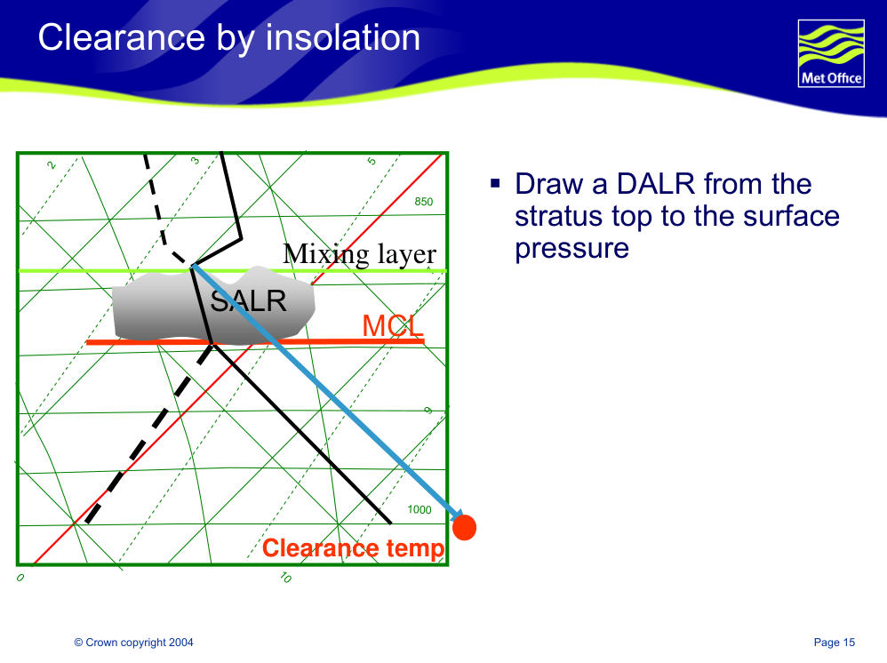

© Crown copyright 2004
Page 15
Clearance by insolation
0
10
850
1000
2
3
5
7
9
MCL
SALR
Mixing layer
Clearance temp
ƒ Draw a DALR from the 
stratus top to the surface 
pressure

## Page 16

© Crown copyright 2004
Page 16
Clearance by increased wind
ƒ Increasing the wind speed will deepen the 
mixing layer ...
-80
-70
-60
-50
-40
mintra
-20
-10
0
10
20
30
40
250
300
350
400
450
500
550
600
650
700
750
800
850
900
950
1000
1050
0.15
0.8
2
3
5
7
9
12
16
20
28
48
-25
-20
-15
-10
-5
0
5
10
15
20
Wet bulb potential temperature
mixing 
mixing 
layer
layer

## Page 17

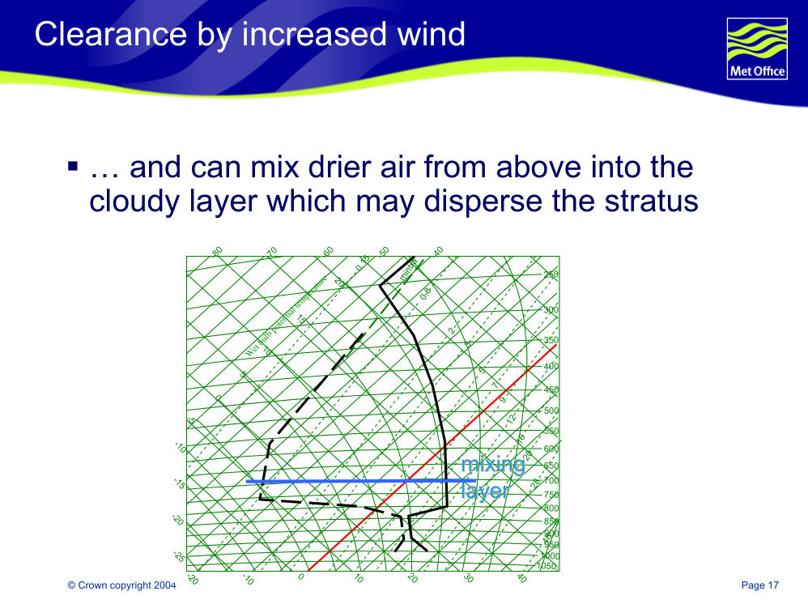

© Crown copyright 2004
Page 17
Clearance by increased wind
ƒ … and can mix drier air from above into the 
cloudy layer which may disperse the stratus
-80
-70
-60
-50
-40
mintra
-20
-10
0
10
20
30
40
250
300
350
400
450
500
550
600
650
700
750
800
850
900
950
1000
1050
0.15
0.8
2
3
5
7
9
12
16
20
28
48
-25
-20
-15
-10
-5
0
5
10
15
20
Wet bulb potential temperature
mixing 
mixing 
layer
layer

## Page 18

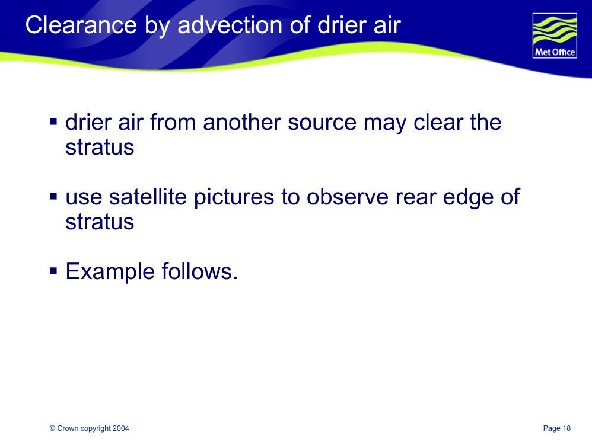

© Crown copyright 2004
Page 18
Clearance by advection of drier air
ƒ drier air from another source may clear the 
stratus
ƒ use satellite pictures to observe rear edge of  
stratus
ƒ Example follows.

## Page 19

Area of drier 
air spreads 
south west with 
time

## Page 20

_(no extractable text on this page — see rendered image above)_

## Page 21

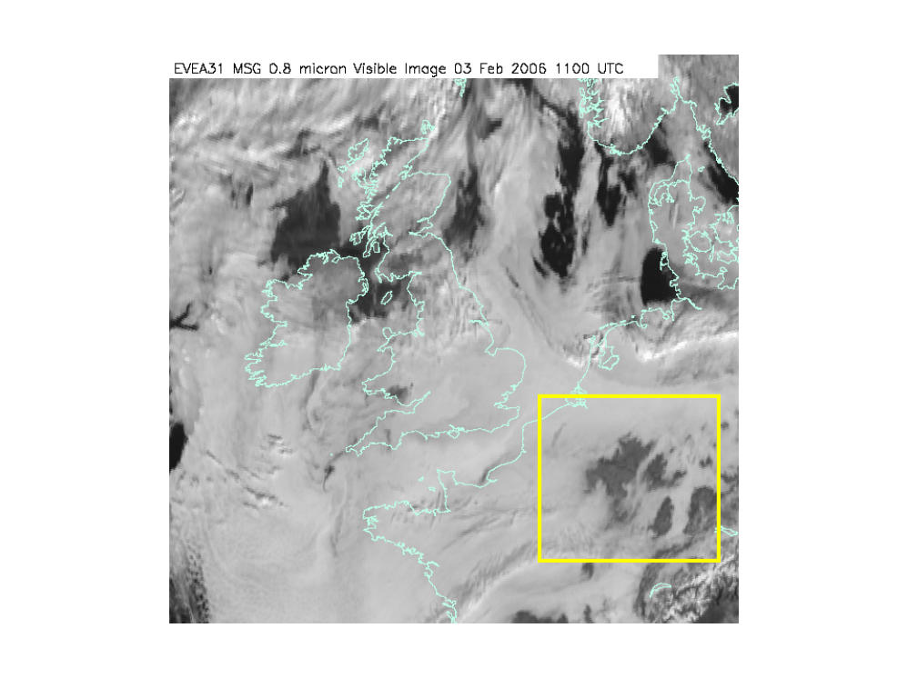

_(no extractable text on this page — see rendered image above)_

## Page 22

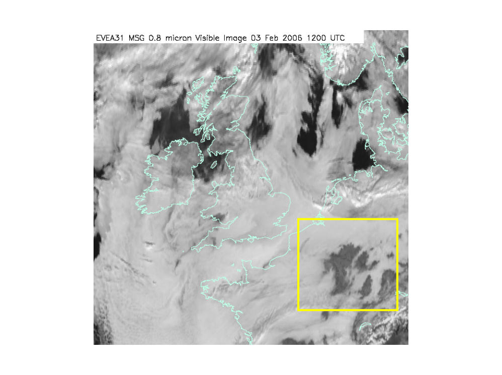

_(no extractable text on this page — see rendered image above)_

## Page 23

_(no extractable text on this page — see rendered image above)_

## Page 24

_(no extractable text on this page — see rendered image above)_

## Page 25

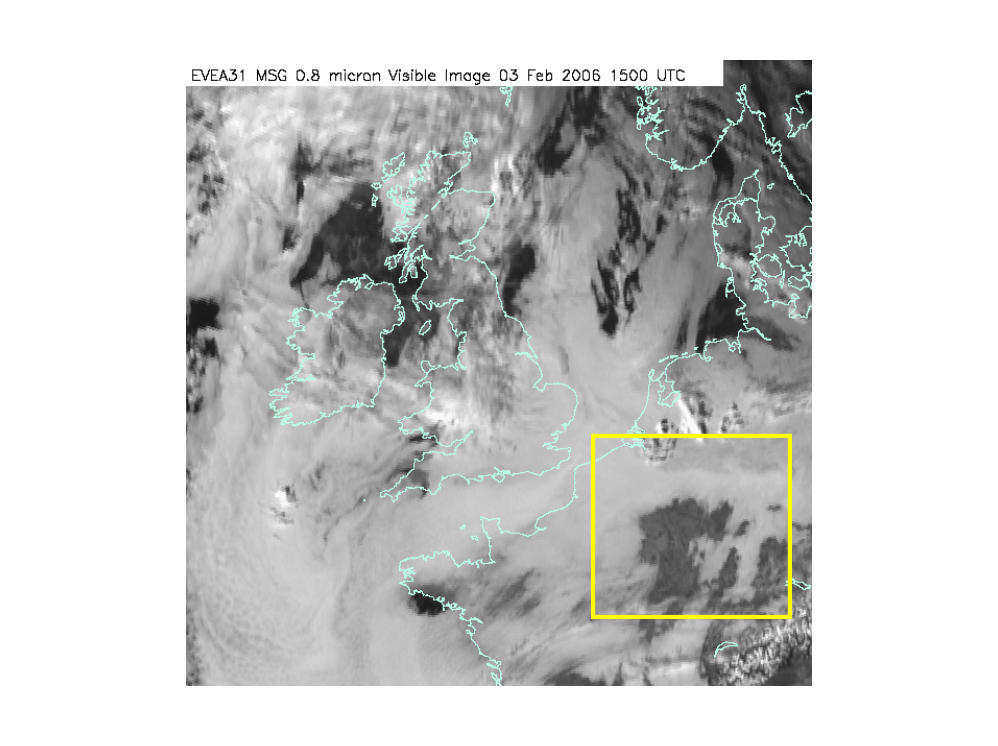

_(no extractable text on this page — see rendered image above)_

## Page 26

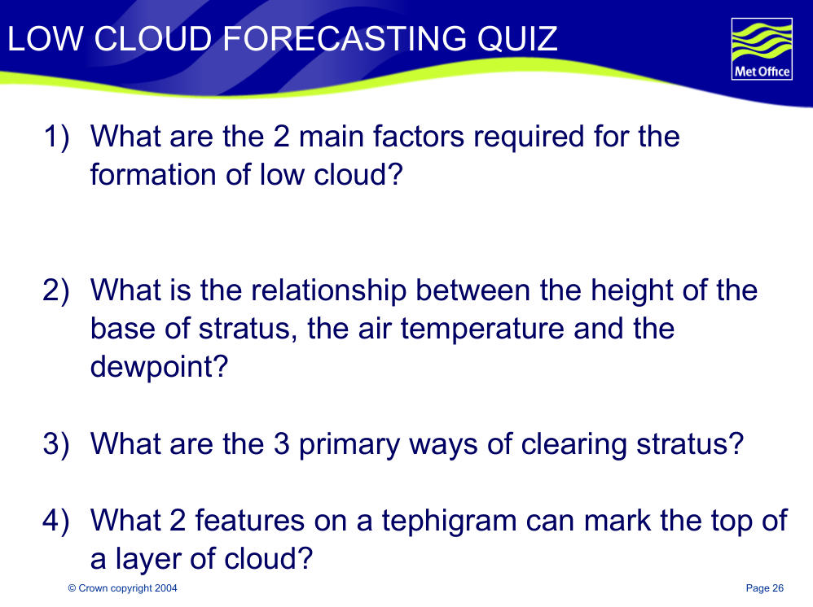

© Crown copyright 2004
Page 26
LOW CLOUD FORECASTING QUIZ
1) What are the 2 main factors required for the 
formation of low cloud?
2) What is the relationship between the height of the 
base of stratus, the air temperature and the 
dewpoint?
3) What are the 3 primary ways of clearing stratus?
4) What 2 features on a tephigram can mark the top of 
a layer of cloud?

## Page 27

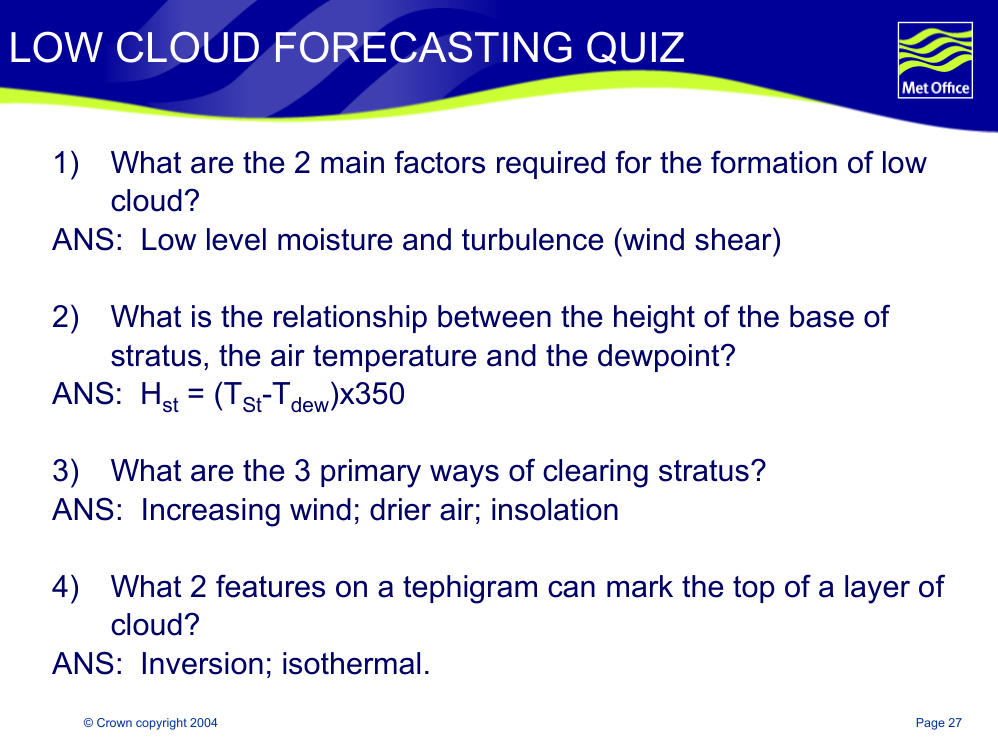

© Crown copyright 2004
Page 27
LOW CLOUD FORECASTING QUIZ
1)
What are the 2 main factors required for the formation of low 
cloud?
ANS:  Low level moisture and turbulence (wind shear)
2)
What is the relationship between the height of the base of 
stratus, the air temperature and the dewpoint?
ANS:  Hst = (TSt-Tdew)x350
3)
What are the 3 primary ways of clearing stratus?
ANS:  Increasing wind; drier air; insolation
4)
What 2 features on a tephigram can mark the top of a layer of 
cloud?
ANS:  Inversion; isothermal.

## Page 28

© Crown copyright 2004
Page 28
Satellite
