# Planetary Boundary Layer & Clouds — Layer Cloud Forecating

> Source: <http://www.weather.gov/media/zhu/ZHU_Training_Page/clouds/forecast_layer_clouds/Layer_Cloud_Forecasting.pdf>  
> Section: Clouds/Precipitation  
> Captured: 2026-08-19 06:00 UTC  
> PDF: [planetary-boundary-layer-clouds-layer-cloud-forecating.pdf](planetary-boundary-layer-clouds-layer-cloud-forecating.pdf) (25 pages)

---

## Page 1

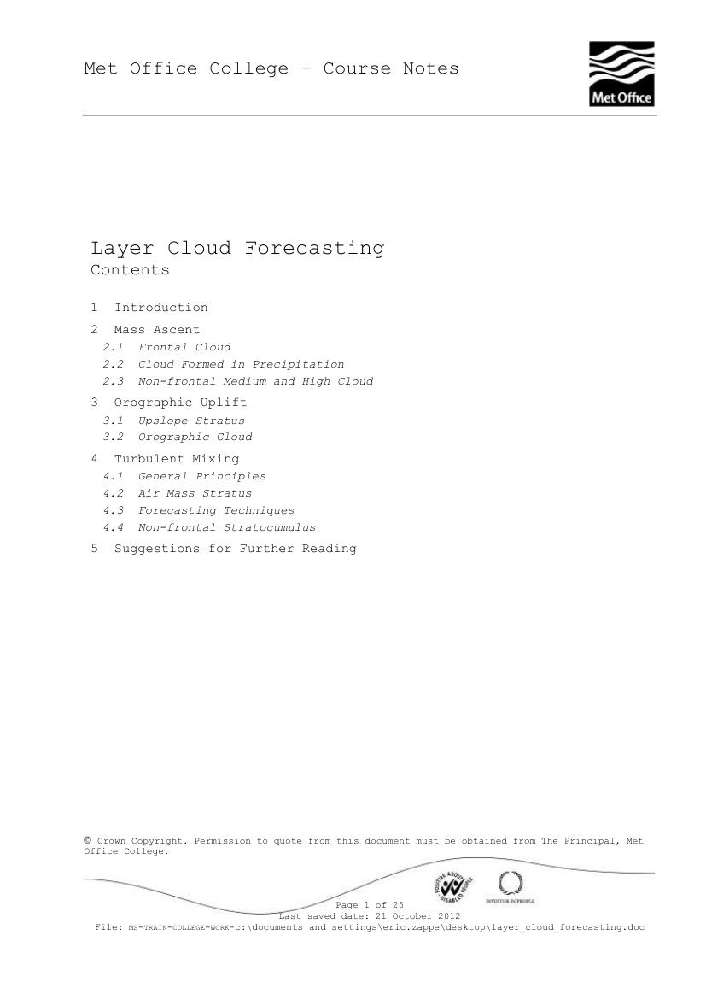

Met Office College – Course Notes 
 
 Crown Copyright. Permission to quote from this document must be obtained from The Principal, Met 
Office College. 
 
 
 
 
Page 1 of 25 
Last saved date: 21 October 2012 
File: MS-TRAIN-COLLEGE-WORK-c:\documents and settings\eric.zappe\desktop\layer_cloud_forecasting.doc  
Layer Cloud Forecasting  
Contents  
1 
Introduction 
2 
Mass Ascent 
2.1 
Frontal Cloud 
2.2 
Cloud Formed in Precipitation 
2.3 
Non-frontal Medium and High Cloud 
3 
Orographic Uplift 
3.1 
Upslope Stratus 
3.2 
Orographic Cloud 
4 
Turbulent Mixing 
4.1 
General Principles 
4.2 
Air Mass Stratus 
4.3 
Forecasting Techniques 
4.4 
Non-frontal Stratocumulus 
5 
Suggestions for Further Reading

## Page 2

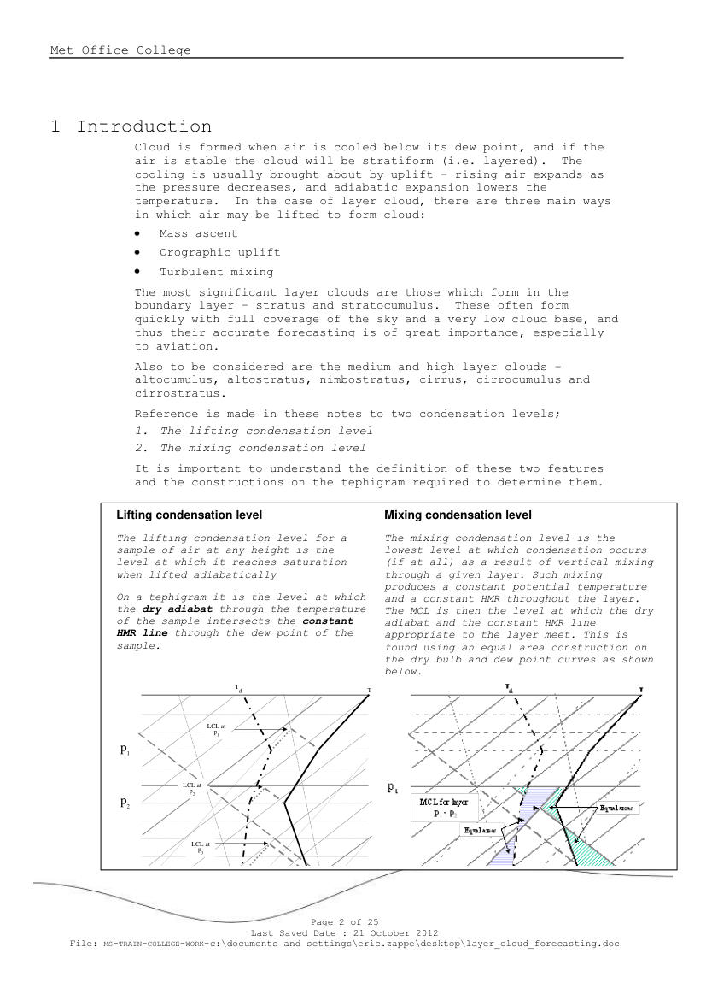

Met Office College 
Page 2 of 25 
Last Saved Date : 21 October 2012 
File: MS-TRAIN-COLLEGE-WORK-c:\documents and settings\eric.zappe\desktop\layer_cloud_forecasting.doc 
1 Introduction 
Cloud is formed when air is cooled below its dew point, and if the 
air is stable the cloud will be stratiform (i.e. layered).  The 
cooling is usually brought about by uplift – rising air expands as 
the pressure decreases, and adiabatic expansion lowers the 
temperature.  In the case of layer cloud, there are three main ways 
in which air may be lifted to form cloud: 
 
Mass ascent 
 
Orographic uplift 
 
Turbulent mixing 
The most significant layer clouds are those which form in the 
boundary layer – stratus and stratocumulus.  These often form 
quickly with full coverage of the sky and a very low cloud base, and 
thus their accurate forecasting is of great importance, especially 
to aviation. 
Also to be considered are the medium and high layer clouds – 
altocumulus, altostratus, nimbostratus, cirrus, cirrocumulus and 
cirrostratus. 
Reference is made in these notes to two condensation levels; 
1. The lifting condensation level 
2. The mixing condensation level 
It is important to understand the definition of these two features 
and the constructions on the tephigram required to determine them.  
Lifting condensation level 
The lifting condensation level for a 
sample of air at any height is the 
level at which it reaches saturation 
when lifted adiabatically 
On a tephigram it is the level at which 
the dry adiabat through the temperature 
of the sample intersects the constant 
HMR line through the dew point of the 
sample. 
Mixing condensation level 
The mixing condensation level is the 
lowest level at which condensation occurs 
(if at all) as a result of vertical mixing 
through a given layer. Such mixing 
produces a constant potential temperature 
and a constant HMR throughout the layer. 
The MCL is then the level at which the dry 
adiabat and the constant HMR line 
appropriate to the layer meet. This is 
found using an equal area construction on 
the dry bulb and dew point curves as shown 
below. 
p2
p1
Td
LCL at
p3
LCL at
p2
LCL at
p1
T

## Page 3

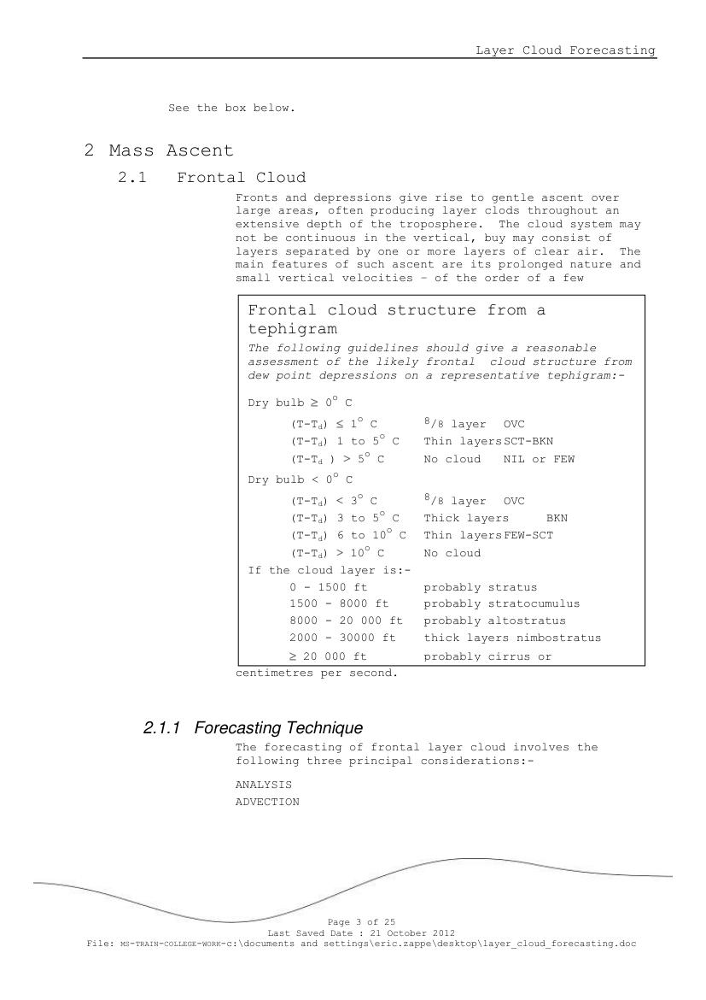

Layer Cloud Forecasting 
Page 3 of 25 
Last Saved Date : 21 October 2012 
File: MS-TRAIN-COLLEGE-WORK-c:\documents and settings\eric.zappe\desktop\layer_cloud_forecasting.doc 
See the box below. 
2 Mass Ascent 
2.1 
Frontal Cloud 
Fronts and depressions give rise to gentle ascent over 
large areas, often producing layer clods throughout an 
extensive depth of the troposphere.  The cloud system may 
not be continuous in the vertical, buy may consist of 
layers separated by one or more layers of clear air.  The 
main features of such ascent are its prolonged nature and 
small vertical velocities – of the order of a few 
centimetres per second. 
 
2.1.1 Forecasting Technique 
The forecasting of frontal layer cloud involves the 
following three principal considerations:- 
ANALYSIS 
ADVECTION 
Frontal cloud structure from a 
tephigram 
The following guidelines should give a reasonable 
assessment of the likely frontal  cloud structure from 
dew point depressions on a representative tephigram:- 
Dry bulb  0o C 
 
(T-Td)  1o C 
 8/8 layer 
OVC 
 
(T-Td) 1 to 5o C  Thin layers SCT-BKN 
 
(T-Td )  5o C 
 No cloud 
NIL or FEW 
Dry bulb < 0o C 
 
(T-Td)  3o C 
 8/8 layer 
OVC 
 
(T-Td) 3 to 5o C  Thick layers 
BKN 
 
(T-Td) 6 to 10o C  Thin layers FEW-SCT 
 
(T-Td)  10o C 
 No cloud 
If the cloud layer is:- 
 
0 - 1500 ft 
 probably stratus 
 
1500 - 8000 ft 
 probably stratocumulus 
 
8000 - 20 000 ft  probably altostratus 
 
2000 - 30000 ft 
 thick layers nimbostratus 
 
 20 000 ft 
 probably cirrus or

## Page 4

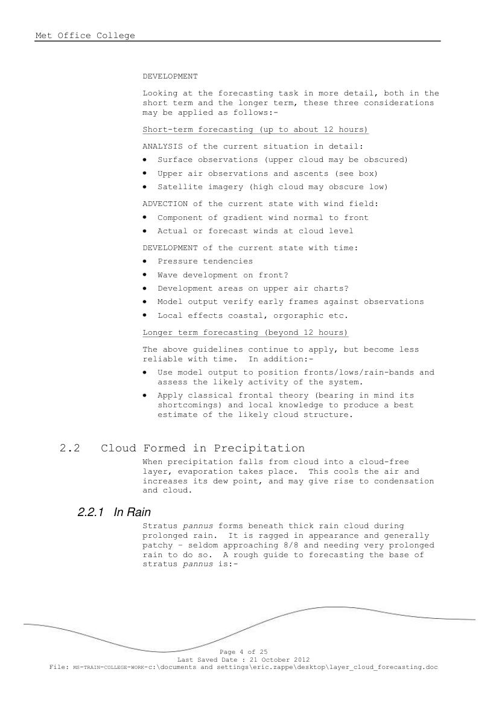

Met Office College 
Page 4 of 25 
Last Saved Date : 21 October 2012 
File: MS-TRAIN-COLLEGE-WORK-c:\documents and settings\eric.zappe\desktop\layer_cloud_forecasting.doc 
DEVELOPMENT 
Looking at the forecasting task in more detail, both in the 
short term and the longer term, these three considerations 
may be applied as follows:- 
Short-term forecasting (up to about 12 hours) 
ANALYSIS of the current situation in detail: 
 
Surface observations (upper cloud may be obscured) 
 
Upper air observations and ascents (see box) 
 
Satellite imagery (high cloud may obscure low) 
ADVECTION of the current state with wind field: 
 
Component of gradient wind normal to front 
 
Actual or forecast winds at cloud level 
DEVELOPMENT of the current state with time: 
 
Pressure tendencies 
 
Wave development on front? 
 
Development areas on upper air charts? 
 
Model output verify early frames against observations 
 
Local effects coastal, orgoraphic etc. 
Longer term forecasting (beyond 12 hours) 
The above guidelines continue to apply, but become less 
reliable with time.  In addition:- 
 
Use model output to position fronts/lows/rain-bands and 
assess the likely activity of the system. 
 
Apply classical frontal theory (bearing in mind its 
shortcomings) and local knowledge to produce a best 
estimate of the likely cloud structure. 
 
2.2 
Cloud Formed in Precipitation 
When precipitation falls from cloud into a cloud-free 
layer, evaporation takes place.  This cools the air and 
increases its dew point, and may give rise to condensation 
and cloud. 
2.2.1 In Rain 
Stratus pannus forms beneath thick rain cloud during 
prolonged rain.  It is ragged in appearance and generally 
patchy – seldom approaching 8/8 and needing very prolonged 
rain to do so.  A rough guide to forecasting the base of 
stratus pannus is:-

## Page 5

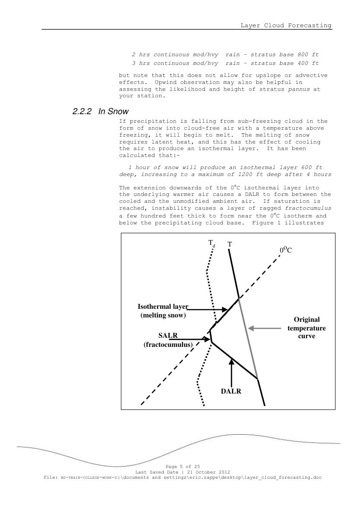

Layer Cloud Forecasting 
Page 5 of 25 
Last Saved Date : 21 October 2012 
File: MS-TRAIN-COLLEGE-WORK-c:\documents and settings\eric.zappe\desktop\layer_cloud_forecasting.doc 
2 hrs continuous mod/hvy  rain – stratus base 800 ft 
3 hrs continuous mod/hvy  rain – stratus base 400 ft 
but note that this does not allow for upslope or advective 
effects.  Upwind observation may also be helpful in 
assessing the likelihood and height of stratus pannus at 
your station. 
2.2.2 In Snow 
If precipitation is falling from sub-freezing cloud in the 
form of snow into cloud-free air with a temperature above 
freezing, it will begin to melt.  The melting of snow 
requires latent heat, and this has the effect of cooling 
the air to produce an isothermal layer.  It has been 
calculated that:- 
1 hour of snow will produce an isothermal layer 600 ft 
deep, increasing to a maximum of 1200 ft deep after 4 hours 
The extension downwards of the 0 C isothermal layer into 
the underlying warmer air causes a DALR to form between the 
cooled and the unmodified ambient air.  If saturation is 
reached, instability causes a layer of ragged fractocumulus 
a few hundred feet thick to form near the 0 C isotherm and 
below the precipitating cloud base.  Figure 1 illustrates 
Isothermal layer
(melting snow)
SALR
(fractocumulus)
DALR
Original
temperature
curve
Td
T
0oC

## Page 6

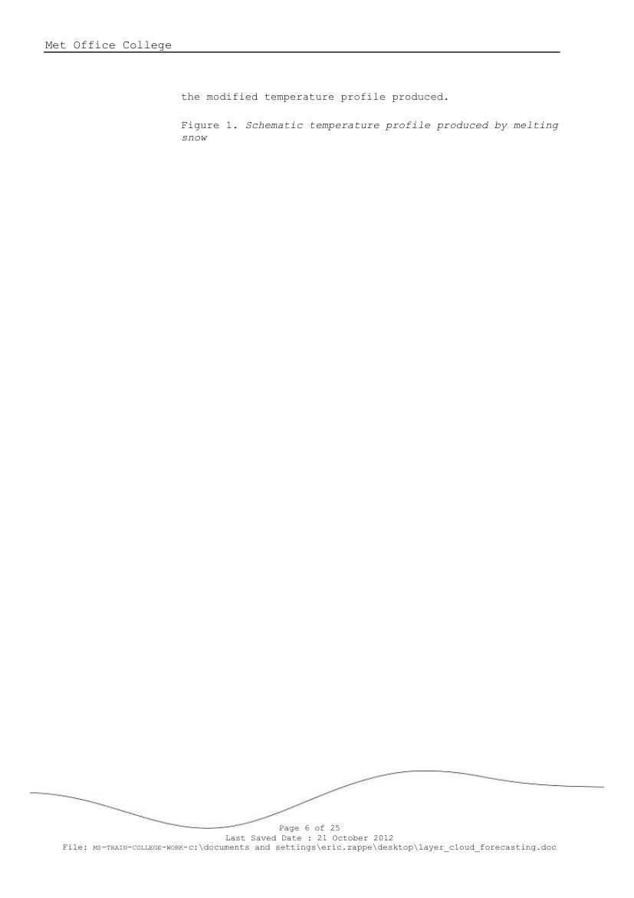

Met Office College 
Page 6 of 25 
Last Saved Date : 21 October 2012 
File: MS-TRAIN-COLLEGE-WORK-c:\documents and settings\eric.zappe\desktop\layer_cloud_forecasting.doc 
the modified temperature profile produced. 
Figure 1. Schematic temperature profile produced by melting 
snow

## Page 7

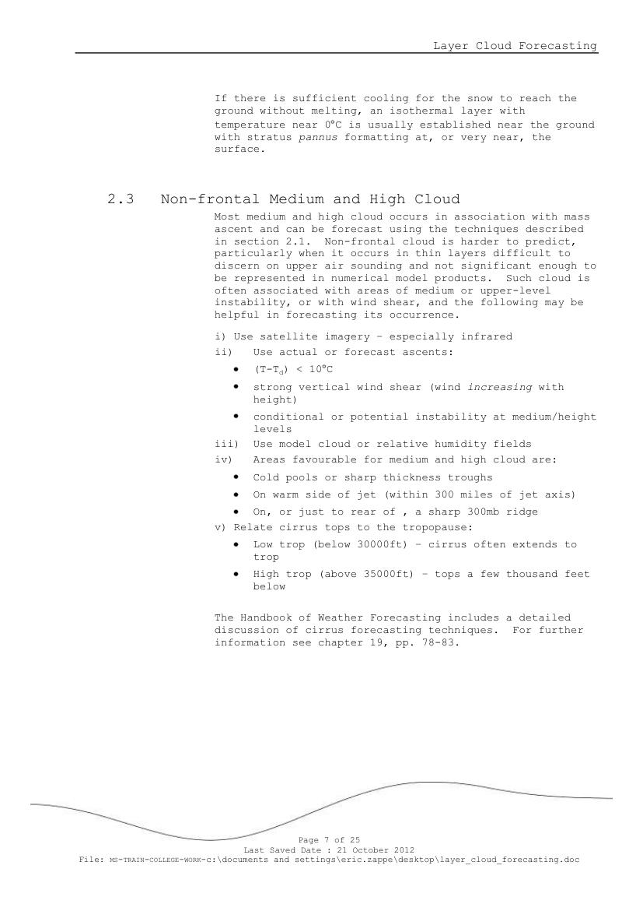

Layer Cloud Forecasting 
Page 7 of 25 
Last Saved Date : 21 October 2012 
File: MS-TRAIN-COLLEGE-WORK-c:\documents and settings\eric.zappe\desktop\layer_cloud_forecasting.doc 
If there is sufficient cooling for the snow to reach the 
ground without melting, an isothermal layer with 
temperature near 0 C is usually established near the ground 
with stratus pannus formatting at, or very near, the 
surface. 
 
2.3 
Non-frontal Medium and High Cloud 
Most medium and high cloud occurs in association with mass 
ascent and can be forecast using the techniques described 
in section 2.1.  Non-frontal cloud is harder to predict, 
particularly when it occurs in thin layers difficult to 
discern on upper air sounding and not significant enough to 
be represented in numerical model products.  Such cloud is 
often associated with areas of medium or upper-level 
instability, or with wind shear, and the following may be 
helpful in forecasting its occurrence. 
i) Use satellite imagery – especially infrared 
ii) 
Use actual or forecast ascents: 
 
(T-Td) < 10 C 
 
strong vertical wind shear (wind increasing with 
height)  
 
conditional or potential instability at medium/height 
levels 
iii) 
Use model cloud or relative humidity fields 
iv) 
Areas favourable for medium and high cloud are: 
 
Cold pools or sharp thickness troughs 
 
On warm side of jet (within 300 miles of jet axis) 
 
On, or just to rear of , a sharp 300mb ridge 
v) Relate cirrus tops to the tropopause: 
 
Low trop (below 30000ft) – cirrus often extends to 
trop 
 
High trop (above 35000ft) – tops a few thousand feet 
below 
 
The Handbook of Weather Forecasting includes a detailed 
discussion of cirrus forecasting techniques.  For further 
information see chapter 19, pp. 78-83.

## Page 8

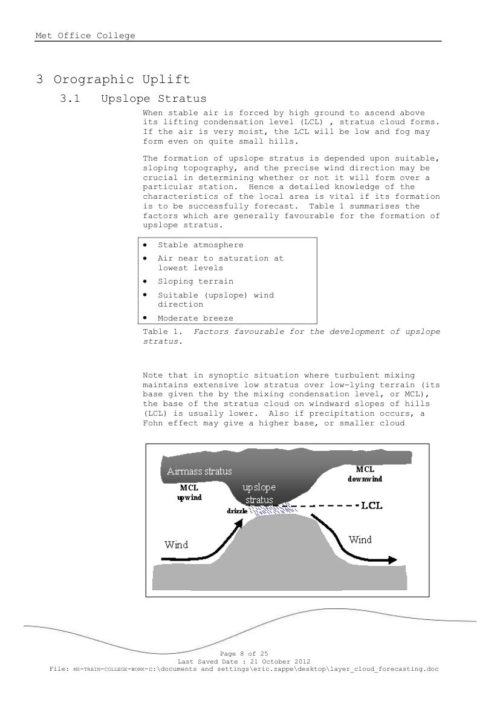

Met Office College 
Page 8 of 25 
Last Saved Date : 21 October 2012 
File: MS-TRAIN-COLLEGE-WORK-c:\documents and settings\eric.zappe\desktop\layer_cloud_forecasting.doc 
3 Orographic Uplift 
3.1 
Upslope Stratus 
When stable air is forced by high ground to ascend above 
its lifting condensation level (LCL) , stratus cloud forms.  
If the air is very moist, the LCL will be low and fog may 
form even on quite small hills. 
The formation of upslope stratus is depended upon suitable, 
sloping topography, and the precise wind direction may be 
crucial in determining whether or not it will form over a 
particular station.  Hence a detailed knowledge of the 
characteristics of the local area is vital if its formation 
is to be successfully forecast.  Table 1 summarises the 
factors which are generally favourable for the formation of 
upslope stratus. 
 
Stable atmosphere 
 
Air near to saturation at 
lowest levels 
 
Sloping terrain 
 
Suitable (upslope) wind 
direction 
 
Moderate breeze 
Table 1.  Factors favourable for the development of upslope 
stratus. 
 
Note that in synoptic situation where turbulent mixing 
maintains extensive low stratus over low-lying terrain (its 
base given the by the mixing condensation level, or MCL), 
the base of the stratus cloud on windward slopes of hills 
(LCL) is usually lower.  Also if precipitation occurs, a 
Fohn effect may give a higher base, or smaller cloud

## Page 9

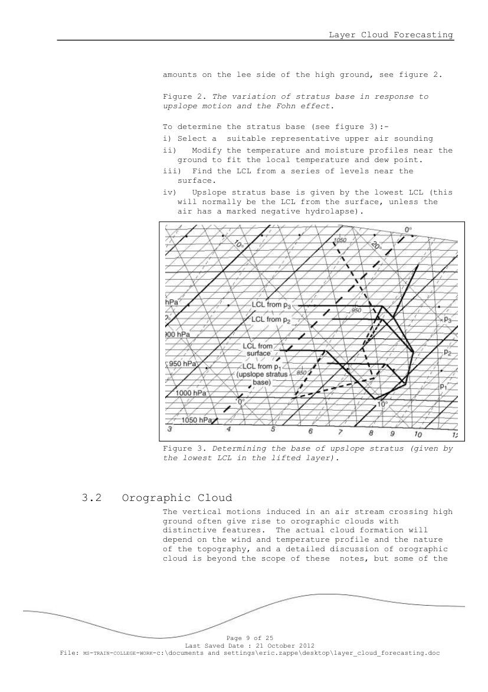

Layer Cloud Forecasting 
Page 9 of 25 
Last Saved Date : 21 October 2012 
File: MS-TRAIN-COLLEGE-WORK-c:\documents and settings\eric.zappe\desktop\layer_cloud_forecasting.doc 
amounts on the lee side of the high ground, see figure 2. 
Figure 2. The variation of stratus base in response to 
upslope motion and the Fohn effect. 
 
To determine the stratus base (see figure 3):- 
i) Select a  suitable representative upper air sounding 
ii) 
Modify the temperature and moisture profiles near the 
ground to fit the local temperature and dew point. 
iii) 
Find the LCL from a series of levels near the 
surface. 
iv) 
Upslope stratus base is given by the lowest LCL (this 
will normally be the LCL from the surface, unless the 
air has a marked negative hydrolapse). 
Figure 3. Determining the base of upslope stratus (given by 
the lowest LCL in the lifted layer). 
 
3.2 
Orographic Cloud 
The vertical motions induced in an air stream crossing high 
ground often give rise to orographic clouds with 
distinctive features.  The actual cloud formation will 
depend on the wind and temperature profile and the nature 
of the topography, and a detailed discussion of orographic 
cloud is beyond the scope of these  notes, but some of the

## Page 10

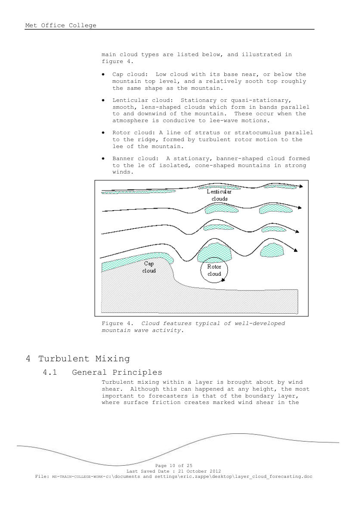

Met Office College 
Page 10 of 25 
Last Saved Date : 21 October 2012 
File: MS-TRAIN-COLLEGE-WORK-c:\documents and settings\eric.zappe\desktop\layer_cloud_forecasting.doc 
main cloud types are listed below, and illustrated in 
figure 4. 
 
Cap cloud:  Low cloud with its base near, or below the 
mountain top level, and a relatively sooth top roughly 
the same shape as the mountain. 
 
Lenticular cloud:  Stationary or quasi-stationary, 
smooth, lens-shaped clouds which form in bands parallel 
to and downwind of the mountain.  These occur when the 
atmosphere is conducive to lee-wave motions. 
 
Rotor cloud: A line of stratus or stratocumulus parallel 
to the ridge, formed by turbulent rotor motion to the 
lee of the mountain. 
 
Banner cloud:  A stationary, banner-shaped cloud formed 
to the le of isolated, cone-shaped mountains in strong 
winds. 
Figure 4.  Cloud features typical of well-developed 
mountain wave activity. 
 
4 Turbulent Mixing 
4.1 
General Principles 
Turbulent mixing within a layer is brought about by wind 
shear.  Although this can happened at any height, the most 
important to forecasters is that of the boundary layer, 
where surface friction creates marked wind shear in the

## Page 11

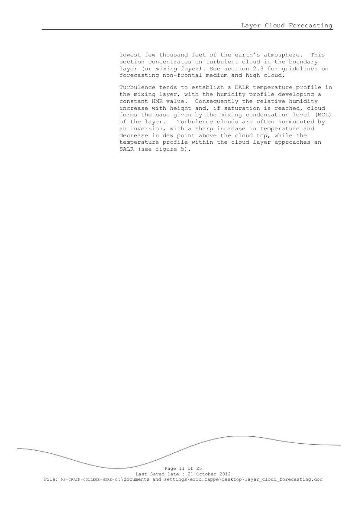

Layer Cloud Forecasting 
Page 11 of 25 
Last Saved Date : 21 October 2012 
File: MS-TRAIN-COLLEGE-WORK-c:\documents and settings\eric.zappe\desktop\layer_cloud_forecasting.doc 
lowest few thousand feet of the earth’s atmosphere.  This 
section concentrates on turbulent cloud in the boundary 
layer (or mixing layer). See section 2.3 for guidelines on 
forecasting non-frontal medium and high cloud. 
Turbulence tends to establish a DALR temperature profile in 
the mixing layer, with the humidity profile developing a 
constant HMR value.  Consequently the relative humidity 
increase with height and, if saturation is reached, cloud 
forms the base given by the mixing condensation level (MCL) 
of the layer.   Turbulence clouds are often surmounted by 
an inversion, with a sharp increase in temperature and 
decrease in dew point above the cloud top, while the 
temperature profile within the cloud layer approaches an 
SALR (see figure 5).

## Page 12

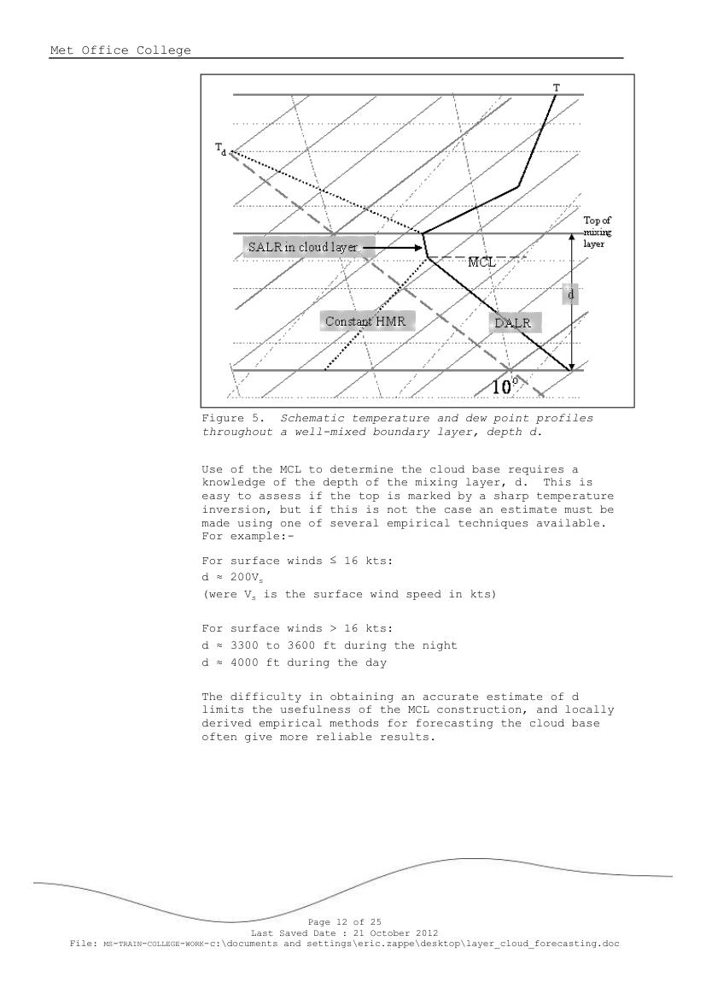

Met Office College 
Page 12 of 25 
Last Saved Date : 21 October 2012 
File: MS-TRAIN-COLLEGE-WORK-c:\documents and settings\eric.zappe\desktop\layer_cloud_forecasting.doc 
Figure 5.  Schematic temperature and dew point profiles 
throughout a well-mixed boundary layer, depth d. 
 
Use of the MCL to determine the cloud base requires a 
knowledge of the depth of the mixing layer, d.  This is 
easy to assess if the top is marked by a sharp temperature 
inversion, but if this is not the case an estimate must be 
made using one of several empirical techniques available.  
For example:- 
For surface winds ≤ 16 kts: 
d ≈ 200Vs 
(were Vs is the surface wind speed in kts) 
 
For surface winds > 16 kts: 
d ≈ 3300 to 3600 ft during the night 
d ≈ 4000 ft during the day 
 
The difficulty in obtaining an accurate estimate of d 
limits the usefulness of the MCL construction, and locally 
derived empirical methods for forecasting the cloud base 
often give more reliable results.

## Page 13

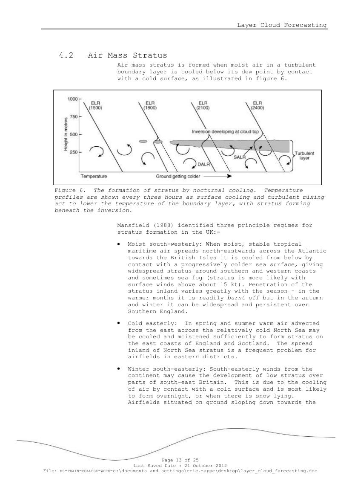

Layer Cloud Forecasting 
Page 13 of 25 
Last Saved Date : 21 October 2012 
File: MS-TRAIN-COLLEGE-WORK-c:\documents and settings\eric.zappe\desktop\layer_cloud_forecasting.doc 
4.2 
Air Mass Stratus 
Air mass stratus is formed when moist air in a turbulent 
boundary layer is cooled below its dew point by contact 
with a cold surface, as illustrated in figure 6. 
Figure 6.  The formation of stratus by nocturnal cooling.  Temperature 
profiles are shown every three hours as surface cooling and turbulent mixing 
act to lower the temperature of the boundary layer, with stratus forming 
beneath the inversion. 
 
Mansfield (1988) identified three principle regimes for 
stratus formation in the UK:- 
 
Moist south-westerly: When moist, stable tropical 
maritime air spreads north-eastwards across the Atlantic 
towards the British Isles it is cooled from below by 
contact with a progressively colder sea surface, giving 
widespread stratus around southern and western coasts 
and sometimes sea fog (stratus is more likely with 
surface winds above about 15 kt). Penetration of the 
stratus inland varies greatly with the season - in the 
warmer months it is readily burnt off but in the autumn 
and winter it can be widespread and persistent over 
Southern England. 
 
Cold easterly:  In spring and summer warm air advected 
from the east across the relatively cold North Sea may 
be cooled and moistened sufficiently to form stratus on 
the east coasts of England and Scotland.  The spread 
inland of North Sea stratus is a frequent problem for 
airfields in eastern districts. 
 
Winter south-easterly: South-easterly winds from the 
continent may cause the development of low stratus over 
parts of south-east Britain.  This is due to the cooling 
of air by contact with a cold surface and is most likely 
to form overnight, or when there is snow lying.  
Airfields situated on ground sloping down towards the

## Page 14

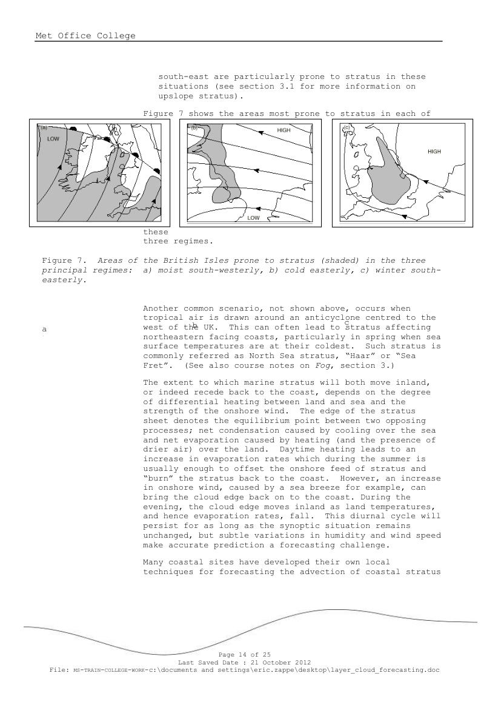

Met Office College 
Page 14 of 25 
Last Saved Date : 21 October 2012 
File: MS-TRAIN-COLLEGE-WORK-c:\documents and settings\eric.zappe\desktop\layer_cloud_forecasting.doc 
south-east are particularly prone to stratus in these 
situations (see section 3.1 for more information on 
upslope stratus). 
Figure 7 shows the areas most prone to stratus in each of 
these 
three regimes. 
 
Figure 7.  Areas of the British Isles prone to stratus (shaded) in the three 
principal regimes:  a) moist south-westerly, b) cold easterly, c) winter south-
easterly. 
 
 
Another common scenario, not shown above, occurs when 
tropical air is drawn around an anticyclone centred to the 
west of the UK.  This can often lead to stratus affecting 
northeastern facing coasts, particularly in spring when sea 
surface temperatures are at their coldest.  Such stratus is 
commonly referred as North Sea stratus, “Haar” or “Sea 
Fret”.  (See also course notes on Fog, section 3.) 
The extent to which marine stratus will both move inland, 
or indeed recede back to the coast, depends on the degree 
of differential heating between land and sea and the 
strength of the onshore wind.  The edge of the stratus 
sheet denotes the equilibrium point between two opposing 
processes; net condensation caused by cooling over the sea 
and net evaporation caused by heating (and the presence of 
drier air) over the land.  Daytime heating leads to an 
increase in evaporation rates which during the summer is 
usually enough to offset the onshore feed of stratus and 
“burn” the stratus back to the coast.  However, an increase 
in onshore wind, caused by a sea breeze for example, can 
bring the cloud edge back on to the coast. During the 
evening, the cloud edge moves inland as land temperatures, 
and hence evaporation rates, fall.  This diurnal cycle will 
persist for as long as the synoptic situation remains 
unchanged, but subtle variations in humidity and wind speed 
make accurate prediction a forecasting challenge. 
Many coastal sites have developed their own local 
techniques for forecasting the advection of coastal stratus 
a
)
b
)
c
)

## Page 15

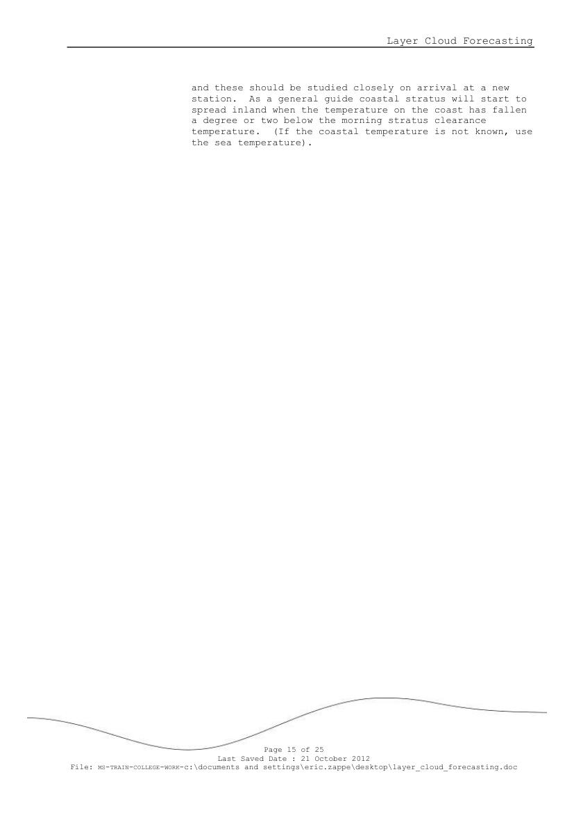

Layer Cloud Forecasting 
Page 15 of 25 
Last Saved Date : 21 October 2012 
File: MS-TRAIN-COLLEGE-WORK-c:\documents and settings\eric.zappe\desktop\layer_cloud_forecasting.doc 
and these should be studied closely on arrival at a new 
station.  As a general guide coastal stratus will start to 
spread inland when the temperature on the coast has fallen 
a degree or two below the morning stratus clearance 
temperature.  (If the coastal temperature is not known, use 
the sea temperature).

## Page 16

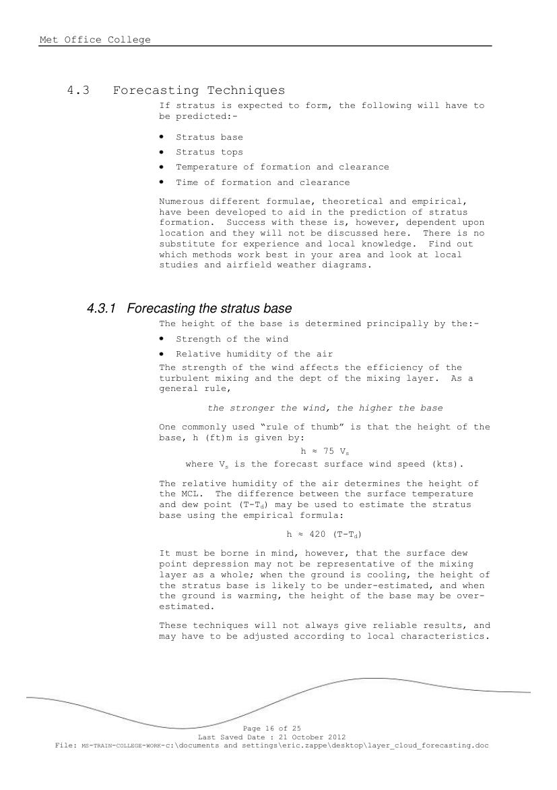

Met Office College 
Page 16 of 25 
Last Saved Date : 21 October 2012 
File: MS-TRAIN-COLLEGE-WORK-c:\documents and settings\eric.zappe\desktop\layer_cloud_forecasting.doc 
4.3 
Forecasting Techniques 
If stratus is expected to form, the following will have to 
be predicted:- 
 
Stratus base 
 
Stratus tops 
 
Temperature of formation and clearance 
 
Time of formation and clearance 
Numerous different formulae, theoretical and empirical, 
have been developed to aid in the prediction of stratus 
formation.  Success with these is, however, dependent upon 
location and they will not be discussed here.  There is no 
substitute for experience and local knowledge.  Find out 
which methods work best in your area and look at local 
studies and airfield weather diagrams. 
 
4.3.1 Forecasting the stratus base 
The height of the base is determined principally by the:- 
 
Strength of the wind 
 
Relative humidity of the air 
The strength of the wind affects the efficiency of the 
turbulent mixing and the dept of the mixing layer.  As a 
general rule,  
the stronger the wind, the higher the base 
One commonly used “rule of thumb” is that the height of the 
base, h (ft)m is given by: 
h ≈ 75 Vs 
where Vs is the forecast surface wind speed (kts). 
The relative humidity of the air determines the height of 
the MCL.  The difference between the surface temperature 
and dew point (T-Td) may be used to estimate the stratus 
base using the empirical formula: 
h ≈ 420 (T-Td) 
It must be borne in mind, however, that the surface dew 
point depression may not be representative of the mixing 
layer as a whole; when the ground is cooling, the height of 
the stratus base is likely to be under-estimated, and when 
the ground is warming, the height of the base may be over-
estimated. 
These techniques will not always give reliable results, and 
may have to be adjusted according to local characteristics.

## Page 17

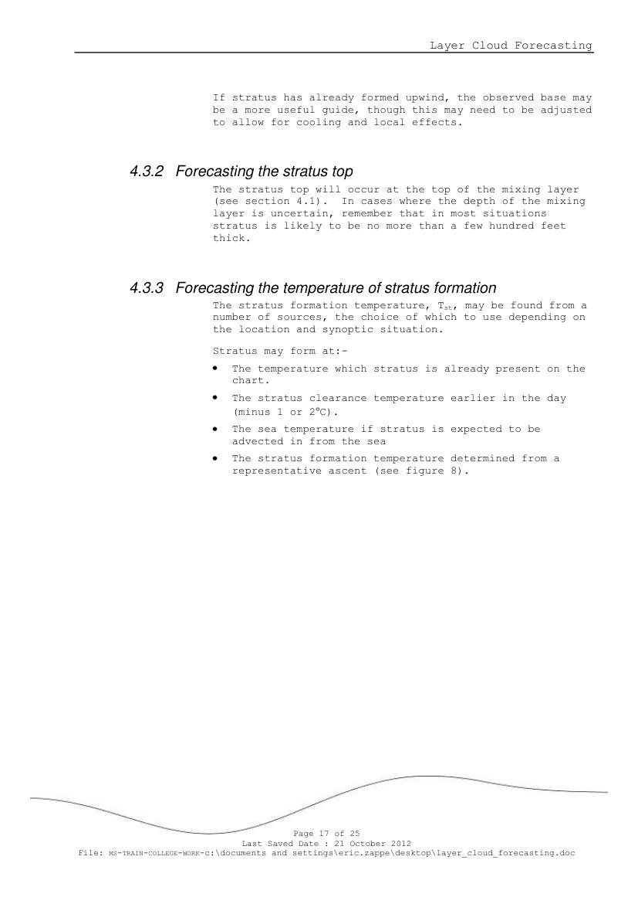

Layer Cloud Forecasting 
Page 17 of 25 
Last Saved Date : 21 October 2012 
File: MS-TRAIN-COLLEGE-WORK-c:\documents and settings\eric.zappe\desktop\layer_cloud_forecasting.doc 
If stratus has already formed upwind, the observed base may 
be a more useful guide, though this may need to be adjusted 
to allow for cooling and local effects. 
 
4.3.2 Forecasting the stratus top 
The stratus top will occur at the top of the mixing layer 
(see section 4.1).  In cases where the depth of the mixing  
layer is uncertain, remember that in most situations 
stratus is likely to be no more than a few hundred feet 
thick. 
 
4.3.3 Forecasting the temperature of stratus formation 
The stratus formation temperature, Tst, may be found from a 
number of sources, the choice of which to use depending on 
the location and synoptic situation. 
Stratus may form at:- 
 
The temperature which stratus is already present on the 
chart. 
 
The stratus clearance temperature earlier in the day 
(minus 1 or 2 C). 
 
The sea temperature if stratus is expected to be 
advected in from the sea 
 
The stratus formation temperature determined from a 
representative ascent (see figure 8).

## Page 18

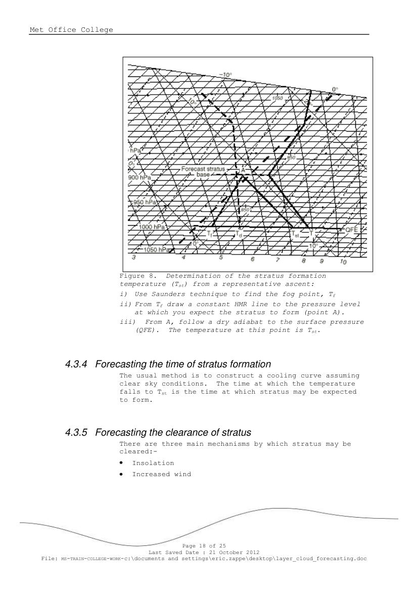

Met Office College 
Page 18 of 25 
Last Saved Date : 21 October 2012 
File: MS-TRAIN-COLLEGE-WORK-c:\documents and settings\eric.zappe\desktop\layer_cloud_forecasting.doc 
Figure 8.  Determination of the stratus formation 
temperature (Tst) from a representative ascent: 
i) Use Saunders technique to find the fog point, Tf 
ii) From Tf draw a constant HMR line to the pressure level 
at which you expect the stratus to form (point A). 
iii) 
From A, follow a dry adiabat to the surface pressure 
(QFE).  The temperature at this point is Tst. 
 
 
4.3.4 Forecasting the time of stratus formation 
The usual method is to construct a cooling curve assuming 
clear sky conditions.  The time at which the temperature 
falls to Tst is the time at which stratus may be expected 
to form. 
 
4.3.5 Forecasting the clearance of stratus 
There are three main mechanisms by which stratus may be 
cleared:- 
 
Insolation 
 
Increased wind

## Page 19

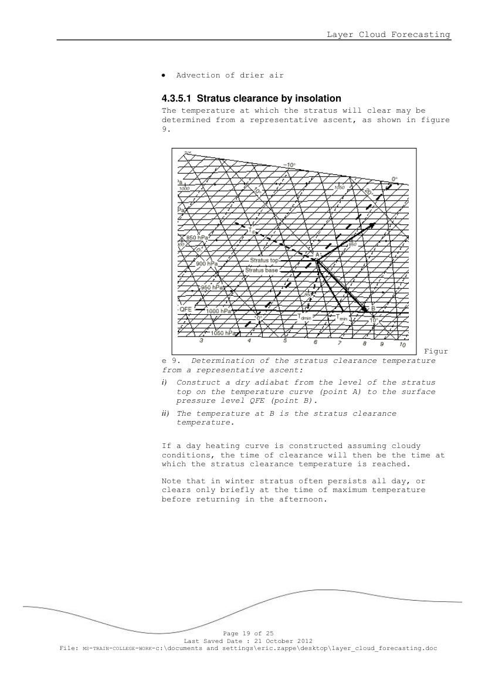

Layer Cloud Forecasting 
Page 19 of 25 
Last Saved Date : 21 October 2012 
File: MS-TRAIN-COLLEGE-WORK-c:\documents and settings\eric.zappe\desktop\layer_cloud_forecasting.doc 
 
Advection of drier air 
4.3.5.1 Stratus clearance by insolation 
The temperature at which the stratus will clear may be 
determined from a representative ascent, as shown in figure 
9. 
 
 
 
 
 
 
 
 
 
 
 
 
 
 
 
 
 
 
Figur
e 9.  Determination of the stratus clearance temperature 
from a representative ascent: 
i) 
Construct a dry adiabat from the level of the stratus 
top on the temperature curve (point A) to the surface 
pressure level QFE (point B). 
ii) The temperature at B is the stratus clearance 
temperature. 
 
If a day heating curve is constructed assuming cloudy 
conditions, the time of clearance will then be the time at 
which the stratus clearance temperature is reached. 
Note that in winter stratus often persists all day, or 
clears only briefly at the time of maximum temperature 
before returning in the afternoon.

## Page 20

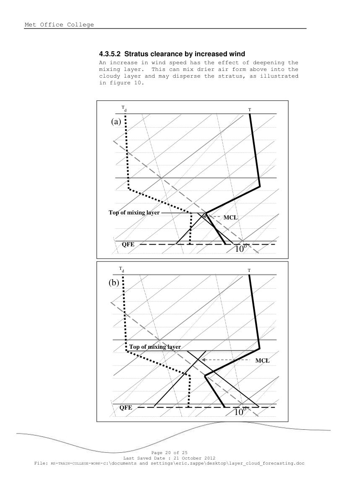

Met Office College 
Page 20 of 25 
Last Saved Date : 21 October 2012 
File: MS-TRAIN-COLLEGE-WORK-c:\documents and settings\eric.zappe\desktop\layer_cloud_forecasting.doc 
4.3.5.2 Stratus clearance by increased wind 
An increase in wind speed has the effect of deepening the 
mixing layer.  This can mix drier air form above into the 
cloudy layer and may disperse the stratus, as illustrated 
in figure 10. 
 
 
 
 
 
 
 
 
 
 
 
 
 
 
 
 
 
 
 
 
 
 
 
 
 
10o
Td
T
Top of mixing layer
MCL
QFE
(a)
 
10o
Td
T
Top of mixing layer
MCL
QFE
(b)

## Page 21

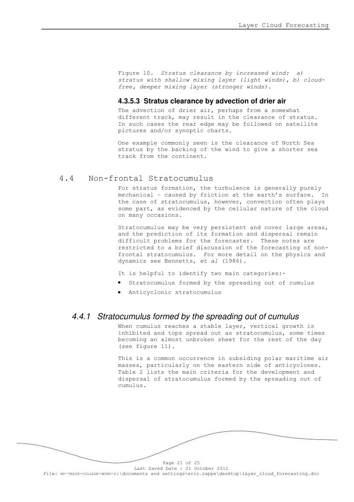

Layer Cloud Forecasting 
Page 21 of 25 
Last Saved Date : 21 October 2012 
File: MS-TRAIN-COLLEGE-WORK-c:\documents and settings\eric.zappe\desktop\layer_cloud_forecasting.doc 
 
 
Figure 10.  Stratus clearance by increased wind:  a) 
stratus with shallow mixing layer (light winds), b) cloud-
free, deeper mixing layer (stronger winds). 
4.3.5.3 Stratus clearance by advection of drier air 
The advection of drier air, perhaps from a somewhat 
different track, may result in the clearance of stratus.  
In such cases the rear edge may be followed on satellite 
pictures and/or synoptic charts. 
One example commonly seen is the clearance of North Sea 
stratus by the backing of the wind to give a shorter sea 
track from the continent. 
 
4.4 
Non-frontal Stratocumulus 
For stratus formation, the turbulence is generally purely 
mechanical – caused by friction at the earth’s surface.  In 
the case of stratocumulus, however, convection often plays 
some part, as evidenced by the cellular nature of the cloud 
on many occasions. 
Stratocumulus may be very persistent and cover large areas, 
and the prediction of its formation and dispersal remain 
difficult problems for the forecaster.  These notes are 
restricted to a brief discussion of the forecasting of non-
frontal stratocumulus.  For more detail on the physics and 
dynamics see Bennetts, et al (1986). 
It is helpful to identify two main categories:- 
 
Stratocumulus formed by the spreading out of cumulus 
 
Anticyclonic stratocumulus 
 
4.4.1 Stratocumulus formed by the spreading out of cumulus 
When cumulus reaches a stable layer, vertical growth is 
inhibited and tops spread out as stratocumulus, some times 
becoming an almost unbroken sheet for the rest of the day 
(see figure 11). 
This is a common occurrence in subsiding polar maritime air 
masses, particularly on the eastern side of anticyclones.  
Table 2 lists the main criteria for the development and 
dispersal of stratocumulus formed by the spreading out of 
cumulus.

## Page 22

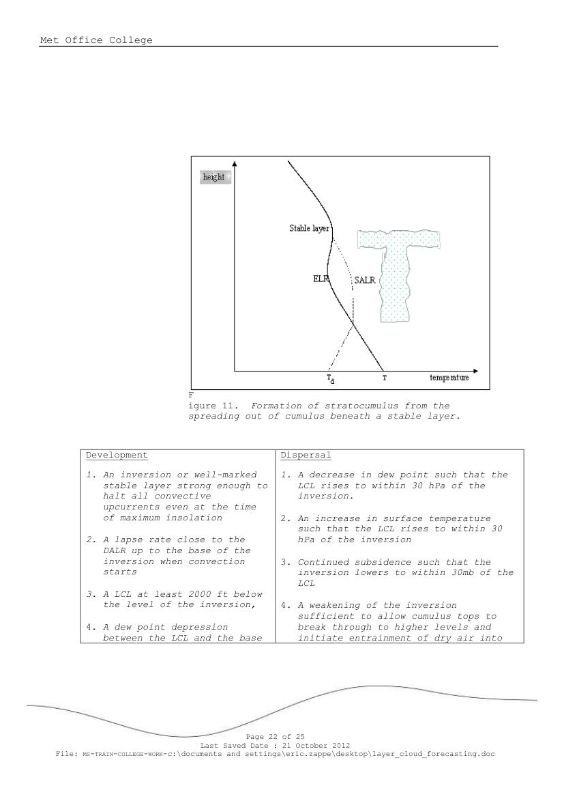

Met Office College 
Page 22 of 25 
Last Saved Date : 21 October 2012 
File: MS-TRAIN-COLLEGE-WORK-c:\documents and settings\eric.zappe\desktop\layer_cloud_forecasting.doc 
 
 
 
 
 
 
 
 
 
 
 
 
 
 
 
 
F
igure 11.  Formation of stratocumulus from the 
spreading out of cumulus beneath a stable layer. 
 
Development 
1. An inversion or well-marked 
stable layer strong enough to 
halt all convective 
upcurrents even at the time 
of maximum insolation 
2. A lapse rate close to the 
DALR up to the base of the 
inversion when convection 
starts 
3. A LCL at least 2000 ft below 
the level of the inversion, 
4. A dew point depression 
between the LCL and the base 
Dispersal 
1. A decrease in dew point such that the 
LCL rises to within 30 hPa of the 
inversion.  
2. An increase in surface temperature 
such that the LCL rises to within 30 
hPa of the inversion 
3. Continued subsidence such that the 
inversion lowers to within 30mb of the 
LCL 
4. A weakening of the inversion 
sufficient to allow cumulus tops to 
break through to higher levels and 
initiate entrainment of dry air into

## Page 23

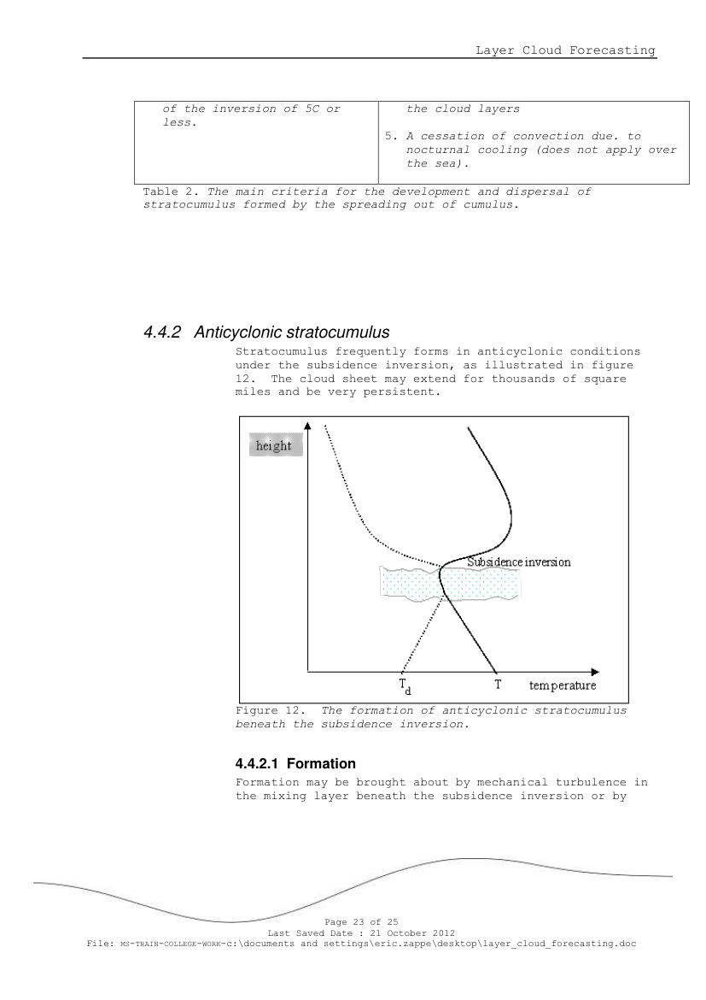

Layer Cloud Forecasting 
Page 23 of 25 
Last Saved Date : 21 October 2012 
File: MS-TRAIN-COLLEGE-WORK-c:\documents and settings\eric.zappe\desktop\layer_cloud_forecasting.doc 
of the inversion of 5C or 
less. 
the cloud layers 
5. A cessation of convection due. to 
nocturnal cooling (does not apply over 
the sea). 
Table 2. The main criteria for the development and dispersal of 
stratocumulus formed by the spreading out of cumulus. 
 
 
 
 
4.4.2 Anticyclonic stratocumulus 
Stratocumulus frequently forms in anticyclonic conditions 
under the subsidence inversion, as illustrated in figure 
12.  The cloud sheet may extend for thousands of square 
miles and be very persistent. 
Figure 12.  The formation of anticyclonic stratocumulus 
beneath the subsidence inversion. 
4.4.2.1 Formation 
Formation may be brought about by mechanical turbulence in 
the mixing layer beneath the subsidence inversion or by

## Page 24

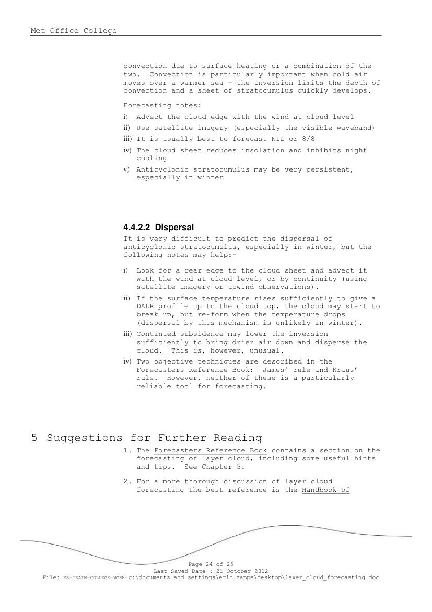

Met Office College 
Page 24 of 25 
Last Saved Date : 21 October 2012 
File: MS-TRAIN-COLLEGE-WORK-c:\documents and settings\eric.zappe\desktop\layer_cloud_forecasting.doc 
convection due to surface heating or a combination of the 
two.  Convection is particularly important when cold air 
moves over a warmer sea – the inversion limits the depth of 
convection and a sheet of stratocumulus quickly develops. 
Forecasting notes: 
i) 
Advect the cloud edge with the wind at cloud level 
ii) Use satellite imagery (especially the visible waveband) 
iii) It is usually best to forecast NIL or 8/8 
iv) The cloud sheet reduces insolation and inhibits night 
cooling 
v) Anticyclonic stratocumulus may be very persistent, 
especially in winter 
 
 
4.4.2.2 Dispersal 
It is very difficult to predict the dispersal of 
anticyclonic stratocumulus, especially in winter, but the 
following notes may help:- 
i) 
Look for a rear edge to the cloud sheet and advect it 
with the wind at cloud level, or by continuity (using 
satellite imagery or upwind observations). 
ii) If the surface temperature rises sufficiently to give a 
DALR profile up to the cloud top, the cloud may start to 
break up, but re-form when the temperature drops 
(dispersal by this mechanism is unlikely in winter). 
iii) Continued subsidence may lower the inversion 
sufficiently to bring drier air down and disperse the 
cloud.  This is, however, unusual. 
iv) Two objective techniques are described in the 
Forecasters Reference Book:  James’ rule and Kraus’ 
rule.  However, neither of these is a particularly 
reliable tool for forecasting. 
 
 
5 Suggestions for Further Reading 
1. The Forecasters Reference Book contains a section on the 
forecasting of layer cloud, including some useful hints 
and tips.  See Chapter 5. 
2. For a more thorough discussion of layer cloud 
forecasting the best reference is the Handbook of

## Page 25

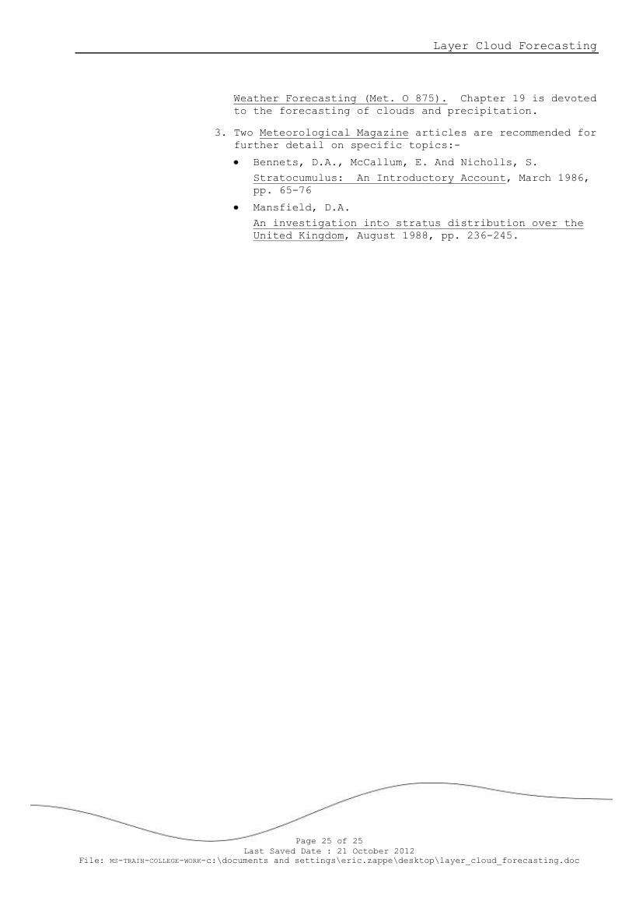

Layer Cloud Forecasting 
Page 25 of 25 
Last Saved Date : 21 October 2012 
File: MS-TRAIN-COLLEGE-WORK-c:\documents and settings\eric.zappe\desktop\layer_cloud_forecasting.doc 
Weather Forecasting (Met. O 875).  Chapter 19 is devoted 
to the forecasting of clouds and precipitation. 
3. Two Meteorological Magazine articles are recommended for 
further detail on specific topics:- 
 
Bennets, D.A., McCallum, E. And Nicholls, S. 
Stratocumulus:  An Introductory Account, March 1986, 
pp. 65-76 
 
Mansfield, D.A. 
An investigation into stratus distribution over the 
United Kingdom, August 1988, pp. 236-245.
