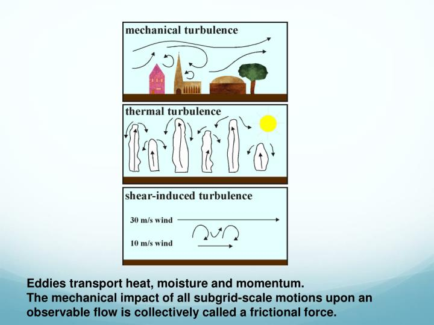
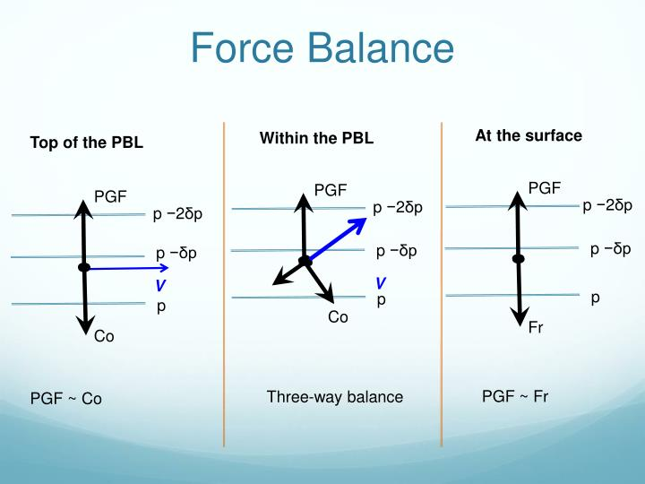
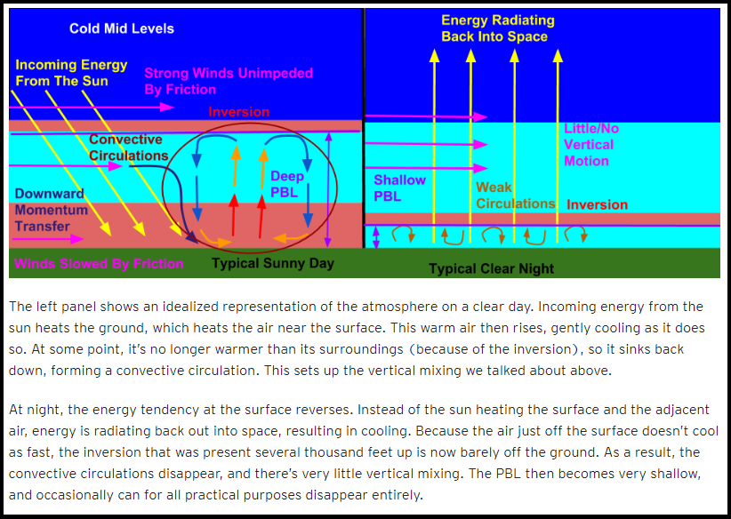
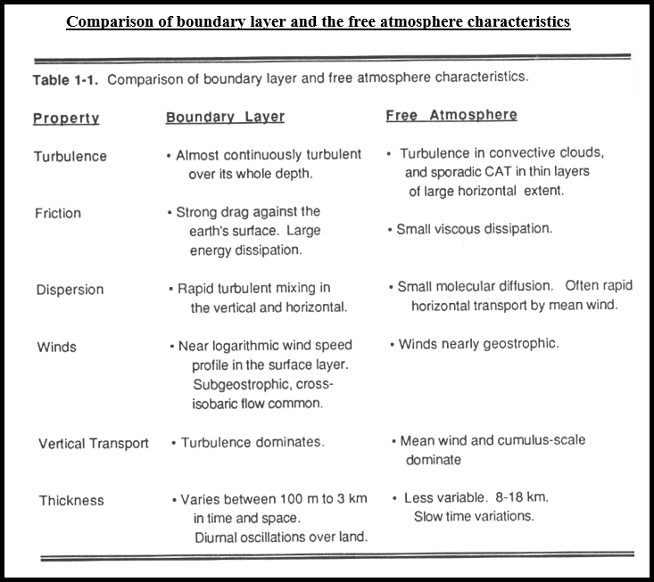
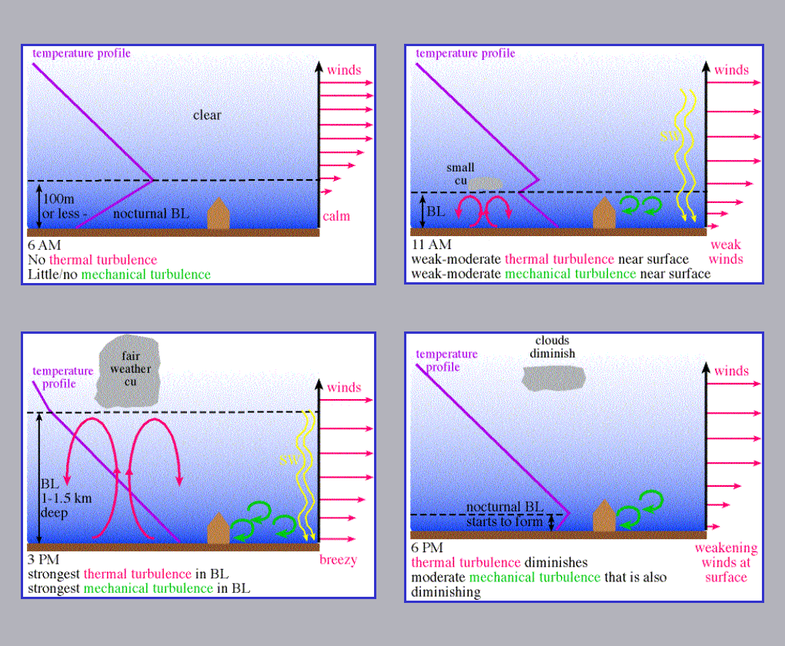
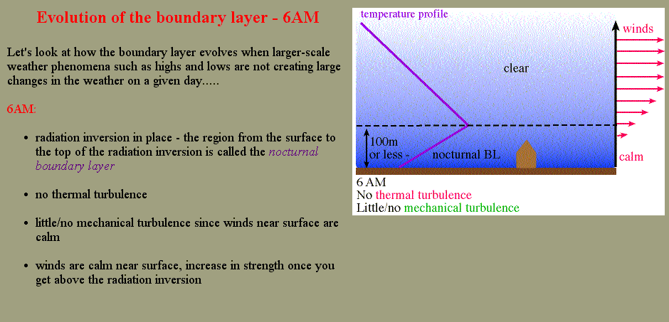
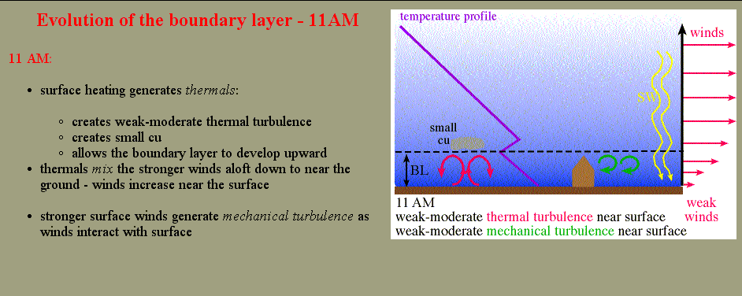
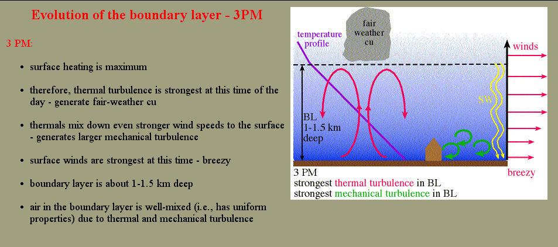
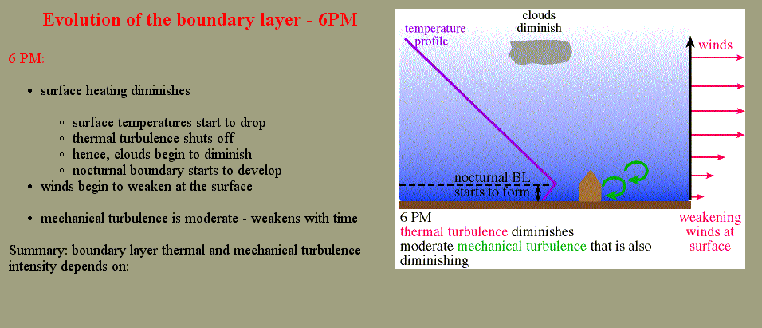

# Planetary Boundary Layer & Clouds

> Source: <http://www.weather.gov/source/zhu/ZHU_Training_Page/clouds/planetary_boundary_layer/PBL.html>  
> Section: Clouds/Precipitation  
> Captured: 2026-08-19 06:00 UTC  
> PDF: [planetary-boundary-layer-clouds.pdf](planetary-boundary-layer-clouds.pdf) · Original HTML: [source/original.html](source/original.html)

---

**THE PLANETARY BOUNDARY LAYER**

**TEXT BY METEOROLOGIST JEFF HABY, [theweatherprediction.com](https://theweatherprediction.com/)
IMAGES BY MULTIPLE SOURCES**

The planetary boundary layer is the lowest layer of the troposphere where
wind is influenced by friction. The thickness of the PBL is not constant.
At night and in the cool season the PBL tends to be lower in thickness
while during the day and in the warm season it tends to have a higher
thickness. The two reasons for this are the wind speed and thickness of
the air as a function of temperature. Strong wind speeds allow for more
convective mixing. This convective mixing will cause the PBL to expand. At
night, the PBL contracts due to a reduction of rising thermals from the
surface. Cold air is denser than warm air, therefore the PBL will tend to
be shallower in the cool season.

What are the characteristics of the PBL? First, wind is turbulent and
gusty within the PBL. Surface friction from vegetation and topography
causes turbulent eddies and chaotic wind patterns to develop. Above the
PBL, the wind speed is much more uniform and stronger due to a marked
decrease in friction. Above the PBL in the mid-latitudes the wind is
termed geostrophic. A geostrophic wind is the balance of the pressure
gradient and Coriolis force. In the PBL, the frictional force is added to
the PGF and Coriolis. The balance of these three forces is termed the
gradient wind. Friction causes air to spiral into low pressure since
friction reduces the magnitude of the Coriolis force. From the bottom to
the top of the PBL, it is common to notice the winds veering or backing.
This is often due to the decrease in friction as an important force with
height.

Second, the temperature of the PBL is dominated more by advection and
thermal energy budgets than levels above the PBL. The earth gains most of
its energy and losses most of its energy from the surface. It is warmed
through solar heating and cooled through longwave radiation emissions. The
most dramatic temperature changes occur within the PBL. It can warm up
significantly during the day and cool at night while the rest of the
atmosphere stays at a fairly uniform temperature. The PBL is the major
supplier of heat and moisture to thunderstorms. Temperature advections and
moisture advections are important to monitor when forecasting. An
increase of moisture and heat to the PBL will cause the atmosphere to
become more unstable.

How can you determine the depth of the PBL? This is most easily done by
looking at a thermodynamic sounding. The top of the PBL is often marked
with a temperature inversion, a change in mass air, a hydrolapse, and
change in wind speed and/or a change in wind direction. Inversions traps
air within the PBL and do not allow convection to occur into the middle
and upper atmosphere. Inversions above the PBL are referred to as CAPs.
The PBL is most definable in situations where differential advection is
occurring or when a shallow front is at the surface. At the top of a
front, there is an abrupt change in air mass. In some cases the transition
between the PBL and free atmosphere is not well defined. However, a
general height of the PBL can be determined by looking for subtle changes
in dewpoint and wind speed/direction. The PBL is usually within a 1000
meters of the surface.

During the day, the PBL often mixes out to the dry adiabatic lapse rate,
especially on clear days. At nights with clear skies the opposite occurs.
The surface radiationally cools, creating a large temperature inversion
throughout the entire PBL

