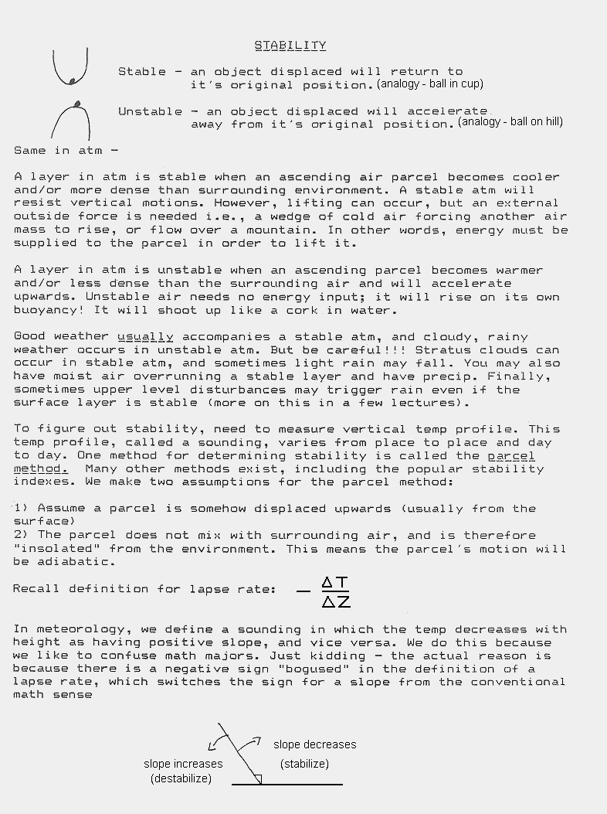
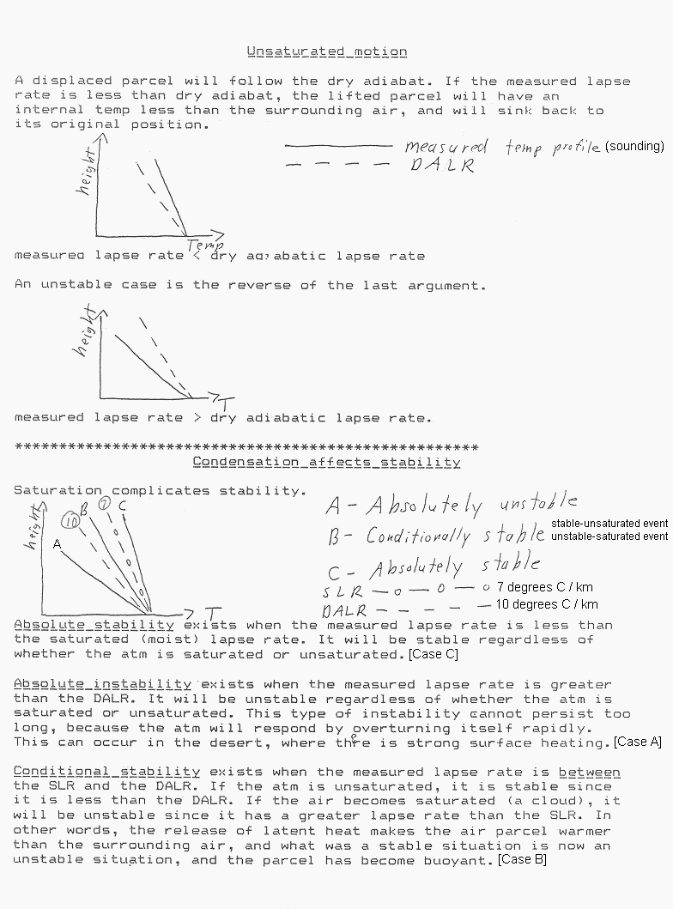
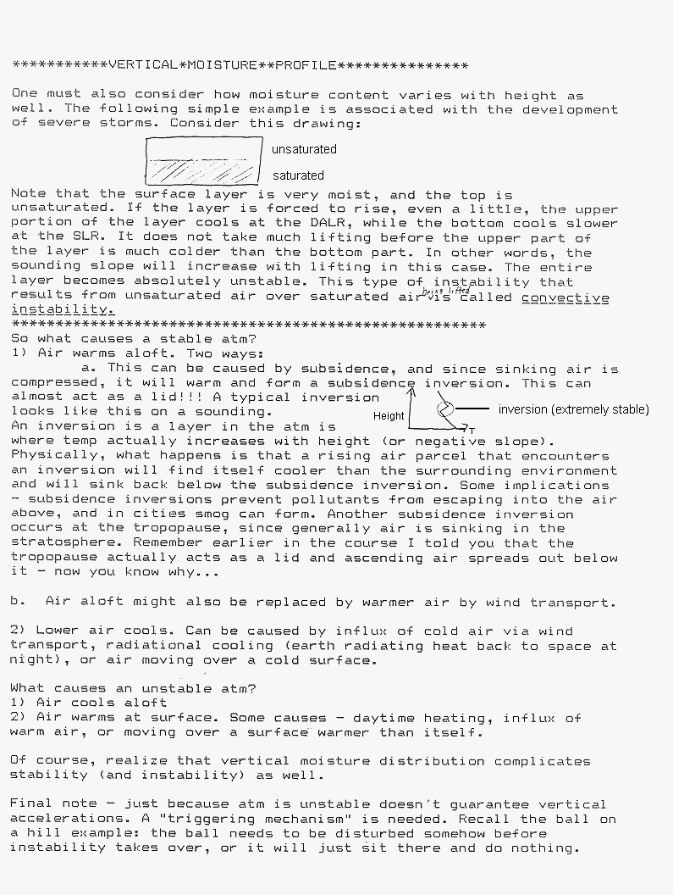
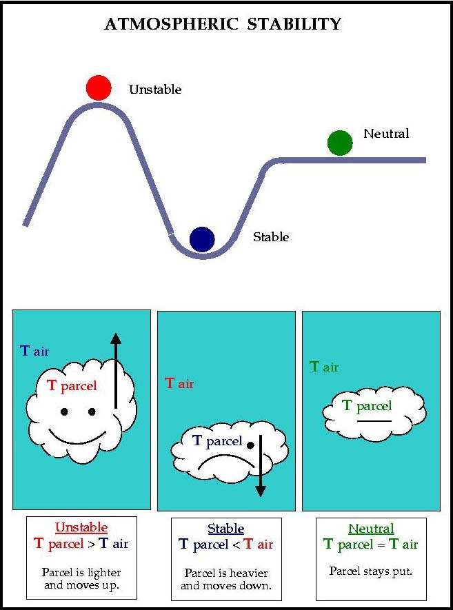
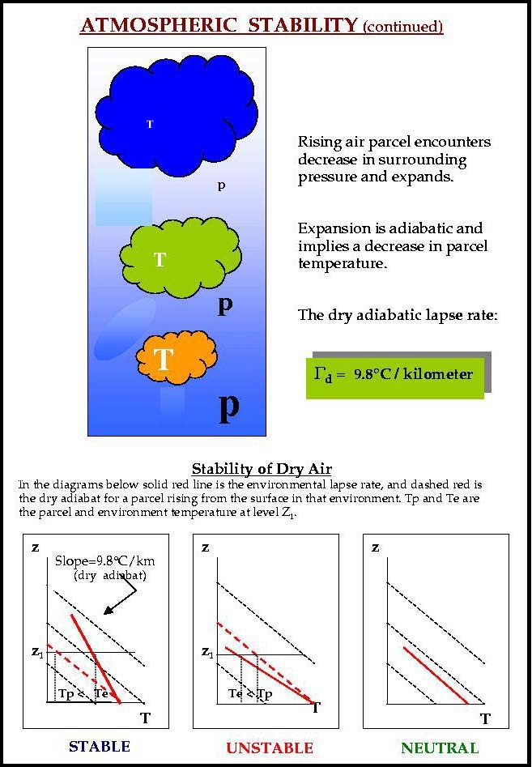
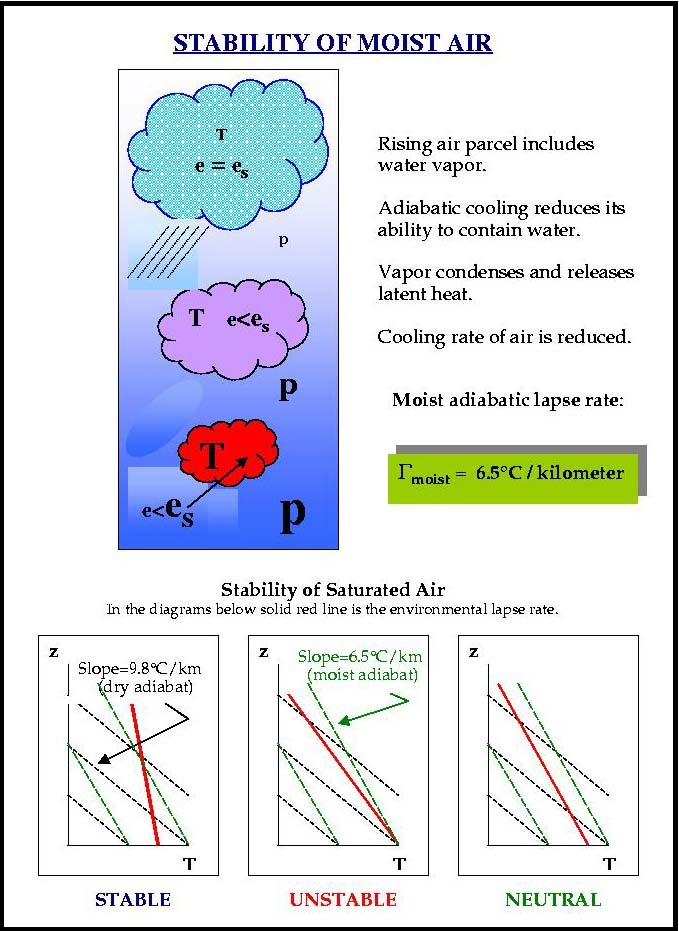
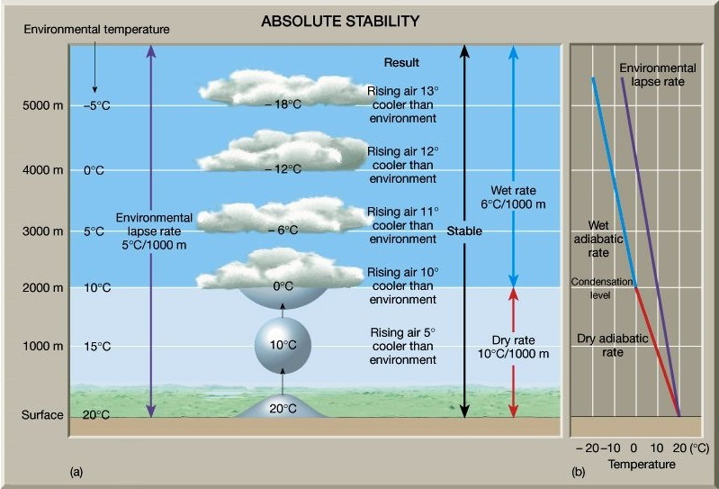
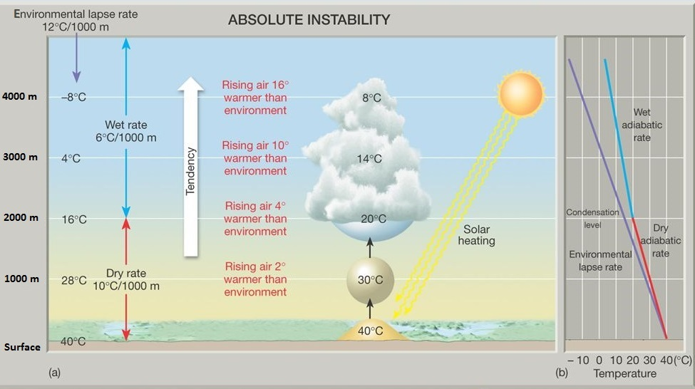
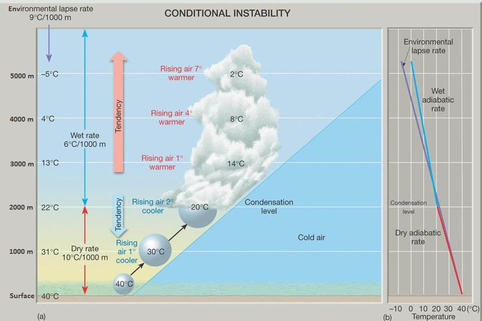

# Stability and Cloud Development — Tutorial 2

> Source: <http://www.weather.gov/source/zhu/ZHU_Training_Page/stability/stability.html>  
> Section: Clouds/Precipitation  
> Captured: 2026-08-19 06:00 UTC  
> PDF: [stability-and-cloud-development-tutorial-2.pdf](stability-and-cloud-development-tutorial-2.pdf) · Original HTML: [source/original.html](source/original.html)

---

