# Stability and Cloud Development — Tutorial 3

> Source: <http://www.weather.gov/media/zhu/ZHU_Training_Page/clouds/stability_clouds/stability_clouds2.pdf>  
> Section: Clouds/Precipitation  
> Captured: 2026-08-19 06:00 UTC  
> PDF: [stability-and-cloud-development-tutorial-3.pdf](stability-and-cloud-development-tutorial-3.pdf) (13 pages)

---

## Page 1

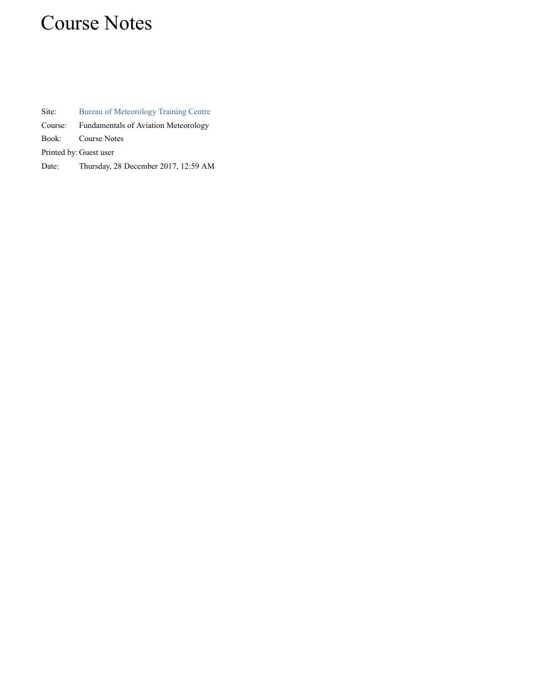

Course Notes
Site:
Bureau of Meteorology Training Centre
Course:
Fundamentals of Aviation Meteorology
Book:
Course Notes
Printed by: Guest user
Date:
Thursday, 28 December 2017, 12:59 AM

## Page 2

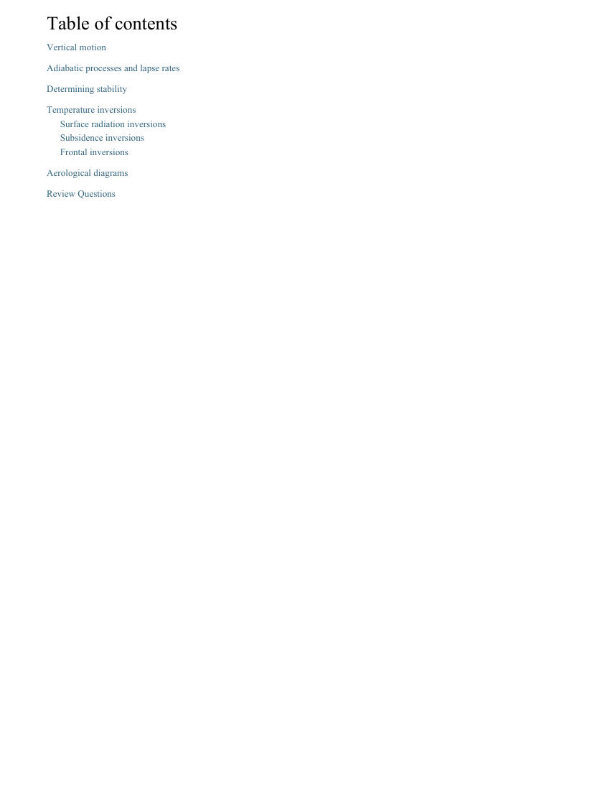

Table of contents
Vertical motion
Adiabatic processes and lapse rates
Determining stability
Temperature inversions
Surface radiation inversions
Subsidence inversions
Frontal inversions
Aerological diagrams
Review Questions

## Page 3

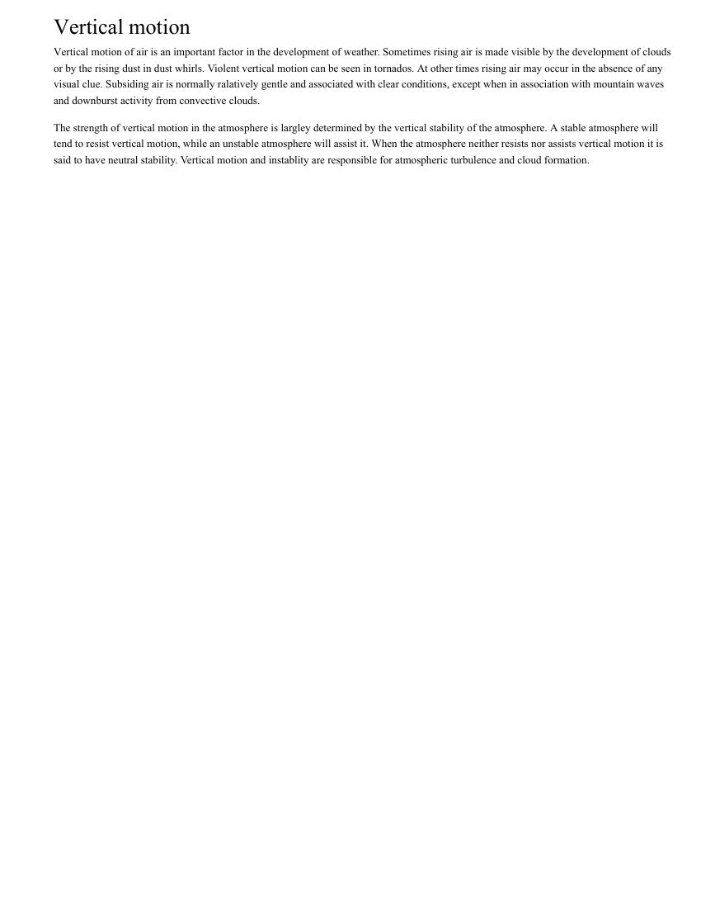

Vertical motion
Vertical motion of air is an important factor in the development of weather. Sometimes rising air is made visible by the development of clouds
or by the rising dust in dust whirls. Violent vertical motion can be seen in tornados. At other times rising air may occur in the absence of any
visual clue. Subsiding air is normally ralatively gentle and associated with clear conditions, except when in association with mountain waves
and downburst activity from convective clouds.
The strength of vertical motion in the atmosphere is largley determined by the vertical stability of the atmosphere. A stable atmosphere will
tend to resist vertical motion, while an unstable atmosphere will assist it. When the atmosphere neither resists nor assists vertical motion it is
said to have neutral stability. Vertical motion and instablity are responsible for atmospheric turbulence and cloud formation.

## Page 4

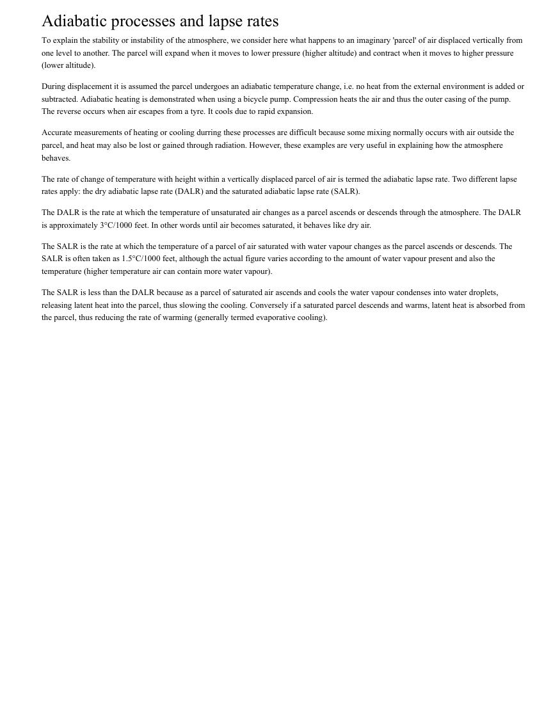

Adiabatic processes and lapse rates
To explain the stability or instability of the atmosphere, we consider here what happens to an imaginary 'parcel' of air displaced vertically from
one level to another. The parcel will expand when it moves to lower pressure (higher altitude) and contract when it moves to higher pressure
(lower altitude).
During displacement it is assumed the parcel undergoes an adiabatic temperature change, i.e. no heat from the external environment is added or
subtracted. Adiabatic heating is demonstrated when using a bicycle pump. Compression heats the air and thus the outer casing of the pump.
The reverse occurs when air escapes from a tyre. It cools due to rapid expansion.
Accurate measurements of heating or cooling durring these processes are difficult because some mixing normally occurs with air outside the
parcel, and heat may also be lost or gained through radiation. However, these examples are very useful in explaining how the atmosphere
behaves.
The rate of change of temperature with height within a vertically displaced parcel of air is termed the adiabatic lapse rate. Two different lapse
rates apply: the dry adiabatic lapse rate (DALR) and the saturated adiabatic lapse rate (SALR).
The DALR is the rate at which the temperature of unsaturated air changes as a parcel ascends or descends through the atmosphere. The DALR
is approximately 3°C/1000 feet. In other words until air becomes saturated, it behaves like dry air.
The SALR is the rate at which the temperature of a parcel of air saturated with water vapour changes as the parcel ascends or descends. The
SALR is often taken as 1.5°C/1000 feet, although the actual figure varies according to the amount of water vapour present and also the
temperature (higher temperature air can contain more water vapour).
The SALR is less than the DALR because as a parcel of saturated air ascends and cools the water vapour condenses into water droplets,
releasing latent heat into the parcel, thus slowing the cooling. Conversely if a saturated parcel descends and warms, latent heat is absorbed from
the parcel, thus reducing the rate of warming (generally termed evaporative cooling).

## Page 5

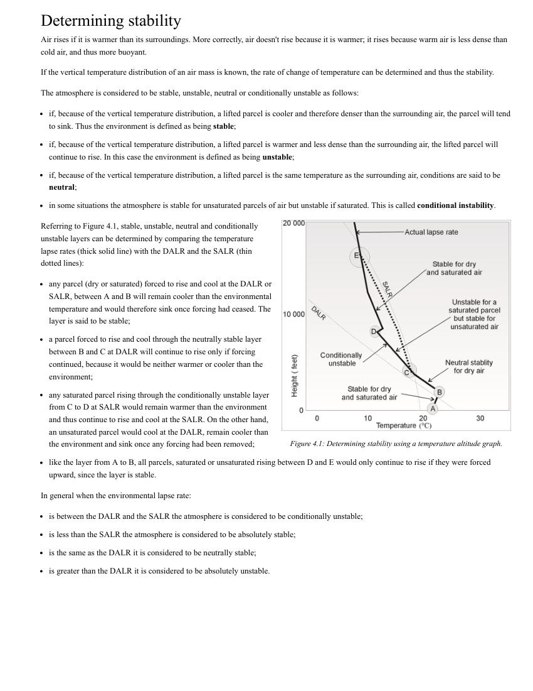

Figure 4.1: Determining stability using a temperature altitude graph.
Determining stability
Air rises if it is warmer than its surroundings. More correctly, air doesn't rise because it is warmer; it rises because warm air is less dense than
cold air, and thus more buoyant.
If the vertical temperature distribution of an air mass is known, the rate of change of temperature can be determined and thus the stability.
The atmosphere is considered to be stable, unstable, neutral or conditionally unstable as follows:
if, because of the vertical temperature distribution, a lifted parcel is cooler and therefore denser than the surrounding air, the parcel will tend
to sink. Thus the environment is defined as being stable;
if, because of the vertical temperature distribution, a lifted parcel is warmer and less dense than the surrounding air, the lifted parcel will
continue to rise. In this case the environment is defined as being unstable;
if, because of the vertical temperature distribution, a lifted parcel is the same temperature as the surrounding air, conditions are said to be
neutral;
in some situations the atmosphere is stable for unsaturated parcels of air but unstable if saturated. This is called conditional instability.
Referring to Figure 4.1, stable, unstable, neutral and conditionally
unstable layers can be determined by comparing the temperature
lapse rates (thick solid line) with the DALR and the SALR (thin
dotted lines):
any parcel (dry or saturated) forced to rise and cool at the DALR or
SALR, between A and B will remain cooler than the environmental
temperature and would therefore sink once forcing had ceased. The
layer is said to be stable;
a parcel forced to rise and cool through the neutrally stable layer
between B and C at DALR will continue to rise only if forcing
continued, because it would be neither warmer or cooler than the
environment;
any saturated parcel rising through the conditionally unstable layer
from C to D at SALR would remain warmer than the environment
and thus continue to rise and cool at the SALR. On the other hand,
an unsaturated parcel would cool at the DALR, remain cooler than
the environment and sink once any forcing had been removed;
like the layer from A to B, all parcels, saturated or unsaturated rising between D and E would only continue to rise if they were forced
upward, since the layer is stable.
In general when the environmental lapse rate:
is between the DALR and the SALR the atmosphere is considered to be conditionally unstable;
is less than the SALR the atmosphere is considered to be absolutely stable;
is the same as the DALR it is considered to be neutrally stable;
is greater than the DALR it is considered to be absolutely unstable.

## Page 6

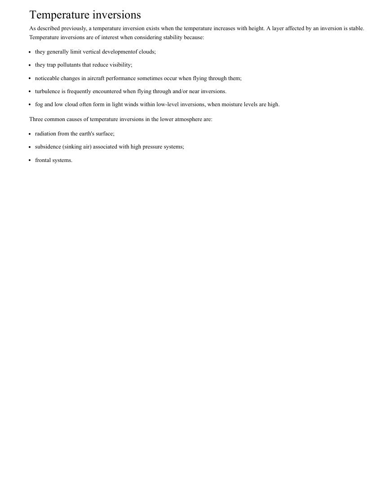

Temperature inversions
As described previously, a temperature inversion exists when the temperature increases with height. A layer affected by an inversion is stable.
Temperature inversions are of interest when considering stability because:
they generally limit vertical developmentof clouds;
they trap pollutants that reduce visibility;
noticeable changes in aircraft performance sometimes occur when flying through them;
turbulence is frequently encountered when flying through and/or near inversions.
fog and low cloud often form in light winds within low-level inversions, when moisture levels are high.
Three common causes of temperature inversions in the lower atmosphere are:
radiation from the earth's surface;
subsidence (sinking air) associated with high pressure systems;
frontal systems.

## Page 7

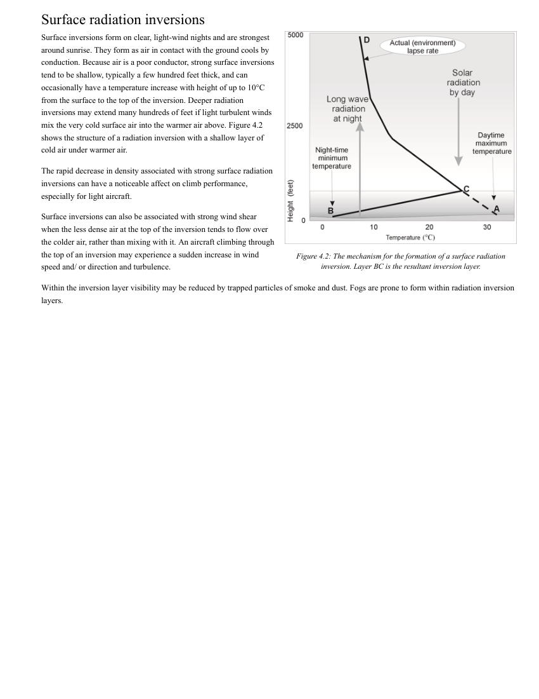

Figure 4.2: The mechanism for the formation of a surface radiation
inversion. Layer BC is the resultant inversion layer.
Surface radiation inversions
Surface inversions form on clear, light-wind nights and are strongest
around sunrise. They form as air in contact with the ground cools by
conduction. Because air is a poor conductor, strong surface inversions
tend to be shallow, typically a few hundred feet thick, and can
occasionally have a temperature increase with height of up to 10°C
from the surface to the top of the inversion. Deeper radiation
inversions may extend many hundreds of feet if light turbulent winds
mix the very cold surface air into the warmer air above. Figure 4.2
shows the structure of a radiation inversion with a shallow layer of
cold air under warmer air.
The rapid decrease in density associated with strong surface radiation
inversions can have a noticeable affect on climb performance,
especially for light aircraft.
Surface inversions can also be associated with strong wind shear
when the less dense air at the top of the inversion tends to flow over
the colder air, rather than mixing with it. An aircraft climbing through
the top of an inversion may experience a sudden increase in wind
speed and/ or direction and turbulence.
Within the inversion layer visibility may be reduced by trapped particles of smoke and dust. Fogs are prone to form within radiation inversion
layers.

## Page 8

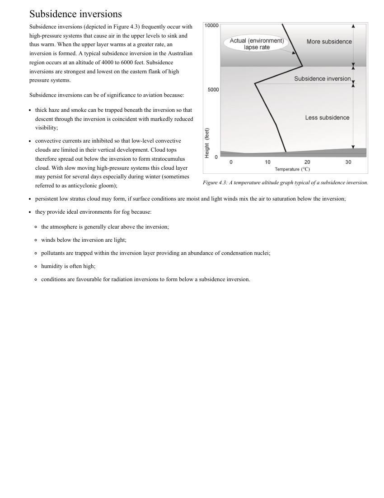

Figure 4.3: A temperature altitude graph typical of a subsidence inversion.
Subsidence inversions
Subsidence inversions (depicted in Figure 4.3) frequently occur with
high-pressure systems that cause air in the upper levels to sink and
thus warm. When the upper layer warms at a greater rate, an
inversion is formed. A typical subsidence inversion in the Australian
region occurs at an altitude of 4000 to 6000 feet. Subsidence
inversions are strongest and lowest on the eastern flank of high
pressure systems.
Subsidence inversions can be of significance to aviation because:
thick haze and smoke can be trapped beneath the inversion so that
descent through the inversion is coincident with markedly reduced
visibility;
convective currents are inhibited so that low-level convective
clouds are limited in their vertical development. Cloud tops
therefore spread out below the inversion to form stratocumulus
cloud. With slow moving high-pressure systems this cloud layer
may persist for several days especially during winter (sometimes
referred to as anticyclonic gloom);
persistent low stratus cloud may form, if surface conditions are moist and light winds mix the air to saturation below the inversion;
they provide ideal environments for fog because:
the atmosphere is generally clear above the inversion;
winds below the inversion are light;
pollutants are trapped within the inversion layer providing an abundance of condensation nuclei;
humidity is often high;
conditions are favourable for radiation inversions to form below a subsidence inversion.

## Page 9

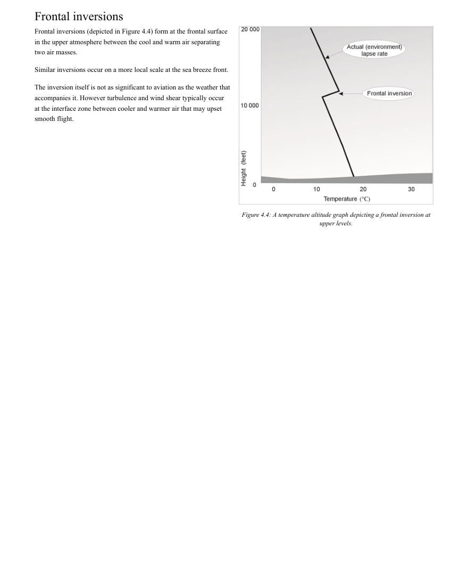

Figure 4.4: A temperature altitude graph depicting a frontal inversion at
upper levels.
Frontal inversions
Frontal inversions (depicted in Figure 4.4) form at the frontal surface
in the upper atmosphere between the cool and warm air separating
two air masses.
Similar inversions occur on a more local scale at the sea breeze front.
The inversion itself is not as significant to aviation as the weather that
accompanies it. However turbulence and wind shear typically occur
at the interface zone between cooler and warmer air that may upset
smooth flight.

## Page 10

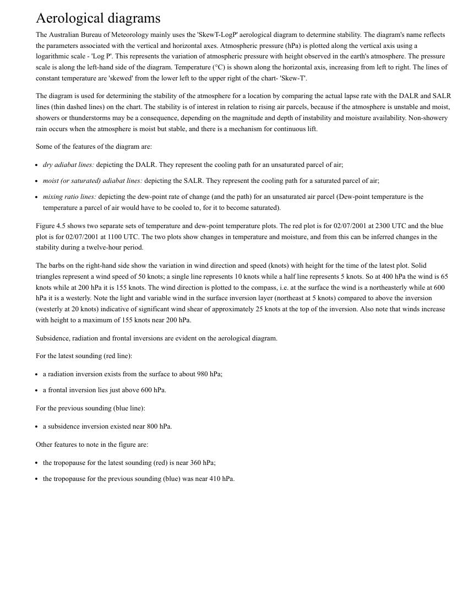

Aerological diagrams
The Australian Bureau of Meteorology mainly uses the 'SkewT-LogP' aerological diagram to determine stability. The diagram's name reflects
the parameters associated with the vertical and horizontal axes. Atmospheric pressure (hPa) is plotted along the vertical axis using a
logarithmic scale - 'Log P'. This represents the variation of atmospheric pressure with height observed in the earth's atmosphere. The pressure
scale is along the left-hand side of the diagram. Temperature (°C) is shown along the horizontal axis, increasing from left to right. The lines of
constant temperature are 'skewed' from the lower left to the upper right of the chart- 'Skew-T'.
The diagram is used for determining the stability of the atmosphere for a location by comparing the actual lapse rate with the DALR and SALR
lines (thin dashed lines) on the chart. The stability is of interest in relation to rising air parcels, because if the atmosphere is unstable and moist,
showers or thunderstorms may be a consequence, depending on the magnitude and depth of instability and moisture availability. Non-showery
rain occurs when the atmosphere is moist but stable, and there is a mechanism for continuous lift.
Some of the features of the diagram are:
dry adiabat lines: depicting the DALR. They represent the cooling path for an unsaturated parcel of air;
moist (or saturated) adiabat lines: depicting the SALR. They represent the cooling path for a saturated parcel of air;
mixing ratio lines: depicting the dew-point rate of change (and the path) for an unsaturated air parcel (Dew-point temperature is the
temperature a parcel of air would have to be cooled to, for it to become saturated).
Figure 4.5 shows two separate sets of temperature and dew-point temperature plots. The red plot is for 02/07/2001 at 2300 UTC and the blue
plot is for 02/07/2001 at 1100 UTC. The two plots show changes in temperature and moisture, and from this can be inferred changes in the
stability during a twelve-hour period.
The barbs on the right-hand side show the variation in wind direction and speed (knots) with height for the time of the latest plot. Solid
triangles represent a wind speed of 50 knots; a single line represents 10 knots while a half line represents 5 knots. So at 400 hPa the wind is 65
knots while at 200 hPa it is 155 knots. The wind direction is plotted to the compass, i.e. at the surface the wind is a northeasterly while at 600
hPa it is a westerly. Note the light and variable wind in the surface inversion layer (northeast at 5 knots) compared to above the inversion
(westerly at 20 knots) indicative of significant wind shear of approximately 25 knots at the top of the inversion. Also note that winds increase
with height to a maximum of 155 knots near 200 hPa.
Subsidence, radiation and frontal inversions are evident on the aerological diagram.
For the latest sounding (red line):
a radiation inversion exists from the surface to about 980 hPa;
a frontal inversion lies just above 600 hPa.
For the previous sounding (blue line):
a subsidence inversion existed near 800 hPa.
Other features to note in the figure are:
the tropopause for the latest sounding (red) is near 360 hPa;
the tropopause for the previous sounding (blue) was near 410 hPa.

## Page 11

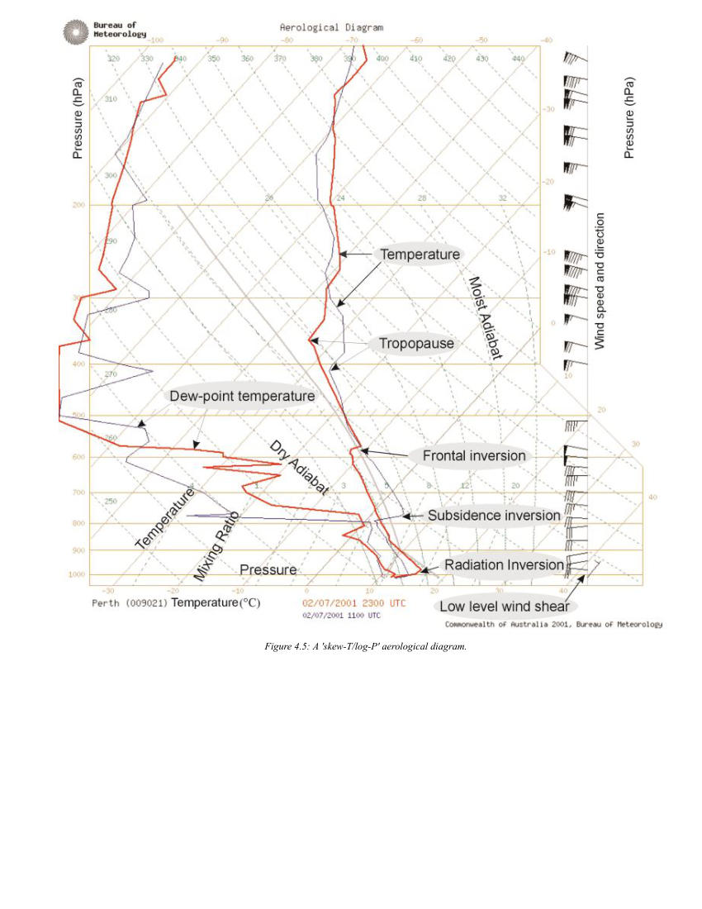

Figure 4.5: A 'skew-T/log-P' aerological diagram.

## Page 12

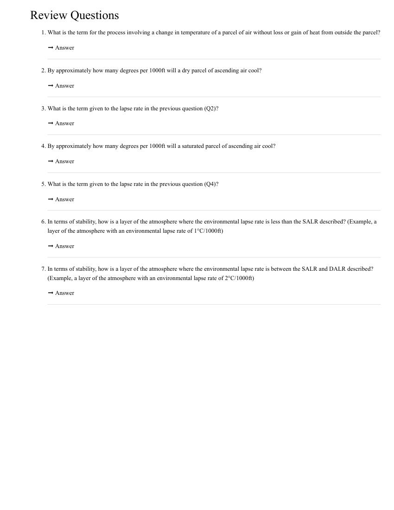

Review Questions
1. What is the term for the process involving a change in temperature of a parcel of air without loss or gain of heat from outside the parcel?
➞ Answer
2. By approximately how many degrees per 1000ft will a dry parcel of ascending air cool?
➞ Answer
3. What is the term given to the lapse rate in the previous question (Q2)?
➞ Answer
4. By approximately how many degrees per 1000ft will a saturated parcel of ascending air cool?
➞ Answer
5. What is the term given to the lapse rate in the previous question (Q4)?
➞ Answer
6. In terms of stability, how is a layer of the atmosphere where the environmental lapse rate is less than the SALR described? (Example, a
layer of the atmosphere with an environmental lapse rate of 1°C/1000ft)
➞ Answer
7. In terms of stability, how is a layer of the atmosphere where the environmental lapse rate is between the SALR and DALR described?
(Example, a layer of the atmosphere with an environmental lapse rate of 2°C/1000ft)
➞ Answer

## Page 13

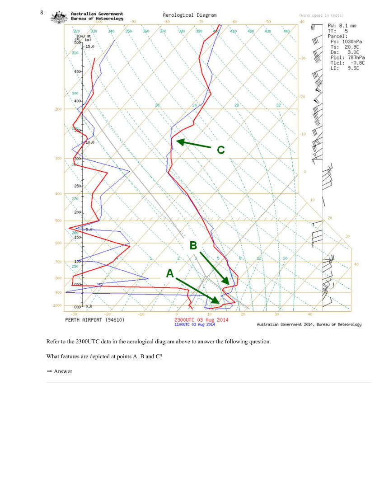

8. 
Refer to the 2300UTC data in the aerological diagram above to answer the following question.
What features are depicted at points A, B and C?
➞ Answer
