# Stability and Cloud Development

> Source: <http://www.weather.gov/media/zhu/ZHU_Training_Page/clouds/stability_clouds/stability_clouds.pdf>  
> Section: Clouds/Precipitation  
> Captured: 2026-08-19 06:00 UTC  
> PDF: [stability-and-cloud-development.pdf](stability-and-cloud-development.pdf) (18 pages)

---

## Page 1

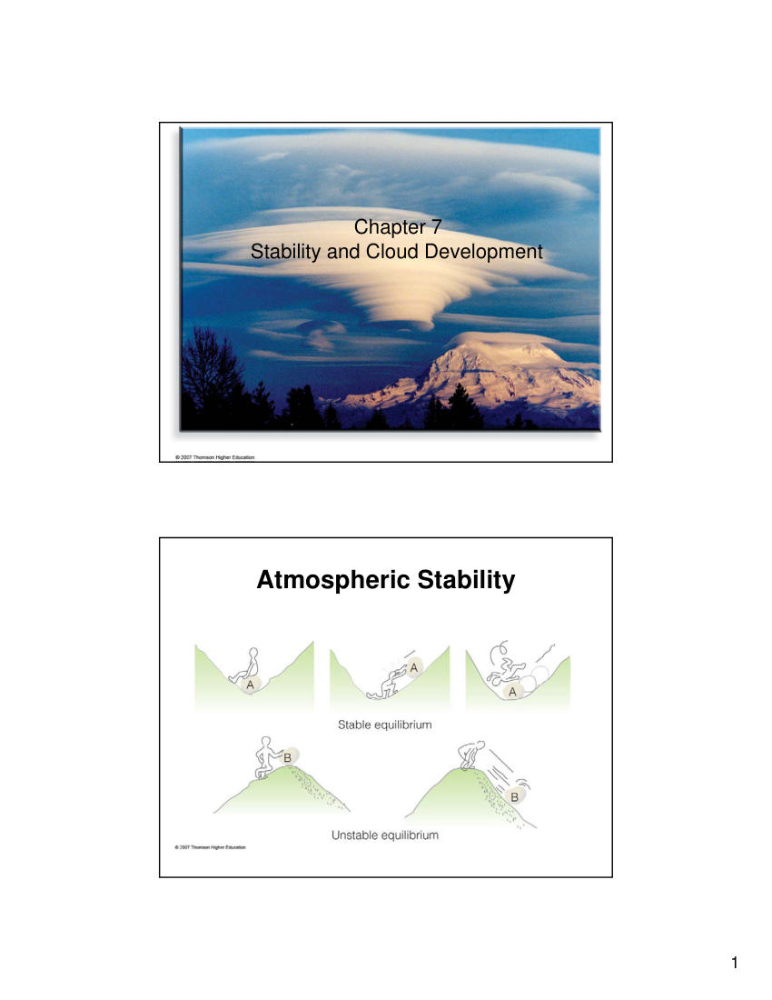

1
Chapter 7
Stability and Cloud Development
Atmospheric Stability

## Page 2

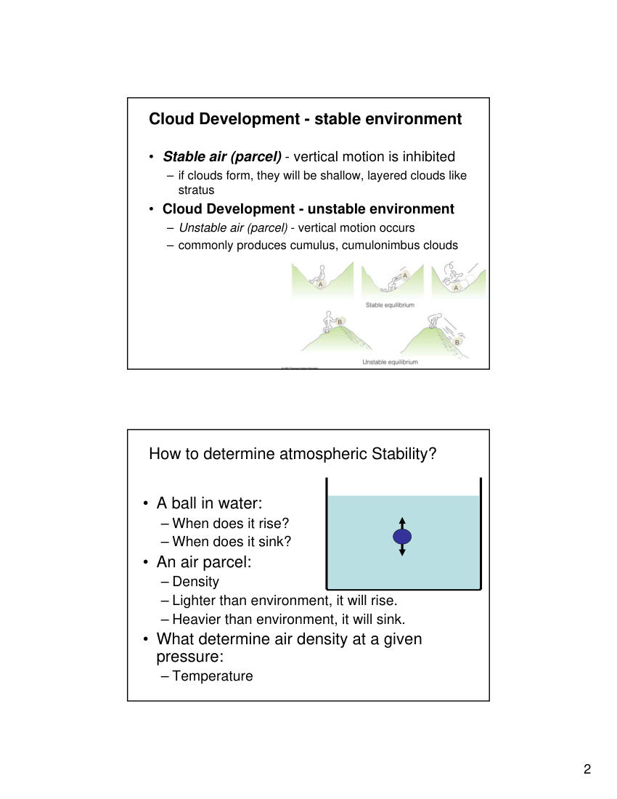

2
Cloud Development - stable environment
• Stable air (parcel) - vertical motion is inhibited 
– if clouds form, they will be shallow, layered clouds like 
stratus 
• Cloud Development - unstable environment
– Unstable air (parcel) - vertical motion occurs 
– commonly produces cumulus, cumulonimbus clouds 
• A ball in water: 
– When does it rise?
– When does it sink?
• An air parcel:
– Density
– Lighter than environment, it will rise.
– Heavier than environment, it will sink. 
• What determine air density at a given 
pressure:
– Temperature 
How to determine atmospheric Stability?

## Page 3

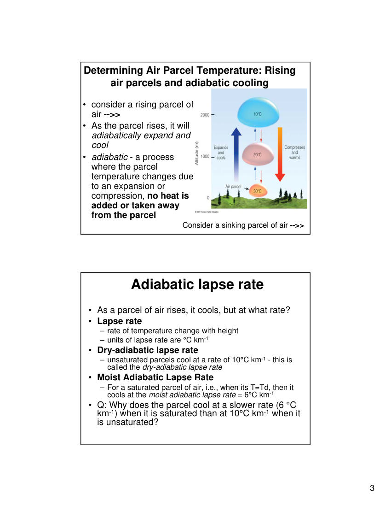

3
Determining Air Parcel Temperature: Rising 
air parcels and adiabatic cooling
• consider a rising parcel of 
air -->>
• As the parcel rises, it will 
adiabatically expand and 
cool 
• adiabatic - a process 
where the parcel 
temperature changes due 
to an expansion or 
compression, no heat is 
added or taken away 
from the parcel
Consider a sinking parcel of air -->>
Adiabatic lapse rate
• As a parcel of air rises, it cools, but at what rate?
• Lapse rate
– rate of temperature change with height
– units of lapse rate are °C km-1
• Dry-adiabatic lapse rate
– unsaturated parcels cool at a rate of 10°C km-1 - this is 
called the dry-adiabatic lapse rate
• Moist Adiabatic Lapse Rate
– For a saturated parcel of air, i.e., when its T=Td, then it 
cools at the moist adiabatic lapse rate = 6°C km-1
• Q: Why does the parcel cool at a slower rate (6 °C 
km-1) when it is saturated than at 10°C km-1 when it 
is unsaturated?

## Page 4

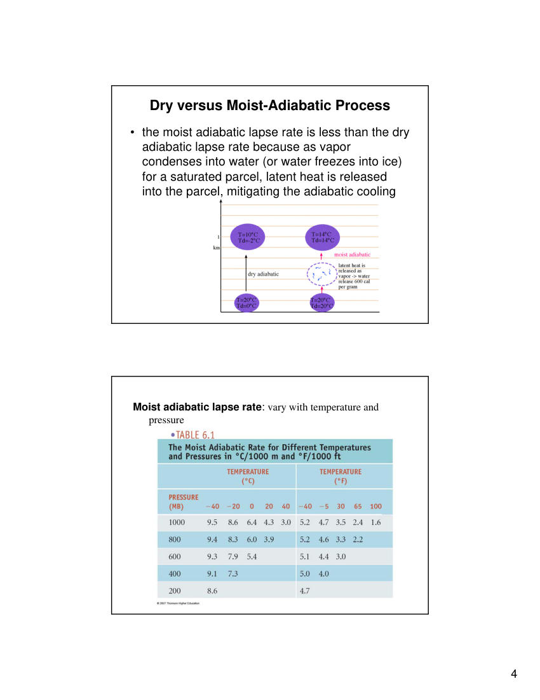

4
Dry versus Moist-Adiabatic Process
• the moist adiabatic lapse rate is less than the dry 
adiabatic lapse rate because as vapor 
condenses into water (or water freezes into ice) 
for a saturated parcel, latent heat is released 
into the parcel, mitigating the adiabatic cooling 
Moist adiabatic lapse rate: vary with temperature and 
pressure

## Page 5

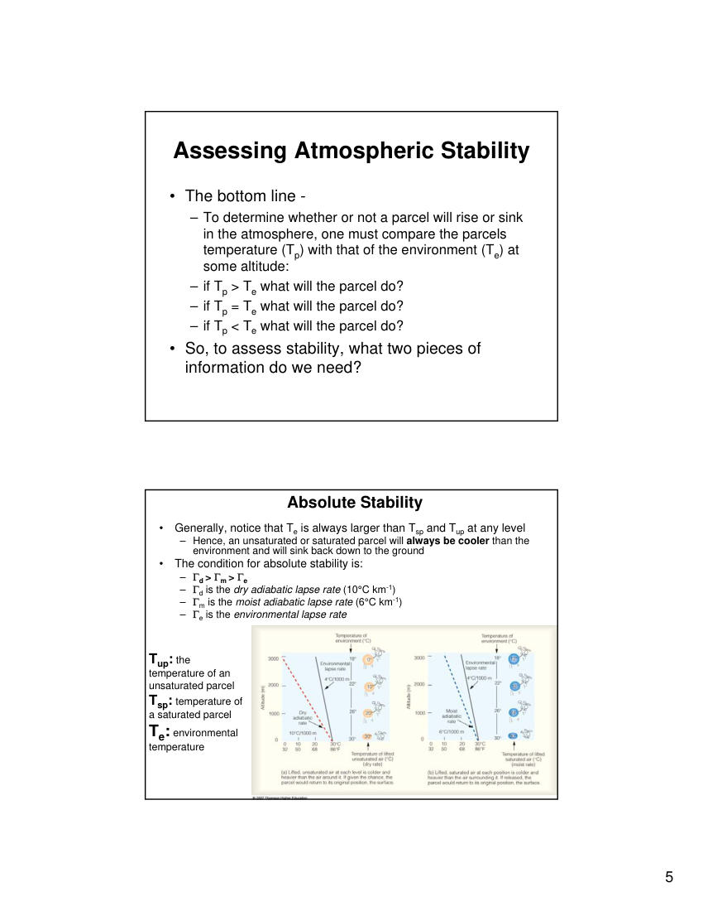

5
Assessing Atmospheric Stability
• The bottom line -
– To determine whether or not a parcel will rise or sink 
in the atmosphere, one must compare the parcels 
temperature (Tp) with that of the environment (Te) at 
some altitude:
– if Tp > Te what will the parcel do? 
– if Tp = Te what will the parcel do?  
– if Tp < Te what will the parcel do? 
• So, to assess stability, what two pieces of 
information do we need?
Absolute Stability
•
Generally, notice that Te is always larger than Tsp and Tup at any level 
– Hence, an unsaturated or saturated parcel will always be cooler than the 
environment and will sink back down to the ground 
•
The condition for absolute stability is: 
– Γd > Γm > Γe
– Γd is the dry adiabatic lapse rate (10°C km-1) 
– Γm is the moist adiabatic lapse rate (6°C km-1) 
– Γe is the environmental lapse rate
Tup: the 
temperature of an 
unsaturated parcel
Tsp: temperature of 
a saturated parcel
Te: environmental 
temperature

## Page 6

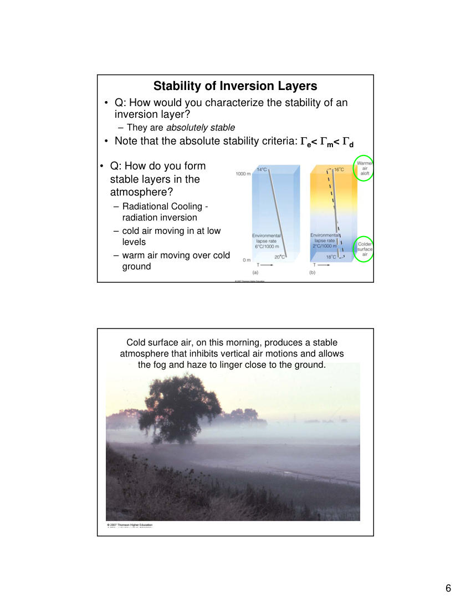

6
Stability of Inversion Layers
• Q: How would you characterize the stability of an 
inversion layer?
– They are absolutely stable
• Note that the absolute stability criteria: Γe< Γm< Γd
• Q: How do you form 
stable layers in the 
atmosphere?
– Radiational Cooling -
radiation inversion
– cold air moving in at low 
levels
– warm air moving over cold 
ground
Cold surface air, on this morning, produces a stable 
atmosphere that inhibits vertical air motions and allows 
the fog and haze to linger close to the ground.

## Page 7

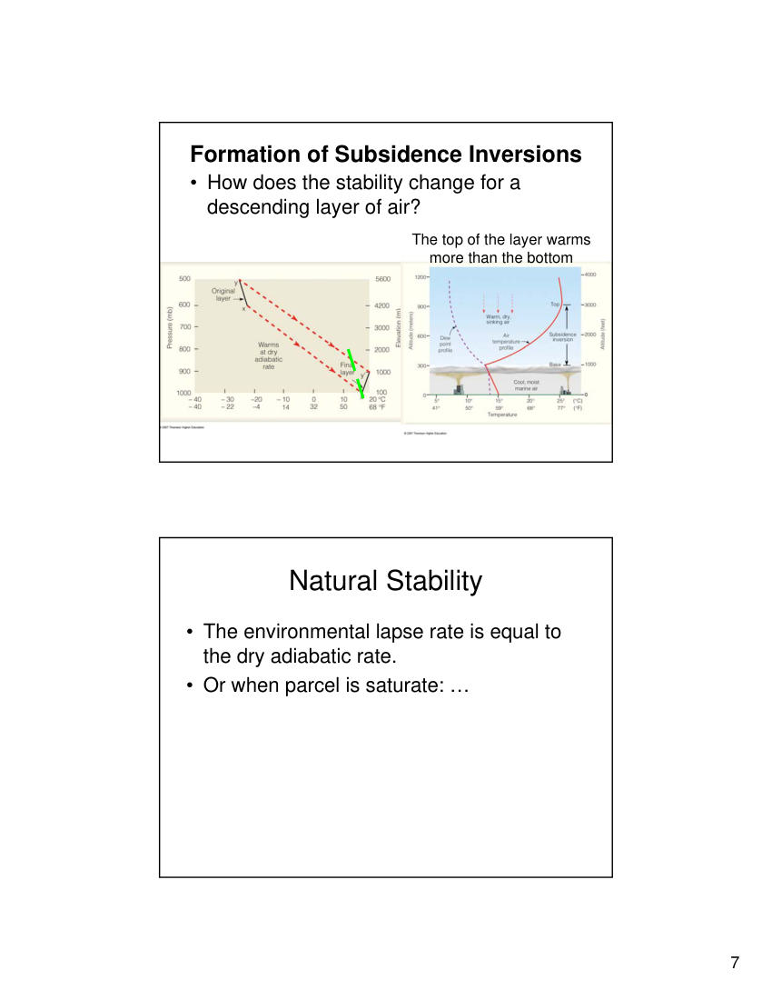

7
Formation of Subsidence Inversions
• How does the stability change for a 
descending layer of air?
The top of the layer warms 
more than the bottom
Natural Stability
• The environmental lapse rate is equal to 
the dry adiabatic rate.
• Or when parcel is saturate: …

## Page 8

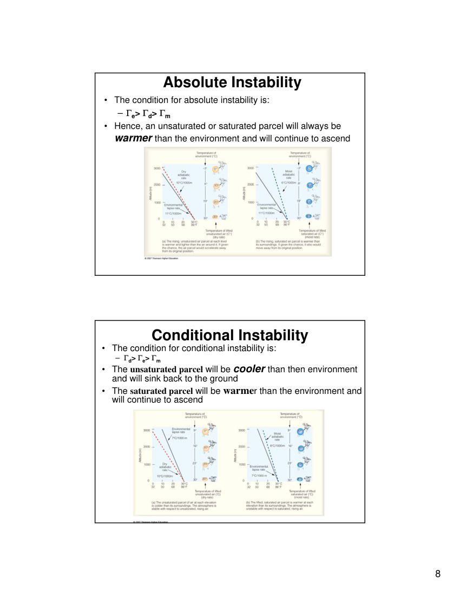

8
Absolute Instability
• The condition for absolute instability is:
– Γe> Γd> Γm
• Hence, an unsaturated or saturated parcel will always be 
warmer than the environment and will continue to ascend
Conditional Instability
• The condition for conditional instability is:
– Γd> Γe> Γm
• The unsaturated parcel will be cooler than then environment 
and will sink back to the ground
• The saturated parcel will be warmer than the environment and 
will continue to ascend

## Page 9

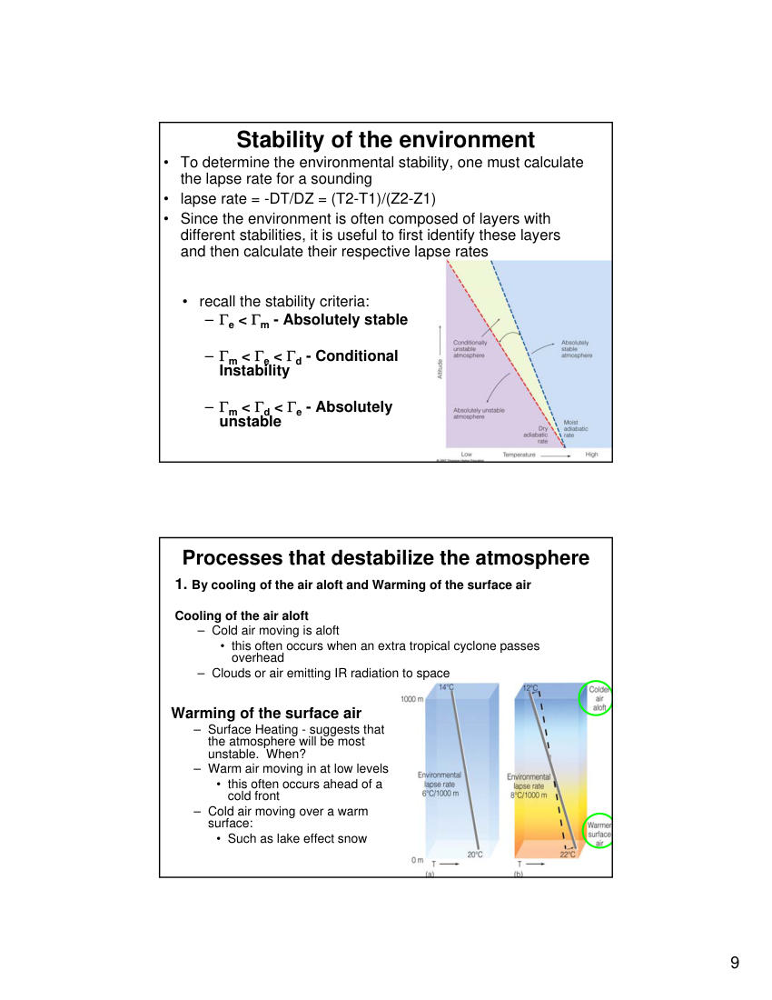

9
Stability of the environment
• To determine the environmental stability, one must calculate 
the lapse rate for a sounding 
• lapse rate = -DT/DZ = (T2-T1)/(Z2-Z1) 
• Since the environment is often composed of layers with 
different stabilities, it is useful to first identify these layers 
and then calculate their respective lapse rates 
• recall the stability criteria: 
– Γe < Γm - Absolutely stable
– Γm < Γe < Γd - Conditional 
Instability
– Γm < Γd < Γe - Absolutely 
unstable
Processes that destabilize the atmosphere
1. By cooling of the air aloft and Warming of the surface air
Cooling of the air aloft
– Cold air moving is aloft
• this often occurs when an extra tropical cyclone passes 
overhead
– Clouds or air emitting IR radiation to space 
Warming of the surface air
– Surface Heating - suggests that 
the atmosphere will be most 
unstable.  When?
– Warm air moving in at low levels
• this often occurs ahead of a 
cold front
– Cold air moving over a warm 
surface: 
• Such as lake effect snow

## Page 10

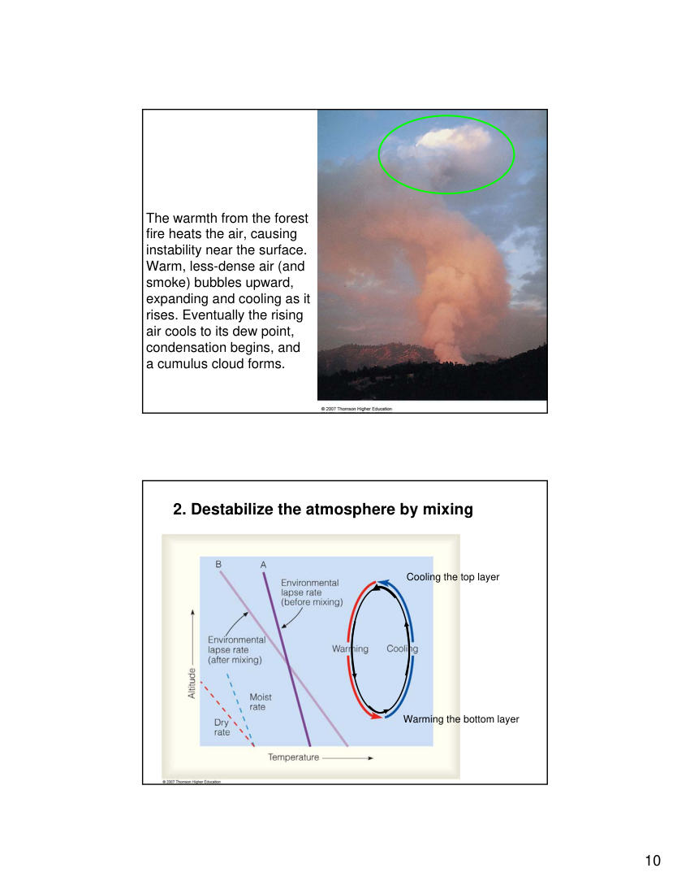

10
The warmth from the forest 
fire heats the air, causing 
instability near the surface. 
Warm, less-dense air (and 
smoke) bubbles upward, 
expanding and cooling as it 
rises. Eventually the rising 
air cools to its dew point, 
condensation begins, and 
a cumulus cloud forms.
2. Destabilize the atmosphere by mixing
Cooling the top layer
Warming the bottom layer

## Page 11

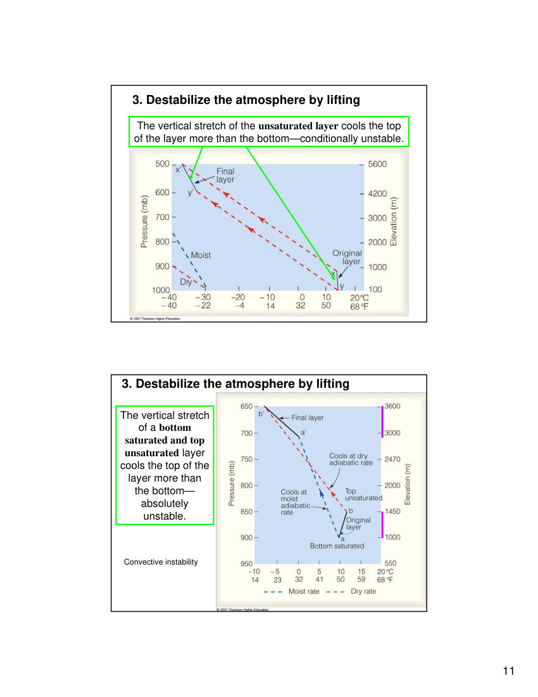

11
3. Destabilize the atmosphere by lifting
The vertical stretch of the unsaturated layer cools the top 
of the layer more than the bottom—conditionally unstable.
3. Destabilize the atmosphere by lifting
The vertical stretch 
of a bottom 
saturated and top 
unsaturated layer 
cools the top of the 
layer more than 
the bottom—
absolutely 
unstable.
Convective instability

## Page 12

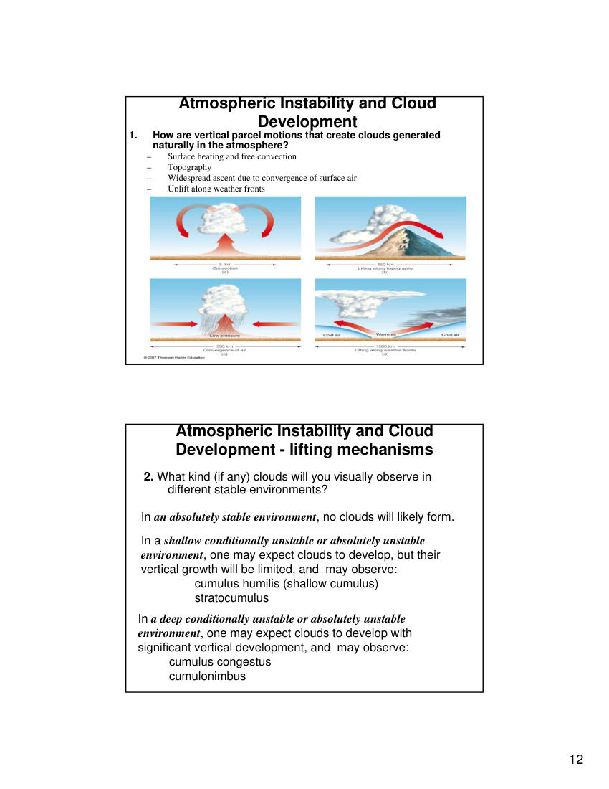

12
Atmospheric Instability and Cloud 
Development
1.
How are vertical parcel motions that create clouds generated 
naturally in the atmosphere?
–
Surface heating and free convection
–
Topography
–
Widespread ascent due to convergence of surface air
–
Uplift along weather fronts
Atmospheric Instability and Cloud 
Development - lifting mechanisms
2. What kind (if any) clouds will you visually observe in 
different stable environments?
In a shallow conditionally unstable or absolutely unstable 
environment, one may expect clouds to develop, but their 
vertical growth will be limited, and  may observe:
cumulus humilis (shallow cumulus)
stratocumulus
In an absolutely stable environment, no clouds will likely form. 
In a deep conditionally unstable or absolutely unstable 
environment, one may expect clouds to develop with 
significant vertical development, and  may observe: 
cumulus congestus
cumulonimbus

## Page 13

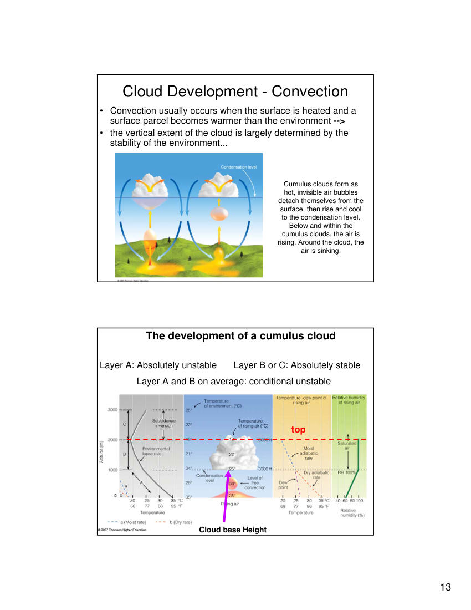

13
Cumulus clouds form as 
hot, invisible air bubbles 
detach themselves from the 
surface, then rise and cool 
to the condensation level. 
Below and within the 
cumulus clouds, the air is 
rising. Around the cloud, the 
air is sinking.
Cloud Development - Convection 
• Convection usually occurs when the surface is heated and a 
surface parcel becomes warmer than the environment -->
• the vertical extent of the cloud is largely determined by the 
stability of the environment... 
The development of a cumulus cloud
Cloud base Height
top
Layer B or C: Absolutely stable
Layer A: Absolutely unstable
Layer A and B on average: conditional unstable

## Page 14

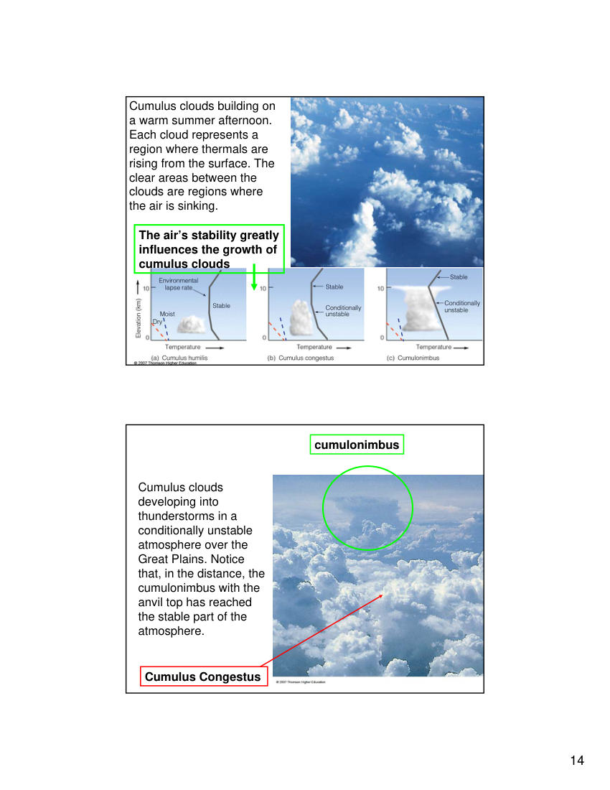

14
Cumulus clouds building on 
a warm summer afternoon. 
Each cloud represents a 
region where thermals are 
rising from the surface. The 
clear areas between the 
clouds are regions where 
the air is sinking.
The air’s stability greatly 
influences the growth of 
cumulus clouds
Cumulus clouds 
developing into 
thunderstorms in a 
conditionally unstable 
atmosphere over the 
Great Plains. Notice 
that, in the distance, the 
cumulonimbus with the 
anvil top has reached 
the stable part of the 
atmosphere.
cumulonimbus
Cumulus Congestus

## Page 15

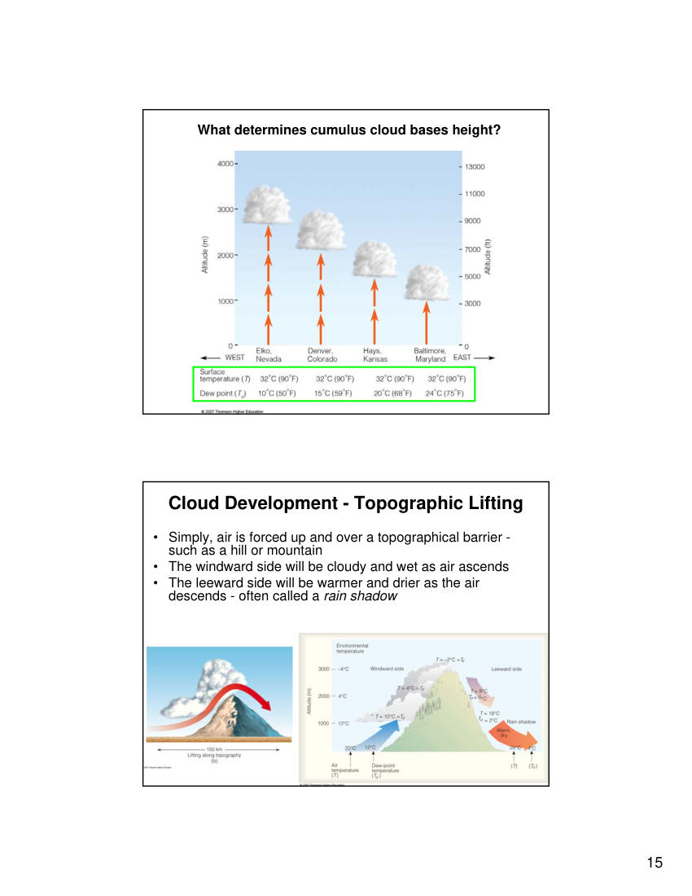

15
What determines cumulus cloud bases height?
• Simply, air is forced up and over a topographical barrier -
such as a hill or mountain
• The windward side will be cloudy and wet as air ascends
• The leeward side will be warmer and drier as the air 
descends - often called a rain shadow
Cloud Development - Topographic Lifting

## Page 16

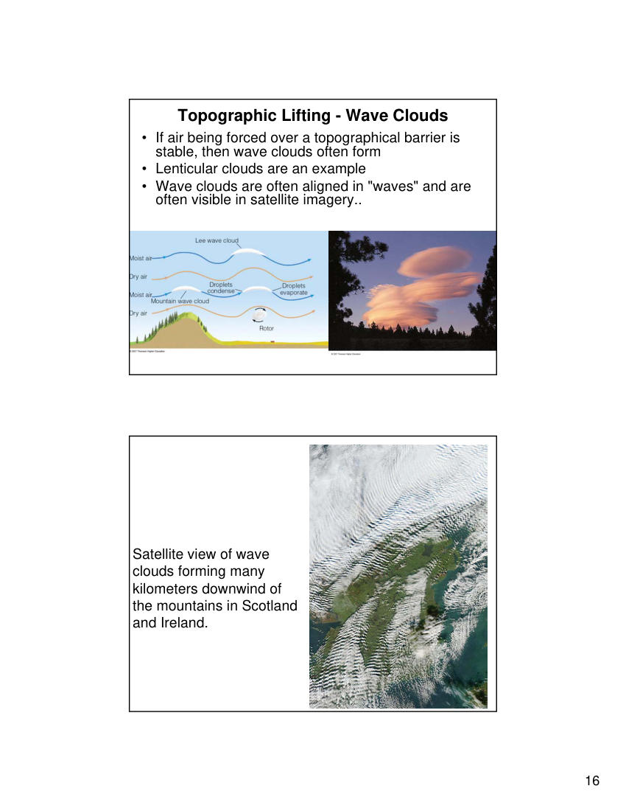

16
Topographic Lifting - Wave Clouds
• If air being forced over a topographical barrier is 
stable, then wave clouds often form
• Lenticular clouds are an example
• Wave clouds are often aligned in "waves" and are 
often visible in satellite imagery.. 
Satellite view of wave 
clouds forming many 
kilometers downwind of 
the mountains in Scotland 
and Ireland.

## Page 17

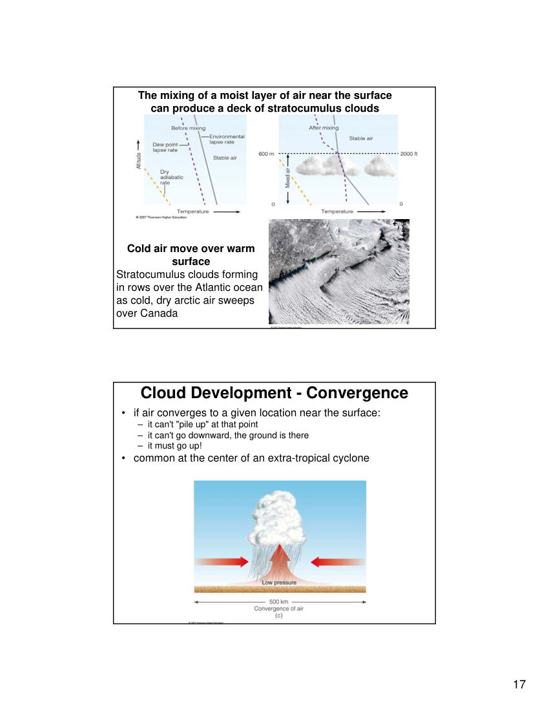

17
The mixing of a moist layer of air near the surface 
can produce a deck of stratocumulus clouds
Cold air move over warm 
surface
Stratocumulus clouds forming 
in rows over the Atlantic ocean 
as cold, dry arctic air sweeps 
over Canada
Cloud Development - Convergence
• if air converges to a given location near the surface:
– it can't "pile up" at that point
– it can't go downward, the ground is there
– it must go up!
• common at the center of an extra-tropical cyclone

## Page 18

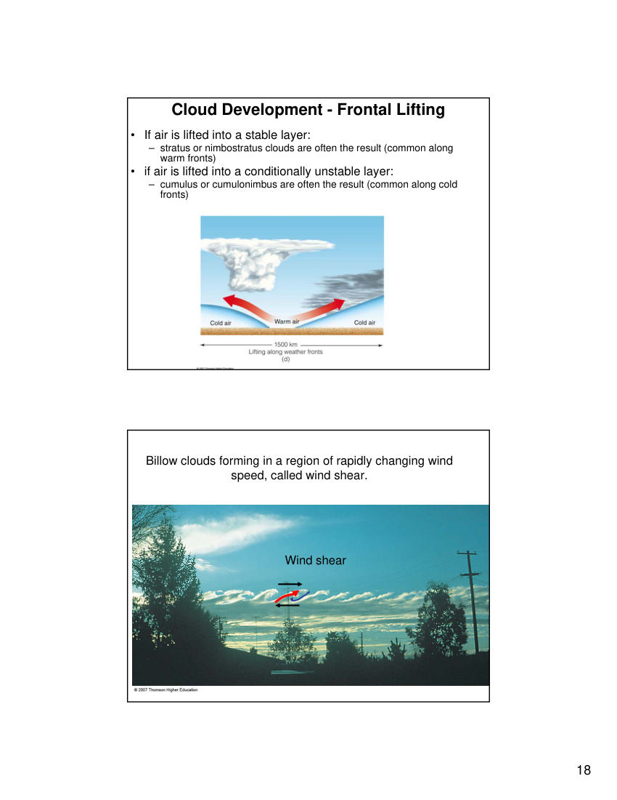

18
Cloud Development - Frontal Lifting
• If air is lifted into a stable layer:
– stratus or nimbostratus clouds are often the result (common along 
warm fronts)
• if air is lifted into a conditionally unstable layer:
– cumulus or cumulonimbus are often the result (common along cold 
fronts)
Billow clouds forming in a region of rapidly changing wind 
speed, called wind shear.
Wind shear
