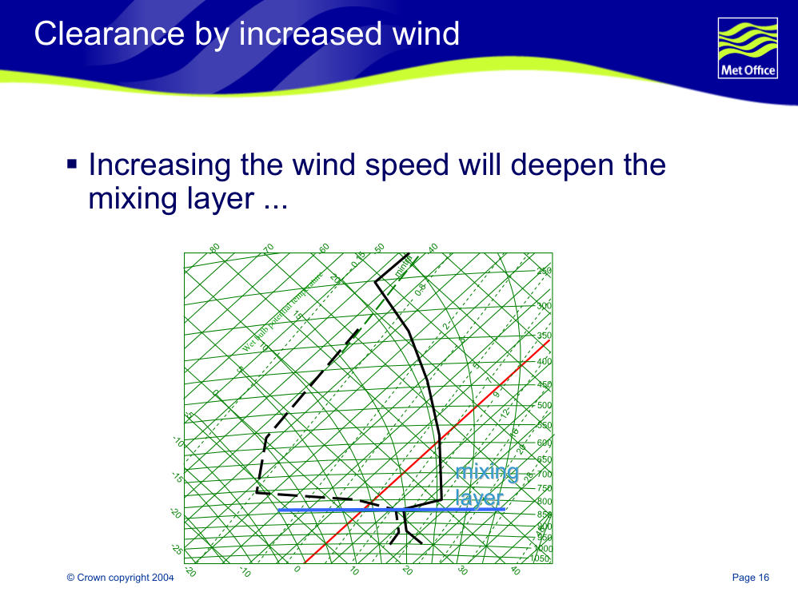
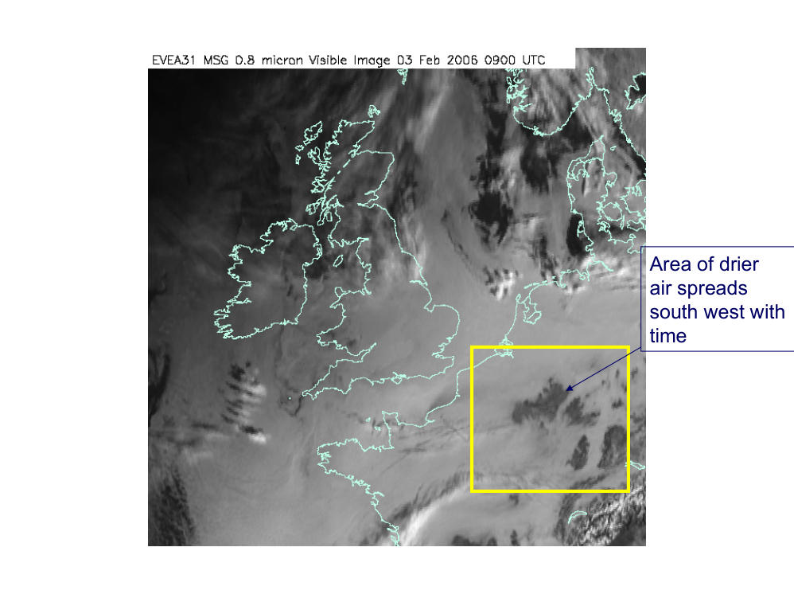
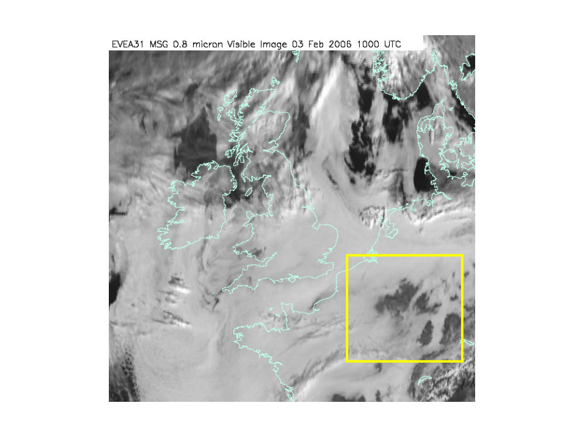
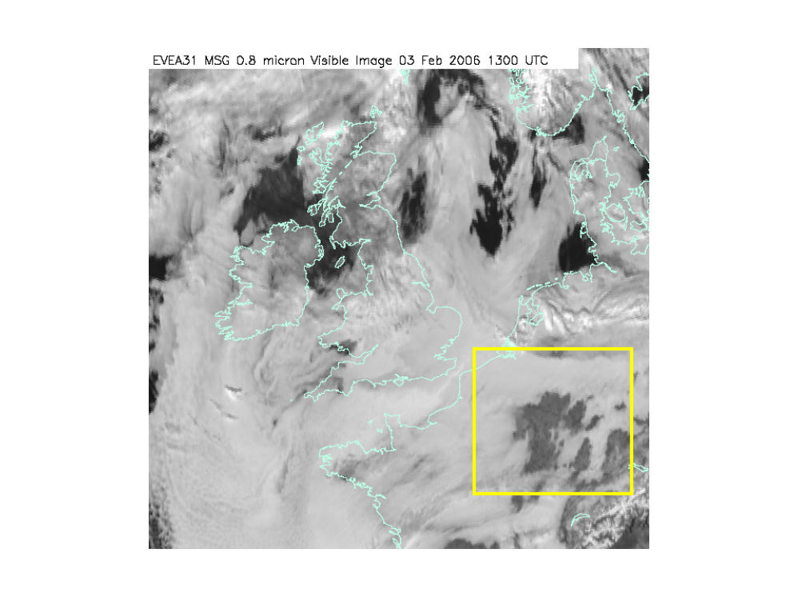
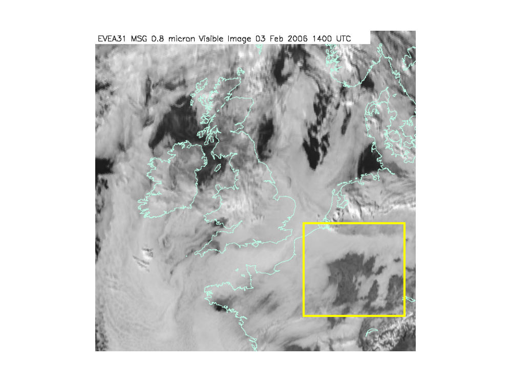

# Stratus Dissipation (Another Tutorial)

> Source: <https://www.weather.gov/media/zhu/ZHU_Training_Page/clouds/stratus_form_dissipate/stratus_dissipation_causes.pdf>  
> Section: Clouds/Precipitation  
> Captured: 2026-08-19 06:00 UTC  
> PDF: [stratus-dissipation-another-tutorial.pdf](stratus-dissipation-another-tutorial.pdf) (12 pages)

---

## Page 1

© Crown copyright 2004
Page 14
When will stratus clear?
Three mechanisms
ƒ Insolation
ƒ increased wind
ƒ advection of drier air

## Page 2

© Crown copyright 2004
Page 15
Clearance by insolation
0
10
850
1000
2
3
5
7
9
MCL
SALR
Mixing layer
Clearance temp
ƒ Draw a DALR from the 
stratus top to the surface 
pressure

## Page 3

© Crown copyright 2004
Page 16
Clearance by increased wind
ƒ Increasing the wind speed will deepen the 
mixing layer ...
-80
-70
-60
-50
-40
mintra
-20
-10
0
10
20
30
40
250
300
350
400
450
500
550
600
650
700
750
800
850
900
950
1000
1050
0.15
0.8
2
3
5
7
9
12
16
20
28
48
-25
-20
-15
-10
-5
0
5
10
15
20
Wet bulb potential temperature
mixing 
mixing 
layer
layer

## Page 4

© Crown copyright 2004
Page 17
Clearance by increased wind
ƒ … and can mix drier air from above into the 
cloudy layer which may disperse the stratus
-80
-70
-60
-50
-40
mintra
-20
-10
0
10
20
30
40
250
300
350
400
450
500
550
600
650
700
750
800
850
900
950
1000
1050
0.15
0.8
2
3
5
7
9
12
16
20
28
48
-25
-20
-15
-10
-5
0
5
10
15
20
Wet bulb potential temperature
mixing 
mixing 
layer
layer

## Page 5

© Crown copyright 2004
Page 18
Clearance by advection of drier air
ƒ drier air from another source may clear the 
stratus
ƒ use satellite pictures to observe rear edge of  
stratus
ƒ Example follows.

## Page 6

Area of drier 
air spreads 
south west with 
time

## Page 7

_(no extractable text on this page — see rendered image above)_

## Page 8

_(no extractable text on this page — see rendered image above)_

## Page 9

_(no extractable text on this page — see rendered image above)_

## Page 10

_(no extractable text on this page — see rendered image above)_

## Page 11

_(no extractable text on this page — see rendered image above)_

## Page 12

_(no extractable text on this page — see rendered image above)_
