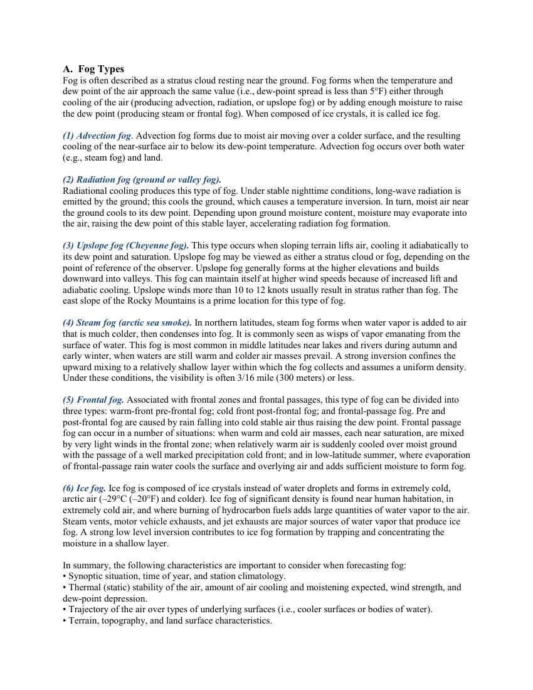
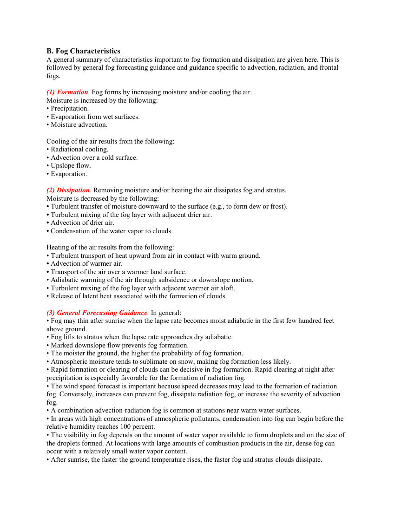
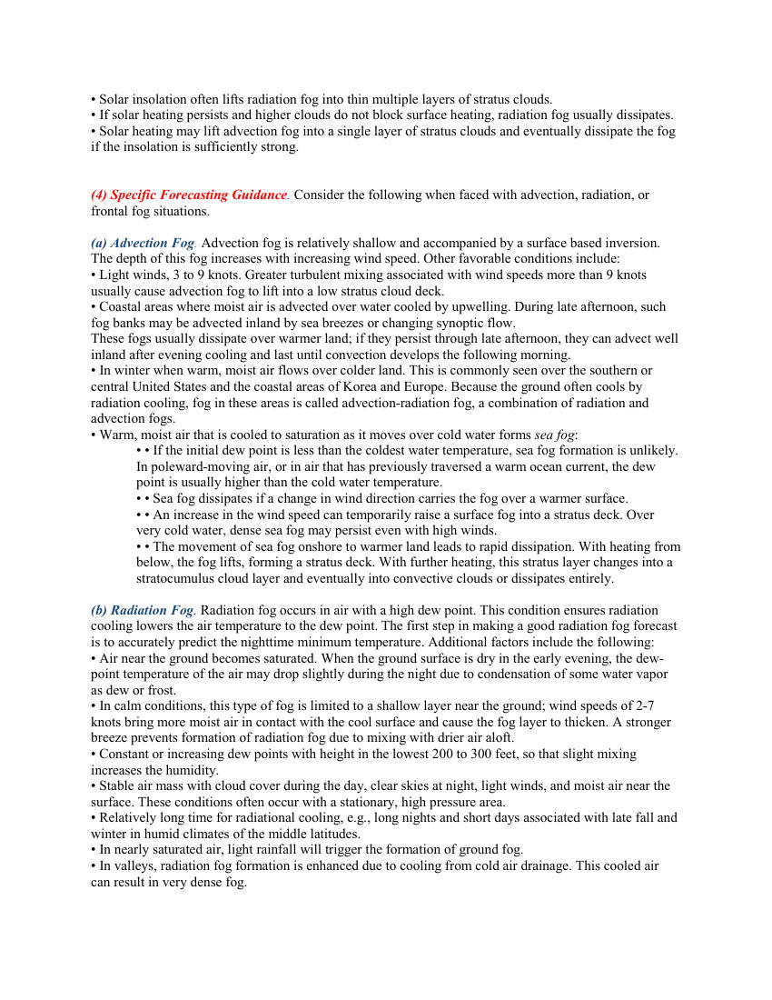
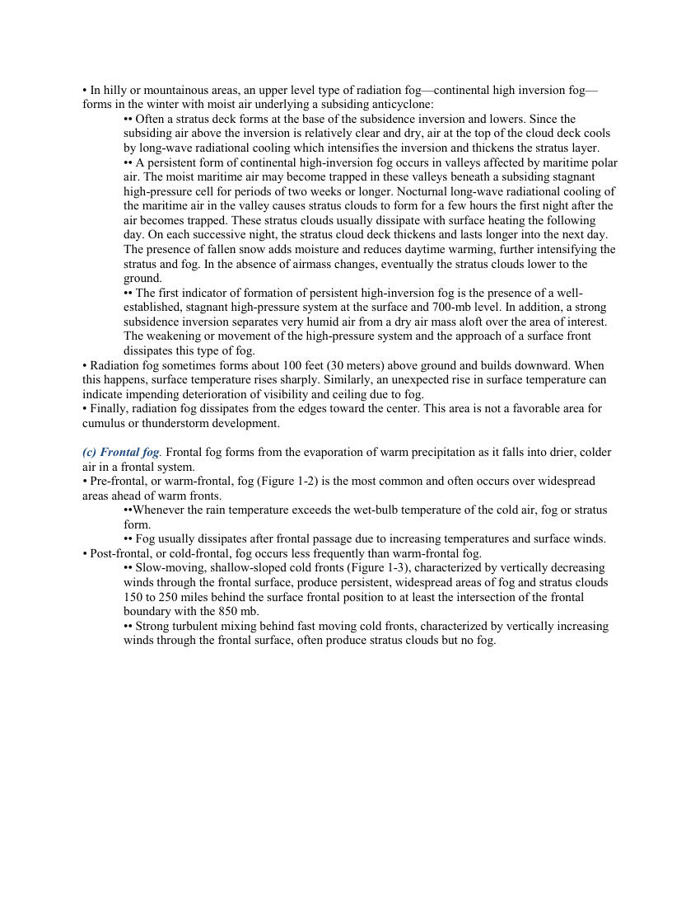
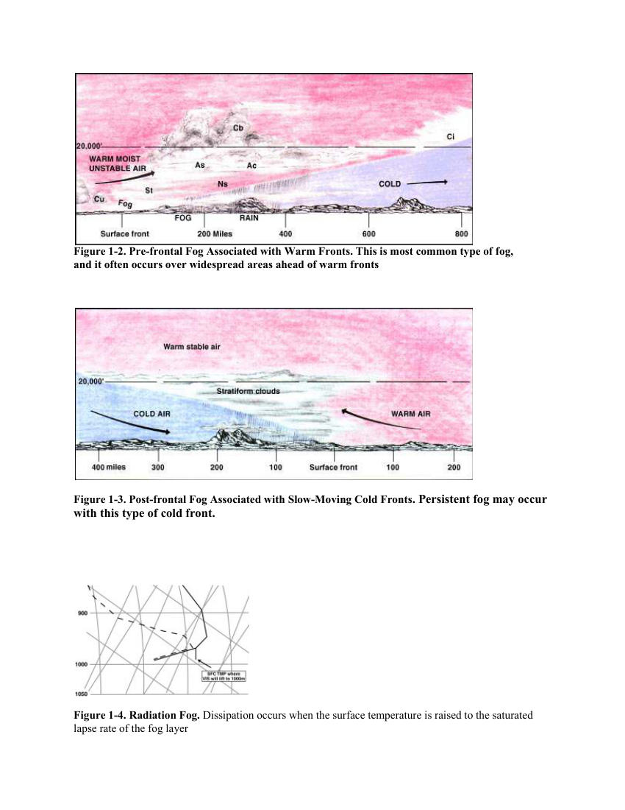
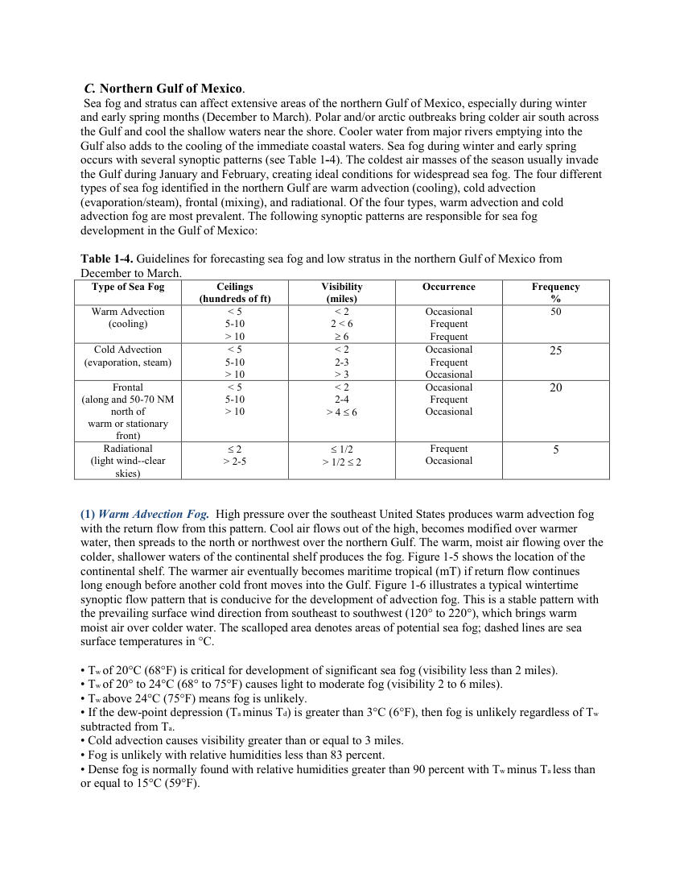
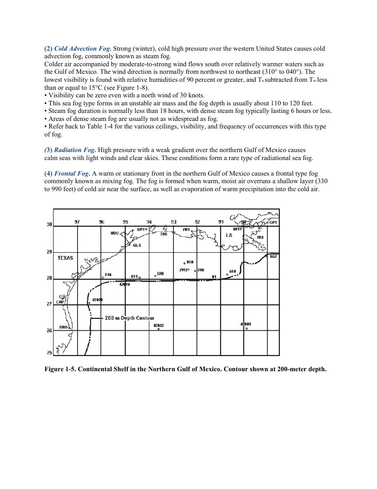
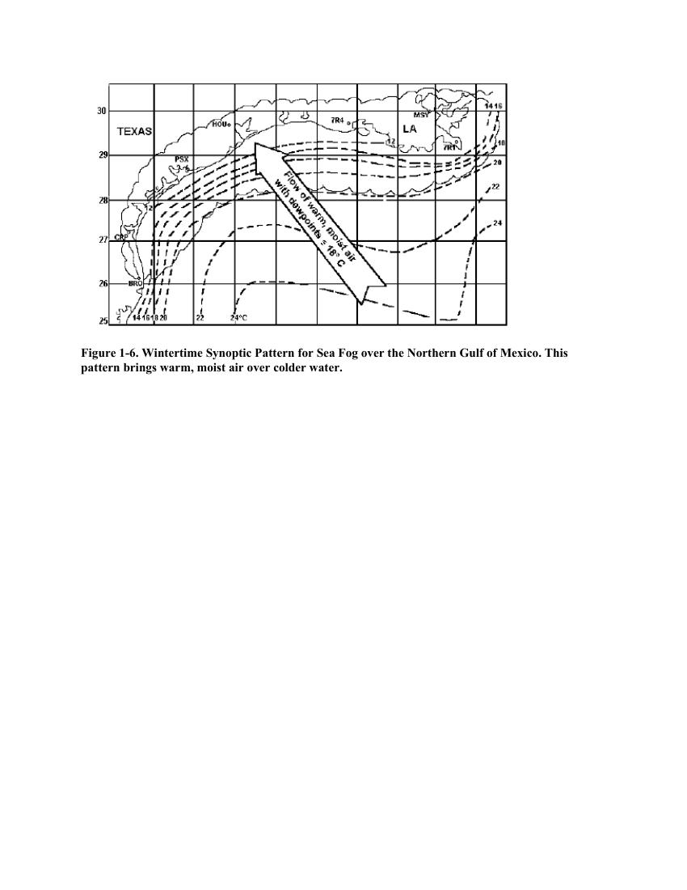

# Fog Types - Formation/Dissipation

> Source: <https://www.weather.gov/media/zhu/ZHU_Training_Page/fog_stuff/fog_guide/fog.pdf>  
> Section: Fog/Dew/Frost  
> Captured: 2026-08-19 06:00 UTC  
> PDF: [fog-types-formation-dissipation.pdf](fog-types-formation-dissipation.pdf) (8 pages)

---

## Page 1

A.  Fog Types 
Fog is often described as a stratus cloud resting near the ground. Fog forms when the temperature and 
dew point of the air approach the same value (i.e., dew-point spread is less than 5°F) either through 
cooling of the air (producing advection, radiation, or upslope fog) or by adding enough moisture to raise 
the dew point (producing steam or frontal fog). When composed of ice crystals, it is called ice fog. 
 
(1) Advection fog. Advection fog forms due to moist air moving over a colder surface, and the resulting 
cooling of the near-surface air to below its dew-point temperature. Advection fog occurs over both water 
(e.g., steam fog) and land. 
 
(2) Radiation fog (ground or valley fog). 
Radiational cooling produces this type of fog. Under stable nighttime conditions, long-wave radiation is 
emitted by the ground; this cools the ground, which causes a temperature inversion. In turn, moist air near 
the ground cools to its dew point. Depending upon ground moisture content, moisture may evaporate into 
the air, raising the dew point of this stable layer, accelerating radiation fog formation. 
 
(3) Upslope fog (Cheyenne fog). This type occurs when sloping terrain lifts air, cooling it adiabatically to 
its dew point and saturation. Upslope fog may be viewed as either a stratus cloud or fog, depending on the 
point of reference of the observer. Upslope fog generally forms at the higher elevations and builds 
downward into valleys. This fog can maintain itself at higher wind speeds because of increased lift and 
adiabatic cooling. Upslope winds more than 10 to 12 knots usually result in stratus rather than fog. The 
east slope of the Rocky Mountains is a prime location for this type of fog. 
 
(4) Steam fog (arctic sea smoke). In northern latitudes, steam fog forms when water vapor is added to air 
that is much colder, then condenses into fog. It is commonly seen as wisps of vapor emanating from the 
surface of water. This fog is most common in middle latitudes near lakes and rivers during autumn and 
early winter, when waters are still warm and colder air masses prevail. A strong inversion confines the 
upward mixing to a relatively shallow layer within which the fog collects and assumes a uniform density. 
Under these conditions, the visibility is often 3/16 mile (300 meters) or less. 
 
(5) Frontal fog. Associated with frontal zones and frontal passages, this type of fog can be divided into 
three types: warm-front pre-frontal fog; cold front post-frontal fog; and frontal-passage fog. Pre and 
post-frontal fog are caused by rain falling into cold stable air thus raising the dew point. Frontal passage 
fog can occur in a number of situations: when warm and cold air masses, each near saturation, are mixed 
by very light winds in the frontal zone; when relatively warm air is suddenly cooled over moist ground 
with the passage of a well marked precipitation cold front; and in low-latitude summer, where evaporation 
of frontal-passage rain water cools the surface and overlying air and adds sufficient moisture to form fog. 
 
(6) Ice fog. Ice fog is composed of ice crystals instead of water droplets and forms in extremely cold, 
arctic air (–29°C (–20°F) and colder). Ice fog of significant density is found near human habitation, in 
extremely cold air, and where burning of hydrocarbon fuels adds large quantities of water vapor to the air. 
Steam vents, motor vehicle exhausts, and jet exhausts are major sources of water vapor that produce ice 
fog. A strong low level inversion contributes to ice fog formation by trapping and concentrating the 
moisture in a shallow layer. 
 
In summary, the following characteristics are important to consider when forecasting fog: 
• Synoptic situation, time of year, and station climatology. 
• Thermal (static) stability of the air, amount of air cooling and moistening expected, wind strength, and 
dew-point depression.  
• Trajectory of the air over types of underlying surfaces (i.e., cooler surfaces or bodies of water). 
• Terrain, topography, and land surface characteristics.

## Page 2

B. Fog Characteristics 
A general summary of characteristics important to fog formation and dissipation are given here. This is 
followed by general fog forecasting guidance and guidance specific to advection, radiation, and frontal 
fogs.  
 
(1) Formation. Fog forms by increasing moisture and/or cooling the air.  
Moisture is increased by the following:  
• Precipitation. 
• Evaporation from wet surfaces. 
• Moisture advection. 
 
Cooling of the air results from the following: 
• Radiational cooling. 
• Advection over a cold surface. 
• Upslope flow. 
• Evaporation. 
 
(2) Dissipation. Removing moisture and/or heating the air dissipates fog and stratus.  
Moisture is decreased by the following: 
• Turbulent transfer of moisture downward to the surface (e.g., to form dew or frost). 
• Turbulent mixing of the fog layer with adjacent drier air. 
• Advection of drier air. 
• Condensation of the water vapor to clouds.  
 
Heating of the air results from the following: 
• Turbulent transport of heat upward from air in contact with warm ground. 
• Advection of warmer air. 
• Transport of the air over a warmer land surface. 
• Adiabatic warming of the air through subsidence or downslope motion. 
• Turbulent mixing of the fog layer with adjacent warmer air aloft. 
• Release of latent heat associated with the formation of clouds. 
 
(3) General Forecasting Guidance. In general: 
• Fog may thin after sunrise when the lapse rate becomes moist adiabatic in the first few hundred feet 
above ground. 
• Fog lifts to stratus when the lapse rate approaches dry adiabatic. 
• Marked downslope flow prevents fog formation. 
• The moister the ground, the higher the probability of fog formation. 
• Atmospheric moisture tends to sublimate on snow, making fog formation less likely. 
• Rapid formation or clearing of clouds can be decisive in fog formation. Rapid clearing at night after 
precipitation is especially favorable for the formation of radiation fog. 
• The wind speed forecast is important because speed decreases may lead to the formation of radiation 
fog. Conversely, increases can prevent fog, dissipate radiation fog, or increase the severity of advection 
fog. 
• A combination advection-radiation fog is common at stations near warm water surfaces. 
• In areas with high concentrations of atmospheric pollutants, condensation into fog can begin before the 
relative humidity reaches 100 percent. 
• The visibility in fog depends on the amount of water vapor available to form droplets and on the size of 
the droplets formed. At locations with large amounts of combustion products in the air, dense fog can 
occur with a relatively small water vapor content. 
• After sunrise, the faster the ground temperature rises, the faster fog and stratus clouds dissipate.

## Page 3

• Solar insolation often lifts radiation fog into thin multiple layers of stratus clouds. 
• If solar heating persists and higher clouds do not block surface heating, radiation fog usually dissipates.  
• Solar heating may lift advection fog into a single layer of stratus clouds and eventually dissipate the fog 
if the insolation is sufficiently strong. 
 
 
(4) Specific Forecasting Guidance. Consider the following when faced with advection, radiation, or 
frontal fog situations. 
 
(a) Advection Fog. Advection fog is relatively shallow and accompanied by a surface based inversion. 
The depth of this fog increases with increasing wind speed. Other favorable conditions include: 
• Light winds, 3 to 9 knots. Greater turbulent mixing associated with wind speeds more than 9 knots 
usually cause advection fog to lift into a low stratus cloud deck. 
• Coastal areas where moist air is advected over water cooled by upwelling. During late afternoon, such 
fog banks may be advected inland by sea breezes or changing synoptic flow. 
These fogs usually dissipate over warmer land; if they persist through late afternoon, they can advect well 
inland after evening cooling and last until convection develops the following morning. 
• In winter when warm, moist air flows over colder land. This is commonly seen over the southern or 
central United States and the coastal areas of Korea and Europe. Because the ground often cools by 
radiation cooling, fog in these areas is called advection-radiation fog, a combination of radiation and 
advection fogs. 
• Warm, moist air that is cooled to saturation as it moves over cold water forms sea fog: 
• • If the initial dew point is less than the coldest water temperature, sea fog formation is unlikely. 
In poleward-moving air, or in air that has previously traversed a warm ocean current, the dew 
point is usually higher than the cold water temperature. 
• • Sea fog dissipates if a change in wind direction carries the fog over a warmer surface. 
• • An increase in the wind speed can temporarily raise a surface fog into a stratus deck. Over 
very cold water, dense sea fog may persist even with high winds. 
• • The movement of sea fog onshore to warmer land leads to rapid dissipation. With heating from 
below, the fog lifts, forming a stratus deck. With further heating, this stratus layer changes into a 
stratocumulus cloud layer and eventually into convective clouds or dissipates entirely. 
 
(b) Radiation Fog. Radiation fog occurs in air with a high dew point. This condition ensures radiation 
cooling lowers the air temperature to the dew point. The first step in making a good radiation fog forecast 
is to accurately predict the nighttime minimum temperature. Additional factors include the following: 
• Air near the ground becomes saturated. When the ground surface is dry in the early evening, the dew-
point temperature of the air may drop slightly during the night due to condensation of some water vapor 
as dew or frost.  
• In calm conditions, this type of fog is limited to a shallow layer near the ground; wind speeds of 2-7 
knots bring more moist air in contact with the cool surface and cause the fog layer to thicken. A stronger 
breeze prevents formation of radiation fog due to mixing with drier air aloft. 
• Constant or increasing dew points with height in the lowest 200 to 300 feet, so that slight mixing 
increases the humidity. 
• Stable air mass with cloud cover during the day, clear skies at night, light winds, and moist air near the 
surface. These conditions often occur with a stationary, high pressure area. 
• Relatively long time for radiational cooling, e.g., long nights and short days associated with late fall and 
winter in humid climates of the middle latitudes.  
• In nearly saturated air, light rainfall will trigger the formation of ground fog. 
• In valleys, radiation fog formation is enhanced due to cooling from cold air drainage. This cooled air 
can result in very dense fog.

## Page 4

• In hilly or mountainous areas, an upper level type of radiation fog—continental high inversion fog—
forms in the winter with moist air underlying a subsiding anticyclone: 
•• Often a stratus deck forms at the base of the subsidence inversion and lowers. Since the 
subsiding air above the inversion is relatively clear and dry, air at the top of the cloud deck cools 
by long-wave radiational cooling which intensifies the inversion and thickens the stratus layer. 
•• A persistent form of continental high-inversion fog occurs in valleys affected by maritime polar 
air. The moist maritime air may become trapped in these valleys beneath a subsiding stagnant 
high-pressure cell for periods of two weeks or longer. Nocturnal long-wave radiational cooling of 
the maritime air in the valley causes stratus clouds to form for a few hours the first night after the 
air becomes trapped. These stratus clouds usually dissipate with surface heating the following 
day. On each successive night, the stratus cloud deck thickens and lasts longer into the next day. 
The presence of fallen snow adds moisture and reduces daytime warming, further intensifying the 
stratus and fog. In the absence of airmass changes, eventually the stratus clouds lower to the 
ground. 
•• The first indicator of formation of persistent high-inversion fog is the presence of a well-
established, stagnant high-pressure system at the surface and 700-mb level. In addition, a strong 
subsidence inversion separates very humid air from a dry air mass aloft over the area of interest. 
The weakening or movement of the high-pressure system and the approach of a surface front 
dissipates this type of fog. 
• Radiation fog sometimes forms about 100 feet (30 meters) above ground and builds downward. When 
this happens, surface temperature rises sharply. Similarly, an unexpected rise in surface temperature can 
indicate impending deterioration of visibility and ceiling due to fog.  
• Finally, radiation fog dissipates from the edges toward the center. This area is not a favorable area for 
cumulus or thunderstorm development. 
 
(c) Frontal fog. Frontal fog forms from the evaporation of warm precipitation as it falls into drier, colder 
air in a frontal system.  
• Pre-frontal, or warm-frontal, fog (Figure 1-2) is the most common and often occurs over widespread 
areas ahead of warm fronts. 
••Whenever the rain temperature exceeds the wet-bulb temperature of the cold air, fog or stratus 
form.  
•• Fog usually dissipates after frontal passage due to increasing temperatures and surface winds. 
• Post-frontal, or cold-frontal, fog occurs less frequently than warm-frontal fog. 
•• Slow-moving, shallow-sloped cold fronts (Figure 1-3), characterized by vertically decreasing 
winds through the frontal surface, produce persistent, widespread areas of fog and stratus clouds 
150 to 250 miles behind the surface frontal position to at least the intersection of the frontal 
boundary with the 850 mb.  
•• Strong turbulent mixing behind fast moving cold fronts, characterized by vertically increasing 
winds through the frontal surface, often produce stratus clouds but no fog.

## Page 5

Figure 1-2. Pre-frontal Fog Associated with Warm Fronts. This is most common type of fog, 
and it often occurs over widespread areas ahead of warm fronts 
 
 
Figure 1-3. Post-frontal Fog Associated with Slow-Moving Cold Fronts. Persistent fog may occur 
with this type of cold front. 
 
 
 
Figure 1-4. Radiation Fog. Dissipation occurs when the surface temperature is raised to the saturated 
lapse rate of the fog layer

## Page 6

C. Northern Gulf of Mexico. 
 Sea fog and stratus can affect extensive areas of the northern Gulf of Mexico, especially during winter 
and early spring months (December to March). Polar and/or arctic outbreaks bring colder air south across 
the Gulf and cool the shallow waters near the shore. Cooler water from major rivers emptying into the 
Gulf also adds to the cooling of the immediate coastal waters. Sea fog during winter and early spring 
occurs with several synoptic patterns (see Table 1-4). The coldest air masses of the season usually invade 
the Gulf during January and February, creating ideal conditions for widespread sea fog. The four different 
types of sea fog identified in the northern Gulf are warm advection (cooling), cold advection 
(evaporation/steam), frontal (mixing), and radiational. Of the four types, warm advection and cold 
advection fog are most prevalent. The following synoptic patterns are responsible for sea fog 
development in the Gulf of Mexico: 
 
Table 1-4. Guidelines for forecasting sea fog and low stratus in the northern Gulf of Mexico from 
December to March. 
Type of Sea Fog 
Ceilings 
(hundreds of ft) 
Visibility 
(miles)
Occurrence 
Frequency 
%
Warm Advection 
(cooling) 
< 5 
5-10 
> 10 
< 2 
2 < 6 
≥ 6 
Occasional 
Frequent 
Frequent 
50
Cold Advection 
(evaporation, steam) 
< 5 
5-10 
> 10 
< 2 
2-3 
> 3 
Occasional 
Frequent 
Occasional
25 
Frontal 
(along and 50-70 NM 
north of 
warm or stationary 
front)
< 5 
5-10 
> 10 
< 2 
2-4 
> 4 ≤ 6 
Occasional 
Frequent 
Occasional 
20 
Radiational 
(light wind--clear 
skies)
≤ 2 
> 2-5 
≤ 1/2 
> 1/2 ≤ 2 
Frequent 
Occasional 
5 
 
(1) Warm Advection Fog.  High pressure over the southeast United States produces warm advection fog 
with the return flow from this pattern. Cool air flows out of the high, becomes modified over warmer 
water, then spreads to the north or northwest over the northern Gulf. The warm, moist air flowing over the 
colder, shallower waters of the continental shelf produces the fog. Figure 1-5 shows the location of the 
continental shelf. The warmer air eventually becomes maritime tropical (mT) if return flow continues 
long enough before another cold front moves into the Gulf. Figure 1-6 illustrates a typical wintertime 
synoptic flow pattern that is conducive for the development of advection fog. This is a stable pattern with 
the prevailing surface wind direction from southeast to southwest (120° to 220°), which brings warm 
moist air over colder water. The scalloped area denotes areas of potential sea fog; dashed lines are sea 
surface temperatures in °C. 
 
• Tw of 20°C (68°F) is critical for development of significant sea fog (visibility less than 2 miles). 
• Tw of 20° to 24°C (68° to 75°F) causes light to moderate fog (visibility 2 to 6 miles). 
• Tw above 24°C (75°F) means fog is unlikely. 
• If the dew-point depression (Ta minus Td) is greater than 3°C (6°F), then fog is unlikely regardless of Tw 
subtracted from Ta.  
• Cold advection causes visibility greater than or equal to 3 miles. 
• Fog is unlikely with relative humidities less than 83 percent. 
• Dense fog is normally found with relative humidities greater than 90 percent with Tw minus Ta less than 
or equal to 15°C (59°F).

## Page 7

(2) Cold Advection Fog. Strong (winter), cold high pressure over the western United States causes cold 
advection fog, commonly known as steam fog. 
Colder air accompanied by moderate-to-strong wind flows south over relatively warmer waters such as 
the Gulf of Mexico. The wind direction is normally from northwest to northeast (310° to 040°). The 
lowest visibility is found with relative humidities of 90 percent or greater, and Ta subtracted from Tw less 
than or equal to 15°C (see Figure 1-8). 
• Visibility can be zero even with a north wind of 30 knots. 
• This sea fog type forms in an unstable air mass and the fog depth is usually about 110 to 120 feet. 
• Steam fog duration is normally less than 18 hours, with dense steam fog typically lasting 6 hours or less. 
• Areas of dense steam fog are usually not as widespread as fog. 
• Refer back to Table 1-4 for the various ceilings, visibility, and frequency of occurrences with this type 
of fog. 
 
(3) Radiation Fog. High pressure with a weak gradient over the northern Gulf of Mexico causes 
calm seas with light winds and clear skies. These conditions form a rare type of radiational sea fog. 
 
(4) Frontal Fog. A warm or stationary front in the northern Gulf of Mexico causes a frontal type fog 
commonly known as mixing fog. The fog is formed when warm, moist air overruns a shallow layer (330 
to 990 feet) of cold air near the surface, as well as evaporation of warm precipitation into the cold air. 
 
 
Figure 1-5. Continental Shelf in the Northern Gulf of Mexico. Contour shown at 200-meter depth.

## Page 8

Figure 1-6. Wintertime Synoptic Pattern for Sea Fog over the Northern Gulf of Mexico. This 
pattern brings warm, moist air over colder water.
