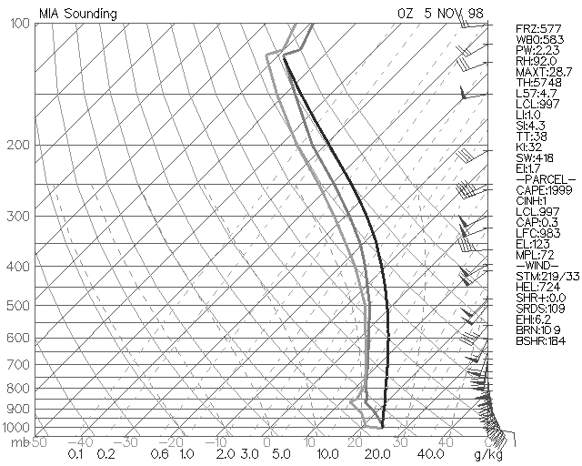

# Forecasting Dew/Frost

> Source: <http://www.weather.gov/source/zhu/ZHU_Training_Page/fog_stuff/Dew_Frost/Dew_Frost.htm>  
> Section: Fog/Dew/Frost  
> Captured: 2026-08-19 06:00 UTC  
> PDF: [forecasting-dew-frost.pdf](forecasting-dew-frost.pdf) · Original HTML: [source/original.html](source/original.html)

---

**Select a tutorial below or scroll down...**- **[The Forecasting of Dew](#DEW)**
- **[The Forecasting of Frost](#FROST)**
- **[Frost Point and Dew Point](#FROST3)**
- **[Dew/Frost Thickness Functions](#FROST2)**

**THE FORECASTING OF DEW**

**METEOROLOGIST JEFF HABY**
[theweatherprediction.com](https://theweatherprediction.com/)

Morning condensation (dew) is very common in some regions and can easily be forecasted. The favorable weather
elements for dew include clear skies, light wind, decent soil moisture, and low night-time dewpoint depressions.

Dew forms when the temperature becomes equal to the dewpoint. This often happens first at ground level for two
reasons. First, longwave emission causes the earth's surface to cool at night. Condensation requires the
temperature to decrease to the dewpoint. Second, the soil is often the moisture source for the dew. Warm and
moist soils will help with the formation of dew as the soil cools overnight.

The cooling
of warm and moist soil during the night will cause condensation especially on clear nights. Clear skies allow
for the maximum release of
longwave radiation to space. Cloudy skies will reflect and absorb while re-emitting longwave radiation back
to the surface and that prevents as much cooling from occurring. Light wind prevents the mixing of air right
at the surface with drier air aloft. Heavier dew will tend to occur when the wind is light as opposed to when
the wind is strong. Especially when
soils are moist, the moisture concentration will be higher near the earth's surface than higher above the earth's
surface. As the air with higher moisture concentration cools, this air will produce condensation first.

Soil
moisture is EXTREMELY critical to producing dew (especially heavy dew). Dry regions that have not received
rain in over a week or two are much less likely to have morning dew (especially a heavy dew). Once the soil
gets a good soaking from a rain, it takes several days for the soil to lose the moisture through evaporation.
If nights are clear after a good rain, dew can be expected every morning for the next few days (especially in
regions with abundant vegetation, clear skies and light wind). The dewpoint depression is important because it
determines how much the air will need to cool to reach saturation. With a large dewpoint depression (greater
than 25 units of F), quite a bit of night-time cooling will need to take place in order to produce dew. A low dewpoint
depression with the other factors favorable for dew is more likely to produce heavy dew.

Dew is important to
forecast since it impacts people. Dew can produce a thick film of water all over the car in the morning
(can be especially annoying for people that don't have a garage). Time has to be spent wiping the water
off the windows in order to see
on-coming traffic. Dew is also important to agriculture. Dew recharges the soil moisture and limits evaporation
from the soil during the time the dew is forming. Dew can make the mowing of the lawn more difficult. It is
much easier to mow the lawn in the late afternoon when the dew has evaporated than it is in the morning. Wet
grass clumps together and sticks to everything. Also, you are more prone to getting a dirty shoe when walking
on dew covered grass as compared to dry grass.

[**TOP**](forecasting-dew-frost.md#top)

**THE FORECASTING OF FROST**

**METEOROLOGIST JEFF HABY**
[theweatherprediction.com](https://theweatherprediction.com/)

When temperatures drop below freezing and the temperature reaches the dew or frost point, the ice on the ground
is termed frost or frozen dew. "Frost" can form in two ways: Either by deposition or freezing. Depositional frost
is also known as white frost or hoar frost. It occurs when the dewpoint (now called the frost point) is below
freezing. When this frost forms the water vapor goes directly to the solid state. Depositional frost covers the
vegetation, cars, etc. with ice crystal patterns (treelike branching pattern). If the depositional frost is thick
enough, it resembles a light snowfall.

Frost that forms due to the freezing of liquid water is best referred to
as frozen dew. Initially, both the dewpoint and temperature are above freezing when dew forms. Longwave radiational
cooling gradually lowers the temperature to at or below freezing during the night. Cold air advection can also do
the trick (e.g. Cold front moving through in the middle of the night after dew has formed). Once the temperature
falls to freezing, the condensed dew droplets freeze. Frozen dew looks different from white frost. Frozen dew does
not have the crystal patterns of white frost. White frost tends to looks whiter while frozen dew tends to look
slicker and more difficult to see.

Frost and frozen dew can delay people in the morning if it covers their car. Some
frosts or frozen dews
are much easier to scrape off the car than others. When the temperature is near freezing (29 to 32 F), the ice is
fairly easy to scrap off the car windows. It is also quicker to warm up the car windows to above freezing with
the defroster when temperatures are near freezing. The bonding of ice crystals is weaker in warm ice than in cold
ice. Once temperatures drop into the mid-20's and below, the ice becomes more difficult to remove. It requires
more "elbow grease" to remove the ice. It also takes longer to warm up the car windows to above freezing. At these
temperatures ice is well bonded. Next time you witness ice in the morning, think about the processes that produced
the frost or frozen dew.

---

**Q: Can frost occur at temperatures above 32°F?**

**A1:** No, frost is defined as a layer of ice that forms on surfaces that are at or below 32°F. Sometimes frost can occur on your lawn overnight, even though your thermometer may never have dropped to the freezing mark. This is because cold air on clear, calm nights sinks to ground level. Temperatures at the ground can be lower than the temperature only a few feet higher where your thermometer may be located.

Since official weather measurements are taken in an instrument shelter four to five feet above the ground, frost can form even when the official temperature is above freezing.

**A2:** The ground, or any surface, must be at or below 32 for frost to form.

However, if your thermometer was just a few feet above the ground, it may not have given an accurate reading for frost. A thermometer shows the temperature where the thermometer is located.

Because cool air sinks and the ground can quickly cool, the ground temperature on clear, still nights is invariably lower than the temperature only a few feet higher. This is especially common in the fall and winter when nights are long, which allows extra time for cooling. Thus, frost can form even when a thermometer gives a reading in the upper 30s.

Since official weather measurements are taken in an instrument shelter four to five feet above the ground, frost can form even when the official temperature is above freezing. (Related: measuring weather).

Additionally, frost will only form if the ground temperature matches the dew point. (Related: understanding humidity).

**A3:** Yes and no: It depends on how you define "ambient temperature", and, of course whether the temperature is below the frost point.

You see, when temperatures are officially recorded for hourly weather observations and climate reports, they are measured at a height of between 1.25 and 2 metres (4.1 and 6.6 ft) above the ground in special shelters, called Stevenson screens. (The shelter is named after the father of writer and poet Robert Louis Stevenson.) Meteorologists call this temperature the "surface temperature," and it is what is reported on the radio and TV (and internet and newspapers, reports, etc.).

The distinction is important for the following reason.

During clear and calm nights, the temperature at the ground or some surface near the ground can become much cooler than the "surface temperature". The radiation of heat away from the ground is the cause of this drop. The coldest air, therefore, forms near the ground, and being heavier than the air above it remains there.

If we were to make measurements of temperature from the surface to the height of the official "surface temperature" measurement every few centimetres or inches, we would find the air temperature increases as we move upward from the ground. Meteorologists call this a surface temperature inversion.

Since cold air is heavy air, in the absence of wind, the coldest air will remain nearest the ground, thus allowing surface temperatures to continue to fall. Thus, under such conditions -- clear and calm nights -- the ground temperature may fall below the freezing point while the temperature measured officially at was still above freezing. This is particularly common in the autumn and winter when nights are long allowing more time for cooling to occur.

Now frost is a covering of ice crystals on the surface produced by the depositing of water vapor to a surface cooler than 0° C (32° F). The deposition occurs when the temperature of the surface falls below the frost point. Similarly, dew forms when the air or surface temperature falls below the dew point temperature. (Note that the water vapor goes directly from gas to ice. Therefore, frost is not frozen dew.)

Thus, if the temperature on the ground or an object such as a bush or a car windshield near the ground falls below the frost point, frost crystals may form. But the measured "surface temperature" may still be above freezing.

This is the most common way in which frost may form when the official surface temperature is still above the freezing point.

**A4:** You also see frost on the rooftops of houses on nights when the temperature never goes below freezing.

Every warm object loses energy by radiating electromagnetic energy (e.g., infrared photons). If it receives an equal amount of energy from other objects, it is in radiative equilibrium; if it receives less from other objects, it loses energy and cools down.

Consider the view from the roof of your car or a house rooftop. If you were lying on this surface, you'd see the sky. The dark sky has an effective temperature of three degrees above absolute zero -- very cold! Your car is much, much warmer; so the roof of your car loses more energy than it gets, and it cools off.

On a cloudy night, the clouds are much warmer than the universe beyond it. If the temperature stays above freezing, the effect you describe generally occurs only on clear nights. Also, it doesn't happen to objects under trees, but only to objects under the open sky.

There are two other methods of heat transfer -- conduction and convection. It is radiative transfer, however, that is causes the effect you described.

-- added later:
I have to comment on the mention of wind in other answers. Wind actually reduces the formation of frost from radiative cooling. Consider the roof of the car as it loses energy to the clear sky. As the temperature of the roof goes down, the air adjacent to the roof also cools off. (The molecules in the air are bouncing off the roof, and always tending toward thermal equilibrium.) If the wind starts blowing, it will bring air from other locations and will displace the cool air just above the car.

One other thing I haven't mentioned is that the humidity has to be high; you need a high dew point so that as the car roof cools, moisture will condense on it (and eventually freeze as the roof continues to cool).

Something I implied above but didn't say explicitly is that when frost forms on the roof, the roof is below freezing. In other words, the sequence might be as follows:
1) Initially, the air and the car are at temperature 37 F, and the dew point is 35.
2) The car roof cools radiatively. As it cools below 35 degrees, water condenses on it.
3) The car roof continues to cool. As it cools below 32, the water on the roof freezes. This is what you see when you look at your car early in the morning.

[**TOP**](forecasting-dew-frost.md#top)

**FROST POINT AND DEW POINT**

**METEOROLOGIST JEFF HABY**
[theweatherprediction.com](https://theweatherprediction.com/)

The dew point is the temperature at which the air is saturated with respect to water vapor over a liquid surface.
When the temperature is equal to the dewpoint then the relative humidity is 100%. The common ways for the relative
humidity to be 100% is to 1) cool the air to the dewpoint, 2) evaporate moisture into the air until the
air is saturated, 3) lift the air until it adiabatically cools to the dew point.

The frost point is the temperature at which the air is saturated with respect to water vapor over an ice surface. It
is more difficult more water molecules to escape a frozen surface as compared to a liquid surface since an ice
has a stronger bonding between neighboring water molecules. Because of this, the frost point is greater in temperature than the dew point. This fact is important to precipitation growth in clouds. Since the vapor pressure is less over an ice surface as compared to a supercooled liquid surface at the same temperature, when the relative humidity is 100% with respect to water vapor the relative humidity over the ice surface will be greater than 100%. Thus, precipitation growth is favored on the ice particles.

The frost point is between the temperature and dewpoint. Knowing this is important when examining Skew-T soundings in a subfreezing layer. Examine the sounding below. Notice the temperature and dewpoint traces gradually diverge
from each other with height even though the entire troposphere is saturated. Soundings assume there is no ice
present (only supercooled water). One reason the lines diverge is because the sounding is only showing the dewpoint. If the frost point trace was drawn, the temperature would be closer to the frost point than it is to the dewpoint in the middle and upper troposphere where subfreezing temperature occur. At 0 C, the dew point is equal to the frost point and this can be seen on the sounding by noticing the temperature is equal to the dew point in the saturated air where the sounding temperature is 0 C.

[**TOP**](forecasting-dew-frost.md#top)

**DEW / FROST THICKNESS FUNCTIONS**

**METEOROLOGIST JEFF HABY**
[theweatherprediction.com](https://theweatherprediction.com/)

Why is dew or frost thicker on some surfaces than others? Dew or frost will first form on substances that are
either (1) the coolest or (2) the most moist. Objects can be cooler for two reasons: (1) the object is well
exposed to the surrounding air (2) The object is efficient at radiating heat away.

Two surfaces that are good
at collecting dew or frost are vegetation and metal. Vegetation has moisture evapotranspiring from its surface.
This causes the dewpoint to be higher over vegetated surfaces and thus dew or frost will form on them first.
Metal is very efficient at emitting radiation. Since a car is well exposed to the cooling of the air and the
metal effectively radiates energy, metal surfaces are a prime spot for dew or frost to form. A surface dew or
frost does NOT form on well is concrete. One reason is because the concrete is not well exposed to the air like
grass blades or metal objects. Just as importantly, the concrete retains some of its heat gained during the day.
As nighttime cooling occurs, the soil in many cases is warmer than the surrounding air. The warmer surface
prevents dew or frost from forming on concrete first. The concrete also does not evapotranspire like vegetation.
Therefore, both the combination of having less moisture and retaining warmth from the earth's surface causes dew
and frost to have a difficult time forming on concrete. Next time there is a dew or frost, observe which objects
have a thick coating, which objects have a light coating, and which objects have no coating of dew or frost,
then think of the physical processes which caused the dew or frost to be thick on some surfaces but not on others.

[**TOP**](forecasting-dew-frost.md#top)
