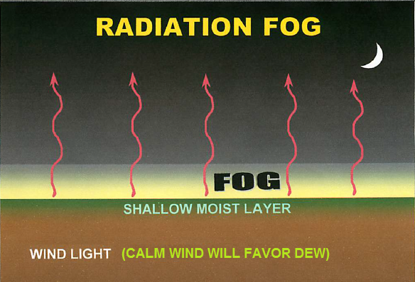
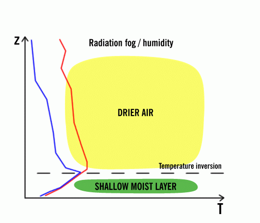
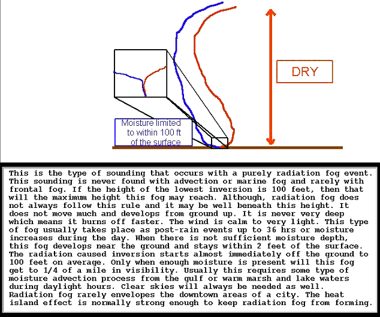
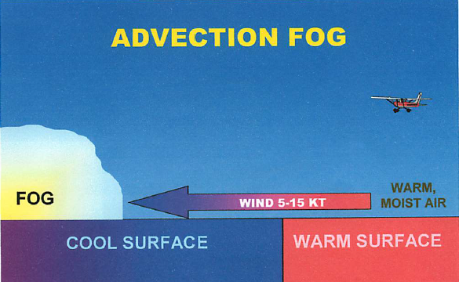
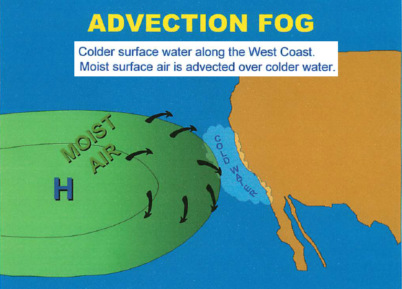
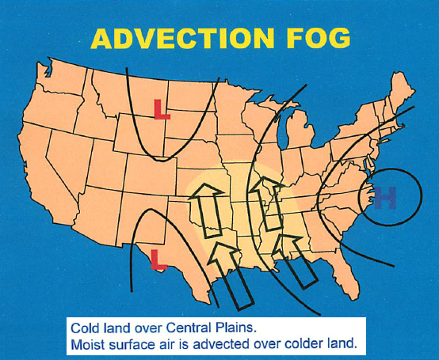
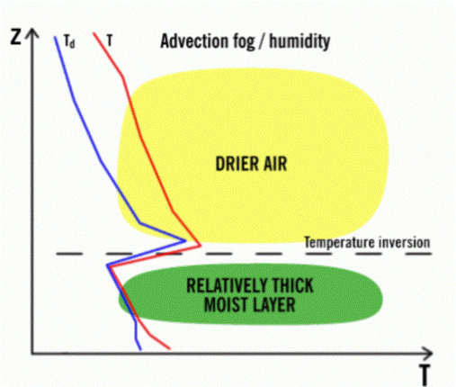
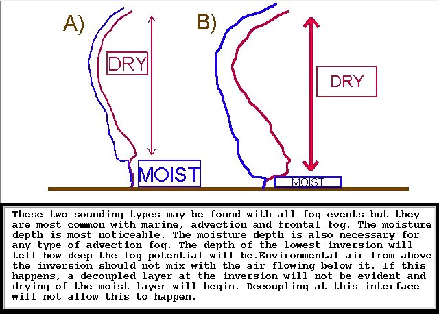

# More In Depth - Radiation/Advection Fog

> Source: <http://www.weather.gov/source/zhu/ZHU_Training_Page/fog_stuff/forecasting_fog/RADIATION_ADVECTION_FOG.html>  
> Section: Fog/Dew/Frost  
> Captured: 2026-08-19 06:00 UTC  
> PDF: [more-in-depth-radiation-advection-fog.pdf](more-in-depth-radiation-advection-fog.pdf) · Original HTML: [source/original.html](source/original.html)

---

**Select a tutorial below or scroll down...**- **[Radiation Fog](#RADIATION)**
- **[Advection Fog](#ADVECTION)**

**RADIATION FOG INGREDIENTS**

**METEOROLOGIST JEFF HABY**
[theweatherprediction.com](https://theweatherprediction.com/)

The prime time ingredients for radiation fog are saturated soil, light wind, initially clear skies, and a low afternoon
dewpoint depression. The more factors that are present, the more likely the fog will be. Saturated soils continuously
evaporate moisture into the air, insuring the dewpoint depression (difference between temperature and dewpoint) will
remain low. Light wind reduces the amount of mixing of air in the PBL. If winds are light, moisture evaporating from
the surface will remain near the surface and not mix with drier air aloft. If wind is calm, expect fog to be very
close to the ground or non-existent. In a calm situation with a low dewpoint depression and moist soils, expect a
thick dew or frost instead of radiation fog.

Clear skies allow the maximum amount of longwave radiation to leave the earth. The absence of
clouds will prevent any of the radiation from being trapped between the cloud and the ground. The more temperatures
cool, the quicker the temperature will reach the dewpoint. A low dewpoint depression can occur by adding moisture
to the air while at the same time cooling the air. The best way to rapidly decrease the dewpoint depression is for
it to rain. An afternoon rain increases the likelihood of overnight fog dramatically. The afternoon rain saturates
the soil and reduces the afternoon dewpoint depression. If skies begin to clear at night and winds are from 5
and 10 miles per hour after rain occurred the preceding day, fog is extremely likely. Other processes can produce
fog such as upslope flow and contact cooling.

Radiation fog will dissipate from daytime heating. This is due to surface air warming by conduction and becoming unsaturated. Radiation fog usually dissipates by mid-morning.

[**TOP**](more-in-depth-radiation-advection-fog.md#top)

**FORECAST ADVECTION FOG**

**METEOROLOGIST JEFF HABY**
[theweatherprediction.com](https://theweatherprediction.com/)

Advection fog is fog produced when air that is warmer and more moist than the ground surface moves
over the ground surface. The term advection means a horizontal movement of air. Unlike radiation fog,
advection fog can occur even when it is windy. Also unlike radiation fog, advection fog can occur
when the skies aloft are initially cloudy.

The setup for advection fog will often include an advection pattern bringing in warmer and more moist
air from the south. The set-up for the ground surface will be a snow covered ground or a saturated ground
that has been chilled by cold temperatures before the winds shift back from a southerly type direction.

Since the ground surface is very cold it will influence the temperature of the air adjacent to the
ground surface. This air will be chilled more than it otherwise would be due to the very cold
surface ground temperature. If there is snow or moisture on the ground then the air will be
cold and moist. When winds shift to the south it will bring in warmer air. This warmer
air will be cooled due to the influence of the cold land surface. As air cools the temperature
drops closer to the dewpoint. If the mixing of the warmer air with the colder air produces a
relative humidity of 100% then fog can form.

Considering air that is saturated, as the temperature increases the amount of moisture in the air
increases at an increasing rate. Warm air that is near saturation will saturate quickly when it
is mixed with cold saturated air. This is because the amount of moisture in the air from mixing
the air is greater than the amount of moisture needed for saturation at the temperature of the
mixed air. The air, instead of supersaturating, will produce condensation in the form of fog.

For example, suppose air that has a temperature and dewpoint of 0 C is mixed with air that
has a temperature and dewpoint of 20 C. The temperature of mixing this air if it is mixed
in equal proportions is 10 C. A saturation vapor pressure at 10 C is 12.3 mb. The air
with a temperature of 0 C has a saturation vapor pressure of 6.1 mb and the air
with a temperature of 20 C has a saturation vapor pressure of 23.4 mb. When this
air is mixed the new saturation vapor pressure is (6.1 + 23.4) /2 = 14.8 mb. Since
14.8 is the amount of moisture in the air after mixing and mixed air at 10 C only needs
12.3 mb to be saturated, the air is supersaturated. Instead of the Relative Humidity increasing
above 100% though, condensation and fog will form.

Advection fog will likely dissipate when the colder surface warms or when increasing turbulent mixing (i.e., winds increasing above 15 knots) lifts fog into a low cloud deck.
**NOTE:** When surface winds cease or
change direction, fog often continues, but simply stops moving.

[**TOP**](more-in-depth-radiation-advection-fog.md#top)
