# Research Paper - Formation of Fog due to Stratus Lowering

> Source: <https://rmets.onlinelibrary.wiley.com/doi/epdf/10.1002/qj.4304>  
> Section: Fog/Dew/Frost  
> Captured: 2026-08-19 06:00 UTC  
> PDF: [research-paper-formation-of-fog-due-to-stratus-lowering.pdf](research-paper-formation-of-fog-due-to-stratus-lowering.pdf) (27 pages)

---

## Page 1

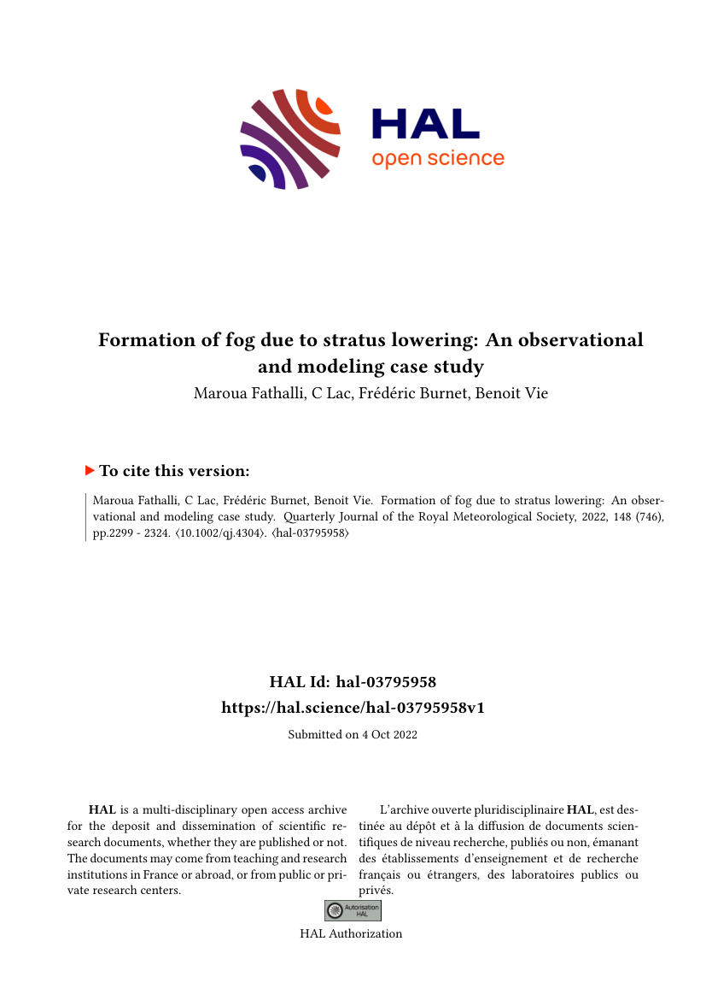

HAL Id: hal-03795958
https://hal.science/hal-03795958v1
Submitted on 4 Oct 2022
HAL is a multi-disciplinary open access archive
for the deposit and dissemination of scientific re-
search documents, whether they are published or not.
The documents may come from teaching and research
institutions in France or abroad, or from public or pri-
vate research centers.
L’archive ouverte pluridisciplinaire HAL, est des-
tinée au dépôt et à la diffusion de documents scien-
tifiques de niveau recherche, publiés ou non, émanant
des établissements d’enseignement et de recherche
français ou étrangers, des laboratoires publics ou
privés.
HAL Authorization
Formation of fog due to stratus lowering: An observational
and modeling case study
Maroua Fathalli, C Lac, Frédéric Burnet, Benoit Vie
To cite this version:
Maroua Fathalli, C Lac, Frédéric Burnet, Benoit Vie. Formation of fog due to stratus lowering: An obser-
vational and modeling case study. Quarterly Journal of the Royal Meteorological Society, 2022, 148 (746),
pp.2299 - 2324. ⟨10.1002/qj.4304⟩. ⟨hal-03795958⟩

## Page 2

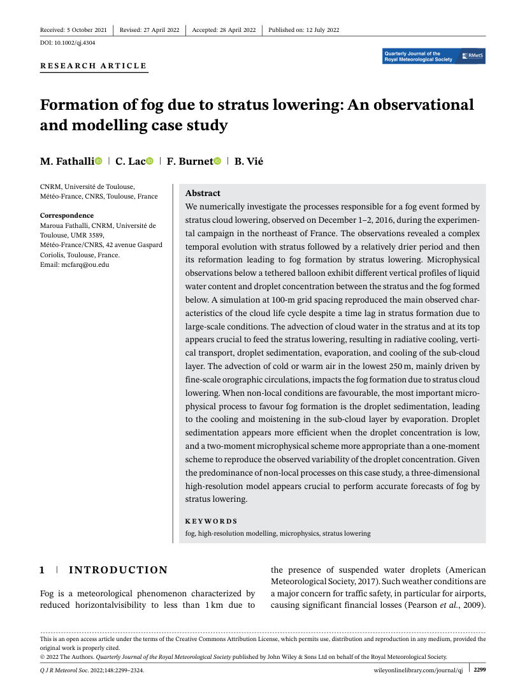

Received: 5 October 2021
Revised: 27 April 2022
Accepted: 28 April 2022
Published on: 12 July 2022
DOI: 10.1002/qj.4304
R E S E A R C H A R T I C L E
Formation of fog due to stratus lowering: An observational
and modelling case study
M. Fathalli
C. Lac
F. Burnet
B. Vié
CNRM, Université de Toulouse,
Météo-France, CNRS, Toulouse, France
Correspondence
Maroua Fathalli, CNRM, Université de
Toulouse, UMR 3589,
Météo-France/CNRS, 42 avenue Gaspard
Coriolis, Toulouse, France.
Email: mcfarq@ou.edu
Abstract
We numerically investigate the processes responsible for a fog event formed by
stratus cloud lowering, observed on December 1–2, 2016, during the experimen-
tal campaign in the northeast of France. The observations revealed a complex
temporal evolution with stratus followed by a relatively drier period and then
its reformation leading to fog formation by stratus lowering. Microphysical
observations below a tethered balloon exhibit different vertical profiles of liquid
water content and droplet concentration between the stratus and the fog formed
below. A simulation at 100-m grid spacing reproduced the main observed char-
acteristics of the cloud life cycle despite a time lag in stratus formation due to
large-scale conditions. The advection of cloud water in the stratus and at its top
appears crucial to feed the stratus lowering, resulting in radiative cooling, verti-
cal transport, droplet sedimentation, evaporation, and cooling of the sub-cloud
layer. The advection of cold or warm air in the lowest 250 m, mainly driven by
fine-scale orographic circulations, impacts the fog formation due to stratus cloud
lowering. When non-local conditions are favourable, the most important micro-
physical process to favour fog formation is the droplet sedimentation, leading
to the cooling and moistening in the sub-cloud layer by evaporation. Droplet
sedimentation appears more efficient when the droplet concentration is low,
and a two-moment microphysical scheme more appropriate than a one-moment
scheme to reproduce the observed variability of the droplet concentration. Given
the predominance of non-local processes on this case study, a three-dimensional
high-resolution model appears crucial to perform accurate forecasts of fog by
stratus lowering.
K E Y W O R D S
fog, high-resolution modelling, microphysics, stratus lowering
1
INTRODUCTION
Fog is a meteorological phenomenon characterized by
reduced horizontalvisibility to less than 1 km due to
the presence of suspended water droplets (American
Meteorological Society, 2017). Such weather conditions are
a major concern for traffic safety, in particular for airports,
causing significant financial losses (Pearson et al., 2009).
This is an open access article under the terms of the Creative Commons Attribution License, which permits use, distribution and reproduction in any medium, provided the
original work is properly cited.
© 2022 The Authors. Quarterly Journal of the Royal Meteorological Society published by John Wiley & Sons Ltd on behalf of the Royal Meteorological Society.
Q J R Meteorol Soc. 2022;148:2299–2324.
wileyonlinelibrary.com/journal/qj
2299

## Page 3

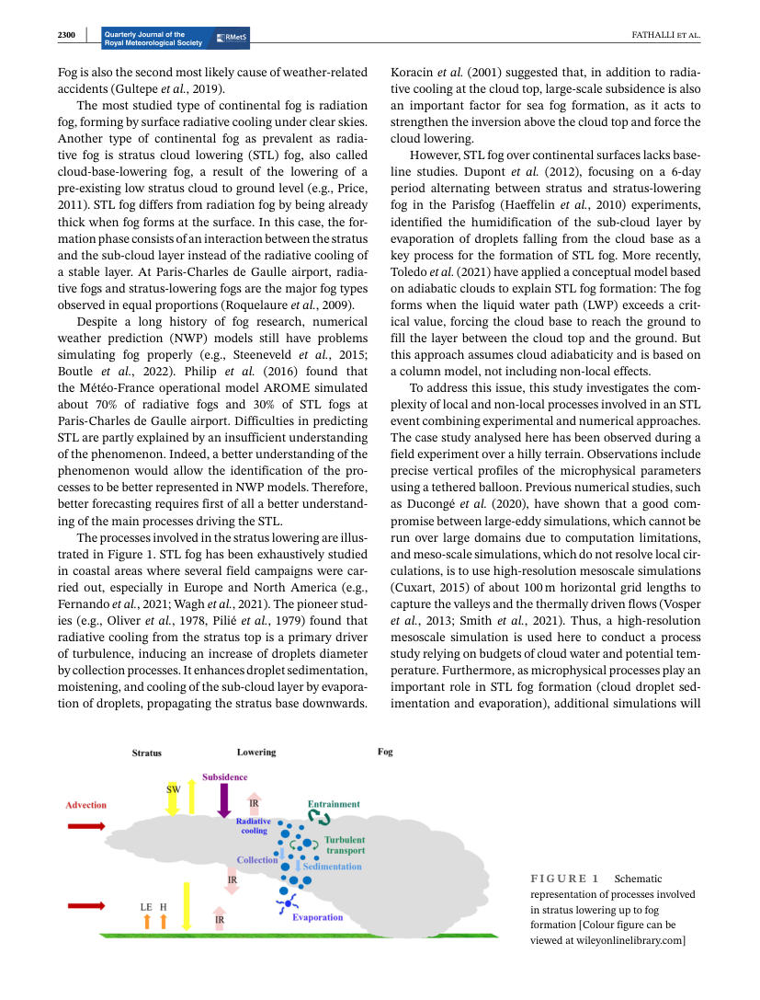

2300
FATHALLI et al.
Fog is also the second most likely cause of weather-related
accidents (Gultepe et al., 2019).
The most studied type of continental fog is radiation
fog, forming by surface radiative cooling under clear skies.
Another type of continental fog as prevalent as radia-
tive fog is stratus cloud lowering (STL) fog, also called
cloud-base-lowering fog, a result of the lowering of a
pre-existing low stratus cloud to ground level (e.g., Price,
2011). STL fog differs from radiation fog by being already
thick when fog forms at the surface. In this case, the for-
mation phase consists of an interaction between the stratus
and the sub-cloud layer instead of the radiative cooling of
a stable layer. At Paris-Charles de Gaulle airport, radia-
tive fogs and stratus-lowering fogs are the major fog types
observed in equal proportions (Roquelaure et al., 2009).
Despite a long history of fog research, numerical
weather prediction (NWP) models still have problems
simulating fog properly (e.g., Steeneveld et al., 2015;
Boutle et al., 2022). Philip et al. (2016) found that
the Météo-France operational model AROME simulated
about 70% of radiative fogs and 30% of STL fogs at
Paris-Charles de Gaulle airport. Difficulties in predicting
STL are partly explained by an insufficient understanding
of the phenomenon. Indeed, a better understanding of the
phenomenon would allow the identification of the pro-
cesses to be better represented in NWP models. Therefore,
better forecasting requires first of all a better understand-
ing of the main processes driving the STL.
The processes involved in the stratus lowering are illus-
trated in Figure 1. STL fog has been exhaustively studied
in coastal areas where several field campaigns were car-
ried out, especially in Europe and North America (e.g.,
Fernando et al., 2021; Wagh et al., 2021). The pioneer stud-
ies (e.g., Oliver et al., 1978, Pilié et al., 1979) found that
radiative cooling from the stratus top is a primary driver
of turbulence, inducing an increase of droplets diameter
by collection processes. It enhances droplet sedimentation,
moistening, and cooling of the sub-cloud layer by evapora-
tion of droplets, propagating the stratus base downwards.
Koracin et al. (2001) suggested that, in addition to radia-
tive cooling at the cloud top, large-scale subsidence is also
an important factor for sea fog formation, as it acts to
strengthen the inversion above the cloud top and force the
cloud lowering.
However, STL fog over continental surfaces lacks base-
line studies. Dupont et al. (2012), focusing on a 6-day
period alternating between stratus and stratus-lowering
fog in the Parisfog (Haeffelin et al., 2010) experiments,
identified the humidification of the sub-cloud layer by
evaporation of droplets falling from the cloud base as a
key process for the formation of STL fog. More recently,
Toledo et al. (2021) have applied a conceptual model based
on adiabatic clouds to explain STL fog formation: The fog
forms when the liquid water path (LWP) exceeds a crit-
ical value, forcing the cloud base to reach the ground to
fill the layer between the cloud top and the ground. But
this approach assumes cloud adiabaticity and is based on
a column model, not including non-local effects.
To address this issue, this study investigates the com-
plexity of local and non-local processes involved in an STL
event combining experimental and numerical approaches.
The case study analysed here has been observed during a
field experiment over a hilly terrain. Observations include
precise vertical profiles of the microphysical parameters
using a tethered balloon. Previous numerical studies, such
as Ducongé et al. (2020), have shown that a good com-
promise between large-eddy simulations, which cannot be
run over large domains due to computation limitations,
and meso-scale simulations, which do not resolve local cir-
culations, is to use high-resolution mesoscale simulations
(Cuxart, 2015) of about 100 m horizontal grid lengths to
capture the valleys and the thermally driven flows (Vosper
et al., 2013; Smith et al., 2021). Thus, a high-resolution
mesoscale simulation is used here to conduct a process
study relying on budgets of cloud water and potential tem-
perature. Furthermore, as microphysical processes play an
important role in STL fog formation (cloud droplet sed-
imentation and evaporation), additional simulations will
F I G U R E 1
Schematic
representation of processes involved
in stratus lowering up to fog
formation [Colour figure can be
viewed at wileyonlinelibrary.com]

## Page 4

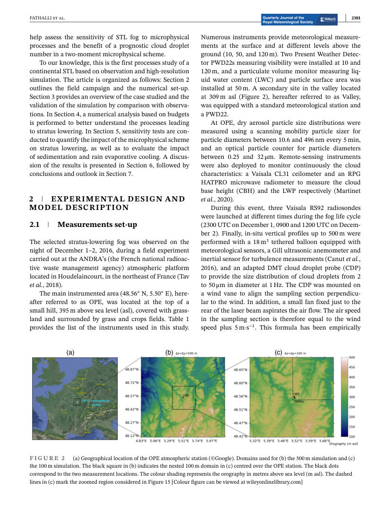

FATHALLI et al.
2301
help assess the sensitivity of STL fog to microphysical
processes and the benefit of a prognostic cloud droplet
number in a two-moment microphysical scheme.
To our knowledge, this is the first processes study of a
continental STL based on observation and high-resolution
simulation. The article is organized as follows: Section 2
outlines the field campaign and the numerical set-up.
Section 3 provides an overview of the case studied and the
validation of the simulation by comparison with observa-
tions. In Section 4, a numerical analysis based on budgets
is performed to better understand the processes leading
to stratus lowering. In Section 5, sensitivity tests are con-
ducted to quantify the impact of the microphysical scheme
on stratus lowering, as well as to evaluate the impact
of sedimentation and rain evaporative cooling. A discus-
sion of the results is presented in Section 6, followed by
conclusions and outlook in Section 7.
2
EXPERIMENTAL DESIGN AND
MODEL DESCRIPTION
2.1
Measurements set-up
The selected stratus-lowering fog was observed on the
night of December 1–2, 2016, during a field experiment
carried out at the ANDRA’s (the French national radioac-
tive waste management agency) atmospheric platform
located in Houdelaincourt, in the northeast of France (Tav
et al., 2018).
The main instrumented area (48.56◦N, 5.50◦E), here-
after referred to as OPE, was located at the top of a
small hill, 395 m above sea level (asl), covered with grass-
land and surrounded by grass and crops fields. Table 1
provides the list of the instruments used in this study.
Numerous instruments provide meteorological measure-
ments at the surface and at different levels above the
ground (10, 50, and 120 m). Two Present Weather Detec-
tor PWD22s measuring visibility were installed at 10 and
120 m, and a particulate volume monitor measuring liq-
uid water content (LWC) and particle surface area was
installed at 50 m. A secondary site in the valley located
at 309 m asl (Figure 2), hereafter referred to as Valley,
was equipped with a standard meteorological station and
a PWD22.
At OPE, dry aerosol particle size distributions were
measured using a scanning mobility particle sizer for
particle diameters between 10.6 and 496 nm every 5 min,
and an optical particle counter for particle diameters
between 0.25 and 32 μm. Remote-sensing instruments
were also deployed to monitor continuously the cloud
characteristics: a Vaisala CL31 ceilometer and an RPG
HATPRO microwave radiometer to measure the cloud
base height (CBH) and the LWP respectively (Martinet
et al., 2020).
During this event, three Vaisala RS92 radiosondes
were launched at different times during the fog life cycle
(2300 UTC on December 1, 0900 and 1200 UTC on Decem-
ber 2). Finally, in-situ vertical profiles up to 500 m were
performed with a 18 m3 tethered balloon equipped with
meteorological sensors, a Gill ultrasonic anemometer and
inertial sensor for turbulence measurements (Canut et al.,
2016), and an adapted DMT cloud droplet probe (CDP)
to provide the size distribution of cloud droplets from 2
to 50 μm in diameter at 1 Hz. The CDP was mounted on
a wind vane to align the sampling section perpendicu-
lar to the wind. In addition, a small fan fixed just to the
rear of the laser beam aspirates the air flow. The air speed
in the sampling section is therefore equal to the wind
speed plus 5 m⋅s−1. This formula has been empirically
F I G U R E 2
(a) Geographical location of the OPE atmospheric station (©Google). Domains used for (b) the 500 m simulation and (c)
the 100 m simulation. The black square in (b) indicates the nested 100 m domain in (c) centred over the OPE station. The black dots
correspond to the two measurement locations. The colour shading represents the orography in metres above sea level (m asl). The dashed
lines in (c) mark the zoomed region considered in Figure 15 [Colour figure can be viewed at wileyonlinelibrary.com]

## Page 5

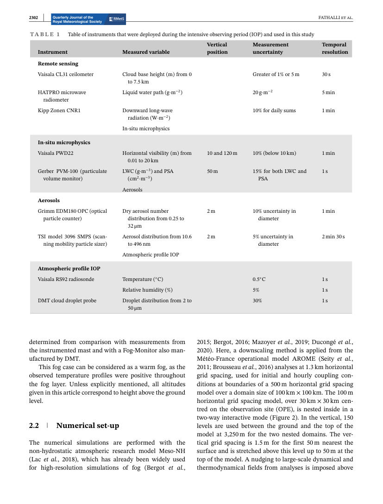

2302
FATHALLI et al.
TA B L E 1
Table of instruments that were deployed during the intensive observing period (IOP) and used in this study
Instrument
Measured variable
Vertical
position
Measurement
uncertainty
Temporal
resolution
Remote sensing
Vaisala CL31 ceilometer
Cloud base height (m) from 0
to 7.5 km
Greater of 1% or 5 m
30 s
HATPRO microwave
radiometer
Liquid water path (g⋅m−2)
20 g⋅m−2
5 min
Kipp Zonen CNR1
Downward long-wave
radiation (W⋅m−2)
10% for daily sums
1 min
In-situ microphysics
In-situ microphysics
Vaisala PWD22
Horizontal visibility (m) from
0.01 to 20 km
10 and 120 m
10% (below 10 km)
1 min
Gerber PVM-100 (particulate
volume monitor)
LWC (g⋅m−3) and PSA
(cm2⋅m−3)
50 m
15% for both LWC and
PSA
1 s
Aerosols
Aerosols
Grimm EDM180 OPC (optical
particle counter)
Dry aerosol number
distribution from 0.25 to
32 μm
2 m
10% uncertainty in
diameter
1 min
TSI model 3096 SMPS (scan-
ning mobility particle sizer)
Aerosol distribution from 10.6
to 496 nm
2 m
5% uncertainty in
diameter
2 min 30 s
Atmospheric profile IOP
Atmospheric profile IOP
Vaisala RS92 radiosonde
Temperature (◦C)
0.5◦C
1 s
Relative humidity (%)
5%
1 s
DMT cloud droplet probe
Droplet distribution from 2 to
50 μm
30%
1 s
determined from comparison with measurements from
the instrumented mast and with a Fog-Monitor also man-
ufactured by DMT.
This fog case can be considered as a warm fog, as the
observed temperature profiles were positive throughout
the fog layer. Unless explicitly mentioned, all altitudes
given in this article correspond to height above the ground
level.
2.2
Numerical set-up
The numerical simulations are performed with the
non-hydrostatic atmospheric research model Meso-NH
(Lac et al., 2018), which has already been widely used
for high-resolution simulations of fog (Bergot et al.,
2015; Bergot, 2016; Mazoyer et al., 2019; Ducongé et al.,
2020). Here, a downscaling method is applied from the
Météo-France operational model AROME (Seity et al.,
2011; Brousseau et al., 2016) analyses at 1.3 km horizontal
grid spacing, used for initial and hourly coupling con-
ditions at boundaries of a 500 m horizontal grid spacing
model over a domain size of 100 km × 100 km. The 100 m
horizontal grid spacing model, over 30 km × 30 km cen-
tred on the observation site (OPE), is nested inside in a
two-way interactive mode (Figure 2). In the vertical, 150
levels are used between the ground and the top of the
model at 3,250 m for the two nested domains. The ver-
tical grid spacing is 1.5 m for the first 50 m nearest the
surface and is stretched above this level up to 50 m at the
top of the model. A nudging to large-scale dynamical and
thermodynamical fields from analyses is imposed above

## Page 6

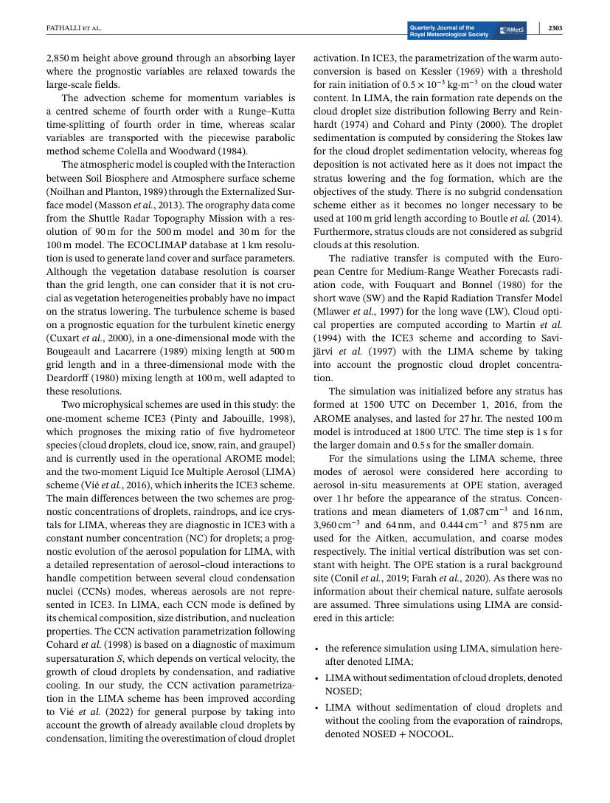

FATHALLI et al.
2303
2,850 m height above ground through an absorbing layer
where the prognostic variables are relaxed towards the
large-scale fields.
The advection scheme for momentum variables is
a centred scheme of fourth order with a Runge–Kutta
time-splitting of fourth order in time, whereas scalar
variables are transported with the piecewise parabolic
method scheme Colella and Woodward (1984).
The atmospheric model is coupled with the Interaction
between Soil Biosphere and Atmosphere surface scheme
(Noilhan and Planton, 1989) through the Externalized Sur-
face model (Masson et al., 2013). The orography data come
from the Shuttle Radar Topography Mission with a res-
olution of 90 m for the 500 m model and 30 m for the
100 m model. The ECOCLIMAP database at 1 km resolu-
tion is used to generate land cover and surface parameters.
Although the vegetation database resolution is coarser
than the grid length, one can consider that it is not cru-
cial as vegetation heterogeneities probably have no impact
on the stratus lowering. The turbulence scheme is based
on a prognostic equation for the turbulent kinetic energy
(Cuxart et al., 2000), in a one-dimensional mode with the
Bougeault and Lacarrere (1989) mixing length at 500 m
grid length and in a three-dimensional mode with the
Deardorff (1980) mixing length at 100 m, well adapted to
these resolutions.
Two microphysical schemes are used in this study: the
one-moment scheme ICE3 (Pinty and Jabouille, 1998),
which prognoses the mixing ratio of five hydrometeor
species (cloud droplets, cloud ice, snow, rain, and graupel)
and is currently used in the operational AROME model;
and the two-moment Liquid Ice Multiple Aerosol (LIMA)
scheme (Vié et al., 2016), which inherits the ICE3 scheme.
The main differences between the two schemes are prog-
nostic concentrations of droplets, raindrops, and ice crys-
tals for LIMA, whereas they are diagnostic in ICE3 with a
constant number concentration (NC) for droplets; a prog-
nostic evolution of the aerosol population for LIMA, with
a detailed representation of aerosol–cloud interactions to
handle competition between several cloud condensation
nuclei (CCNs) modes, whereas aerosols are not repre-
sented in ICE3. In LIMA, each CCN mode is defined by
its chemical composition, size distribution, and nucleation
properties. The CCN activation parametrization following
Cohard et al. (1998) is based on a diagnostic of maximum
supersaturation S, which depends on vertical velocity, the
growth of cloud droplets by condensation, and radiative
cooling. In our study, the CCN activation parametriza-
tion in the LIMA scheme has been improved according
to Vié et al. (2022) for general purpose by taking into
account the growth of already available cloud droplets by
condensation, limiting the overestimation of cloud droplet
activation. In ICE3, the parametrization of the warm auto-
conversion is based on Kessler (1969) with a threshold
for rain initiation of 0.5 × 10−3 kg⋅m−3 on the cloud water
content. In LIMA, the rain formation rate depends on the
cloud droplet size distribution following Berry and Rein-
hardt (1974) and Cohard and Pinty (2000). The droplet
sedimentation is computed by considering the Stokes law
for the cloud droplet sedimentation velocity, whereas fog
deposition is not activated here as it does not impact the
stratus lowering and the fog formation, which are the
objectives of the study. There is no subgrid condensation
scheme either as it becomes no longer necessary to be
used at 100 m grid length according to Boutle et al. (2014).
Furthermore, stratus clouds are not considered as subgrid
clouds at this resolution.
The radiative transfer is computed with the Euro-
pean Centre for Medium-Range Weather Forecasts radi-
ation code, with Fouquart and Bonnel (1980) for the
short wave (SW) and the Rapid Radiation Transfer Model
(Mlawer et al., 1997) for the long wave (LW). Cloud opti-
cal properties are computed according to Martin et al.
(1994) with the ICE3 scheme and according to Savi-
järvi et al. (1997) with the LIMA scheme by taking
into account the prognostic cloud droplet concentra-
tion.
The simulation was initialized before any stratus has
formed at 1500 UTC on December 1, 2016, from the
AROME analyses, and lasted for 27 hr. The nested 100 m
model is introduced at 1800 UTC. The time step is 1 s for
the larger domain and 0.5 s for the smaller domain.
For the simulations using the LIMA scheme, three
modes of aerosol were considered here according to
aerosol in-situ measurements at OPE station, averaged
over 1 hr before the appearance of the stratus. Concen-
trations and mean diameters of 1,087 cm−3 and 16 nm,
3,960 cm−3 and 64 nm, and 0.444 cm−3 and 875 nm are
used for the Aitken, accumulation, and coarse modes
respectively. The initial vertical distribution was set con-
stant with height. The OPE station is a rural background
site (Conil et al., 2019; Farah et al., 2020). As there was no
information about their chemical nature, sulfate aerosols
are assumed. Three simulations using LIMA are consid-
ered in this article:
• the reference simulation using LIMA, simulation here-
after denoted LIMA;
• LIMA without sedimentation of cloud droplets, denoted
NOSED;
• LIMA without sedimentation of cloud droplets and
without the cooling from the evaporation of raindrops,
denoted NOSED + NOCOOL.

## Page 7

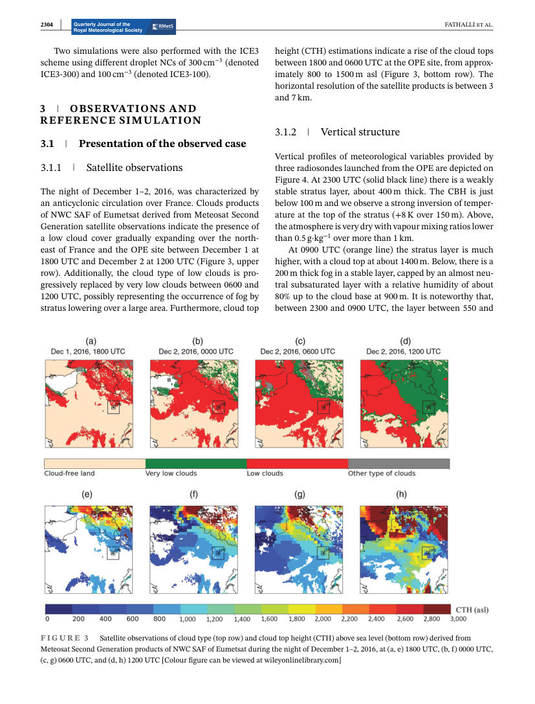

2304
FATHALLI et al.
Two simulations were also performed with the ICE3
scheme using different droplet NCs of 300 cm−3 (denoted
ICE3-300) and 100 cm−3 (denoted ICE3-100).
3
OBSERVATIONS AND
REFERENCE SIMULATION
3.1
Presentation of the observed case
3.1.1
Satellite observations
The night of December 1–2, 2016, was characterized by
an anticyclonic circulation over France. Clouds products
of NWC SAF of Eumetsat derived from Meteosat Second
Generation satellite observations indicate the presence of
a low cloud cover gradually expanding over the north-
east of France and the OPE site between December 1 at
1800 UTC and December 2 at 1200 UTC (Figure 3, upper
row). Additionally, the cloud type of low clouds is pro-
gressively replaced by very low clouds between 0600 and
1200 UTC, possibly representing the occurrence of fog by
stratus lowering over a large area. Furthermore, cloud top
height (CTH) estimations indicate a rise of the cloud tops
between 1800 and 0600 UTC at the OPE site, from approx-
imately 800 to 1500 m asl (Figure 3, bottom row). The
horizontal resolution of the satellite products is between 3
and 7 km.
3.1.2
Vertical structure
Vertical profiles of meteorological variables provided by
three radiosondes launched from the OPE are depicted on
Figure 4. At 2300 UTC (solid black line) there is a weakly
stable stratus layer, about 400 m thick. The CBH is just
below 100 m and we observe a strong inversion of temper-
ature at the top of the stratus (+8 K over 150 m). Above,
the atmosphere is very dry with vapour mixing ratios lower
than 0.5 g⋅kg−1 over more than 1 km.
At 0900 UTC (orange line) the stratus layer is much
higher, with a cloud top at about 1400 m. Below, there is a
200 m thick fog in a stable layer, capped by an almost neu-
tral subsaturated layer with a relative humidity of about
80% up to the cloud base at 900 m. It is noteworthy that,
between 2300 and 0900 UTC, the layer between 550 and
F I G U R E 3
Satellite observations of cloud type (top row) and cloud top height (CTH) above sea level (bottom row) derived from
Meteosat Second Generation products of NWC SAF of Eumetsat during the night of December 1–2, 2016, at (a, e) 1800 UTC, (b, f) 0000 UTC,
(c, g) 0600 UTC, and (d, h) 1200 UTC [Colour figure can be viewed at wileyonlinelibrary.com]

## Page 8

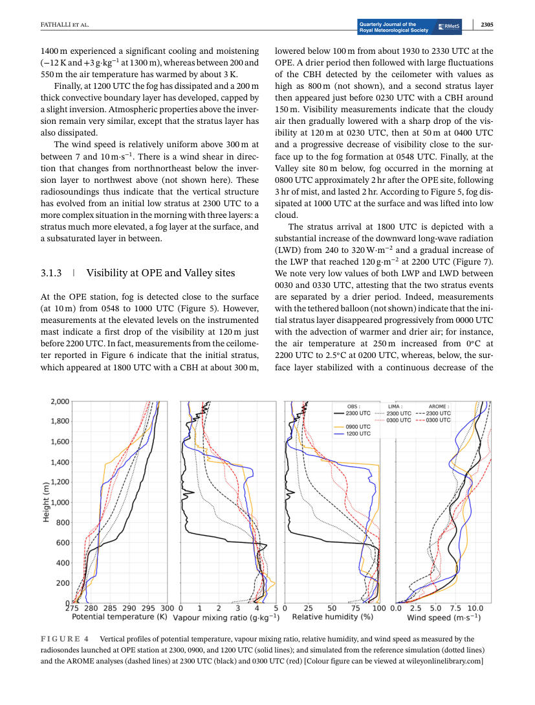

FATHALLI et al.
2305
1400 m experienced a significant cooling and moistening
(−12 K and +3 g⋅kg−1 at 1300 m), whereas between 200 and
550 m the air temperature has warmed by about 3 K.
Finally, at 1200 UTC the fog has dissipated and a 200 m
thick convective boundary layer has developed, capped by
a slight inversion. Atmospheric properties above the inver-
sion remain very similar, except that the stratus layer has
also dissipated.
The wind speed is relatively uniform above 300 m at
between 7 and 10 m⋅s−1. There is a wind shear in direc-
tion that changes from northnortheast below the inver-
sion layer to northwest above (not shown here). These
radiosoundings thus indicate that the vertical structure
has evolved from an initial low stratus at 2300 UTC to a
more complex situation in the morning with three layers: a
stratus much more elevated, a fog layer at the surface, and
a subsaturated layer in between.
3.1.3
Visibility at OPE and Valley sites
At the OPE station, fog is detected close to the surface
(at 10 m) from 0548 to 1000 UTC (Figure 5). However,
measurements at the elevated levels on the instrumented
mast indicate a first drop of the visibility at 120 m just
before 2200 UTC. In fact, measurements from the ceilome-
ter reported in Figure 6 indicate that the initial stratus,
which appeared at 1800 UTC with a CBH at about 300 m,
lowered below 100 m from about 1930 to 2330 UTC at the
OPE. A drier period then followed with large fluctuations
of the CBH detected by the ceilometer with values as
high as 800 m (not shown), and a second stratus layer
then appeared just before 0230 UTC with a CBH around
150 m. Visibility measurements indicate that the cloudy
air then gradually lowered with a sharp drop of the vis-
ibility at 120 m at 0230 UTC, then at 50 m at 0400 UTC
and a progressive decrease of visibility close to the sur-
face up to the fog formation at 0548 UTC. Finally, at the
Valley site 80 m below, fog occurred in the morning at
0800 UTC approximately 2 hr after the OPE site, following
3 hr of mist, and lasted 2 hr. According to Figure 5, fog dis-
sipated at 1000 UTC at the surface and was lifted into low
cloud.
The stratus arrival at 1800 UTC is depicted with a
substantial increase of the downward long-wave radiation
(LWD) from 240 to 320 W⋅m−2 and a gradual increase of
the LWP that reached 120 g⋅m−2 at 2200 UTC (Figure 7).
We note very low values of both LWP and LWD between
0030 and 0330 UTC, attesting that the two stratus events
are separated by a drier period. Indeed, measurements
with the tethered balloon (not shown) indicate that the ini-
tial stratus layer disappeared progressively from 0000 UTC
with the advection of warmer and drier air; for instance,
the air temperature at 250 m increased from 0◦C at
2200 UTC to 2.5◦C at 0200 UTC, whereas, below, the sur-
face layer stabilized with a continuous decrease of the
F I G U R E 4
Vertical profiles of potential temperature, vapour mixing ratio, relative humidity, and wind speed as measured by the
radiosondes launched at OPE station at 2300, 0900, and 1200 UTC (solid lines); and simulated from the reference simulation (dotted lines)
and the AROME analyses (dashed lines) at 2300 UTC (black) and 0300 UTC (red) [Colour figure can be viewed at wileyonlinelibrary.com]

## Page 9

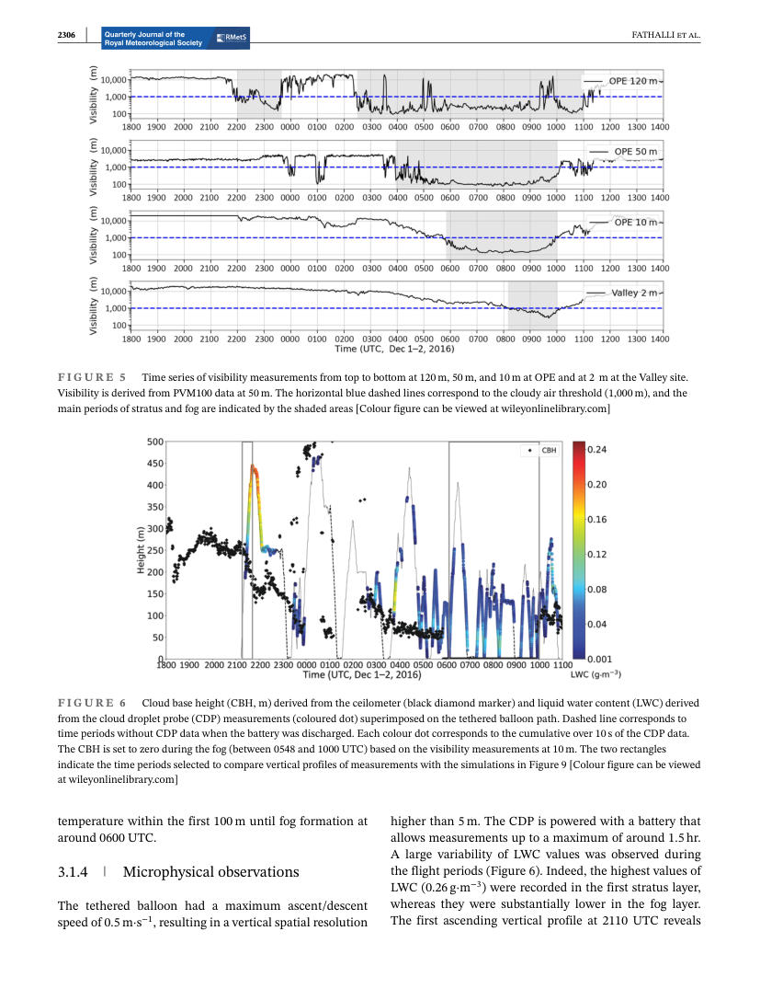

2306
FATHALLI et al.
F I G U R E 5
Time series of visibility measurements from top to bottom at 120 m, 50 m, and 10 m at OPE and at 2 m at the Valley site.
Visibility is derived from PVM100 data at 50 m. The horizontal blue dashed lines correspond to the cloudy air threshold (1,000 m), and the
main periods of stratus and fog are indicated by the shaded areas [Colour figure can be viewed at wileyonlinelibrary.com]
F I G U R E 6
Cloud base height (CBH, m) derived from the ceilometer (black diamond marker) and liquid water content (LWC) derived
from the cloud droplet probe (CDP) measurements (coloured dot) superimposed on the tethered balloon path. Dashed line corresponds to
time periods without CDP data when the battery was discharged. Each colour dot corresponds to the cumulative over 10 s of the CDP data.
The CBH is set to zero during the fog (between 0548 and 1000 UTC) based on the visibility measurements at 10 m. The two rectangles
indicate the time periods selected to compare vertical profiles of measurements with the simulations in Figure 9 [Colour figure can be viewed
at wileyonlinelibrary.com]
temperature within the first 100 m until fog formation at
around 0600 UTC.
3.1.4
Microphysical observations
The tethered balloon had a maximum ascent/descent
speed of 0.5 m⋅s−1, resulting in a vertical spatial resolution
higher than 5 m. The CDP is powered with a battery that
allows measurements up to a maximum of around 1.5 hr.
A large variability of LWC values was observed during
the flight periods (Figure 6). Indeed, the highest values of
LWC (0.26 g⋅m−3) were recorded in the first stratus layer,
whereas they were substantially lower in the fog layer.
The first ascending vertical profile at 2110 UTC reveals

## Page 10

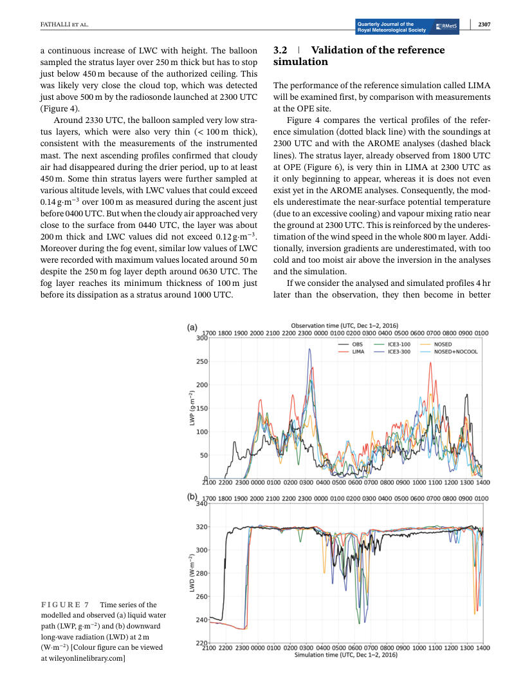

FATHALLI et al.
2307
a continuous increase of LWC with height. The balloon
sampled the stratus layer over 250 m thick but has to stop
just below 450 m because of the authorized ceiling. This
was likely very close the cloud top, which was detected
just above 500 m by the radiosonde launched at 2300 UTC
(Figure 4).
Around 2330 UTC, the balloon sampled very low stra-
tus layers, which were also very thin (< 100 m thick),
consistent with the measurements of the instrumented
mast. The next ascending profiles confirmed that cloudy
air had disappeared during the drier period, up to at least
450 m. Some thin stratus layers were further sampled at
various altitude levels, with LWC values that could exceed
0.14 g⋅m−3 over 100 m as measured during the ascent just
before 0400 UTC. But when the cloudy air approached very
close to the surface from 0440 UTC, the layer was about
200 m thick and LWC values did not exceed 0.12 g⋅m−3.
Moreover during the fog event, similar low values of LWC
were recorded with maximum values located around 50 m
despite the 250 m fog layer depth around 0630 UTC. The
fog layer reaches its minimum thickness of 100 m just
before its dissipation as a stratus around 1000 UTC.
3.2
Validation of the reference
simulation
The performance of the reference simulation called LIMA
will be examined first, by comparison with measurements
at the OPE site.
Figure 4 compares the vertical profiles of the refer-
ence simulation (dotted black line) with the soundings at
2300 UTC and with the AROME analyses (dashed black
lines). The stratus layer, already observed from 1800 UTC
at OPE (Figure 6), is very thin in LIMA at 2300 UTC as
it only beginning to appear, whereas it is does not even
exist yet in the AROME analyses. Consequently, the mod-
els underestimate the near-surface potential temperature
(due to an excessive cooling) and vapour mixing ratio near
the ground at 2300 UTC. This is reinforced by the underes-
timation of the wind speed in the whole 800 m layer. Addi-
tionally, inversion gradients are underestimated, with too
cold and too moist air above the inversion in the analyses
and the simulation.
If we consider the analysed and simulated profiles 4 hr
later than the observation, they then become in better
F I G U R E 7
Time series of the
modelled and observed (a) liquid water
path (LWP, g⋅m−2) and (b) downward
long-wave radiation (LWD) at 2 m
(W⋅m−2) [Colour figure can be viewed
at wileyonlinelibrary.com]

## Page 11

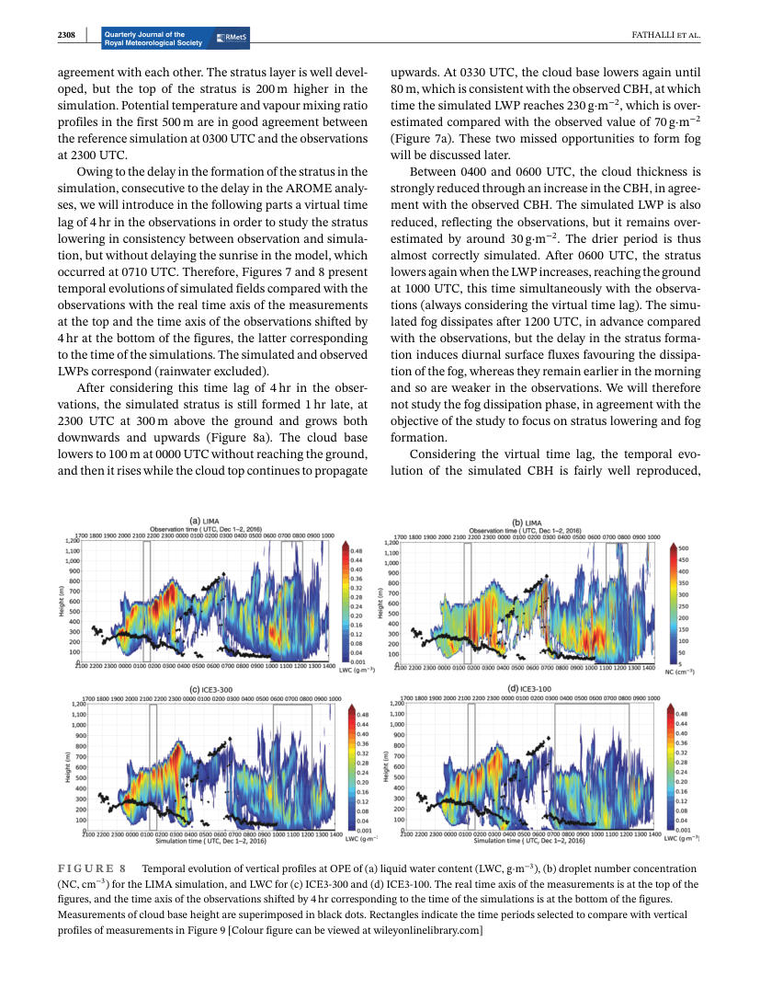

2308
FATHALLI et al.
agreement with each other. The stratus layer is well devel-
oped, but the top of the stratus is 200 m higher in the
simulation. Potential temperature and vapour mixing ratio
profiles in the first 500 m are in good agreement between
the reference simulation at 0300 UTC and the observations
at 2300 UTC.
Owing to the delay in the formation of the stratus in the
simulation, consecutive to the delay in the AROME analy-
ses, we will introduce in the following parts a virtual time
lag of 4 hr in the observations in order to study the stratus
lowering in consistency between observation and simula-
tion, but without delaying the sunrise in the model, which
occurred at 0710 UTC. Therefore, Figures 7 and 8 present
temporal evolutions of simulated fields compared with the
observations with the real time axis of the measurements
at the top and the time axis of the observations shifted by
4 hr at the bottom of the figures, the latter corresponding
to the time of the simulations. The simulated and observed
LWPs correspond (rainwater excluded).
After considering this time lag of 4 hr in the obser-
vations, the simulated stratus is still formed 1 hr late, at
2300 UTC at 300 m above the ground and grows both
downwards and upwards (Figure 8a). The cloud base
lowers to 100 m at 0000 UTC without reaching the ground,
and then it rises while the cloud top continues to propagate
upwards. At 0330 UTC, the cloud base lowers again until
80 m, which is consistent with the observed CBH, at which
time the simulated LWP reaches 230 g⋅m−2, which is over-
estimated compared with the observed value of 70 g⋅m−2
(Figure 7a). These two missed opportunities to form fog
will be discussed later.
Between 0400 and 0600 UTC, the cloud thickness is
strongly reduced through an increase in the CBH, in agree-
ment with the observed CBH. The simulated LWP is also
reduced, reflecting the observations, but it remains over-
estimated by around 30 g⋅m−2. The drier period is thus
almost correctly simulated. After 0600 UTC, the stratus
lowers again when the LWP increases, reaching the ground
at 1000 UTC, this time simultaneously with the observa-
tions (always considering the virtual time lag). The simu-
lated fog dissipates after 1200 UTC, in advance compared
with the observations, but the delay in the stratus forma-
tion induces diurnal surface fluxes favouring the dissipa-
tion of the fog, whereas they remain earlier in the morning
and so are weaker in the observations. We will therefore
not study the fog dissipation phase, in agreement with the
objective of the study to focus on stratus lowering and fog
formation.
Considering the virtual time lag, the temporal evo-
lution of the simulated CBH is fairly well reproduced,
F I G U R E 8
Temporal evolution of vertical profiles at OPE of (a) liquid water content (LWC, g⋅m−3), (b) droplet number concentration
(NC, cm−3) for the LIMA simulation, and LWC for (c) ICE3-300 and (d) ICE3-100. The real time axis of the measurements is at the top of the
figures, and the time axis of the observations shifted by 4 hr corresponding to the time of the simulations is at the bottom of the figures.
Measurements of cloud base height are superimposed in black dots. Rectangles indicate the time periods selected to compare with vertical
profiles of measurements in Figure 9 [Colour figure can be viewed at wileyonlinelibrary.com]

## Page 12

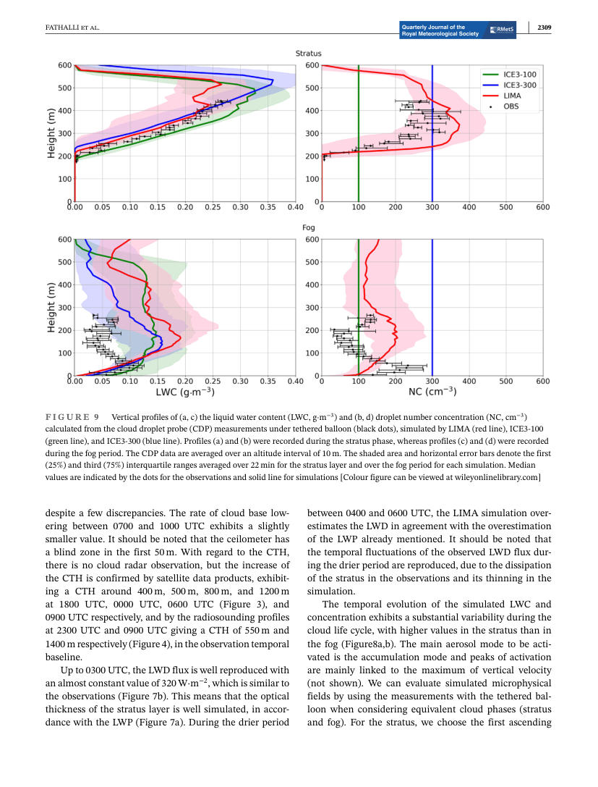

FATHALLI et al.
2309
F I G U R E 9
Vertical profiles of (a, c) the liquid water content (LWC, g⋅m−3) and (b, d) droplet number concentration (NC, cm−3)
calculated from the cloud droplet probe (CDP) measurements under tethered balloon (black dots), simulated by LIMA (red line), ICE3-100
(green line), and ICE3-300 (blue line). Profiles (a) and (b) were recorded during the stratus phase, whereas profiles (c) and (d) were recorded
during the fog period. The CDP data are averaged over an altitude interval of 10 m. The shaded area and horizontal error bars denote the first
(25%) and third (75%) interquartile ranges averaged over 22 min for the stratus layer and over the fog period for each simulation. Median
values are indicated by the dots for the observations and solid line for simulations [Colour figure can be viewed at wileyonlinelibrary.com]
despite a few discrepancies. The rate of cloud base low-
ering between 0700 and 1000 UTC exhibits a slightly
smaller value. It should be noted that the ceilometer has
a blind zone in the first 50 m. With regard to the CTH,
there is no cloud radar observation, but the increase of
the CTH is confirmed by satellite data products, exhibit-
ing a CTH around 400 m, 500 m, 800 m, and 1200 m
at 1800 UTC, 0000 UTC, 0600 UTC (Figure 3), and
0900 UTC respectively, and by the radiosounding profiles
at 2300 UTC and 0900 UTC giving a CTH of 550 m and
1400 m respectively (Figure 4), in the observation temporal
baseline.
Up to 0300 UTC, the LWD flux is well reproduced with
an almost constant value of 320 W⋅m−2, which is similar to
the observations (Figure 7b). This means that the optical
thickness of the stratus layer is well simulated, in accor-
dance with the LWP (Figure 7a). During the drier period
between 0400 and 0600 UTC, the LIMA simulation over-
estimates the LWD in agreement with the overestimation
of the LWP already mentioned. It should be noted that
the temporal fluctuations of the observed LWD flux dur-
ing the drier period are reproduced, due to the dissipation
of the stratus in the observations and its thinning in the
simulation.
The temporal evolution of the simulated LWC and
concentration exhibits a substantial variability during the
cloud life cycle, with higher values in the stratus than in
the fog (Figure8a,b). The main aerosol mode to be acti-
vated is the accumulation mode and peaks of activation
are mainly linked to the maximum of vertical velocity
(not shown). We can evaluate simulated microphysical
fields by using the measurements with the tethered bal-
loon when considering equivalent cloud phases (stratus
and fog). For the stratus, we choose the first ascending

## Page 13

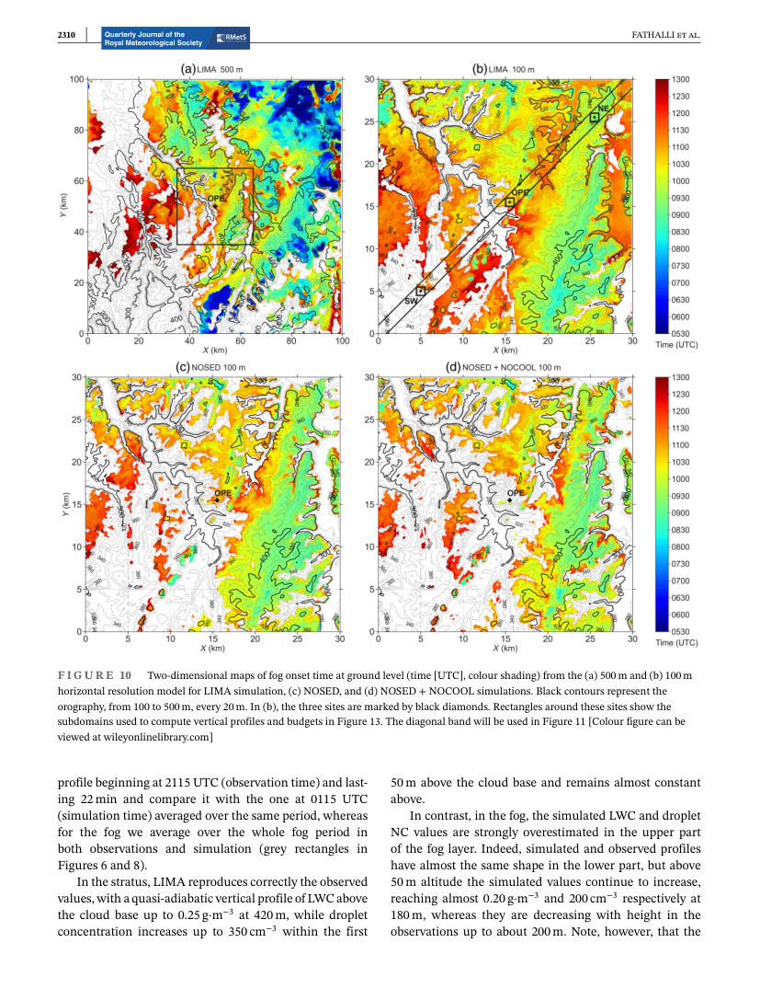

2310
FATHALLI et al.
F I G U R E 10
Two-dimensional maps of fog onset time at ground level (time [UTC], colour shading) from the (a) 500 m and (b) 100 m
horizontal resolution model for LIMA simulation, (c) NOSED, and (d) NOSED + NOCOOL simulations. Black contours represent the
orography, from 100 to 500 m, every 20 m. In (b), the three sites are marked by black diamonds. Rectangles around these sites show the
subdomains used to compute vertical profiles and budgets in Figure 13. The diagonal band will be used in Figure 11 [Colour figure can be
viewed at wileyonlinelibrary.com]
profile beginning at 2115 UTC (observation time) and last-
ing 22 min and compare it with the one at 0115 UTC
(simulation time) averaged over the same period, whereas
for the fog we average over the whole fog period in
both observations and simulation (grey rectangles in
Figures 6 and 8).
In the stratus, LIMA reproduces correctly the observed
values, with a quasi-adiabatic vertical profile of LWC above
the cloud base up to 0.25 g⋅m−3 at 420 m, while droplet
concentration increases up to 350 cm−3 within the first
50 m above the cloud base and remains almost constant
above.
In contrast, in the fog, the simulated LWC and droplet
NC values are strongly overestimated in the upper part
of the fog layer. Indeed, simulated and observed profiles
have almost the same shape in the lower part, but above
50 m altitude the simulated values continue to increase,
reaching almost 0.20 g⋅m−3 and 200 cm−3 respectively at
180 m, whereas they are decreasing with height in the
observations up to about 200 m. Note, however, that the

## Page 14

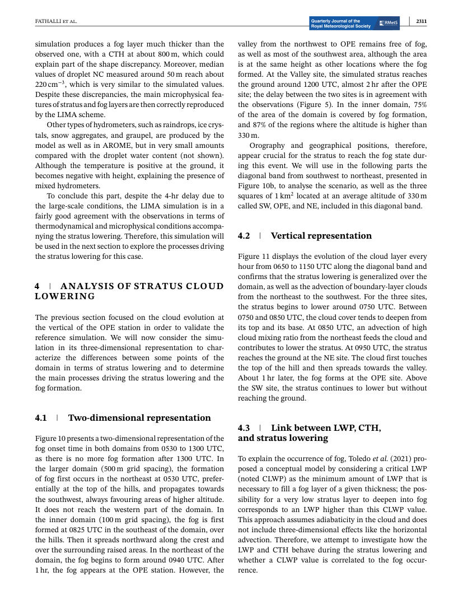

FATHALLI et al.
2311
simulation produces a fog layer much thicker than the
observed one, with a CTH at about 800 m, which could
explain part of the shape discrepancy. Moreover, median
values of droplet NC measured around 50 m reach about
220 cm−3, which is very similar to the simulated values.
Despite these discrepancies, the main microphysical fea-
tures of stratus and fog layers are then correctly reproduced
by the LIMA scheme.
Other types of hydrometers, such as raindrops, ice crys-
tals, snow aggregates, and graupel, are produced by the
model as well as in AROME, but in very small amounts
compared with the droplet water content (not shown).
Although the temperature is positive at the ground, it
becomes negative with height, explaining the presence of
mixed hydrometers.
To conclude this part, despite the 4-hr delay due to
the large-scale conditions, the LIMA simulation is in a
fairly good agreement with the observations in terms of
thermodynamical and microphysical conditions accompa-
nying the stratus lowering. Therefore, this simulation will
be used in the next section to explore the processes driving
the stratus lowering for this case.
4
ANALYSIS OF STRATUS CLOUD
LOWERING
The previous section focused on the cloud evolution at
the vertical of the OPE station in order to validate the
reference simulation. We will now consider the simu-
lation in its three-dimensional representation to char-
acterize the differences between some points of the
domain in terms of stratus lowering and to determine
the main processes driving the stratus lowering and the
fog formation.
4.1
Two-dimensional representation
Figure 10 presents a two-dimensional representation of the
fog onset time in both domains from 0530 to 1300 UTC,
as there is no more fog formation after 1300 UTC. In
the larger domain (500 m grid spacing), the formation
of fog first occurs in the northeast at 0530 UTC, prefer-
entially at the top of the hills, and propagates towards
the southwest, always favouring areas of higher altitude.
It does not reach the western part of the domain. In
the inner domain (100 m grid spacing), the fog is first
formed at 0825 UTC in the southeast of the domain, over
the hills. Then it spreads northward along the crest and
over the surrounding raised areas. In the northeast of the
domain, the fog begins to form around 0940 UTC. After
1 hr, the fog appears at the OPE station. However, the
valley from the northwest to OPE remains free of fog,
as well as most of the southwest area, although the area
is at the same height as other locations where the fog
formed. At the Valley site, the simulated stratus reaches
the ground around 1200 UTC, almost 2 hr after the OPE
site; the delay between the two sites is in agreement with
the observations (Figure 5). In the inner domain, 75%
of the area of the domain is covered by fog formation,
and 87% of the regions where the altitude is higher than
330 m.
Orography and geographical positions, therefore,
appear crucial for the stratus to reach the fog state dur-
ing this event. We will use in the following parts the
diagonal band from southwest to northeast, presented in
Figure 10b, to analyse the scenario, as well as the three
squares of 1 km2 located at an average altitude of 330 m
called SW, OPE, and NE, included in this diagonal band.
4.2
Vertical representation
Figure 11 displays the evolution of the cloud layer every
hour from 0650 to 1150 UTC along the diagonal band and
confirms that the stratus lowering is generalized over the
domain, as well as the advection of boundary-layer clouds
from the northeast to the southwest. For the three sites,
the stratus begins to lower around 0750 UTC. Between
0750 and 0850 UTC, the cloud cover tends to deepen from
its top and its base. At 0850 UTC, an advection of high
cloud mixing ratio from the northeast feeds the cloud and
contributes to lower the stratus. At 0950 UTC, the stratus
reaches the ground at the NE site. The cloud first touches
the top of the hill and then spreads towards the valley.
About 1 hr later, the fog forms at the OPE site. Above
the SW site, the stratus continues to lower but without
reaching the ground.
4.3
Link between LWP, CTH,
and stratus lowering
To explain the occurrence of fog, Toledo et al. (2021) pro-
posed a conceptual model by considering a critical LWP
(noted CLWP) as the minimum amount of LWP that is
necessary to fill a fog layer of a given thickness; the pos-
sibility for a very low stratus layer to deepen into fog
corresponds to an LWP higher than this CLWP value.
This approach assumes adiabaticity in the cloud and does
not include three-dimensional effects like the horizontal
advection. Therefore, we attempt to investigate how the
LWP and CTH behave during the stratus lowering and
whether a CLWP value is correlated to the fog occur-
rence.

## Page 15

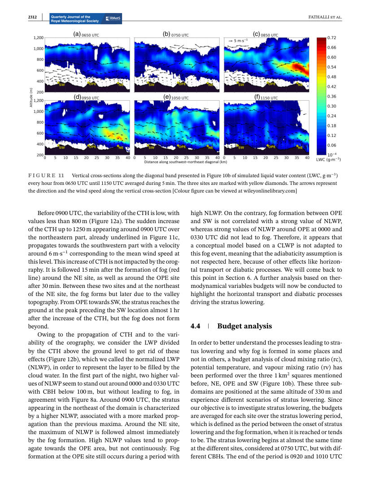

2312
FATHALLI et al.
F I G U R E 11
Vertical cross-sections along the diagonal band presented in Figure 10b of simulated liquid water content (LWC, g⋅m−3)
every hour from 0650 UTC until 1150 UTC averaged during 5 min. The three sites are marked with yellow diamonds. The arrows represent
the direction and the wind speed along the vertical cross-section [Colour figure can be viewed at wileyonlinelibrary.com]
Before 0900 UTC, the variability of the CTH is low, with
values less than 800 m (Figure 12a). The sudden increase
of the CTH up to 1250 m appearing around 0900 UTC over
the northeastern part, already underlined in Figure 11c,
propagates towards the southwestern part with a velocity
around 6 m⋅s−1 corresponding to the mean wind speed at
this level. This increase of CTH is not impacted by the orog-
raphy. It is followed 15 min after the formation of fog (red
line) around the NE site, as well as around the OPE site
after 30 min. Between these two sites and at the northeast
of the NE site, the fog forms but later due to the valley
topography. From OPE towards SW, the stratus reaches the
ground at the peak preceding the SW location almost 1 hr
after the increase of the CTH, but the fog does not form
beyond.
Owing to the propagation of CTH and to the vari-
ability of the orography, we consider the LWP divided
by the CTH above the ground level to get rid of these
effects (Figure 12b), which we called the normalized LWP
(NLWP), in order to represent the layer to be filled by the
cloud water. In the first part of the night, two higher val-
ues of NLWP seem to stand out around 0000 and 0330 UTC
with CBH below 100 m, but without leading to fog, in
agreement with Figure 8a. Around 0900 UTC, the stratus
appearing in the northeast of the domain is characterized
by a higher NLWP, associated with a more marked prop-
agation than the previous maxima. Around the NE site,
the maximum of NLWP is followed almost immediately
by the fog formation. High NLWP values tend to prop-
agate towards the OPE area, but not continuously. Fog
formation at the OPE site still occurs during a period with
high NLWP. On the contrary, fog formation between OPE
and SW is not correlated with a strong value of NLWP,
whereas strong values of NLWP around OPE at 0000 and
0330 UTC did not lead to fog. Therefore, it appears that
a conceptual model based on a CLWP is not adapted to
this fog event, meaning that the adiabaticity assumption is
not respected here, because of other effects like horizon-
tal transport or diabatic processes. We will come back to
this point in Section 6. A further analysis based on ther-
modynamical variables budgets will now be conducted to
highlight the horizontal transport and diabatic processes
driving the stratus lowering.
4.4
Budget analysis
In order to better understand the processes leading to stra-
tus lowering and why fog is formed in some places and
not in others, a budget analysis of cloud mixing ratio (rc),
potential temperature, and vapour mixing ratio (rv) has
been performed over the three 1 km2 squares mentioned
before, NE, OPE and SW (Figure 10b). These three sub-
domains are positioned at the same altitude of 330 m and
experience different scenarios of stratus lowering. Since
our objective is to investigate stratus lowering, the budgets
are averaged for each site over the stratus lowering period,
which is defined as the period between the onset of stratus
lowering and the fog formation, when it is reached or tends
to be. The stratus lowering begins at almost the same time
at the different sites, considered at 0750 UTC, but with dif-
ferent CBHs. The end of the period is 0920 and 1010 UTC

## Page 16

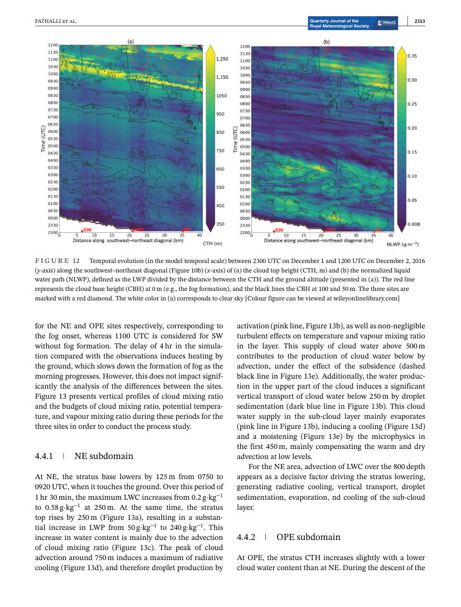

FATHALLI et al.
2313
,
F I G U R E 12
Temporal evolution (in the model temporal scale) between 2300 UTC on December 1 and 1200 UTC on December 2, 2016
(y-axis) along the southwest–northeast diagonal (Figure 10b) (x-axis) of (a) the cloud top height (CTH, m) and (b) the normalized liquid
water path (NLWP), defined as the LWP divided by the distance between the CTH and the ground altitude (presented in (a)). The red line
represents the cloud base height (CBH) at 0 m (e.g., the fog formation), and the black lines the CBH at 100 and 50 m. The three sites are
marked with a red diamond. The white color in (a) corresponds to clear sky [Colour figure can be viewed at wileyonlinelibrary.com]
for the NE and OPE sites respectively, corresponding to
the fog onset, whereas 1100 UTC is considered for SW
without fog formation. The delay of 4 hr in the simula-
tion compared with the observations induces heating by
the ground, which slows down the formation of fog as the
morning progresses. However, this does not impact signif-
icantly the analysis of the differences between the sites.
Figure 13 presents vertical profiles of cloud mixing ratio
and the budgets of cloud mixing ratio, potential tempera-
ture, and vapour mixing ratio during these periods for the
three sites in order to conduct the process study.
4.4.1
NE subdomain
At NE, the stratus base lowers by 125 m from 0750 to
0920 UTC, when it touches the ground. Over this period of
1 hr 30 min, the maximum LWC increases from 0.2 g⋅kg−1
to 0.58 g⋅kg−1 at 250 m. At the same time, the stratus
top rises by 250 m (Figure 13a), resulting in a substan-
tial increase in LWP from 50 g⋅kg−1 to 240 g⋅kg−1. This
increase in water content is mainly due to the advection
of cloud mixing ratio (Figure 13c). The peak of cloud
advection around 750 m induces a maximum of radiative
cooling (Figure 13d), and therefore droplet production by
activation (pink line, Figure 13b), as well as non-negligible
turbulent effects on temperature and vapour mixing ratio
in the layer. This supply of cloud water above 500 m
contributes to the production of cloud water below by
advection, under the effect of the subsidence (dashed
black line in Figure 13e). Additionally, the water produc-
tion in the upper part of the cloud induces a significant
vertical transport of cloud water below 250 m by droplet
sedimentation (dark blue line in Figure 13b). This cloud
water supply in the sub-cloud layer mainly evaporates
(pink line in Figure 13b), inducing a cooling (Figure 13d)
and a moistening (Figure 13e) by the microphysics in
the first 450 m, mainly compensating the warm and dry
advection at low levels.
For the NE area, advection of LWC over the 800 depth
appears as a decisive factor driving the stratus lowering,
generating radiative cooling, vertical transport, droplet
sedimentation, evaporation, nd cooling of the sub-cloud
layer.
4.4.2
OPE subdomain
At OPE, the stratus CTH increases slightly with a lower
cloud water content than at NE. During the descent of the

## Page 17

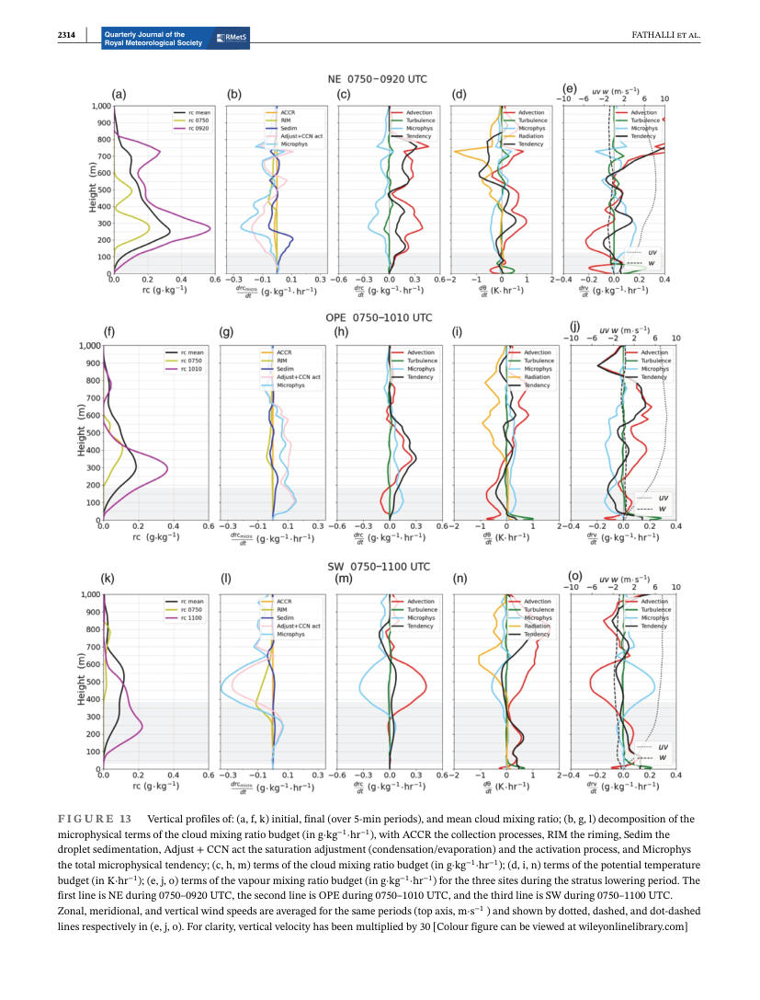

2314
FATHALLI et al.
F I G U R E 13
Vertical profiles of: (a, f, k) initial, final (over 5-min periods), and mean cloud mixing ratio; (b, g, l) decomposition of the
microphysical terms of the cloud mixing ratio budget (in g⋅kg−1⋅hr−1), with ACCR the collection processes, RIM the riming, Sedim the
droplet sedimentation, Adjust + CCN act the saturation adjustment (condensation/evaporation) and the activation process, and Microphys
the total microphysical tendency; (c, h, m) terms of the cloud mixing ratio budget (in g⋅kg−1⋅hr−1); (d, i, n) terms of the potential temperature
budget (in K⋅hr−1); (e, j, o) terms of the vapour mixing ratio budget (in g⋅kg−1⋅hr−1) for the three sites during the stratus lowering period. The
first line is NE during 0750–0920 UTC, the second line is OPE during 0750–1010 UTC, and the third line is SW during 0750–1100 UTC.
Zonal, meridional, and vertical wind speeds are averaged for the same periods (top axis, m⋅s−1 ) and shown by dotted, dashed, and dot-dashed
lines respectively in (e, j, o). For clarity, vertical velocity has been multiplied by 30 [Colour figure can be viewed at wileyonlinelibrary.com]

## Page 18

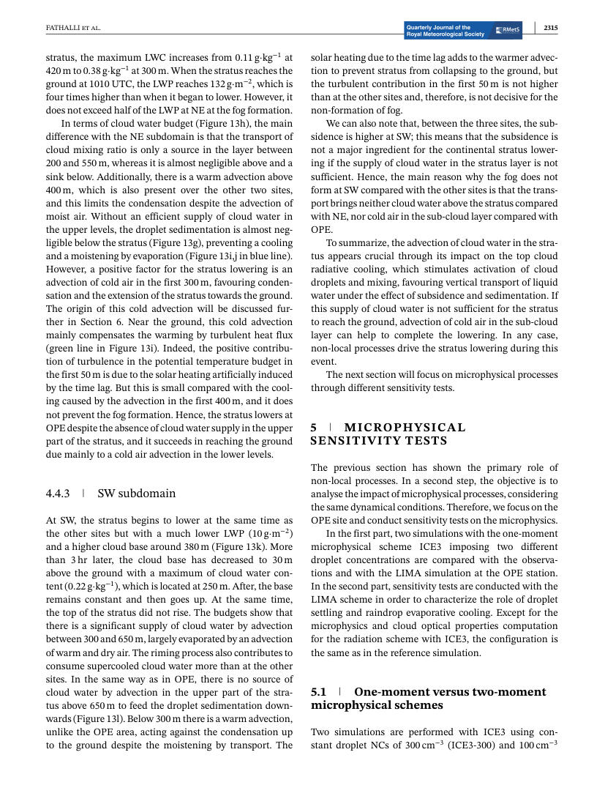

FATHALLI et al.
2315
stratus, the maximum LWC increases from 0.11 g⋅kg−1 at
420 m to 0.38 g⋅kg−1 at 300 m. When the stratus reaches the
ground at 1010 UTC, the LWP reaches 132 g⋅m−2, which is
four times higher than when it began to lower. However, it
does not exceed half of the LWP at NE at the fog formation.
In terms of cloud water budget (Figure 13h), the main
difference with the NE subdomain is that the transport of
cloud mixing ratio is only a source in the layer between
200 and 550 m, whereas it is almost negligible above and a
sink below. Additionally, there is a warm advection above
400 m, which is also present over the other two sites,
and this limits the condensation despite the advection of
moist air. Without an efficient supply of cloud water in
the upper levels, the droplet sedimentation is almost neg-
ligible below the stratus (Figure 13g), preventing a cooling
and a moistening by evaporation (Figure 13i,j in blue line).
However, a positive factor for the stratus lowering is an
advection of cold air in the first 300 m, favouring conden-
sation and the extension of the stratus towards the ground.
The origin of this cold advection will be discussed fur-
ther in Section 6. Near the ground, this cold advection
mainly compensates the warming by turbulent heat flux
(green line in Figure 13i). Indeed, the positive contribu-
tion of turbulence in the potential temperature budget in
the first 50 m is due to the solar heating artificially induced
by the time lag. But this is small compared with the cool-
ing caused by the advection in the first 400 m, and it does
not prevent the fog formation. Hence, the stratus lowers at
OPE despite the absence of cloud water supply in the upper
part of the stratus, and it succeeds in reaching the ground
due mainly to a cold air advection in the lower levels.
4.4.3
SW subdomain
At SW, the stratus begins to lower at the same time as
the other sites but with a much lower LWP (10 g⋅m−2)
and a higher cloud base around 380 m (Figure 13k). More
than 3 hr later, the cloud base has decreased to 30 m
above the ground with a maximum of cloud water con-
tent (0.22 g⋅kg−1), which is located at 250 m. After, the base
remains constant and then goes up. At the same time,
the top of the stratus did not rise. The budgets show that
there is a significant supply of cloud water by advection
between 300 and 650 m, largely evaporated by an advection
of warm and dry air. The riming process also contributes to
consume supercooled cloud water more than at the other
sites. In the same way as in OPE, there is no source of
cloud water by advection in the upper part of the stra-
tus above 650 m to feed the droplet sedimentation down-
wards (Figure 13l). Below 300 m there is a warm advection,
unlike the OPE area, acting against the condensation up
to the ground despite the moistening by transport. The
solar heating due to the time lag adds to the warmer advec-
tion to prevent stratus from collapsing to the ground, but
the turbulent contribution in the first 50 m is not higher
than at the other sites and, therefore, is not decisive for the
non-formation of fog.
We can also note that, between the three sites, the sub-
sidence is higher at SW; this means that the subsidence is
not a major ingredient for the continental stratus lower-
ing if the supply of cloud water in the stratus layer is not
sufficient. Hence, the main reason why the fog does not
form at SW compared with the other sites is that the trans-
port brings neither cloud water above the stratus compared
with NE, nor cold air in the sub-cloud layer compared with
OPE.
To summarize, the advection of cloud water in the stra-
tus appears crucial through its impact on the top cloud
radiative cooling, which stimulates activation of cloud
droplets and mixing, favouring vertical transport of liquid
water under the effect of subsidence and sedimentation. If
this supply of cloud water is not sufficient for the stratus
to reach the ground, advection of cold air in the sub-cloud
layer can help to complete the lowering. In any case,
non-local processes drive the stratus lowering during this
event.
The next section will focus on microphysical processes
through different sensitivity tests.
5
MICROPHYSICAL
SENSITIVITY TESTS
The previous section has shown the primary role of
non-local processes. In a second step, the objective is to
analyse the impact of microphysical processes, considering
the same dynamical conditions. Therefore, we focus on the
OPE site and conduct sensitivity tests on the microphysics.
In the first part, two simulations with the one-moment
microphysical scheme ICE3 imposing two different
droplet concentrations are compared with the observa-
tions and with the LIMA simulation at the OPE station.
In the second part, sensitivity tests are conducted with the
LIMA scheme in order to characterize the role of droplet
settling and raindrop evaporative cooling. Except for the
microphysics and cloud optical properties computation
for the radiation scheme with ICE3, the configuration is
the same as in the reference simulation.
5.1
One-moment versus two-moment
microphysical schemes
Two simulations are performed with ICE3 using con-
stant droplet NCs of 300 cm−3 (ICE3-300) and 100 cm−3

## Page 19

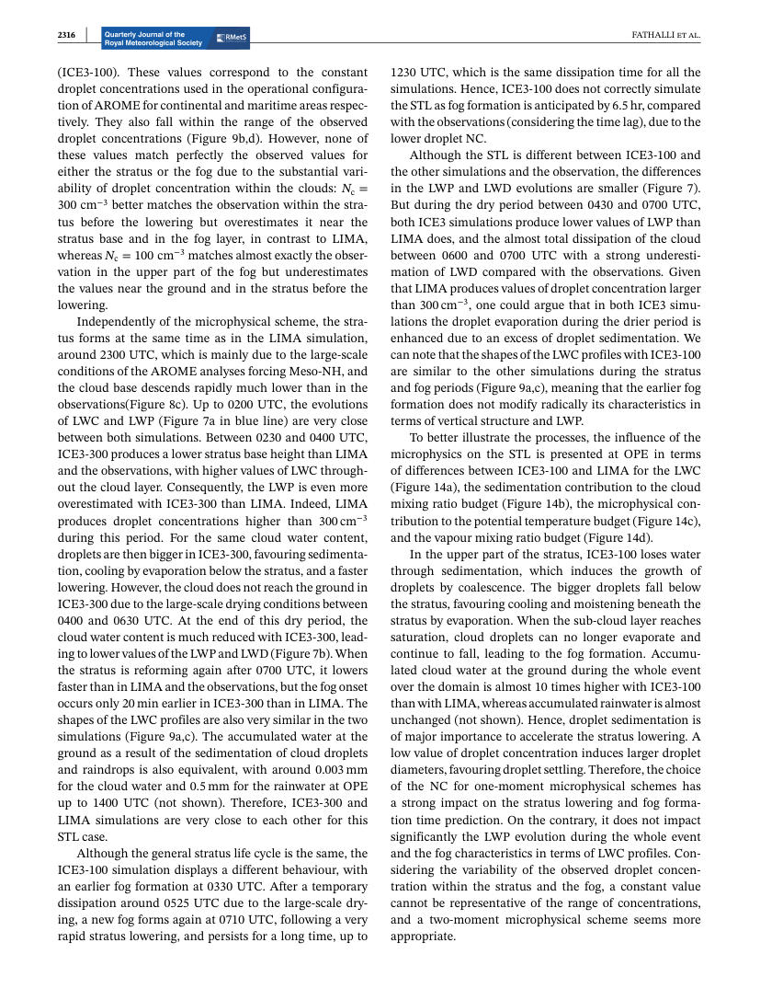

2316
FATHALLI et al.
(ICE3-100). These values correspond to the constant
droplet concentrations used in the operational configura-
tion of AROME for continental and maritime areas respec-
tively. They also fall within the range of the observed
droplet concentrations (Figure 9b,d). However, none of
these values match perfectly the observed values for
either the stratus or the fog due to the substantial vari-
ability of droplet concentration within the clouds: Nc =
300 cm−3 better matches the observation within the stra-
tus before the lowering but overestimates it near the
stratus base and in the fog layer, in contrast to LIMA,
whereas Nc = 100 cm−3 matches almost exactly the obser-
vation in the upper part of the fog but underestimates
the values near the ground and in the stratus before the
lowering.
Independently of the microphysical scheme, the stra-
tus forms at the same time as in the LIMA simulation,
around 2300 UTC, which is mainly due to the large-scale
conditions of the AROME analyses forcing Meso-NH, and
the cloud base descends rapidly much lower than in the
observations(Figure 8c). Up to 0200 UTC, the evolutions
of LWC and LWP (Figure 7a in blue line) are very close
between both simulations. Between 0230 and 0400 UTC,
ICE3-300 produces a lower stratus base height than LIMA
and the observations, with higher values of LWC through-
out the cloud layer. Consequently, the LWP is even more
overestimated with ICE3-300 than LIMA. Indeed, LIMA
produces droplet concentrations higher than 300 cm−3
during this period. For the same cloud water content,
droplets are then bigger in ICE3-300, favouring sedimenta-
tion, cooling by evaporation below the stratus, and a faster
lowering. However, the cloud does not reach the ground in
ICE3-300 due to the large-scale drying conditions between
0400 and 0630 UTC. At the end of this dry period, the
cloud water content is much reduced with ICE3-300, lead-
ing to lower values of the LWP and LWD (Figure 7b). When
the stratus is reforming again after 0700 UTC, it lowers
faster than in LIMA and the observations, but the fog onset
occurs only 20 min earlier in ICE3-300 than in LIMA. The
shapes of the LWC profiles are also very similar in the two
simulations (Figure 9a,c). The accumulated water at the
ground as a result of the sedimentation of cloud droplets
and raindrops is also equivalent, with around 0.003 mm
for the cloud water and 0.5 mm for the rainwater at OPE
up to 1400 UTC (not shown). Therefore, ICE3-300 and
LIMA simulations are very close to each other for this
STL case.
Although the general stratus life cycle is the same, the
ICE3-100 simulation displays a different behaviour, with
an earlier fog formation at 0330 UTC. After a temporary
dissipation around 0525 UTC due to the large-scale dry-
ing, a new fog forms again at 0710 UTC, following a very
rapid stratus lowering, and persists for a long time, up to
1230 UTC, which is the same dissipation time for all the
simulations. Hence, ICE3-100 does not correctly simulate
the STL as fog formation is anticipated by 6.5 hr, compared
with the observations (considering the time lag), due to the
lower droplet NC.
Although the STL is different between ICE3-100 and
the other simulations and the observation, the differences
in the LWP and LWD evolutions are smaller (Figure 7).
But during the dry period between 0430 and 0700 UTC,
both ICE3 simulations produce lower values of LWP than
LIMA does, and the almost total dissipation of the cloud
between 0600 and 0700 UTC with a strong underesti-
mation of LWD compared with the observations. Given
that LIMA produces values of droplet concentration larger
than 300 cm−3, one could argue that in both ICE3 simu-
lations the droplet evaporation during the drier period is
enhanced due to an excess of droplet sedimentation. We
can note that the shapes of the LWC profiles with ICE3-100
are similar to the other simulations during the stratus
and fog periods (Figure 9a,c), meaning that the earlier fog
formation does not modify radically its characteristics in
terms of vertical structure and LWP.
To better illustrate the processes, the influence of the
microphysics on the STL is presented at OPE in terms
of differences between ICE3-100 and LIMA for the LWC
(Figure 14a), the sedimentation contribution to the cloud
mixing ratio budget (Figure 14b), the microphysical con-
tribution to the potential temperature budget (Figure 14c),
and the vapour mixing ratio budget (Figure 14d).
In the upper part of the stratus, ICE3-100 loses water
through sedimentation, which induces the growth of
droplets by coalescence. The bigger droplets fall below
the stratus, favouring cooling and moistening beneath the
stratus by evaporation. When the sub-cloud layer reaches
saturation, cloud droplets can no longer evaporate and
continue to fall, leading to the fog formation. Accumu-
lated cloud water at the ground during the whole event
over the domain is almost 10 times higher with ICE3-100
than with LIMA, whereas accumulated rainwater is almost
unchanged (not shown). Hence, droplet sedimentation is
of major importance to accelerate the stratus lowering. A
low value of droplet concentration induces larger droplet
diameters, favouring droplet settling. Therefore, the choice
of the NC for one-moment microphysical schemes has
a strong impact on the stratus lowering and fog forma-
tion time prediction. On the contrary, it does not impact
significantly the LWP evolution during the whole event
and the fog characteristics in terms of LWC profiles. Con-
sidering the variability of the observed droplet concen-
tration within the stratus and the fog, a constant value
cannot be representative of the range of concentrations,
and a two-moment microphysical scheme seems more
appropriate.

## Page 20

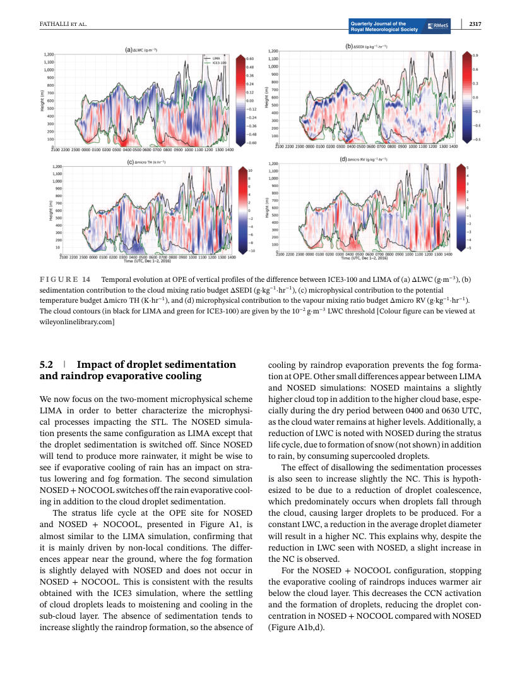

FATHALLI et al.
2317
F I G U R E 14
Temporal evolution at OPE of vertical profiles of the difference between ICE3-100 and LIMA of (a) ΔLWC (g⋅m−3), (b)
sedimentation contribution to the cloud mixing ratio budget ΔSEDI (g⋅kg−1⋅hr−1), (c) microphysical contribution to the potential
temperature budget Δmicro TH (K⋅hr−1), and (d) microphysical contribution to the vapour mixing ratio budget Δmicro RV (g⋅kg−1⋅hr−1).
The cloud contours (in black for LIMA and green for ICE3-100) are given by the 10−2 g⋅m−3 LWC threshold [Colour figure can be viewed at
wileyonlinelibrary.com]
5.2
Impact of droplet sedimentation
and raindrop evaporative cooling
We now focus on the two-moment microphysical scheme
LIMA in order to better characterize the microphysi-
cal processes impacting the STL. The NOSED simula-
tion presents the same configuration as LIMA except that
the droplet sedimentation is switched off. Since NOSED
will tend to produce more rainwater, it might be wise to
see if evaporative cooling of rain has an impact on stra-
tus lowering and fog formation. The second simulation
NOSED + NOCOOL switches off the rain evaporative cool-
ing in addition to the cloud droplet sedimentation.
The stratus life cycle at the OPE site for NOSED
and NOSED + NOCOOL, presented in Figure A1, is
almost similar to the LIMA simulation, confirming that
it is mainly driven by non-local conditions. The differ-
ences appear near the ground, where the fog formation
is slightly delayed with NOSED and does not occur in
NOSED + NOCOOL. This is consistent with the results
obtained with the ICE3 simulation, where the settling
of cloud droplets leads to moistening and cooling in the
sub-cloud layer. The absence of sedimentation tends to
increase slightly the raindrop formation, so the absence of
cooling by raindrop evaporation prevents the fog forma-
tion at OPE. Other small differences appear between LIMA
and NOSED simulations: NOSED maintains a slightly
higher cloud top in addition to the higher cloud base, espe-
cially during the dry period between 0400 and 0630 UTC,
as the cloud water remains at higher levels. Additionally, a
reduction of LWC is noted with NOSED during the stratus
life cycle, due to formation of snow (not shown) in addition
to rain, by consuming supercooled droplets.
The effect of disallowing the sedimentation processes
is also seen to increase slightly the NC. This is hypoth-
esized to be due to a reduction of droplet coalescence,
which predominately occurs when droplets fall through
the cloud, causing larger droplets to be produced. For a
constant LWC, a reduction in the average droplet diameter
will result in a higher NC. This explains why, despite the
reduction in LWC seen with NOSED, a slight increase in
the NC is observed.
For the NOSED + NOCOOL configuration, stopping
the evaporative cooling of raindrops induces warmer air
below the cloud layer. This decreases the CCN activation
and the formation of droplets, reducing the droplet con-
centration in NOSED + NOCOOL compared with NOSED
(Figure A1b,d).

## Page 21

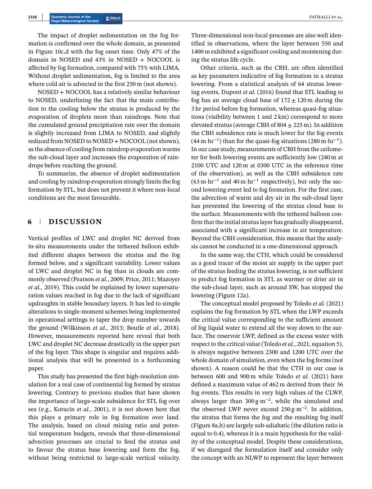

2318
FATHALLI et al.
The impact of droplet sedimentation on the fog for-
mation is confirmed over the whole domain, as presented
in Figure 10c,d with the fog onset time. Only 47% of the
domain in NOSED and 43% in NOSED + NOCOOL is
affected by fog formation, compared with 75% with LIMA.
Without droplet sedimentation, fog is limited to the area
where cold air is advected in the first 250 m (not shown).
NOSED + NOCOOL has a relatively similar behaviour
to NOSED, underlining the fact that the main contribu-
tion to the cooling below the stratus is produced by the
evaporation of droplets more than raindrops. Note that
the cumulated ground precipitation rate over the domain
is slightly increased from LIMA to NOSED, and slightly
reduced from NOSED to NOSED + NOCOOL (not shown),
as the absence of cooling from raindrop evaporation warms
the sub-cloud layer and increases the evaporation of rain-
drops before reaching the ground.
To summarize, the absence of droplet sedimentation
and cooling by raindrop evaporation strongly limits the fog
formation by STL, but does not prevent it where non-local
conditions are the most favourable.
6
DISCUSSION
Vertical profiles of LWC and droplet NC derived from
in-situ measurements under the tethered balloon exhib-
ited different shapes between the stratus and the fog
formed below, and a significant variability. Lower values
of LWC and droplet NC in fog than in clouds are com-
monly observed (Pearson et al., 2009; Price, 2011; Mazoyer
et al., 2019). This could be explained by lower supersatu-
ration values reached in fog due to the lack of significant
updraughts in stable boundary layers. It has led to simple
alterations to single-moment schemes being implemented
in operational settings to taper the drop number towards
the ground (Wilkinson et al., 2013; Boutle et al., 2018).
However, measurements reported here reveal that both
LWC and droplet NC decrease drastically in the upper part
of the fog layer. This shape is singular and requires addi-
tional analysis that will be presented in a forthcoming
paper.
This study has presented the first high-resolution sim-
ulation for a real case of continental fog formed by stratus
lowering. Contrary to previous studies that have shown
the importance of large-scale subsidence for STL fog over
sea (e.g., Koracin et al., 2001), it is not shown here that
this plays a primary role in fog formation over land.
The analysis, based on cloud mixing ratio and poten-
tial temperature budgets, reveals that three-dimensional
advection processes are crucial to feed the stratus and
to favour the stratus base lowering and form the fog,
without being restricted to large-scale vertical velocity.
Three-dimensional non-local processes are also well iden-
tified in observations, where the layer between 550 and
1400 m exhibited a significant cooling and moistening dur-
ing the stratus life cycle.
Other criteria, such as the CBH, are often identified
as key parameters indicative of fog formation in a stratus
lowering. From a statistical analysis of 64 stratus lower-
ing events, Dupont et al. (2016) found that STL leading to
fog has an average cloud base of 172 ± 120 m during the
3 hr period before fog formation, whereas quasi-fog situa-
tions (visibility between 1 and 2 km) correspond to more
elevated stratus (average CBH of 804 ± 225 m). In addition
the CBH subsidence rate is much lower for the fog events
(44 m⋅hr−1) than for the quasi-fog situations (280 m⋅hr−1).
In our case study, measurements of CBH from the ceilome-
ter for both lowering events are sufficiently low (240 m at
2100 UTC and 120 m at 0300 UTC in the reference time
of the observation), as well as the CBH subsidence rate
(63 m⋅hr−1 and 40 m⋅hr−1 respectively), but only the sec-
ond lowering event led to fog formation. For the first case,
the advection of warm and dry air in the sub-cloud layer
has prevented the lowering of the stratus cloud base to
the surface. Measurements with the tethered balloon con-
firm that the initial stratus layer has gradually disappeared,
associated with a significant increase in air temperature.
Beyond the CBH consideration, this means that the analy-
sis cannot be conducted in a one-dimensional approach.
In the same way, the CTH, which could be considered
as a good tracer of the moist air supply in the upper part
of the stratus feeding the stratus lowering, is not sufficient
to predict fog formation in STL as warmer or drier air in
the sub-cloud layer, such as around SW, has stopped the
lowering (Figure 12a).
The conceptual model proposed by Toledo et al. (2021)
explains the fog formation by STL when the LWP exceeds
the critical value corresponding to the sufficient amount
of fog liquid water to extend all the way down to the sur-
face. The reservoir LWP, defined as the excess water with
respect to the critical value (Toledo et al., 2021, equation 5),
is always negative between 2300 and 1200 UTC over the
whole domain of simulation, even when the fog forms (not
shown). A reason could be that the CTH in our case is
between 600 and 900 m while Toledo et al. (2021) have
defined a maximum value of 462 m derived from their 56
fog events. This results in very high values of the CLWP,
always larger than 300 g⋅m−2, while the simulated and
the observed LWP never exceed 250 g⋅m−2. In addition,
the stratus that forms the fog and the resulting fog itself
(Figure 8a,b) are largely sub-adiabatic (the dilution ratio is
equal to 0.4), whereas it is a main hypothesis for the valid-
ity of the conceptual model. Despite these considerations,
if we disregard the formulation itself and consider only
the concept with an NLWP to represent the layer between

## Page 22

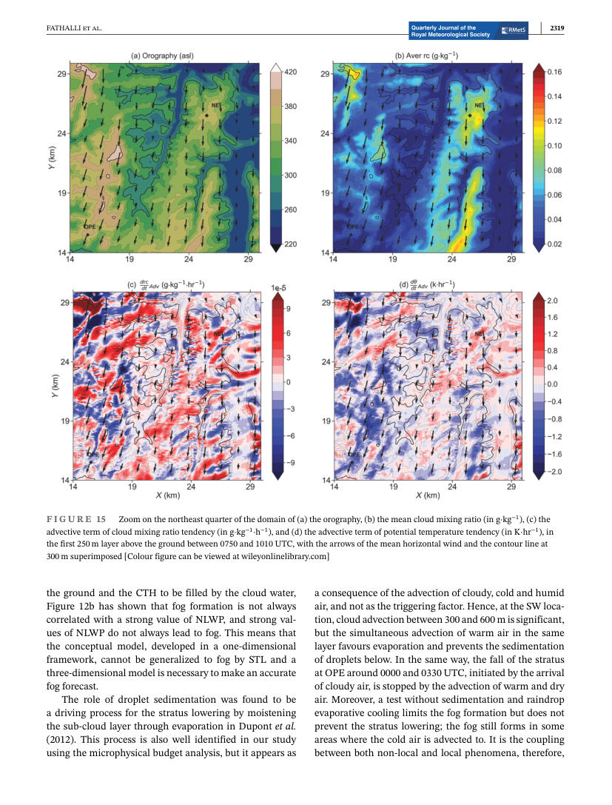

FATHALLI et al.
2319
F I G U R E 15
Zoom on the northeast quarter of the domain of (a) the orography, (b) the mean cloud mixing ratio (in g⋅kg−1), (c) the
advective term of cloud mixing ratio tendency (in g⋅kg−1⋅h−1), and (d) the advective term of potential temperature tendency (in K⋅hr−1), in
the first 250 m layer above the ground between 0750 and 1010 UTC, with the arrows of the mean horizontal wind and the contour line at
300 m superimposed [Colour figure can be viewed at wileyonlinelibrary.com]
the ground and the CTH to be filled by the cloud water,
Figure 12b has shown that fog formation is not always
correlated with a strong value of NLWP, and strong val-
ues of NLWP do not always lead to fog. This means that
the conceptual model, developed in a one-dimensional
framework, cannot be generalized to fog by STL and a
three-dimensional model is necessary to make an accurate
fog forecast.
The role of droplet sedimentation was found to be
a driving process for the stratus lowering by moistening
the sub-cloud layer through evaporation in Dupont et al.
(2012). This process is also well identified in our study
using the microphysical budget analysis, but it appears as
a consequence of the advection of cloudy, cold and humid
air, and not as the triggering factor. Hence, at the SW loca-
tion, cloud advection between 300 and 600 m is significant,
but the simultaneous advection of warm air in the same
layer favours evaporation and prevents the sedimentation
of droplets below. In the same way, the fall of the stratus
at OPE around 0000 and 0330 UTC, initiated by the arrival
of cloudy air, is stopped by the advection of warm and dry
air. Moreover, a test without sedimentation and raindrop
evaporative cooling limits the fog formation but does not
prevent the stratus lowering; the fog still forms in some
areas where the cold air is advected to. It is the coupling
between both non-local and local phenomena, therefore,

## Page 23

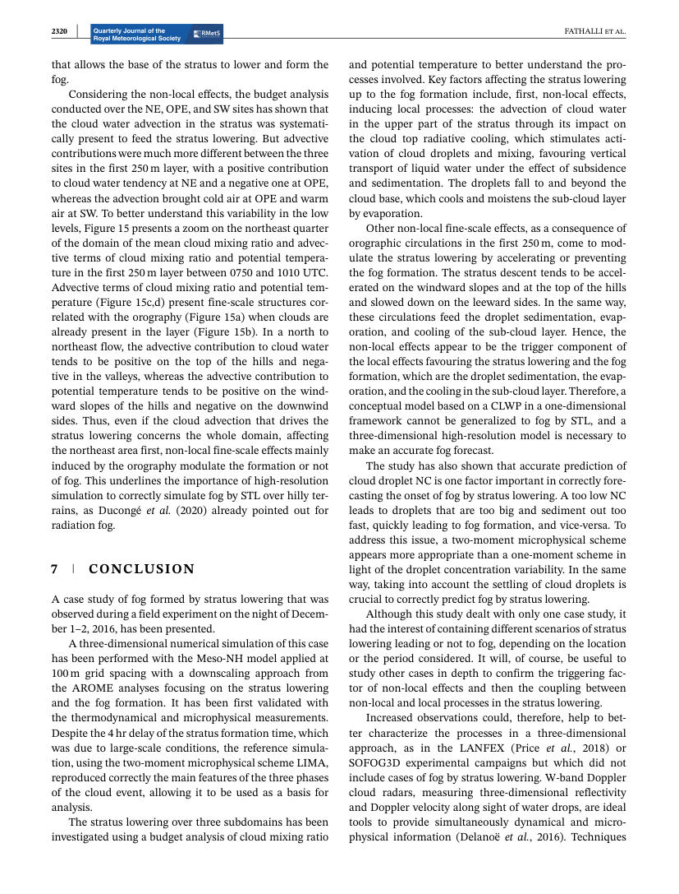

2320
FATHALLI et al.
that allows the base of the stratus to lower and form the
fog.
Considering the non-local effects, the budget analysis
conducted over the NE, OPE, and SW sites has shown that
the cloud water advection in the stratus was systemati-
cally present to feed the stratus lowering. But advective
contributions were much more different between the three
sites in the first 250 m layer, with a positive contribution
to cloud water tendency at NE and a negative one at OPE,
whereas the advection brought cold air at OPE and warm
air at SW. To better understand this variability in the low
levels, Figure 15 presents a zoom on the northeast quarter
of the domain of the mean cloud mixing ratio and advec-
tive terms of cloud mixing ratio and potential tempera-
ture in the first 250 m layer between 0750 and 1010 UTC.
Advective terms of cloud mixing ratio and potential tem-
perature (Figure 15c,d) present fine-scale structures cor-
related with the orography (Figure 15a) when clouds are
already present in the layer (Figure 15b). In a north to
northeast flow, the advective contribution to cloud water
tends to be positive on the top of the hills and nega-
tive in the valleys, whereas the advective contribution to
potential temperature tends to be positive on the wind-
ward slopes of the hills and negative on the downwind
sides. Thus, even if the cloud advection that drives the
stratus lowering concerns the whole domain, affecting
the northeast area first, non-local fine-scale effects mainly
induced by the orography modulate the formation or not
of fog. This underlines the importance of high-resolution
simulation to correctly simulate fog by STL over hilly ter-
rains, as Ducongé et al. (2020) already pointed out for
radiation fog.
7
CONCLUSION
A case study of fog formed by stratus lowering that was
observed during a field experiment on the night of Decem-
ber 1–2, 2016, has been presented.
A three-dimensional numerical simulation of this case
has been performed with the Meso-NH model applied at
100 m grid spacing with a downscaling approach from
the AROME analyses focusing on the stratus lowering
and the fog formation. It has been first validated with
the thermodynamical and microphysical measurements.
Despite the 4 hr delay of the stratus formation time, which
was due to large-scale conditions, the reference simula-
tion, using the two-moment microphysical scheme LIMA,
reproduced correctly the main features of the three phases
of the cloud event, allowing it to be used as a basis for
analysis.
The stratus lowering over three subdomains has been
investigated using a budget analysis of cloud mixing ratio
and potential temperature to better understand the pro-
cesses involved. Key factors affecting the stratus lowering
up to the fog formation include, first, non-local effects,
inducing local processes: the advection of cloud water
in the upper part of the stratus through its impact on
the cloud top radiative cooling, which stimulates acti-
vation of cloud droplets and mixing, favouring vertical
transport of liquid water under the effect of subsidence
and sedimentation. The droplets fall to and beyond the
cloud base, which cools and moistens the sub-cloud layer
by evaporation.
Other non-local fine-scale effects, as a consequence of
orographic circulations in the first 250 m, come to mod-
ulate the stratus lowering by accelerating or preventing
the fog formation. The stratus descent tends to be accel-
erated on the windward slopes and at the top of the hills
and slowed down on the leeward sides. In the same way,
these circulations feed the droplet sedimentation, evap-
oration, and cooling of the sub-cloud layer. Hence, the
non-local effects appear to be the trigger component of
the local effects favouring the stratus lowering and the fog
formation, which are the droplet sedimentation, the evap-
oration, and the cooling in the sub-cloud layer. Therefore, a
conceptual model based on a CLWP in a one-dimensional
framework cannot be generalized to fog by STL, and a
three-dimensional high-resolution model is necessary to
make an accurate fog forecast.
The study has also shown that accurate prediction of
cloud droplet NC is one factor important in correctly fore-
casting the onset of fog by stratus lowering. A too low NC
leads to droplets that are too big and sediment out too
fast, quickly leading to fog formation, and vice-versa. To
address this issue, a two-moment microphysical scheme
appears more appropriate than a one-moment scheme in
light of the droplet concentration variability. In the same
way, taking into account the settling of cloud droplets is
crucial to correctly predict fog by stratus lowering.
Although this study dealt with only one case study, it
had the interest of containing different scenarios of stratus
lowering leading or not to fog, depending on the location
or the period considered. It will, of course, be useful to
study other cases in depth to confirm the triggering fac-
tor of non-local effects and then the coupling between
non-local and local processes in the stratus lowering.
Increased observations could, therefore, help to bet-
ter characterize the processes in a three-dimensional
approach, as in the LANFEX (Price et al., 2018) or
SOFOG3D experimental campaigns but which did not
include cases of fog by stratus lowering. W-band Doppler
cloud radars, measuring three-dimensional reflectivity
and Doppler velocity along sight of water drops, are ideal
tools to provide simultaneously dynamical and micro-
physical information (Delanoë et al., 2016). Techniques

## Page 24

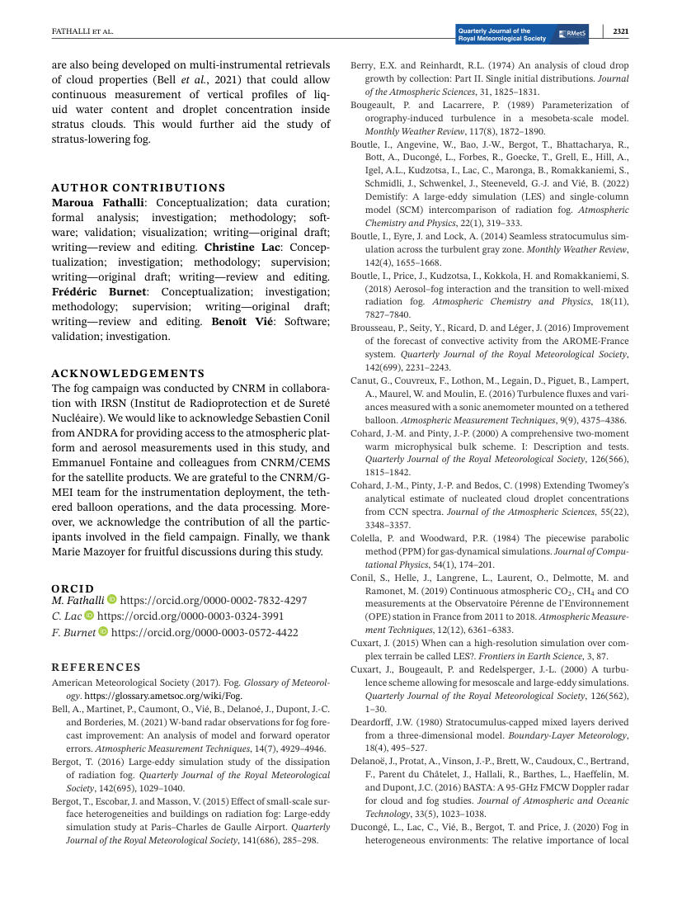

FATHALLI et al.
2321
are also being developed on multi-instrumental retrievals
of cloud properties (Bell et al., 2021) that could allow
continuous measurement of vertical profiles of liq-
uid water content and droplet concentration inside
stratus clouds. This would further aid the study of
stratus-lowering fog.
AUTHOR CONTRIBUTIONS
Maroua Fathalli: Conceptualization; data curation;
formal
analysis;
investigation;
methodology;
soft-
ware; validation; visualization; writing—original draft;
writing—review and editing. Christine Lac: Concep-
tualization;
investigation;
methodology;
supervision;
writing—original draft; writing—review and editing.
Frédéric
Burnet:
Conceptualization;
investigation;
methodology;
supervision;
writing—original
draft;
writing—review and editing. Benoît Vié: Software;
validation; investigation.
ACKNOWLEDGEMENTS
The fog campaign was conducted by CNRM in collabora-
tion with IRSN (Institut de Radioprotection et de Sureté
Nucléaire). We would like to acknowledge Sebastien Conil
from ANDRA for providing access to the atmospheric plat-
form and aerosol measurements used in this study, and
Emmanuel Fontaine and colleagues from CNRM/CEMS
for the satellite products. We are grateful to the CNRM/G-
MEI team for the instrumentation deployment, the teth-
ered balloon operations, and the data processing. More-
over, we acknowledge the contribution of all the partic-
ipants involved in the field campaign. Finally, we thank
Marie Mazoyer for fruitful discussions during this study.
ORCID
M. Fathalli
https://orcid.org/0000-0002-7832-4297
C. Lac
https://orcid.org/0000-0003-0324-3991
F. Burnet
https://orcid.org/0000-0003-0572-4422
REFERENCES
American Meteorological Society (2017). Fog. Glossary of Meteorol-
ogy. https://glossary.ametsoc.org/wiki/Fog.
Bell, A., Martinet, P., Caumont, O., Vié, B., Delanoé, J., Dupont, J.-C.
and Borderies, M. (2021) W-band radar observations for fog fore-
cast improvement: An analysis of model and forward operator
errors. Atmospheric Measurement Techniques, 14(7), 4929–4946.
Bergot, T. (2016) Large-eddy simulation study of the dissipation
of radiation fog. Quarterly Journal of the Royal Meteorological
Society, 142(695), 1029–1040.
Bergot, T., Escobar, J. and Masson, V. (2015) Effect of small-scale sur-
face heterogeneities and buildings on radiation fog: Large-eddy
simulation study at Paris–Charles de Gaulle Airport. Quarterly
Journal of the Royal Meteorological Society, 141(686), 285–298.
Berry, E.X. and Reinhardt, R.L. (1974) An analysis of cloud drop
growth by collection: Part II. Single initial distributions. Journal
of the Atmospheric Sciences, 31, 1825–1831.
Bougeault,
P.
and
Lacarrere,
P.
(1989)
Parameterization
of
orography-induced turbulence in a mesobeta-scale model.
Monthly Weather Review, 117(8), 1872–1890.
Boutle, I., Angevine, W., Bao, J.-W., Bergot, T., Bhattacharya, R.,
Bott, A., Ducongé, L., Forbes, R., Goecke, T., Grell, E., Hill, A.,
Igel, A.L., Kudzotsa, I., Lac, C., Maronga, B., Romakkaniemi, S.,
Schmidli, J., Schwenkel, J., Steeneveld, G.-J. and Vié, B. (2022)
Demistify: A large-eddy simulation (LES) and single-column
model (SCM) intercomparison of radiation fog. Atmospheric
Chemistry and Physics, 22(1), 319–333.
Boutle, I., Eyre, J. and Lock, A. (2014) Seamless stratocumulus sim-
ulation across the turbulent gray zone. Monthly Weather Review,
142(4), 1655–1668.
Boutle, I., Price, J., Kudzotsa, I., Kokkola, H. and Romakkaniemi, S.
(2018) Aerosol–fog interaction and the transition to well-mixed
radiation fog. Atmospheric Chemistry and Physics, 18(11),
7827–7840.
Brousseau, P., Seity, Y., Ricard, D. and Léger, J. (2016) Improvement
of the forecast of convective activity from the AROME-France
system. Quarterly Journal of the Royal Meteorological Society,
142(699), 2231–2243.
Canut, G., Couvreux, F., Lothon, M., Legain, D., Piguet, B., Lampert,
A., Maurel, W. and Moulin, E. (2016) Turbulence fluxes and vari-
ances measured with a sonic anemometer mounted on a tethered
balloon. Atmospheric Measurement Techniques, 9(9), 4375–4386.
Cohard, J.-M. and Pinty, J.-P. (2000) A comprehensive two-moment
warm microphysical bulk scheme. I: Description and tests.
Quarterly Journal of the Royal Meteorological Society, 126(566),
1815–1842.
Cohard, J.-M., Pinty, J.-P. and Bedos, C. (1998) Extending Twomey’s
analytical estimate of nucleated cloud droplet concentrations
from CCN spectra. Journal of the Atmospheric Sciences, 55(22),
3348–3357.
Colella, P. and Woodward, P.R. (1984) The piecewise parabolic
method (PPM) for gas-dynamical simulations. Journal of Compu-
tational Physics, 54(1), 174–201.
Conil, S., Helle, J., Langrene, L., Laurent, O., Delmotte, M. and
Ramonet, M. (2019) Continuous atmospheric CO2, CH4 and CO
measurements at the Observatoire Pérenne de l’Environnement
(OPE) station in France from 2011 to 2018. Atmospheric Measure-
ment Techniques, 12(12), 6361–6383.
Cuxart, J. (2015) When can a high-resolution simulation over com-
plex terrain be called LES?. Frontiers in Earth Science, 3, 87.
Cuxart, J., Bougeault, P. and Redelsperger, J.-L. (2000) A turbu-
lence scheme allowing for mesoscale and large-eddy simulations.
Quarterly Journal of the Royal Meteorological Society, 126(562),
1–30.
Deardorff, J.W. (1980) Stratocumulus-capped mixed layers derived
from a three-dimensional model. Boundary-Layer Meteorology,
18(4), 495–527.
Delanoë, J., Protat, A., Vinson, J.-P., Brett, W., Caudoux, C., Bertrand,
F., Parent du Châtelet, J., Hallali, R., Barthes, L., Haeffelin, M.
and Dupont, J.C. (2016) BASTA: A 95-GHz FMCW Doppler radar
for cloud and fog studies. Journal of Atmospheric and Oceanic
Technology, 33(5), 1023–1038.
Ducongé, L., Lac, C., Vié, B., Bergot, T. and Price, J. (2020) Fog in
heterogeneous environments: The relative importance of local

## Page 25

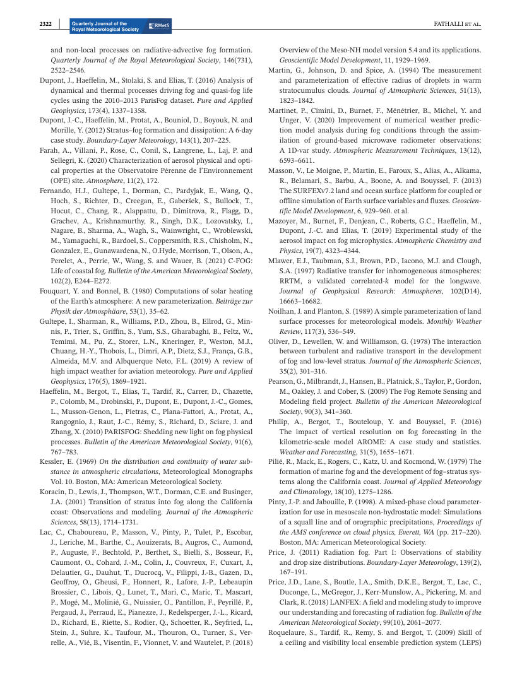

2322
FATHALLI et al.
and non-local processes on radiative-advective fog formation.
Quarterly Journal of the Royal Meteorological Society, 146(731),
2522–2546.
Dupont, J., Haeffelin, M., Stolaki, S. and Elias, T. (2016) Analysis of
dynamical and thermal processes driving fog and quasi-fog life
cycles using the 2010–2013 ParisFog dataset. Pure and Applied
Geophysics, 173(4), 1337–1358.
Dupont, J.-C., Haeffelin, M., Protat, A., Bouniol, D., Boyouk, N. and
Morille, Y. (2012) Stratus–fog formation and dissipation: A 6-day
case study. Boundary-Layer Meteorology, 143(1), 207–225.
Farah, A., Villani, P., Rose, C., Conil, S., Langrene, L., Laj, P. and
Sellegri, K. (2020) Characterization of aerosol physical and opti-
cal properties at the Observatoire Pérenne de l’Environnement
(OPE) site. Atmosphere, 11(2), 172.
Fernando, H.J., Gultepe, I., Dorman, C., Pardyjak, E., Wang, Q.,
Hoch, S., Richter, D., Creegan, E., Gaberšek, S., Bullock, T.,
Hocut, C., Chang, R., Alappattu, D., Dimitrova, R., Flagg, D.,
Grachev, A., Krishnamurthy, R., Singh, D.K., Lozovatsky, I.,
Nagare, B., Sharma, A., Wagh, S., Wainwright, C., Wroblewski,
M., Yamaguchi, R., Bardoel, S., Coppersmith, R.S., Chisholm, N.,
Gonzalez, E., Gunawardena, N., O.Hyde, Morrison, T., Olson, A.,
Perelet, A., Perrie, W., Wang, S. and Wauer, B. (2021) C-FOG:
Life of coastal fog. Bulletin of the American Meteorological Society,
102(2), E244–E272.
Fouquart, Y. and Bonnel, B. (1980) Computations of solar heating
of the Earth’s atmosphere: A new parameterization. Beiträge zur
Physik der Atmosphäare, 53(1), 35–62.
Gultepe, I., Sharman, R., Williams, P.D., Zhou, B., Ellrod, G., Min-
nis, P., Trier, S., Griffin, S., Yum, S.S., Gharabaghi, B., Feltz, W.,
Temimi, M., Pu, Z., Storer, L.N., Kneringer, P., Weston, M.J.,
Chuang, H.-Y., Thobois, L., Dimri, A.P., Dietz, S.J., França, G.B.,
Almeida, M.V. and Albquerque Neto, F.L. (2019) A review of
high impact weather for aviation meteorology. Pure and Applied
Geophysics, 176(5), 1869–1921.
Haeffelin, M., Bergot, T., Elias, T., Tardif, R., Carrer, D., Chazette,
P., Colomb, M., Drobinski, P., Dupont, E., Dupont, J.-C., Gomes,
L., Musson-Genon, L., Pietras, C., Plana-Fattori, A., Protat, A.,
Rangognio, J., Raut, J.-C., Rémy, S., Richard, D., Sciare, J. and
Zhang, X. (2010) PARISFOG: Shedding new light on fog physical
processes. Bulletin of the American Meteorological Society, 91(6),
767–783.
Kessler, E. (1969) On the distribution and continuity of water sub-
stance in atmospheric circulations, Meteorological Monographs
Vol. 10. Boston, MA: American Meteorological Society.
Koracin, D., Lewis, J., Thompson, W.T., Dorman, C.E. and Businger,
J.A. (2001) Transition of stratus into fog along the California
coast: Observations and modeling. Journal of the Atmospheric
Sciences, 58(13), 1714–1731.
Lac, C., Chaboureau, P., Masson, V., Pinty, P., Tulet, P., Escobar,
J., Leriche, M., Barthe, C., Aouizerats, B., Augros, C., Aumond,
P., Auguste, F., Bechtold, P., Berthet, S., Bielli, S., Bosseur, F.,
Caumont, O., Cohard, J.-M., Colin, J., Couvreux, F., Cuxart, J.,
Delautier, G., Dauhut, T., Ducrocq, V., Filippi, J.-B., Gazen, D.,
Geoffroy, O., Gheusi, F., Honnert, R., Lafore, J.-P., Lebeaupin
Brossier, C., Libois, Q., Lunet, T., Mari, C., Maric, T., Mascart,
P., Mogé, M., Molinié, G., Nuissier, O., Pantillon, F., Peyrillé, P.,
Pergaud, J., Perraud, E., Pianezze, J., Redelsperger, J.-L., Ricard,
D., Richard, E., Riette, S., Rodier, Q., Schoetter, R., Seyfried, L.,
Stein, J., Suhre, K., Taufour, M., Thouron, O., Turner, S., Ver-
relle, A., Vié, B., Visentin, F., Vionnet, V. and Wautelet, P. (2018)
Overview of the Meso-NH model version 5.4 and its applications.
Geoscientific Model Development, 11, 1929–1969.
Martin, G., Johnson, D. and Spice, A. (1994) The measurement
and parameterization of effective radius of droplets in warm
stratocumulus clouds. Journal of Atmospheric Sciences, 51(13),
1823–1842.
Martinet, P., Cimini, D., Burnet, F., Ménétrier, B., Michel, Y. and
Unger, V. (2020) Improvement of numerical weather predic-
tion model analysis during fog conditions through the assim-
ilation of ground-based microwave radiometer observations:
A 1D-var study. Atmospheric Measurement Techniques, 13(12),
6593–6611.
Masson, V., Le Moigne, P., Martin, E., Faroux, S., Alias, A., Alkama,
R., Belamari, S., Barbu, A., Boone, A. and Bouyssel, F. (2013)
The SURFEXv7.2 land and ocean surface platform for coupled or
offline simulation of Earth surface variables and fluxes. Geoscien-
tific Model Development, 6, 929–960. et al.
Mazoyer, M., Burnet, F., Denjean, C., Roberts, G.C., Haeffelin, M.,
Dupont, J.-C. and Elias, T. (2019) Experimental study of the
aerosol impact on fog microphysics. Atmospheric Chemistry and
Physics, 19(7), 4323–4344.
Mlawer, E.J., Taubman, S.J., Brown, P.D., Iacono, M.J. and Clough,
S.A. (1997) Radiative transfer for inhomogeneous atmospheres:
RRTM, a validated correlated-k model for the longwave.
Journal
of
Geophysical
Research:
Atmospheres,
102(D14),
16663–16682.
Noilhan, J. and Planton, S. (1989) A simple parameterization of land
surface processes for meteorological models. Monthly Weather
Review, 117(3), 536–549.
Oliver, D., Lewellen, W. and Williamson, G. (1978) The interaction
between turbulent and radiative transport in the development
of fog and low-level stratus. Journal of the Atmospheric Sciences,
35(2), 301–316.
Pearson, G., Milbrandt, J., Hansen, B., Platnick, S., Taylor, P., Gordon,
M., Oakley, J. and Cober, S. (2009) The Fog Remote Sensing and
Modeling field project. Bulletin of the American Meteorological
Society, 90(3), 341–360.
Philip, A., Bergot, T., Bouteloup, Y. and Bouyssel, F. (2016)
The impact of vertical resolution on fog forecasting in the
kilometric-scale model AROME: A case study and statistics.
Weather and Forecasting, 31(5), 1655–1671.
Pilié, R., Mack, E., Rogers, C., Katz, U. and Kocmond, W. (1979) The
formation of marine fog and the development of fog–stratus sys-
tems along the California coast. Journal of Applied Meteorology
and Climatology, 18(10), 1275–1286.
Pinty, J.-P. and Jabouille, P. (1998). A mixed-phase cloud parameter-
ization for use in mesoscale non-hydrostatic model: Simulations
of a squall line and of orographic precipitations, Proceedings of
the AMS conference on cloud physics, Everett, WA (pp. 217–220).
Boston, MA: American Meteorological Society.
Price, J. (2011) Radiation fog. Part I: Observations of stability
and drop size distributions. Boundary-Layer Meteorology, 139(2),
167–191.
Price, J.D., Lane, S., Boutle, I.A., Smith, D.K.E., Bergot, T., Lac, C.,
Duconge, L., McGregor, J., Kerr-Munslow, A., Pickering, M. and
Clark, R. (2018) LANFEX: A field and modeling study to improve
our understanding and forecasting of radiation fog. Bulletin of the
American Meteorological Society, 99(10), 2061–2077.
Roquelaure, S., Tardif, R., Remy, S. and Bergot, T. (2009) Skill of
a ceiling and visibility local ensemble prediction system (LEPS)

## Page 26

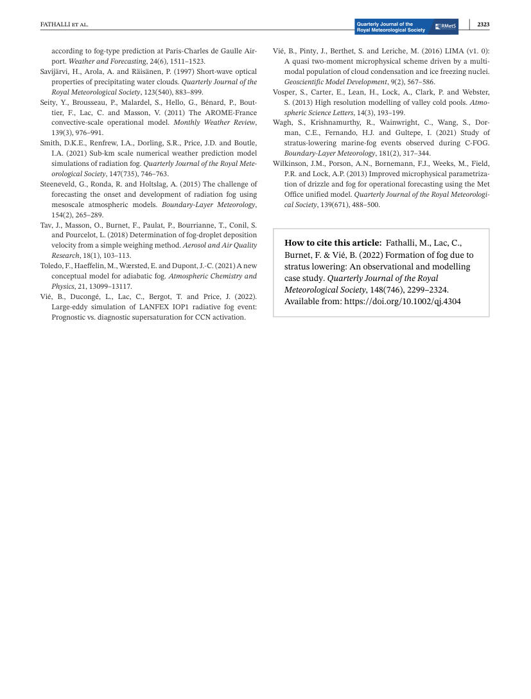

FATHALLI et al.
2323
according to fog-type prediction at Paris-Charles de Gaulle Air-
port. Weather and Forecasting, 24(6), 1511–1523.
Savijärvi, H., Arola, A. and Räisänen, P. (1997) Short-wave optical
properties of precipitating water clouds. Quarterly Journal of the
Royal Meteorological Society, 123(540), 883–899.
Seity, Y., Brousseau, P., Malardel, S., Hello, G., Bénard, P., Bout-
tier, F., Lac, C. and Masson, V. (2011) The AROME-France
convective-scale operational model. Monthly Weather Review,
139(3), 976–991.
Smith, D.K.E., Renfrew, I.A., Dorling, S.R., Price, J.D. and Boutle,
I.A. (2021) Sub-km scale numerical weather prediction model
simulations of radiation fog. Quarterly Journal of the Royal Mete-
orological Society, 147(735), 746–763.
Steeneveld, G., Ronda, R. and Holtslag, A. (2015) The challenge of
forecasting the onset and development of radiation fog using
mesoscale atmospheric models. Boundary-Layer Meteorology,
154(2), 265–289.
Tav, J., Masson, O., Burnet, F., Paulat, P., Bourrianne, T., Conil, S.
and Pourcelot, L. (2018) Determination of fog-droplet deposition
velocity from a simple weighing method. Aerosol and Air Quality
Research, 18(1), 103–113.
Toledo, F., Haeffelin, M., Wærsted, E. and Dupont, J.-C. (2021) A new
conceptual model for adiabatic fog. Atmospheric Chemistry and
Physics, 21, 13099–13117.
Vié, B., Ducongé, L., Lac, C., Bergot, T. and Price, J. (2022).
Large-eddy simulation of LANFEX IOP1 radiative fog event:
Prognostic vs. diagnostic supersaturation for CCN activation.
Vié, B., Pinty, J., Berthet, S. and Leriche, M. (2016) LIMA (v1. 0):
A quasi two-moment microphysical scheme driven by a multi-
modal population of cloud condensation and ice freezing nuclei.
Geoscientific Model Development, 9(2), 567–586.
Vosper, S., Carter, E., Lean, H., Lock, A., Clark, P. and Webster,
S. (2013) High resolution modelling of valley cold pools. Atmo-
spheric Science Letters, 14(3), 193–199.
Wagh, S., Krishnamurthy, R., Wainwright, C., Wang, S., Dor-
man, C.E., Fernando, H.J. and Gultepe, I. (2021) Study of
stratus-lowering marine-fog events observed during C-FOG.
Boundary-Layer Meteorology, 181(2), 317–344.
Wilkinson, J.M., Porson, A.N., Bornemann, F.J., Weeks, M., Field,
P.R. and Lock, A.P. (2013) Improved microphysical parametriza-
tion of drizzle and fog for operational forecasting using the Met
Office unified model. Quarterly Journal of the Royal Meteorologi-
cal Society, 139(671), 488–500.
How to cite this article: Fathalli, M., Lac, C.,
Burnet, F. & Vié, B. (2022) Formation of fog due to
stratus lowering: An observational and modelling
case study. Quarterly Journal of the Royal
Meteorological Society, 148(746), 2299–2324.
Available from: https://doi.org/10.1002/qj.4304

## Page 27

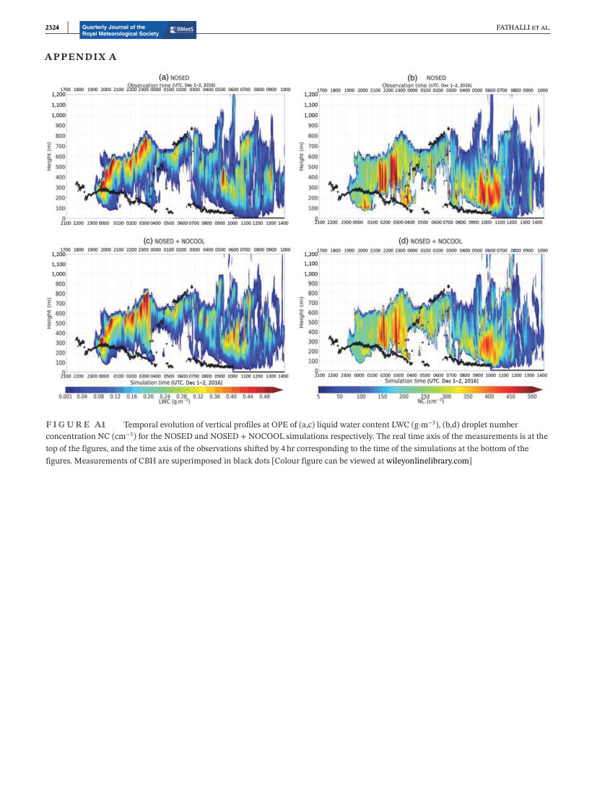

2324
FATHALLI et al.
APPENDIX A
F I G U R E A1
Temporal evolution of vertical profiles at OPE of (a,c) liquid water content LWC (g⋅m−3), (b,d) droplet number
concentration NC (cm−3) for the NOSED and NOSED + NOCOOL simulations respectively. The real time axis of the measurements is at the
top of the figures, and the time axis of the observations shifted by 4 hr corresponding to the time of the simulations at the bottom of the
figures. Measurements of CBH are superimposed in black dots [Colour figure can be viewed at wileyonlinelibrary.com]
