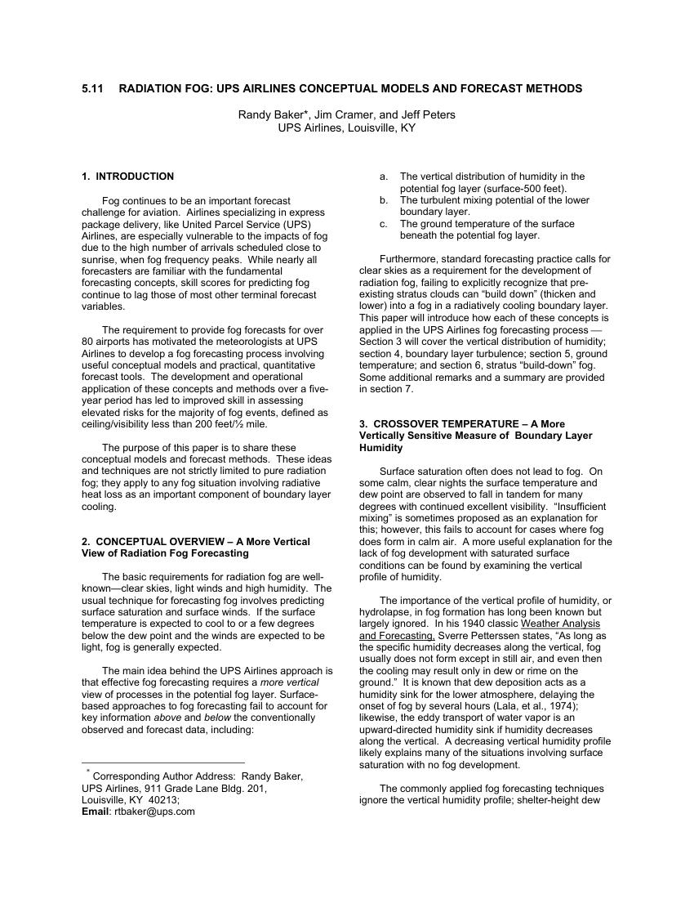
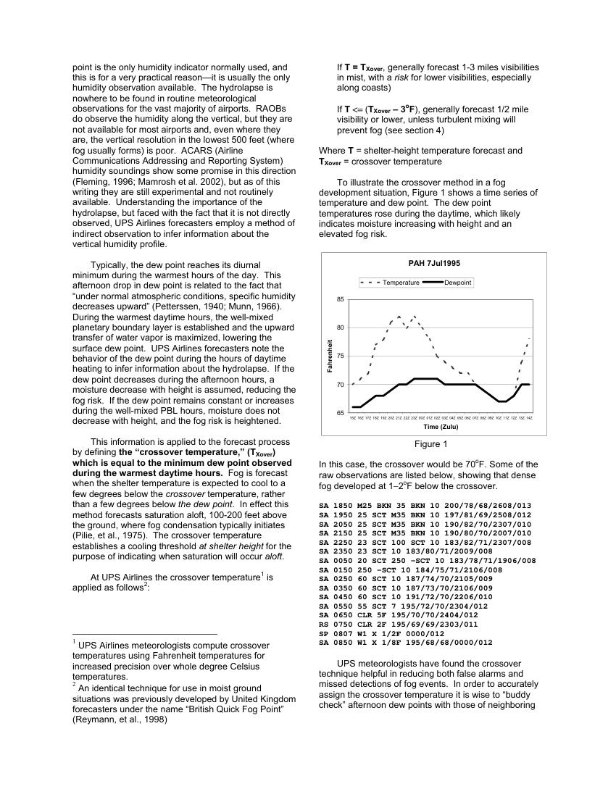
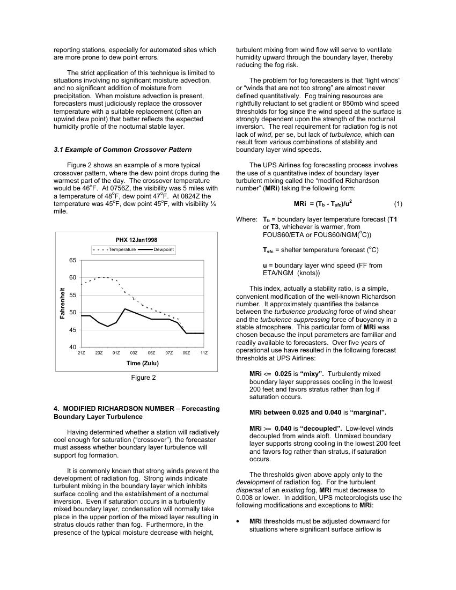
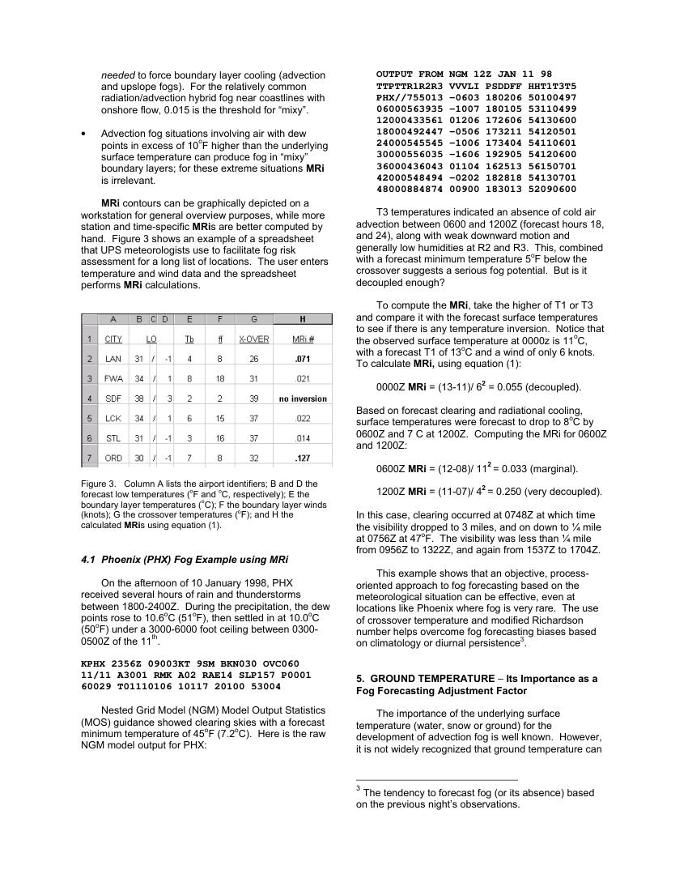
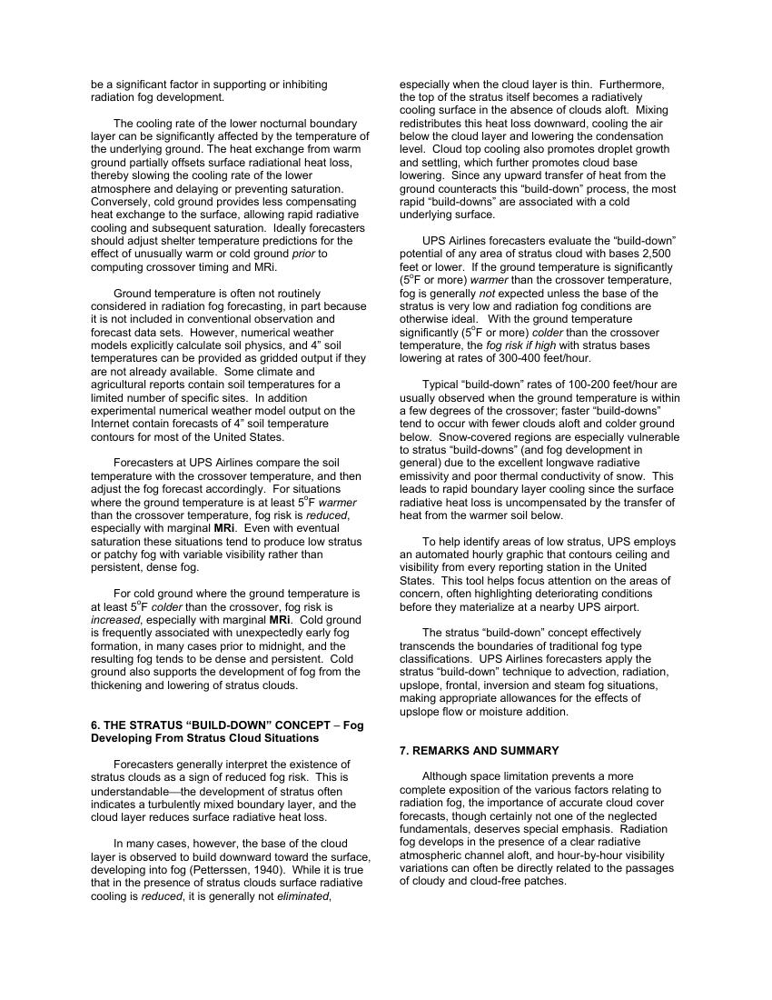
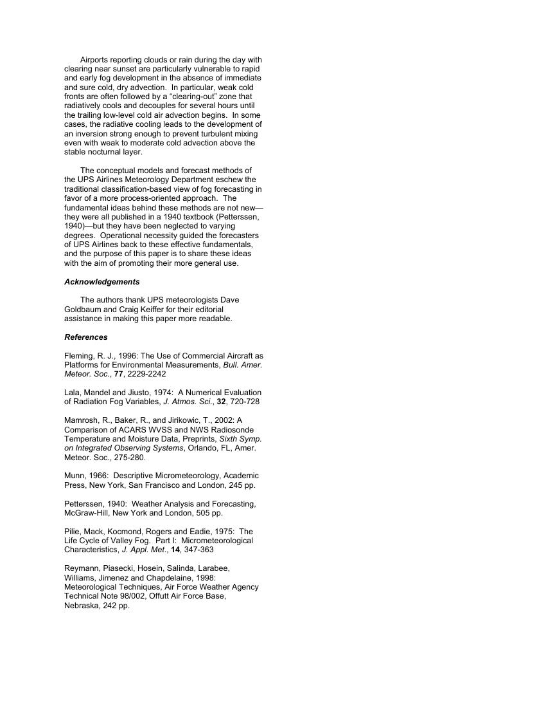

# UPS Fog Study

> Source: <http://www.weather.gov/media/zhu/ZHU_Training_Page/fog_stuff/fog_guide/UPS_Fog_Study.pdf>  
> Section: Fog/Dew/Frost  
> Captured: 2026-08-19 06:00 UTC  
> PDF: [ups-fog-study.pdf](ups-fog-study.pdf) (6 pages)

---

## Page 1

5.11    RADIATION FOG: UPS AIRLINES CONCEPTUAL MODELS AND FORECAST METHODS 
 
Randy Baker*, Jim Cramer, and Jeff Peters 
UPS Airlines, Louisville, KY 
 
 
1.  INTRODUCTION 
 
Fog continues to be an important forecast  
challenge for aviation.  Airlines specializing in express 
package delivery, like United Parcel Service (UPS) 
Airlines, are especially vulnerable to the impacts of fog 
due to the high number of arrivals scheduled close to 
sunrise, when fog frequency peaks.  While nearly all 
forecasters are familiar with the fundamental 
forecasting concepts, skill scores for predicting fog 
continue to lag those of most other terminal forecast 
variables.  
 
The requirement to provide fog forecasts for over 
80 airports has motivated the meteorologists at UPS 
Airlines to develop a fog forecasting process involving 
useful conceptual models and practical, quantitative 
forecast tools.  The development and operational 
application of these concepts and methods over a five-
year period has led to improved skill in assessing 
elevated risks for the majority of fog events, defined as 
ceiling/visibility less than 200 feet/½ mile. 
       
The purpose of this paper is to share these 
conceptual models and forecast methods.  These ideas 
and techniques are not strictly limited to pure radiation 
fog; they apply to any fog situation involving radiative 
heat loss as an important component of boundary layer 
cooling. 
 
 
2.  CONCEPTUAL OVERVIEW – A More Vertical 
View of Radiation Fog Forecasting  
 
The basic requirements for radiation fog are well-
known—clear skies, light winds and high humidity.  The 
usual technique for forecasting fog involves predicting 
surface saturation and surface winds.  If the surface 
temperature is expected to cool to or a few degrees 
below the dew point and the winds are expected to be 
light, fog is generally expected. 
 
  
The main idea behind the UPS Airlines approach is 
that effective fog forecasting requires a more vertical  
view of processes in the potential fog layer. Surface-
based approaches to fog forecasting fail to account for 
key information above and below the conventionally 
observed and forecast data, including: 
 
                                                          
  * Corresponding Author Address:  Randy Baker,  
UPS Airlines, 911 Grade Lane Bldg. 201,  
Louisville, KY  40213;   
Email: rtbaker@ups.com 
a. 
The vertical distribution of humidity in the 
potential fog layer (surface-500 feet). 
b. 
The turbulent mixing potential of the lower 
boundary layer. 
c. 
The ground temperature of the surface 
beneath the potential fog layer. 
 
Furthermore, standard forecasting practice calls for 
clear skies as a requirement for the development of 
radiation fog, failing to explicitly recognize that pre-
existing stratus clouds can “build down” (thicken and 
lower) into a fog in a radiatively cooling boundary layer.  
This paper will introduce how each of these concepts is 
applied in the UPS Airlines fog forecasting process  
Section 3 will cover the vertical distribution of humidity; 
section 4, boundary layer turbulence; section 5, ground 
temperature; and section 6, stratus “build-down” fog.   
Some additional remarks and a summary are provided 
in section 7. 
  
 
3.  CROSSOVER TEMPERATURE – A More 
Vertically Sensitive Measure of  Boundary Layer 
Humidity  
 
Surface saturation often does not lead to fog.  On 
some calm, clear nights the surface temperature and 
dew point are observed to fall in tandem for many 
degrees with continued excellent visibility.  “Insufficient 
mixing” is sometimes proposed as an explanation for 
this; however, this fails to account for cases where fog 
does form in calm air.  A more useful explanation for the 
lack of fog development with saturated surface 
conditions can be found by examining the vertical 
profile of humidity. 
 
The importance of the vertical profile of humidity, or 
hydrolapse, in fog formation has long been known but 
largely ignored.  In his 1940 classic Weather Analysis 
and Forecasting, Sverre Petterssen states, “As long as 
the specific humidity decreases along the vertical, fog 
usually does not form except in still air, and even then 
the cooling may result only in dew or rime on the 
ground.”  It is known that dew deposition acts as a 
humidity sink for the lower atmosphere, delaying the 
onset of fog by several hours (Lala, et al., 1974); 
likewise, the eddy transport of water vapor is an 
upward-directed humidity sink if humidity decreases 
along the vertical.  A decreasing vertical humidity profile 
likely explains many of the situations involving surface 
saturation with no fog development.   
 
The commonly applied fog forecasting techniques 
ignore the vertical humidity profile; shelter-height dew

## Page 2

point is the only humidity indicator normally used, and 
this is for a very practical reason—it is usually the only 
humidity observation available.  The hydrolapse is 
nowhere to be found in routine meteorological 
observations for the vast majority of airports.  RAOBs 
do observe the humidity along the vertical, but they are 
not available for most airports and, even where they 
are, the vertical resolution in the lowest 500 feet (where 
fog usually forms) is poor.  ACARS (Airline 
Communications Addressing and Reporting System) 
humidity soundings show some promise in this direction 
(Fleming, 1996; Mamrosh et al. 2002), but as of this 
writing they are still experimental and not routinely 
available.  Understanding the importance of the 
hydrolapse, but faced with the fact that it is not directly 
observed, UPS Airlines forecasters employ a method of 
indirect observation to infer information about the 
vertical humidity profile.   
 
Typically, the dew point reaches its diurnal 
minimum during the warmest hours of the day.  This 
afternoon drop in dew point is related to the fact that 
“under normal atmospheric conditions, specific humidity 
decreases upward” (Petterssen, 1940; Munn, 1966).   
During the warmest daytime hours, the well-mixed 
planetary boundary layer is established and the upward 
transfer of water vapor is maximized, lowering the 
surface dew point.  UPS Airlines forecasters note the 
behavior of the dew point during the hours of daytime 
heating to infer information about the hydrolapse.  If the 
dew point decreases during the afternoon hours, a 
moisture decrease with height is assumed, reducing the 
fog risk.  If the dew point remains constant or increases 
during the well-mixed PBL hours, moisture does not 
decrease with height, and the fog risk is heightened. 
  
This information is applied to the forecast process 
by defining the “crossover temperature,” (TXover) 
which is equal to the minimum dew point observed 
during the warmest daytime hours.  Fog is forecast 
when the shelter temperature is expected to cool to a 
few degrees below the crossover temperature, rather 
than a few degrees below the dew point.  In effect this 
method forecasts saturation aloft, 100-200 feet above 
the ground, where fog condensation typically initiates 
(Pilie, et al., 1975).  The crossover temperature 
establishes a cooling threshold at shelter height for the 
purpose of indicating when saturation will occur aloft. 
 
At UPS Airlines the crossover temperature1 is  
applied as follows2: 
 
                                                          
1 UPS Airlines meteorologists compute crossover 
temperatures using Fahrenheit temperatures for 
increased precision over whole degree Celsius 
temperatures. 
2 An identical technique for use in moist ground 
situations was previously developed by United Kingdom 
forecasters under the name “British Quick Fog Point” 
(Reymann, et al., 1998) 
If T = TXover, generally forecast 1-3 miles visibilities 
in mist, with a risk for lower visibilities, especially 
along coasts) 
 
If T <= (TXover – 3oF), generally forecast 1/2 mile  
visibility or lower, unless turbulent mixing will 
prevent fog (see section 4) 
 
Where T = shelter-height temperature forecast and 
TXover = crossover temperature 
 
To illustrate the crossover method in a fog 
development situation, Figure 1 shows a time series of 
temperature and dew point.  The dew point 
temperatures rose during the daytime, which likely 
indicates moisture increasing with height and an 
elevated fog risk. 
 
PAH 7Jul1995
65
70
75
80
85
15Z 16Z 17Z 18Z 19Z 20Z 21Z 22Z 23Z 00Z 01Z 02Z 03Z 04Z 05Z 06Z 07Z 08Z 09Z 10Z 11Z 12Z 13Z 14Z
Time (Zulu)
Fahrenheit
Temperature
Dewpoint
Figure 1 
 
In this case, the crossover would be 70oF. Some of the 
raw observations are listed below, showing that dense 
fog developed at 1−2oF below the crossover. 
 
SA 1850 M25 BKN 35 BKN 10 200/78/68/2608/013 
SA 1950 25 SCT M35 BKN 10 197/81/69/2508/012 
SA 2050 25 SCT M35 BKN 10 190/82/70/2307/010 
SA 2150 25 SCT M35 BKN 10 190/80/70/2007/010 
SA 2250 23 SCT 100 SCT 10 183/82/71/2307/008 
SA 2350 23 SCT 10 183/80/71/2009/008 
SA 0050 20 SCT 250 –SCT 10 183/78/71/1906/008 
SA 0150 250 –SCT 10 184/75/71/2106/008 
SA 0250 60 SCT 10 187/74/70/2105/009 
SA 0350 60 SCT 10 187/73/70/2106/009 
SA 0450 60 SCT 10 191/72/70/2206/010 
SA 0550 55 SCT 7 195/72/70/2304/012 
SA 0650 CLR 5F 195/70/70/2404/012 
RS 0750 CLR 2F 195/69/69/2303/011 
SP 0807 W1 X 1/2F 0000/012 
SA 0850 W1 X 1/8F 195/68/68/0000/012 
 
UPS meteorologists have found the crossover 
technique helpful in reducing both false alarms and 
missed detections of fog events.  In order to accurately 
assign the crossover temperature it is wise to “buddy 
check” afternoon dew points with those of neighboring

## Page 3

reporting stations, especially for automated sites which 
are more prone to dew point errors.  
 
The strict application of this technique is limited to 
situations involving no significant moisture advection, 
and no significant addition of moisture from 
precipitation.  When moisture advection is present,  
forecasters must judiciously replace the crossover 
temperature with a suitable replacement (often an 
upwind dew point) that better reflects the expected 
humidity profile of the nocturnal stable layer. 
  
 
3.1 Example of Common Crossover Pattern 
 
Figure 2 shows an example of a more typical 
crossover pattern, where the dew point drops during the 
warmest part of the day.  The crossover temperature 
would be 46oF.  At 0756Z, the visibility was 5 miles with 
a temperature of 48oF, dew point 47oF.  At 0824Z the 
temperature was 45oF, dew point 45oF, with visibility ¼ 
mile. 
 
Figure 2 
 
 
 
4.  MODIFIED RICHARDSON NUMBER − Forecasting 
Boundary Layer Turbulence 
 
Having determined whether a station will radiatively 
cool enough for saturation (“crossover”), the forecaster 
must assess whether boundary layer turbulence will 
support fog formation. 
 
It is commonly known that strong winds prevent the 
development of radiation fog.  Strong winds indicate 
turbulent mixing in the boundary layer which inhibits 
surface cooling and the establishment of a nocturnal 
inversion.  Even if saturation occurs in a turbulently 
mixed boundary layer, condensation will normally take 
place in the upper portion of the mixed layer resulting in 
stratus clouds rather than fog.  Furthermore, in the 
presence of the typical moisture decrease with height, 
turbulent mixing from wind flow will serve to ventilate 
humidity upward through the boundary layer, thereby 
reducing the fog risk. 
 
The problem for fog forecasters is that “light winds” 
or “winds that are not too strong” are almost never 
defined quantitatively.  Fog training resources are 
rightfully reluctant to set gradient or 850mb wind speed 
thresholds for fog since the wind speed at the surface is 
strongly dependent upon the strength of the nocturnal 
inversion.  The real requirement for radiation fog is not 
lack of wind, per se, but lack of turbulence, which can 
result from various combinations of stability and 
boundary layer wind speeds.  
 
The UPS Airlines fog forecasting process involves 
the use of a quantitative index of boundary layer 
turbulent mixing called the “modified Richardson 
number” (MRi) taking the following form: 
 
MRi  = (Tb - Tsfc)/u2                                  (1) 
 
Where: Tb = boundary layer temperature forecast (T1 
or T3, whichever is warmer, from 
FOUS60/ETA or FOUS60/NGM(oC)) 
 
Tsfc = shelter temperature forecast (oC) 
 
u = boundary layer wind speed (FF from 
ETA/NGM  (knots)) 
 
This index, actually a stability ratio, is a simple, 
convenient modification of the well-known Richardson 
number.  It approximately quantifies the balance 
between the turbulence producing force of wind shear 
and the turbulence suppressing force of buoyancy in a 
stable atmosphere.  This particular form of MRi was 
chosen because the input parameters are familiar and 
readily available to forecasters.  Over five years of 
operational use have resulted in the following forecast 
thresholds at UPS Airlines:      
 
MRi <=  0.025 is “mixy”.  Turbulently mixed 
boundary layer suppresses cooling in the lowest 
200 feet and favors stratus rather than fog if 
saturation occurs. 
 
MRi between 0.025 and 0.040 is “marginal”. 
 
MRi >=  0.040 is “decoupled”.  Low-level winds 
decoupled from winds aloft.  Unmixed boundary 
layer supports strong cooling in the lowest 200 feet 
and favors fog rather than stratus, if saturation 
occurs. 
  
The thresholds given above apply only to the 
development of radiation fog.  For the turbulent 
dispersal of an existing fog, MRi must decrease to 
0.008 or lower.  In addition, UPS meteorologists use the 
following modifications and exceptions to MRi:   
 
• 
MRi thresholds must be adjusted downward for 
situations where significant surface airflow is 
PHX 12Jan1998
40
45
50
55
60
65
21Z
23Z
01Z
03Z
05Z
07Z
09Z
11Z
Time (Zulu)
Fahrenheit
Temperature
Dewpoint

## Page 4

needed to force boundary layer cooling (advection 
and upslope fogs).  For the relatively common 
radiation/advection hybrid fog near coastlines with 
onshore flow, 0.015 is the threshold for “mixy”. 
    
• 
Advection fog situations involving air with dew 
points in excess of 10oF higher than the underlying 
surface temperature can produce fog in “mixy” 
boundary layers; for these extreme situations MRi 
is irrelevant.  
 
MRi contours can be graphically depicted on a 
workstation for general overview purposes, while more 
station and time-specific MRis are better computed by 
hand.  Figure 3 shows an example of a spreadsheet 
that UPS meteorologists use to facilitate fog risk 
assessment for a long list of locations.  The user enters 
temperature and wind data and the spreadsheet 
performs MRi calculations.    
 
 
 
 
Figure 3.   Column A lists the airport identifiers; B and D the 
forecast low temperatures (
oF and 
oC, respectively); E the 
boundary layer temperatures (
oC); F the boundary layer winds 
(knots); G the crossover temperatures (
oF); and H the 
calculated MRis using equation (1). 
 
 
4.1 Phoenix (PHX) Fog Example using MRi 
 
On the afternoon of 10 January 1998, PHX 
received several hours of rain and thunderstorms 
between 1800-2400Z.  During the precipitation, the dew 
points rose to 10.6oC (51oF), then settled in at 10.0oC 
(50oF) under a 3000-6000 foot ceiling between 0300-
0500Z of the 11th.  
 
KPHX 2356Z 09003KT 9SM BKN030 OVC060 
11/11 A3001 RMK A02 RAE14 SLP157 P0001 
60029 T01110106 10117 20100 53004   
 
Nested Grid Model (NGM) Model Output Statistics 
(MOS) guidance showed clearing skies with a forecast 
minimum temperature of 45oF (7.2oC).  Here is the raw 
NGM model output for PHX: 
 
 
 
 
 
OUTPUT FROM NGM 12Z JAN 11 98 
TTPTTR1R2R3 VVVLI PSDDFF HHT1T3T5 
PHX//755013 –0603 180206 50100497 
06000563935 –1007 180105 53110499 
12000433561 01206 172606 54130600 
18000492447 –0506 173211 54120501 
24000545545 –1006 173404 54110601 
30000556035 –1606 192905 54120600 
36000436043 01104 162513 56150701 
42000548494 –0202 182818 54130701 
48000884874 00900 183013 52090600 
 
T3 temperatures indicated an absence of cold air 
advection between 0600 and 1200Z (forecast hours 18, 
and 24), along with weak downward motion and 
generally low humidities at R2 and R3.  This, combined 
with a forecast minimum temperature 5oF below the 
crossover suggests a serious fog potential.  But is it 
decoupled enough?  
 
To compute the MRi, take the higher of T1 or T3 
and compare it with the forecast surface temperatures 
to see if there is any temperature inversion.  Notice that 
the observed surface temperature at 0000z is 11oC, 
with a forecast T1 of 13oC and a wind of only 6 knots.  
To calculate MRi, using equation (1): 
 
0000Z MRi = (13-11)/ 62 = 0.055 (decoupled). 
 
Based on forecast clearing and radiational cooling,  
surface temperatures were forecast to drop to 8oC by 
0600Z and 7 C at 1200Z.  Computing the MRi for 0600Z 
and 1200Z: 
 
0600Z MRi = (12-08)/ 112 = 0.033 (marginal). 
 
1200Z MRi = (11-07)/ 42 = 0.250 (very decoupled). 
 
In this case, clearing occurred at 0748Z at which time 
the visibility dropped to 3 miles, and on down to ¼ mile 
at 0756Z at 47oF.  The visibility was less than ¼ mile 
from 0956Z to 1322Z, and again from 1537Z to 1704Z.  
 
This example shows that an objective, process-
oriented approach to fog forecasting based on the 
meteorological situation can be effective, even at 
locations like Phoenix where fog is very rare.  The use 
of crossover temperature and modified Richardson 
number helps overcome fog forecasting biases based 
on climatology or diurnal persistence3.   
 
  
5.  GROUND TEMPERATURE − Its Importance as a 
Fog Forecasting Adjustment Factor 
 
The importance of the underlying surface 
temperature (water, snow or ground) for the 
development of advection fog is well known.  However, 
it is not widely recognized that ground temperature can 
                                                          
3 The tendency to forecast fog (or its absence) based 
on the previous night’s observations.

## Page 5

be a significant factor in supporting or inhibiting 
radiation fog development. 
 
The cooling rate of the lower nocturnal boundary 
layer can be significantly affected by the temperature of 
the underlying ground. The heat exchange from warm 
ground partially offsets surface radiational heat loss, 
thereby slowing the cooling rate of the lower 
atmosphere and delaying or preventing saturation.   
Conversely, cold ground provides less compensating 
heat exchange to the surface, allowing rapid radiative 
cooling and subsequent saturation.  Ideally forecasters 
should adjust shelter temperature predictions for the 
effect of unusually warm or cold ground prior to 
computing crossover timing and MRi. 
 
Ground temperature is often not routinely 
considered in radiation fog forecasting, in part because 
it is not included in conventional observation and 
forecast data sets.  However, numerical weather 
models explicitly calculate soil physics, and 4” soil 
temperatures can be provided as gridded output if they 
are not already available.  Some climate and 
agricultural reports contain soil temperatures for a 
limited number of specific sites.  In addition 
experimental numerical weather model output on the 
Internet contain forecasts of 4” soil temperature 
contours for most of the United States.   
 
Forecasters at UPS Airlines compare the soil 
temperature with the crossover temperature, and then 
adjust the fog forecast accordingly.  For situations 
where the ground temperature is at least 5oF warmer 
than the crossover temperature, fog risk is reduced, 
especially with marginal MRi.  Even with eventual 
saturation these situations tend to produce low stratus 
or patchy fog with variable visibility rather than 
persistent, dense fog.   
 
For cold ground where the ground temperature is 
at least 5oF colder than the crossover, fog risk is 
increased, especially with marginal MRi.  Cold ground 
is frequently associated with unexpectedly early fog 
formation, in many cases prior to midnight, and the 
resulting fog tends to be dense and persistent.  Cold 
ground also supports the development of fog from the 
thickening and lowering of stratus clouds. 
    
 
6. THE STRATUS “BUILD-DOWN” CONCEPT − Fog 
Developing From Stratus Cloud Situations 
  
Forecasters generally interpret the existence of 
stratus clouds as a sign of reduced fog risk.  This is 
understandablethe development of stratus often 
indicates a turbulently mixed boundary layer, and the 
cloud layer reduces surface radiative heat loss.  
  
 
In many cases, however, the base of the cloud 
layer is observed to build downward toward the surface, 
developing into fog (Petterssen, 1940).  While it is true 
that in the presence of stratus clouds surface radiative 
cooling is reduced, it is generally not eliminated, 
especially when the cloud layer is thin.  Furthermore, 
the top of the stratus itself becomes a radiatively 
cooling surface in the absence of clouds aloft.  Mixing 
redistributes this heat loss downward, cooling the air 
below the cloud layer and lowering the condensation 
level.  Cloud top cooling also promotes droplet growth 
and settling, which further promotes cloud base 
lowering.  Since any upward transfer of heat from the 
ground counteracts this “build-down” process, the most 
rapid “build-downs” are associated with a cold 
underlying surface. 
 
 
UPS Airlines forecasters evaluate the “build-down” 
potential of any area of stratus cloud with bases 2,500 
feet or lower.  If the ground temperature is significantly 
(5oF or more) warmer than the crossover temperature, 
fog is generally not expected unless the base of the 
stratus is very low and radiation fog conditions are 
otherwise ideal.   With the ground temperature 
significantly (5oF or more) colder than the crossover 
temperature, the fog risk if high with stratus bases 
lowering at rates of 300-400 feet/hour.   
 
Typical “build-down” rates of 100-200 feet/hour are 
usually observed when the ground temperature is within 
a few degrees of the crossover; faster “build-downs” 
tend to occur with fewer clouds aloft and colder ground 
below.  Snow-covered regions are especially vulnerable 
to stratus “build-downs” (and fog development in 
general) due to the excellent longwave radiative 
emissivity and poor thermal conductivity of snow.  This 
leads to rapid boundary layer cooling since the surface 
radiative heat loss is uncompensated by the transfer of 
heat from the warmer soil below. 
 
To help identify areas of low stratus, UPS employs 
an automated hourly graphic that contours ceiling and 
visibility from every reporting station in the United 
States.  This tool helps focus attention on the areas of 
concern, often highlighting deteriorating conditions 
before they materialize at a nearby UPS airport. 
   
The stratus “build-down” concept effectively 
transcends the boundaries of traditional fog type 
classifications.  UPS Airlines forecasters apply the 
stratus “build-down” technique to advection, radiation, 
upslope, frontal, inversion and steam fog situations,  
making appropriate allowances for the effects of  
upslope flow or moisture addition. 
 
  
7. REMARKS AND SUMMARY  
 
Although space limitation prevents a more 
complete exposition of the various factors relating to 
radiation fog, the importance of accurate cloud cover 
forecasts, though certainly not one of the neglected 
fundamentals, deserves special emphasis.  Radiation 
fog develops in the presence of a clear radiative 
atmospheric channel aloft, and hour-by-hour visibility 
variations can often be directly related to the passages 
of cloudy and cloud-free patches.

## Page 6

Airports reporting clouds or rain during the day with 
clearing near sunset are particularly vulnerable to rapid 
and early fog development in the absence of immediate 
and sure cold, dry advection.  In particular, weak cold 
fronts are often followed by a “clearing-out” zone that 
radiatively cools and decouples for several hours until 
the trailing low-level cold air advection begins.  In some 
cases, the radiative cooling leads to the development of 
an inversion strong enough to prevent turbulent mixing 
even with weak to moderate cold advection above the 
stable nocturnal layer. 
 
The conceptual models and forecast methods of 
the UPS Airlines Meteorology Department eschew the 
traditional classification-based view of fog forecasting in 
favor of a more process-oriented approach.  The 
fundamental ideas behind these methods are not new—
they were all published in a 1940 textbook (Petterssen, 
1940)—but they have been neglected to varying 
degrees.  Operational necessity guided the forecasters 
of UPS Airlines back to these effective fundamentals, 
and the purpose of this paper is to share these ideas 
with the aim of promoting their more general use. 
 
Acknowledgements 
 
 
The authors thank UPS meteorologists Dave 
Goldbaum and Craig Keiffer for their editorial 
assistance in making this paper more readable.  
 
References 
 
Fleming, R. J., 1996: The Use of Commercial Aircraft as 
Platforms for Environmental Measurements, Bull. Amer. 
Meteor. Soc., 77, 2229-2242 
 
Lala, Mandel and Jiusto, 1974:  A Numerical Evaluation 
of Radiation Fog Variables, J. Atmos. Sci., 32, 720-728 
 
Mamrosh, R., Baker, R., and Jirikowic, T., 2002: A 
Comparison of ACARS WVSS and NWS Radiosonde 
Temperature and Moisture Data, Preprints, Sixth Symp. 
on Integrated Observing Systems, Orlando, FL, Amer. 
Meteor. Soc., 275-280. 
 
Munn, 1966:  Descriptive Micrometeorology, Academic 
Press, New York, San Francisco and London, 245 pp. 
 
Petterssen, 1940:  Weather Analysis and Forecasting, 
McGraw-Hill, New York and London, 505 pp. 
 
Pilie, Mack, Kocmond, Rogers and Eadie, 1975:  The 
Life Cycle of Valley Fog.  Part I:  Micrometeorological 
Characteristics, J. Appl. Met., 14, 347-363  
 
Reymann, Piasecki, Hosein, Salinda, Larabee, 
Williams, Jimenez and Chapdelaine, 1998:  
Meteorological Techniques, Air Force Weather Agency 
Technical Note 98/002, Offutt Air Force Base, 
Nebraska, 242 pp.
