# General Winds/Circulations

> Source: <http://www.weather.gov/source/zhu/ZHU_Training_Page/winds/Wx_Terms/Flight_Environment.htm>  
> Section: Winds/Jetstream  
> Captured: 2026-08-19 06:00 UTC  
> PDF: [general-winds-circulations.pdf](general-winds-circulations.pdf) · Original HTML: [source/original.html](source/original.html)

---

**Flight Environment**

**PREVAILING WINDS**

**HEMISPHERIC
PREVAILING WINDS**

> Since the atmosphere is fixed to the earth
> by gravity and rotates with the earth, there would be no circulation if some force did not
> upset the atmosphere's equilibrium.  The heating of the earth's surface by the sun is
> the force responsible for creating the circulation that does exist.
>
> Because of the curvature of the earth,
> the most direct rays of the sun strike the earth in the vicinity of the equator resulting
> in the greatest concentration of heat, the largest possible amount of radiation, and the
> maximum heating of the atmosphere in this area of the earth.  At the same time, the
> sun's rays strike the earth at the poles at a very oblique angle, resulting in a much
> lower concentration of heat and much less radiation so that there is, in fact, very little
> heating of the atmosphere over the poles and consequently very cold temperatures.
>
> Cold air, being more dense, sinks and
> hot air, being less dense, rises.  Consequently, the rising warm air at the equator
> becomes even less dense as it rises and its pressure decreases.  An area of low
> pressure, therefore, exists over the equator.
>
> 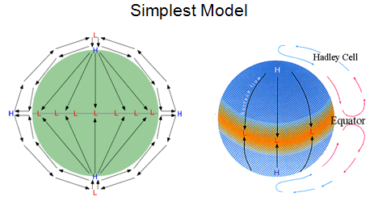
>
> Warm air rises until it reaches a
> certain height at which it starts to spill over into surrounding areas.  At the
> poles, the cold dense air sinks.  Air from the upper levels of the atmosphere flows
> in on top of it increasing the weight and creating an area of high pressure at the poles.
>
> The air that rises at the equator does not
> flow directly to the poles. Due to the rotation of the earth, there is a build up of air
> at about 30° north latitude. (The same phenomenon occurs in the Southern Hemisphere).
>   Some of the air sinks, causing a belt of high-pressure at this latitude.
>
> 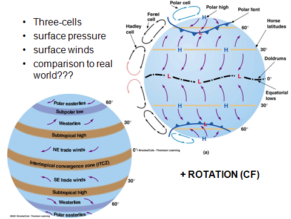
>
> The sinking air reaches the surface
> and flows north and south.  The air that flows south completes one cell of the
> earth's circulation pattern.  The air that flows north becomes part of another cell
> of circulation between 30° and 60° north latitude.  At the same time, the sinking
> air at the north pole flows south and collides with the air moving north from the 30°
> high pressure area.  The colliding air is forced upward and an area of low pressure
> is created near 60° north.  The third cell circulation pattern is created between
> the north pole and 60° north.
>
> Because of the rotation of the earth
> and the coriolis force, air is deflected to the right in the Northern Hemisphere.  As
> a result, the movement of air in the polar cell circulation produces the polar easterlies.
>   In the circulation cell that exists between 60° and 30° north, the movement of
> air produces the prevailing westerlies.  In the tropic circulation cell, the
> northeast trade winds are produced.  These are the so-called permanent wind systems
> of the each.
>
> 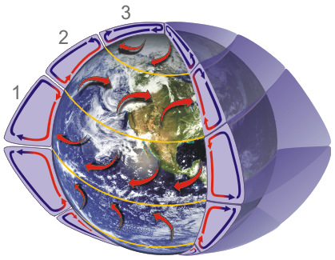
>
> **Since the earth rotates, the axis is tilted, and there is more land mass in the northern hemisphere than in the southern hemisphere, the actual global pattern is much more complicated. Instead of one large circulation between the poles and the equator, there are three circulations...**
>
> 1. **Hadley cell** - Low latitude air movement toward the equator that with heating, rises vertically, with poleward movement in the upper atmosphere. This forms a convection cell that dominates tropical and sub-tropical climates.
> 2. **Ferrel cell** - A mid-latitude mean atmospheric circulation cell for weather named by Ferrel in the 19th century. In this cell the air flows poleward and eastward near the surface and equatorward and westward at higher levels.
> 3. **Polar cell** - Air rises, diverges, and travels toward the poles. Once over the poles, the air sinks, forming the polar highs. At the surface air diverges outward from the polar highs. Surface winds in the polar cell are easterly (polar easterlies).

**UPPER LEVEL WINDS**

> There are two main forces which affect
> the movement of air in the upper levels.  The pressure gradient causes the air to move
> horizontally, forcing the air directly from a region of high pressure to a region of low pressure. 
> The Coriolis force, however, deflects the direction of the flow of the air (to the right in the
> Northern Hemisphere) and causes the air to flow parallel to the isobars.
>
> Winds in the upper levels will blow
> clockwise around areas of high pressure and counterclockwise around areas of low pressure.
>
> The speed of the wind is determined by the
> pressure gradient.  The winds are strongest in regions where the isobars are close together.

**SURFACE WINDS**

> Surface friction plays an important role in the speed and direction of surface winds.  As
> a result of the slowing down of the air as it moves over the ground, wind speeds are less
> than would be expected from the pressure gradient on the weather map and the direction is
> changed so that the wind blows across the isobars into a center of low pressure and out of
> a center of high pressure.
>
> 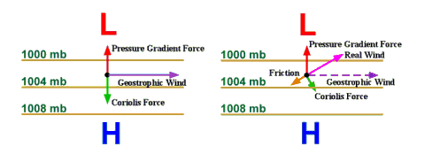
>
> The effect of friction usually does not
> extend more than a couple of thousand feet into the air.  At 3000 feet above the
> ground, the wind blows parallel to the isobars with a speed proportional to the pressure gradient.
>
> Even allowing for the effects of
> surface friction, the winds, locally, do not always show the speed and direction that
> would be expected from the isobars on the surface weather map.  These variations are
> usually due to geographical features such as hills, mountains and large bodies of water.
>   Except in mountainous regions, the effect of terrain features that cause local
> variations in wind extends usually no higher than about 2000 feet above the ground.

**LAND AND SEA BREEZES**

> Land and sea breezes are caused by the
> differences in temperature over land and water.  The sea breeze occurs during the day
> when the land area heats more rapidly than the water surface.  This results in the
> pressure over the land being lower than that over the water.  The pressure gradient is often strong enough for a wind to
> blow from the water to the land.
>
> 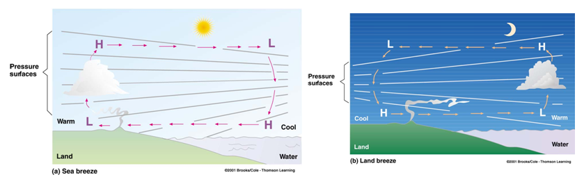
>
> The land breeze blows at night when the land becomes cooler.  Then the wind blows towards the warm,
> low-pressure area over the water.
>
> Land and sea breezes are very local and affect only a narrow area along the coast.

**MOUNTAIN WINDS**

> Hills and valleys substantially distort
> the airflow associated with the prevailing pressure system and the pressure gradient. Strong up and down drafts
> and eddies develop as the air flows up over hills and down into valleys.  Wind
> direction changes as the air flows around hills.  Sometimes lines of hills and
> mountain ranges will act as a barrier, holding back the wind and deflecting it so that it
> flows parallel to the range.  If there is a pass in the mountain range, the wind will
> rush through this pass as through a tunnel with considerable speed.   The airflow can
> be expected to remain turbulent and erratic for some distance as it flows out of the hilly
> area and into the flatter countryside.
>
> 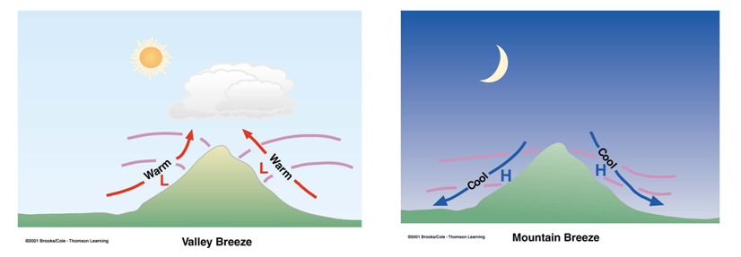
>
> Daytime heating and nighttime cooling of
> the hilly slopes lead to day to night variations in the airflow.  At night, the sides
> of the hills cool by radiation.  The air in contact with them becomes cooler and
> therefore denser and it blows down the slope into the valley.  This is a *katabatic
> wind* (sometimes also called a mountain breeze).  If the slopes are covered with
> ice and snow, the katabatic wind will blow, not only at night, but also during the day,
> carrying the cold dense air into the warmer valleys.  The slopes of hills not covered
> by snow will be warmed during the day. The air in contact with them becomes warmer and
> less dense and, therefore, flows up the slope. This is an *anabatic wind* (or
> valley breeze).
>
> In mountainous areas, local distortion of
> the airflow is even more severe.  Rocky surfaces, high ridges, sheer cliffs, steep
> valleys, all combine to produce unpredictable flow patterns and turbulence.
>
> 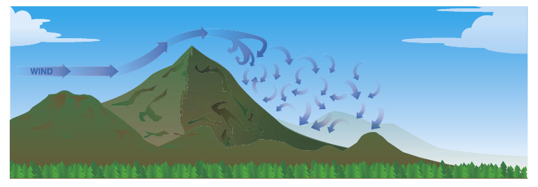

**THE MOUNTAIN WAVE**

> Air flowing across a mountain range
> usually rises relatively smoothly up the slope of the range, but, once over the top, it
> pours down the other side with considerable force, bouncing up and down, creating eddies
> and turbulence and also creating powerful vertical waves that may extend for great
> distances downwind of the mountain range.  This phenomenon is known as a mountain
> wave. Note the up and down drafts and the rotating eddies formed downstream.
>
> If the air mass has a high moisture
> content, clouds of very distinctive appearance will develop.
>
> > ***Cap Cloud*.** Orographic lift causes a cloud to form along the top of
> > the ridge.  The wind carries this cloud down along the leeward slope where it
> > dissipates through adiabatic heating.  The base of this cloud lies near or below the
> > peaks of the ridge; the top may reach a few thousand feet above the peaks.
> >
> > ***Lenticular (Lens Shaped) Clouds***form in the wave crests aloft and lie in bands that may extend to well above 40,000
> > feet.
> >
> > ***Rotor Clouds*** form in the
> > rolling eddies downstream.  They resemble a long line of stratocumulus clouds, the bases of which lie below the mountain peaks and the tops of which may
> > reach to a considerable height above the peaks.  Occasionally these clouds develop
> > into thunderstorms.
> >
> > 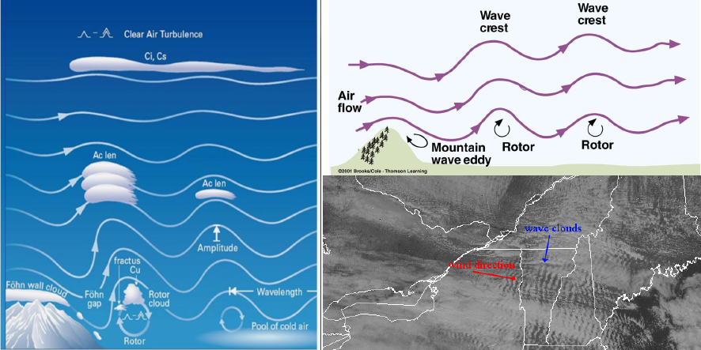
>
> The clouds, being very distinctive, can be
> seen from a great distance and provide a visible warning of the mountain wave condition.
>   Unfortunately, sometimes they are embedded in other cloud systems and are hidden
> from sight.  Sometimes the air mass is very dry and the clouds do not develop.
>
> The severity of the mountain wave and the
> height to which the disturbance of the air is affected is dependent on the strength of the
> wind, its angle to the range and the stability or instability of the air.  The most
> severe mountain wave conditions are created in strong airflows that are blowing at right
> angles to the range and in stable air.  A jet stream blowing nearly perpendicular to the mountain range
> increases the severity of the wave condition.
>
> The mountain wave phenomenon is not limited only to high mountain ranges, such as the Rockies,
> but is also present to a lesser degree in smaller mountain systems and even in lines of small hills.
>
> Mountain waves present problems to pilots for several reasons:
>
> > **Vertical Currents.** Downdrafts of
> > 2000 feet per minute are common and downdrafts as great as 5000 feet per minute have been
> > reported.   They occur along the downward slope and are most severe at a height equal
> > to that of the summit.  An airplane, caught in a downdraft, could be forced to the
> > ground.
> >
> > Turbulence is usually extremely severe in
> > the air layer between the ground and the tops of the rotor clouds.
> >
> > **Wind Shear.**
> > The wind speed varies dramatically between the crests and troughs of the waves.  It
> > is usually most severe in the wave nearest the mountain range.
> >
> > **Altimeter Error.** The increase in
> > wind speed results in an accompanying decrease in pressure, which in turn affects the
> > accuracy of the pressure altimeter.
> >
> > **Icing.** The
> > freezing level varies considerably from crest to trough.  Severe icing can occur
> > because of the large supercooled droplets sustained in the strong vertical currents.
>
> When flying over a
> mountain ridge where wave conditions exist:
>
> (1) Avoid ragged and irregular shaped clouds—the irregular shape indicates
> turbulence.
> (2) Approach the mountain at a 45-degree angle.  It you should suddenly decide to
> turn back, a quick turn can be made away from the high ground.
> (3) Avoid flying in cloud on the mountain crest (cap cloud) because of strong downdrafts
> and turbulence.
> (4) Allow sufficient height to clear the highest ridges with altitude to spare to avoid
> the downdrafts and eddies on the downwind slopes.
> (5) Always remember that your altimeter can read over 3000 ft. in error on the high side
> in mountain wave conditions.

**GUSTINESS**

> A gust is a rapid and irregular
> fluctuation of varying intensity in the upward and downward movement of air currents.
>   It may be associated with a rapid change in wind direction.  Gusts are caused
> by mechanical turbulence that results from friction
> between the air and the ground and by the unequal heating of the earth's surface,
> particularly on hot summer afternoons.

**SQUALLS**

> A squall is a sudden increase in the
> strength of the wind of longer duration than a gust and may be caused by the passage of a
> fast moving cold front or thunderstorm.  Like a gust, it may be accompanied by a
> rapid change of wind direction.

**DIURNAL VARIATIONS**

> Diurnal (daily) variation of wind is
> caused by strong surface heating during the day, which causes turbulence in the lower
> levels.  The result of this turbulence is that the direction and speed of the wind at
> the higher levels (e.g., 3000 feet) tends to be transferred to the surface.  Since
> the wind direction at the higher level is parallel to the isobars and its speed is greater
> than the surface wind, this transfer causes the surface wind to veer and increase in
> speed.
>
> At night, there is no surface heating and
> therefore less turbulence and the surface wind tends to resume its normal direction and
> speed.  It backs and decreases.  See ***VEERING AND BACKING*** section below for more info.

**EDDIES—MECHANICAL
TURBULENCE**

> Friction between the moving air mass and
> surface features of the earth (hills, mountains, valleys, trees, buildings, etc.) is
> responsible for the swirling vortices of air commonly called *eddies*.  They
> vary considerably in size and intensity depending on the size and roughness of the surface
> obstruction, the speed of the wind and the degree of stability of the air.  They can
> spin in either a horizontal or vertical plane. Unstable air and strong winds produce more
> vigorous eddies.  In stable air, eddies tend to quickly dissipate.  Eddies
> produced in mountainous areas are especially powerful.
>
> 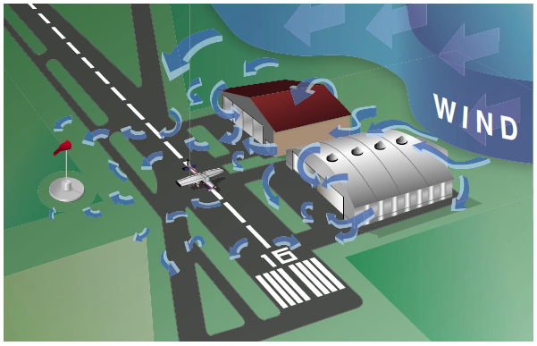
>
> The bumpy or choppy up and down motion
> that signifies the presence of eddies makes it difficult to keep an airplane in level
> flight.

**DUST DEVILS**

> Dust devils are phenomena that occur quite
> frequently on the hot dry plains of mid-western North America.  They can be of
> sufficient force to present a hazard to pilots of light airplanes flying at low speeds.
>
> They are small heat lows that form on
> clear hot days. Given a steep lapse rate caused by cool air aloft over a hot surface,
> little horizontal air movement, few or no clouds, and the noonday sun heating flat arid
> soil surfaces to high temperatures, the air in contact with the ground becomes
> super-heated and highly unstable.  This surface layer of air builds until something
> triggers an upward movement.  Once started, the hot air rises in a column and draws
> more hot air into the base of the column.  Circulation begins around this heat low
> and increases in velocity until a small vigorous whirlwind is created. Dust devils are
> usually of short duration and are so named because they are made visible by the dust, sand
> and debris that they pick up from the ground.
>
> Dust devils pose the greatest hazard near
> the ground where they are most violent.  Pilots proposing to land on superheated
> runways in areas of the mid-west where this phenomenon is common should scan the airport
> for dust swirls or grass spirals that would indicate the existence of this hazard.

**TORNADOES**

> Tornadoes are violent, circular whirlpools
> of air associated with severe thunderstorms and are, in fact, very deep, concentrated
> low-pressure areas. They are shaped like a tunnel hanging out of the cumulonimbus cloud and are dark in appearance due to the
> dust and debris sucked into their whirlpools. They range in diameter from about 100 feet
> to one half mile and move over the ground at speeds of 25 to 50 knots. Their path over the
> ground is usually only a few miles long although tornadoes have been reported to cut
> destructive swaths as long as 100 miles. The great destructiveness of tornadoes is caused
> by the very low pressure in their centers and the high wind speeds, which are reputed to
> be as great as 300 knots.

**WIND
SPEEDS AND DIRECTION**

> Wind speeds for aviation purposes are expressed in knots
> (nautical miles per hour). In the weather reports on US public radio and television,
> however, wind speeds are given in miles per hour while in Canada speeds are given in
> kilometers per hour.
>
> In a discussion of wind direction, the
> compass point from which the wind is blowing is considered to be its direction. Therefore,
> a north wind is one that is blowing from the north towards the south. In aviation weather
> reports, area and aerodrome forecasts, the wind is always reported in degrees true. In
> ATIS broadcasts and in the information given by the tower for landing and take-off, the
> wind is reported in degrees magnetic.

**VEERING AND BACKING**

> The wind veers when it changes direction
> clockwise. Example: The surface wind is blowing from 270°. At 2000 feet it is blowing
> from 280°. It has changed in a right-hand, or clockwise, direction.
>
> The wind backs when it changes direction
> anti-clockwise. Example: The wind direction at 2000 feet is 090° and at 3000 feet is 085°. It
> is changing in a left-hand, or anti-clockwise, direction.
>
> In a descent from several thousand feet
> above the ground to ground level, the wind will usually be found to back and also decrease
> in velocity, as the effect of surface friction becomes apparent. In a climb from the
> surface to several thousand feet AGL, the wind will veer and increase.
>
> At night, surface cooling reduces the eddy motion of the air. Surface winds will back and decrease. Conversely, during the day, surface heating increases the eddy motion of the air. Surface winds will veer and increase as stronger winds aloft mix to the surface. See ***DIURNAL VARIATIONS*** section above for more info.

**WIND SHEAR**

> Wind shear is the sudden tearing or
> shearing effect encountered along the edge of a zone in which there is a violent change in
> wind speed or direction. It can exist in a horizontal or vertical direction and produces
> churning motions and consequently turbulence. Under some conditions, wind direction
> changes of as much as 180 degrees and speed changes of as much as 80 knots have been
> measured.
>
> 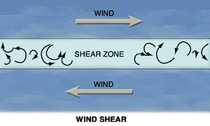  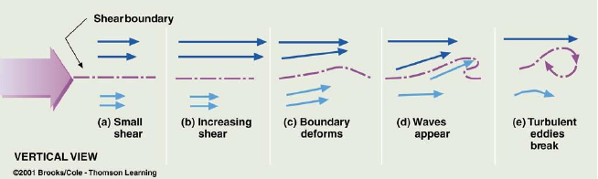
>
> The effect on airplane performance of
> encountering wind shear derives from the fact that the wind can change much faster than
> the airplane mass can be accelerated or decelerated. Severe wind shears can impose
> penalties on an airplane's performance that are beyond its capabilities to compensate,
> especially during the critical landing and take-off phase of flight.
>
>
>
> ***In Cruising Flight***
>
> In cruising flight, wind shear will likely
> be encountered in the transition zone between the pressure gradient wind and the distorted
> local winds at the lower levels. It will also be encountered when climbing or descending
> through a temperature inversion and when passing through a frontal surface. Wind shear is
> also associated with the jet stream. Airplanes
> encountering wind shear may experience a succession of updrafts and downdrafts, reductions
> or gains in headwind, or windshifts that disrupt the established flight path. It is not
> usually a major problem because altitude and airspeed margins will be adequate to
> counteract the shear's adverse effects. On occasion, however, the wind shear may be severe
> enough to cause an abrupt increase in load factor, which might stall the airplane or
> inflict structural damage.
>
> 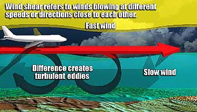
>
>
>
> ***Near the Ground***
>
> Wind shear, encountered near the ground,
> is more serious and potentially very dangerous. There are four common sources of low level
> wind shear: thunderstorms, frontal activity, temperature inversions and strong
> surface winds passing around natural or manmade obstacles.

> > **Frontal Wind Shear.** Wind shear is
> > usually a problem only in fronts with steep wind gradients. If the temperature difference
> > across the front at the surface is 5°C or more and if the front is moving at a speed of
> > about 30 knots or more, wind shear is likely to be present. Frontal wind shear is a
> > phenomenon associated with fast moving cold fronts but can be present in warm fronts as
> > well.
> >
> > 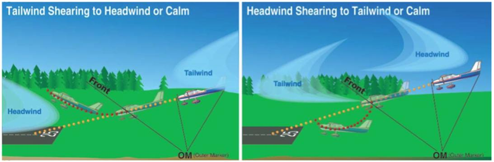
> >
> >
> >
> > **Thunderstorms.** Wind shear,
> > associated with thunderstorms, occurs as the result of two phenomena, the gust front and
> > downbursts. As the thunderstorm matures, strong downdrafts develop, strike the ground and
> > spread out horizontally along the surface well in advance of the thunderstorm itself. This
> > is the gust front. Winds can change direction by as much as 180° and reach speeds as
> > great as 100 knots as far as 10 miles ahead of the storm. The downburst is an extremely
> > intense localized downdraft flowing out of a thunderstorm. The power of the downburst can
> > exceed aircraft climb capabilities. The downburst (there are two types of downbursts:
> > macrobursts and microbursts) usually is much closer to the thunderstorm than the gust
> > front. Dust clouds, roll clouds, intense rainfall or virga (rain that evaporates before it
> > reaches the ground) are due to the possibility of downburst activity but there is no way
> > to accurately predict its occurrence.
> >
> > 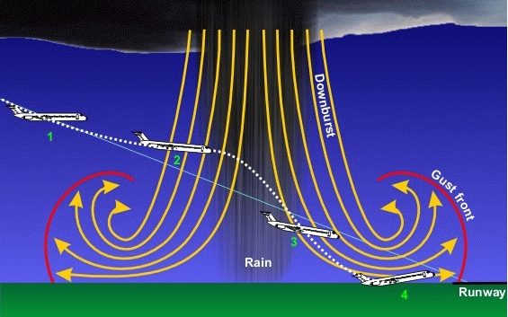  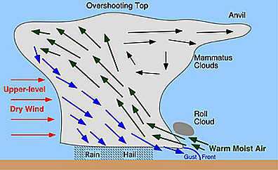
> >
> >
> >
> > **Temperature Inversions.** Overnight
> > cooling creates a temperature inversion a few hundred feet above the ground that can
> > produce significant wind shear, especially if the inversion is coupled with the low-level
> > jet stream.
> >
> > As a nocturnal inversion develops, the
> > wind shear near the top of the inversion increases. It usually reaches its maximum speed
> > shortly after midnight and decreases in the morning as daytime heating dissipates the
> > inversion. This phenomenon is known as the low-level nocturnal jet stream. The low level
> > jet stream is a sheet of strong winds, thousands of miles long, hundreds of miles wide and
> > hundreds of feet thick that forms over flat terrain such as the prairies. Wind speeds of
> > 40 knots are common, but greater speeds have been measured. Low level jet streams are
> > responsible for hazardous low level shear.
> >
> > 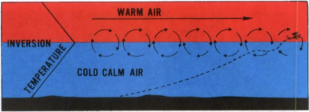
> >
> > As the inversion dissipates in the
> > morning, the shear plane and gusty winds move closer to the ground, causing windshifts and
> > increases in wind speed near the surface.
> >
> >
> >
> > **Surface Obstructions.** The irregular
> > and turbulent flow of air around mountains and hills and through mountain passes causes
> > serious wind shear problems for aircraft approaching to land at airports near mountain
> > ridges. Wind shear is a phenomenon associated with the mountain wave. Such shear is almost totally unpredictable but should be
> > expected whenever surface winds are strong.
> >
> > Wind shear is also associated with hangars
> > and large buildings at airports. As the air flows around such large structures, wind
> > direction changes and wind speed increases causing shear.
> >
> > Wind shear occurs both horizontally and
> > vertically. Vertical shear is most common near the ground and can pose a serious hazard to
> > airplanes during take-off and landing. The airplane is flying at lower speeds and in a
> > relatively high drag configuration. There is little altitude available for recovering and
> > stall and maneuver margins are at their lowest. An airplane encountering the wind shear
> > phenomenon may experience a large loss of airspeed because of the sudden change in the
> > relative airflow as the airplane flies into a new, moving air mass. The abrupt drop in
> > airspeed may result in a stall, creating a dangerous situation when the airplane is only a
> > few hundred feet off the ground and very vulnerable.

**THE JET STREAM**

> Narrow bands of exceedingly high speed
> winds are known to exist in the higher levels of the atmosphere at altitudes ranging from
> 20,000 to 40,000 feet or more. They are known as jet streams. As many as three major jet
> streams may traverse the North American continent at any given time. One lies across
> Northern Canada and one across the U.S.  A third jet stream may be as far south as
> the northern tropics but it is somewhat rare.  A jet stream in the mid latitudes is
> generally the strongest.
>
> 
>
> The jet stream appears to be closely
> associated with the tropopause and with the polar front.  It typically forms in the break
> between the polar and the tropical tropopause where the temperature gradients are
> intensified.  The mean position of the jet stream shears south in winter and north in
> summer with the seasonal migration of the polar front.  Because the troposphere is deeper in summer than in winter, the
> tropopause and the jets will nominally be at higher altitudes in the summer.
>
> Long, strong jet streams are usually also
> associated with well-developed surface lows beneath deep upper troughs and lows. A low
> developing in the wave along the frontal surface lies south of the jet. As it deepens, the
> low moves near the jet. As it occludes, the low moves north of the jet, which crosses the
> frontal system, near the point of occlusion. The jet flows roughly parallel to the front.
> The subtropical jet stream is not associated with fronts but forms because of strong solar
> heating in the equatorial regions. The ascending air turns poleward at very high levels
> but is deflected by the Coriolis force into a strong
> westerly jet. The subtropical jet predominates in winter.
>
> 
>
> The jet streams flow from west to east and
> may encircle the entire hemisphere. More often, because they are stronger in some places
> than in others, they break up into segments some 1000 to 3000 nautical miles long. They
> are usually about 300 nautical miles wide and may be 3000 to 7000 feet thick. These jet
> stream segments move in an easterly direction following the movement of pressure ridges
> and troughs in the upper atmosphere.
>
> Winds in the central core of the jet
> stream are the strongest and may reach speeds as great as 250 knots, although they are
> generally between 100 and 150 knots. Wind speeds decrease toward the outer edges of the
> jet stream and may be blowing at only 25 knots there. The rate of decrease of wind speed
> is considerably greater on the northern edge than on the southern edge. Wind speeds in the
> jet stream are, on average, considerably stronger in winter than in summer.
>
>
>
> **Clear Air Turbulence.** The most probable place to expect Clear
> Air Turbulence (CAT) is just above the central core of the jet stream near the polar
> tropopause and just below the core. Clear air turbulence does not occur in the core. CAT
> is encountered more frequently in winter when the jet stream winds are strongest.
> Nevertheless, CAT is not always present in the jet stream and, because it is random and
> transient in nature, it is almost impossible to forecast.
>
> Clear air turbulence may be associated
> with other weather patterns, especially in wind shear associated
> with the sharply curved contours of strong lows, troughs and ridges aloft, at or below the
> tropopause, and in areas of strong cold or warm air advection. Mountain waves create severe CAT that may extend from the mountain crests to as high as 5000
> feet above the tropopause. Since severe CAT does pose a hazard to airplanes, pilots should
> try to avoid or minimize encounters with it. These rules of thumb may help avoid jet
> streams with strong winds (150 knots) at the core. Strong wind shears are likely above and
> below the core. CAT within the jet stream is more intense above and to the lee of mountain
> ranges. If the 20-knot isotachs (lines joining areas of equal wind speeds) are closer than
> 60 nautical miles on the charts showing the locations of the jet stream, wind shear and
> CAT are possible.
>
> Curving jet streams are likely to have
> turbulent edges, especially those that curve around a deep pressure trough. When moderate
> or severe CAT has been reported or is forecast, adjust speed to rough air speed
> immediately on encountering the first bumpiness or even before encountering it to avoid
> structural damage to the airplane.
>
> The areas of CAT are usually shallow and
> narrow and elongated with the wind. If jet stream turbulence is encountered with a tail
> wind or head wind, a turn to the right will find smoother air and more favorable winds. If
> the CAT is encountered in a crosswind, it is not so important to change course as the
> rough area will be narrow.
>
>  [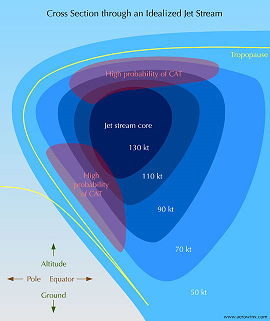
>
>
> *Click above image(s) for larger image*](subpages/cat/cat.md)
