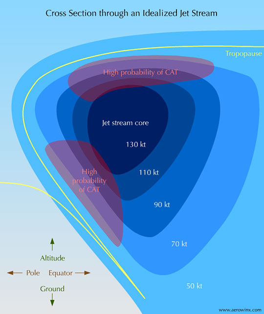

# General Winds/Circulations — Click above image(s) for larger image

> Source: <http://www.weather.gov/source/zhu/ZHU_Training_Page/winds/Wx_Terms/cat.jpg>  
> Section: Winds/Jetstream  
> Captured: 2026-08-19 06:00 UTC  
> PDF: [cat.pdf](cat.pdf) · 540×642px

---

