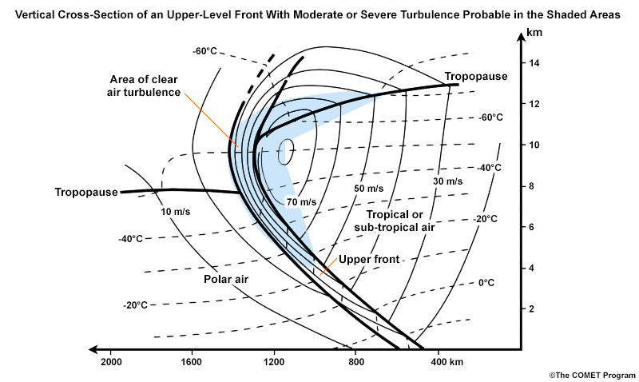

# General Winds/Circulations — tropopause_crossSection.jpg

> Source: <http://www.weather.gov/source/zhu/ZHU_Training_Page/winds/Wx_Terms/tropopause_crossSection.jpg>  
> Section: Winds/Jetstream  
> Captured: 2026-08-19 06:00 UTC  
> PDF: [tropopause-crosssection.pdf](tropopause-crosssection.pdf) · 800×478px

---

