# General Winds - The Definitive Edition

> Source: <http://www.weather.gov/media/zhu/ZHU_Training_Page/winds/FireWx_General_Winds/FireWx_General_Winds.pdf>  
> Section: Winds/Jetstream  
> Captured: 2026-08-19 06:00 UTC  
> PDF: [general-winds-the-definitive-edition.pdf](general-winds-the-definitive-edition.pdf) (22 pages)

---

## Page 1

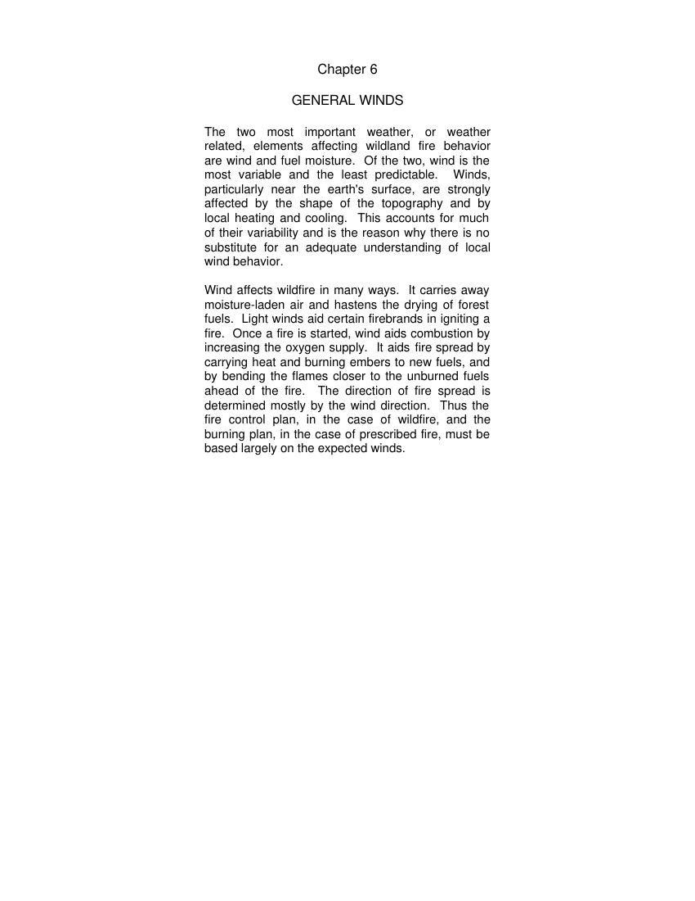

Chapter 6 
 
GENERAL WINDS 
 
The two most important weather, or weather 
related, elements affecting wildland fire behavior 
are wind and fuel moisture.  Of the two, wind is the 
most variable and the least predictable.  Winds, 
particularly near the earth's surface, are strongly 
affected by the shape of the topography and by 
local heating and cooling.  This accounts for much 
of their variability and is the reason why there is no 
substitute for an adequate understanding of local 
wind behavior. 
 
Wind affects wildfire in many ways.  It carries away 
moisture-laden air and hastens the drying of forest 
fuels.  Light winds aid certain firebrands in igniting a 
fire.  Once a fire is started, wind aids combustion by 
increasing the oxygen supply.  It aids fire spread by 
carrying heat and burning embers to new fuels, and 
by bending the flames closer to the unburned fuels 
ahead of the fire.  The direction of fire spread is 
determined mostly by the wind direction.  Thus the 
fire control plan, in the case of wildfire, and the 
burning plan, in the case of prescribed fire, must be 
based largely on the expected winds.

## Page 2

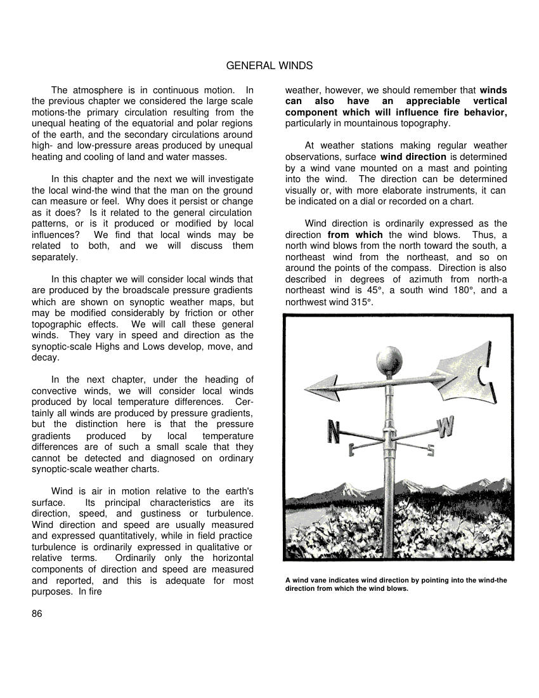

GENERAL WINDS 
 
The atmosphere is in continuous motion.  In 
the previous chapter we considered the large scale 
motions-the primary circulation resulting from the 
unequal heating of the equatorial and polar regions 
of the earth, and the secondary circulations around 
high- and low-pressure areas produced by unequal 
heating and cooling of land and water masses. 
 
In this chapter and the next we will investigate 
the local wind-the wind that the man on the ground 
can measure or feel.  Why does it persist or change 
as it does?  Is it related to the general circulation 
patterns, or is it produced or modified by local 
influences?  We find that local winds may be 
related to both, and we will discuss them 
separately. 
 
In this chapter we will consider local winds that 
are produced by the broadscale pressure gradients 
which are shown on synoptic weather maps, but 
may be modified considerably by friction or other 
topographic effects.  We will call these general 
winds.  They vary in speed and direction as the 
synoptic-scale Highs and Lows develop, move, and 
decay. 
 
In the next chapter, under the heading of 
convective winds, we will consider local winds 
produced by local temperature differences.  Cer-
tainly all winds are produced by pressure gradients, 
but the distinction here is that the pressure 
gradients 
produced 
by 
local 
temperature 
differences are of such a small scale that they 
cannot be detected and diagnosed on ordinary 
synoptic-scale weather charts. 
 
Wind is air in motion relative to the earth's 
surface.  Its principal characteristics are its 
direction, speed, and gustiness or turbulence.  
Wind direction and speed are usually measured 
and expressed quantitatively, while in field practice 
turbulence is ordinarily expressed in qualitative or 
relative terms.  Ordinarily only the horizontal 
components of direction and speed are measured 
and reported, and this is adequate for most 
purposes.  In fire 
 
86 
 
 
weather, however, we should remember that winds 
can 
also 
have 
an 
appreciable 
vertical 
component which will influence fire behavior, 
particularly in mountainous topography. 
 
At weather stations making regular weather 
observations, surface wind direction is determined 
by a wind vane mounted on a mast and pointing 
into the wind.  The direction can be determined 
visually or, with more elaborate instruments, it can 
be indicated on a dial or recorded on a chart. 
 
Wind direction is ordinarily expressed as the 
direction from which the wind blows.  Thus, a 
north wind blows from the north toward the south, a 
northeast wind from the northeast, and so on 
around the points of the compass.  Direction is also 
described in degrees of azimuth from north-a 
northeast wind is 45°, a south wind 180°, and a 
northwest wind 315°. 
 
A wind vane indicates wind direction by pointing into the wind-the 
direction from which the wind blows.

## Page 3

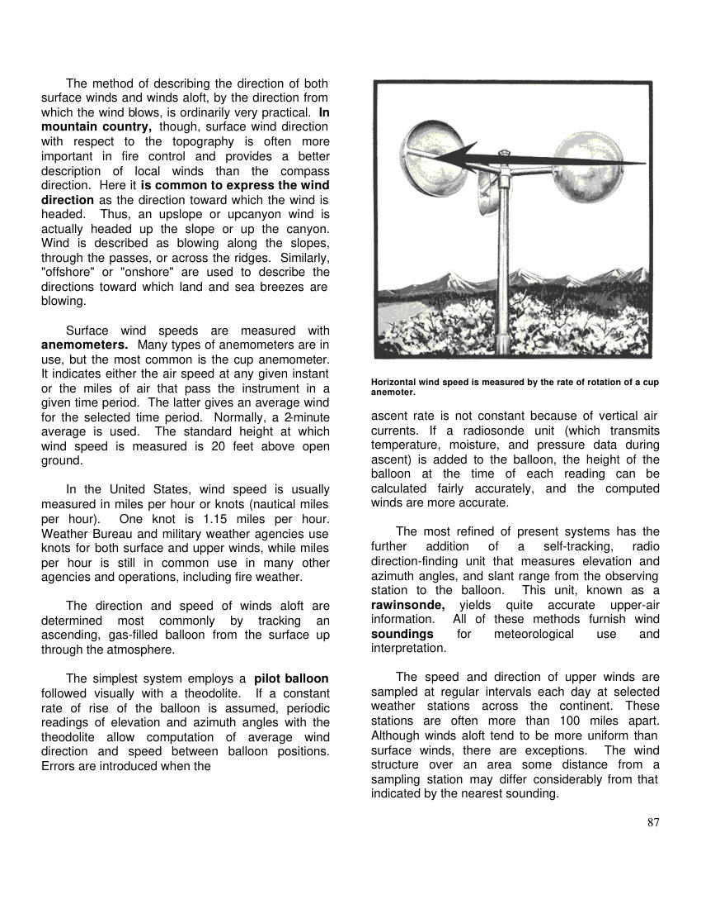

The method of describing the direction of both 
surface winds and winds aloft, by the direction from 
which the wind blows, is ordinarily very practical.  In 
mountain country, though, surface wind direction 
with respect to the topography is often more 
important in fire control and provides a better 
description of local winds than the compass 
direction.  Here it is common to express the wind 
direction as the direction toward which the wind is 
headed.  Thus, an upslope or upcanyon wind is 
actually headed up the slope or up the canyon. 
Wind is described as blowing along the slopes, 
through the passes, or across the ridges.  Similarly, 
"offshore" or "onshore" are used to describe the 
directions toward which land and sea breezes are 
blowing. 
 
Surface wind speeds are measured with 
anemometers.  Many types of anemometers are in 
use, but the most common is the cup anemometer. 
It indicates either the air speed at any given instant 
or the miles of air that pass the instrument in a 
given time period.  The latter gives an average wind 
for the selected time period.  Normally, a 2-minute 
average is used.  The standard height at which 
wind speed is measured is 20 feet above open 
ground. 
 
In the United States, wind speed is usually 
measured in miles per hour or knots (nautical miles 
per hour).  One knot is 1.15 miles per hour. 
Weather Bureau and military weather agencies use 
knots for both surface and upper winds, while miles 
per hour is still in common use in many other 
agencies and operations, including fire weather. 
 
The direction and speed of winds aloft are 
determined 
most 
commonly 
by 
tracking 
an 
ascending, gas-filled balloon from the surface up 
through the atmosphere. 
 
The simplest system employs a pilot balloon 
followed visually with a theodolite.  If a constant 
rate of rise of the balloon is assumed, periodic 
readings of elevation and azimuth angles with the 
theodolite allow computation of average wind 
direction and speed between balloon positions. 
Errors are introduced when the 
 
 
 
 
 
 
 
Horizontal wind speed is measured by the rate of rotation of a cup 
anemoter. 
 
ascent rate is not constant because of vertical air 
currents. If a radiosonde unit (which transmits 
temperature, moisture, and pressure data during 
ascent) is added to the balloon, the height of the 
balloon at the time of each reading can be 
calculated fairly accurately, and the computed 
winds are more accurate. 
 
The most refined of present systems has the 
further 
addition 
of 
a 
self-tracking, 
radio 
direction-finding unit that measures elevation and 
azimuth angles, and slant range from the observing 
station to the balloon.  This unit, known as a 
rawinsonde, 
yields 
quite 
accurate 
upper-air 
information.  All of these methods furnish wind 
soundings 
for 
meteorological 
use 
and 
interpretation. 
 
The speed and direction of upper winds are 
sampled at regular intervals each day at selected 
weather stations across the continent. These 
stations are often more than 100 miles apart. 
Although winds aloft tend to be more uniform than 
surface winds, there are exceptions.  The wind 
structure over an area some distance from a 
sampling station may differ considerably from that 
indicated by the nearest sounding. 
 
87

## Page 4

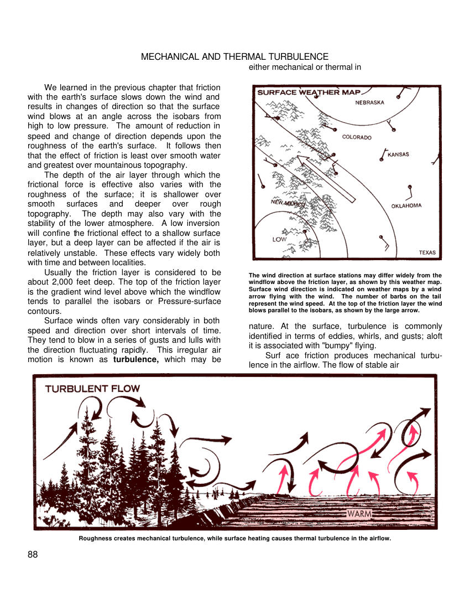

MECHANICAL AND THERMAL TURBULENCE
 
 
We learned in the previous chapter that friction 
with the earth's surface slows down the wind and 
results in changes of direction so that the surface 
wind blows at an angle across the isobars from 
high to low pressure.  The amount of reduction in 
speed and change of direction depends upon the 
roughness of the earth's surface.  It follows then 
that the effect of friction is least over smooth water 
and greatest over mountainous topography. 
The depth of the air layer through which the 
frictional force is effective also varies with the 
roughness of the surface; it is shallower over 
smooth 
surfaces 
and 
deeper 
over 
rough 
topography.  The depth may also vary with the 
stability of the lower atmosphere.  A low inversion 
will confine the frictional effect to a shallow surface 
layer, but a deep layer can be affected if the air is 
relatively unstable.  These effects vary widely both 
with time and between localities. 
Usually the friction layer is considered to be 
about 2,000 feet deep. The top of the friction layer 
is the gradient wind level above which the windflow 
tends to parallel the isobars or Pressure-surface 
contours. 
Surface winds often vary considerably in both 
speed and direction over short intervals of time. 
They tend to blow in a series of gusts and lulls with 
the direction fluctuating rapidly.  This irregular air 
motion is known as turbulence, which may be 
either mechanical or thermal in 
 
 
The wind direction at surface stations may differ widely from the 
windflow above the friction layer, as shown by this weather map.  
Surface wind direction is indicated on weather maps by a wind 
arrow flying with the wind.  The number of barbs on the tail 
represent the wind speed.  At the top of the friction layer the wind 
blows parallel to the isobars, as shown by the large arrow. 
 
nature. At the surface, turbulence is commonly 
identified in terms of eddies, whirls, and gusts; aloft 
it is associated with "bumpy" flying. 
Surf ace friction produces mechanical turbu-
lence in the airflow. The flow of stable air 
Roughness creates mechanical turbulence, while surface heating causes thermal turbulence in the airflow.
 
88

## Page 5

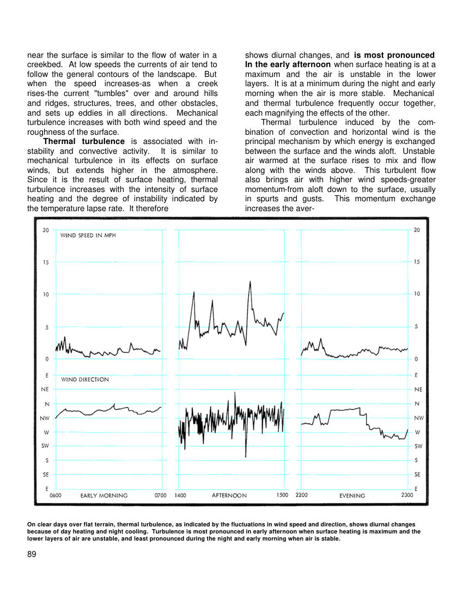

near the surface is similar to the flow of water in a 
creekbed.  At low speeds the currents of air tend to 
follow the general contours of the landscape.  But 
when the speed increases-as when a creek 
rises-the current "tumbles" over and around hills 
and ridges, structures, trees, and other obstacles, 
and sets up eddies in all directions.  Mechanical 
turbulence increases with both wind speed and the 
roughness of the surface. 
Thermal turbulence is associated with in-
stability and convective activity.  It is similar to 
mechanical turbulence in its effects on surface 
winds, but extends higher in the atmosphere.  
Since it is the result of surface heating, thermal 
turbulence increases with the intensity of surface 
heating and the degree of instability indicated by 
the temperature lapse rate.  It therefore 
 
shows diurnal changes, and is most pronounced 
In the early afternoon when surface heating is at a 
maximum and the air is unstable in the lower 
layers.  It is at a minimum during the night and early 
morning when the air is more stable.  Mechanical 
and thermal turbulence frequently occur together, 
each magnifying the effects of the other. 
Thermal turbulence induced by the com-
bination of convection and horizontal wind is the 
principal mechanism by which energy is exchanged 
between the surface and the winds aloft.  Unstable 
air warmed at the surface rises to mix and flow 
along with the winds above.  This turbulent flow 
also brings air with higher wind speeds-greater 
momentum-from aloft down to the surface, usually 
in spurts and gusts.  This momentum exchange 
increases the aver- 
On clear days over flat terrain, thermal turbulence, as indicated by the fluctuations in wind speed and direction, shows diurnal changes 
because of day heating and night cooling.  Turbulence is most pronounced in early afternoon when surface heating is maximum and the 
lower layers of air are unstable, and least pronounced during the night and early morning when air is stable.
 
89

## Page 6

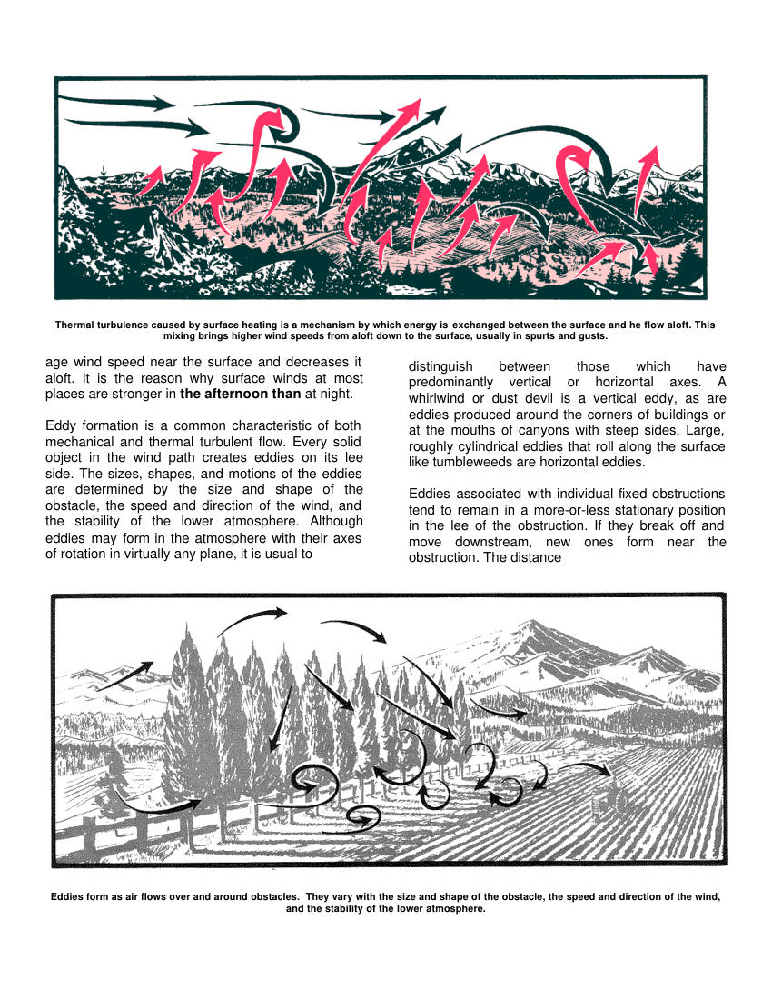

Thermal turbulence caused by surface heating is a mechanism by which energy is exchanged between the surface and he flow aloft. This 
mixing brings higher wind speeds from aloft down to the surface, usually in spurts and gusts.  
 
age wind speed near the surface and decreases it 
aloft. It is the reason why surface winds at most 
places are stronger in the afternoon than at night. 
 
Eddy formation is a common characteristic of both 
mechanical and thermal turbulent flow. Every solid 
object in the wind path creates eddies on its lee 
side. The sizes, shapes, and motions of the eddies 
are determined by the size and shape of the 
obstacle, the speed and direction of the wind, and 
the stability of the lower atmosphere. Although 
eddies may form in the atmosphere with their axes 
of rotation in virtually any plane, it is usual to  
 
 
 
distinguish 
between 
those 
which 
have 
predominantly 
vertical 
or 
horizontal 
axes. 
A 
whirlwind or dust devil is a vertical eddy, as are 
eddies produced around the corners of buildings or 
at the mouths of canyons with steep sides. Large, 
roughly cylindrical eddies that roll along the surface 
like tumbleweeds are horizontal eddies. 
 
Eddies associated with individual fixed obstructions 
tend to remain in a more-or-less stationary position 
in the lee of the obstruction. If they break off and 
move downstream, new ones form near the 
obstruction. The distance 
 
Eddies form as air flows over and around obstacles.  They vary with the size and shape of the obstacle, the speed and direction of the wind, 
and the stability of the lower atmosphere.

## Page 7

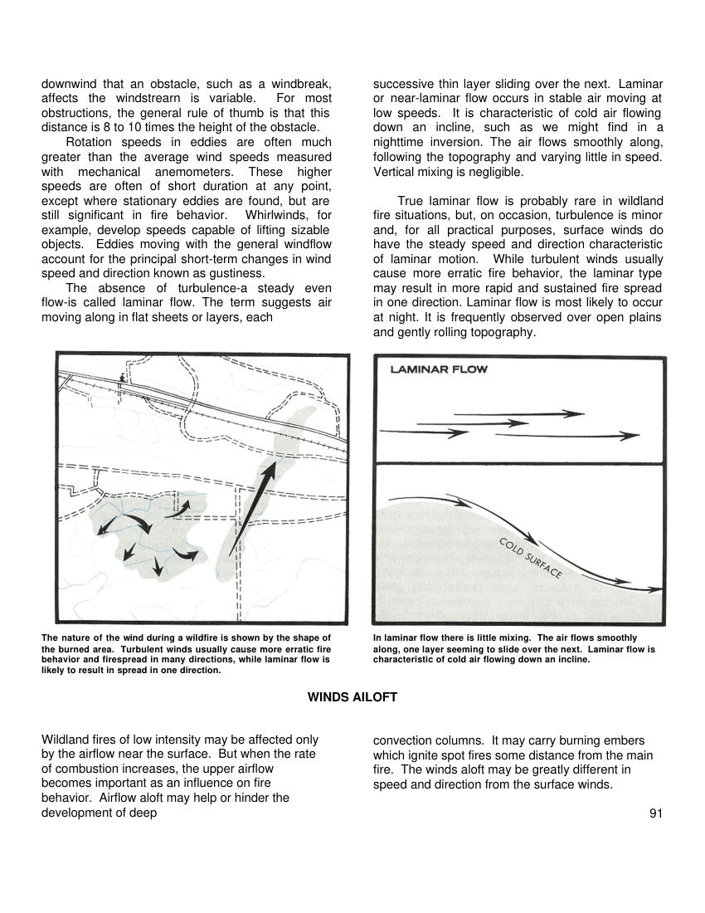

downwind that an obstacle, such as a windbreak, 
affects the windstrearn is variable.  For most 
obstructions, the general rule of thumb is that this 
distance is 8 to 10 times the height of the obstacle. 
Rotation speeds in eddies are often much 
greater than the average wind speeds measured 
with 
mechanical 
anemometers. 
These 
higher 
speeds are often of short duration at any point, 
except where stationary eddies are found, but are 
still significant in fire behavior.  Whirlwinds, for 
example, develop speeds capable of lifting sizable 
objects.  Eddies moving with the general windflow 
account for the principal short-term changes in wind 
speed and direction known as gustiness. 
The absence of turbulence-a steady even 
flow-is called laminar flow. The term suggests air 
moving along in flat sheets or layers, each 
 
The nature of the wind during a wildfire is shown by the shape of 
the burned area.  Turbulent winds usually cause more erratic fire 
behavior and firespread in many directions, while laminar flow is 
likely to result in spread in one direction. 
successive thin layer sliding over the next.  Laminar 
or near-laminar flow occurs in stable air moving at 
low speeds.  It is characteristic of cold air flowing 
down an incline, such as we might find in a 
nighttime inversion. The air flows smoothly along, 
following the topography and varying little in speed.  
Vertical mixing is negligible. 
 
True laminar flow is probably rare in wildland 
fire situations, but, on occasion, turbulence is minor 
and, for all practical purposes, surface winds do 
have the steady speed and direction characteristic 
of laminar motion.  While turbulent winds usually 
cause more erratic fire behavior, the laminar type 
may result in more rapid and sustained fire spread 
in one direction. Laminar flow is most likely to occur 
at night. It is frequently observed over open plains 
and gently rolling topography. 
In laminar flow there is little mixing.  The air flows smoothly 
along, one layer seeming to slide over the next.  Laminar flow is 
characteristic of cold air flowing down an incline.
 
WINDS AILOFT
 
 
Wildland fires of low intensity may be affected only 
by the airflow near the surface.  But when the rate 
of combustion increases, the upper airflow 
becomes important as an influence on fire 
behavior.  Airflow aloft may help or hinder the 
development of deep  
 
 
 
 
convection columns.  It may carry burning embers 
which ignite spot fires some distance from the main 
fire.  The winds aloft may be greatly different in 
speed and direction from the surface winds. 
 
91

## Page 8

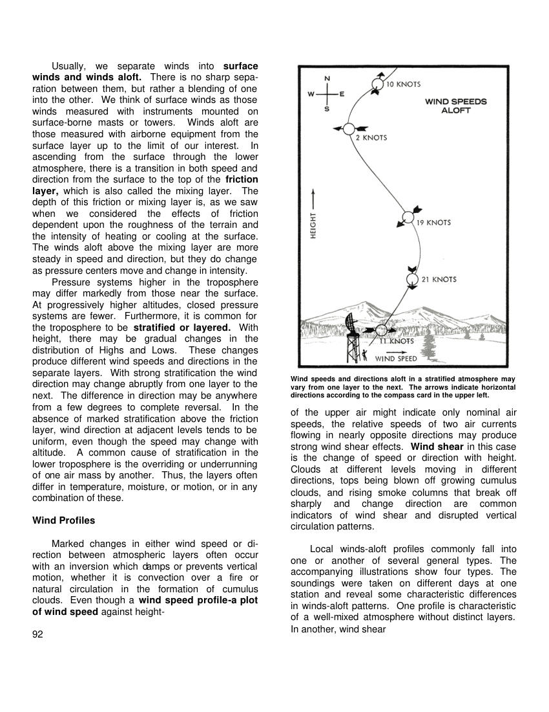

Usually, we separate winds into surface 
winds and winds aloft.  There is no sharp sepa-
ration between them, but rather a blending of one 
into the other.  We think of surface winds as those 
winds measured with instruments mounted on 
surface-borne masts or towers.  Winds aloft are 
those measured with airborne equipment from the 
surface layer up to the limit of our interest.  In 
ascending from the surface through the lower 
atmosphere, there is a transition in both speed and 
direction from the surface to the top of the friction 
layer, which is also called the mixing layer.  The 
depth of this friction or mixing layer is, as we saw 
when 
we 
considered 
the 
effects 
of 
friction 
dependent upon the roughness of the terrain and 
the intensity of heating or cooling at the surface. 
The winds aloft above the mixing layer are more 
steady in speed and direction, but they do change 
as pressure centers move and change in intensity. 
Pressure systems higher in the troposphere 
may differ markedly from those near the surface.  
At progressively higher altitudes, closed pressure 
systems are fewer.  Furthermore, it is common for 
the troposphere to be stratified or layered.  With 
height, there may be gradual changes in the 
distribution of Highs and Lows.  These changes 
produce different wind speeds and directions in the 
separate layers.  With strong stratification the wind 
direction may change abruptly from one layer to the 
next.  The difference in direction may be anywhere 
from a few degrees to complete reversal.  In the 
absence of marked stratification above the friction 
layer, wind direction at adjacent levels tends to be 
uniform, even though the speed may change with 
altitude.  A common cause of stratification in the 
lower troposphere is the overriding or underrunning 
of one air mass by another.  Thus, the layers often 
differ in temperature, moisture, or motion, or in any 
combination of these. 
 
Wind Profiles 
 
Marked changes in either wind speed or di-
rection between atmospheric layers often occur 
with an inversion which damps or prevents vertical 
motion, whether it is convection over a fire or 
natural circulation in the formation of cumulus 
clouds.  Even though a wind speed profile-a plot 
of wind speed against height- 
 
92 
 
 
Wind speeds and directions aloft in a stratified atmosphere may 
vary from one layer to the next.  The arrows indicate horizontal 
directions according to the compass card in the upper left.  
 
of the upper air might indicate only nominal air 
speeds, the relative speeds of two air currents 
flowing in nearly opposite directions may produce 
strong wind shear effects.  Wind shear in this case 
is the change of speed or direction with height. 
Clouds at different levels moving in different 
directions, tops being blown off growing cumulus 
clouds, and rising smoke columns that break off 
sharply 
and 
change 
direction 
are 
common 
indicators of wind shear and disrupted vertical 
circulation patterns. 
 
Local winds-aloft profiles commonly fall into 
one or another of several general types. The 
accompanying illustrations show four types. The 
soundings were taken on different days at one 
station and reveal some characteristic differences 
in winds-aloft patterns.  One profile is characteristic 
of a well-mixed atmosphere without distinct layers. 
In another, wind shear

## Page 9

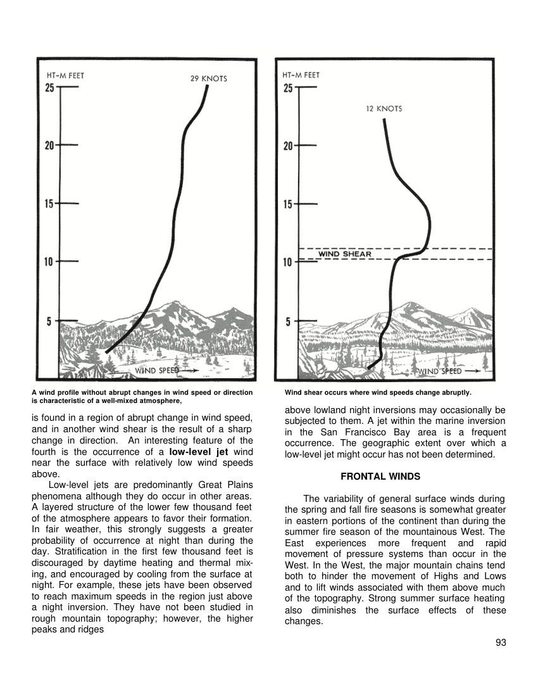

A wind profile without abrupt changes in wind speed or direction 
is characteristic of a well-mixed atmosphere, 
 
is found in a region of abrupt change in wind speed, 
and in another wind shear is the result of a sharp 
change in direction.  An interesting feature of the 
fourth is the occurrence of a low-level jet wind 
near the surface with relatively low wind speeds 
above. 
Low-level jets are predominantly Great Plains 
phenomena although they do occur in other areas. 
A layered structure of the lower few thousand feet 
of the atmosphere appears to favor their formation. 
In fair weather, this strongly suggests a greater 
probability of occurrence at night than during the 
day. Stratification in the first few thousand feet is 
discouraged by daytime heating and thermal mix-
ing, and encouraged by cooling from the surface at 
night. For example, these jets have been observed 
to reach maximum speeds in the region just above 
a night inversion. They have not been studied in 
rough mountain topography; however, the higher 
peaks and ridges 
 
Wind shear occurs where wind speeds change abruptly. 
 
above lowland night inversions may occasionally be 
subjected to them. A jet within the marine inversion 
in the San Francisco Bay area is a frequent 
occurrence. The geographic extent over which a 
low-level jet might occur has not been determined. 
 
FRONTAL WINDS 
 
The variability of general surface winds during 
the spring and fall fire seasons is somewhat greater 
in eastern portions of the continent than during the 
summer fire season of the mountainous West. The 
East 
experiences 
more 
frequent 
and 
rapid 
movement of pressure systems than occur in the 
West. In the West, the major mountain chains tend 
both to hinder the movement of Highs and Lows 
and to lift winds associated with them above much 
of the topography. Strong summer surface heating 
also diminishes the surface effects of these 
changes. 
 
93

## Page 10

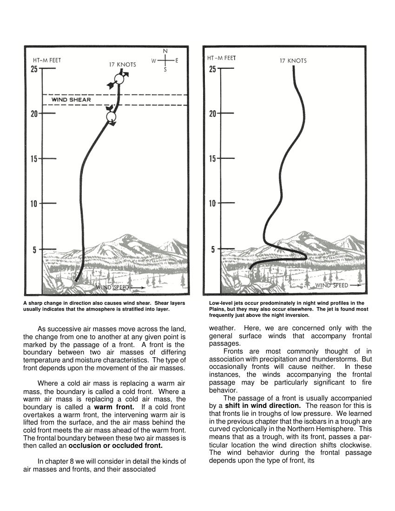

A sharp change in direction also causes wind shear.  Shear layers 
usually indicates that the atmosphere is stratified into layer. 
 
 
As successive air masses move across the land, 
the change from one to another at any given point is 
marked by the passage of a front.  A front is the 
boundary between two air masses of differing 
temperature and moisture characteristics.  The type of 
front depends upon the movement of the air masses. 
 
Where a cold air mass is replacing a warm air 
mass, the boundary is called a cold front.  Where a 
warm air mass is replacing a cold air mass, the 
boundary is called a warm front.  If a cold front 
overtakes a warm front, the intervening warm air is 
lifted from the surface, and the air mass behind the 
cold front meets the air mass ahead of the warm front. 
The frontal boundary between these two air masses is 
then called an occlusion or occluded front. 
 
In chapter 8 we will consider in detail the kinds of 
air masses and fronts, and their associated 
Low-level jets occur predominately in night wind profiles in the 
Plains, but they may also occur elsewhere.  The jet is found most 
frequently just above the night inversion. 
 
weather.  Here, we are concerned only with the 
general surface winds that accompany frontal 
passages. 
Fronts are most commonly thought of in 
association with precipitation and thunderstorms.  But 
occasionally fronts will cause neither.  In these 
instances, the winds accompanying the frontal 
passage may be particularly significant to fire 
behavior. 
The passage of a front is usually accompanied 
by a shift in wind direction.  The reason for this is 
that fronts lie in troughs of low pressure.  We learned 
in the previous chapter that the isobars in a trough are 
curved cyclonically in the Northern Hemisphere.  This 
means that as a trough, with its front, passes a par-
ticular location the wind direction shifts clockwise.  
The wind behavior during the frontal passage 
depends upon the type of front, its

## Page 11

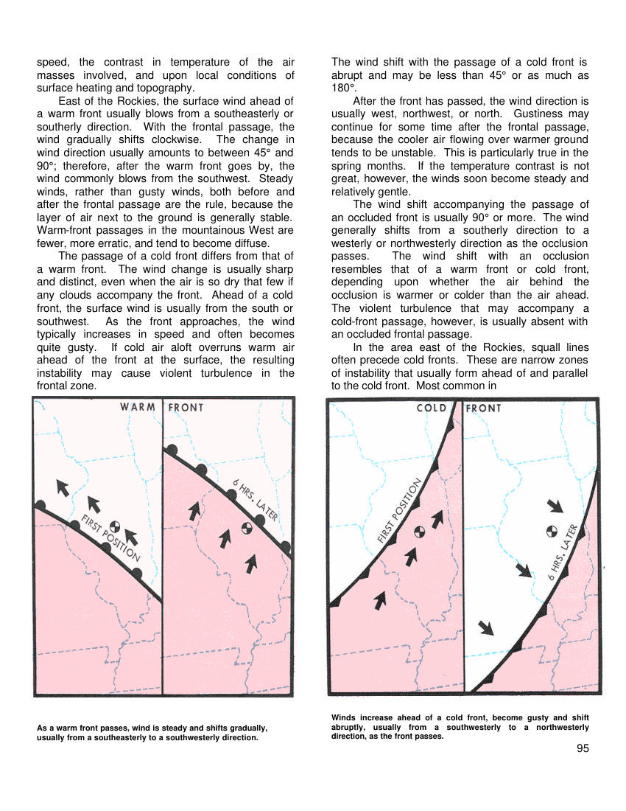

speed, the contrast in temperature of the air 
masses involved, and upon local conditions of 
surface heating and topography. 
East of the Rockies, the surface wind ahead of 
a warm front usually blows from a southeasterly or 
southerly direction.  With the frontal passage, the 
wind gradually shifts clockwise.  The change in 
wind direction usually amounts to between 45° and 
90°; therefore, after the warm front goes by, the 
wind commonly blows from the southwest.  Steady 
winds, rather than gusty winds, both before and 
after the frontal passage are the rule, because the 
layer of air next to the ground is generally stable. 
Warm-front passages in the mountainous West are 
fewer, more erratic, and tend to become diffuse. 
The passage of a cold front differs from that of 
a warm front.  The wind change is usually sharp 
and distinct, even when the air is so dry that few if 
any clouds accompany the front.  Ahead of a cold 
front, the surface wind is usually from the south or 
southwest.  As the front approaches, the wind 
typically increases in speed and often becomes 
quite gusty.  If cold air aloft overruns warm air 
ahead of the front at the surface, the resulting 
instability may cause violent turbulence in the 
frontal zone. 
 
 
As a warm front passes, wind is steady and shifts gradually, 
usually from a southeasterly to a southwesterly direction. 
 
The wind shift with the passage of a cold front is 
abrupt and may be less than 45° or as much as 
180°. 
After the front has passed, the wind direction is 
usually west, northwest, or north.  Gustiness may 
continue for some time after the frontal passage, 
because the cooler air flowing over warmer ground 
tends to be unstable.  This is particularly true in the 
spring months.  If the temperature contrast is not 
great, however, the winds soon become steady and 
relatively gentle. 
The wind shift accompanying the passage of 
an occluded front is usually 90° or more.  The wind 
generally shifts from a southerly direction to a 
westerly or northwesterly direction as the occlusion 
passes.  The wind shift with an occlusion 
resembles that of a warm front or cold front, 
depending upon whether the air behind the 
occlusion is warmer or colder than the air ahead. 
The violent turbulence that may accompany a 
cold-front passage, however, is usually absent with 
an occluded frontal passage. 
In the area east of the Rockies, squall lines 
often precede cold fronts.  These are narrow zones 
of instability that usually form ahead of and parallel 
to the cold front.  Most common in 
 
Winds increase ahead of a cold front, become gusty and shift 
abruptly, usually from a southwesterly to a northwesterly 
direction, as the front passes. 
95

## Page 12

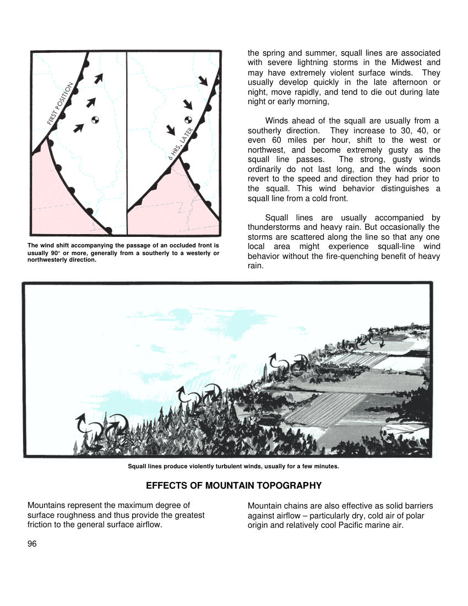

The wind shift accompanying the passage of an occluded front is 
usually 90° or more, generally from a southerly to a westerly or 
northwesterly direction. 
 
 
the spring and summer, squall lines are associated 
with severe lightning storms in the Midwest and 
may have extremely violent surface winds.  They 
usually develop quickly in the late afternoon or 
night, move rapidly, and tend to die out during late 
night or early morning, 
 
Winds ahead of the squall are usually from a 
southerly direction.  They increase to 30, 40, or 
even 60 miles per hour, shift to the west or 
northwest, and become extremely gusty as the 
squall line passes.  The strong, gusty winds 
ordinarily do not last long, and the winds soon 
revert to the speed and direction they had prior to 
the squall. This wind behavior distinguishes a 
squall line from a cold front. 
 
Squall lines are usually accompanied by 
thunderstorms and heavy rain. But occasionally the 
storms are scattered along the line so that any one 
local 
area 
might 
experience 
squall-line wind 
behavior without the fire-quenching benefit of heavy 
rain.
Squall lines produce violently turbulent winds, usually for a few minutes. 
 
EFFECTS OF MOUNTAIN TOPOGRAPHY 
 
Mountains represent the maximum degree of 
surface roughness and thus provide the greatest 
friction to the general surface airflow. 
 
96 
 
 
Mountain chains are also effective as solid barriers 
against airflow – particularly dry, cold air of polar 
origin and relatively cool Pacific marine air.

## Page 13

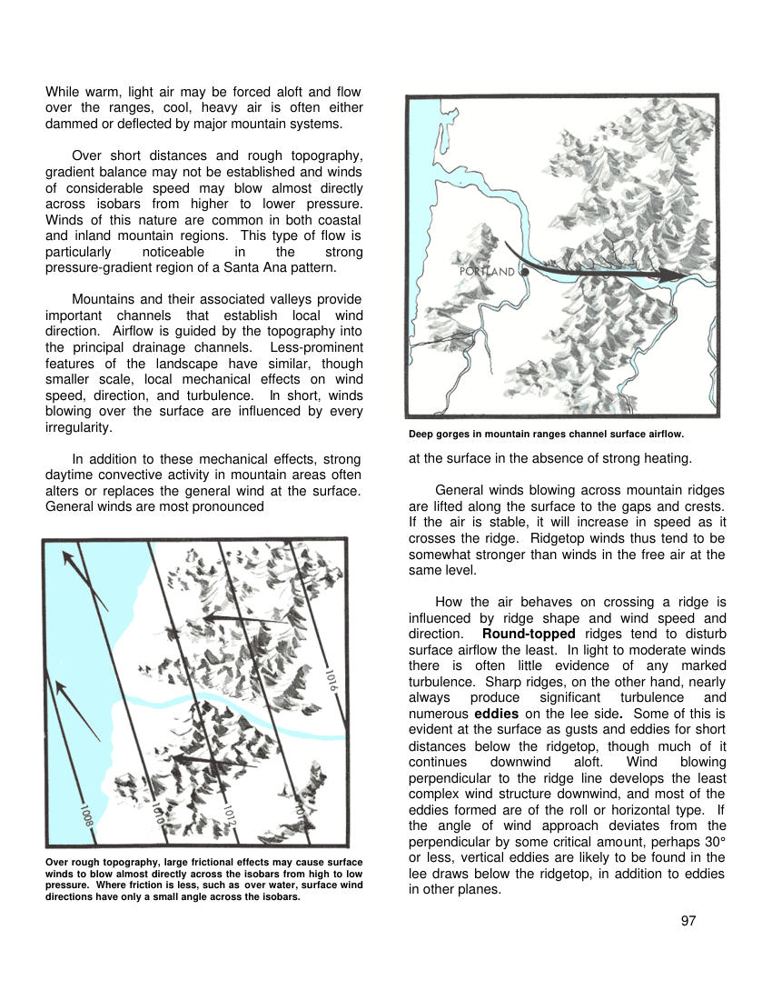

While warm, light air may be forced aloft and flow 
over the ranges, cool, heavy air is often either 
dammed or deflected by major mountain systems. 
 
Over short distances and rough topography, 
gradient balance may not be established and winds 
of considerable speed may blow almost directly 
across isobars from higher to lower pressure. 
Winds of this nature are common in both coastal 
and inland mountain regions.  This type of flow is 
particularly 
noticeable 
in 
the 
strong 
pressure-gradient region of a Santa Ana pattern. 
 
Mountains and their associated valleys provide 
important 
channels 
that 
establish 
local 
wind 
direction.  Airflow is guided by the topography into 
the principal drainage channels.  Less-prominent 
features of the landscape have similar, though 
smaller scale, local mechanical effects on wind 
speed, direction, and turbulence.  In short, winds 
blowing over the surface are influenced by every 
irregularity. 
 
In addition to these mechanical effects, strong 
daytime convective activity in mountain areas often 
alters or replaces the general wind at the surface. 
General winds are most pronounced 
 
Over rough topography, large frictional effects may cause surface 
winds to blow almost directly across the isobars from high to low 
pressure.  Where friction is less, such as over water, surface wind 
directions have only a small angle across the isobars. 
 
 
Deep gorges in mountain ranges channel surface airflow. 
 
at the surface in the absence of strong heating. 
 
General winds blowing across mountain ridges 
are lifted along the surface to the gaps and crests. 
If the air is stable, it will increase in speed as it 
crosses the ridge.  Ridgetop winds thus tend to be 
somewhat stronger than winds in the free air at the 
same level. 
 
How the air behaves on crossing a ridge is 
influenced by ridge shape and wind speed and 
direction.  Round-topped ridges tend to disturb 
surface airflow the least.  In light to moderate winds 
there is often little evidence of any marked 
turbulence.  Sharp ridges, on the other hand, nearly 
always 
produce 
significant 
turbulence 
and 
numerous eddies on the lee side.  Some of this is 
evident at the surface as gusts and eddies for short 
distances below the ridgetop, though much of it 
continues 
downwind 
aloft. 
Wind 
blowing 
perpendicular to the ridge line develops the least 
complex wind structure downwind, and most of the 
eddies formed are of the roll or horizontal type.  If 
the angle of wind approach deviates from the 
perpendicular by some critical amount, perhaps 30° 
or less, vertical eddies are likely to be found in the 
lee draws below the ridgetop, in addition to eddies 
in other planes. 
 
97

## Page 14

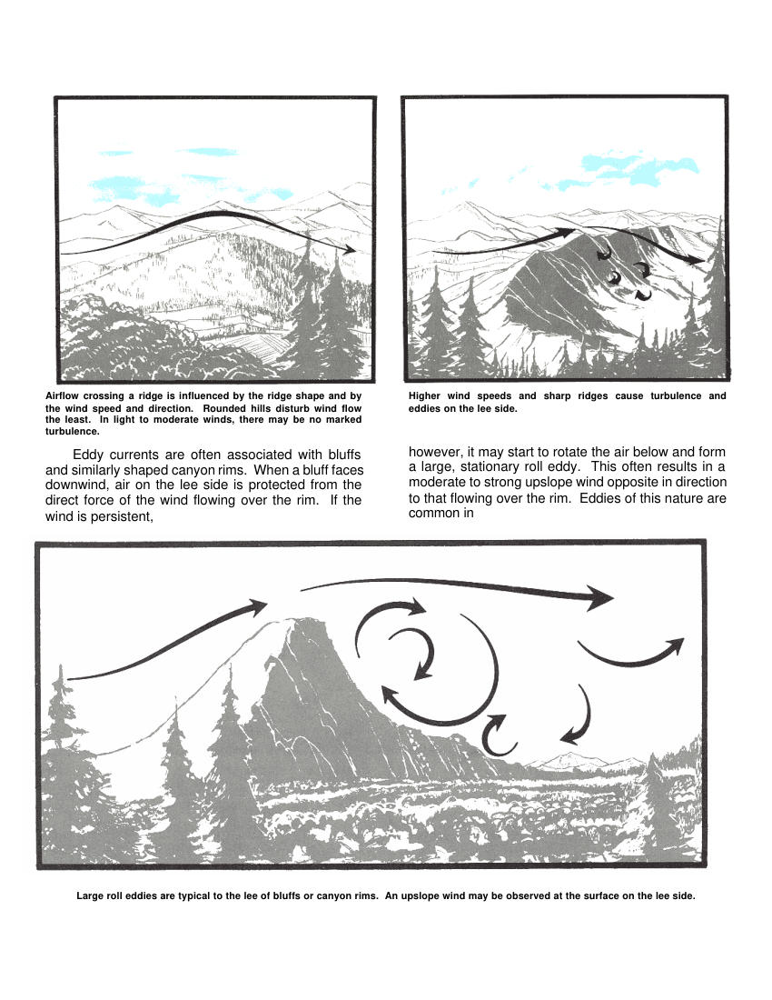

Airflow crossing a ridge is influenced by the ridge shape and by 
the wind speed and direction.  Rounded hills disturb wind flow 
the least.  In light to moderate winds, there may be no marked 
turbulence. 
 
Eddy currents are often associated with bluffs 
and similarly shaped canyon rims.  When a bluff faces 
downwind, air on the lee side is protected from the 
direct force of the wind flowing over the rim.  If the 
wind is persistent, 
 
Higher wind speeds and sharp ridges cause turbulence and 
eddies on the lee side. 
 
 
however, it may start to rotate the air below and form 
a large, stationary roll eddy.  This often results in a 
moderate to strong upslope wind opposite in direction 
to that flowing over the rim.  Eddies of this nature are 
common in 
 
Large roll eddies are typical to the lee of bluffs or canyon rims.  An upslope wind may be observed at the surface on the lee side.

## Page 15

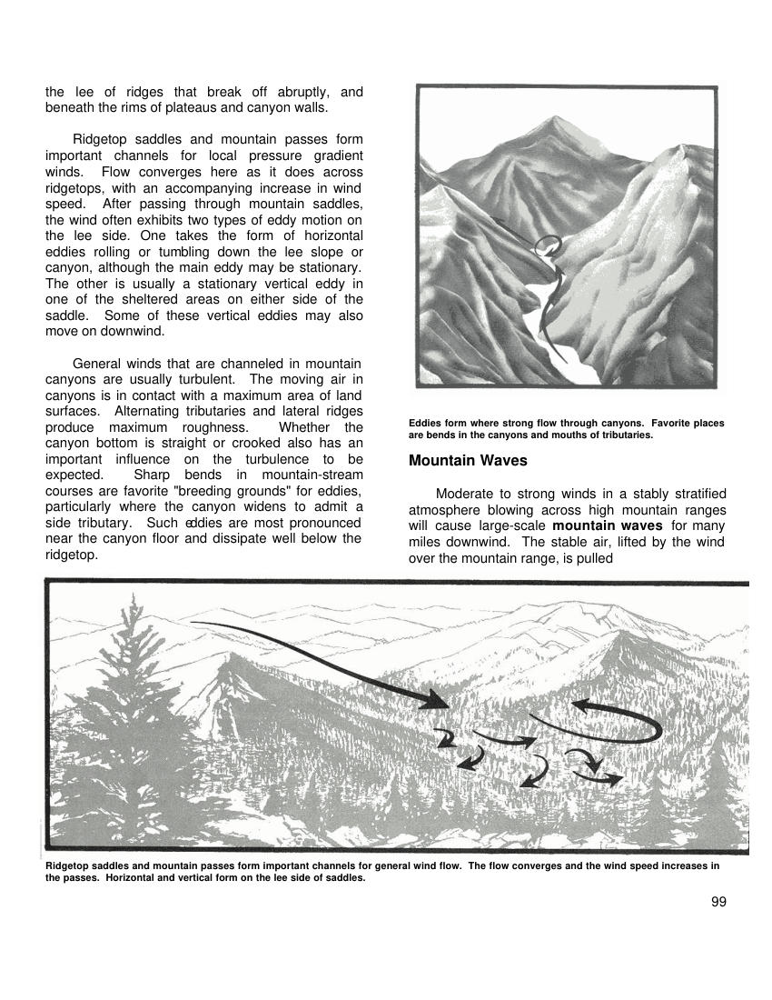

the lee of ridges that break off abruptly, and 
beneath the rims of plateaus and canyon walls. 
 
Ridgetop saddles and mountain passes form 
important channels for local pressure gradient 
winds.  Flow converges here as it does across 
ridgetops, with an accompanying increase in wind 
speed.  After passing through mountain saddles, 
the wind often exhibits two types of eddy motion on 
the lee side. One takes the form of horizontal 
eddies rolling or tumbling down the lee slope or 
canyon, although the main eddy may be stationary. 
The other is usually a stationary vertical eddy in 
one of the sheltered areas on either side of the 
saddle.  Some of these vertical eddies may also 
move on downwind. 
 
General winds that are channeled in mountain 
canyons are usually turbulent.  The moving air in 
canyons is in contact with a maximum area of land 
surfaces.  Alternating tributaries and lateral ridges 
produce 
maximum 
roughness. 
 
Whether 
the 
canyon bottom is straight or crooked also has an 
important influence on the turbulence to be 
expected. 
 
Sharp 
bends 
in 
mountain-stream 
courses are favorite "breeding grounds" for eddies, 
particularly where the canyon widens to admit a 
side tributary.  Such eddies are most pronounced 
near the canyon floor and dissipate well below the 
ridgetop. 
 
 
Eddies form where strong flow through canyons.  Favorite places 
are bends in the canyons and mouths of tributaries. 
 
Mountain Waves 
 
Moderate to strong winds in a stably stratified 
atmosphere blowing across high mountain ranges 
will cause large-scale mountain waves for many 
miles downwind.  The stable air, lifted by the wind 
over the mountain range, is pulled 
Ridgetop saddles and mountain passes form important channels for general wind flow.  The flow converges and the wind speed increases in 
the passes.  Horizontal and vertical form on the lee side of saddles. 
 
99

## Page 16

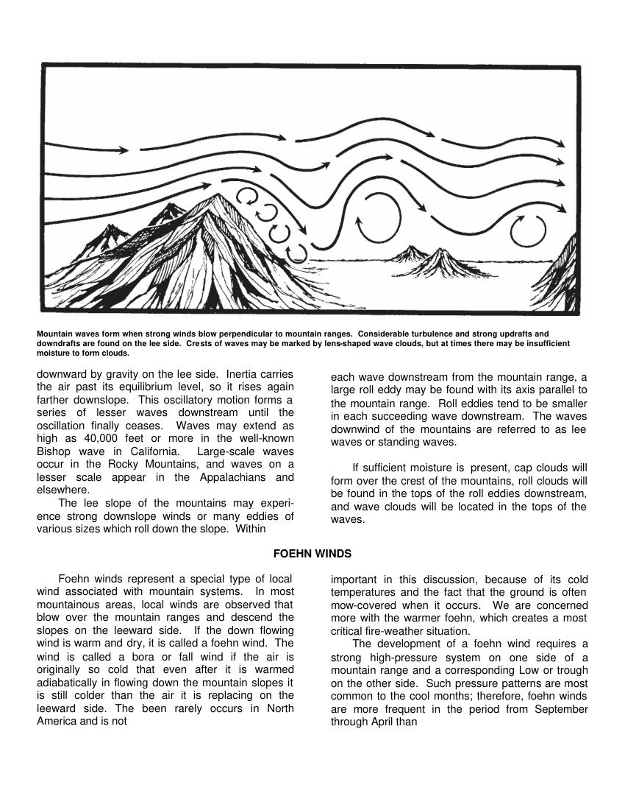

Mountain waves form when strong winds blow perpendicular to mountain ranges.  Considerable turbulence and strong updrafts and 
downdrafts are found on the lee side.  Crests of waves may be marked by lens-shaped wave clouds, but at times there may be insufficient 
moisture to form clouds.
 
downward by gravity on the lee side.  Inertia carries 
the air past its equilibrium level, so it rises again 
farther downslope.  This oscillatory motion forms a 
series of lesser waves downstream until the 
oscillation finally ceases.  Waves may extend as 
high as 40,000 feet or more in the well-known 
Bishop wave in California.  Large-scale waves 
occur in the Rocky Mountains, and waves on a 
lesser scale appear in the Appalachians and 
elsewhere. 
The lee slope of the mountains may experi-
ence strong downslope winds or many eddies of 
various sizes which roll down the slope.  Within 
 
 
each wave downstream from the mountain range, a 
large roll eddy may be found with its axis parallel to 
the mountain range.  Roll eddies tend to be smaller 
in each succeeding wave downstream.  The waves 
downwind of the mountains are referred to as lee 
waves or standing waves. 
 
If sufficient moisture is present, cap clouds will 
form over the crest of the mountains, roll clouds will 
be found in the tops of the roll eddies downstream, 
and wave clouds will be located in the tops of the 
waves. 
 
FOEHN WINDS
 
Foehn winds represent a special type of local 
wind associated with mountain systems.  In most 
mountainous areas, local winds are observed that 
blow over the mountain ranges and descend the 
slopes on the leeward side.  If the down flowing 
wind is warm and dry, it is called a foehn wind.  The 
wind is called a bora or fall wind if the air is 
originally so cold that even after it is warmed 
adiabatically in flowing down the mountain slopes it 
is still colder than the air it is replacing on the 
leeward side. The been rarely occurs in North 
America and is not  
 
 
 
important in this discussion, because of its cold 
temperatures and the fact that the ground is often 
mow-covered when it occurs.  We are concerned 
more with the warmer foehn, which creates a most 
critical fire-weather situation. 
The development of a foehn wind requires a 
strong high-pressure system on one side of a 
mountain range and a corresponding Low or trough 
on the other side.  Such pressure patterns are most 
common to the cool months; therefore, foehn winds 
are more frequent in the period from September 
through April than

## Page 17

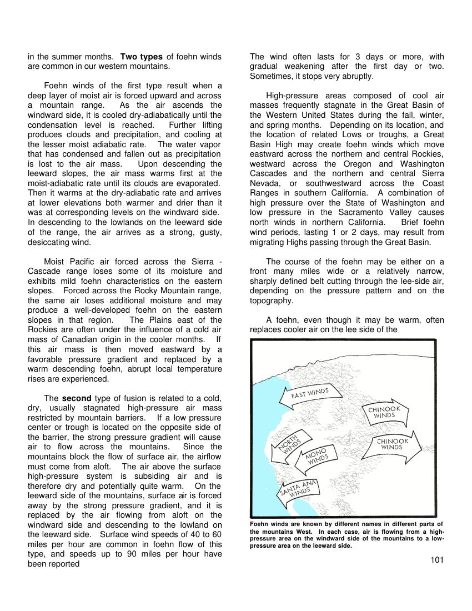

in the summer months.  Two types of foehn winds 
are common in our western mountains. 
 
Foehn winds of the first type result when a 
deep layer of moist air is forced upward and across 
a mountain range.  As the air ascends the 
windward side, it is cooled dry-adiabatically until the 
condensation level is reached.  Further lifting 
produces clouds and precipitation, and cooling at 
the lesser moist adiabatic rate.   The water vapor 
that has condensed and fallen out as precipitation 
is lost to the air mass.   Upon descending the 
leeward slopes, the air mass warms first at the 
moist-adiabatic rate until its clouds are evaporated.  
Then it warms at the dry-adiabatic rate and arrives 
at lower elevations both warmer and drier than it 
was at corresponding levels on the windward side.   
In descending to the lowlands on the leeward side 
of the range, the air arrives as a strong, gusty, 
desiccating wind. 
 
Moist Pacific air forced across the Sierra -
Cascade range loses some of its moisture and 
exhibits mild foehn characteristics on the eastern 
slopes.   Forced across the Rocky Mountain range, 
the same air loses additional moisture and may 
produce a well-developed foehn on the eastern 
slopes in that region.   The Plains east of the 
Rockies are often under the influence of a cold air 
mass of Canadian origin in the cooler months.   If 
this air mass is then moved eastward by a 
favorable pressure gradient and replaced by a 
warm descending foehn, abrupt local temperature 
rises are experienced. 
 
The second type of fusion is related to a cold, 
dry, usually stagnated high-pressure air mass 
restricted by mountain barriers.   If a low pressure 
center or trough is located on the opposite side of 
the barrier, the strong pressure gradient will cause 
air to flow across the mountains.  Since the 
mountains block the flow of surface air, the airflow 
must come from aloft.   The air above the surface 
high-pressure system is subsiding air and is 
therefore dry and potentially quite warm.   On the 
leeward side of the mountains, surface air is forced 
away by the strong pressure gradient, and it is 
replaced by the air flowing from aloft on the 
windward side and descending to the lowland on 
the leeward side.   Surface wind speeds of 40 to 60 
miles per hour are common in foehn flow of this 
type, and speeds up to 90 miles per hour have 
been reported 
The wind often lasts for 3 days or more, with 
gradual weakening after the first day or two.  
Sometimes, it stops very abruptly. 
 
High-pressure areas composed of cool air 
masses frequently stagnate in the Great Basin of 
the Western United States during the fall, winter, 
and spring months.   Depending on its location, and 
the location of related Lows or troughs, a Great 
Basin High may create foehn winds which move 
eastward across the northern and central Rockies, 
westward across the Oregon and Washington 
Cascades and the northern and central Sierra 
Nevada, or southwestward across the Coast 
Ranges in southern California.  A combination of 
high pressure over the State of Washington and 
low pressure in the Sacramento Valley causes 
north winds in northern California.   Brief foehn 
wind periods, lasting 1 or 2 days, may result from 
migrating Highs passing through the Great Basin. 
 
The course of the foehn may be either on a 
front many miles wide or a relatively narrow, 
sharply defined belt cutting through the lee-side air, 
depending on the pressure pattern and on the 
topography. 
 
A foehn, even though it may be warm, often 
replaces cooler air on the lee side of the 
Foehn winds are known by different names in different parts of 
the mountains West.  In each case, air is flowing from a high-
pressure area on the windward side of the mountains to a low-
pressure area on the leeward side. 
 
101

## Page 18

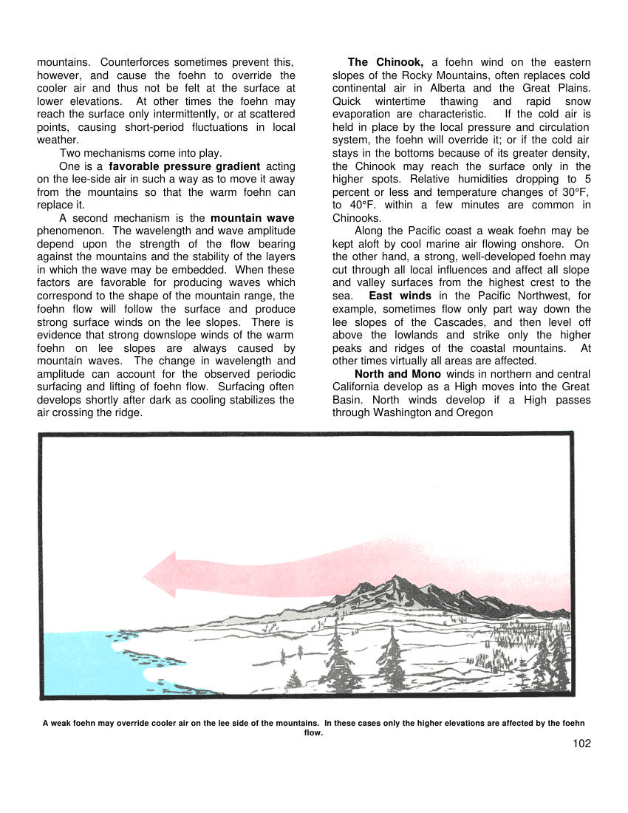

mountains.  Counterforces sometimes prevent this, 
however, and cause the foehn to override the 
cooler air and thus not be felt at the surface at 
lower elevations.  At other times the foehn may 
reach the surface only intermittently, or at scattered 
points, causing short-period fluctuations in local 
weather. 
Two mechanisms come into play. 
One is a favorable pressure gradient acting 
on the lee-side air in such a way as to move it away 
from the mountains so that the warm foehn can 
replace it. 
A second mechanism is the mountain wave 
phenomenon.  The wavelength and wave amplitude 
depend upon the strength of the flow bearing 
against the mountains and the stability of the layers 
in which the wave may be embedded.  When these 
factors are favorable for producing waves which 
correspond to the shape of the mountain range, the 
foehn flow will follow the surface and produce 
strong surface winds on the lee slopes.  There is 
evidence that strong downslope winds of the warm 
foehn on lee slopes are always caused by 
mountain waves.  The change in wavelength and 
amplitude can account for the observed periodic 
surfacing and lifting of foehn flow.  Surfacing often 
develops shortly after dark as cooling stabilizes the 
air crossing the ridge. 
 
     The Chinook, a foehn wind on the eastern 
slopes of the Rocky Mountains, often replaces cold 
continental air in Alberta and the Great Plains. 
Quick 
wintertime 
thawing 
and 
rapid 
snow 
evaporation are characteristic.   If the cold air is 
held in place by the local pressure and circulation 
system, the foehn will override it; or if the cold air 
stays in the bottoms because of its greater density, 
the Chinook may reach the surface only in the 
higher spots. Relative humidities dropping to 5 
percent or less and temperature changes of 30°F, 
to 40°F. within a few minutes are common in 
Chinooks. 
Along the Pacific coast a weak foehn may be 
kept aloft by cool marine air flowing onshore.  On 
the other hand, a strong, well-developed foehn may 
cut through all local influences and affect all slope 
and valley surfaces from the highest crest to the 
sea.  East winds in the Pacific Northwest, for 
example, sometimes flow only part way down the 
lee slopes of the Cascades, and then level off 
above the lowlands and strike only the higher 
peaks and ridges of the coastal mountains.  At 
other times virtually all areas are affected. 
North and Mono winds in northern and central 
California develop as a High moves into the Great 
Basin. North winds develop if a High passes 
through Washington and Oregon 
A weak foehn may override cooler air on the lee side of the mountains.  In these cases only the higher elevations are affected by the foehn 
flow. 
 
102

## Page 19

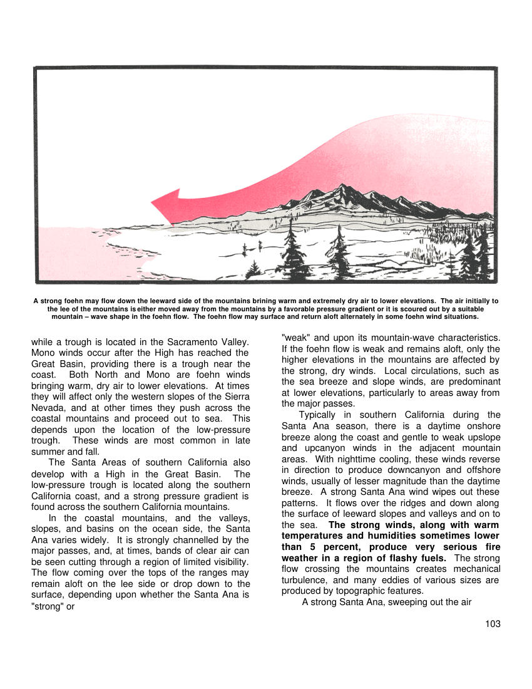

A strong foehn may flow down the leeward side of the mountains brining warm and extremely dry air to lower elevations.  The air initially to 
the lee of the mountains is either moved away from the mountains by a favorable pressure gradient or it is scoured out by a suitable 
mountain – wave shape in the foehn flow.  The foehn flow may surface and return aloft alternately in some foehn wind situations.
 
 
while a trough is located in the Sacramento Valley. 
Mono winds occur after the High has reached the 
Great Basin, providing there is a trough near the 
coast.  Both North and Mono are foehn winds 
bringing warm, dry air to lower elevations.  At times 
they will affect only the western slopes of the Sierra 
Nevada, and at other times they push across the 
coastal mountains and proceed out to sea.  This 
depends upon the location of the low-pressure 
trough.  These winds are most common in late 
summer and fall. 
The Santa Areas of southern California also 
develop with a High in the Great Basin.  The 
low-pressure trough is located along the southern 
California coast, and a strong pressure gradient is 
found across the southern California mountains. 
In the coastal mountains, and the valleys, 
slopes, and basins on the ocean side, the Santa 
Ana varies widely.  It is strongly channelled by the 
major passes, and, at times, bands of clear air can 
be seen cutting through a region of limited visibility.  
The flow coming over the tops of the ranges may 
remain aloft on the lee side or drop down to the 
surface, depending upon whether the Santa Ana is 
"strong" or 
 
 
 
"weak" and upon its mountain-wave characteristics. 
If the foehn flow is weak and remains aloft, only the 
higher elevations in the mountains are affected by 
the strong, dry winds.  Local circulations, such as 
the sea breeze and slope winds, are predominant 
at lower elevations, particularly to areas away from 
the major passes. 
Typically in southern California during the 
Santa Ana season, there is a daytime onshore 
breeze along the coast and gentle to weak upslope 
and upcanyon winds in the adjacent mountain 
areas.  With nighttime cooling, these winds reverse 
in direction to produce downcanyon and offshore 
winds, usually of lesser magnitude than the daytime 
breeze.  A strong Santa Ana wind wipes out these 
patterns.  It flows over the ridges and down along 
the surface of leeward slopes and valleys and on to 
the sea.  The strong winds, along with warm 
temperatures and humidities sometimes lower 
than 5 percent, produce very serious fire 
weather in a region of flashy fuels.  The strong 
flow crossing the mountains creates mechanical 
turbulence, and many eddies of various sizes are 
produced by topographic features. 
A strong Santa Ana, sweeping out the air 
 
103

## Page 20

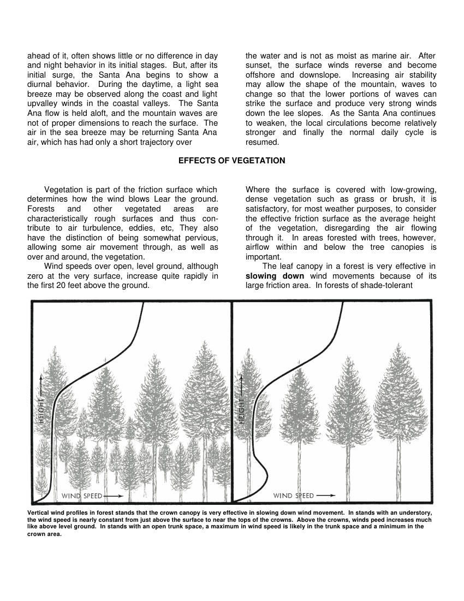

ahead of it, often shows little or no difference in day 
and night behavior in its initial stages.  But, after its 
initial surge, the Santa Ana begins to show a 
diurnal behavior.  During the daytime, a light sea 
breeze may be observed along the coast and light 
upvalley winds in the coastal valleys.  The Santa 
Ana flow is held aloft, and the mountain waves are 
not of proper dimensions to reach the surface.  The 
air in the sea breeze may be returning Santa Ana 
air, which has had only a short trajectory over 
 
the water and is not as moist as marine air.  After 
sunset, the surface winds reverse and become 
offshore and downslope.  Increasing air stability 
may allow the shape of the mountain, waves to 
change so that the lower portions of waves can 
strike the surface and produce very strong winds 
down the lee slopes.  As the Santa Ana continues 
to weaken, the local circulations become relatively 
stronger and finally the normal daily cycle is 
resumed. 
 
EFFECTS OF VEGETATION
 
 
Vegetation is part of the friction surface which 
determines how the wind blows Lear the ground. 
Forests 
and 
other 
vegetated 
areas 
are 
characteristically rough surfaces and thus con-
tribute to air turbulence, eddies, etc, They also 
have the distinction of being somewhat pervious, 
allowing some air movement through, as well as 
over and around, the vegetation. 
Wind speeds over open, level ground, although 
zero at the very surface, increase quite rapidly in 
the first 20 feet above the ground. 
 
 
Where the surface is covered with low-growing, 
dense vegetation such as grass or brush, it is 
satisfactory, for most weather purposes, to consider 
the effective friction surface as the average height 
of the vegetation, disregarding the air flowing 
through it.  In areas forested with trees, however, 
airflow within and below the tree canopies is 
important. 
The leaf canopy in a forest is very effective in 
slowing down wind movements because of its 
large friction area.  In forests of shade-tolerant 
 
Vertical wind profiles in forest stands that the crown canopy is very effective in slowing down wind movement.  In stands with an understory, 
the wind speed is nearly constant from just above the surface to near the tops of the crowns.  Above the crowns, winds peed increases much 
like above level ground.  In stands with an open trunk space, a maximum in wind speed is likely in the trunk space and a minimum in the 
crown area.

## Page 21

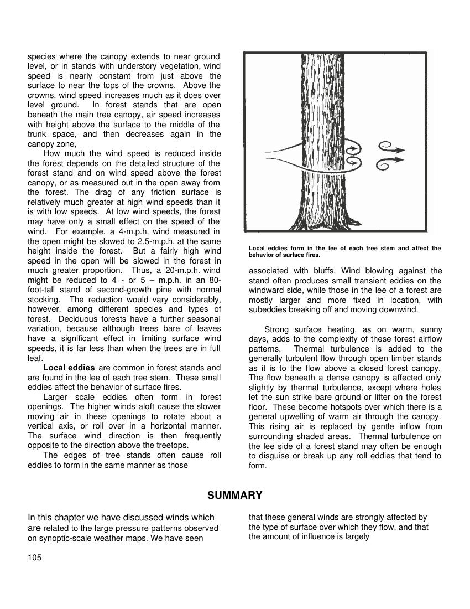

species where the canopy extends to near ground 
level, or in stands with understory vegetation, wind 
speed is nearly constant from just above the 
surface to near the tops of the crowns.  Above the 
crowns, wind speed increases much as it does over 
level ground.  In forest stands that are open 
beneath the main tree canopy, air speed increases 
with height above the surface to the middle of the 
trunk space, and then decreases again in the 
canopy zone, 
How much the wind speed is reduced inside 
the forest depends on the detailed structure of the 
forest stand and on wind speed above the forest 
canopy, or as measured out in the open away from 
the forest. The drag of any friction surface is 
relatively much greater at high wind speeds than it 
is with low speeds.  At low wind speeds, the forest 
may have only a small effect on the speed of the 
wind.  For example, a 4-m.p.h. wind measured in 
the open might be slowed to 2.5-m.p.h. at the same 
height inside the forest.  But a fairly high wind 
speed in the open will be slowed in the forest in 
much greater proportion.  Thus, a 20-m.p.h. wind 
might be reduced to 4 - or 5 – m.p.h. in an 80-
foot-tall stand of second-growth pine with normal 
stocking.  The reduction would vary considerably, 
however, among different species and types of 
forest.  Deciduous forests have a further seasonal 
variation, because although trees bare of leaves 
have a significant effect in limiting surface wind 
speeds, it is far less than when the trees are in full 
leaf. 
Local eddies are common in forest stands and 
are found in the lee of each tree stem.  These small 
eddies affect the behavior of surface fires. 
Larger scale eddies often form in forest 
openings.  The higher winds aloft cause the slower 
moving air in these openings to rotate about a 
vertical axis, or roll over in a horizontal manner. 
The surface wind direction is then frequently 
opposite to the direction above the treetops. 
The edges of tree stands often cause roll 
eddies to form in the same manner as those 
 
 
 
Local eddies form in the lee of each tree stem and affect the 
behavior of surface fires. 
 
associated with bluffs. Wind blowing against the 
stand often produces small transient eddies on the 
windward side, while those in the lee of a forest are 
mostly larger and more fixed in location, with 
subeddies breaking off and moving downwind. 
 
Strong surface heating, as on warm, sunny 
days, adds to the complexity of these forest airflow 
patterns.  Thermal turbulence is added to the 
generally turbulent flow through open timber stands 
as it is to the flow above a closed forest canopy. 
The flow beneath a dense canopy is affected only 
slightly by thermal turbulence, except where holes 
let the sun strike bare ground or litter on the forest 
floor.  These become hotspots over which there is a 
general upwelling of warm air through the canopy. 
This rising air is replaced by gentle inflow from 
surrounding shaded areas.  Thermal turbulence on 
the lee side of a forest stand may often be enough 
to disguise or break up any roll eddies that tend to 
form. 
 
SUMMARY
 
 
In this chapter we have discussed winds which 
are related to the large pressure patterns observed 
on synoptic-scale weather maps. We have seen 
 
105 
that these general winds are strongly affected by 
the type of surface over which they flow, and that 
the amount of influence is largely

## Page 22

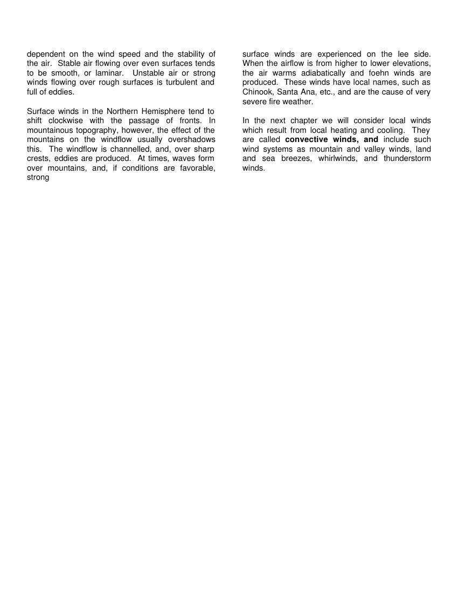

dependent on the wind speed and the stability of 
the air.  Stable air flowing over even surfaces tends 
to be smooth, or laminar.  Unstable air or strong 
winds flowing over rough surfaces is turbulent and 
full of eddies. 
 
Surface winds in the Northern Hemisphere tend to 
shift clockwise with the passage of fronts. In 
mountainous topography, however, the effect of the 
mountains on the windflow usually overshadows 
this.  The windflow is channelled, and, over sharp 
crests, eddies are produced.  At times, waves form 
over mountains, and, if conditions are favorable, 
strong 
 
 
 
 
 
 
 
 
 
 
 
 
 
 
 
 
 
 
 
 
 
 
 
 
 
 
 
 
 
 
 
 
 
 
 
 
 
 
 
surface winds are experienced on the lee side. 
When the airflow is from higher to lower elevations, 
the air warms adiabatically and foehn winds are 
produced.  These winds have local names, such as 
Chinook, Santa Ana, etc., and are the cause of very 
severe fire weather. 
 
In the next chapter we will consider local winds 
which result from local heating and cooling.  They 
are called convective winds, and include such 
wind systems as mountain and valley winds, land 
and sea breezes, whirlwinds, and thunderstorm 
winds.
