# Jet Stream/Jet Streaks

> Source: <http://www.weather.gov/source/zhu/ZHU_Training_Page/winds/JetStream_Stuff/300_200_chart.htm>  
> Section: Winds/Jetstream  
> Captured: 2026-08-19 06:00 UTC  
> PDF: [jet-stream-jet-streaks.pdf](jet-stream-jet-streaks.pdf) · Original HTML: [source/original.html](source/original.html)

---

**Select A Tutorial Below or Scroll Down**- **[Jet Stream Tutorial](#JET)**
- **[Jet Streak Movement Tutorial](#JET2)**
- **[In Depth Jet Streak Tutorial](#JET3)**
- **[Entrance Region of Jet Streak](#JET4)**

**THE 300 / 200 MB CHART**

**METEOROLOGIST JEFF HABY**
[theweatherprediction.com](https://theweatherprediction.com/)

One of a forecaster's first thoughts when confronted with the 300/200 mb chart is the
jet stream. The jet stream is a high velocity river of air that flows completely around the Earth at the mid-latitudes. During winter, the jet core is located generally closer to 300 millibars since the air is more cold and dense in the vicinity of the jet stream during the cool season. The 200 millibar chart is used for the jet stream in the warm season but either chart in most instances will suffice. Many hot air balloonists have tried to ride this river of air around the world with not much success for most. The river of air is not continuous. Embedded within the jet stream are higher velocity jet streaks. Jet streaks are segments of faster wind speed within the jet stream.

At 300 mb, the air density is much smaller than near the surface. A 100-knot wind at the 200/300 millibar level
does not feel as strong as a 100 knot wind at the surface. Even though the density is smaller, these air currents
have the power to drive the movement of storm systems and build troughs and ridges.

One jet streak can turn a beautiful Monday into a severe storm Tuesday, as we will see in an example later. Troughs and ridges are not only carved by warm air and cold air advection but also by the high momentum air of jet streaks.
A significant jet streak has winds over 100 knots. Look at the 300 mb chart in this section labeled **"Time 1"**.
A jet streak exists from Colorado to Montana. The highest wind speeds in the jet streak (aka jet core, jet surge)
are 130 knots (150 miles per hour) in southern Wyoming.

Parcels within the jet streak are diving to the southeast. The air's momentum forces a trough to develop across
the Central US. In **"Time 2"**, the chart from 12 hours later, the jet streak has moved further to the southeast
and the associated trough is becoming more amplified. At **"Time 3"** the jet streak has turned the corner and
is in the base of the trough. The trough is at maximum amplification. The trough will now move to the east
and eventually to the northeast. It is difficult to determine the four quadrants of a jet streak when one
"turns the corner". Divergence and rising motion are strongest to the north of the jet axis, such as in
Tennessee during highly curved jet streaks.

 **RULE OF THUMB:** If a jet streak exists on the left side of a
trough and winds are stronger to the left of the trough (as it is in our example in **"Time 1"**), the trough
will become more amplified with time and will dig in a southerly direction. If a jet streak exists on the
right side of a trough and winds are stronger to the right of the trough, the trough will become less amplified
with time and "lift out" in a northeasterly direction. If the winds are about the same on each side of the
trough, it will stay at about the same amplification. This knowledge will make you a better forecaster! A jet streak progression is shown below

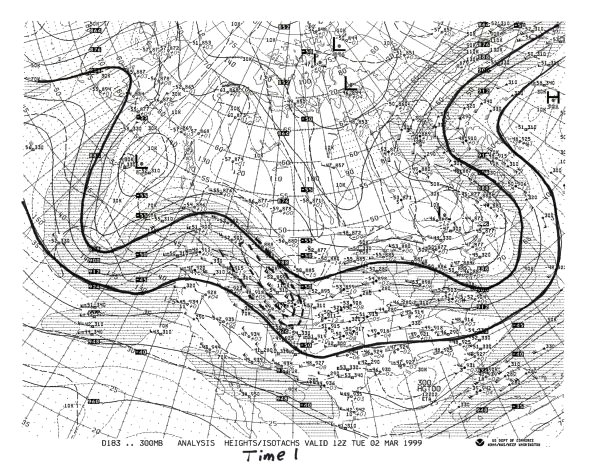

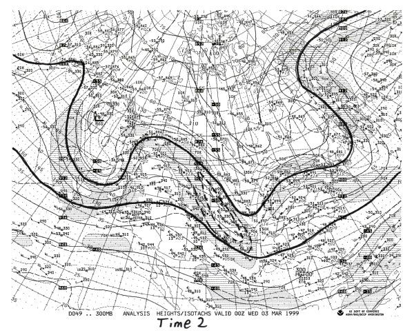

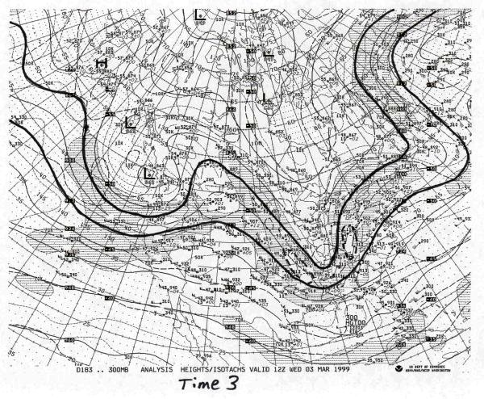

The jet stream is useful for the prediction of temperature. The jet stream divides colder air to the
north from warmer air to the south. The transition between temperatures on each side of the jet is very abrupt.
Heights are higher to the south of the jet and lower to the north. In the upper levels, this creates relatively
high heights to the south of the jet and relatively low heights to the north. The Pressure Gradient Force flows
from a southerly to northerly direction. However, the Coriolis force shifts the wind flow to the right of the path of motion. Therefore, the jet stream flows from the west to east. When a trough builds over a region it often
indicates cooler temperatures due to cloudier weather and northerly winds. A ridge builds by low level (between
the surface and 700-mb) warm air advection and upper level forcing (negative vorticity). Air in a ridge is
sinking and is thus expanding and creating higher heights. Therefore, temperatures are warmer than normal in
a ridge due to warmer temperatures and sunnier weather. This is especially true when a ridge occurs in high
latitudes. Below is a diagram showing the development of the polar jet and the wind pattern the PGF and
Coriolis produce.

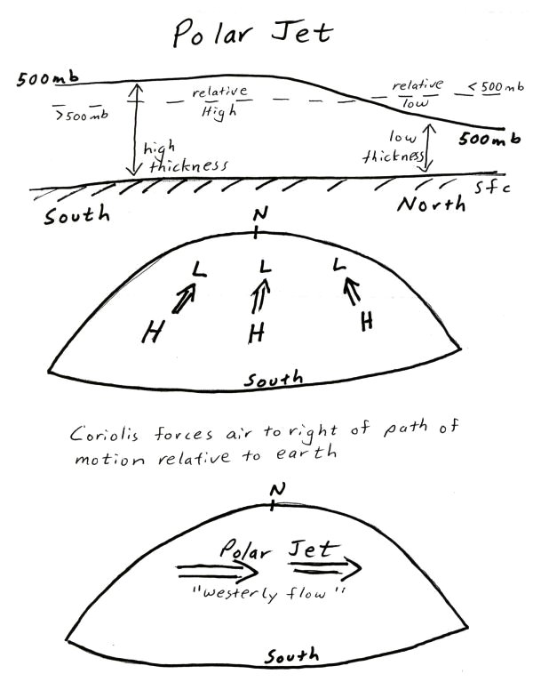

Certain regions of jet streaks are more favorable for rising or sinking air. Where convergence occurs in the
upper levels, sinking motion results. Where divergence (evacuation of mass) occurs in the upper levels, rising
motion result. Convergence and divergence in a jet streak is caused by an imbalance of forces as a parcel accelerates
into a jet streak then decelerates out of the jet streak. The depiction below shows the balance and
imbalance of forces in a jet streak. Lets look at each of the 5 numbers and letters.

**MOTION WITHIN A JET STREAK**

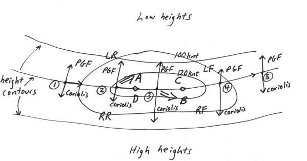

(1) Pressure Gradient Force and Coriolis are in balance. Wind is geostrophic (parallel to height contours)

(2) Parcel enters region of higher wind speed. This increases the Pressure gradient force at the same time the
Coriolis has not been changed much. Wind will tend to flow toward the longest vector, which is the PGF. This
causes convergence in the Left Rear Quad (sinking air at letter A) and divergence in the Right Rear Quad (rising
air at letter D). The tropopause is just above jet stream level. Convergence at the jet stream level forces air
to sink because the highly stable tropopause prevents air from rising.

(3) The Coriolis once again balances the Pressure Gradient Force.

(4) As a parcel leaves the jet streak it must decelerate. The Pressure Gradient Force weakens at the same time
the Coriolis has not had time to adjust and decrease. This causes convergence in the Right Front Quad (sinking
air at letter B) and divergence in the Left Front Quad (rising air at letter C).

(5) Pressure Gradient Force and Coriolis once again balance

This example has been for a jet streak in a zonal flow. A jet streak in a curved flow, such as the case when a
jet streak is in the base of a trough, will have divergence and rising air to the north of the jet and convergence
and sinking air to the south of the jet.

The jet stream is a powerful forecasting tool. Not that it can give exact highs/ lows/ and precipitation chances,
but because it gives information such as when to expect the next storm system and whether temperatures will be
above or below normal. It gives clues to how the upper levels will promote rising air or sinking air. It gives
clues to the character of the next storm system. Jet streaks alone provide much information of how a trough or
ridge will develop over the next couple of days.

**WHAT TO LOOK FOR ON 300/250/200 chart:**
**(1) Jet stream**
\*The jet stream is a river of air with segments of higher speed winds embedded within the mean flow
\*Areas North of jet stream tend to have cooler than normal temperatures especially in the mid-latitudes
\*Areas South of jet stream tend to have warmer than normal temperatures, especially in higher latitudes

**(2) Jet Streaks**
\*Rising air occurs in the right rear and left front quadrants of jets
\*Sinking air occurs in the left rear and right front quadrants of jets
\*Rising air occurs north of jet axis if jet is in a highly curved flow
\*Winds over 120 miles per hour constitute a significant jet streak
\*Upper level divergence enhances rising air, especially if warm air advection is occurring in lower
levels of atmosphere

**(3) General trough/ridge pattern**
\*Momentum of jet stream carves the trough ridge pattern. If the jet stream winds are greater on the LEFT
side of a trough, the trough will become more amplified and move further south. If the jet stream winds
are greater on the RIGHT side of a trough, the trough will become less amplified with time
and move further north

[**TOP**](jet-stream-jet-streaks.md#top)

**JET STREAK WIND AND JET STREAK MOVEMENT**

**METEOROLOGIST JEFF HABY**
[theweatherprediction.com](https://theweatherprediction.com/)

The jet stream is a fragmented global wind flow that encircles the mid-latitudes in a wavelike pattern. Embedded
within this global wind belt are jet streaks. A jet streak is a segment of the jet stream that has relatively
high velocity winds. Other terms for a jet streak are a jet max and a jet surge. Jet streaks are caused by a
large low-level temperature gradient, thus they are more intense
in the cool season when the differential in temperature between the polar regions and tropical regions is largest. Jet streaks are analyzed near the 300-mb level.

It is a common error for beginning weather analysts to assume that the "entire" jet streak is moving at 160 knots.
Think of a jet streak as an analogy to that of a thunderstorm. The thunderstorm moves at a certain speed
(say 20 knots) while the winds within theupdraft and downdraft of the thunderstorm move at a much faster
speed (say 60 knots). The same is true for a jet streak. The jet streak itself may be moving at 25 knots
while the winds moving through the core of the jet streak move at 160 knots. The wind accelerates as the
air approaches the jet core and decelerates once leaving it.

A jet streak moves within the trough-ridge pattern at the same time it influences the amplification or
de-amplification of the trough-ridge pattern. The example below is that of a jet streak de-amplifying
a trough. A strong jet streak on the right side of a trough will cause that trough to de-amplify (lift).

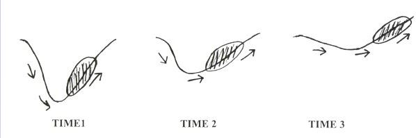

If a strong jet streak is on the left side of a trough, the trough will amplify (dig) as shown below.

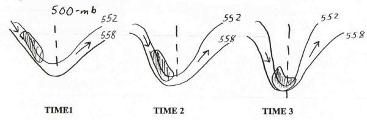

[**TOP**](jet-stream-jet-streaks.md#top)

**JET STREAKS**

**BY NWS LOUISVILLE**

A **"jet streak"** refers to a portion of the overall jet stream where winds along the jet core flow are stronger than in other areas along the jet stream. Entrance and exit regions of jet streaks are very important in terms of vertical motion, surface pressure systems, and organized precipitation given sufficient low-level moisture. **Exit regions** are where air parcels "exit" out of a jet streak and decelerate downstream from the jet core **(Figs. 1&2)**. **Entrance regions** are where parcels "enter" into a jet streak and accelerate upstream from the jet core **(Figs. 1&2)**.

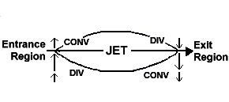

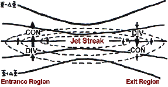

**Fig. 1**:Idealized example of the entrance and exit regions of a straight jet streak. Highest winds are within the streak along the line/arrow labeled "jet." Divergence (div) usually occurs within the left exit and right entrance regions, while convergence (conv) normally occurs in the right exit and left entrance regions.

**Fig. 2**:Example of the entrance and exit regions of a straight jet streak. Dashed lines are lines of equal wind speed (isotachs); solid lines are height lines along which the total wind blows. The small arrows denote a component of the ageostrophic wind due to jet streaks that results in divergence and convergence in exit and entrance regions.

Within the exit and entrance regions of jet streaks, air parcels moving at different speeds become out of balance with the existing thermal (temperature) gradient in these regions. Thus, the atmosphere attempts to restore (thermal wind) balance through vertical motion. The vertical motion is attained through ageostrophic winds. Thus, vertical motion is required within entrance and exit regions of jets.

In general, the more the "along-stream variation of the total wind" within an exit and entrance region (i.e., the faster the winds are accelerating within an entrance region or decelerating in an exit region per unit area along the flow **(Fig. 2)**, the greater the vertical motion must be to restore thermal wind balance. The "cross-stream variation" (i.e., how quickly wind speeds change in a plane perpendicular to the jet axis) also is important in promoting vertical motion fields.

Within jet entrance and exit regions, the cross-stream component of the inertial advective part of the ageostrophic wind (i.e., the small arrows in **Fig. 2**) dictates the amount of divergence/convergence (and subsequent vertical motion) due to jet streak dynamics. Upper-level divergence (convergence) often is associated with upward (downward) vertical motion in the atmosphere.

However, even without the presence of a jet streak, curvature in the flow (i.e., upper-level troughs and ridges) results in divergence/convergence (and subsequent vertical motion) due to the along-stream component of the inertial advective part of the ageostrophic wind **(Fig. 3)**. The **stronger the curvature** (i.e., the more amplified the jet pattern) and the **shorter the wavelength** between a trough and ridge axis aloft, the **greater the upper-level divergence pattern** will be due to the along-stream component of the ageostrophic wind.

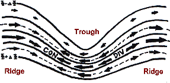

**Fig. 3** Example of an upper-level flow pattern showing trough and ridge axes. Solid lines are constant height lines. Arrows are a component of the ageostrophic wind due to troughs and ridges that results in convergence (con) and divergence (div) aloft.

Thus, upper-level divergence (of the ageostrophic wind) is caused by 1) jet streak entrance and exit regions, and 2) curvature and wavelength of the overall flow (troughs and ridges). It is very important to consider both these phenomena. It can be advantageous to look at the two components of the upper-level ageostrophic wind individually to assess which phenomena is most important to the production of vertical motion. These two components also explain 1) why 4-cell divergence patterns associated with straight jet streaks become 2-cell patterns for curved jets, and 2) why divergence values for curved jet streaks usually are stronger than that for straight jets (see below).

For **STRAIGHT** jet streaks, a **4-cell pattern** of divergence aloft and vertical motion usually occurs **(Fig. 4)**.

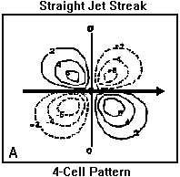

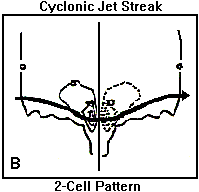

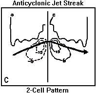

**Fig. 4** Four-cell pattern of divergence/vertical motion associated with a straight jet streak. In the dashed left exit (i.e, upper right portion of image) and right entrance jet regions (lower left portion of image), divergence aloft and upward motion usually occur. Convergence and downward motion usually prevail in the solid line right exit (lower right) and left entrance (upper left) regions of a **straight jet streak**.

**Fig. 5** Two-cell pattern of divergence/upward motion (dashed; jet exit region, i.e., right half of image) and convergence/downward motion (solid; jet entrance region, i.e., left half of image) associated with a **cyclonically-curved jet streak**. Values often are greater than those with a straight streak.

**Fig. 6** Same as Fig. 5 except for an **anticyclonically- curved jet streak**. Divergence aloft and upward motion occur in the jet right entrance region (left half of image) with convergence and descent in the jet right exit region (right half of image).

Within entrance regions, a thermally direct secondary circulation **(Fig. 7)** occurs associated with the ageostrophic wind. Warm air usually rises within the right entrance (right rear) region while cold air sinks in the left entrance region. To complete the circulation, horizontal ageostrophic winds often flow from warm-to-cold air at upper levels, and from cold-to-warm air at low levels. The circulation is on the order of approximately 400-600 km in horizontal extent.

Within exit regions, a thermally indirect secondary circulation **(Fig. 8)** occurs. Cold air rises in the left exit (left front) region and warm air sinks in the right exit region. The horizontal ageostrophic components include flow from warm-to-cold air at low levels and from cold-to-warm air at upper levels.

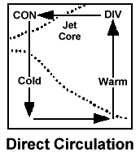

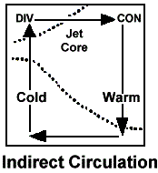

**Fig. 7 (far left):** Idealized "box" direct thermal circulation in the entrance region of jet streaks. Warm air rises in the right entrance region; cold air sinks in the left entrance region. Horizontal ageostrophic flow occurs from colder to warmer air in low levels.

**Fig. 8 (near left):** Idealized indirect thermal circulation in the exit region of jet streaks. The circulation is opposite that shown in Fig. 7.

However, circulations associated with jet streaks are not "boxes" as shown in the examples above. Typically, vertical components are sloped along isentropic surfaces **(Fig. 9)**. Thus, jet streak circulations and isentropic surfaces are not independent. In other words, in jet entrance and exit regions, enhanced upper-level divergence may lead to enhanced flow and vertical motion along isentropic surfaces.

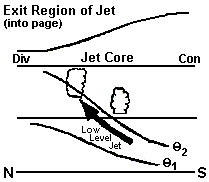

**Fig. 9** Cross-section of an east-west jet streak exit region. The core of jet is directed into the page so that the right (left) side of the image is the right (left) exit region. A more realistic sloped ascent (bold arrow) roughly along isentropic surfaces (sloped thin solid lines) occurs toward the level of maximum upper-level divergence.

For **CURVED** jet streaks, the "classic" 4-cell (Fig. 8a) vertical motion pattern can be more complicated, and usually becomes a 2-cell vertical motion pattern.

For a **cyclonically-curved jet** (Fig. 8b), maximum upper divergence values and subsequent ascent usually are found along and to the left of the core of the exit region, with descent along and to the left of the entrance region.

For an **anticyclonically-curved jet** (Fig. 8c), upper divergence and ascent are strongest along and to the right of the entrance region, with descent along and to the right of the exit region.

Ascent/descent values usually are greatest for cyclonically-curved jet streaks, second greatest for anticyclonically-curved jet streaks, and relatively weakest (but still significant) for straight jets assuming adequate along-stream variation in the wind (Fig. 8).

If varying temperature patterns (isotherms) are superimposed on jet streaks, different thermal advection pattern will result aloft. This can cause the location of maximum divergence and convergence to shift slightly with respect to the jet core.

Occasionally, the ascending branches of two separate jet streaks may be coincident over one location. This merger (coupling) is associated with the ascending branches of the direct circulation in the entrance region of one jet and the indirect circulation in the exit region of a second jet. This interaction maximizes upper-level divergence and vertical motion.

[**TOP**](jet-stream-jet-streaks.md#top)

**ENTRANCE REGIONS OF JET STREAKS**

**BY NWS LOUISVILLE**

A "jet streak" refers to a portion of the overall jet stream where winds along the jet core flow are stronger than in other areas along the jet stream. The entrance (exit) region of a jet streak is where winds are accelerating into the back/upstream (decelerating out of the front/downstream) side of the streak. Within the entrance region of a jet streak, divergence (of the ageostrophic wind) usually occurs along and to the right of the jet core (i.e., right entrance region). The upper-level divergence causes pressure/height falls at the surface and/or lower-to-middle-levels underneath the upper divergence maximum. However, the upper divergence usually **DOES NOT** create a localized ascent maximum concentrated **directly under** the upper-level divergence field (i.e., the so-called "box" circulation is invalid; Fig. 1).  Instead, Fig. 2 shows a plan view and Fig. 3 a vertical cross-section of more realistic processes that can happen in the atmosphere, as described below.

**Fig. 1:** Idealized "box" direct thermal circulation in the entrance region of jet streaks. Warm air rises in the right entrance region; cold air sinks in the left entrance region. Horizontal ageostrophic flow occurs from colder to warmer air in low levels. However, air typically does not flow in a "box" as shown at left.

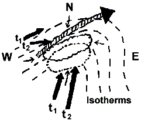

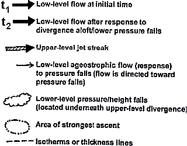

**Fig. 2:**Example plan view of a low-level/upper-level jet configuration along with areas of upper-level divergence/low-level pressure falls and ascent. The image at right identifies key elements of the schematic. Explanation of the diagram is given in the accompanying text.

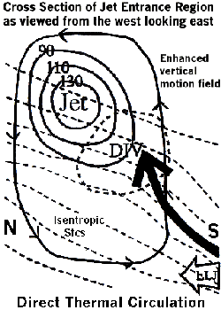

**Fig. 3:** Example vertical cross-section of a jet streak (solid lines are equal wind speed lines/isotachs in kts) and the divergence (bold dashed circle; DIV) and low-level jet (LLJ) isentropic ascent (large bold arrow) response to the upper divergence in the right entrance region of the jet. The outer solid line with arrowheads represents a simplified direct thermal circulation within the entrance region. Dashed lines are lines of equal temperature/isotherms.

In a baroclinic system (systems that tilt with height), the lower-level pressure/height falls under the right entrance region/ divergence aloft cause a wind to be directed toward the pressure falls area (i.e., wind moves toward lower pressure). The wind moves toward the falls from all directions, including from the south where it is warmer and from the north where it is colder. This wind is the **isallobaric component of the ageostrophic wind** (small arrows in Fig. 2). South and/or east of the right entrance region/upper-level divergence/low-level pressure falls area, the southerly ageostrophic flow moving toward the falls area complements the environmental southerly flow already in place (southerly bold arrow labeled t1 in Fig. 2). Thus, an increase/ acceleration in the actual wind occurs near and south and/or east of the jet right entrance region (i.e., right rear quadrant of the jet streak).

This enhanced low-level flow (southerly bold arrow labeled t2 in Fig. 2 and LLJ in Fig. 3) then **rises isentropically toward the upper-level divergence zone** (large bold arrow in Fig. 3). Therefore, the area of strongest ascent (dashed-dotted circle in Fig. 2) may actually occur south and/or east of the maximum upper-level divergence area in baroclinic systems. In addition, as upper-level divergence increases with time, so will isentropic lift as the actual wind accelerates up the isentropic surface toward the pressure/height falls and enhanced divergence zone. In more "vertically stacked" systems, then the ascent maximum may be located closer/underneath the divergence maximum aloft.

At the same time, underneath or to the left of the jet entrance region, the low-level northerly or northwesterly ageostrophic winds (i.e., the small arrows to the north and west of the jet streak in Fig. 2) and the arrowhead on the outer solid line in the bottom of Fig. 3) directed toward the pressure falls area help to direct colder air toward the region of upward motion farther south and/or east (i.e., the bold t1 arrow to the northwest of the jet streak in Fig. 2 turns and becomes t2). This could help promote the maintenance of or even changeover to frozen or freezing precipitation in borderline rain/snow cases. The northerly ageostrophic wind component also may slightly negate the overall southerly low-level flow resulting in low-level convergence underneath/near the entrance region.

Now, we have an entrance region of a jet streak causing upper-level divergence which results in increased lift as a stronger low-level jet south of the entrance region causes enhanced moisture transport and warm advection up the isentropic surface. At the same time, colder air may be trying to filter in from the north. The result is that we get a tightening of the thermal/temperature gradient between the warm and cold advection zones and due to the convergent winds. The tightening thermal gradient is called **[frontogenesis](http://www.crh.noaa.gov/lmk/?n=winterpt2)**, which in itself can elicit an atmospheric response that results in a direct thermal circulation (low-level warm air rising on the warm side of the gradient and cold air sinking farther north on the cold side). The upward motion/vertical circulation associated with frontogenetical forcing appears to enhance or focus the vertical circulation associated with the jet entrance region and isentropic motion.

One more item to consider: In direct thermal circulations (which occur in jet entrance regions and in response to frontogenesis), low-level ascent usually is on the warm side of the jet core and/or frontogenetical zone. On the warm side, if relatively unstable air is present (even near neutral stability air), the vertical motion values will be "pumped up" even more, because forcing for ascent will result in stronger upward motion in relatively unstable versus stable air. The ascent will then tilt northward with height toward cold air.

So, the end result is we have entrance regions of jet streaks, isentropic lift, frontogenesis, and possibly some degree of instability all seemingly working together in a complicated manner to cause strong upward motion. Moisture and system movement/propagation then also must be considered to determine if and where heavy precipitation will occur and how long the precipitation will last in any one area. Given sufficient moisture, these processes can result in heavy snow in the cool season and mesoscale convective system (MCS) development in the warm season, even if there is little or no surface low development. Certainly, these processes do not always work "just right" together to cause extreme weather conditions. But, one should be aware that processes in the atmosphere cannot always be separated from one another; they often are inter-related.

These processes worked together to produce a record snowstorm in Kentucky on January 16-17, 1994. In fact, 1 to 2 feet of snow that fell across parts of north-central Kentucky in less than 12 hours. In this case, there was little surface low development, but strong isentropic lift, a pronounced entrance region of a jet streak which increased in time, and substantial frontogenesis all where present, along with relatively unstable air aloft and upstream that helped intensify upward motion and produce elevated convection.

[**TOP**](jet-stream-jet-streaks.md#top)
