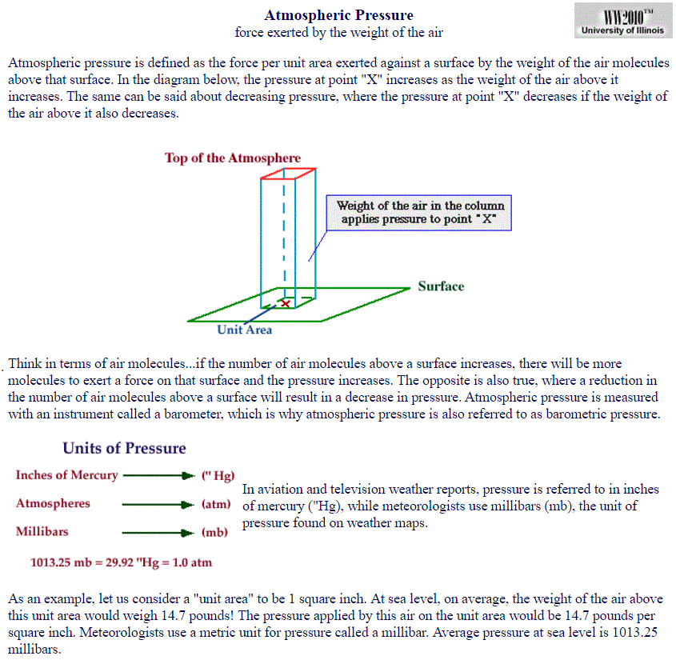
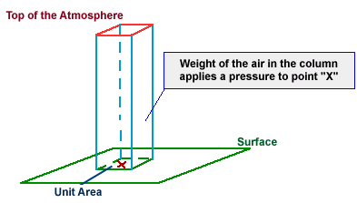
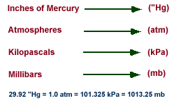
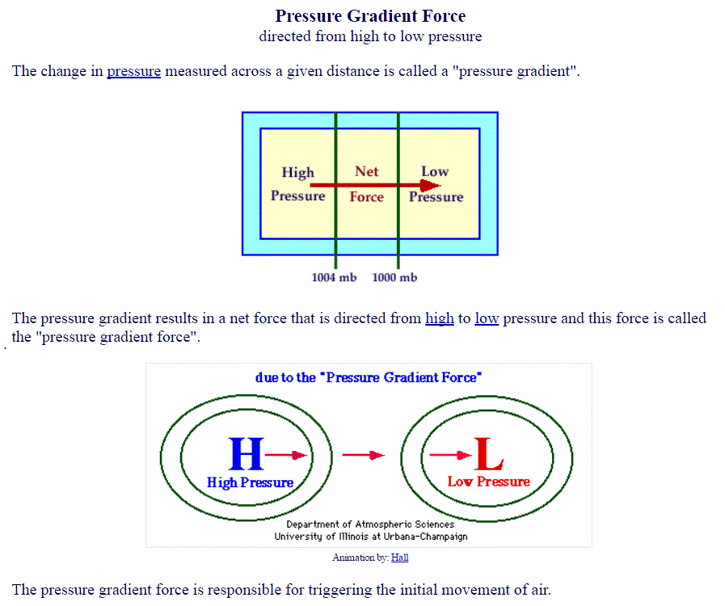
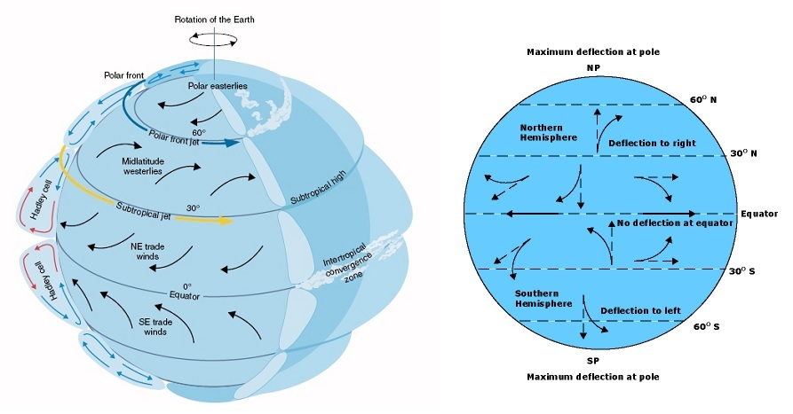
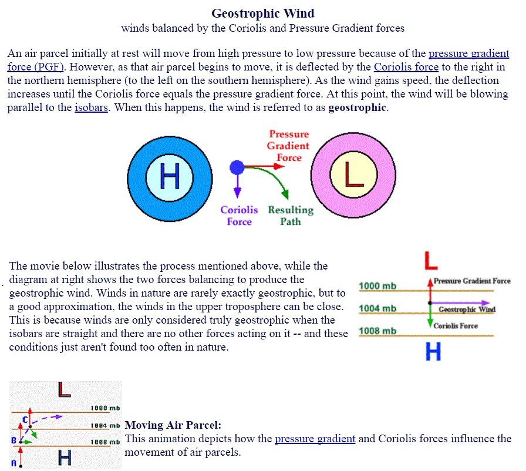
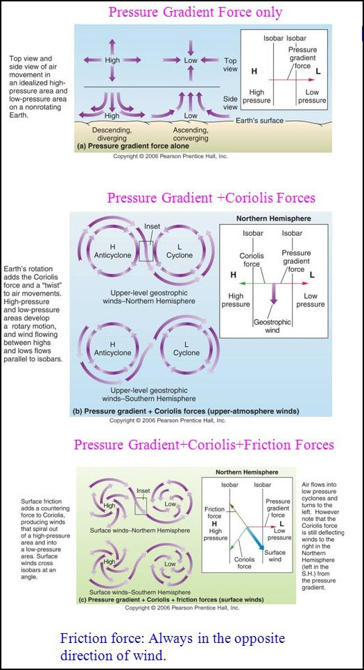
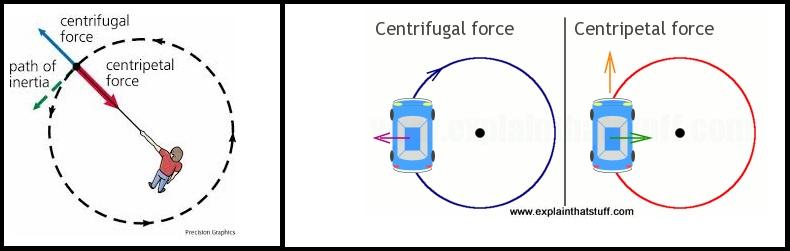

# Pressure/Forces/Winds — Tutorial 2

> Source: <http://www.weather.gov/source/zhu/ZHU_Training_Page/winds/pressure_winds/Pressure.htm>  
> Section: Winds/Jetstream  
> Captured: 2026-08-19 06:00 UTC  
> PDF: [pressure-forces-winds-tutorial-2.pdf](pressure-forces-winds-tutorial-2.pdf) · Original HTML: [source/original.html](source/original.html)

---

**Select a tutorial below or scroll down...**- **[Air Pressure](#PRESSURE)**
- **[Changes in Atmospheric Pressure](#CHANGES)**
- **[Assessing Atmospheric Pressure and Heights](#HEIGHT)**
- **[Forces and Winds](#FORCES)**

**Air Pressure**

**Source: Unavailable**

**I.** Air exerts a force on surface of objects.

**A.** Air pressure is force per unit area.

**B.** It is cumulative force of a multitude of molecules.

**C.** Pressure depends on:

**1.** Mass of molecules

**2.** Pull of gravity

**3.** Kinetic energy of molecules
**II.** Normally a pressure balance between air and objects.
**III.** Pressure decreases with height.

**A.** Max air density occurs at surface.

**B.** Air becomes "thinner" with height.

**C.** Affects on humans:

**1.** Dizziness, headaches, shortness of breath in mountains

**2.** "Ear-popping"
**IV.** Horizontal variations in pressure

**A.** Altitude dependent, but this is corrected to sea-level

**B.** After corrections, still are variations because:

**1.** Different air masses

**2.** Air is compressible

**3.** Air circulation

**C.** Air mass - huge volume of air that is relatively uniform in
temperature and water vapor.

**1.** Pressure increases with warmer temperatures (in closed container)

**2.** But atmosphere has no walls, so heated air expands, becomes less
dense. Thus, net result is that pressure actually decreases when
heated.

**a.** Greater activity of the heated molecules increases the
spacing between neighboring molecules and thus reduces air
density. The decreasing air density then lowers the pressure
exerted by the air. Warm air is thus lighter (less dense) than
cold air and consequently exerts less pressure.

**3.** Moist air is less dense than dry air!!

**4.** Sinking air increases pressure at surface, and ascent decreases
pressure at surface.

**5.** In addition air pressure changes caused by variations of
temperature and water vapor content, air pressure can also be
influenced by the circulation pattern of air.
**V.** There is pressure variations at all time scales.

**A.** Long-term

**B.** Diurnal (daily)
**VI.** Circulations - definitions

**A.** Divergence - net outlfow of air from a region or area.

**a.** If more air diverges at the surface than descends from aloft,
then the air density and air pressure decrease.

**b.** Conversely, If less air diverges at the surface than descends
from aloft, then the air density and air pressure increases.

**B.** Convergence - net inflow of air into a region or area.

**a.** If more air converges at the surface than ascends, then the air
density and air pressure increases.

**b.** Conversely, If less air converges at the surface than ascends,
then the air density and air pressure decreases.

**C.** High pressure (anticyclone) - Divergence at surface (with
convergence aloft) corresponds with sinking motion. It is
characterized by a maximum in the pressure field compared with
the surrounding air in all directions.

**D.** Low pressure (cyclone) - Convergence at surface (with divergence
aloft) corresponds with ascending air. This is region of low
pressure, or cyclone. It is characterized by a minimum in the
pressure field compared with the surrounding air in all directions.
Almost always there is a closed, circular isobar around the cyclone.

**E.** Ridge - an elongated area of relatively high atmospheric pressure.
A ridge is distinct by the "rise" in the pressure field, and can be
thought of as a "ridge of atmospheric pressure". Opposite of trough

 **F.** Trough - an elongated area of relatively low atmospheric pressure.
A trough is distinct by the "dip" in the pressure field, and can be
thought of as a "valley of atmospheric pressure". Usually not
associated with a closed circulation. Opposite of ridge.

**G.** These circulation features usually dominate, but don't forget other
features that affect pressure (e.g., temperature and water vapor
content.)
**VII.** Unit of pressure

**A.** The two most common units in the United States to measure the
pressure are "Inches of Mercury" and "Millibars".

**1.** Inches of mercury - refers to the height a column of mercury
measured in hundredths of inches.

**a.** This is what you will usually hear from the NOAA Weather Radio
of from your favorite weather or news source. At sea level,
standard air pressure in inches of mercury is 29.92.

**2.** Millibars - comes from to the original term for pressure "bar".

**a.** Bar is from the Greek "báros" meaning weight.

**b.** A millibar is 1/1000th of a bar and is the amount of force it
takes to move an object weighing a gram, one centimeter, in
one second.

**c.** Millibar values used in meteorology range from about 100 to
1050. At sea level, standard air pressure in millibars is
1013.2.

**d.** Weather maps showing the pressure at the surface are drawn
using millibars.

**B.** The Pascal

**1.** The scientific unit of pressure is the Pascal (Pa) named after
after Blaise Pascal (1623-1662).

**2.** One pascal equals 0.01 millibar or .00001 bar.

**3.** Meteorology has used the millibar for air pressure since 1929.

**4.** When the change to scientific unit occurred in the 1960's many
meteorologists prefered to keep using the magnitude they are used
to and use a prefix "hecto" (h), meaning 100.

**5.** Thus, 1 hectopascal (hPa) equals 100 Pa which equals 1 millibar.
100,000 Pa equals 1000 hPa which equals 1000 millibars.

**6.** The end result is although the units we refer to in meterology
may be different, there value remains the same. For example the
standerd pressure at sea-level is 1013.25 millibars and 1013.25
hPa.

**Click [here](http://www.srh.noaa.gov/jetstream/atmos/pressure.html) for another tutorial on air pressure.**

[**TOP**](pressure-forces-winds-tutorial-2.md#top)

**CHANGES IN ATMOSPHERIC PRESSURE**

**METEOROLOGIST JEFF HABY**
[theweatherprediction.com](https://theweatherprediction.com/)

One of the earliest forecasting tools was the use of atmospheric pressure.
Soon, after the invention of the barometer, it was found that there were
natural fluctuations in air pressure even if the barometer was kept at the
same elevation. During times of stormy weather the barometric pressure would
tend to be lower. During fair weather, the barometric pressure was higher.
If the pressure began to lower, that was a sign of approaching inclement
weather. If the pressure began to rise, that was a sign of tranquil weather.
There is also a small diurnal variation in pressure caused by the
atmospheric tides. The barometric pressure can lower by several processes,
they are:

1. The approach of a low pressure trough

2. The deepening of a low pressure trough

3. A reduction of mass caused by upper level divergence (vorticity, jet
streaks)

4. Moisture advection (moist air is less dense than dry air)

5. Warm air advection (warm air is less dense than cold air)

6. Rising air (such as near a frontal boundary or any process that causes
rising air)

When the barometric pressure is lowering, it will be caused by 1, 2 or a
combination of the 6 processes listed above. All the processes above deal
either with decreasing the air density or causing the air to rise in order
to lower the barometric pressure. When forecasting, try to figure out which
physical processes in the atmosphere are causing the pressure to lower or
rise over your forecast region. When looking at upper level charts, instead
of looking for changes in barometric pressure you will be looking for height
falls or height rises. Important: Barometric pressure is ONLY plotted on
SURFACE CHARTS. Any upper level chart you examine will be taken on a
constant pressure surface (e.g. 850, 700, 500, 300, 200). Because upper
level charts use a constant pressure surface, height falls or height rises
are used to determine if a trough/ridge is approaching and/or deepening.
When heights fall it is due to a reduction in mass above the pressure level
(i.e. if heights fall on an 850 mb chart, it is because the air is rising or
low level cold air advection is occurring). On upper level charts you must
consider what is happening above or below the pressure level of interest. If
heights fall at 700 mb for example, it could be due to the fact that cold
air advection is occurring in the PBL, therefore decreasing the overall
height of the troposphere and decreasing the 700 mb height. Just to give you
some complexity, barometric pressure can fall at the surface but heights can
rise over the same region on upper level charts or vice versa. An example
would be a large magnitude of warm air advection in the PBL. The warm air is
less dense than the air it is replacing, therefore the surface pressure will
fall. However, since warm air expands the height of the troposphere (because
it is less dense and takes up more space) the heights aloft will rise. When
I start throwing in vorticity, jet streaks, and topography this discussion
will become even more complicated.

The more you learn about meteorology and forecasting the more you will
realize the pure complexity of the atmosphere, the interaction of many
physical processes at the same time and that learning about meteorology and
forecasting lasts a lifetime. For the most part, you can interpret height
falls and rises the same way as surface barometric rises or falls. Increment
weather is associated with height falls and lowering barometric pressure and
fair weather is associated with height rises and rising barometric pressure.
Other tips:

1. Low pressure troughs tend to move toward the region of greatest height
falls

2. Ridges build most strongly into regions with the greatest height rises

[**TOP**](pressure-forces-winds-tutorial-2.md#top)

**ASSESSING ATMOSPHERIC PRESSURES AND HEIGHTS**

**METEOROLOGIST JEFF HABY**
[theweatherprediction.com](https://theweatherprediction.com/)

The average pressure at the surface is 1013 millibars. There is no "top" of
the atmosphere by strict definition. The atmosphere merges into outer
space. There are 5 slices of the troposphere that meteorologists monitor
most frequently. They are the surface, 850 mb, 700 mb, 500 mb, and 300 mb
(or 200 mb). Why are these slices monitored and not others more frequently?
Why not have a 600 mb and a 400 mb chart? Each of the primary 5 levels have
a reason they are studied over other slices of the troposphere (sort of).

The surface is obviously important because it gives information on the
weather that we are feeling and experiencing right where we live.

The 850 mb level represents the top of the planetary boundary layer (for
low elevation regions). This is near the boundary between where the
troposphere is ageostrophic due to friction and the free atmosphere (where
friction is small). For low elevation regions the 850 mb level is the best
level to assess pure thermal advection.

The 500 mb level is important because it is very near the level of non-
divergence. This allows for an efficient analysis of vorticity. Actually
the level of non-divergence averages closer to the 550 mb level, but 500 mb
is a more "round" number as compared to 550 mb so it was used. The 500
millibar level also represents the level where about one half of the
atmosphere's mass is below it and half is above it.

A level is needed to depict the jet stream. The polar jet stream has a
vertical thickness of at least 200 millibars with the core of the jet
averaging at about 250 millibars. Either the 200 or 300 mb chart can be
used to assess the jet stream / jet streaks. In winter, the 300 mb chart
works best and in the summer the 200 mb chart works best for analyzing the
core of the jet. The jet stream is at a higher pressure level (closer to
the surface) in the winter because colder air is more dense and hugs closer
to the earth's surface.

It is important to have an understanding of the average height of each of
these important levels. 1000 mb is near the surface (sea level), 850 mb is
near 1,500 meters (5,000 ft), 700 mb is near 3,000 meters (10,000 ft), 500
mb is near 5,500 meters (18,000 ft), 300 mb is near 9,300 meters (30,000
ft). All of these values are in geopotential meters; Zero geopotential
meters is near sea level. The height of these pressure levels on any given
day depends on the average temperature of the air and whether the air is
rising or sinking (caused by convergence / divergence). If a cold air mass
is present, heights will be lower since cold air is denser than warm air.
Denser air takes up a smaller volume, thus heights lower toward the
surface. Rising air also decreases heights. This is because rising air
cools. Rising air could be the result of upper level divergence. Upper
level divergence lowers pressures and heights because some mass is removed
in the upper troposphere from that region. This causes the air to rise from
the lower troposphere and results in a cooling of the air. If the average
temperature of a vertical column of air lowers, the heights will lower
(trough).

[**TOP**](pressure-forces-winds-tutorial-2.md#top)

**FORCES AND WINDS**

**Excerpts from University of Illinois (WW2010)**

The weight of the air above an object exerts a force per unit area upon that object and
this force is called pressure. Variations in pressure lead to the development of winds,
which in turn influence our daily weather. The purpose of this module is to introduce
pressure, how it changes with height and the importance of high and low pressure
systems. In addition, this module introduces the pressure gradient and Coriolis forces
and their role in generating wind. Local wind systems such as land breezes and sea
breezes will also be introduced. The Forces and Winds module has been organized into
the following sections:

\* Pressure
\* Pressure Gradient Force
\* Coriolis Force
\* Geostrophic Wind
\* Friction and Boundary Layer Wind
\* Centrifugal Force and Gradient Wind

Atmospheric pressure is defined as the force per unit area exerted against a surface by
the weight of the air above that surface. In the diagram below, the pressure at point "X"
increases as the weight of the air above it increases. The same can be said about decreasing
pressure, where the pressure at point "X" decreases if the weight of the air above it also
decreases.

Thinking in terms of air molecules, if the number of air molecules above a surface increases,
there are more molecules to exert a force on that surface and consequently, the pressure increases.
The opposite is also true, where a reduction in the number of air molecules above a surface will
result in a decrease in pressure. Atmospheric pressure is measured with an instrument called a
"barometer", which is why atmospheric pressure is also referred to as barometric pressure.

In aviation and television weather reports, pressure is given in inches of mercury
("Hg), while meteorologists use millibars (mb), the unit of pressure found on weather maps.

As an example, consider a "unit area" of 1 square inch. At sea level, the weight
of the air above this unit area would (on average) weigh 14.7 pounds! That means
pressure applied by this air on the unit area would be 14.7 pounds per square inch.
Meteorologists use a metric unit for pressure called a millibar and the average
pressure at sea level is 1013.25 millibars.

**I. Pressure Gradient (PGF)** - A change in pressure per unit distance.

**A.** It is always directed from higher toward lower pressure.

**B.** Air would accelerate along the pressure gradient toward the lower pressure if
this were the only force acting on the air.

**II. Coriolis Force (CF)** - Occurs because of rotation of earth.

**A.** Any moving object in the Northern Hemisphere will experience an acceleration to
the right of their path of motion.

**B.** This apparent deflection occurs because of our frame of reference has been
shifted as the earth rotates.

**C.** Coriolis force dependent on two factors:

**1.** Latitude - Increases poleward; Coriolis force greatest at poles, zero at
equator.

**a.** Reason - "Twisting" of frame of reference enhanced near pole.

**2.** Velocity - The faster the wind, the stronger the Coriolis Force.

**a.** Reason - In a given period of time, faster air parcels cover greater
distances.

**b.** From our viewpoint - longer trajectories have greater deflections than
shorter trajectories.

**D.** Coriolis force is length scale dependent. It is negligible at short distances.

**III. Geostrophic Wind approximation (Vg)** - represents a balance between the CF and PGF.

**A.** Assumptions:

**1.** Straight isobars.

**2.** No friction from viscosity or the ground; valid above 1 km.

**B.** Comments on geostrophic wind:

**1.** Wind flows in a straight path, parallel to isobars.

**2.** The stronger the PGF (the closer the isobar spacing), the faster the wind.

**3.** The less dense the air, the faster the wind (there is an inverse
proportionality between wind and air density).

**IV. Friction and Boundary Layer Winds** - important in "friction layer" below 1 km.

**A.** Reduces wind speed.

**B.** Since CF proportional to wind speed (V), the magnitude of CF is reduced.

**C.** Consequently, CF no longer balanced PGF, and wind blows across isobars toward
lower pressure ("cross-isobaric flow").

Click [here](http://ww2010.atmos.uiuc.edu/(Gh)/guides/mtr/fw/fric.rxml)
for an in-depth explanation on friction

Click [here](http://ww2010.atmos.uiuc.edu/(Gh)/guides/mtr/fw/bndy.rxml)
for an in-depth explanation on boundary layer winds

**V. Centrifugal Force and Gradient Wind** - occurs with curved flow.

**A.** An object in motion tends to move in a straight lines unless acted upon by an
outside force.

**B.** This tendency is the centrifugal force (analogy - driving around a corner).

**C.** It is directed outwards from curved flow.

**D.** Implications on air flow:

**1.** Wind is subgeostrophic V < Vg in trough.

**2.** Wind is supergeostrophic V > Vg in ridge.

**E.** Minor influence, except in tornadoes and hurricanes.

Click [here](http://ww2010.atmos.uiuc.edu/(Gh)/guides/mtr/fw/grad.rxml)
for an in-depth explanation (including animations) of gradient wind

[**TOP**](pressure-forces-winds-tutorial-2.md#top)
