# Pressure/Forces/Winds

> Source: <http://www.weather.gov/media/zhu/ZHU_Training_Page/winds/pressure_winds/pressure_winds.pdf>  
> Section: Winds/Jetstream  
> Captured: 2026-08-19 06:00 UTC  
> PDF: [pressure-forces-winds.pdf](pressure-forces-winds.pdf) (11 pages)

---

## Page 1

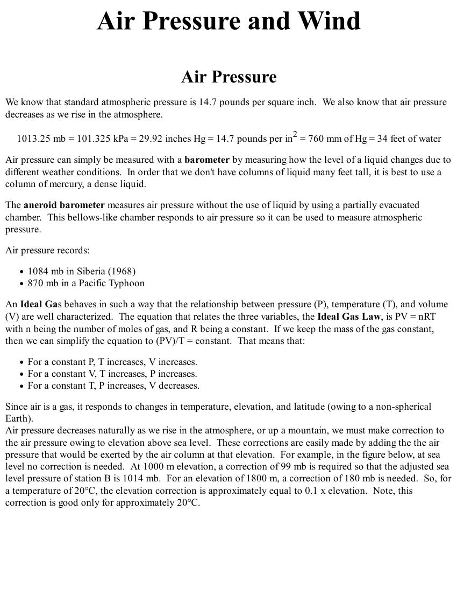

Air Pressure
We know that standard atmospheric pressure is 14.7 pounds per square inch.  We also know that air pressure
decreases as we rise in the atmosphere.
1013.25 mb = 101.325 kPa = 29.92 inches Hg = 14.7 pounds per in2 = 760 mm of Hg = 34 feet of water
Air pressure can simply be measured with a barometer by measuring how the level of a liquid changes due to
different weather conditions.  In order that we don't have columns of liquid many feet tall, it is best to use a
column of mercury, a dense liquid.
The aneroid barometer measures air pressure without the use of liquid by using a partially evacuated
chamber.  This bellows-like chamber responds to air pressure so it can be used to measure atmospheric
pressure.
Air pressure records:
1084 mb in Siberia (1968)
870 mb in a Pacific Typhoon
An Ideal Gas behaves in such a way that the relationship between pressure (P), temperature (T), and volume
(V) are well characterized.  The equation that relates the three variables, the Ideal Gas Law, is PV = nRT
with n being the number of moles of gas, and R being a constant.  If we keep the mass of the gas constant,
then we can simplify the equation to (PV)/T = constant.  That means that:
For a constant P, T increases, V increases.
For a constant V, T increases, P increases.
For a constant T, P increases, V decreases.
Since air is a gas, it responds to changes in temperature, elevation, and latitude (owing to a non-spherical
Earth).
Air pressure decreases naturally as we rise in the atmosphere, or up a mountain, we must make correction to
the air pressure owing to elevation above sea level.  These corrections are easily made by adding the the air
pressure that would be exerted by the air column at that elevation.  For example, in the figure below, at sea
level no correction is needed.  At 1000 m elevation, a correction of 99 mb is required so that the adjusted sea
level pressure of station B is 1014 mb.  For an elevation of 1800 m, a correction of 180 mb is needed.  So, for
a temperature of 20°C, the elevation correction is approximately equal to 0.1 x elevation.  Note, this
correction is good only for approximately 20°C.

## Page 2

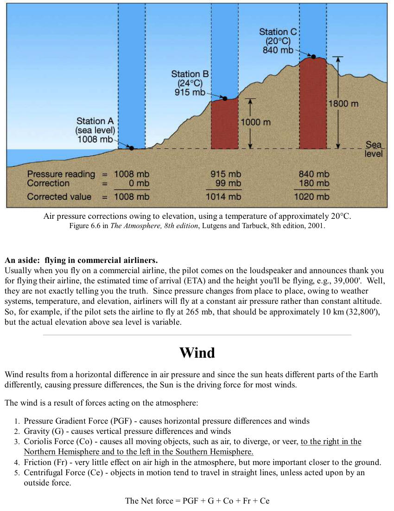

Air pressure corrections owing to elevation, using a temperature of approximately 20°C.
Figure 6.6 in The Atmosphere, 8th edition, Lutgens and Tarbuck, 8th edition, 2001.
An aside:  flying in commercial airliners.
Usually when you fly on a commercial airline, the pilot comes on the loudspeaker and announces thank you
for flying their airline, the estimated time of arrival (ETA) and the height you'll be flying, e.g., 39,000'.  Well,
they are not exactly telling you the truth.  Since pressure changes from place to place, owing to weather
systems, temperature, and elevation, airliners will fly at a constant air pressure rather than constant altitude. 
So, for example, if the pilot sets the airline to fly at 265 mb, that should be approximately 10 km (32,800'),
but the actual elevation above sea level is variable.
Wind
Wind results from a horizontal difference in air pressure and since the sun heats different parts of the Earth
differently, causing pressure differences, the Sun is the driving force for most winds.
The wind is a result of forces acting on the atmosphere:
Pressure Gradient Force (PGF) - causes horizontal pressure differences and winds
1.
Gravity (G) - causes vertical pressure differences and winds
2.
Coriolis Force (Co) - causes all moving objects, such as air, to diverge, or veer, to the right in the
Northern Hemisphere and to the left in the Southern Hemisphere.
3.
Friction (Fr) - very little effect on air high in the atmosphere, but more important closer to the ground.
4.
Centrifugal Force (Ce) - objects in motion tend to travel in straight lines, unless acted upon by an
outside force.
5.
The Net force = PGF + G + Co + Fr + Ce

## Page 3

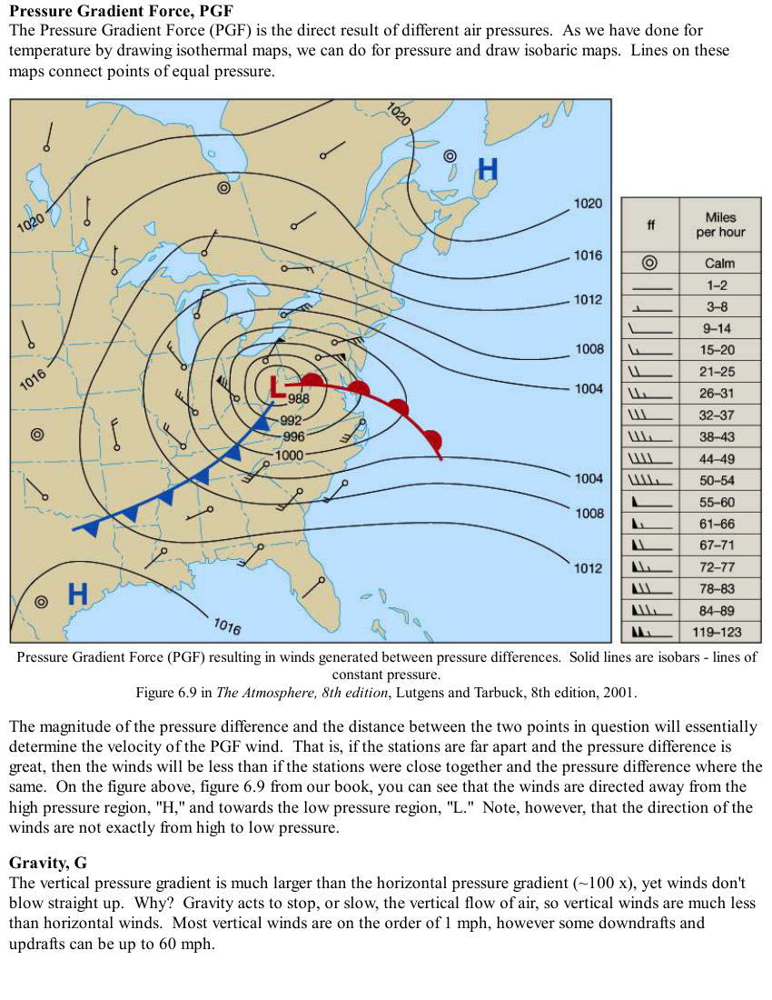

Pressure Gradient Force, PGF
The Pressure Gradient Force (PGF) is the direct result of different air pressures.  As we have done for
temperature by drawing isothermal maps, we can do for pressure and draw isobaric maps.  Lines on these
maps connect points of equal pressure.
Pressure Gradient Force (PGF) resulting in winds generated between pressure differences.  Solid lines are isobars - lines of
constant pressure.
Figure 6.9 in The Atmosphere, 8th edition, Lutgens and Tarbuck, 8th edition, 2001.
The magnitude of the pressure difference and the distance between the two points in question will essentially
determine the velocity of the PGF wind.  That is, if the stations are far apart and the pressure difference is
great, then the winds will be less than if the stations were close together and the pressure difference where the
same.  On the figure above, figure 6.9 from our book, you can see that the winds are directed away from the
high pressure region, "H," and towards the low pressure region, "L."  Note, however, that the direction of the
winds are not exactly from high to low pressure.
Gravity, G
The vertical pressure gradient is much larger than the horizontal pressure gradient (~100 x), yet winds don't
blow straight up.  Why?  Gravity acts to stop, or slow, the vertical flow of air, so vertical winds are much less
than horizontal winds.  Most vertical winds are on the order of 1 mph, however some downdrafts and
updrafts can be up to 60 mph.

## Page 4

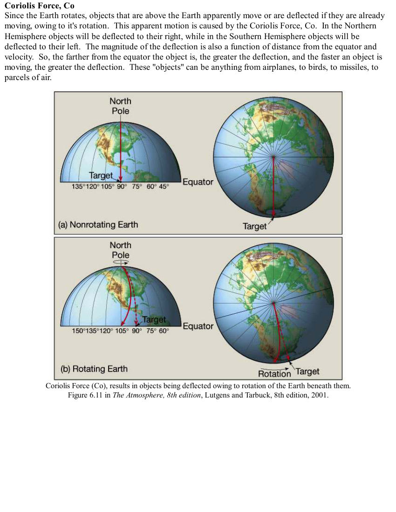

Coriolis Force, Co
Since the Earth rotates, objects that are above the Earth apparently move or are deflected if they are already
moving, owing to it's rotation.  This apparent motion is caused by the Coriolis Force, Co.  In the Northern
Hemisphere objects will be deflected to their right, while in the Southern Hemisphere objects will be
deflected to their left.  The magnitude of the deflection is also a function of distance from the equator and
velocity.  So, the farther from the equator the object is, the greater the deflection, and the faster an object is
moving, the greater the deflection.  These "objects" can be anything from airplanes, to birds, to missiles, to
parcels of air.
Coriolis Force (Co), results in objects being deflected owing to rotation of the Earth beneath them.
Figure 6.11 in The Atmosphere, 8th edition, Lutgens and Tarbuck, 8th edition, 2001.

## Page 5

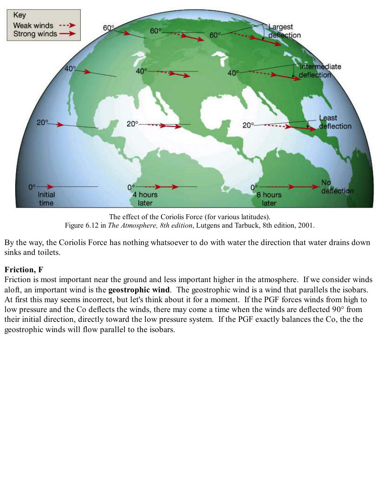

The effect of the Coriolis Force (for various latitudes).
Figure 6.12 in The Atmosphere, 8th edition, Lutgens and Tarbuck, 8th edition, 2001.
By the way, the Coriolis Force has nothing whatsoever to do with water the direction that water drains down
sinks and toilets.
Friction, F
Friction is most important near the ground and less important higher in the atmosphere.  If we consider winds
aloft, an important wind is the geostrophic wind.  The geostrophic wind is a wind that parallels the isobars. 
At first this may seems incorrect, but let's think about it for a moment.  If the PGF forces winds from high to
low pressure and the Co deflects the winds, there may come a time when the winds are deflected 90° from
their initial direction, directly toward the low pressure system.  If the PGF exactly balances the Co, the the
geostrophic winds will flow parallel to the isobars.

## Page 6

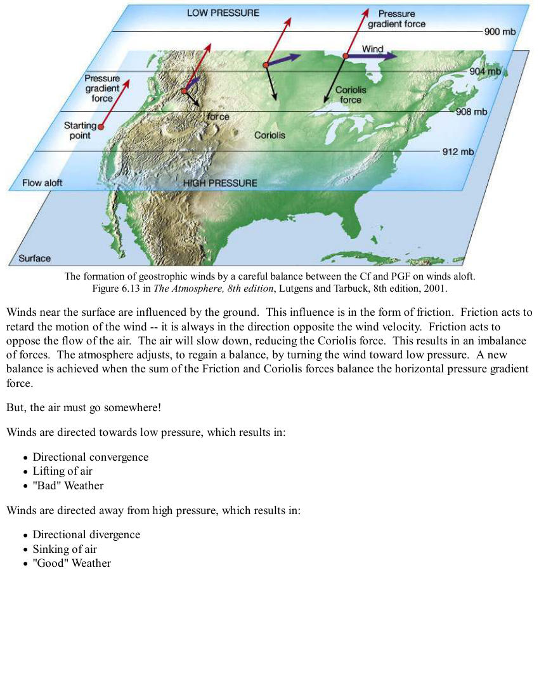

The formation of geostrophic winds by a careful balance between the Cf and PGF on winds aloft.
Figure 6.13 in The Atmosphere, 8th edition, Lutgens and Tarbuck, 8th edition, 2001.
Winds near the surface are influenced by the ground.  This influence is in the form of friction.  Friction acts to
retard the motion of the wind -- it is always in the direction opposite the wind velocity.  Friction acts to
oppose the flow of the air.  The air will slow down, reducing the Coriolis force.  This results in an imbalance
of forces.  The atmosphere adjusts, to regain a balance, by turning the wind toward low pressure.  A new
balance is achieved when the sum of the Friction and Coriolis forces balance the horizontal pressure gradient
force.
But, the air must go somewhere!
Winds are directed towards low pressure, which results in:
Directional convergence
Lifting of air
"Bad" Weather
Winds are directed away from high pressure, which results in:
Directional divergence
Sinking of air
"Good" Weather

## Page 7

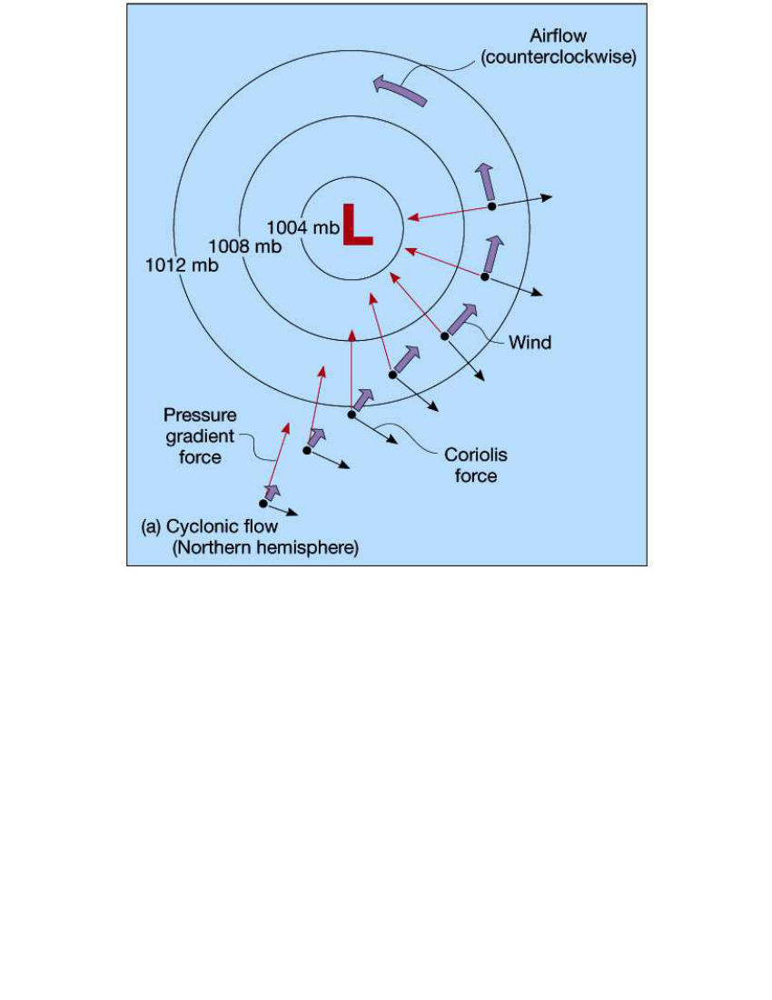

_(no extractable text on this page — see rendered image above)_

## Page 8

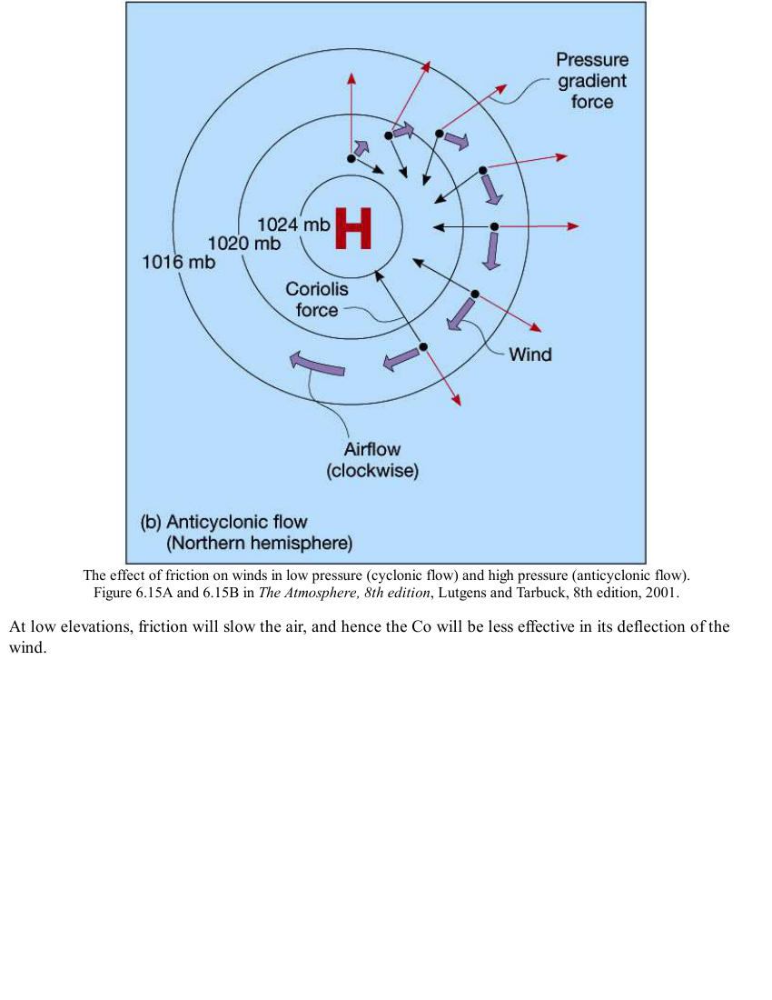

The effect of friction on winds in low pressure (cyclonic flow) and high pressure (anticyclonic flow).
Figure 6.15A and 6.15B in The Atmosphere, 8th edition, Lutgens and Tarbuck, 8th edition, 2001.
At low elevations, friction will slow the air, and hence the Co will be less effective in its deflection of the
wind.

## Page 9

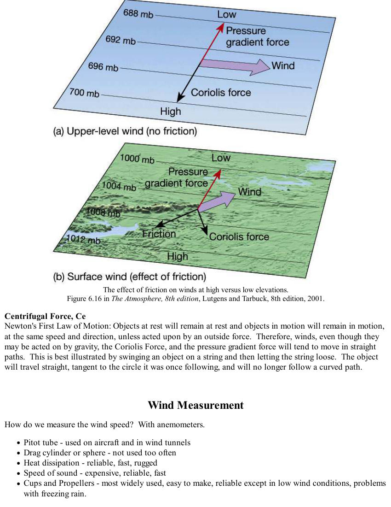

The effect of friction on winds at high versus low elevations.
Figure 6.16 in The Atmosphere, 8th edition, Lutgens and Tarbuck, 8th edition, 2001.
Centrifugal Force, Ce
Newton's First Law of Motion: Objects at rest will remain at rest and objects in motion will remain in motion,
at the same speed and direction, unless acted upon by an outside force.  Therefore, winds, even though they
may be acted on by gravity, the Coriolis Force, and the pressure gradient force will tend to move in straight
paths.  This is best illustrated by swinging an object on a string and then letting the string loose.  The object
will travel straight, tangent to the circle it was once following, and will no longer follow a curved path.
 
 
Wind Measurement
How do we measure the wind speed?  With anemometers.
Pitot tube - used on aircraft and in wind tunnels
Drag cylinder or sphere - not used too often
Heat dissipation - reliable, fast, rugged
Speed of sound - expensive, reliable, fast
Cups and Propellers - most widely used, easy to make, reliable except in low wind conditions, problems
with freezing rain.

## Page 10

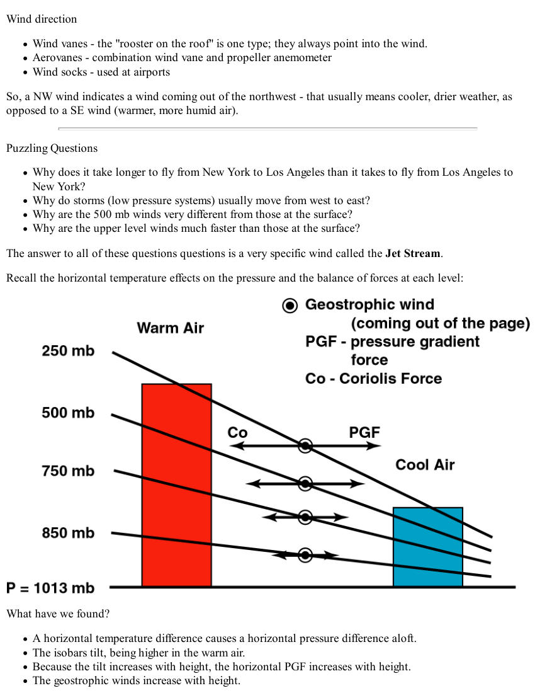

Wind direction
Wind vanes - the "rooster on the roof" is one type; they always point into the wind.
Aerovanes - combination wind vane and propeller anemometer
Wind socks - used at airports
So, a NW wind indicates a wind coming out of the northwest - that usually means cooler, drier weather, as
opposed to a SE wind (warmer, more humid air).
Puzzling Questions
Why does it take longer to fly from New York to Los Angeles than it takes to fly from Los Angeles to
New York?
Why do storms (low pressure systems) usually move from west to east?
Why are the 500 mb winds very different from those at the surface?
Why are the upper level winds much faster than those at the surface?
The answer to all of these questions questions is a very specific wind called the Jet Stream.
Recall the horizontal temperature effects on the pressure and the balance of forces at each level:
What have we found?
A horizontal temperature difference causes a horizontal pressure difference aloft.
The isobars tilt, being higher in the warm air.
Because the tilt increases with height, the horizontal PGF increases with height.
The geostrophic winds increase with height.

## Page 11

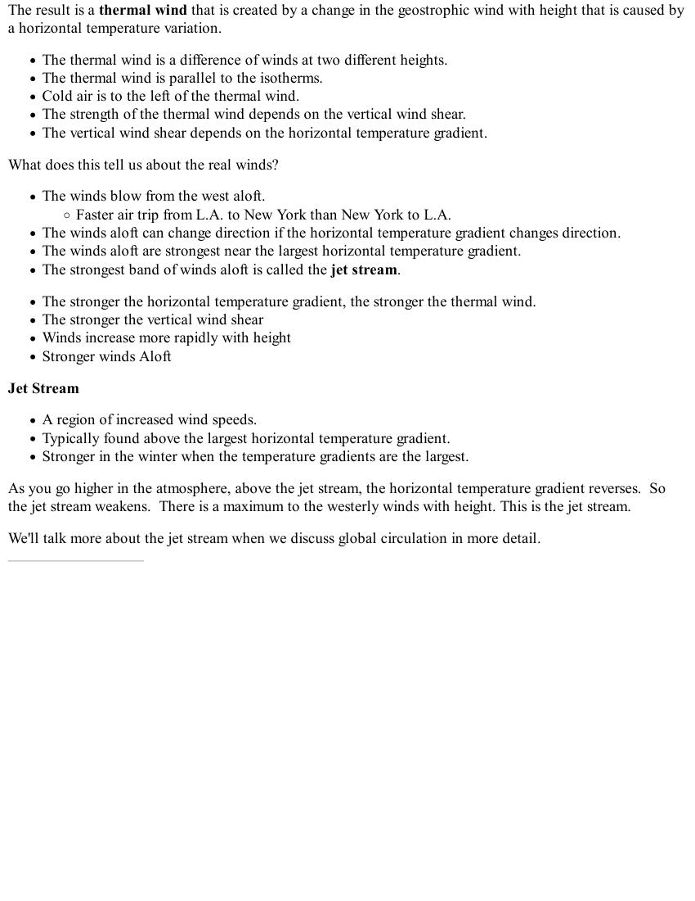

The result is a thermal wind that is created by a change in the geostrophic wind with height that is caused by
a horizontal temperature variation.
The thermal wind is a difference of winds at two different heights.
The thermal wind is parallel to the isotherms.
Cold air is to the left of the thermal wind.
The strength of the thermal wind depends on the vertical wind shear.
The vertical wind shear depends on the horizontal temperature gradient.
What does this tell us about the real winds?
The winds blow from the west aloft.
Faster air trip from L.A. to New York than New York to L.A.
The winds aloft can change direction if the horizontal temperature gradient changes direction.
The winds aloft are strongest near the largest horizontal temperature gradient.
The strongest band of winds aloft is called the jet stream.
The stronger the horizontal temperature gradient, the stronger the thermal wind.
The stronger the vertical wind shear
Winds increase more rapidly with height
Stronger winds Aloft
Jet Stream
A region of increased wind speeds.
Typically found above the largest horizontal temperature gradient.
Stronger in the winter when the temperature gradients are the largest.
As you go higher in the atmosphere, above the jet stream, the horizontal temperature gradient reverses.  So
the jet stream weakens.  There is a maximum to the westerly winds with height. This is the jet stream.
We'll talk more about the jet stream when we discuss global circulation in more detail.
