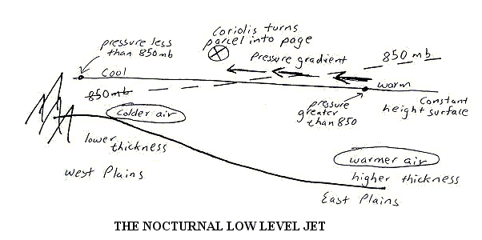
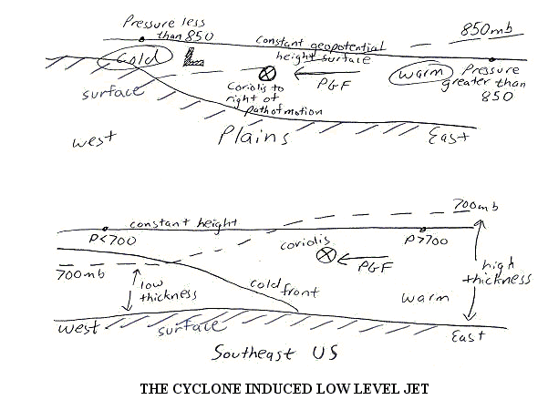
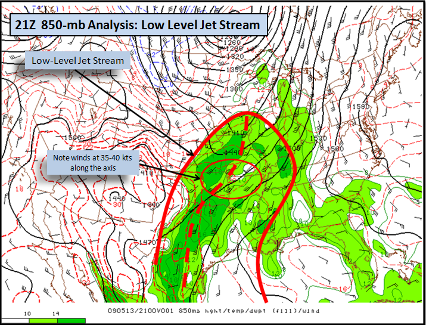
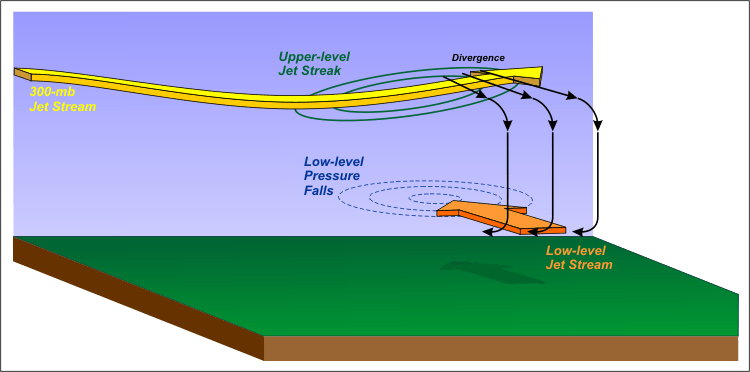

# The Low Level Jet

> Source: <http://www.weather.gov/source/zhu/ZHU_Training_Page/Miscellaneous/lowleveljet/lowleveljet.html>  
> Section: Winds/Jetstream  
> Captured: 2026-08-19 06:00 UTC  
> PDF: [the-low-level-jet.pdf](the-low-level-jet.pdf) · Original HTML: [source/original.html](source/original.html)

---

body {background-color:#F2F2F2; }
a:link { color:blue; }
a:visited { color:blue; }
a:hover { color:blue; }
a:active { color:blue; }

# The Low Level Jet

*Courtesy of Meteorologist Jeff Haby*

The low-level jet is a common experience for forecasters in the Great Plains and Eastern US. As the name implies, it is a fast
moving ribbon of air in the low levels of the atmosphere. It can rapidly transport Gulf moisture and warmer temperatures to the
North at speeds ranging from 25 to over 70 knots. There are two primary classifications of low-level jets. They are the
nocturnal low level jet and the mid-latitude cyclone induced low level jet. Both are described in this section along with
sketches characterizing their formation.

---

## The Nocturnal Low Level Jet

- Common location: Great Plains
- Common windspeed: 25 to 50 knots
- Caused by cooling of high elevation air relative to air at same geopotential height further east. This causes a pressure
  gradient to flow from warmer east air toward the cooler western air. Coriolis turns easterly flowing parcels to the right of
  path of motion. This gives the LLJ a strong southerly component.
- Air is colder to the west due to surface radiational cooling of the ground and a drier climate.
- Nocturnal jet is strongest in early morning hours and decreases during the day due to a reverse in the east to west temperature
  gradient. The reverse in the temperature gradient is caused by warming of surface air. Air closer to the surface will warm
  quicker than air further aloft during the day. The air at the 850 mb cools and warms quicker than 850 mb air further to the
  east since the western Great Plains is at a higher elevation.

---

## The Cyclone Induced Low Level Jet

- The top diagram shows the cyclone induced LLJ over the Great Plains while the lower diagram shows the LLJ over the SE US
- Common location: Great Plains and Eastern US
- Generally stronger than the nocturnal LLJ due to combination of nocturnal LLJ and thermal wind forcing flow toward low
- Common windspeed: 40 to 70 knots at 850 mb
- Occurs in warm sector of mid-latitude cyclone
- Caused by large temperature gradient spanning from behind cold front to warm sector of a cyclone
- Cyclone induced LLJ moves east as cold front moves east. The LLJ stays out ahead of the cold front
- Strongest wind speed is near 850-mb level. Wind speed is less at surface due to friction. This causes wind shear, which can
  result in strong gusts of wind at the surface
- Cyclone induced LLJ looses intensity when low pressure occludes and warm sector becomes "pinched off" from cyclone
  This is an example below of a mid-latitude cyclone induced low level jet. Temperatures are cold over the western Great Plains
  while they are much warmer in the warm sector across the eastern Great Plains. This produces a pressure gradient from the east
  toward the west. As air moves toward the west it is deflected to the North by the Coriolis force. The resulting wind, termed the
  low-level jet, can be in excess of 70 knots.

This is an example below of a mid-latitude cyclone induced low level jet. Temperatures are cold over the western Great Plains
while they are much warmer in the warm sector across the eastern Great Plains. This produces a pressure gradient from the east
toward the west. As air moves toward the west it is deflected to the North by the Coriolis force. The resulting wind, termed the
low-level jet, can be in excess of 70 knots.

---

## Low Level Jet Coupled with Upper Level Jet

Dept. of Meteorology, The Pennsylvania State University

A schematic that shows the tranverse circulation (black arrows) in the exit region of a 300-mb jet streak.
In response to low-level pressure falls beneath the area of
[upper-level divergence in the left-exit
region](https://courseware.e-education.psu.edu/courses/meteo361/Images/Section2/jet_streak_exp0202.swf), a southerly ageostrophic component develops. In turn, the associated horizontal acceleration can help to generate a low-level jet
stream (thick orange arrow). In this context, the upper-level and low-level jet streams are coupled.

Upper-level jet streams are often *coupled* with low-level jet streams. To gain scientific insight into coupled upper-level and low-level jet streams, check out the schematic above (keep in mind the northerly
ageostrophic component to the wind and the corresponding divergence that occur in the left-exit region of the 300-mb jet streak). In response,
a region of negative pressure tendencies develops in the lower troposphere beneath the area of upper-level divergence. The pocket of pressure
falls causes low-level southerly winds to accelerate, which often paves the way for a low-level jet stream. Such a low-level jet stream rapidly
transports moisture northward and increases the low-level vertical wind shear.

---

## Low level Jet Exercise (Answers Given)

**1. Why would the low level jet be less significant across the Plains if the Gulf of Mexico was a landmass?**
*a. The low level jet would not be able to transport moisture. The lack of moisture would reduce instability.*

**2. How is the Coriolis force important to the direction of airflow within the low level jet?**
*a. The Coriolis force turns the wind to the right of its path of motion. A east to west wind will become a south to north wind
(easterly wind is turned 90° to become a southerly wind)*

**3. Why does the nocturnal low level jet generally weaken during the daytime hours?**
*a. The west to east temperature gradient reverses during the day from what it was at night.*

**4. What causes the high winds speeds within a cyclone induced low level jet?**
*a. A strong pressure gradient force originating from the developing mid-latitude cyclone causes the high wind. The
strong pressure gradient force is caused by large temperature gradient between the cold air behind the cold front and warm
air ahead of the cold front.*

**5. Why is the low level jet important to severe storm development?**
*a. Transports moisture and WAA (inflow) into a developing thunderstorm's updraft. The high-speed wind and directional
shear helps generate large values of helicity that can lead to tornadogenesis.*

**6. What sector of a mid-latitude cyclone is the low level jet found?**
*a. WARM SECTOR*
