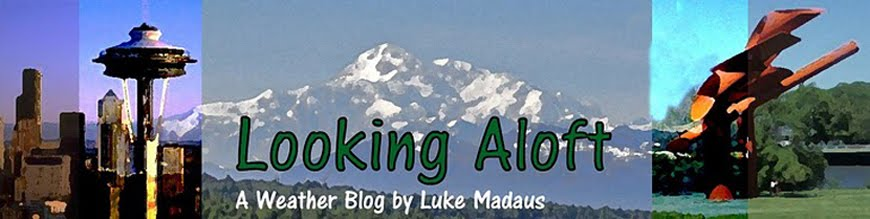
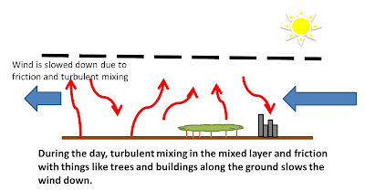
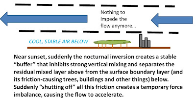

# The Nocturnal Boundary Layer Wind Maximum

> Source: <https://lukemweather.blogspot.com/2011/06/nocturnal-boundary-layer-wind.html>  
> Section: Turbulence  
> Captured: 2026-08-19 06:00 UTC  
> PDF: [the-nocturnal-boundary-layer-wind-maximum.pdf](the-nocturnal-boundary-layer-wind-maximum.pdf) · Original HTML: [source/original.html](source/original.html)

---

## Tuesday, June 14, 2011

### The Nocturnal Boundary Layer Wind Maximum...Part 1

Tonight's topic is a bit more elaborate and complex than a lot of what I usually talk about here.  However, it's a subject I enjoy a lot and I hope people will find it useful.  I've made several drawings to try to illustrate what I'm talking about, so hopefully things won't seem too complicated.  I'm also splitting my discussion over two blog posts so as not to seem too overwhelming.

So, as we can see from the title of this post, tonight I plan to talk about the nocturnal boundary layer wind maximum.  What exactly is this?  It's the phenomenon that we so often hear about when people are talking about severe weather.  There's always this worry about storms potentially becoming more severe or tornadic because the "low-level winds tend to pick up right around sunset".  I've used this expression myself many times before, including many times on this blog.  Some people refer to this as "a/the low-level jet" (though there are other kinds of "low-level jets"...).  It's true--the winds just a little ways above the ground tend to increase rather dramatically right around sunset and persist that way into the night.  Since the winds right at the surface tend to die off right around sunset, this can set up a lot of wind shear in the low-levels, where winds are rapidly changing speed with height.  The vorticity associated with this wind shear can be tilted into storms where it can enhance their rotational ability.  Furthermore, any sort of squall line complex would most likely become much stronger if suddenly the winds behind it started picking up right above the ground.  So yes...this phenomenon tends to increase the possibility of severe weather in the early evening hours when those winds start increasing.

But *why*?  Why do these low-level winds pick up like that?  And why does this phenomenon seem more prevalent over areas like the Great Plains?

It turns out that there are believed to be two main mechanisms at work here.  In complicated terms, they are:

1. A force imbalance that results after turbulent mixing and surface friction are "shut off" following the establishment of the nocturnal inversion.
2. Horizontal temperature gradients due to sloping terrain help enhance the low-level wind maximum.

I'll try to explain my understanding of these as simply as I can.

I'll start with the first mechanism tonight.  Let's start during the daytime. Let's also assume that whatever the weather situation, it just so happens that the winds in the low-levels are coming out of the south.  This tends to happen preceding the passage of surface low-pressure systems.   The air wants to move north.  There's some sort of pressure gradient pushing it to the north.  But it's hard for the air in the low levels to move that way.  Why?

1. With a lot of heating during the day, there's a lot of turbulent motion as air heated near the surface rises and colder air from above sinks down.  All that up and down motion is going to interfere with any horizontal wind trying to push through.
2. Near the surface, there's a lot of obstacles--trees, buildings, hills--that also block the wind.  The "roughness" of the surface due to these obstacles acts as friction slowing the wind down.

But the wind will eventually arrive at a balance.  The pressure force (and Coriolis force) directing the winds to the north eventually will balance out with the friction force and there will be a net motion northward with no acceleration.  However, this final wind velocity is not as fast as the wind could go because of all those obstacles opposing it (it will be sub-geostrophic, in technical terms).

So what happens after the sun goes down?  At some point near sunset, the earth's surface begins radiating away more energy than it's absorbing from the sun.  This makes the surface begin to cool.  As the surface cools, the air near the surface also begins to cool.  This sets up a relatively cold layer right near the surface.  Since cold air is denser than cold air, it wants to sink to the surface.  Therefore, this is a very stable arrangement--the cold air is already below the warm air above, as it should be.  Such stability inhibits a lot of vertical motion and tends to quiet the gustiness of the winds down.  You'll often see temperature profiles at night or in the early morning with an abrupt cooling right above the surface. The level that separates this cool surface air from the relatively warmer air above is known as the *nocturnal inversion*

But what happens now that the surface has cooled down and become more stable?  The hot surface was the source of a lot of the turbulent motion in the air above as that heated air tried to rise, so now there is much less turbulent mixing.  Furthermore, the inversion level will quickly rise above the trees, hills and buildings, separating the free atmosphere above from this friction.  As a result, with the air above separated from the surface friction and with the turbulent mixing reduced, suddenly it's like the resistance to the wind has been "shut off" above the inversion.  The once-balanced force directing the wind is no longer in balance and, with nothing to impede it, the wind rapidly starts accelerating northward.

One way to think of this is that the wind is trying to play "catch-up" since it was held back all day by the constant interference of the friction and the turbulence.  So, right after the sun sets and this surface cold layer starts developing, it reduces the obstacles to the winds progress and it moves north much more quickly.

(This actually gets more complicated, and it was shown way back in 1957 by Blackadar that this sets up an inertial oscillation with the Coriolis effect that also causes the wind direction to rotate anti-cyclonically, but that's beyond what I want to talk about here...)

So we see how these winds just above the ground might really start accelerating right after sunset.  But this could happen anywhere.  And, several studies have shown that areas like the Great Plains see this phenomenon with a greater strength and frequency than is seen elsewhere.  So something else must be contributing...but I'll save that for my next post.  We'll get to bring back our old friend, the thermal wind...

Posted by

[Luke Madaus](https://www.blogger.com/profile/00342287184407373669 "author profile")

at
[9:08 PM](the-nocturnal-boundary-layer-wind-maximum.md "permanent link")

[Email This](https://www.blogger.com/share-post.g?blogID=8688208662932527409&postID=7633289595709858372&target=email "Email This")[BlogThis!](https://www.blogger.com/share-post.g?blogID=8688208662932527409&postID=7633289595709858372&target=blog "BlogThis!")[Share to X](https://www.blogger.com/share-post.g?blogID=8688208662932527409&postID=7633289595709858372&target=twitter "Share to X")[Share to Facebook](https://www.blogger.com/share-post.g?blogID=8688208662932527409&postID=7633289595709858372&target=facebook "Share to Facebook")[Share to Pinterest](https://www.blogger.com/share-post.g?blogID=8688208662932527409&postID=7633289595709858372&target=pinterest "Share to Pinterest")

Labels:
[fundamentals](https://lukemweather.blogspot.com/search/label/fundamentals)

#### No comments:

#### Post a Comment

[Newer Post](https://lukemweather.blogspot.com/2011/06/more-on-nocturnal-boundary-layer-wind.html "Newer Post")

[Older Post](https://lukemweather.blogspot.com/2011/06/importance-of-el-nino.html "Older Post")
[Home](https://lukemweather.blogspot.com/)

Subscribe to:
[Post Comments (Atom)](https://lukemweather.blogspot.com/feeds/7633289595709858372/comments/default)

## Current UTC time

## My personal weather station: KWASEATT252

[Click for weather forecast](http://www.wunderground.com/personal-weather-station/dashboard?ID=KWASEATT252 "Get latest Weather Forecast updates")

## UPDATE

## About Me

[Luke Madaus](https://www.blogger.com/profile/00342287184407373669)
:   Seattle, WA, United States
:   Completed graduate school at the University of Washington, now a postdoctoral researcher at NCAR in Boulder. The thoughts and opinions expressed on this blog are solely those of the author and are do not necessarily represent the positions of NCAR.
    Email me at lukemweather@gmail.com.
    http://www.midlatitude.com/lukemadaus

[View my complete profile](https://www.blogger.com/profile/00342287184407373669)

## Blogs I Follow

- 

  [Deep Cold: Interior and Northern Alaska Weather & Climate](http://ak-wx.blogspot.com/)

  [Heat Wave Ends](http://ak-wx.blogspot.com/2026/08/heat-wave-ends.html)

  8 hours ago
- 

  [Bob Maddox Weather](https://madweather.blogspot.com/)

  [Heat Continues](https://madweather.blogspot.com/2026/08/heat-continues.html)

  8 hours ago
- 

  [CIMSS Satellite Blog](https://cimss.ssec.wisc.edu/satellite-blog)

  [Mukluk Fire near Tok, Alaska forces evacuations](https://cimss.ssec.wisc.edu/satellite-blog/archives/71861)

  1 day ago
- 

  [Wasatch Weather Weenies](https://wasatchweatherweenies.blogspot.com/)

  [Summer Skiing Is Dead](https://wasatchweatherweenies.blogspot.com/2026/08/summer-skiing-is-dead.html)

  1 day ago
- 

  [NOAA NWS Headlines](http://www.weather.gov)

  [Heavy Rainfall Continues in Hawaii; Severe Thunderstorms and Heavy Rainfall
  in the Plains and Southern Appalachians](https://lukemweather.blogspot.com/2011/06/www.wpc.ncep.noaa.gov/discussions/hpcdiscussions.php?disc=pmdspd)

  1 day ago
- 

  [Cliff Mass Weather Blog](https://cliffmass.blogspot.com/)

  [Extroardinary Rain and Wind in Hawaii: Did El Nino Help?](https://cliffmass.blogspot.com/2026/08/extroardinary-rain-and-wind-in-hawaii.html)

  2 days ago
- 

  [Capital Weather Gang](https://www.washingtonpost.com)

  [D.C. could soon see some of its hottest days on record. Here’s the forecast.](https://www.washingtonpost.com/weather/2026/06/30/see-forecast-what-could-be-some-dcs-hottest-days-record/)

  1 month ago
- 

  [OSNW3 | Lezak's Recurring Cycle](http://osnw3lrc.blogspot.com/)

  [72+ Bibus informations complètes lignes Genève suisse de bus de la carte](http://osnw3lrc.blogspot.com/2023/12/72-bibus-informations-completes-lignes.html)

  2 years ago
- 

  [PNSN Seismo Blog](http://pnsn.org/blog/feeds?id=1)

  [The Fireball and the Explosion](http://pnsn.org/blog/2022/04/07/the-fireball-and-the-explosion)

  4 years ago
- 

  [Chuck's Chatter](http://cadiiitalk.blogspot.com/)

  ["Thank you for your service" - 3rd installment](http://cadiiitalk.blogspot.com/2019/11/thank-you-for-your-service-3rd.html)

  6 years ago
- 

  [Minnesota Updraft](http://blogs.mprnews.org/updraft)

  [Not quite as steamy; storm risk rises again Wednesday](http://blogs.mprnews.org/updraft/2019/07/not-quite-as-steamy-storm-risk-rises-again-wednesday/)

  7 years ago
- 

  [Scott Sistek's Weather Blog](https://komonews.com)

  [BYU big man Yoeli Childs on Talkin' Sports](http://komonews.com/sports/college/byu-big-man-yoeli-childs-on-talkin-sports?9bf31c7ff062936a96d3c8bd1f8f2ff3)

  8 years ago
- 

  [Isaac Held Climate Dynamics](https://www.gfdl.noaa.gov)

  [72. Odd recent evolution of the QBO](https://www.gfdl.noaa.gov/blog_held/72-odd-recent-evolution-of-the-qbo/)

  9 years ago
- 

  [Charlie's Weather Forecasts](https://charliesweatherforecasts.blogspot.com/)

  [A New Climate Change Movement](https://charliesweatherforecasts.blogspot.com/2016/05/a-new-climate-change-movement.html)

  10 years ago
- 

  [The Vane](http://thevane.gawker.com)

  [Nature Goes for Bingo Across the U.S. This Week With Every Kind of Bad
  Weather Imaginable](http://thevane.gawker.com/nature-goes-for-bingo-across-the-u-s-this-week-with-ev-1742862078)

  10 years ago
- 

  [Fluxes](http://afadames.blogspot.com/)

  [Eyes on the Southwest Pacific](http://afadames.blogspot.com/2014/03/eyes-on-southwest-pacific.html)

  12 years ago
- 

  [Canadian Weather Blog (Brett Anderson)](http://www.accuweather.com)

  [Update of My Winter Forecast](https://www.accuweather.com/en/weather-blogs/anderson/update-of-my-winter-forecast/112123)

  19 years ago
- 

  [ENSO Blog | NOAA Climate.gov](http://www.climate.gov/news-features/department/enso-blog)

## Weather Data Sites

- [OU HOOT Website](http://hoot.ou.edu/)
- [UW Northwest Observations](http://www.atmos.washington.edu/marka/pnw.html)
- [UW Northwest Models](http://www.atmos.washington.edu/~cliff/cliff.php?nav=wrf_mm5)
- [EC Canadian GEM Model](http://www.weatheroffice.gc.ca/model_forecast/global_e.html)
- [College of DuPage](http://weather.cod.edu/analysis)

## Blog Archive

- [►](javascript:void(0))
  [2016](https://lukemweather.blogspot.com/2016/)
  (3)
  - [►](javascript:void(0))
    [October](https://lukemweather.blogspot.com/2016/10/)
    (2)
  - [►](javascript:void(0))
    [January](https://lukemweather.blogspot.com/2016/01/)
    (1)

- [►](javascript:void(0))
  [2015](https://lukemweather.blogspot.com/2015/)
  (19)
  - [►](javascript:void(0))
    [November](https://lukemweather.blogspot.com/2015/11/)
    (2)
  - [►](javascript:void(0))
    [September](https://lukemweather.blogspot.com/2015/09/)
    (2)
  - [►](javascript:void(0))
    [August](https://lukemweather.blogspot.com/2015/08/)
    (1)
  - [►](javascript:void(0))
    [June](https://lukemweather.blogspot.com/2015/06/)
    (1)
  - [►](javascript:void(0))
    [May](https://lukemweather.blogspot.com/2015/05/)
    (2)
  - [►](javascript:void(0))
    [April](https://lukemweather.blogspot.com/2015/04/)
    (1)
  - [►](javascript:void(0))
    [March](https://lukemweather.blogspot.com/2015/03/)
    (3)
  - [►](javascript:void(0))
    [February](https://lukemweather.blogspot.com/2015/02/)
    (4)
  - [►](javascript:void(0))
    [January](https://lukemweather.blogspot.com/2015/01/)
    (3)

- [►](javascript:void(0))
  [2014](https://lukemweather.blogspot.com/2014/)
  (6)
  - [►](javascript:void(0))
    [April](https://lukemweather.blogspot.com/2014/04/)
    (1)
  - [►](javascript:void(0))
    [February](https://lukemweather.blogspot.com/2014/02/)
    (1)
  - [►](javascript:void(0))
    [January](https://lukemweather.blogspot.com/2014/01/)
    (4)

- [►](javascript:void(0))
  [2013](https://lukemweather.blogspot.com/2013/)
  (12)
  - [►](javascript:void(0))
    [November](https://lukemweather.blogspot.com/2013/11/)
    (4)
  - [►](javascript:void(0))
    [October](https://lukemweather.blogspot.com/2013/10/)
    (1)
  - [►](javascript:void(0))
    [September](https://lukemweather.blogspot.com/2013/09/)
    (3)
  - [►](javascript:void(0))
    [July](https://lukemweather.blogspot.com/2013/07/)
    (1)
  - [►](javascript:void(0))
    [June](https://lukemweather.blogspot.com/2013/06/)
    (1)
  - [►](javascript:void(0))
    [May](https://lukemweather.blogspot.com/2013/05/)
    (2)

- [►](javascript:void(0))
  [2012](https://lukemweather.blogspot.com/2012/)
  (15)
  - [►](javascript:void(0))
    [May](https://lukemweather.blogspot.com/2012/05/)
    (2)
  - [►](javascript:void(0))
    [April](https://lukemweather.blogspot.com/2012/04/)
    (1)
  - [►](javascript:void(0))
    [February](https://lukemweather.blogspot.com/2012/02/)
    (4)
  - [►](javascript:void(0))
    [January](https://lukemweather.blogspot.com/2012/01/)
    (8)

- [▼](javascript:void(0))
  [2011](https://lukemweather.blogspot.com/2011/)
  (96)
  - [►](javascript:void(0))
    [December](https://lukemweather.blogspot.com/2011/12/)
    (6)
  - [►](javascript:void(0))
    [November](https://lukemweather.blogspot.com/2011/11/)
    (5)
  - [►](javascript:void(0))
    [October](https://lukemweather.blogspot.com/2011/10/)
    (7)
  - [►](javascript:void(0))
    [September](https://lukemweather.blogspot.com/2011/09/)
    (9)
  - [►](javascript:void(0))
    [August](https://lukemweather.blogspot.com/2011/08/)
    (7)
  - [►](javascript:void(0))
    [July](https://lukemweather.blogspot.com/2011/07/)
    (6)
  - [▼](javascript:void(0))
    [June](https://lukemweather.blogspot.com/2011/06/)
    (9)
    - [TS Arlene -- another kind of circular MCS](https://lukemweather.blogspot.com/2011/06/ts-arlene-another-kind-of-circular-mcs.html)
    - [What is a mesoscale convective complex?](https://lukemweather.blogspot.com/2011/06/what-is-mesoscale-convective-complex.html)
    - [The World of "Mesoscale" Convective Systems](https://lukemweather.blogspot.com/2011/06/world-of-mesoscale-convective-systems.html)
    - [Storms firing on an outflow boundary](https://lukemweather.blogspot.com/2011/06/storms-firing-on-outflow-boundary.html)
    - [More on the Nocturnal Boundary Layer Wind Maximum](https://lukemweather.blogspot.com/2011/06/more-on-nocturnal-boundary-layer-wind.html)
    - [The Nocturnal Boundary Layer Wind Maximum...Part 1](the-nocturnal-boundary-layer-wind-maximum.md)
    - [The Importance of El Nino](https://lukemweather.blogspot.com/2011/06/importance-of-el-nino.html)
    - [Arizona Wildfires and Trajectory Models](https://lukemweather.blogspot.com/2011/06/arizona-wildfires-and-trajectory-models.html)
    - [Sometimes it takes some effort to keep storms goin...](https://lukemweather.blogspot.com/2011/06/sometimes-it-takes-some-effort-to-keep.html)
  - [►](javascript:void(0))
    [May](https://lukemweather.blogspot.com/2011/05/)
    (9)
  - [►](javascript:void(0))
    [April](https://lukemweather.blogspot.com/2011/04/)
    (11)
  - [►](javascript:void(0))
    [March](https://lukemweather.blogspot.com/2011/03/)
    (8)
  - [►](javascript:void(0))
    [February](https://lukemweather.blogspot.com/2011/02/)
    (9)
  - [►](javascript:void(0))
    [January](https://lukemweather.blogspot.com/2011/01/)
    (10)

- [►](javascript:void(0))
  [2010](https://lukemweather.blogspot.com/2010/)
  (31)
  - [►](javascript:void(0))
    [December](https://lukemweather.blogspot.com/2010/12/)
    (15)
  - [►](javascript:void(0))
    [November](https://lukemweather.blogspot.com/2010/11/)
    (16)

**A blog for the weather enthusiast or meteorologist with a little more technical slant on describing the weather.**

(c) Luke Madaus, 2011. Simple theme. Theme images by [gaffera](http://www.istockphoto.com/googleimages.php?id=4072573&platform=blogger&langregion=en). Powered by [Blogger](https://www.blogger.com).
