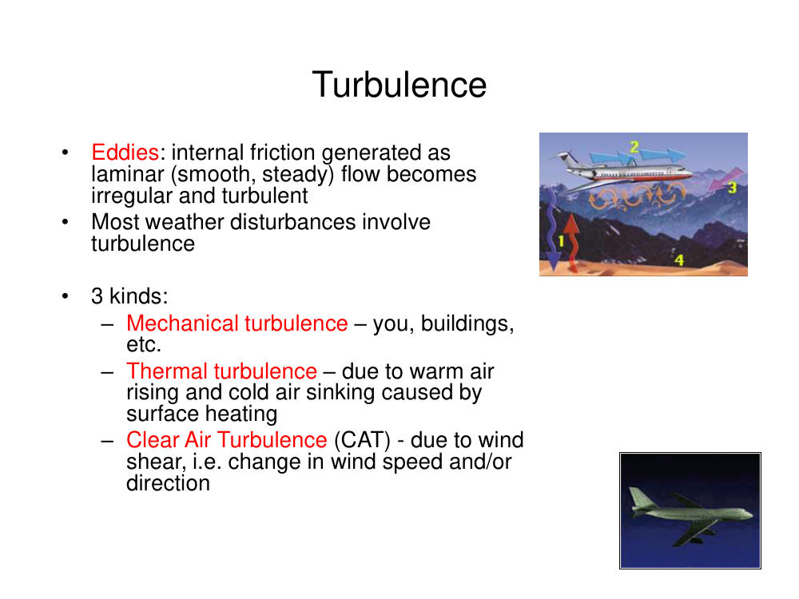
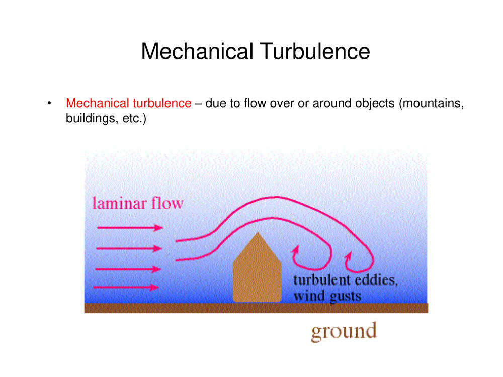
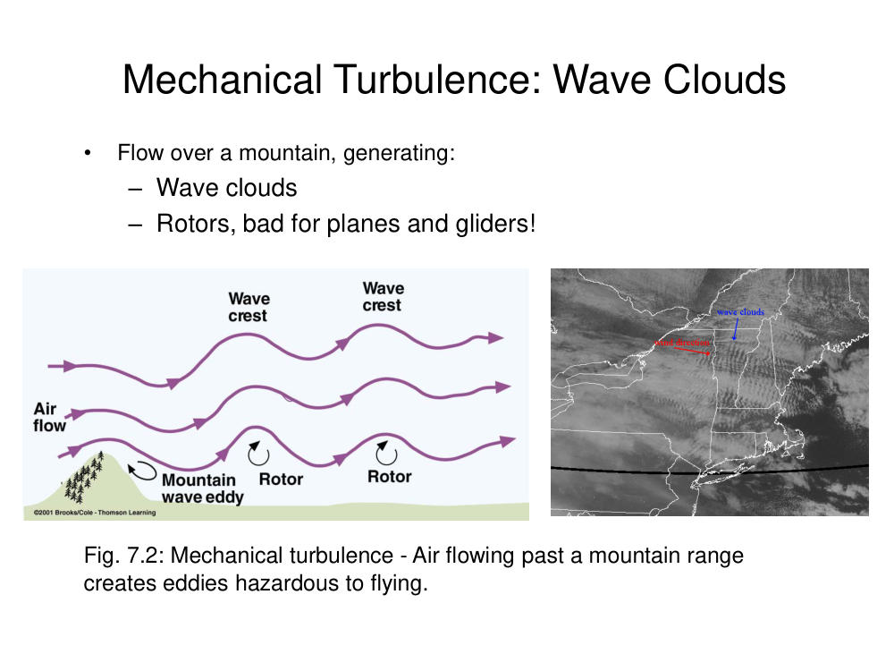
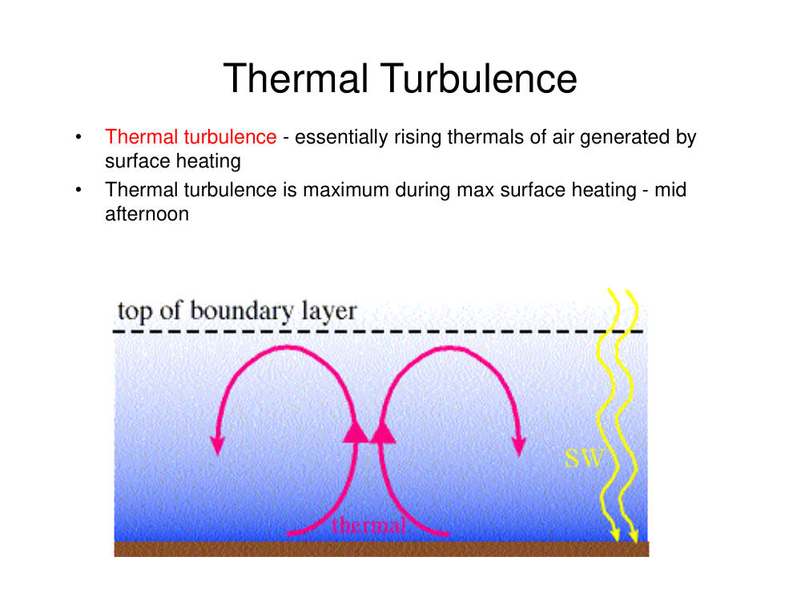
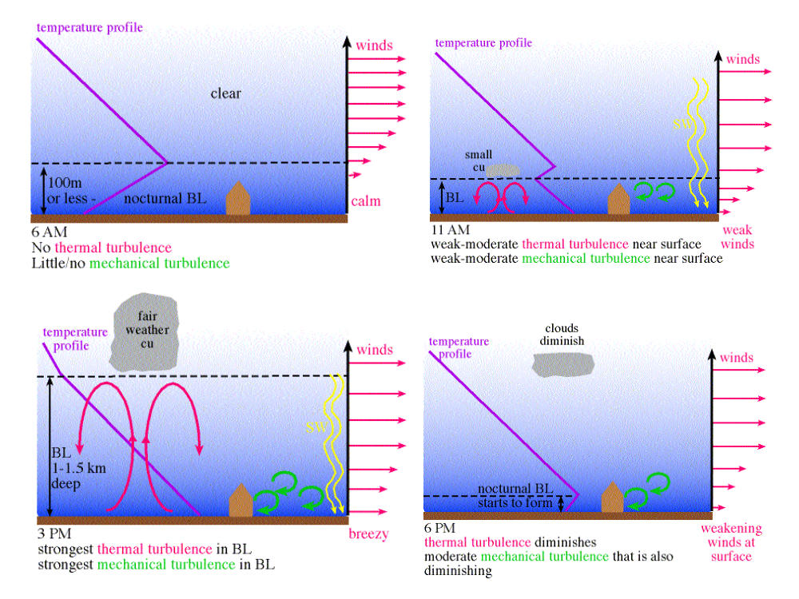
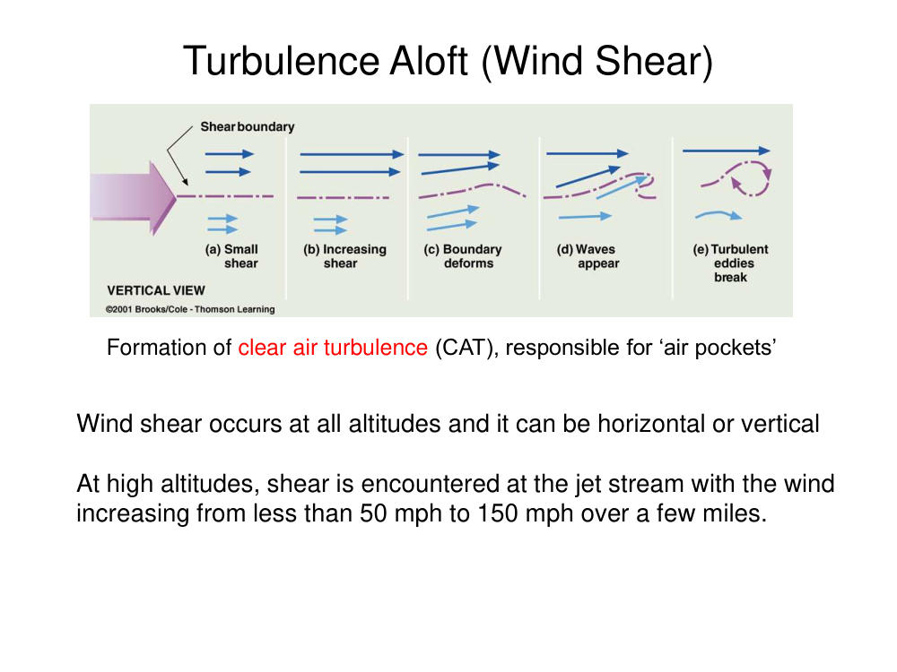

# Turbulence Tutorial — Tutorial 2

> Source: <http://www.weather.gov/media/zhu/ZHU_Training_Page/turbulence_stuff/turbulence/turbulence.pdf>  
> Section: Turbulence  
> Captured: 2026-08-19 06:00 UTC  
> PDF: [turbulence-tutorial-tutorial-2.pdf](turbulence-tutorial-tutorial-2.pdf) (6 pages)

---

## Page 1

Turbulence
•
Eddies: internal friction generated as 
laminar (smooth, steady) flow becomes 
irregular and turbulent 
•
Most weather disturbances involve 
turbulence
•
3 kinds:
– Mechanical turbulence – you, buildings, 
etc.
– Thermal turbulence – due to warm air 
rising and cold air sinking caused by 
surface heating
– Clear Air Turbulence (CAT) - due to wind 
shear, i.e. change in wind speed and/or 
direction

## Page 2

Mechanical Turbulence
•
Mechanical turbulence – due to flow over or around objects (mountains, 
buildings, etc.)

## Page 3

Mechanical Turbulence: Wave Clouds
Fig. 7.2: Mechanical turbulence - Air flowing past a mountain range 
creates eddies hazardous to flying.
•
Flow over a mountain, generating:
– Wave clouds
– Rotors, bad for planes and gliders!

## Page 4

Thermal Turbulence
•
Thermal turbulence - essentially rising thermals of air generated by 
surface heating 
•
Thermal turbulence is maximum during max surface heating - mid 
afternoon

## Page 5

_(no extractable text on this page — see rendered image above)_

## Page 6

Turbulence Aloft (Wind Shear)
Formation of clear air turbulence (CAT), responsible for ‘air pockets’
Wind shear occurs at all altitudes and it can be horizontal or vertical
At high altitudes, shear is encountered at the jet stream with the wind 
increasing from less than 50 mph to 150 mph over a few miles.
