# Turbulence Tutorial

> Source: <http://www.weather.gov/source/zhu/ZHU_Training_Page/turbulence_stuff/turbulence/turbulence.htm>  
> Section: Turbulence  
> Captured: 2026-08-19 06:00 UTC  
> PDF: [turbulence-tutorial.pdf](turbulence-tutorial.pdf) · Original HTML: [source/original.html](source/original.html)

---

# Turbulence

Turbulence is one of the most
unpredictable of all the weather phenomena that are of significance to pilots. Turbulence
is an irregular motion of the air resulting from eddies and vertical currents. It may be
as insignificant as a few annoying bumps or severe enough to momentarily throw an airplane
out of control or to cause structural damage. Turbulence is associated with fronts, wind shear, thunderstorms, etc.

### GENERAL DESCRIPTION OF EFFECTS ON AIRCRAFT

Turbulent whirls near the size of the aircraft induce chaotic rolls, pitches and yaws.

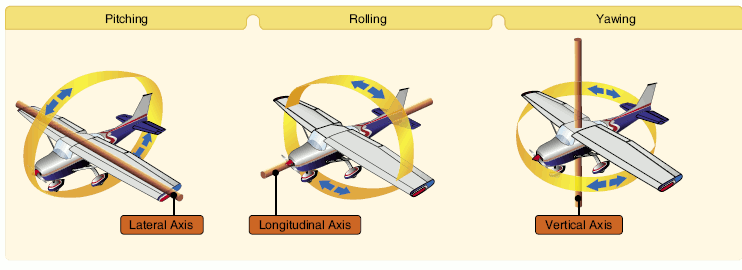

### TURBULENCE INTENSITY

In reporting turbulence, it is usually
classed as light, moderate, severe or extreme. The degree is determined by the nature of
the initiating agency and by the degree of stability of the air.

**Light turbulence** momentarily causes slight
changes in altitude and/or attitude or a slight bumpiness. Occupants of the airplane may
feel a slight strain against their seat belts.

**Moderate** turbulence is similar to light
turbulence but somewhat more intense. There is, however, no loss of control of the
airplane. Occupants will feel a definite strain against their seat belts and unsecured
objects will be dislodged.

**Severe turbulence** causes large and abrupt changes in altitude and/or attitude and, usually, large variations in indicated airspeed.
The airplane may momentarily be out of control. Occupants of the airplane will be forced
violently against their seat belts.

In **extreme turbulence**, the airplane is tossed violently about and is impossible to control. It may cause structural damage.

**Chop** is a type of turbulence that causes rapid and somewhat rhythmic bumpiness

| Turbulence Intensity Classification | |
| --- | --- |
| Intensity | Effect |
| **Light** | Slight erratic changes in altitude and/or attitude |
| **Moderate** | Change in altitude and/or attitude, but the aircraft remains in positive control at all times |
| **Severe** | Large, abrupt changes in altitude and/or attitude. Aircraft may be momentarily out of control |
| **Extreme** | Aircraft is violently tossed about and practically impossible to control. May cause structural damage. |

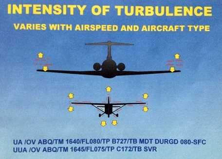  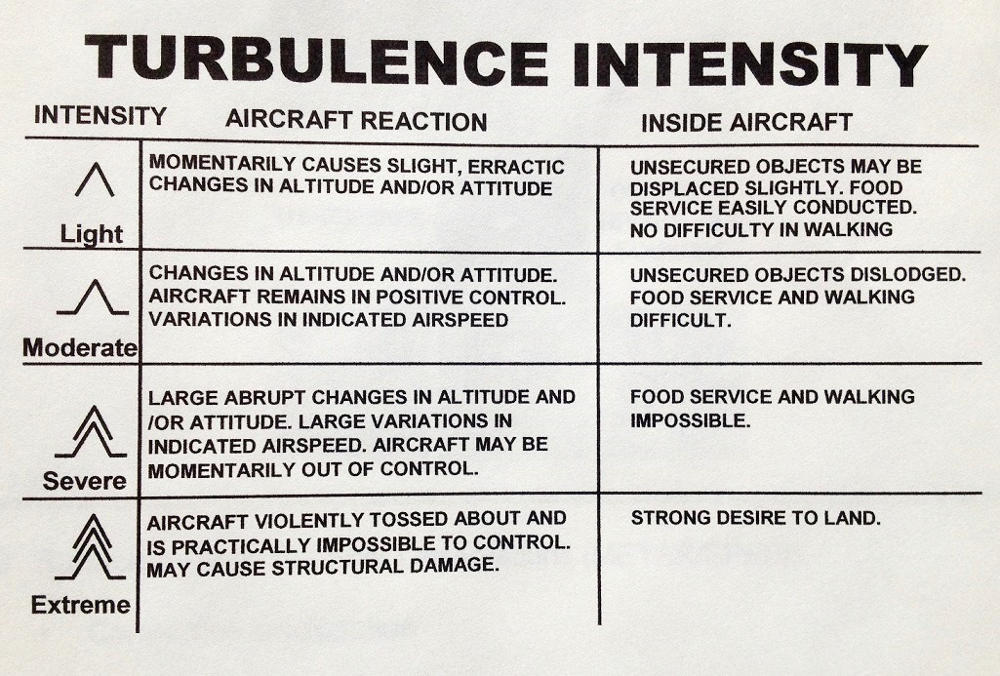

### CAUSES OF TURBULENCE

There are four causes of turbulence.

**1. ***Mechanical
Turbulence***.** Friction between the air and the ground, especially
irregular terrain and man-made obstacles, causes eddies and therefore turbulence in the
lower levels. The intensity of this eddy motion depends on the strength of the surface
wind, the nature of the surface and the stability of the air. *The stronger the wind speed (generally, a surface wind of 20 knots or higher is required for significant turbulence),
the rougher the terrain and the more unstable the air, the greater will be the turbulence.
Of these factors that affect the formation of turbulence, stability is the most important.*
If the air is being heated from below, the vertical motion will be more vigorous and
extensive and the choppiness more pronounced. In unstable air, eddies tend to grow in
size; in stable air, they tend not to grow in size but do dissipate more slowly.

In strong winds, even hangars and large buildings cause eddies that can be carried some distance downwind. Strong winds are usually quite gusty; that is, they fluctuate rapidly in speed. Sudden increases in speed that last several minutes are known as squalls and they are responsible for quite severe turbulence.

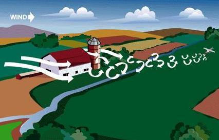  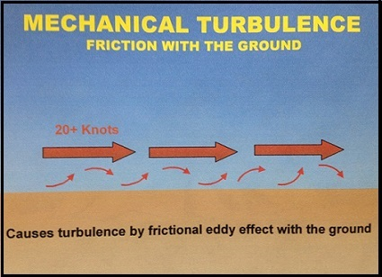

**Mountain waves** are turbulent eddies that are found downwind from mountain ridges. They are caused by and are therefore stationary with respect to the mountain ridges. Mountain waves produce some of the most severe turbulence
associated with mechanical agencies. ***NOTE:** Stability of the lower troposphere above and to the
lee of the mountain is critical (i.e., the most intense turbulence is associated with stable air above and to the lee of the mountain barrier).*

Favorable conditions for **mountain waves** include:

- Winds 25 knots or greater, blowing perpendicular to the top of the mountain ridge.
- Little change of wind direction with height
- Wind speeds increasing with height
- Stable atmosphere (there should be some cold air advection across or along the mountain range, a layer of low stability near the ground, a very stable layer at mountain top level above the surface layer, and finally, a less stable layer above the stable layer)
       - This requires air parcels forced to rise over the mountain crest to sink toward their initial altitude (or equilibrium level)
       - Parcels then rise and fall in a damped oscillatory pattern, much like a weighted spring
- Often extends from the surface to slightly above the tropopause
- May extend 100 miles or more downstream from mountain crests
- Main updraft and downdraft of the wave can displace an aircraft up to 5,000 feet per minute
- Downdrafts may extend to surface on lee side of mountain
- The most intense turbulence is usually located at low-levels, leeward of the mountains in or near the rotor cloud, if present
- Mountain waves may be denoted by mountain wave clouds
       - Cirrocumulus Standing Lenticular (CCSL)
       - Altocumulus Standing Lenticular (ACSL)
       - Rotor clouds (often associated with the most intense turbulence)

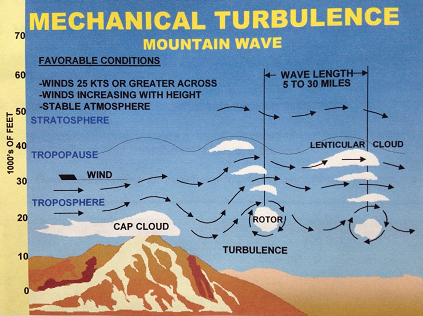  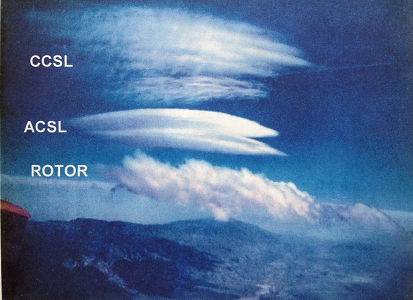

**2. ***Thermal (Convective) Turbulence***.**Turbulence can also be expected on warm summer days when the sun heats the earth's surface unevenly. Certain surfaces, such as barren ground, rocky and sandy areas, are heated more rapidly than are grass covered fields and much more rapidly than is water. Isolated convective currents are therefore set in motion with warm air rising and cooler air descending, which are responsible for bumpy conditions as an airplane flies in and out of them. Turbulence extends from the base to the top of the convection layer, with smooth conditions found above. if cumulus, towering cumulus or cumulonimbus clouds are present, the turbulent layer extends from the surface to cloud tops. Turbulence intensity increases as convective updraft intensity increases. In weather conditions when thermal activity can be expected, many pilots prefer to fly in the early morning or in the evening when the thermal activity is not as severe.

Convective currents may not be made visible by cumuliform clouds, resulting in "dry thermals". Favorable conditions for dry convection include warm surface temperatures, uneven surface hearing, and steep surface-based lapse rates.

Convective currents are often strong enough to produce air mass thunderstorms with which severe turbulence is associated.
Turbulence can also be expected in the lower levels of a cold air mass that is moving over a warm surface. Heating from below creates unstable conditions, gusty winds and bumpy flying conditions.

Thermal turbulence will have a
pronounced-effect on the flight path of an airplane approaching a landing area. The
airplane is subject to convective currents of varying intensity set in motion over the
ground along the approach path. These thermals may displace the airplane from its normal
glide path with the result that it will either overshoot or undershoot the runway.

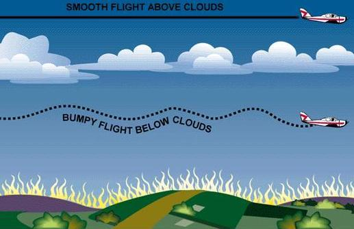

**3. ***Frontal Turbulence***.**The lifting of the warm air by the sloping frontal surface and friction between the
two opposing air masses produce turbulence in the frontal zone. This turbulence is most
marked when the warm air is moist and unstable and will be extremely severe if
thunderstorms develop. Turbulence is more commonly associated with cold fronts but can be
present, to a lesser degree, in a warm front as well.

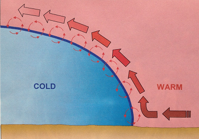

**4. ***Wind Shear***. Wind shear is the
change in wind direction and/or wind speed over a specific horizontal or vertical distance. *Atmospheric conditions where wind shear exists include: areas of temperature inversions, along troughs and lows, and around jet stream*. When the change in wind speed and direction is pronounced, quite severe turbulence can be expected. Clear air turbulence is associated at high altitudes (i.e, above 15,000 feet AGL) with the jet stream.

Temperature inversions are zones with vertical wind shear potential. Strong stability prevents mixing of the stable low layer with the warmer layer above. The greatest shear, and thus the greatest turbulence, is found at the tops of the inversion layer. Turbulence associated with temperature inversions often occur due to radiational cooling, which is nighttime cooling of the Earth's surface, creating a surface-based inversion.

Turbulence associated with lows and troughs is due mainly to horizontal directional and speed shear. Turbulence is generally found along troughs at any altitude, within lows at any altitude, and poleward of lows in the mid and upper altitudes.

A jet stream is core of strong horizontal winds that follows a wavelike pattern as a part of the general wind flow. It is located where there are large horizontal differences in temperature between warm and cold air masses. Turbulence is located along strong isotach gradient zones. Most often, turbulence is located on poleward side of cyclonic jet stream. Conversely, turbulence is often located on equatorward side of the anticyclonic jet stream. Turbulence is enhanced by an "arching" (amplified) jet stream around troughs and ridges.

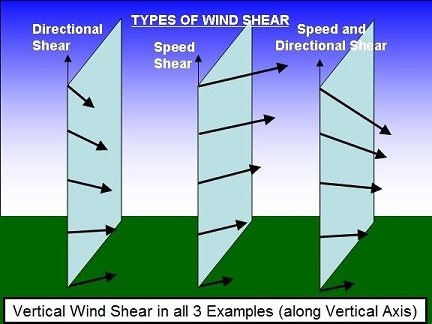

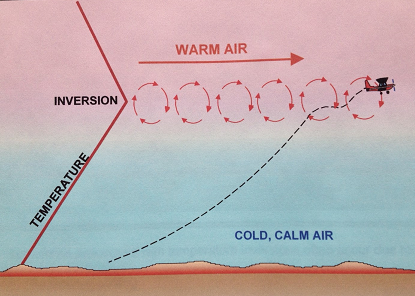  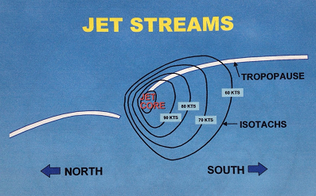

### CLEAR AIR TURBULENCE

Clear air turbulence is turbulence not associated with cumuliform clouds, including thunderstorms, occurring at or above 15,000 feet. Clear air turbulence is not restricted to cloud-free air (75% of all CAT encounters are in clear air).

|  |  |
| --- | --- |
| 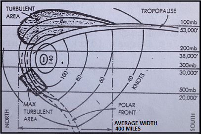 |  |
|  | *Click above image for larger image* |

**General characteristics of clear air
 turbulence include:**

- Occurs in patches
- Area is elongated with the wind
- Usually found above 15,000 feet
- In association with a marked change in speeds:
     » with height (vertical shear)
     » or in the horizontal (horizontal shear)
- 2,000 feet deep
- 20 miles wide
- 50 miles long
- transitory
- Most frequent during winter
- Least frequent during summer

CAT areas at high-levels are usually patchy, and these patches have variable
dimensions which have been know to be as much as 10,000 feet thick, 500 miles wide, and 1,000 miles long.

**The occurrence of CAT can extend to very high levels and can be associated
with other windflow patterns which produce shears:**

- A sharp upper level trough, especially one moving at speeds greater than 10 knots. (See Figure A. below)
- A closed low aloft, particularly if the flow is merging or splitting (See Figure B. below)
- To the northeast of a cutoff low aloft as shown in Figure C. below
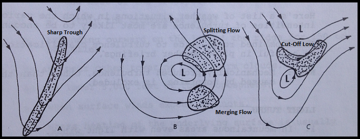

### TURBULENCE AND THUNDERSTORMS

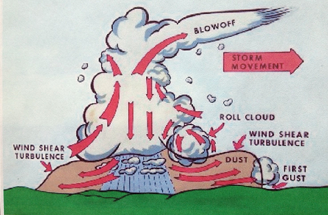

Turbulence, associated with thunderstorms, can be extremely hazardous, having the
potential to cause overstressing of the aircraft or loss of control. Thunderstorm vertical
currents may be strong enough to displace an aircraft up or down vertically as much as
2000 to 6000 feet. The greatest turbulence occurs in the vicinity of adjacent rising and
descending drafts. Gust loads can be severe enough to stall an aircraft flying at rough
air (maneuvering) speed or to cripple it at design cruising speed. Maximum turbulence
usually occurs near the mid-level of the storm, between 12,000 and 20,000 feet and is most
severe in clouds of the greatest vertical development.

Severe turbulence is present not just
within the cloud. It can be expected up to 20 miles from severe thunderstorms and will be
greater downwind than into wind. Severe turbulence and strong out-flowing winds may also
be present beneath a thunderstorm. Microbursts can be especially hazardous because of the
severe wind shear associated with them.

---

# Turbulence from Convection Currents and Obstructions

Convection currents cause the bumpiness experienced by pilots flying
at low altitudes in warmer weather. On a low flight over varying surfaces, the pilot will encounter
updrafts over pavement or barren places and downdraft over vegetation and
water. Ordinarily, this can be avoided by flight at higher altitudes. When
the larger convection currents form cumulus clouds, the pilot will invariably
find smooth air above the cloud level.

**Avoiding turbulence caused by convection currents by flying above the cloud level.**

Convection currents also cause difficulty in making landings, since
they affect the rate of descent. For example, a pilot flying a normal glide
frequently tends to land short of or overshoot the intended landing spot,
depending upon the presence and severity of convection currents.

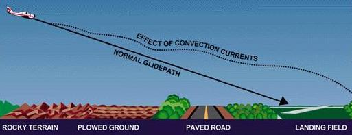

**Varying surfaces affect the normal glidepath. Some
surfaces create rising currents which tend to cause the pilot to overshoot
the field.**

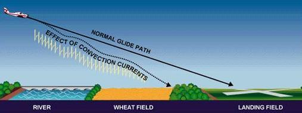

**Descending currents prevail above some surfaces and
tend to cause the pilot to land short of the field.**

The effects of local convection, however, are less dangerous
than the turbulence caused when wind is forced to flow around or over obstructions.
The only way for the pilot to avoid this invisible hazard is to be forewarned,
and to know where to expect unusual conditions.

**Effect of Obstructions on Wind**

When the wind flows around an obstruction, it breaks into eddies—gusts
with sudden changes in speed and direction—which may be carried along some
distance from the obstruction. A pilot flying through such turbulence should
anticipate the bumpy and unsteady flight that may be encountered. This
turbulence—the intensity of which depends upon the size of the obstacle
and the velocity of the wind—can present a serious hazard during takeoffs
and landings. For example, during landings, it can cause an aircraft to
“drop in;” during takeoffs, it could cause the aircraft to fail to gain
enough altitude to clear low objects in its path. Any landings or takeoffs
attempted under gusty conditions should be made at higher speeds, to maintain
adequate control during such conditions.

This same condition is more noticeable where larger obstructions such as
bluffs or mountains are involved. The wind blowing
up the slope on the windward side is relatively smooth, and its upward
current helps to carry the aircraft over the peak. The wind on the leeward
side, following the terrain contour, flows definitely downward with considerable
turbulence and would tend to force an aircraft into the mountain side.

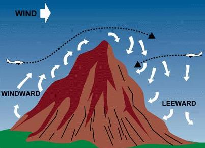

**Airplanes approaching hills or mountains from windward
are helped by rising currents.
Those approaching from leeward encounter
descending currents.**

The stronger the wind, the greater the downward pressure
and the accompanying turbulence. Consequently, in approaching a hill or
mountain from the leeward side, a pilot should gain enough altitude well
in advance. Because of these downdrafts, it is recommended that mountain
ridges and peaks be cleared by at least 2,000 feet. If there is any doubt
about having adequate clearance, the pilot should turn away at once and
gain more altitude. Between hills or mountains, where there is a canyon
or narrow valley, the wind will generally veer from its normal course and
flow through the passage with increased velocity and turbulence. A pilot
flying over such terrain needs to be alert for wind shifts, and particularly
cautious if making a landing.

---

# Impacts from Turbulence and Friction on Winds

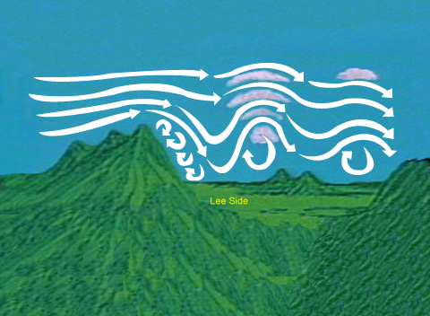
Lee waves cause updrafts and downdrafts

We'll give you a series of illustrations on how general winds are modified to
help produce surface winds. The figure above illustrates the lee slope, eddy
effects on a much larger scale. Tall mountain ranges can modify strong winds
aloft to create waves and large eddies on the lee side of the mountains. Winds
dip down due to the difference in pressure on the lee side, thus initiating wave
actions in those strong winds. Lens-shaped clouds (altocumulus lenticularus) may
develop in the tops of these waves. These clouds can easily be formed on the lee
side of mountain ranges that are perpendicular to winds of 40 knots or more. The
clouds are usually high, and the resulting winds may not be felt at the surface.
However, occasionally these strong winds aloft may dip to the surface, or eddy
winds may reverse the direction of usual winds. Depending on your location,
surface winds can be significantly modified by this process.

Friction and air turbulence generated at the surface slow low level winds.
There are two sources of turbulence--mechanical and thermal. The roughness of
surfaces, usually due to vegetative cover, causes friction and results in
mechanical turbulence. Surface heating during the day causes thermal turbulence
as heat convection currents rise from the surface and mix with the air flowing
over the surface.

Let's look at some effects of channeling and mechanical turbulence. Imagine a
general wind blowing through a pass or saddle in a mountain range. Wind
velocities might increase as they pass through the constricted area; then the
air spreads out on the lee side with probable eddy actions.

Winds on the lee sides of ridges can shift in direction and speed, making
them difficult to predict. We usually term eddy winds as gusty and erratic.

|  |  |
| --- | --- |
| 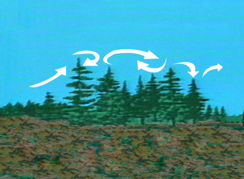 | 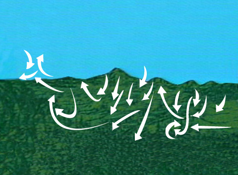 |
| Vegetation may also cause updrafts and downdrafts | Thermal turbulence caused by surface heating |

Another factor which has a great deal of effect on low level wind is thermal
turbulence caused by surface heating. (See figure above) Different land surfaces
absorb, reflect, and radiate varying amounts of heat. Warm air rises and mixes
with other air moving across the terrain. This mixing action has differing
effects on surface winds, but often makes them gusty and erratic.

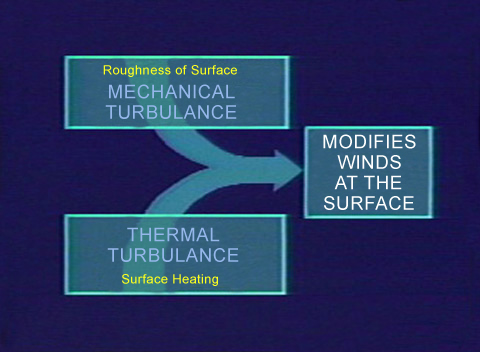
Turbulence from various sources modifies surfaces
winds

We have given you a very brief explanation of what general winds are, how
they develop, and how they are affected by terrain.
