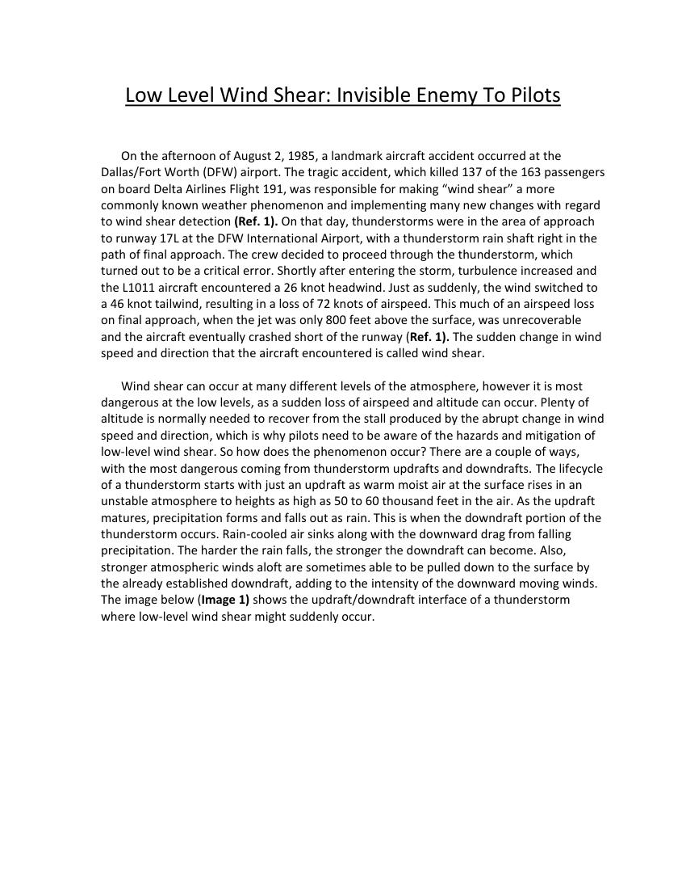
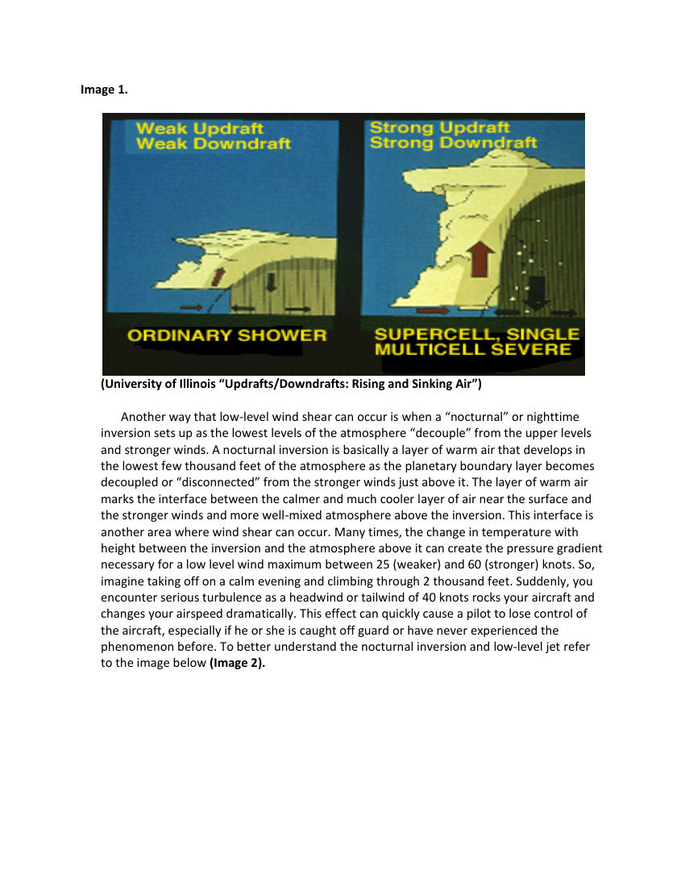
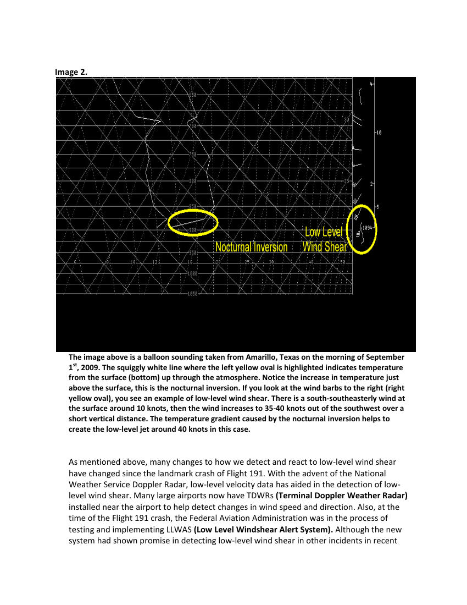
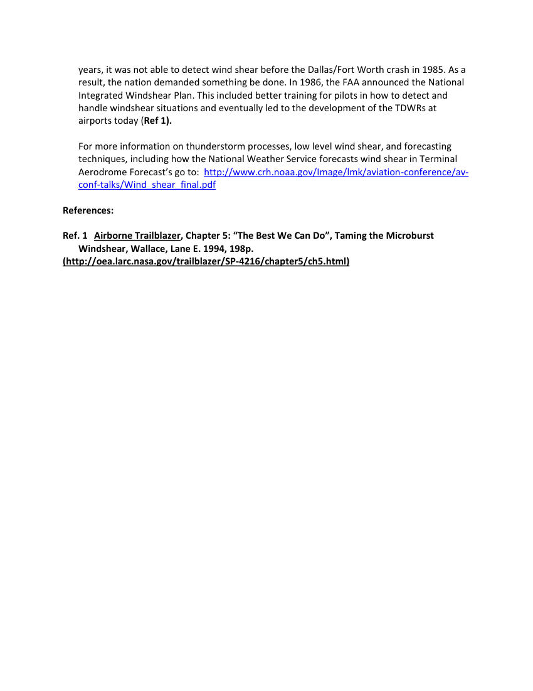

# Low Level Wind Shear - Another NWS Presentation

> Source: <http://www.weather.gov/media/zhu/ZHU_Training_Page/llws/LLWS/llws.pdf>  
> Section: Wind Shear  
> Captured: 2026-08-19 06:00 UTC  
> PDF: [low-level-wind-shear-another-nws-presentation.pdf](low-level-wind-shear-another-nws-presentation.pdf) (4 pages)

---

## Page 1

Low Level Wind Shear: Invisible Enemy To Pilots 
 
 
 
On the afternoon of August 2, 1985, a landmark aircraft accident occurred at the 
Dallas/Fort Worth (DFW) airport. The tragic accident, which killed 137 of the 163 passengers 
on board Delta Airlines Flight 191, was responsible for making “wind shear” a more 
commonly known weather phenomenon and implementing many new changes with regard 
to wind shear detection (Ref. 1). On that day, thunderstorms were in the area of approach 
to runway 17L at the DFW International Airport, with a thunderstorm rain shaft right in the 
path of final approach. The crew decided to proceed through the thunderstorm, which 
turned out to be a critical error. Shortly after entering the storm, turbulence increased and 
the L1011 aircraft encountered a 26 knot headwind. Just as suddenly, the wind switched to 
a 46 knot tailwind, resulting in a loss of 72 knots of airspeed. This much of an airspeed loss 
on final approach, when the jet was only 800 feet above the surface, was unrecoverable 
and the aircraft eventually crashed short of the runway (Ref. 1). The sudden change in wind 
speed and direction that the aircraft encountered is called wind shear. 
 
 
 
Wind shear can occur at many different levels of the atmosphere, however it is most 
dangerous at the low levels, as a sudden loss of airspeed and altitude can occur. Plenty of 
altitude is normally needed to recover from the stall produced by the abrupt change in wind 
speed and direction, which is why pilots need to be aware of the hazards and mitigation of 
low-level wind shear. So how does the phenomenon occur? There are a couple of ways, 
with the most dangerous coming from thunderstorm updrafts and downdrafts. The lifecycle 
of a thunderstorm starts with just an updraft as warm moist air at the surface rises in an 
unstable atmosphere to heights as high as 50 to 60 thousand feet in the air. As the updraft 
matures, precipitation forms and falls out as rain. This is when the downdraft portion of the 
thunderstorm occurs. Rain-cooled air sinks along with the downward drag from falling 
precipitation. The harder the rain falls, the stronger the downdraft can become. Also, 
stronger atmospheric winds aloft are sometimes able to be pulled down to the surface by 
the already established downdraft, adding to the intensity of the downward moving winds. 
The image below (Image 1) shows the updraft/downdraft interface of a thunderstorm 
where low-level wind shear might suddenly occur.

## Page 2

Image 1. 
 
 
 
 
(University of Illinois “Updrafts/Downdrafts: Rising and Sinking Air”) 
 
 
 
Another way that low-level wind shear can occur is when a “nocturnal” or nighttime 
inversion sets up as the lowest levels of the atmosphere “decouple” from the upper levels 
and stronger winds. A nocturnal inversion is basically a layer of warm air that develops in 
the lowest few thousand feet of the atmosphere as the planetary boundary layer becomes 
decoupled or “disconnected” from the stronger winds just above it. The layer of warm air 
marks the interface between the calmer and much cooler layer of air near the surface and 
the stronger winds and more well-mixed atmosphere above the inversion. This interface is 
another area where wind shear can occur. Many times, the change in temperature with 
height between the inversion and the atmosphere above it can create the pressure gradient 
necessary for a low level wind maximum between 25 (weaker) and 60 (stronger) knots. So, 
imagine taking off on a calm evening and climbing through 2 thousand feet. Suddenly, you 
encounter serious turbulence as a headwind or tailwind of 40 knots rocks your aircraft and 
changes your airspeed dramatically. This effect can quickly cause a pilot to lose control of 
the aircraft, especially if he or she is caught off guard or have never experienced the 
phenomenon before. To better understand the nocturnal inversion and low-level jet refer 
to the image below (Image 2).

## Page 3

Image 2. 
 
The image above is a balloon sounding taken from Amarillo, Texas on the morning of September 
1st, 2009. The squiggly white line where the left yellow oval is highlighted indicates temperature 
from the surface (bottom) up through the atmosphere. Notice the increase in temperature just 
above the surface, this is the nocturnal inversion. If you look at the wind barbs to the right (right 
yellow oval), you see an example of low-level wind shear. There is a south-southeasterly wind at 
the surface around 10 knots, then the wind increases to 35-40 knots out of the southwest over a 
short vertical distance. The temperature gradient caused by the nocturnal inversion helps to 
create the low-level jet around 40 knots in this case. 
 
 
 
As mentioned above, many changes to how we detect and react to low-level wind shear 
have changed since the landmark crash of Flight 191. With the advent of the National 
Weather Service Doppler Radar, low-level velocity data has aided in the detection of low- 
level wind shear. Many large airports now have TDWRs (Terminal Doppler Weather Radar) 
installed near the airport to help detect changes in wind speed and direction. Also, at the 
time of the Flight 191 crash, the Federal Aviation Administration was in the process of 
testing and implementing LLWAS (Low Level Windshear Alert System). Although the new 
system had shown promise in detecting low-level wind shear in other incidents in recent

## Page 4

years, it was not able to detect wind shear before the Dallas/Fort Worth crash in 1985. As a 
result, the nation demanded something be done. In 1986, the FAA announced the National 
Integrated Windshear Plan. This included better training for pilots in how to detect and 
handle windshear situations and eventually led to the development of the TDWRs at 
airports today (Ref 1). 
 
 
For more information on thunderstorm processes, low level wind shear, and forecasting 
techniques, including how the National Weather Service forecasts wind shear in Terminal 
Aerodrome Forecast’s go to:  http://www.crh.noaa.gov/Image/lmk/aviation-conference/av-
conf-talks/Wind_shear_final.pdf 
 
References: 
 
Ref. 1 Airborne Trailblazer, Chapter 5: “The Best We Can Do”, Taming the Microburst 
Windshear, Wallace, Lane E. 1994, 198p.  
(http://oea.larc.nasa.gov/trailblazer/SP-4216/chapter5/ch5.html)
