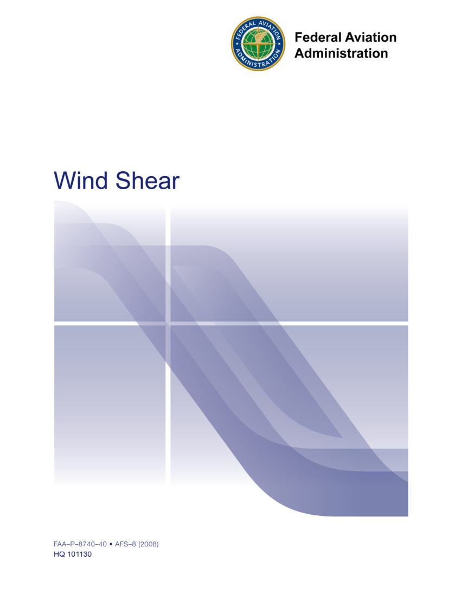
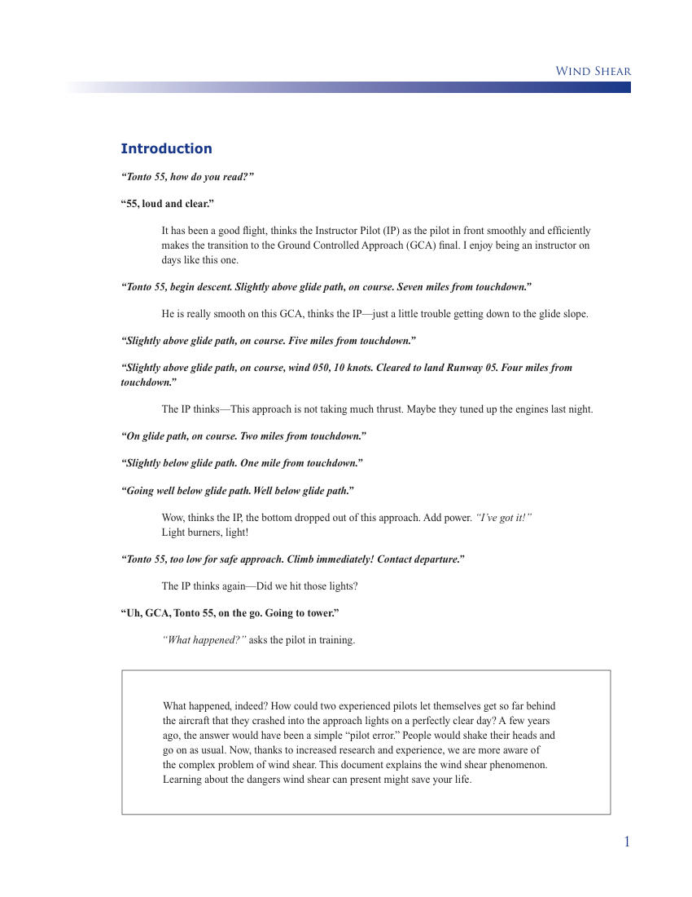
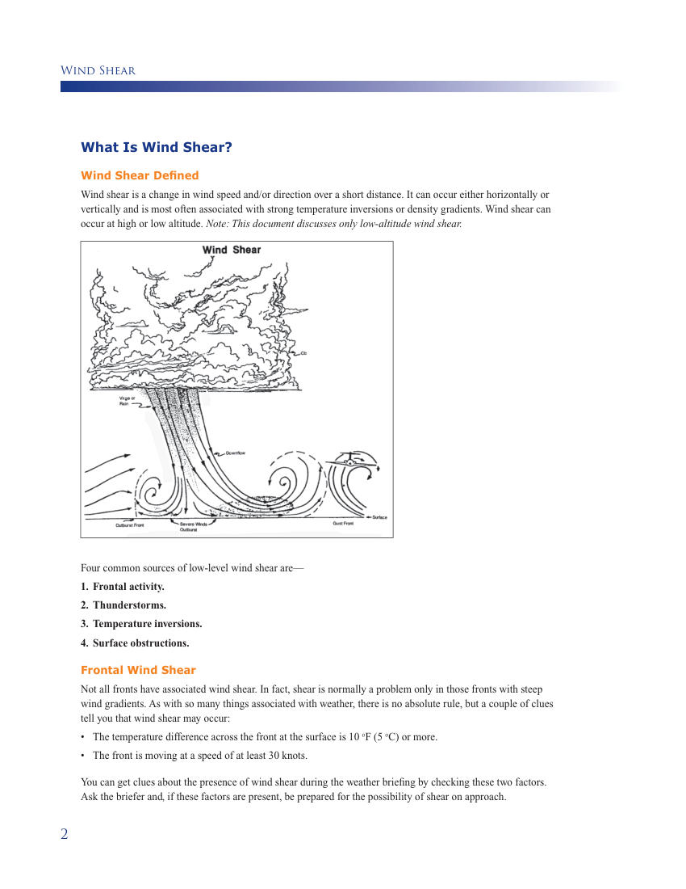
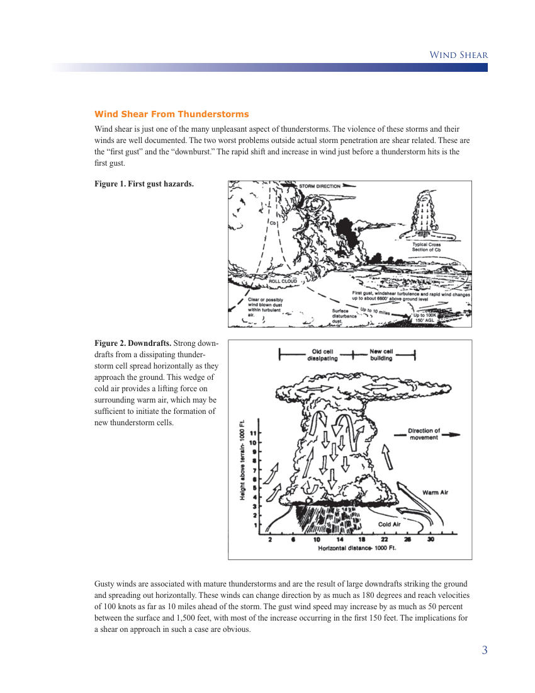
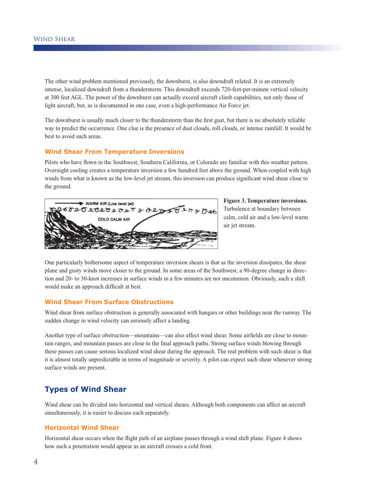
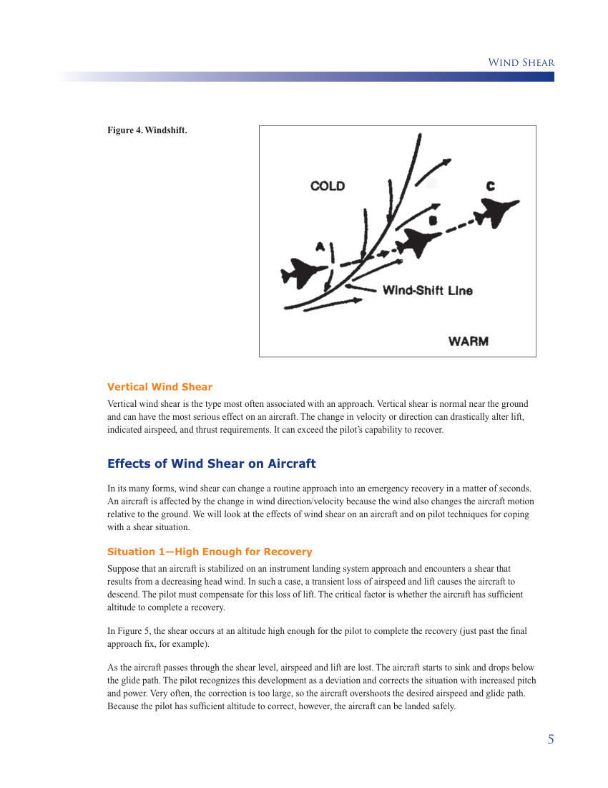
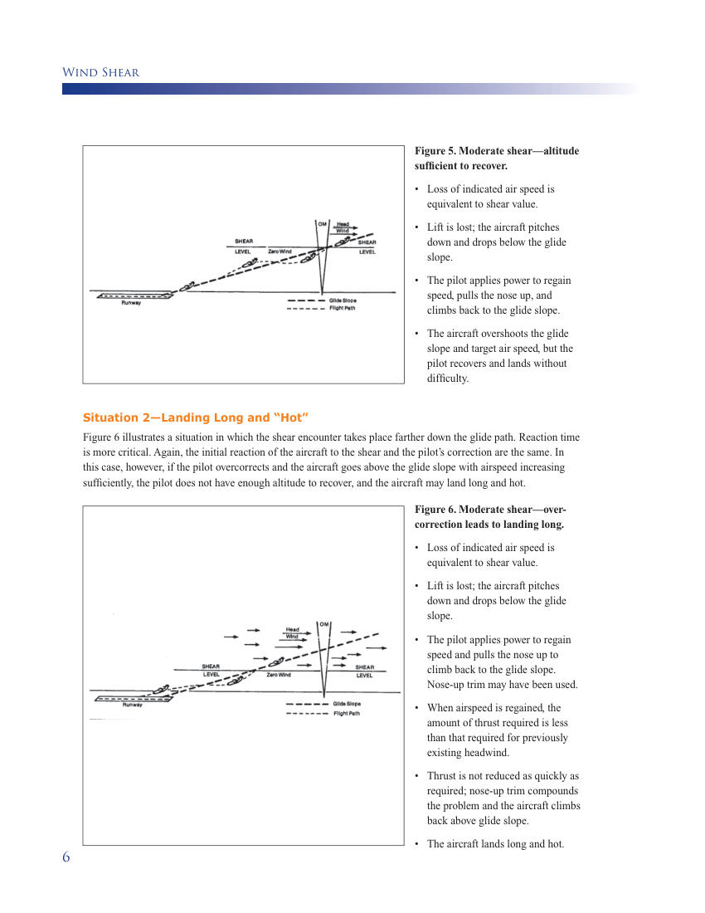
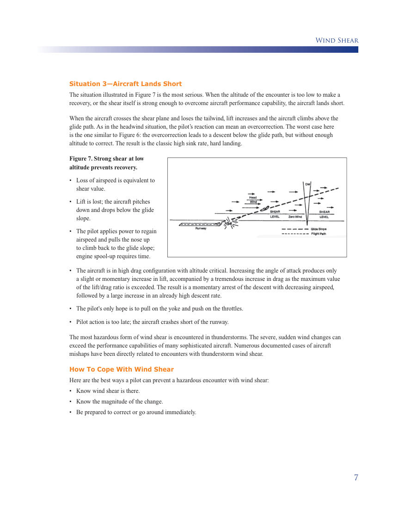
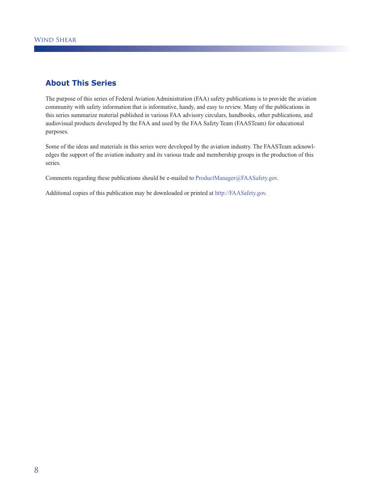

# Wind Shear - FAA Publication

> Source: <http://www.weather.gov/media/zhu/ZHU_Training_Page/llws/windshear_tutorial/FAA_Windshear.pdf>  
> Section: Wind Shear  
> Captured: 2026-08-19 06:00 UTC  
> PDF: [wind-shear-faa-publication.pdf](wind-shear-faa-publication.pdf) (12 pages)

---

## Page 1

_(no extractable text on this page — see rendered image above)_

## Page 2

_(no extractable text on this page — see rendered image above)_

## Page 3

Wind Shear
1
Introduction
“Tonto 55, how do you read?”
“55, loud and clear.”
It has been a good flight, thinks the Instructor Pilot (IP) as the pilot in front smoothly and efficiently 
makes the transition to the Ground Controlled Approach (GCA) final. I enjoy being an instructor on 
days like this one.
“Tonto 55, begin descent. Slightly above glide path, on course. Seven miles from touchdown.”
He is really smooth on this GCA, thinks the IP—just a little trouble getting down to the glide slope.
“Slightly above glide path, on course. Five miles from touchdown.”
“Slightly above glide path, on course, wind 050, 10 knots. Cleared to land Runway 05. Four miles from 
touchdown.”
The IP thinks—This approach is not taking much thrust. Maybe they tuned up the engines last night.
“On glide path, on course. Two miles from touchdown.”
“Slightly below glide path. One mile from touchdown.”
“Going well below glide path. Well below glide path.”
Wow, thinks the IP, the bottom dropped out of this approach. Add power. “I’ve got it!” 	
	
Light burners, light!
“Tonto 55, too low for safe approach. Climb immediately! Contact departure.”
The IP thinks again—Did we hit those lights?
“Uh, GCA, Tonto 55, on the go. Going to tower.”
“What happened?” asks the pilot in training.
What happened, indeed? How could two experienced pilots let themselves get so far behind 
the aircraft that they crashed into the approach lights on a perfectly clear day? A few years 
ago, the answer would have been a simple “pilot error.” People would shake their heads and 
go on as usual. Now, thanks to increased research and experience, we are more aware of 
the complex problem of wind shear. This document explains the wind shear phenomenon. 
Learning about the dangers wind shear can present might save your life.

## Page 4

Wind Shear
2
What Is Wind Shear?
Wind Shear Defined
Wind shear is a change in wind speed and/or direction over a short distance. It can occur either horizontally or 
vertically and is most often associated with strong temperature inversions or density gradients. Wind shear can 
occur at high or low altitude. Note: This document discusses only low-altitude wind shear.
Four common sources of low-level wind shear are—
1.	 Frontal activity.
2.	 Thunderstorms.
3.	 Temperature inversions.
4.	 Surface obstructions.
Frontal Wind Shear
Not all fronts have associated wind shear. In fact, shear is normally a problem only in those fronts with steep 
wind gradients. As with so many things associated with weather, there is no absolute rule, but a couple of clues 
tell you that wind shear may occur:
•	 The temperature difference across the front at the surface is 10 oF (5 oC) or more.
•	 The front is moving at a speed of at least 30 knots.
You can get clues about the presence of wind shear during the weather briefing by checking these two factors. 
Ask the briefer and, if these factors are present, be prepared for the possibility of shear on approach.

## Page 5

Wind Shear
3
Wind Shear From Thunderstorms
Wind shear is just one of the many unpleasant aspect of thunderstorms. The violence of these storms and their 
winds are well documented. The two worst problems outside actual storm penetration are shear related. These are 
the “first gust” and the “downburst.” The rapid shift and increase in wind just before a thunderstorm hits is the 
first gust. 
Figure 1. First gust hazards. 
Figure 2. Downdrafts. Strong down-
drafts from a dissipating thunder-
storm cell spread horizontally as they 
approach the ground. This wedge of 
cold air provides a lifting force on 
surrounding warm air, which may be 
sufficient to initiate the formation of 
new thunderstorm cells.
Gusty winds are associated with mature thunderstorms and are the result of large downdrafts striking the ground 
and spreading out horizontally. These winds can change direction by as much as 180 degrees and reach velocities 
of 100 knots as far as 10 miles ahead of the storm. The gust wind speed may increase by as much as 50 percent 
between the surface and 1,500 feet, with most of the increase occurring in the first 150 feet. The implications for 
a shear on approach in such a case are obvious.

## Page 6

Wind Shear
4
The other wind problem mentioned previously, the downburst, is also downdraft related. It is an extremely 
intense, localized downdraft from a thunderstorm. This downdraft exceeds 720-feet-per-minute vertical velocity 
at 300 feet AGL. The power of the downburst can actually exceed aircraft climb capabilities, not only those of 
light aircraft, but, as is documented in one case, even a high-performance Air Force jet. 
The downburst is usually much closer to the thunderstorm than the first gust, but there is no absolutely reliable 
way to predict the occurrence. One clue is the presence of dust clouds, roll clouds, or intense rainfall. It would be 
best to avoid such areas.
Wind Shear From Temperature Inversions
Pilots who have flown in the Southwest, Southern California, or Colorado are familiar with this weather pattern. 
Overnight cooling creates a temperature inversion a few hundred feet above the ground. When coupled with high 
winds from what is known as the low-level jet stream, this inversion can produce significant wind shear close to 
the ground. 
Figure 3. Temperature inversions. 
Turbulence at boundary between 
calm, cold air and a low-level warm 
air jet stream.
One particularly bothersome aspect of temperature inversion shears is that as the inversion dissipates, the shear 
plane and gusty winds move closer to the ground. In some areas of the Southwest, a 90-degree change in direc-
tion and 20- to 30-knot increases in surface winds in a few minutes are not uncommon. Obviously, such a shift 
would make an approach difficult at best. 
Wind Shear From Surface Obstructions
Wind shear from surface obstruction is generally associated with hangars or other buildings near the runway. The 
sudden change in wind velocity can seriously affect a landing.
Another type of surface obstruction—mountains—can also affect wind shear. Some airfields are close to moun-
tain ranges, and mountain passes are close to the final approach paths. Strong surface winds blowing through 
these passes can cause serious localized wind shear during the approach. The real problem with such shear is that 
it is almost totally unpredictable in terms of magnitude or severity. A pilot can expect such shear whenever strong 
surface winds are present.
Types of Wind Shear
Wind shear can be divided into horizontal and vertical shears. Although both components can affect an aircraft 
simultaneously, it is easier to discuss each separately. 
Horizontal Wind Shear
Horizontal shear occurs when the flight path of an airplane passes through a wind shift plane. Figure 4 shows 
how such a penetration would appear as an aircraft crosses a cold front.

## Page 7

Wind Shear
5
Figure 4. Windshift.
Vertical Wind Shear
Vertical wind shear is the type most often associated with an approach. Vertical shear is normal near the ground 
and can have the most serious effect on an aircraft. The change in velocity or direction can drastically alter lift, 
indicated airspeed, and thrust requirements. It can exceed the pilot’s capability to recover. 
Effects of Wind Shear on Aircraft
In its many forms, wind shear can change a routine approach into an emergency recovery in a matter of seconds. 
An aircraft is affected by the change in wind direction/velocity because the wind also changes the aircraft motion 
relative to the ground. We will look at the effects of wind shear on an aircraft and on pilot techniques for coping 
with a shear situation. 
Situation 1—High Enough for Recovery
Suppose that an aircraft is stabilized on an instrument landing system approach and encounters a shear that 
results from a decreasing head wind. In such a case, a transient loss of airspeed and lift causes the aircraft to 
descend. The pilot must compensate for this loss of lift. The critical factor is whether the aircraft has sufficient 
altitude to complete a recovery.
In Figure 5, the shear occurs at an altitude high enough for the pilot to complete the recovery (just past the final 
approach fix, for example). 
As the aircraft passes through the shear level, airspeed and lift are lost. The aircraft starts to sink and drops below 
the glide path. The pilot recognizes this development as a deviation and corrects the situation with increased pitch 
and power. Very often, the correction is too large, so the aircraft overshoots the desired airspeed and glide path. 
Because the pilot has sufficient altitude to correct, however, the aircraft can be landed safely.

## Page 8

Wind Shear
6
Figure 5. Moderate shear—altitude 
sufficient to recover.
•	 Loss of indicated air speed is 
equivalent to shear value.
•	 Lift is lost; the aircraft pitches 
down and drops below the glide 
slope.
•	 The pilot applies power to regain 
speed, pulls the nose up, and 
climbs back to the glide slope.
•	 The aircraft overshoots the glide 
slope and target air speed, but the 
pilot recovers and lands without 
difficulty.
Figure 6. Moderate shear—over-
correction leads to landing long.
•	 Loss of indicated air speed is 
equivalent to shear value.
•	 Lift is lost; the aircraft pitches 
down and drops below the glide 
slope.
•	 The pilot applies power to regain 
speed and pulls the nose up to 
climb back to the glide slope. 
Nose-up trim may have been used.
•	 When airspeed is regained, the 
amount of thrust required is less 
than that required for previously 
existing headwind.
•	 Thrust is not reduced as quickly as 
required; nose-up trim compounds 
the problem and the aircraft climbs 
back above glide slope.
•	 The aircraft lands long and hot.
Situation 2—Landing Long and “Hot”
Figure 6 illustrates a situation in which the shear encounter takes place farther down the glide path. Reaction time 
is more critical. Again, the initial reaction of the aircraft to the shear and the pilot’s correction are the same. In 
this case, however, if the pilot overcorrects and the aircraft goes above the glide slope with airspeed increasing 
sufficiently, the pilot does not have enough altitude to recover, and the aircraft may land long and hot.

## Page 9

Wind Shear
7
Situation 3—Aircraft Lands Short
The situation illustrated in Figure 7 is the most serious. When the altitude of the encounter is too low to make a 
recovery, or the shear itself is strong enough to overcome aircraft performance capability, the aircraft lands short. 
When the aircraft crosses the shear plane and loses the tailwind, lift increases and the aircraft climbs above the 
glide path. As in the headwind situation, the pilot’s reaction can mean an overcorrection. The worst case here 
is the one similar to Figure 6: the overcorrection leads to a descent below the glide path, but without enough 
altitude to correct. The result is the classic high sink rate, hard landing. 
Figure 7. Strong shear at low 
altitude prevents recovery.
•	 Loss of airspeed is equivalent to 
shear value.
•	 Lift is lost; the aircraft pitches 
down and drops below the glide 
slope.
•	 The pilot applies power to regain 
airspeed and pulls the nose up 
to climb back to the glide slope; 
engine spool-up requires time.
•	 The aircraft is in high drag configuration with altitude critical. Increasing the angle of attack produces only 
a slight or momentary increase in lift, accompanied by a tremendous increase in drag as the maximum value 
of the lift/drag ratio is exceeded. The result is a momentary arrest of the descent with decreasing airspeed, 
followed by a large increase in an already high descent rate.
•	 The pilot's only hope is to pull on the yoke and push on the throttles.
•	 Pilot action is too late; the aircraft crashes short of the runway.
The most hazardous form of wind shear is encountered in thunderstorms. The severe, sudden wind changes can 
exceed the performance capabilities of many sophisticated aircraft. Numerous documented cases of aircraft 
mishaps have been directly related to encounters with thunderstorm wind shear. 
How To Cope With Wind Shear
Here are the best ways a pilot can prevent a hazardous encounter with wind shear: 
•	 Know wind shear is there.
•	 Know the magnitude of the change. 
•	 Be prepared to correct or go around immediately.

## Page 10

Wind Shear
8
About This Series
The purpose of this series of Federal Aviation Administration (FAA) safety publications is to provide the aviation 
community with safety information that is informative, handy, and easy to review. Many of the publications in 
this series summarize material published in various FAA advisory circulars, handbooks, other publications, and 
audiovisual products developed by the FAA and used by the FAA Safety Team (FAASTeam) for educational 
purposes.
Some of the ideas and materials in this series were developed by the aviation industry. The FAASTeam acknowl-
edges the support of the aviation industry and its various trade and membership groups in the production of this 
series.
Comments regarding these publications should be e-mailed to ProductManager@FAASafety.gov.
Additional copies of this publication may be downloaded or printed at http://FAASafety.gov.

## Page 11

_(no extractable text on this page — see rendered image above)_

## Page 12

_(no extractable text on this page — see rendered image above)_
