# Wind Shear - The Definitive Edition

> Source: <http://www.weather.gov/media/zhu/ZHU_Training_Page/llws/windshear_tutorial/windshear_tutorial.pdf>  
> Section: Wind Shear  
> Captured: 2026-08-19 06:00 UTC  
> PDF: [wind-shear-the-definitive-edition.pdf](wind-shear-the-definitive-edition.pdf) (13 pages)

---

## Page 1

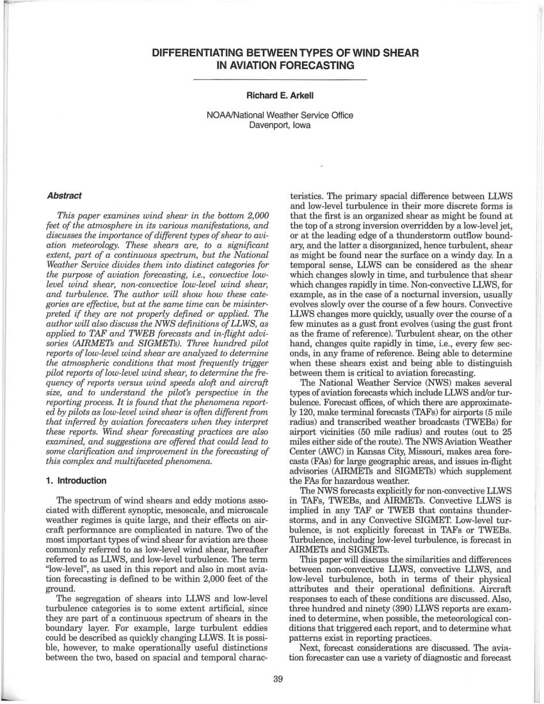

DIFFERENTIATING BETWEEN TYPES OF WIND SHEAR 
IN AVIATION FORECASTING 
Richard E. Arkell 
NOAA/National Weather Service Office 
Davenport, Iowa 
Abstract 
This paper examines wind shear in the bottom 2,000 
feet of the atmosphere in its various manifestations, and 
discusses the importance of different types of shear to avi-
ation meteorology. These shears are, to a significant 
extent, part of a continuous spectrum, but the National 
Weather Service divides them into distinct categories for 
the purpose of aviation forecasting, i.e., convective low-
level wind shear, non-convective low-level wind shear, 
and turbulence. The author will show how these cate-
gories are effective, but at the same time can be misinter-
preted if they are not properly defined or applied. The 
author will also discuss the NWS definitions of LLWS, as 
applied to TAF and TWEB forecasts and in-flight advi-
sories (AiRMETs and SIGMETs). Three hundred pilot 
reports of low-level wind shear are analyzed to determine 
the atmospheric conditions that most frequently trigger 
pilot reports of low-level wind shear, to determine the fre-
quency of reports versus wind speeds aloft and aircraft 
size, and to understand the pilot's perspective in the 
reporting process. It is found that the phenomena report-
ed by pilots as low-level wind shear is often different from 
that inferred by aviation forecasters when they interpret 
these reports. Wind shear forecasting practices are also 
examined, and suggestions are offered that could lead to 
some clarification and improvement in the forecasting of 
this complex and multifaceted phenomena. 
1. Introduction 
The spectrum of wind shears and eddy motions asso-
ciated with different synoptic, mesoscale, and microscale 
weather regimes is quite large, and their effects on air-
craft performance are complicated in nature. Two of the 
most important types of wind shear for aviation are those 
commonly referred to as low-level wind shear, hereafter 
referred to as LLWS, and low-level turbulence. The term 
"low-level", as used in this report and also in most avia-
tion forecasting is defined to be within 2,000 feet of the 
ground. 
The segregation of shears into LLWS and low-level 
turbulence categories is to some extent artificial, since 
they are part of a continuous spectrum of shears in the 
boundary layer. For example, large turbulent eddies 
could be described as quickly changing LLWS. It is possi-
ble, however, to make operationally useful distinctions 
between the two, based on spacial and temporal charac-
39 
teristics. The primary spacial difference between LLWS 
and low-level turbulence in their more discrete forms is 
that the first is an organized shear as might be found at 
the top of a strong inversion overridden by a low-level jet, 
or at the leading edge of a thunderstorm outflow bound-
ary, and the latter a disorganized, hence turbulent, shear 
as might be found near the surface on a windy day. In a 
temporal sense, LLWS can be considered as the shear 
which changes slowly in time, and turbulence that shear 
which changes rapidly in time. Non-convective LLWS, for 
example, as in the case of a nocturnal inversion, usually 
evolves slowly over the course of a few hours. Convective 
LLWS changes more quickly, usually over the course of a 
few minutes as a gust front evolves (using the gust front 
as the frame of reference). Turbulent shear, on the other 
hand, changes quite rapidly in time, i.e., every few sec-
onds, in any frame of reference. Being able to determine 
when these shears exist and being able to distinguish 
between them is critical to aviation forecasting. 
The National Weather Service (NWS) makes several 
types of aviation forecasts which include LLWS and/or tur-
bulence. Forecast offices, of which there are approximate-
ly 120, make terminal forecasts (TAFs) for airports (5 mile 
radius) and transcribed weather broadcasts (TWEBs) for 
airport vicinities (50 mile radius) and routes (out to 25 
miles either side ofthe route). The NWS Aviation Weather 
Center (AWC) in Kansas City, Missouri, makes area fore-
casts (FAs) for large geographic areas, and issues in-flight 
advisories (AlRMETs and SIGMETs) which supplement 
the FAs for hazardous weather. 
The NWS forecasts explicitly for non-convective LLWS 
in TAFs, TWEBs, and AIRMETs. Convective LLWS is 
implied in any TAF or TWEB that contains thunder-
storms, and in any Convective SIGMET. Low-level tur-
bulence, is not explicitly forecast in TAFs or TWEBs. 
Turbulence, including low-level turbulence, is forecast in 
AIRMETs and SIGMETs. 
This paper will discuss the similarities and differences 
between non-convective LLWS, convective LLWS, and 
low-level turbulence, both in terms of their physical 
attributes and their operational definitions. Aircraft 
responses to each of these conditions are discussed. Also, 
three hundred and ninety (390) LLWS reports are exam-
ined to determine, when possible, the meteorological con-
ditions that triggered each report, and to determine what 
patterns exist in reporting practices. 
Next, forecast considerations are discussed. The avia-
tion forecaster can use a variety of diagnostic and forecast 
1\1 
'I 
Il

## Page 2

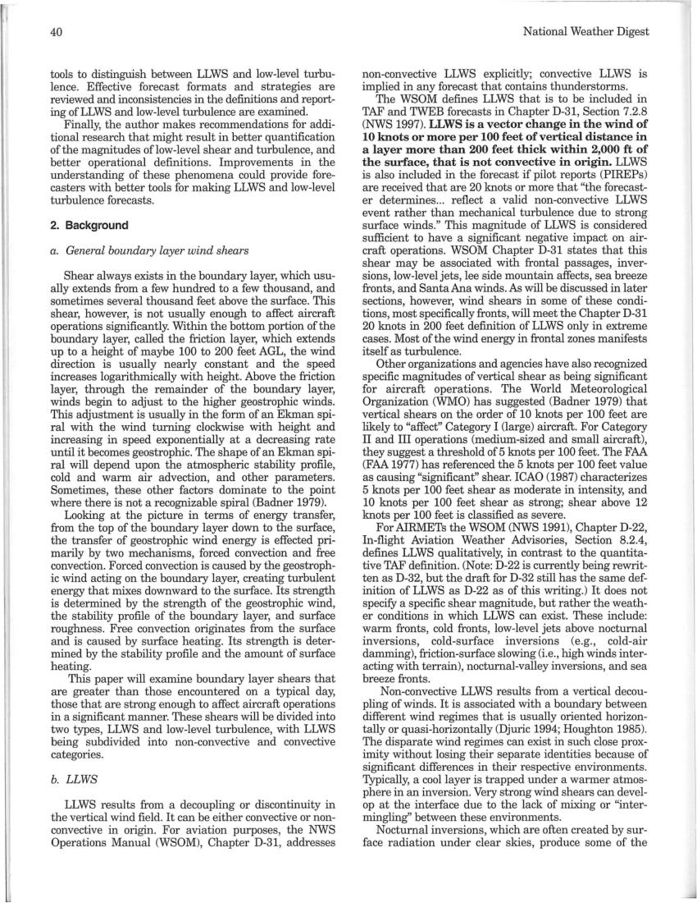

I. 
40 
tools to distinguish between LLWS and low-level turbu-
lence. Effective forecast formats and strategies are 
reviewed and inconsistencies in the definitions and report-
ing ofLLWS and low-level turbulence are examined. 
Finally, the author makes recommendations for addi-
tional research that might result in better quantification 
ofthe magnitudes oflow-Ievel shear and turbulence, and 
better operational definitions. Improvements in the 
understanding of these phenomena could provide fore-
casters with better tools for making LLWS and low-level 
turbulence forecasts. 
2. Background 
a. General boundary layer wind shears 
Shear always exists in the boundary layer, which usu-
ally extends from a few hundred to a few thousand, and 
sometimes several thousand feet above the surface. This 
shear, however, is not usually enough to affect aircraft 
operations significantly. Within the bottom portion of the 
boundary layer, called the friction layer, which extends 
up to a height of maybe 100 to 200 feet AGL, the wind 
direction is usually nearly constant and the speed 
increases logarithmically with height. Above the friction 
layer, through the remainder of the boundary layer, 
winds begin to adjust to the higher geostrophic winds. 
This adjustment is usually in the form of an Ekman spi-
ral with the wind turning clockwise with height and 
increasing in speed exponentially at a decreasing rate 
until it becomes geostrophic. The shape of an Ekman spi-
ral will depend upon the atmospheric stability profile, 
cold and warm air advection, and other parameters. 
Sometimes, these other factors dominate to the point 
where there is not a recognizable spiral (Badner 1979). 
Looking at the picture in terms of energy transfer, 
from the top of the boundary layer down to the surface, 
the transfer of geostrophic wind energy is effected pri-
marily by two mechanisms, forced convection and free 
convection. Forced convection is caused by the geostroph-
ic wind acting on the boundary layer, creating turbulent 
energy that mixes downward to the surface. Its strength 
is determined by the strength of the geostrophic wind, 
the stability profile of the boundary layer, and surface 
roughness. Free convection originates from the surface 
and is caused by surface heating. Its strength is deter-
mined by the stability profile and the amount of surface 
heating. 
This paper will examine boundary layer shears that 
are greater than those encountered on a typical day, 
those that are strong enough to affect aircraft operations 
in a significant manner. These shears will be divided into 
two types, LLWS and low-level turbulence, with LLWS 
being subdivided into non-convective and convective 
categories. 
b. LLWS 
LLWS results from a decoupling or discontinuity in 
the vertical wind field. It can be either convective or non-
convective in origin. For aviation purposes, the NWS 
Operations Manual (WSOM), Chapter D-31, addresses 
National Weather Digest 
non-convective LLWS explicitly; convective LLWS is 
implied in any forecast that contains thunderstorms. 
The WSOM defines LLWS that is to be included in 
TAF and TWEB forecasts in Chapter D-31, Section 7.2.8 
(NWS 1997). LLWS is a vector change in the wind of 
10 knots or more per 100 feet of vertical distance in 
a layer more than 200 feet thick within 2,000 ft of 
the surface, that is not convective in origin. LLWS 
is also included in the forecast if pilot reports (PIREPs) 
are received that are 20 knots or more that "the forecast-
er determines... reflect a valid non-convective LLWS 
event rather than mechanical turbulence due to strong 
surface winds." This magnitude of LLWS is considered 
sufficient to have a significant negative impact on air-
craft operations. WSOM Chapter D-31 states that this 
shear may be associated with frontal passages, inver-
sions, low-level jets, lee side mountain affects, sea breeze 
fronts, and Santa Ana winds. As will be discussed in later 
sections, however, wind shears in some of these condi-
tions, most specifically fronts, will meet the Chapter D-31 
20 knots in 200 feet definition of LLWS only in extreme 
cases. Most of the wind energy in frontal zones manifests 
itself as turbulence. 
Other organizations and agencies have also recognized 
specific magnitudes of vertical shear as being significant 
for aircraft operations. The World Meteorological 
Organization (WMO) has suggested CBadner 1979) that 
vertical shears on the order of 10 knots per 100 feet are 
likely to "affect" Category I (large) aircraft. For Category 
II and III operations (medium-sized and small aircraft), 
they suggest a threshold of5 knots per 100 feet. The FAA 
(FAA 1977) has referenced the 5 knots per 100 feet value 
as causing "significant" shear. ICAO (1987) characterizes 
5 knots per 100 feet shear as moderate in intensity, and 
10 knots per 100 feet shear as strong; shear above 12 
knots per 100 feet is classified as severe. 
For AIRMETs the WSOM (NWS 1991), Chapter D-22, 
In-flight Aviation Weather Advisories, Section 8.2.4, 
defines LLWS qualitatively, in contrast to the quantita-
tive TAF definition. (Note: D-22 is currently being rewrit-
ten as D-32, but the draft for D-32 still has the same def-
inition of LLWS as D-22 as of this writing.) It does not 
specifY a specific shear magnitude, but rather the weath-
er conditions in which LLWS can exist. These include: 
warm fronts, cold fronts, low-level jets above nocturnal 
inversions, cold-surface inversions (e.g., cold-air 
damming), friction-surface slowing (i.e., high winds inter-
acting with terrain), nocturnal-valley inversions, and sea 
breeze fronts. 
Non-convective LLWS results from a vertical decou-
pIing of winds. It is associated with a boundary between 
different wind regimes that is usually oriented horizon-
tally or quasi-horizontally (Djuric 1994; Houghton 1985). 
The disparate wind regimes can exist in such close prox-
imity without losing their separate identities because of 
significant differences in their respective environments. 
Typically, a cool layer is trapped under a wanner atmos-
phere in an inversion. Very strong wind shears can devel-
op at the interface due to the lack of mixing or "inter-
mingling" between these environments. 
Nocturnal inversions, which are often created by sur-
face radiation under clear skies, produce some of the

## Page 3

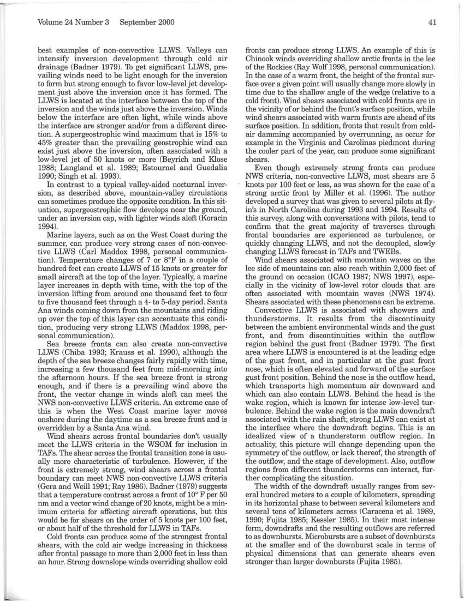

Volume 24 Number 3 
September 2000 
best examples of non-convective LLWS. Valleys can 
intensify inversion development through cold air 
drainage (Badner 1979). To get significant LLWS, pre-
vailing winds need to be light enough for the inversion 
to form but strong enough to favor low-level jet develop-
ment just above the inversion once it has formed. The 
LLWS is located at the interface between the top of the 
inversion and the winds just above the inversion. Winds 
below the interface are often light, while winds above 
the interface are stronger and/or from a different direc-
tion. A supergeostrophic wind maximum that is 15% to 
45% greater than the prevailing geostrophic wind can 
exist just above the inversion, often associated with a 
low-level jet of 50 !mots or more (Beyrich and Klose 
1988; Langland et al. 1989; Estournel and Guedalia 
1990; Singh et al. 1993). 
In contrast to a typical valley-aided nocturnal inver-
sion, as described above, mountain-valley circulations 
can sometimes produce the opposite condition. In this sit-
uation, supergeostrophic flow develops near the ground, 
under an inversion cap, with lighter winds aloft (Koracin 
1994). 
Marine layers, such as on the West Coast during the 
summer, can produce very strong cases of non-convec-
tive LLWS (Carl Maddox 1998, personal communica-
tion). Temperature changes of 7 or 8°F in a couple of 
hundred feet can create LLWS of 15 !mots or greater for 
small aircraft at the top of the layer. Typically, a marine 
layer increases in depth with time, with the top of the 
inversion lifting from around one thousand feet to four 
to five thousand feet through a 4- to 5-day period. Santa 
Ana winds coming down from the mountains and riding 
up over the top of this layer can accentuate this condi-
tion, producing very strong LLWS (Maddox 1998, per-
sonal communication). 
Sea breeze fronts can also create non-convective 
LLWS (Chiba 1993; Krauss et al. 1990), although the 
depth of the sea breeze changes fairly rapidly with time, 
increasing a few thousand feet from mid-morning into 
the afternoon hours. If the sea breeze front is strong 
enough, and if there is a prevailing wind above the 
front, the vector change in winds aloft can meet the 
NWS non-convective LLWS criteria. An extreme case of 
this is when the West Coast marine layer moves 
onshore during the daytime as a sea breeze front and is 
overridden by a Santa Ana wind. 
Wind shears across frontal boundaries don't usually 
meet the LLWS criteria in the WSOM for inclusion in 
TAFs. The shear across the frontal transition zone is usu-
ally more characteristic of turbulence. However, if the 
front is extremely strong, wind shears across a frontal 
boundary can meet NWS non-convective LLWS criteria 
(Gera and Weill 1991; Ray 1986). Badner (1979) suggests 
that a temperature contrast across a front of 10° F per 50 
nm and a vector wind change of 20 !mots, might be a min-
imum criteria for affecting aircraft operations, but this 
would be for shears on the order of 5 !mots per 100 feet, 
or about half of the threshold for LLWS in TAFs. 
Cold fronts can produce some of the strongest frontal 
shears, with the cold air wedge increasing in thic!mess 
after frontal passage to more than 2,000 feet in less than 
an hour. Strong downslope winds overriding shallow cold 
41 
fronts can produce strong LLWS. An example of this is 
Chinook winds overriding shallow arctic fronts in the lee 
of the Rockies (Ray Wolf 1998, personal communication). 
In the case of a warm front, the height of the frontal sur-
face over a given point will usually change more slowly in 
time due to the shallow angle of the wedge (relative to a 
cold front). Wind shears associated with cold fronts are in 
the vicinity of or behind the front's surface position, while 
wind shears associated with warm fronts are ahead of its 
surface position. In addition, fronts that result from cold-
air damming accompanied by overrunning, as occur for 
exampl~ in the Virginia and Carolinas piedmont during 
the cooler part of the year, can produce some significant 
shears. 
Even though extremely strong fronts can produce 
NWS criteria, non-convective LLWS, most shears are 5 
!mots per 100 feet or less, as was shown for the case of a 
strong arctic front by Miller et al. (1996). The author 
developed a survey that was given to several pilots at fly-
in's in North Carolina during 1993 and 1994. Results of 
this survey, along with conversations with pilots, tend to 
confirm that the great majority of traverses through 
frontal boundaries are experienced as turbulence, or 
quickly changing LLWS, and not the decoupled, slowly 
changing LLWS forecast in TAFs and TWEBs. 
Wind shears associated with mountain waves on the 
lee side of mountains can also reach within 2,000 feet of 
the ground on occasion (ICAO 1987; NWS 1997), espe-
cially in the vicinity of low-level rotor clouds that are 
often associated with mountain waves (NWS 1974). 
Shears associated with these phenomena can be extreme. 
Convective LLWS is associated with showers and 
thunderstorms. It results from the discontinuity 
between the ambient environmental winds and the gust 
front, and from discontinuities within the outflow 
region behind the gust front (Badner 1979). The first 
area where LLWS is encountered is at the leading edge 
of the gust front, and in particular at the gust front 
nose, which is often elevated and forward of the surface 
gust front position. Behind the nose is the outflow head, 
which transports high momentum air downward and 
which can also contain LLWS. Behind the head is the 
wake region, which is !mown for intense low-level tur-
bulence. Behind the wake region is the main downdraft 
associated with the rain shaft; strong LLWS can exist at 
the interface where the downdraft begins. This is an 
idealized view of a thunderstorm outflow region. In 
actuality, this picture will change depending upon the 
symmetry of the outflow, or lack thereof, the strength of 
the outflow, and the stage of development. Also, outflow 
regions from different thunderstorms can interact, fur-
ther complicating the situation. 
The width of the downdraft usually ranges from sev-
eral hundred meters to a couple of kilometers, spreading 
in its horizontal phase to between several kilometers and 
several tens of kilometers across (Caracena et al. 1989, 
1990; Fujita 1985; Kessler 1985). In their most intense 
form, downdrafts and the resulting outflows are referred 
to as downbursts. Microbursts are a subset of downbursts 
at the smaller end of the downburst scale in terms of 
physical dimensions that can generate shears even 
stronger than larger downbursts (Fujita 1985).

## Page 4

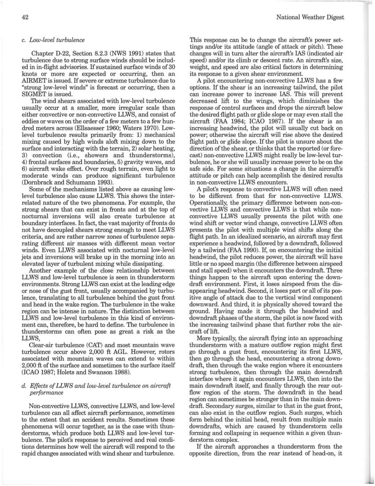

42 
c. Low-level turbulence 
Chapter D-22, Section 8.2.3 (NWS 1991) states that 
turbulence due to strong surface winds should be includ-
ed in in-flight advisories. If sustained surface winds of 30 
knots or more are expected or occurring, then an 
AIRMET is issued. If severe or extreme turbulence due to 
"strong low-level winds" is forecast or occurring, then a 
SIGMET is issued. 
The wind shears associated with low-level turbulence 
usually occur at a smaller, more irregular scale than 
either convective or non-convective LLWS, and consist of 
eddies or waves on the order of a few meters to a few hun-
dred meters across (Ellsaesser 1960; Waters 1970). Low-
level turbulence results primarily from: 1) mechanical 
mixing caused by high winds aloft mixing down to the 
surface and interacting with the terrain, 2) solar heating, 
3) convection (i.e., showers and thunderstorms), 
4) frontal surfaces and boundaries, 5) gravity waves, and 
6) aircraft wake effect. Over rough terrain, even light to 
moderate winds can produce significant turbulence 
(Dornbrack and Schumann 1993). 
Some of the mechanisms listed above as causing low-
level turbulence also cause LLWS. This shows the inter-
related nature of the two phenomena. For example, the 
strong shears that can exist in fronts and at the top of 
nocturnal inversions will also create turbulence at 
boundary interfaces. In fact, the vast majority of fronts do 
not have decoupled shears strong enough to meet LLWS 
criteria, and are rather narrow zones of turbulence sepa-
rating different air masses with different mean vector 
winds. Even LLWS associated with nocturnal low-level 
jets and inversions will brake up in the morning into an 
elevated layer of turbulent mixing while dissipating. 
Another example of the close relationship between 
LLWS and low-level turbulence is seen in thunderstorm 
environments. Strong LLWS can exist at the leading edge 
or nose of the gust front, usually accompanied by turbu-
lence, translating to all turbulence behind the gust front 
and head in the wake region. The turbulence in the wake 
region can be intense in nature. The distinction between 
LLWS and low-level turbulence in this kind of environ-
ment can, therefore, be hard to define. The turbulence in 
thunderstorms can often pose as great a risk as the 
LLWS, 
Clear-air turbulence (CAT) and most mountain wave 
turbulence occur above 2,000 ft AGL. However, rotors 
associated with mountain waves can extend to within 
2,000 ft of the surface and sometimes to the surface itself 
(ICAO 1987; Holets and Swanson 1988). 
d. Effects of LLWS and low-level turbulence on aircraft 
performance 
Non-convective LLWS, convective LLWS, and low-level 
turbulence can all affect aircraft performance, sometimes 
to the extent that an accident results. Sometimes these 
phenomena will occur together, as is the case with thun-
derstorms, which produce both LLWS and low-level tur-
bulence. The pilot's response to perceived and real condi-
tions determines how well the aircraft will respond to the 
rapid changes associated with wind shear and turbulence. 
National Weather Digest 
This response can be to change the aircraft's power set-
tings and/or its attitude (angle of attack or pitch). These 
changes will in tum alter the aircraft's lAS (indicated air 
speed) and/or its climb or descent rate. An aircraft's size, 
weight, and speed are also critical factors in determining 
its response to a given shear environment. 
A pilot encountering non-convective LLWS has a few 
options. If the shear is an increasing tailwind, the pilot 
can increase power to increase lAS. This will prevent 
decreased lift to the wings, which diminishes the 
response of control surfaces and drops the aircraft below 
the desired .flight path or glide slope or may even stall the 
aircraft (FAA 1984; ICAO 1987). If the shear is an 
increasing headwind, the pilot will usually cut back on 
power; otherwise the aircraft will rise above the desired 
flight path or glide slope. If the pilot is unsure about the 
direction ofthe shear, or thinks that the reported (or fore-
cast) non-convective LLWS might really be low-level tur-
bulence, he or she will usually increase power to be on the 
safe side. For some situations a change in the aircraft's 
attitude or pitch can help accomplish the desired results 
in non-convective LLWS encounters. 
A pilot's response to convective LLWS will often need 
to be different from that for non-convective LLWS. 
Operationally, the primary difference between non-con-
vective LLWS and convective LLWS is that while non-
convective LLWS usually presents the pilot with one 
wind shift or vector wind change, convective LLWS often 
presents the pilot with multiple wind shifts along the 
flight path. In an idealized scenario, an aircraft may first 
experience a headwind, followed by a downdraft, followed 
by a tailwind (FAA 1990). If, on encountering the initial 
headwind, the pilot reduces power, the aircraft will have 
little or no speed margin (the difference between airspeed 
and stall speed) when it encounters the downdraft. Three 
things happen to the aircraft upon entering the down-
draft environment. First, it loses airspeed from the dis-
appearing headwind. Second, it loses part or all of its pos-
itive angle of attack due to the vertical wind component 
downward. And third, it is physically shoved toward the 
ground. Having made it through the headwind and 
downdraft phases ofthe storm, the pilot is now faced with 
the increasing tailwind phase that further robs the air-
craft oflift. 
More typically, the aircraft flying into an approaching 
thunderstorm with a mature outflow region might first 
go through a gust front, encountering its first LLWS, 
then go through the head, encountering a strong down-
draft, then through the wake region where it encounters 
strong turbulence, then through the main downdraft 
interface where it again encounters LLWS, then into the 
main downdraft itself, and finally through the rear out-
flow region of the storm. The downdraft in the head 
region can sometimes be stronger than in the main down-
draft. Secondary surges, similar to that in the gust front, 
can also exist in the outflow region. Such surges, which 
form behind the initial head, result from multiple main 
downdrafts, which are caused by thunderstorm cells 
fonning and collapsing in sequence within a given thun-
derstorm complex. 
If the aircraft approaches a thunderstorm from the 
opposite direction, from the rear instead of head-on, it 
-

## Page 5

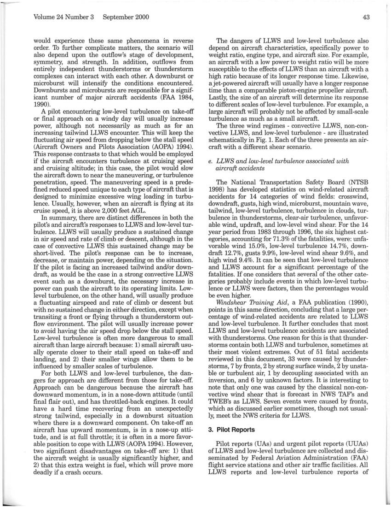

Volume 24 Number 3 
September 2000 
would experience these same phenomena in reverse 
order. To further complicate matters, the scenario will 
also depend upon the outflow's stage of development, 
symmetry, and strength. In addition, outflows from 
entirely independent thunderstorms or thunderstorm 
complexes can interact with each other. A downburst or 
microburst will intensifY the conditions encountered. 
Downbursts and microbursts are responsible for a signif-
icant number of major aircraft accidents (FAA 1984, 
1990). 
A pilot encountering low-level turbulence on take-off 
or final approach on a windy day will usually increase 
power, although not necessarily as much as for an 
increasing tailwind LLWS encounter. This will keep the 
fluctuating air speed from dropping below the stall speed 
(Aircraft Owners and Pilots Association (AOPA) 1994). 
This response contrasts to that which would be employed 
if the aircraft encounters turbulence at cruising speed 
and cruising altitude; in this case, the pilot would slow 
the aircraft down to near the maneuvering, or turbulence 
penetration, speed. The maneuvering speed is a prede-
fined reduced speed unique to each type of aircraft that is 
designed to minimize excessive wing loading in turbu-
lence. Usually, however, when an aircraft is flying at its 
cruise speed, it is above 2,000 feet AGL. 
In summary, there are distinct differences in both the 
pilot's and aircraft's responses to LLWS and low-level tur-
bulence. LLWS will usually produce a sustained change 
in air speed and rate of climb or descent, although in the 
case of convective LLWS this sustained change may be 
short-lived. The pilot's response can be to increase, 
decrease, or maintain power, depending on the situation. 
If the pilot is facing an increased tailwind and/or down-
draft, as would be the case in a strong convective LLWS 
event such as a downburst, the necessary increase in 
power can push the aircraft to its operating limits. Low-
level turbulence, on the other hand, will usually produce 
a fluctuating airspeed and rate of climb or descent but 
with no sustained change in either direction, except when 
transiting a front or flying through a thunderstorm out-
flow environment. The pilot will usually increase power 
to avoid having the air speed drop below the stall speed. 
Low-level turbulence is often more dangerous to small 
aircraft than large aircraft because: 1) small aircraft usu-
ally operate closer to their stall speed on take-off and 
landing, and 2) their smaller wings allow them to be 
influenced by smaller scales of turbulence. 
For both LLWS and low-level turbulence, the dan-
gers for approach are different from those for take-off. 
Approach can be dangerous because the aircraft has 
downward momentum, is in a nose-down attitude (until 
final flair out), and has throttled-back engines. It could 
have a hard time recovering from an unexpectedly 
strong tailwind, especially in a downburst situation 
where there is a downward component. On take-off an 
aircraft has upward momentum, is in a nose-up atti-
tude, and is at full throttle; it is often in a more favor-
able position to cope with LLWS (AOPA 1994). However, 
two significant disadvantages on take-off are: 1) that 
the aircraft weight is usually significantly higher, and 
2) that this extra weight is fuel, which will prove more 
deadly if a crash occurs. 
43 
The dangers of LLWS and low-level turbulence also 
depend on aircraft characteristics, specifically power to 
weight ratio, engine type, and aircraft size. For example, 
an aircraft with a low power to weight ratio will be more 
susceptible to the effects ofLLWS than an aircraft with a 
high ratio because of its longer response time. Likewise, 
a jet-powered aircraft will usually have a longer response 
time than a comparable piston-engine propeller aircraft. 
Lastly, the size of an aircraft will determine its response 
to different scales oflow-Ievel turbulence. For example, a 
large aircraft will probably not be affected by small-scale 
turbulence as much as a small aircraft. 
The three wind regimes - convective LLWS, non-con-
vective LLWS, and low-level turbulence - are illustrated 
schematically in Fig. 1. Each ofthe three presents an air-
craft with a different shear scenario. 
e. LLWS and low-level turbulence associated with 
aircraft accidents 
The National Transportation Safety Board (NTSB 
1998) has developed statistics on wind-related aircraft 
accidents for 14 categories of wind fields: crosswind, 
downdraft, gusts, high wind, microburst, mountain wave, 
tailwind, low-level turbulence, turbulence in clouds, tur-
bulence in thunderstorms, clear-air turbulence, unfavor-
able wind, updraft, and low-level wind shear. For the 14 
year period from 1983 through 1996, the six highest cat-
egories, accounting for 71.3% of the fatalities, were: unfa-
vorable wind 15.0%, low-level turbulence 14.7%, down-
draft 12.7%, gusts 9.9%, low-level wind shear 9.6%, and 
high wind 9.4%. It can be seen that low-level turbulence 
and LLWS account for a significant percentage of the 
fatalities. If one considers that several of the other cate-
gories probably include events in which low-level turbu-
lence or LLWS were factors, then the percentages would 
be even higher. 
Windshear Training Aid, a FAA publication (1990), 
points in this same direction, concluding that a large per-
centage of wind-related accidents are related to LLWS 
and low-level turbulence. It further concludes that most 
LLWS and low-level turbulence accidents are associated 
with thunderstorms. One reason for this is that thunder-
storms contain both LLWS and turbulence, sometimes at 
their most violent extremes. Out of 51 fatal accidents 
reviewed in this document, 33 were caused by thunder-
storms, 7 by fronts, 2 by strong surface winds, 2 by unsta-
ble or turbulent air, 1 by decoupling associated with an 
inversion, and 6 by unknown factors. It is interesting to 
note that only one was caused by the classical non-con-
vective wind shear that is forecast in NWS TAF's and 
TWEB's as LLWS. Seven events were caused by fronts, 
which as discussed earlier sometimes, though not usual-
ly, meet the NWS criteria for LLWS. 
3. Pilot Reports 
Pilot reports (VAs) and urgent pilot reports (UUAs) 
ofLLWS and low-level turbulence are collected and dis-
seminated by Federal Aviation Administration (FAA) 
flight service stations and other air traffic facilities. All 
LLWS reports and low-level turbulence reports of

## Page 6

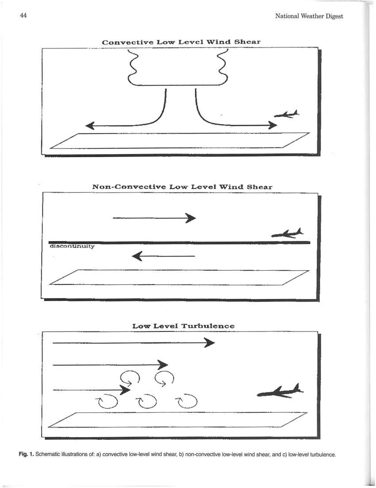

-
44 
National Weather Digest 
Convective LoW'" Level W"ind Shear 
~~---------~--~=~ 
Non-Convective Low- Level Wind Shear 
- 4!::j. 
discontinuity 
-
Low Level Turbulence 
Fig. 1. Schematic illustrations of: a) convective low-level wind shear, b) non-convective low-level wind shear, and c) low-level turbulence.

## Page 7

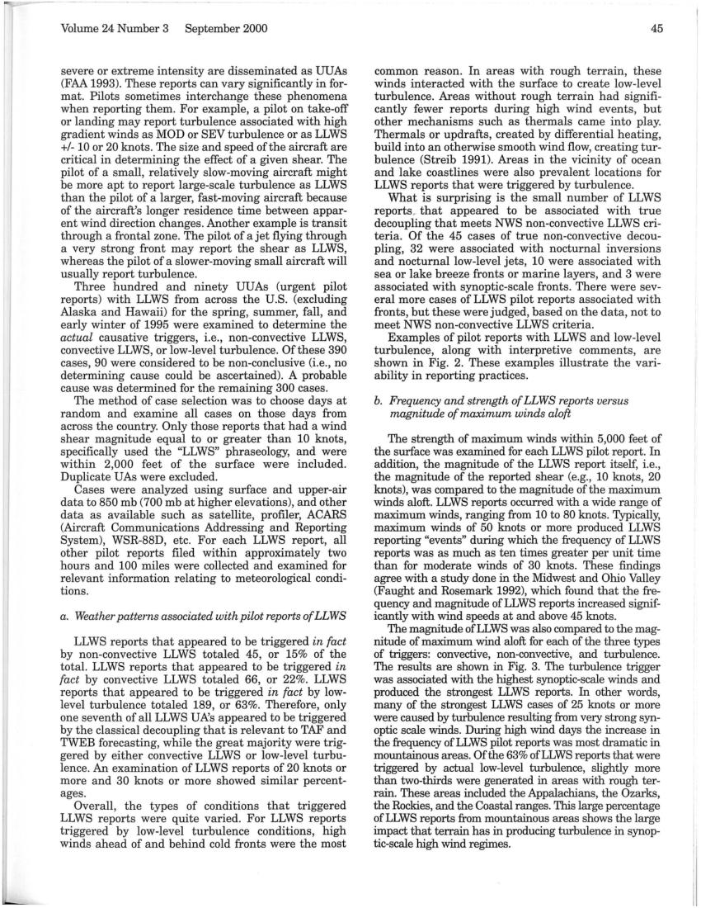

Volume 24 Number 3 
September 2000 
severe or extreme intensity are disseminated as UUAs 
(FAA 1993). These reports can vary significantly in for-
mat. Pilots sometimes interchange these phenomena 
when reporting them. For example, a pilot on take-off 
or landing may report turbulence associated with high 
gradient winds as MOD or SEV turbulence or as LLWS 
+/- 10 or 20 knots. The size and speed of the aircraft are 
critical in determining the effect of a given shear. The 
pilot of a small, relatively slow-moving aircraft might 
be more apt to report large-scale turbulence as LLWS 
than the pilot of a larger, fast-moving aircraft because 
of the aircraft's longer residence time between appar-
ent wind direction changes. Another example is transit 
through a frontal zone. The pilot of a jet flying through 
a very strong front may report the shear as LLWS, 
whereas the pilot of a slower-moving small aircraft will 
usually report turbulence. 
Three hundred and ninety VVAs (urgent pilot 
reports) with LLWS from across the V.S. (excluding 
Alaska and Hawaii) for the spring, summer, fall, and 
early winter of 1995 were examined to determine the 
actual causative triggers, i.e., non-convective LLWS, 
convective LLWS, or low-level turbulence. Of these 390 
cases, 90 were considered to be non-conclusive (i.e., no 
determining cause could be ascertained). A probable 
cause was determined for the remaining 300 cases. 
The method of case selection was to choose days at 
random and examine all cases on those days from 
across the country. Only those reports that had a wind 
shear magnitude equal to or greater than 10 knots, 
specifically used the "LLWS" phraseology, and were 
within 2,000 feet of the surface were included. 
Duplicate VAs were excluded. 
Cases were analyzed using surface and upper-air 
data to 850 mb (700 mb at higher elevations), and other 
data as available such as satellite, profiler, ACARS 
(Aircraft Communications Addressing and Reporting 
System), WSR-88D, etc. For each LLWS report, all 
other pilot reports filed within approximately two 
hours and 100 miles were collected and examined for 
relevant information relating to meteorological condi-
tions. 
a. Weather patterns associated with pilot reports of LLWS 
LLWS reports that appeared to be triggered in fact 
by non-convective LLWS totaled 45, or 15% of the 
total. LLWS reports that appeared to be triggered in 
fact by convective LLWS totaled 66, or 22%. LLWS 
reports that appeared to be triggered in fact by low-
level turbulence totaled 189, or 63%. Therefore, only 
one seventh of all LLWS VA's appeared to be triggered 
by the classical decoupling that is relevant to TAF and 
TWEB forecasting, while the great majority were trig-
gered by either convective LLWS or low-level turbu-
lence. An examination of LLWS reports of 20 knots or 
more and 30 knots or more showed similar percent-
ages. 
Overall, the types of conditions that triggered 
LLWS reports were quite varied. For LLWS reports 
triggered by low-level turbulence conditions, high 
winds ahead of and behind cold fronts were the most 
45 
common reason. In areas with rough terrain, these 
winds interacted with the surface to create low-level 
turbulence. Areas without rough terrain had signifi-
cantly fewer reports during high wind events, but 
other mechanisms such as thermals came into play. 
Thermals or updrafts, created by differential heating, 
build into an otherwise smooth wind flow, creating tur-
bulence (Streib 1991). Areas in the vicinity of ocean 
and lake coastlines were also prevalent locations for 
LLWS reports that were triggered by turbulence. 
What is surprising is the small number of LLWS 
reportsr that appeared to be associated with true 
decoupling that meets NWS non-convective LLWS cri-
teria. Of the 45 cases of true non-convective decou-
pIing, 32 were associated with nocturnal inversions 
and nocturnal low-level jets, 10 were associated with 
sea or lake breeze fronts or marine layers, and 3 were 
associated with synoptic-scale fronts. There were sev-
eral more cases of LLWS pilot reports associated with 
fronts, but these were judged, based on the data, not to 
meet NWS non-convective LLWS criteria. 
Examples of pilot reports with LLWS and low-level 
turbulence, along with interpretive comments, are 
shown in Fig. 2. These examples illustrate the vari-
ability in reporting practices. 
b. Frequency and strength of LLWS reports versus 
magnitude of maximum winds aloft 
The strength of maximum winds within 5,000 feet of 
the surface was examined for each LLWS pilot report. In 
addition, the magnitude of the LLWS report itself, i.e., 
the magnitude of the reported shear (e.g., 10 knots, 20 
knots), was compared to the magnitude of the maximum 
winds aloft. LLWS reports occurred with a wide range of 
maximum winds, ranging from 10 to 80 knots. Typically, 
maximum winds of 50 knots or more produced LLWS 
reporting "events" during which the frequency of LLWS 
reports was as much as ten times greater per unit time 
than for moderate winds of 30 knots. These findings 
agree with a study done in the Midwest and Ohio Valley 
(Faught and Rosemark 1992), which found that the fre-
quency and magnitude ofLLWS reports increased signif-
icantly with wind speeds at and above 45 knots. 
The magnitude ofLLWS was also compared to the mag-
nitude of maximum wind aloft for each of the three types 
of triggers: convective, non-convective, and turbulence. 
The results are shown in Fig. 3. The turbulence trigger 
was associated with the highest synoptic-scale winds and 
produced the strongest LLWS reports. In other words, 
many of the strongest LLWS cases of 25 knots or more 
were caused by turbulence resulting from very strong syn-
optic scale winds. During high wind days the increase in 
the frequency ofLLWS pilot reports was most dramatic in 
mountainous areas. Of the 63% ofLLWS reports that were 
triggered by actual low-level turbulence, slightly more 
than two-thirds were generated in areas with rough ter-
rain. These areas included the Appalachians, the Ozarks, 
the Rockies, and the Coastal ranges. This large percentage 
of LLWS reports from mountainous areas shows the large 
impact that terrain has in producing turbulence in synop-
tic-scale high wind regimes.

## Page 8

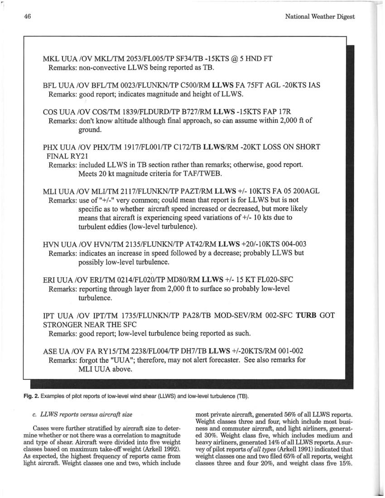

46 
MKL UUA/OV MKL/TM 2053/FL005/TP SF34/TB -15KTS @ 5 HND FT 
Remarks: non-convective LL WS being reported as TB. 
National Weather Digest 
BFL UUA IOV BFLlTM 0023/FLUNKN/TP C500/RM LLWS FA 75FT AGL -20KTS lAS 
Remarks: good report; indicates magnitude and height ofLLWS. 
COS UUA IOV COS/TM 1839IFLDURD/TP B727/RM LLWS -15KTS FAP 17R 
Remarks: don't know altitude although final approach, so can assume within 2,000 ft of 
ground. 
PHX UUA IOV PHXlTM 1917IFLOOI/TP CI72/TB LLWS/RM -20KT LOSS ON SHORT 
FINAL RY21 
Remarks: included LL WS in TB section rather than remarks; otherwise, good report. 
Meets 20 kt magnitude criteria for TAF/TWEB. 
MLI UUA IOV MLI/TM 2117IFLUNKN/TP PAZT/RM LLWS +1- 10KTS FA 05 200AGL 
Remarks: use of "+1-" very common; could mean that report is for LL WS but is not 
specific as to whether aircraft speed increased or decreased, but more likely 
means that aircraft is experiencing speed variations of +1- 10 kts due to 
turbulent eddies (low-level turbulence). 
HVN UUA IOV HVN/TM 2135IFLUNKN/TP AT42/RM LLWS +201-10KTS 004-003 
Remarks: indicates an increase in speed followed by a decrease; probably LL WS but 
possibly low-level turbulence. 
ERI UUA IOV ERI/TM 02l4IFL020/TP MD80/RM LLWS +1- 15 KT FL020-SFC 
Remarks: reporting through layer from 2,000 ft to surface so probably low-level 
turbulence. 
IPT UUA IOV IPT/TM 1735/FLUNKN/TP PA28/TB MOD-SEV/RM 002-SFC TURB GOT 
STRONGER NEAR THE SFC 
Remarks: good report; low-level turbulence being reported as such. 
ASE UA IOV FA RY15/TM 2238IFL004/TP DH7/TB LLWS +1-20KTSIRM 001-002 
Remarks: forgot the "UUA"; therefore, may not alert forecaster. See also remarks for 
MLI UUA above. 
Fig. 2. Examples of pilot reports of low-level wind shear (LLWS) and low-level turbulence (TB). 
c. LLWS reports versus aircraft size 
Cases were further stratified by aircraft size to deter-
mine whether or not there was a correlation to magnitude 
and type of shear. Aircraft were divided into five weight 
classes based on maximum take-off weight (Arke1l1992). 
As expected, the highest frequency of reports came from 
light aircraft. Weight classes one and two, which include 
most private aircraft, generated 56% of all LLWS reports. 
Weight classes three and four, which include most busi-
ness and commuter aircraft, and light airliners, generat-
ed 30%. Weight class five, which includes medium and 
heavy airliners, generated 14% of all LLWS reports. A sur-
vey of pilot reports of all types (Arke1l1991) indicated that 
weight classes one and two filed 65% of all reports, weight 
classes three and four 20%, and weight class five 15%.

## Page 9

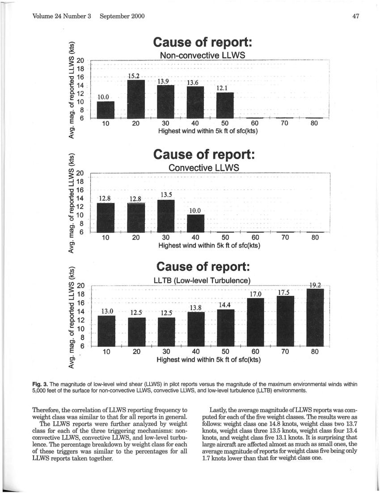

Volume 24 Number 3 
September 2000 
.-.. 
(/) 
s:: -
~ 20 
-oJ 18 
-oJ 
"C 16 
Cause of report: 
Non-convective LL WS 
15.2 · 
~ 14 
0 5r 12 
~ 10 
o 8 
0> 
co 
6 
E 
10 
30 
40 
50 
60 
70 
80 
20 
OJ 
> « 
Highest wind within 5k ft of sfc(kts) 
.-.. 
(/) 
..... c-
Cause of report: 
Convective LLWS 
en 20 
~ 18 
,--------_._-----------_._----- _._--_._-------_.- --_ .. -_. __ ._-_ 
.. _. __ . __ ., 
1 
....J 
"'0 16 
~ 14 
0 c..12 
Q) 
.:: 10 
0 
0> 8 
co 
6 
E 
0> 
~ 
.-.. 
(/) 
..... 
...¥: 
........ 
en 20 
~ 18 
....J 
"'0 16 
~ 14 
8.12 
Q) 
.:: 10 
o 8 
Ol 
~ 6 
Ol 
~ 
10 
20 
10 
20 
! 
30 
40 
50 
60 
70 
80 
Highest wind within 5k ft of sfc(kts) 
Cause of report: 
~_L!~ _J~~~~_~~_~I _ !.~~_~_~!~!1ce } __ 
._________ .... __ ..... . 192-.. . 
30 
40 
50 
60 
70 
80 
Highest wind within 5k ft of sfc(kts) 
47 
Fig. 3. The magnitude of low-level wind shear (LLWS) in pilot reports versus the magnitude of the maximum environmental winds within 
5,000 feet of the surface for non-convective LLWS, convective LLWS, and low-level turbulence (LLTB) environments. 
Therefore, the correlation of LLWS reporting frequency to 
weight class was similar to that for all reports in general. 
The LLWS reports were further analyzed by weight 
class for each of the three triggering mechanisms: non-
convective LLWS, convective LLWS, and low-level turbu-
lence. The percentage breakdown by weight class for each 
of these triggers was similar to the percentages for all 
LLWS reports taken together. 
Lastly, the average magnitude ofLLWS reports was com-
puted for each of the five weight classes. The results were as 
follows: weight class one 14.8 knots, weight class two 13.7 
knots, weight class three 13.5 knots, weight class four 13.4 
knots, and weight class five 13.1 knots. It is surprising that 
large aircraft are affected almost as much as small ones, the 
average magnitude of reports for weight class five being only 
1.7 knots lower than that for weight class one.

## Page 10

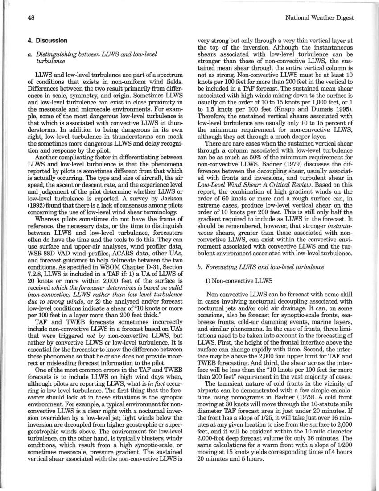

48 
4. Discussion 
a. Distinguishing between LLWS and low-level 
turbulence 
LLWS and low-level turbulence are part of a spectrum 
of conditions that exists in non-uniform wind fields. 
Differences between the two result primarily from differ-
ences in scale, symmetry, and origin. Sometimes LLWS 
and low-level turbulence can exist in close proximity in 
the mesoscale and microscale environments. For exam-
ple, some of the most dangerous low-level turbulence is 
that which is associated with convective LLWS in thun-
derstorms. In addition to being dangerous in its own 
right, low-level turbulence in thunderstorms can mask 
the sometimes more dangerous LLWS and delay recogni-
tion and response by the pilot. 
Another complicating factor in differentiating between 
LLWS and low-level turbulence is that the phenomena 
reported by pilots is sometimes different from that which 
is actually occurring. The type and size of aircraft, the air 
speed, the ascent or descent rate, and the experience level 
and judgement of the pilot determine whether LLWS or 
low-level turbulence is reported. A survey by Jackson 
(1992) found that there is a lack of consensus among pilots 
concerning the use oflow-Ievel wind shear terminology. 
Whereas pilots sometimes do not have the frame of 
reference, the necessary data, or the time to distinguish 
between LLWS and low-level turbulence, forecasters 
often do have the time and the tools to do this. They can 
use surface and upper-air analyses, wind profiler data, 
WSR-88D VAD wind profiles, ACARS data, other UAs, 
and forecast guidance to help delineate between the two 
conditions. As specified in WSOM Chapter D-31, Section 
7.2.8, LLWS is included in a TAF if: 1) a UA of LLWS of 
20 knots or more within 2,000 feet of the surface is 
received which the forecaster determines is based on valid 
(non-convective) LLWS rather than low-level turbulence 
due to strong winds, or 2) the analyzed and/or forecast 
low-level conditions indicate a shear of "10 knots or more 
per 100 feet in a layer more than 200 feet thick." 
TAF and TWEB forecasts sometimes incorrectly 
include non-convective LLWS in a forecast based on UA's 
that were triggered not by non-convective LLWS, but 
rather by convective LLWS or low-level turbulence. It is 
essential for the forecaster to know the difference between 
these phenomena so that he or she does not provide incor-
rect or misleading forecast information to the pilot. 
One of the most common errors in the TAF and TWEB 
forecasts is to include LLWS on high wind days when, 
although pilots are reporting LLWS, what is in fact occur-
ring is low-level turbulence. The first thing that the fore-
caster should look at in these situations is the synoptic 
environment. For example, a typical environment for non-
convective LLWS is a clear night with a nocturnal inver-
sion overridden by a low-level jet; light winds below the 
inversion are decoupled from higher geostrophic or super-
geostrophic winds above. The environment for low-level 
turbulence, on the other hand, is typically blustery, windy 
conditions, which result from a high synoptic-scale, or 
sometimes mesoscale, pressure gradient. The sustained 
vertical shear associated with the non-convective LLWS is 
National Weather Digest 
very strong but only through a very thin vertical layer at 
the top of the inversion. Although the instantaneous 
shears associated with low-level turbulence can be 
stronger than those of non-convective LLWS, the sus-
tained mean shear through the entire vertical column is 
not as strong. Non-convective LLWS must be at least 10 
knots per 100 feet for more than 200 feet in the vertical to 
be included in a TAF forecast. The sustained mean shear 
associated with high winds mixing down to the surface is 
usually on the order of 10 to 15 knots per 1,000 feet, or 1 
to 1.5 knots per 100 feet (Knapp and Dumais 1995). 
Therefore;- the sustained vertical shears associated with 
low-level turbulence are usually only 10 to 15 percent of 
the minimum requirement for non-convective LLWS, 
although they act through a much deeper layer. 
There are rare cases when the sustained vertical shear 
through a column associated with low-level turbulence 
can be as much as 50% of the minimum requirement for 
non-convective LLWS. Badner (1979) discusses the dif-
ferences between the decoupling shear, usually associat-
ed with fronts and inversions, and turbulent shear in 
Low-Level Wind Shear: A Critical Review. Based on this 
report, the combination of high gradient winds on the 
order of 60 knots or more and a rough surface can, in 
extreme cases, produce low-level vertical shear on the 
order of 10 knots per 200 feet. This is still only half the 
gradient required to include as LLWS in the forecast. It 
should be remembered, however, that stronger instanta-
neous shears, greater than those associated with non-
convective LLWS, can exist within the convective envi-
ronment associated with convective LLWS and the tur-
bulent environment associated with low-level turbulence. 
b. Forecasting LLWS and low-level turbulence 
1) Non-convective LLWS 
Non-convective LLWS can be forecast with some skill 
in cases involving nocturnal decoupling associated with 
nocturnal jets and/or cold air drainage. It can, on some 
occasions, also be forecast for synoptic-scale fronts, sea-
breeze fronts, cold-air damming events, marine layers, 
and similar phenomena. In the case offronts, three limi-
tations need to be taken into account in the forecasting of 
LLWS. First, the height ofthe frontal interface above the 
surface can change rapidly with time. Second, the inter-
face may be above the 2,000 foot upper limit for TAF and 
TWEB forecasting. And third, the shear across the inter-
face will be less than the "10 knots per 100 feet for more 
than 200 feet" requirement in the vast majority of cases. 
The transient nature of cold fronts in the vicinity of 
airports can be demonstrated with a few simple calcula-
tions using nomograms in Badner (1979). A cold front 
moving at 30 knots will move through the 10-statute mile 
diameter TAF forecast area in just under 20 minutes. If 
the front has a slope of 1125, it will take just over 16 min-
utes at any given location to rise from the surface to 2,000 
feet, and it will be resident within the 10-mile diameter 
2,000-foot deep forecast volume for only 36 minutes. The 
same calculations for a warm front with a slope of 11200 
moving at 15 knots yields corresponding times of 4 hours 
20 minutes and 5 hours.

## Page 11

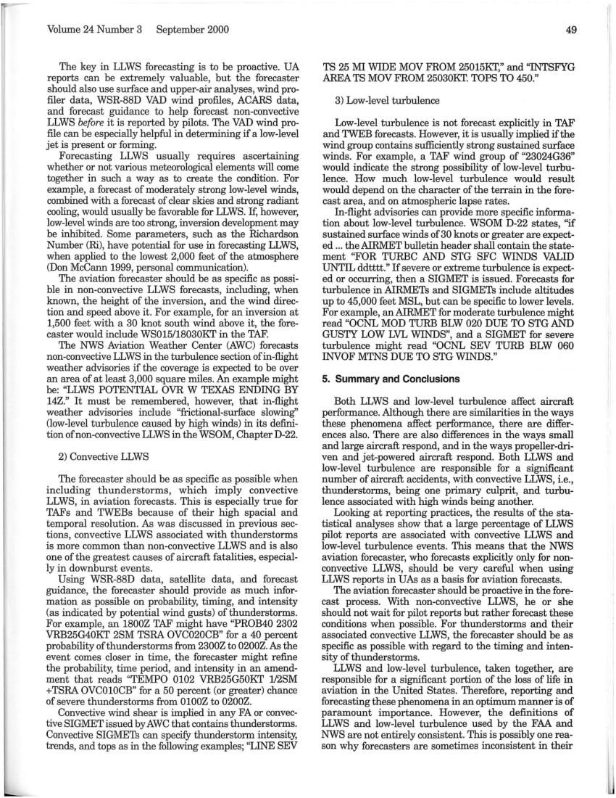

Volume 24 Number 3 
September 2000 
The key in LLWS forecasting is to be proactive. UA 
reports can be extremely valuable, but the forecaster 
should also use surface and upper-air analyses, wind pro-
filer data, WSR-88D VAD wind profiles, ACARS data, 
and forecast guidance to help forecast non-convective 
LLWS before it is reported by pilots. The VAD wind pro-
file can be especially helpful in determining if a low-level 
jet is present or forming. 
Forecasting LLWS usually requires ascertaining 
whether or not various meteorological elements will come 
together in such a way as to create the condition. For 
example, a forecast of moderately strong low-level winds, 
combined with a forecast of clear skies and strong radiant 
cooling, would usually be favorable for LLWS. If, however, 
low-level winds are too strong, inversion development may 
be inhibited. Some parameters, such as the Richardson 
Number (Ri), have potential for use in forecasting LLWS, 
when applied to the lowest 2,000 feet of the atmosphere 
(Don McCann 1999, personal communication). 
The aviation forecaster should be as specific as possi-
ble in non-convective LLWS forecasts, including, when 
known, the height of the inversion, and the wind direc-
tion and speed above it. For example, for an inversion at 
1,500 feet with a 30 knot south wind above it, the fore-
caster would include WS015/18030KT in the TAF. 
The NWS Aviation Weather Center (AWC) forecasts 
non-convective LLWS in the turbulence section of in-flight 
weather advisories if the coverage is expected to be over 
an area of at least 3,000 square miles. An example might 
be: "LLWS POTENTIAL OVR W TEXAS ENDING BY 
14Z." It must be remembered, however, that in-flight 
weather advisories include "frictional-surface slowing" 
Clow-level turbulence caused by high winds) in its defini-
tion of non-convective LLWS in the WSOM, Chapter D-22. 
2) Convective LLWS 
The forecaster should be as specific as possible when 
including thunderstorms, which imply convective 
LLWS, in aviation forecasts. This is especially true for 
TAFs and TWEBs because of their high spacial and 
temporal resolution. As was discussed in previous sec-
tions, convective LLWS associated with thunderstorms 
is more common than non-convective LLWS and is also 
one of the greatest causes of aircraft fatalities, especial-
ly in downburst events. 
Using WSR-88D data, satellite data, and forecast 
guidance, the forecaster should provide as much infor-
mation as possible on probability, timing, and intensity 
(as indicated by potential wind gusts) of thunderstorms. 
For example, an 1800Z TAF might have "PROB40 2302 
VRB25G40KT 2SM TSRA OVC020CB" for a 40 percent 
probability of thunderstorms from 2300Z to 0200Z. As the 
event comes closer in time, the forecaster might refine 
the probability, time period, and intensity in an amend-
ment that reads "TEMPO 0102 VRB25G50KT 1I2SM 
+TSRA OVC010CB" for a 50 percent (or greater) chance 
of severe thunderstorms from 0100Z to 0200Z. 
Convective wind shear is implied in any FA or convec-
tive SIGMET issued by AWC that contains thunderstorms. 
Convective SIGMETs can specify thunderstorm intensity, 
trends, and tops as in the following examples; "LINE SEV 
49 
TS 25 MI WIDE MOV FROM 25015KT," and "INTSFYG 
AREA TS MOV FROM 25030KT. TOPS TO 450." 
3) Low-level turbulence 
Low-level turbulence is not forecast explicitly in TAF 
and TWEB forecasts. However, it is usually implied ifthe 
wind group contains sufficiently strong sustained surface 
winds. For example, a TAF wind group of "23024G36" 
would indicate the strong possibility of low-level turbu-
lence. How much low-level turbulence would result 
would depend on the character of the terrain in the fore-
cast area, and on atmospheric lapse rates. 
In-flight advisories can provide more specific informa-
tion about low-level turbulence. WSOM D-22 states, "if 
sustained surface winds of 30 knots or greater are expect-
ed ... the AIRMET bulletin header shall contain the state-
ment "FOR TURBC AND STG SFC WINDS VALID 
UNTIL ddtttt." If severe or extreme turbulence is expect-
ed or occurring, then a SIGMET is issued. Forecasts for 
turbulence in AIRMETs and SIGMETs include altitudes 
up to 45,000 feet MSL, but can be specific to lower levels. 
For example, an AIRMET for moderate turbulence might 
read "OCNL MOD TURB BLW 020 DUE TO STG AND 
GUSTY LOW LVL WINDS", and a SIGMET for severe 
turbulence might read "OCNL SEV TURB BLW 060 
INVOF MTNS DUE TO STG WINDS." 
5. Summary and Conclusions 
Both LLWS and low-level turbulence affect aircraft 
performance. Although there are similarities in the ways 
these phenomena affect performance, there are differ-
ences also. There are also differences in the ways small 
and large aircraft respond, and in the ways propeller-dri-
ven and jet-powered aircraft respond. Both LLWS and 
low-level turbulence are responsible for a significant 
number of aircraft accidents, with convective LLWS, i.e., 
thunderstorms, being one primary culprit, and turbu-
lence associated with high winds being another. 
Looking at reporting practices, the results of the sta-
tistical analyses show that a large percentage of LLWS 
pilot reports are associated with convective LLWS and 
low-level turbulence events. This means that the NWS 
aviation forecaster, who forecasts explicitly only for non-
convective LLWS, should be very careful when using 
LLWS reports in UAs as a basis for aviation forecasts. 
The aviation forecaster should be proactive in the fore-
cast process. With non-convective LLWS, he or she 
should not wait for pilot reports but rather forecast these 
conditions when possible. For thunderstorms and their 
associated convective LLWS, the forecaster should be as 
specific as possible with regard to the timing and inten-
sity of thunderstorms. 
LLWS and low-level turbulence, taken together, are 
responsible for a significant portion of the loss of life in 
aviation in the United States. Therefore, reporting and 
forecasting these phenomena in an optimum manner is of 
paramount importance. However, the definitions of 
LLWS and low-level turbulence used by the FAA and 
NWS are not entirely consistent. This is possibly one rea-
son why forecasters are sometimes inconsistent in their

## Page 12

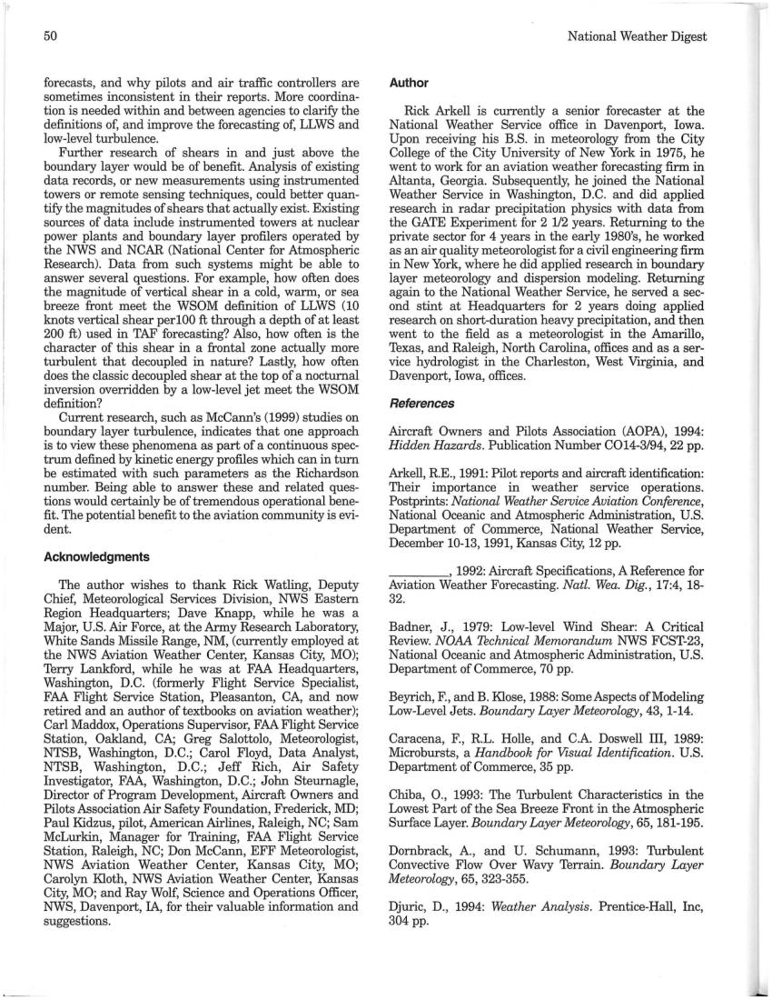

50 
forecasts, and why pilots and air traffic controllers are 
sometimes inconsistent in their reports. More coordina-
tion is needed within and between agencies to clarifY the 
definitions of, and improve the forecasting of, LLWS and 
low-level turbulence. 
Further research of shears in and just above the 
boundary layer would be of benefit. Analysis of existing 
data records, or new measurements using instrumented 
towers or remote sensing techniques, could better quan-
tifY the magnitudes of shears that actually exist. Existing 
sources of data include instrumented towers at nuclear 
power plants and boundary layer profilers operated by 
the NWS and NCAR (National Center for Atmospheric 
Research). Data from such systems might be able to 
answer several questions. For example, how often does 
the magnitude of vertical shear in a cold, warm, or sea 
breeze front meet the WSOM definition of LLWS (10 
knots vertical shear perl00 ft through a depth of at least 
200 ft) used in TAF forecasting? Also, how often is the 
character of this shear in a frontal zone actually more 
turbulent that decoupled in nature? Lastly, how often 
does the classic decoupled shear at the top of a nocturnal 
inversion overridden by a low-level jet meet the WSOM 
definition? 
Current research, such as McCann's (1999) studies on 
boundary layer turbulence, indicates that one approach 
is to view these phenomena as part of a continuous spec-
trum defined by kinetic energy profiles which can in turn 
be estimated with such parameters as the Richardson 
number. Being able to answer these and related ques-
tions would certainly be of tremendous operational bene-
fit. The potential benefit to the aviation community is evi-
dent. 
Acknowledgments 
The author wishes to thank Rick Watling, Deputy 
Chief, Meteorological Services Division, NWS Eastern 
Region Headquarters; Dave Knapp, while he was a 
Major, U.S. Air Force, at the Army Research Laboratory, 
White Sands Missile Range, NM, (currently employed at 
the NWS Aviation Weather Center, Kansas City, MO); 
Terry Lankford, while he was at FAA Headquarters, 
Washington, D.C. (formerly Flight Service Specialist, 
FAA Flight Service Station, Pleasanton, CA, and now 
retired and an author of textbooks on aviation weather); 
Carl Maddox, Operations Supervisor, FAA Flight Service 
Station, Oakland, CA; Greg Salottolo, Meteorologist, 
NTSB, Washington, D.C.; Carol Floyd, Data Analyst, 
NTSB, Washington, D.C.; Jeff Rich, Air Safety 
Investigator, FAA, Washington, D.C.; John Steurnagle, 
Director of Program Development, Aircraft Owners and 
Pilots Association Air Safety Foundation, Frederick, MD; 
Paul Kidzus, pilot, American Airlines, Raleigh, NC; Sam 
McLurkin, Manager for Training, FAA Flight Service 
Station, Raleigh, NC; Don McCann, EFF Meteorologist, 
NWS Aviation Weather Center, Kansas City, MO; 
Carolyn Kloth, NWS Aviation Weather Center, Kansas 
City, MO; and Ray Wolf, Science and Operations Officer, 
NWS, Davenport, IA, for their valuable information and 
suggestions. 
National Weather Digest 
Author 
Rick Arkell is currently a senior forecaster at the 
National Weather Service office in Davenport, Iowa. 
Upon receiving his B.S. in meteorology from the City 
College of the City University of New York in 1975, he 
went to work for an aviation weather forecasting firm in 
Altanta, Georgia. Subsequently, he joined the National 
Weather Service in Washington, D.C. and did applied 
research in radar precipitation physics with data from 
the GATE Experiment for 2 112 years. Returning to the 
private sector for 4 years in the early 1980's, he worked 
as an air quality meteorologist for a civil engineering firm 
in New York, where he did applied research in boundary 
layer meteorology and dispersion modeling. Returning 
again to the National Weather Service, he served a sec-
ond stint at Headquarters for 2 years doing applied 
research on short-duration heavy precipitation, and then 
went to the field as a meteorologist in the Amarillo, 
Texas, and Raleigh, North Carolina, offices and as a ser-
vice hydrologist in the Charleston, West Virginia, and 
Davenport, Iowa, offices. 
References 
Aircraft Owners and Pilots Association (AOPA), 1994: 
Hidden Hazards. Publication Number C014-3/94, 22 pp. 
Arkell, R.E., 1991: Pilot reports and aircraft identification: 
Their importance in weather service operations. 
Postprints: National Weather Service Aviation Conference, 
National Oceanic and Atmospheric Administration, U.S. 
Department of Commerce, National Weather Service, 
December 10-13, 1991, Kansas City, 12 pp. 
____ , 1992: Aircraft Specifications, A Reference for 
Aviation Weather Forecasting. Natl. Wea. Dig., 17:4, 18-
32. 
Badner, J., 1979: Low-level Wind Shear: A Critical 
Review. NOAA Technical Memorandum NWS FCST-23, 
National Oceanic and Atmospheric Administration, U.S. 
Department of Commerce, 70 pp. 
Beyrich, F., and B. Klose, 1988: Some Aspects of Modeling 
Low-Level Jets. Boundary Layer Meteorology, 43, 1-14. 
Caracena, F., R.L. Holle, and C.A. Doswell III, 1989: 
Microbursts, a Handbook for Visual Identification. U.S. 
Department of Commerce, 35 pp. 
Chiba, 0 ., 1993: The Thrbulent Characteristics in the 
Lowest Part of the Sea Breeze Front in the Atmospheric 
Surface Layer. Boundary Layer Meteorology, 65,181-195. 
Dornbrack, A., and U. Schumann, 1993: 'furbulent 
Convective Flow Over Wavy Terrain. Boundary Layer 
Meteorology, 65, 323-355. 
Djuric, D., 1994: Weather Analysis. Prentice-Hall, Inc, 
304 pp.

## Page 13

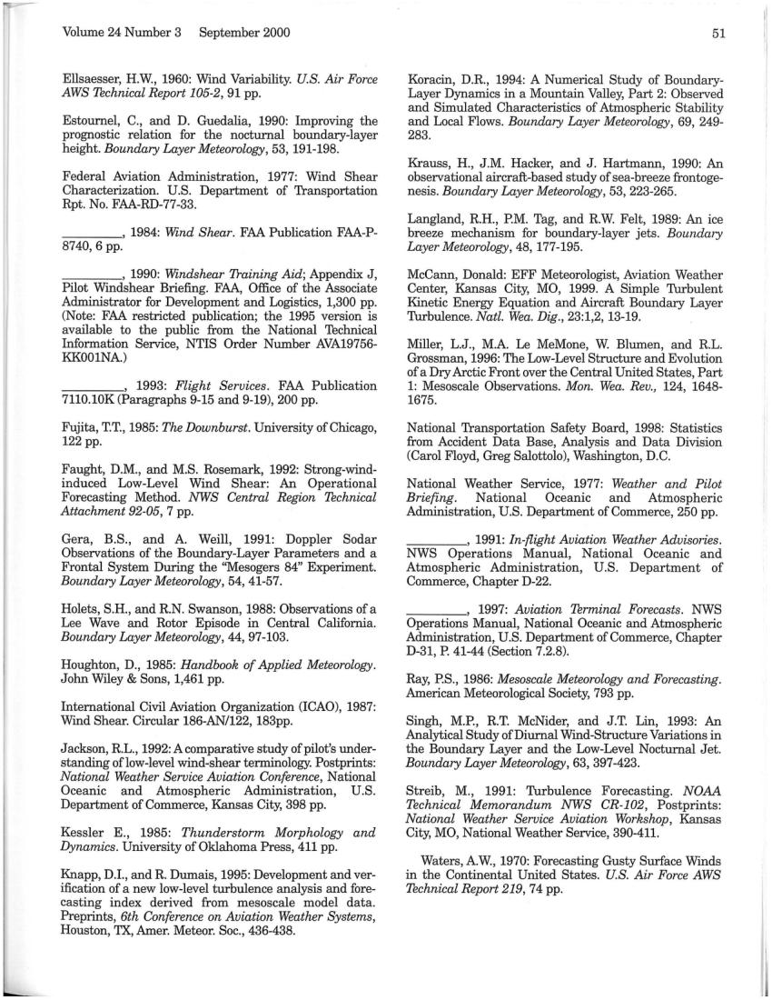

Volume 24 Number 3 
September 2000 
Ellsaesser, H.W., 1960: Wind Variability. U.S. Air Force 
AWS Technical Report 105-2, 91 pp. 
Estournel, C., and D. Guedalia, 1990: Improving the 
prognostic relation for the nocturnal boundary-layer 
height. Boundary Layer Meteorology, 53, 191-198. 
Federal Aviation Administration, 1977: Wind Shear 
Characterization. U.S. Department of Transportation 
Rpt. No. FAA-RD-77-33. 
____ , 1984: Wind Shear. FAA Publication FAA-P-
8740,6 pp. 
____ , 1990: Windshear Training Aid; Appendix J, 
Pilot Windshear Briefing. FAA, Office of the Associate 
Administrator for Development and Logistics, 1,300 pp. 
(Note: FAA restricted publication; the 1995 version is 
available to the public from the National Technical 
Information Service, NTIS Order Number AVA19756-
KK001NA) 
____ , 1993: Flight Services. FAA Publication 
7110.10K (Paragraphs 9-15 and 9-19), 200 pp. 
Fujita, T.T., 1985: The Downburst. University of Chicago, 
122 pp. 
Faught, D.M., and M.S. Rosemark, 1992: Strong-wind-
induced Low-Level Wind Shear: An Operational 
Forecasting Method. NWS Central Region Technical 
Attachment 92-05,7 pp. 
Gera, B.S., and A 
Weill, 1991: Doppler Sodar 
Observations of the Boundary-Layer Parameters and a 
Frontal System During the "Mesogers 84" Experiment. 
Boundary Layer Meteorology, 54, 41-57. 
Holets, S.H., and RN. Swanson, 1988: Observations of a 
Lee Wave and Rotor Episode in Central California. 
Boundary Layer Meteorology, 44, 97-103. 
Houghton, D., 1985: Handbook of Applied Meteorology. 
John Wiley & Sons, 1,461 pp. 
International Civil Aviation Organization (ICAO), 1987: 
Wind Shear. Circular 186-AN/122, 183pp. 
Jackson, RL., 1992: A comparative study of pilot's under-
standing oflow-Ievel wind-shear terminology. Postprints: 
National Weather Service Aviation Conference, National 
Oceanic 
and Atmospheric Administration, 
U.S. 
Department of Commerce, Kansas City, 398 pp. 
Kessler E., 1985: Thunderstorm Morphology and 
Dynamics. University of Oklahoma Press, 411 pp. 
Knapp, D.l., and R Dumais, 1995: Development and ver-
ification of a new low-level turbulence analysis and fore-
casting index derived from mesoscale model data. 
Preprints, 6th Conference on Aviation Weather Systems, 
Houston, TX, Amer. Meteor. Soc., 436-438. 
51 
Koracin, D.R, 1994: A Numerical Study of Boundary-
Layer Dynamics in a Mountain Valley, Part 2: Observed 
and Simulated Characteristics of Atmospheric Stability 
and Local Flows. Boundary Layer Meteorology, 69, 249-
283. 
Krauss, H., J.M. Hacker, and J. Hartmann, 1990: An 
observational aircraft-based study of sea-breeze frontoge-
nesis. Boundary Layer Meteorology, 53, 223-265. 
Langland, RH., P.M. Tag, and RW. Felt, 1989: An ice 
breeze mechanism for boundary-layer jets. Boundary 
Layer Meteorology, 48,177-195. 
McCann, Donald: EFF Meteorologist, Aviation Weather 
Center, Kansas City, MO, 1999. A Simple Thrbulent 
Kinetic Energy Equation and Aircraft Boundary Layer 
Thrbulence. Natl. Wea. Dig., 23:1,2,13-19. 
Miller, L.J., M.A. Le MeMone, W. Blumen, and RL. 
Grossman, 1996: The Low-Level Structure and Evolution 
of a Dry Arctic Front over the Central United States, Part 
1: Mesoscale Observations. Mon. Wea. Rev., 124, 1648-
1675. 
National Transportation Safety Board, 1998: Statistics 
from Accident Data Base, Analysis and Data Division 
(Carol Floyd, Greg Salottolo), Washington, D.C. 
National Weather Service, 1977: Weather and Pilot 
Briefing. 
National 
Oceanic 
and 
Atmospheric 
Administration, U.S. Department of Commerce, 250 pp. 
____ , 1991: In-flight Aviation Weather Advisories. 
NWS Operations Manual, National Oceanic and 
Atmospheric Administration, U.S. Department of 
Commerce, Chapter D-22. 
-cc-----, 1997: Aviation Terminal Forecasts. NWS 
Operations Manual, National Oceanic and Atmospheric 
Administration, U.S. Department of Commerce, Chapter 
D-31, P. 41-44 (Section 7.2.8). 
Ray, P.S., 1986: Mesoscale Meteorology and Forecasting. 
American Meteorological Society, 793 pp. 
Singh, M.P., RT. McNider, and J.T. Lin, 1993: An 
Analytical Study of Diurnal Wind-Structure Variations in 
the Boundary Layer and the Low-Level Nocturnal Jet. 
Boundary Layer Meteorology, 63, 397-423. 
Streib, M., 1991: Turbulence Forecasting. NOAA 
Technical Memorandum NWS CR-102, Postprints: 
National Weather Service Aviation Workshop, Kansas 
City, MO, National Weather Service, 390-411. 
Waters, AW., 1970: Forecasting Gusty Surface Winds 
in the Continental United States. U.S. Air Force AWS 
Technical Report 219,74 pp.
