# Icing - The Definitive Edition

> Source: <http://www.weather.gov/media/zhu/ZHU_Training_Page/icing_stuff/icing/Aircraft_Icing.pdf>  
> Section: Icing  
> Captured: 2026-08-19 06:00 UTC  
> PDF: [icing-the-definitive-edition.pdf](icing-the-definitive-edition.pdf) (16 pages)

---

## Page 1

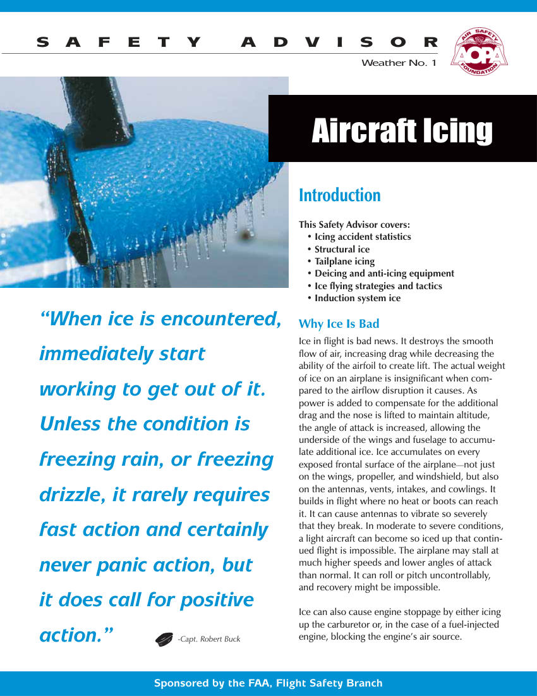

Sponsored by the FAA, Flight Safety Branch
Introduction
This Safety Advisor covers:
• Icing accident statistics
• Structural ice
• Tailplane icing
• Deicing and anti-icing equipment
• Ice flying strategies and tactics
• Induction system ice
Why Ice Is Bad
Ice in flight is bad news. It destroys the smooth
flow of air, increasing drag while decreasing the
ability of the airfoil to create lift. The actual weight
of ice on an airplane is insignificant when com-
pared to the airflow disruption it causes. As
power is added to compensate for the additional
drag and the nose is lifted to maintain altitude,
the angle of attack is increased, allowing the
underside of the wings and fuselage to accumu-
late additional ice. Ice accumulates on every
exposed frontal surface of the airplane—not just
on the wings, propeller, and windshield, but also
on the antennas, vents, intakes, and cowlings. It
builds in flight where no heat or boots can reach
it. It can cause antennas to vibrate so severely
that they break. In moderate to severe conditions,
a light aircraft can become so iced up that contin-
ued flight is impossible. The airplane may stall at
much higher speeds and lower angles of attack
than normal. It can roll or pitch uncontrollably,
and recovery might be impossible.
Ice can also cause engine stoppage by either icing
up the carburetor or, in the case of a fuel-injected
engine, blocking the engine’s air source.
S
A
F
E
T
Y
 
A
D
V
I
S
O
R
Weather No. 1
“When ice is encountered,
immediately start 
working to get out of it.
Unless the condition is
freezing rain, or freezing
drizzle, it rarely requires
fast action and certainly
never panic action, but 
it does call for positive
action.”                               
-Capt. Robert Buck
Aircraft Icing

## Page 2

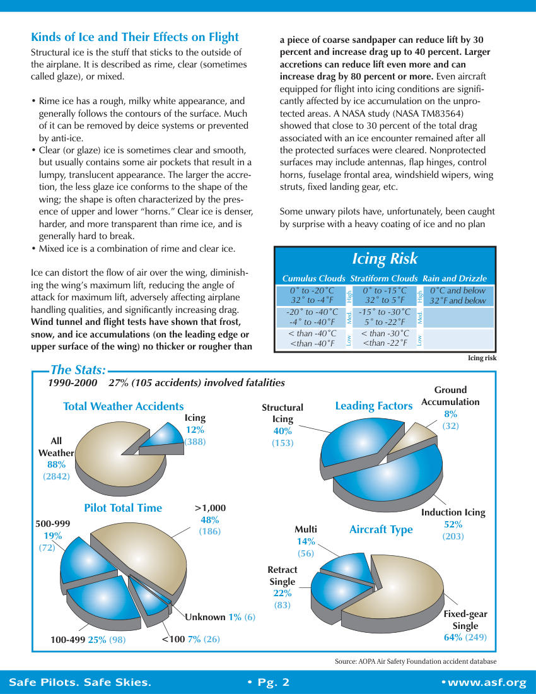

Safe Pilots. Safe Skies. 
• Pg. 2
•www.asf.org
Kinds of Ice and Their Effects on Flight
Structural ice is the stuff that sticks to the outside of
the airplane. It is described as rime, clear (sometimes
called glaze), or mixed.
• Rime ice has a rough, milky white appearance, and
generally follows the contours of the surface. Much
of it can be removed by deice systems or prevented
by anti-ice.
• Clear (or glaze) ice is sometimes clear and smooth,
but usually contains some air pockets that result in a
lumpy, translucent appearance. The larger the accre-
tion, the less glaze ice conforms to the shape of the
wing; the shape is often characterized by the pres-
ence of upper and lower “horns.” Clear ice is denser,
harder, and more transparent than rime ice, and is
generally hard to break. 
• Mixed ice is a combination of rime and clear ice.
Ice can distort the flow of air over the wing, diminish-
ing the wing’s maximum lift, reducing the angle of
attack for maximum lift, adversely affecting airplane
handling qualities, and significantly increasing drag.
Wind tunnel and flight tests have shown that frost,
snow, and ice accumulations (on the leading edge or
upper surface of the wing) no thicker or rougher than
a piece of coarse sandpaper can reduce lift by 30
percent and increase drag up to 40 percent. Larger
accretions can reduce lift even more and can
increase drag by 80 percent or more. Even aircraft
equipped for flight into icing conditions are signifi-
cantly affected by ice accumulation on the unpro-
tected areas. A NASA study (NASA TM83564)
showed that close to 30 percent of the total drag
associated with an ice encounter remained after all
the protected surfaces were cleared. Nonprotected
surfaces may include antennas, flap hinges, control
horns, fuselage frontal area, windshield wipers, wing
struts, fixed landing gear, etc.
Some unwary pilots have, unfortunately, been caught
by surprise with a heavy coating of ice and no plan
0˚ to -15˚C
32˚ to 5˚F
Cumulus Clouds  Stratiform Clouds  Rain and Drizzle
0˚ to -20˚C
32˚ to -4˚F
Leading Factors
Aircraft Type
Icing risk
The Stats:
0˚C and below
32˚F and below
-20˚ to -40˚C
-4˚ to -40˚F 
-15˚ to -30˚C
5˚ to -22˚F
< than -40˚C
<than -40˚F
< than -30˚C
<than -22˚F
Med.
High
Low
Icing Risk
Med.
High
Low
1990-2000    27% (105 accidents) involved fatalities
Source: AOPA Air Safety Foundation accident database
Total Weather Accidents
Pilot Total Time
Icing
12%
(388)
>1,000
48%
(186)
Unknown 1% (6)
<100 7% (26)
100-499 25% (98)
Structural 
Icing
40%
(153)
Ground
Accumulation
8%
(32)
Induction Icing
52%
(203)
All 
Weather
88%
(2842)
500-999 
19%
(72)
Fixed-gear
Single 
64% (249)
Multi
14%
(56)
Retract 
Single
22%
(83)

## Page 3

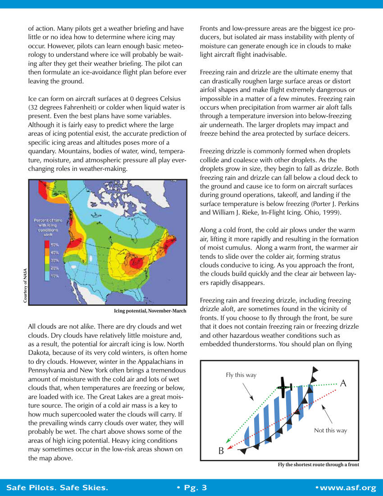

Safe Pilots. Safe Skies. 
• Pg. 3
•www.asf.org
of action. Many pilots get a weather briefing and have
little or no idea how to determine where icing may
occur. However, pilots can learn enough basic meteo-
rology to understand where ice will probably be wait-
ing after they get their weather briefing. The pilot can
then formulate an ice-avoidance flight plan before ever
leaving the ground. 
Ice can form on aircraft surfaces at 0 degrees Celsius
(32 degrees Fahrenheit) or colder when liquid water is
present. Even the best plans have some variables. 
Although it is fairly easy to predict where the large
areas of icing potential exist, the accurate prediction of
specific icing areas and altitudes poses more of a
quandary. Mountains, bodies of water, wind, tempera-
ture, moisture, and atmospheric pressure all play ever-
changing roles in weather-making.
All clouds are not alike. There are dry clouds and wet
clouds. Dry clouds have relatively little moisture and,
as a result, the potential for aircraft icing is low. North
Dakota, because of its very cold winters, is often home
to dry clouds. However, winter in the Appalachians in
Pennsylvania and New York often brings a tremendous
amount of moisture with the cold air and lots of wet
clouds that, when temperatures are freezing or below,
are loaded with ice. The Great Lakes are a great mois-
ture source. The origin of a cold air mass is a key to
how much supercooled water the clouds will carry. If
the prevailing winds carry clouds over water, they will
probably be wet. The chart above shows some of the
areas of high icing potential. Heavy icing conditions
may sometimes occur in the low-risk areas shown on
the map above.
Fronts and low-pressure areas are the biggest ice pro-
ducers, but isolated air mass instability with plenty of
moisture can generate enough ice in clouds to make
light aircraft flight inadvisable.
Freezing rain and drizzle are the ultimate enemy that
can drastically roughen large surface areas or distort
airfoil shapes and make flight extremely dangerous or
impossible in a matter of a few minutes. Freezing rain
occurs when precipitation from warmer air aloft falls
through a temperature inversion into below-freezing
air underneath. The larger droplets may impact and
freeze behind the area protected by surface deicers. 
Freezing drizzle is commonly formed when droplets
collide and coalesce with other droplets. As the
droplets grow in size, they begin to fall as drizzle. Both
freezing rain and drizzle can fall below a cloud deck to
the ground and cause ice to form on aircraft surfaces
during ground operations, takeoff, and landing if the
surface temperature is below freezing (Porter J. Perkins
and William J. Rieke, In-Flight Icing. Ohio, 1999).
Along a cold front, the cold air plows under the warm
air, lifting it more rapidly and resulting in the formation
of moist cumulus.  Along a warm front, the warmer air
tends to slide over the colder air, forming stratus
clouds conducive to icing. As you approach the front,
the clouds build quickly and the clear air between lay-
ers rapidly disappears. 
Freezing rain and freezing drizzle, including freezing
drizzle aloft, are sometimes found in the vicinity of
fronts. If you choose to fly through the front, be sure
that it does not contain freezing rain or freezing drizzle
and other hazardous weather conditions such as
embedded thunderstorms. You should plan on flying
Icing potential, November-March
Fly the shortest route through a front
A
B
Fly this way
Not this way
Courtesy of NASA

## Page 4

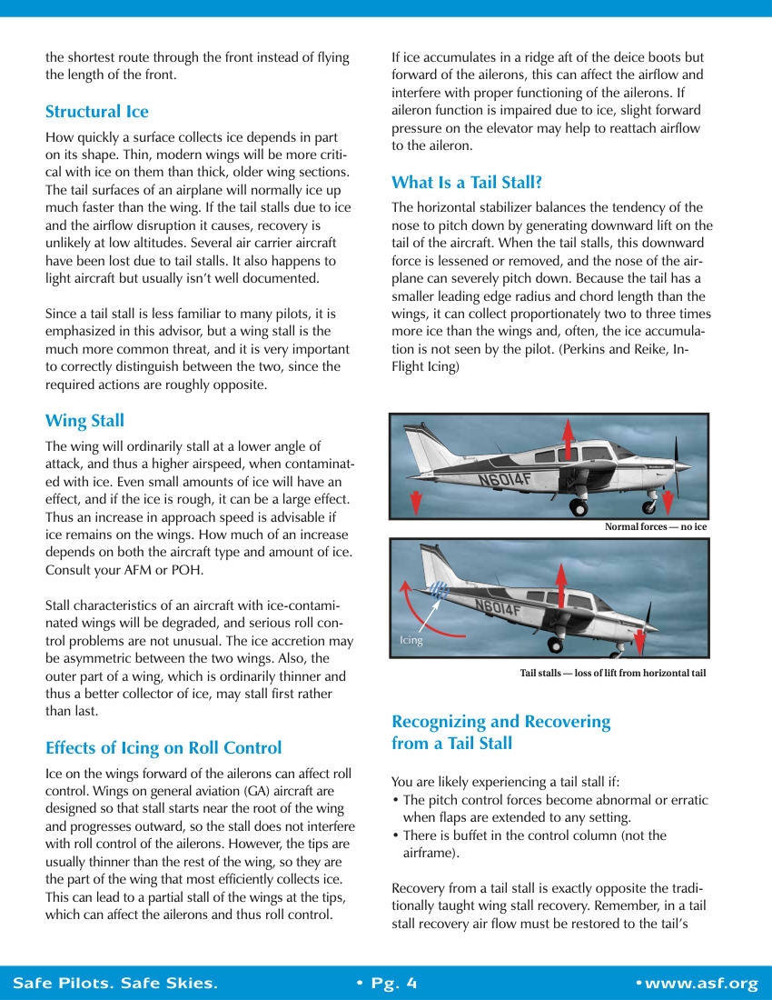

Safe Pilots. Safe Skies. 
• Pg. 4
•www.asf.org
If ice accumulates in a ridge aft of the deice boots but
forward of the ailerons, this can affect the airflow and
interfere with proper functioning of the ailerons. If
aileron function is impaired due to ice, slight forward
pressure on the elevator may help to reattach airflow
to the aileron.
What Is a Tail Stall?
The horizontal stabilizer balances the tendency of the
nose to pitch down by generating downward lift on the
tail of the aircraft. When the tail stalls, this downward
force is lessened or removed, and the nose of the air-
plane can severely pitch down. Because the tail has a
smaller leading edge radius and chord length than the
wings, it can collect proportionately two to three times
more ice than the wings and, often, the ice accumula-
tion is not seen by the pilot. (Perkins and Reike, In-
Flight Icing) 
Recognizing and Recovering
from a Tail Stall
You are likely experiencing a tail stall if:
• The pitch control forces become abnormal or erratic
when flaps are extended to any setting.
• There is buffet in the control column (not the 
airframe).
Recovery from a tail stall is exactly opposite the tradi-
tionally taught wing stall recovery. Remember, in a tail
stall recovery air flow must be restored to the tail’s
the shortest route through the front instead of flying
the length of the front.
Structural Ice
How quickly a surface collects ice depends in part
on its shape. Thin, modern wings will be more criti-
cal with ice on them than thick, older wing sections.
The tail surfaces of an airplane will normally ice up
much faster than the wing. If the tail stalls due to ice
and the airflow disruption it causes, recovery is
unlikely at low altitudes. Several air carrier aircraft
have been lost due to tail stalls. It also happens to
light aircraft but usually isn’t well documented.
Since a tail stall is less familiar to many pilots, it is
emphasized in this advisor, but a wing stall is the
much more common threat, and it is very important
to correctly distinguish between the two, since the
required actions are roughly opposite. 
Wing Stall
The wing will ordinarily stall at a lower angle of
attack, and thus a higher airspeed, when contaminat-
ed with ice. Even small amounts of ice will have an
effect, and if the ice is rough, it can be a large effect.
Thus an increase in approach speed is advisable if
ice remains on the wings. How much of an increase
depends on both the aircraft type and amount of ice.
Consult your AFM or POH.
Stall characteristics of an aircraft with ice-contami-
nated wings will be degraded, and serious roll con-
trol problems are not unusual. The ice accretion may
be asymmetric between the two wings. Also, the
outer part of a wing, which is ordinarily thinner and
thus a better collector of ice, may stall first rather
than last.
Effects of Icing on Roll Control
Ice on the wings forward of the ailerons can affect roll
control. Wings on general aviation (GA) aircraft are
designed so that stall starts near the root of the wing
and progresses outward, so the stall does not interfere
with roll control of the ailerons. However, the tips are
usually thinner than the rest of the wing, so they are
the part of the wing that most efficiently collects ice.
This can lead to a partial stall of the wings at the tips,
which can affect the ailerons and thus roll control. 
Tail stalls — loss of lift from horizontal tail
Icing
Normal forces — no ice

## Page 5

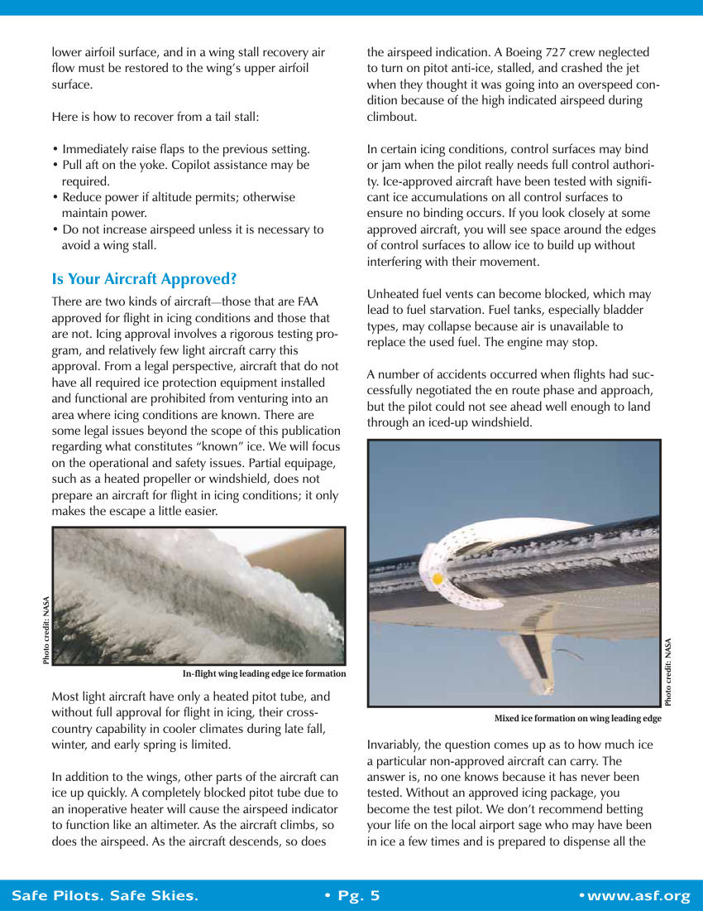

Safe Pilots. Safe Skies. 
• Pg. 5
•www.asf.org
lower airfoil surface, and in a wing stall recovery air
flow must be restored to the wing’s upper airfoil 
surface. 
Here is how to recover from a tail stall:
• Immediately raise flaps to the previous setting.
• Pull aft on the yoke. Copilot assistance may be 
required.
• Reduce power if altitude permits; otherwise 
maintain power.
• Do not increase airspeed unless it is necessary to 
avoid a wing stall.
Is Your Aircraft Approved?
There are two kinds of aircraft—those that are FAA
approved for flight in icing conditions and those that
are not. Icing approval involves a rigorous testing pro-
gram, and relatively few light aircraft carry this
approval. From a legal perspective, aircraft that do not
have all required ice protection equipment installed
and functional are prohibited from venturing into an
area where icing conditions are known. There are
some legal issues beyond the scope of this publication
regarding what constitutes “known” ice. We will focus
on the operational and safety issues. Partial equipage,
such as a heated propeller or windshield, does not
prepare an aircraft for flight in icing conditions; it only
makes the escape a little easier.
Most light aircraft have only a heated pitot tube, and
without full approval for flight in icing, their cross-
country capability in cooler climates during late fall,
winter, and early spring is limited. 
In addition to the wings, other parts of the aircraft can
ice up quickly. A completely blocked pitot tube due to
an inoperative heater will cause the airspeed indicator
to function like an altimeter. As the aircraft climbs, so
does the airspeed. As the aircraft descends, so does
the airspeed indication. A Boeing 727 crew neglected
to turn on pitot anti-ice, stalled, and crashed the jet
when they thought it was going into an overspeed con-
dition because of the high indicated airspeed during
climbout.
In certain icing conditions, control surfaces may bind
or jam when the pilot really needs full control authori-
ty. Ice-approved aircraft have been tested with signifi-
cant ice accumulations on all control surfaces to
ensure no binding occurs. If you look closely at some
approved aircraft, you will see space around the edges
of control surfaces to allow ice to build up without
interfering with their movement. 
Unheated fuel vents can become blocked, which may
lead to fuel starvation. Fuel tanks, especially bladder
types, may collapse because air is unavailable to
replace the used fuel. The engine may stop.
A number of accidents occurred when flights had suc-
cessfully negotiated the en route phase and approach,
but the pilot could not see ahead well enough to land
through an iced-up windshield.
Invariably, the question comes up as to how much ice
a particular non-approved aircraft can carry. The
answer is, no one knows because it has never been
tested. Without an approved icing package, you
become the test pilot. We don’t recommend betting
your life on the local airport sage who may have been
in ice a few times and is prepared to dispense all the
Mixed ice formation on wing leading edge
In-flight wing leading edge ice formation
Photo credit: NASA
Photo credit: NASA

## Page 6

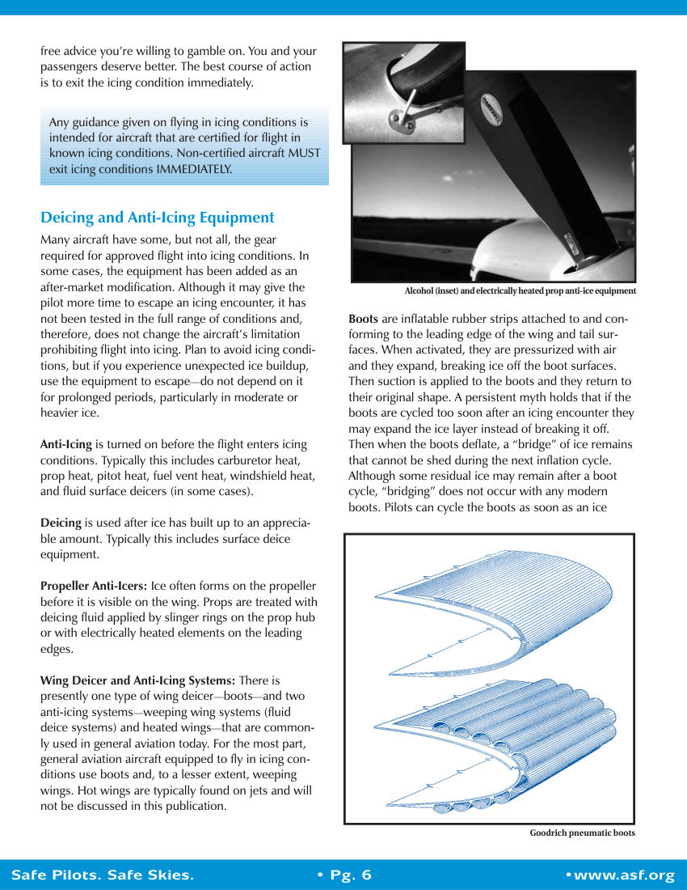

Safe Pilots. Safe Skies. 
• Pg. 6
•www.asf.org
free advice you’re willing to gamble on. You and your
passengers deserve better. The best course of action
is to exit the icing condition immediately.
Deicing and Anti-Icing Equipment
Many aircraft have some, but not all, the gear
required for approved flight into icing conditions. In
some cases, the equipment has been added as an
after-market modification. Although it may give the
pilot more time to escape an icing encounter, it has
not been tested in the full range of conditions and,
therefore, does not change the aircraft’s limitation
prohibiting flight into icing. Plan to avoid icing condi-
tions, but if you experience unexpected ice buildup,
use the equipment to escape—do not depend on it
for prolonged periods, particularly in moderate or
heavier ice.
Anti-Icing is turned on before the flight enters icing
conditions. Typically this includes carburetor heat,
prop heat, pitot heat, fuel vent heat, windshield heat,
and fluid surface deicers (in some cases).
Deicing is used after ice has built up to an apprecia-
ble amount. Typically this includes surface deice
equipment.
Propeller Anti-Icers: Ice often forms on the propeller
before it is visible on the wing. Props are treated with
deicing fluid applied by slinger rings on the prop hub
or with electrically heated elements on the leading
edges. 
Wing Deicer and Anti-Icing Systems: There is
presently one type of wing deicer—boots—and two
anti-icing systems—weeping wing systems (fluid
deice systems) and heated wings—that are common-
ly used in general aviation today. For the most part,
general aviation aircraft equipped to fly in icing con-
ditions use boots and, to a lesser extent, weeping
wings. Hot wings are typically found on jets and will
not be discussed in this publication.
Boots are inflatable rubber strips attached to and con-
forming to the leading edge of the wing and tail sur-
faces. When activated, they are pressurized with air
and they expand, breaking ice off the boot surfaces.
Then suction is applied to the boots and they return to
their original shape. A persistent myth holds that if the
boots are cycled too soon after an icing encounter they
may expand the ice layer instead of breaking it off.
Then when the boots deflate, a “bridge” of ice remains
that cannot be shed during the next inflation cycle.
Although some residual ice may remain after a boot
cycle, “bridging” does not occur with any modern
boots. Pilots can cycle the boots as soon as an ice
Goodrich pneumatic boots
Alcohol (inset) and electrically heated prop anti-ice equipment
Any guidance given on flying in icing conditions is
intended for aircraft that are certified for flight in
known icing conditions. Non-certified aircraft MUST
exit icing conditions IMMEDIATELY.

## Page 7

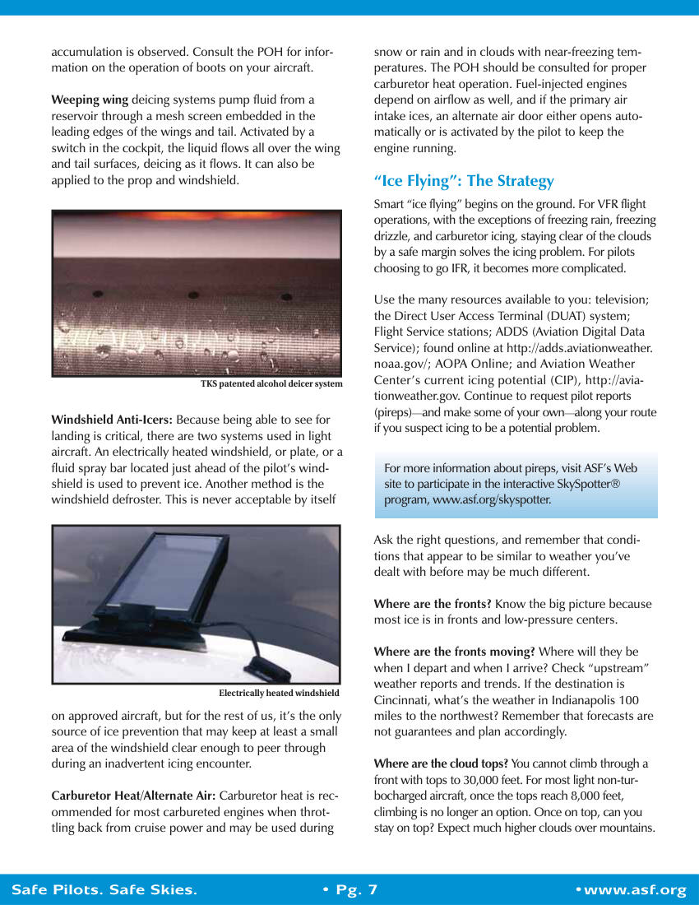

Safe Pilots. Safe Skies. 
• Pg. 7
•www.asf.org
accumulation is observed. Consult the POH for infor-
mation on the operation of boots on your aircraft.
Weeping wing deicing systems pump fluid from a
reservoir through a mesh screen embedded in the
leading edges of the wings and tail. Activated by a
switch in the cockpit, the liquid flows all over the wing
and tail surfaces, deicing as it flows. It can also be
applied to the prop and windshield.
Windshield Anti-Icers: Because being able to see for
landing is critical, there are two systems used in light
aircraft. An electrically heated windshield, or plate, or a
fluid spray bar located just ahead of the pilot’s wind-
shield is used to prevent ice. Another method is the
windshield defroster. This is never acceptable by itself
on approved aircraft, but for the rest of us, it’s the only
source of ice prevention that may keep at least a small
area of the windshield clear enough to peer through
during an inadvertent icing encounter.
Carburetor Heat/Alternate Air: Carburetor heat is rec-
ommended for most carbureted engines when throt-
tling back from cruise power and may be used during
snow or rain and in clouds with near-freezing tem-
peratures. The POH should be consulted for proper
carburetor heat operation. Fuel-injected engines
depend on airflow as well, and if the primary air
intake ices, an alternate air door either opens auto-
matically or is activated by the pilot to keep the
engine running. 
“Ice Flying”: The Strategy
Smart “ice flying” begins on the ground. For VFR flight
operations, with the exceptions of freezing rain, freezing
drizzle, and carburetor icing, staying clear of the clouds
by a safe margin solves the icing problem. For pilots
choosing to go IFR, it becomes more complicated.
Use the many resources available to you: television;
the Direct User Access Terminal (DUAT) system;
Flight Service stations; ADDS (Aviation Digital Data
Service); found online at http://adds.aviationweather.
noaa.gov/; AOPA Online; and Aviation Weather
Center’s current icing potential (CIP), http://avia-
tionweather.gov. Continue to request pilot reports
(pireps)—and make some of your own—along your route
if you suspect icing to be a potential problem.
Ask the right questions, and remember that condi-
tions that appear to be similar to weather you’ve
dealt with before may be much different.
Where are the fronts? Know the big picture because
most ice is in fronts and low-pressure centers.
Where are the fronts moving? Where will they be
when I depart and when I arrive? Check “upstream”
weather reports and trends. If the destination is
Cincinnati, what’s the weather in Indianapolis 100
miles to the northwest? Remember that forecasts are
not guarantees and plan accordingly.
Where are the cloud tops? You cannot climb through a
front with tops to 30,000 feet. For most light non-tur-
bocharged aircraft, once the tops reach 8,000 feet,
climbing is no longer an option. Once on top, can you
stay on top? Expect much higher clouds over mountains.
TKS patented alcohol deicer system
Electrically heated windshield
For more information about pireps, visit ASF’s Web
site to participate in the interactive SkySpotter® 
program, www.asf.org/skyspotter.

## Page 8

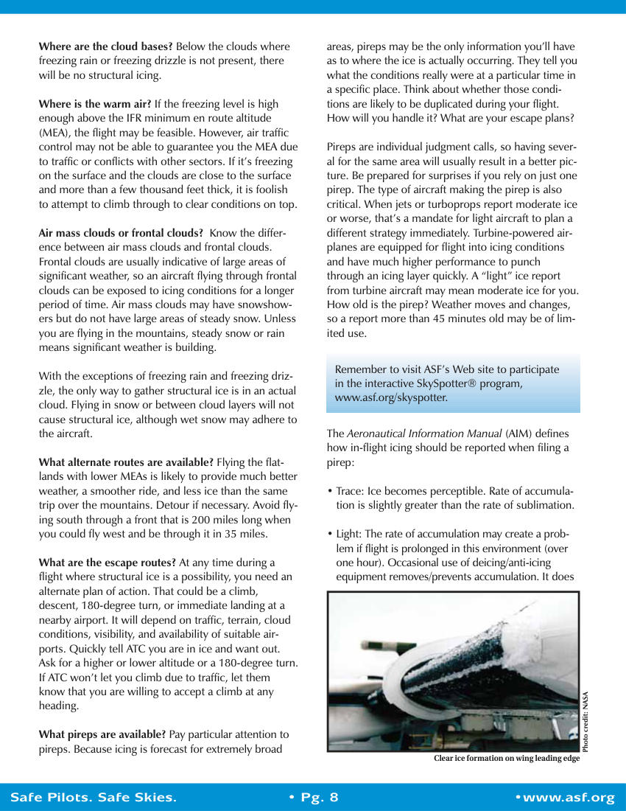

Safe Pilots. Safe Skies. 
• Pg. 8
•www.asf.org
Where are the cloud bases? Below the clouds where
freezing rain or freezing drizzle is not present, there
will be no structural icing.
Where is the warm air? If the freezing level is high
enough above the IFR minimum en route altitude
(MEA), the flight may be feasible. However, air traffic
control may not be able to guarantee you the MEA due
to traffic or conflicts with other sectors. If it’s freezing
on the surface and the clouds are close to the surface
and more than a few thousand feet thick, it is foolish
to attempt to climb through to clear conditions on top.
Air mass clouds or frontal clouds? Know the differ-
ence between air mass clouds and frontal clouds.
Frontal clouds are usually indicative of large areas of
significant weather, so an aircraft flying through frontal
clouds can be exposed to icing conditions for a longer
period of time. Air mass clouds may have snowshow-
ers but do not have large areas of steady snow. Unless
you are flying in the mountains, steady snow or rain
means significant weather is building.
With the exceptions of freezing rain and freezing driz-
zle, the only way to gather structural ice is in an actual
cloud. Flying in snow or between cloud layers will not
cause structural ice, although wet snow may adhere to
the aircraft. 
What alternate routes are available? Flying the flat-
lands with lower MEAs is likely to provide much better
weather, a smoother ride, and less ice than the same
trip over the mountains. Detour if necessary. Avoid fly-
ing south through a front that is 200 miles long when
you could fly west and be through it in 35 miles.
What are the escape routes? At any time during a
flight where structural ice is a possibility, you need an
alternate plan of action. That could be a climb,
descent, 180-degree turn, or immediate landing at a
nearby airport. It will depend on traffic, terrain, cloud
conditions, visibility, and availability of suitable air-
ports. Quickly tell ATC you are in ice and want out.
Ask for a higher or lower altitude or a 180-degree turn.
If ATC won’t let you climb due to traffic, let them
know that you are willing to accept a climb at any
heading.
What pireps are available? Pay particular attention to
pireps. Because icing is forecast for extremely broad
areas, pireps may be the only information you’ll have
as to where the ice is actually occurring. They tell you
what the conditions really were at a particular time in
a specific place. Think about whether those condi-
tions are likely to be duplicated during your flight.
How will you handle it? What are your escape plans? 
Pireps are individual judgment calls, so having sever-
al for the same area will usually result in a better pic-
ture. Be prepared for surprises if you rely on just one
pirep. The type of aircraft making the pirep is also
critical. When jets or turboprops report moderate ice
or worse, that’s a mandate for light aircraft to plan a
different strategy immediately. Turbine-powered air-
planes are equipped for flight into icing conditions
and have much higher performance to punch
through an icing layer quickly. A “light” ice report
from turbine aircraft may mean moderate ice for you.
How old is the pirep? Weather moves and changes,
so a report more than 45 minutes old may be of lim-
ited use.
The Aeronautical Information Manual (AIM) defines
how in-flight icing should be reported when filing a
pirep:
• Trace: Ice becomes perceptible. Rate of accumula-
tion is slightly greater than the rate of sublimation. 
• Light: The rate of accumulation may create a prob-
lem if flight is prolonged in this environment (over
one hour). Occasional use of deicing/anti-icing
equipment removes/prevents accumulation. It does
Clear ice formation on wing leading edge
Remember to visit ASF’s Web site to participate
in the interactive SkySpotter® program,
www.asf.org/skyspotter.
Photo credit: NASA

## Page 9

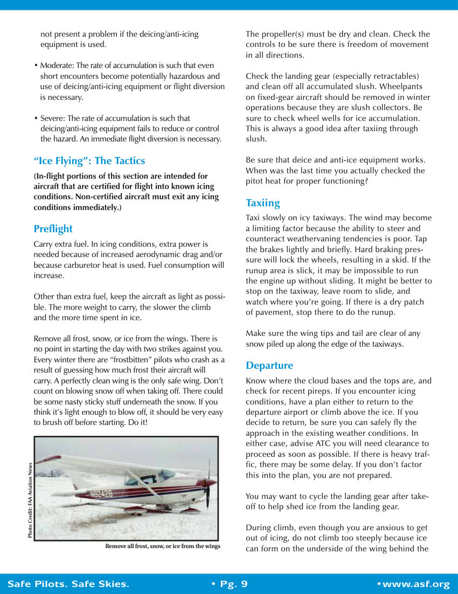

Safe Pilots. Safe Skies. 
• Pg. 9
•www.asf.org
not present a problem if the deicing/anti-icing 
equipment is used. 
• Moderate: The rate of accumulation is such that even
short encounters become potentially hazardous and
use of deicing/anti-icing equipment or flight diversion
is necessary. 
• Severe: The rate of accumulation is such that
deicing/anti-icing equipment fails to reduce or control
the hazard. An immediate flight diversion is necessary. 
“Ice Flying”: The Tactics 
(In-flight portions of this section are intended for 
aircraft that are certified for flight into known icing 
conditions. Non-certified aircraft must exit any icing
conditions immediately.)
Preflight
Carry extra fuel. In icing conditions, extra power is
needed because of increased aerodynamic drag and/or
because carburetor heat is used. Fuel consumption will
increase.
Other than extra fuel, keep the aircraft as light as possi-
ble. The more weight to carry, the slower the climb
and the more time spent in ice.
Remove all frost, snow, or ice from the wings. There is
no point in starting the day with two strikes against you.
Every winter there are “frostbitten” pilots who crash as a
result of guessing how much frost their aircraft will
carry. A perfectly clean wing is the only safe wing. Don’t
count on blowing snow off when taking off. There could
be some nasty sticky stuff underneath the snow. If you
think it’s light enough to blow off, it should be very easy
to brush off before starting. Do it!
The propeller(s) must be dry and clean. Check the
controls to be sure there is freedom of movement
in all directions.
Check the landing gear (especially retractables)
and clean off all accumulated slush. Wheelpants
on fixed-gear aircraft should be removed in winter
operations because they are slush collectors. Be
sure to check wheel wells for ice accumulation.
This is always a good idea after taxiing through
slush.
Be sure that deice and anti-ice equipment works.
When was the last time you actually checked the
pitot heat for proper functioning?
Taxiing
Taxi slowly on icy taxiways. The wind may become
a limiting factor because the ability to steer and
counteract weathervaning tendencies is poor. Tap
the brakes lightly and briefly. Hard braking pres-
sure will lock the wheels, resulting in a skid. If the
runup area is slick, it may be impossible to run
the engine up without sliding. It might be better to
stop on the taxiway, leave room to slide, and
watch where you’re going. If there is a dry patch
of pavement, stop there to do the runup.
Make sure the wing tips and tail are clear of any
snow piled up along the edge of the taxiways.
Departure
Know where the cloud bases and the tops are, and
check for recent pireps. If you encounter icing
conditions, have a plan either to return to the
departure airport or climb above the ice. If you
decide to return, be sure you can safely fly the
approach in the existing weather conditions. In
either case, advise ATC you will need clearance to
proceed as soon as possible. If there is heavy traf-
fic, there may be some delay. If you don’t factor
this into the plan, you are not prepared.
You may want to cycle the landing gear after take-
off to help shed ice from the landing gear.
During climb, even though you are anxious to get
out of icing, do not climb too steeply because ice
can form on the underside of the wing behind the
Remove all frost, snow, or ice from the wings
Photo Credit: FAA Aviation News

## Page 10

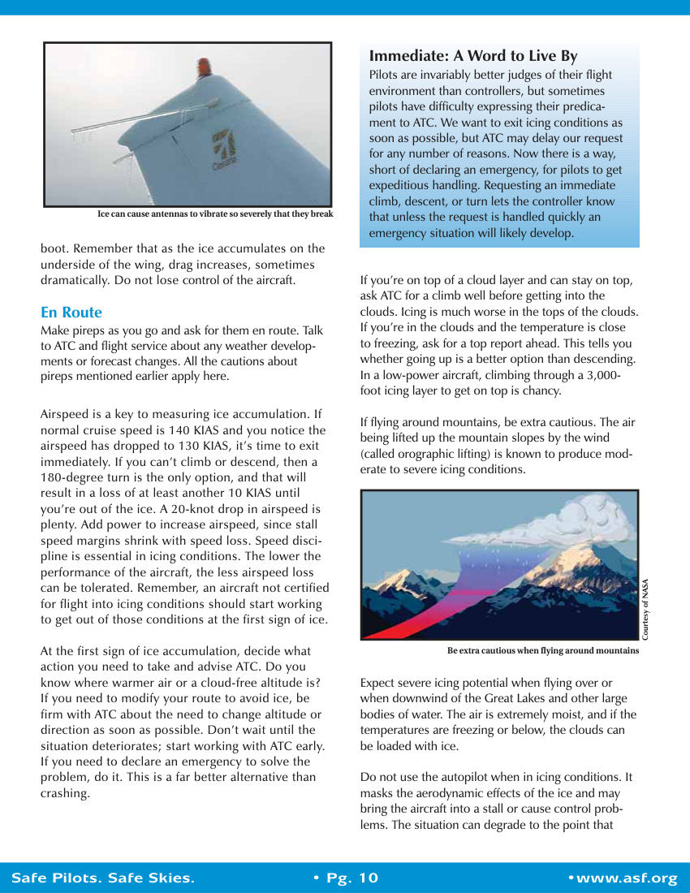

Safe Pilots. Safe Skies. 
• Pg. 10
•www.asf.org
If you’re on top of a cloud layer and can stay on top,
ask ATC for a climb well before getting into the
clouds. Icing is much worse in the tops of the clouds.
If you’re in the clouds and the temperature is close
to freezing, ask for a top report ahead. This tells you
whether going up is a better option than descending.
In a low-power aircraft, climbing through a 3,000-
foot icing layer to get on top is chancy.
If flying around mountains, be extra cautious. The air
being lifted up the mountain slopes by the wind
(called orographic lifting) is known to produce mod-
erate to severe icing conditions.
Expect severe icing potential when flying over or
when downwind of the Great Lakes and other large
bodies of water. The air is extremely moist, and if the
temperatures are freezing or below, the clouds can
be loaded with ice.
Do not use the autopilot when in icing conditions. It
masks the aerodynamic effects of the ice and may
bring the aircraft into a stall or cause control prob-
lems. The situation can degrade to the point that
boot. Remember that as the ice accumulates on the
underside of the wing, drag increases, sometimes
dramatically. Do not lose control of the aircraft.
En Route
Make pireps as you go and ask for them en route. Talk
to ATC and flight service about any weather develop-
ments or forecast changes. All the cautions about
pireps mentioned earlier apply here.
Airspeed is a key to measuring ice accumulation. If
normal cruise speed is 140 KIAS and you notice the
airspeed has dropped to 130 KIAS, it’s time to exit
immediately. If you can’t climb or descend, then a
180-degree turn is the only option, and that will
result in a loss of at least another 10 KIAS until
you’re out of the ice. A 20-knot drop in airspeed is
plenty. Add power to increase airspeed, since stall
speed margins shrink with speed loss. Speed disci-
pline is essential in icing conditions. The lower the
performance of the aircraft, the less airspeed loss
can be tolerated. Remember, an aircraft not certified
for flight into icing conditions should start working
to get out of those conditions at the first sign of ice.
At the first sign of ice accumulation, decide what
action you need to take and advise ATC. Do you
know where warmer air or a cloud-free altitude is?
If you need to modify your route to avoid ice, be
firm with ATC about the need to change altitude or
direction as soon as possible. Don’t wait until the
situation deteriorates; start working with ATC early.
If you need to declare an emergency to solve the
problem, do it. This is a far better alternative than
crashing.
Ice can cause antennas to vibrate so severely that they break
Immediate: A Word to Live By
Pilots are invariably better judges of their flight
environment than controllers, but sometimes
pilots have difficulty expressing their predica-
ment to ATC. We want to exit icing conditions as
soon as possible, but ATC may delay our request
for any number of reasons. Now there is a way,
short of declaring an emergency, for pilots to get
expeditious handling. Requesting an immediate
climb, descent, or turn lets the controller know
that unless the request is handled quickly an
emergency situation will likely develop.
Be extra cautious when flying around mountains
Courtesy of NASA

## Page 11

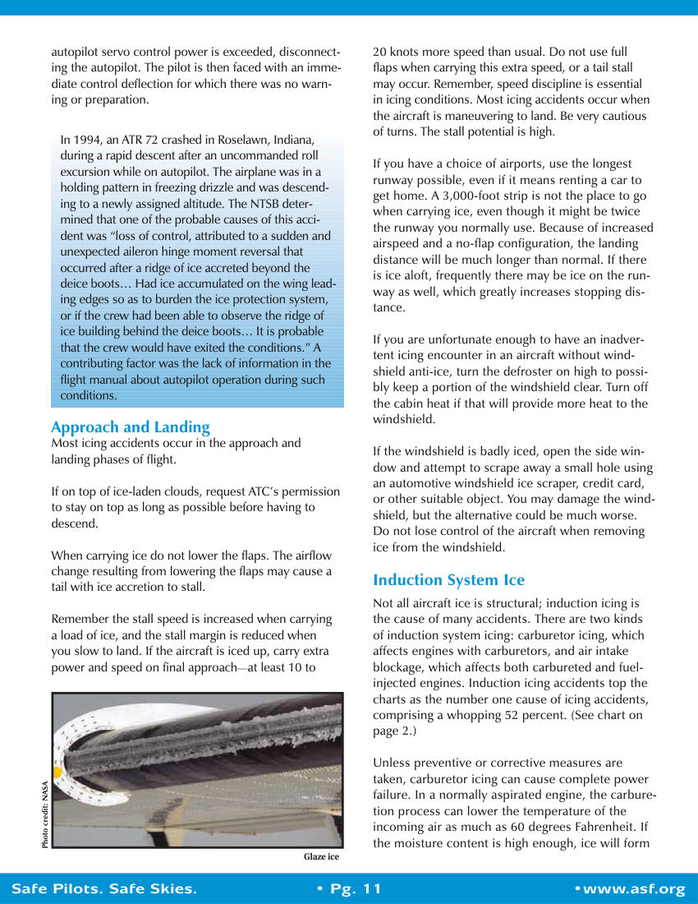

Safe Pilots. Safe Skies. 
• Pg. 11
•www.asf.org
autopilot servo control power is exceeded, disconnect-
ing the autopilot. The pilot is then faced with an imme-
diate control deflection for which there was no warn-
ing or preparation. 
Approach and Landing
Most icing accidents occur in the approach and 
landing phases of flight.
If on top of ice-laden clouds, request ATC’s permission
to stay on top as long as possible before having to
descend.
When carrying ice do not lower the flaps. The airflow
change resulting from lowering the flaps may cause a
tail with ice accretion to stall. 
Remember the stall speed is increased when carrying 
a load of ice, and the stall margin is reduced when
you slow to land. If the aircraft is iced up, carry extra
power and speed on final approach—at least 10 to 
20 knots more speed than usual. Do not use full 
flaps when carrying this extra speed, or a tail stall 
may occur. Remember, speed discipline is essential 
in icing conditions. Most icing accidents occur when
the aircraft is maneuvering to land. Be very cautious 
of turns. The stall potential is high.
If you have a choice of airports, use the longest
runway possible, even if it means renting a car to
get home. A 3,000-foot strip is not the place to go
when carrying ice, even though it might be twice
the runway you normally use. Because of increased
airspeed and a no-flap configuration, the landing
distance will be much longer than normal. If there
is ice aloft, frequently there may be ice on the run-
way as well, which greatly increases stopping dis-
tance.
If you are unfortunate enough to have an inadver-
tent icing encounter in an aircraft without wind-
shield anti-ice, turn the defroster on high to possi-
bly keep a portion of the windshield clear. Turn off
the cabin heat if that will provide more heat to the
windshield.
If the windshield is badly iced, open the side win-
dow and attempt to scrape away a small hole using
an automotive windshield ice scraper, credit card,
or other suitable object. You may damage the wind-
shield, but the alternative could be much worse.
Do not lose control of the aircraft when removing
ice from the windshield.
Induction System Ice
Not all aircraft ice is structural; induction icing is
the cause of many accidents. There are two kinds
of induction system icing: carburetor icing, which
affects engines with carburetors, and air intake
blockage, which affects both carbureted and fuel-
injected engines. Induction icing accidents top the
charts as the number one cause of icing accidents,
comprising a whopping 52 percent. (See chart on
page 2.)
Unless preventive or corrective measures are
taken, carburetor icing can cause complete power
failure. In a normally aspirated engine, the carbure-
tion process can lower the temperature of the
incoming air as much as 60 degrees Fahrenheit. If
the moisture content is high enough, ice will form
Glaze ice 
In 1994, an ATR 72 crashed in Roselawn, Indiana,
during a rapid descent after an uncommanded roll
excursion while on autopilot. The airplane was in a
holding pattern in freezing drizzle and was descend-
ing to a newly assigned altitude. The NTSB deter-
mined that one of the probable causes of this acci-
dent was “loss of control, attributed to a sudden and
unexpected aileron hinge moment reversal that
occurred after a ridge of ice accreted beyond the
deice boots… Had ice accumulated on the wing lead-
ing edges so as to burden the ice protection system,
or if the crew had been able to observe the ridge of
ice building behind the deice boots… It is probable
that the crew would have exited the conditions.” A
contributing factor was the lack of information in the
flight manual about autopilot operation during such
conditions.
Photo credit: NASA

## Page 12

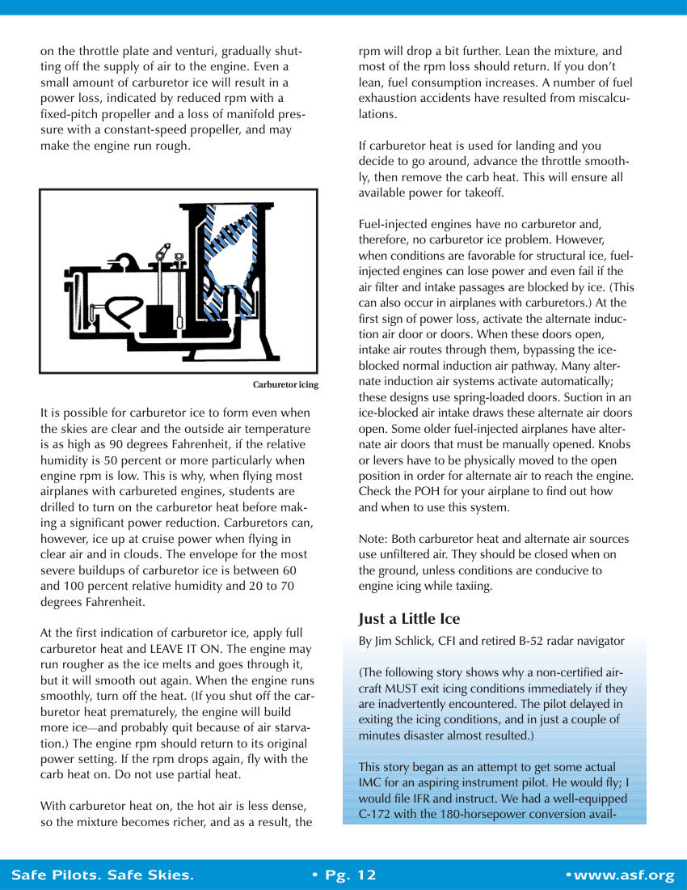

Safe Pilots. Safe Skies. 
• Pg. 12
•www.asf.org
on the throttle plate and venturi, gradually shut-
ting off the supply of air to the engine. Even a
small amount of carburetor ice will result in a
power loss, indicated by reduced rpm with a
fixed-pitch propeller and a loss of manifold pres-
sure with a constant-speed propeller, and may
make the engine run rough.
It is possible for carburetor ice to form even when
the skies are clear and the outside air temperature
is as high as 90 degrees Fahrenheit, if the relative
humidity is 50 percent or more particularly when
engine rpm is low. This is why, when flying most
airplanes with carbureted engines, students are
drilled to turn on the carburetor heat before mak-
ing a significant power reduction. Carburetors can,
however, ice up at cruise power when flying in
clear air and in clouds. The envelope for the most
severe buildups of carburetor ice is between 60
and 100 percent relative humidity and 20 to 70
degrees Fahrenheit.
At the first indication of carburetor ice, apply full
carburetor heat and LEAVE IT ON. The engine may
run rougher as the ice melts and goes through it,
but it will smooth out again. When the engine runs
smoothly, turn off the heat. (If you shut off the car-
buretor heat prematurely, the engine will build
more ice—and probably quit because of air starva-
tion.) The engine rpm should return to its original
power setting. If the rpm drops again, fly with the
carb heat on. Do not use partial heat.
With carburetor heat on, the hot air is less dense,
so the mixture becomes richer, and as a result, the
rpm will drop a bit further. Lean the mixture, and
most of the rpm loss should return. If you don’t
lean, fuel consumption increases. A number of fuel
exhaustion accidents have resulted from miscalcu-
lations.
If carburetor heat is used for landing and you
decide to go around, advance the throttle smooth-
ly, then remove the carb heat. This will ensure all
available power for takeoff.
Fuel-injected engines have no carburetor and,
therefore, no carburetor ice problem. However,
when conditions are favorable for structural ice, fuel-
injected engines can lose power and even fail if the
air filter and intake passages are blocked by ice. (This
can also occur in airplanes with carburetors.) At the
first sign of power loss, activate the alternate induc-
tion air door or doors. When these doors open,
intake air routes through them, bypassing the ice-
blocked normal induction air pathway. Many alter-
nate induction air systems activate automatically;
these designs use spring-loaded doors. Suction in an
ice-blocked air intake draws these alternate air doors
open. Some older fuel-injected airplanes have alter-
nate air doors that must be manually opened. Knobs
or levers have to be physically moved to the open
position in order for alternate air to reach the engine.
Check the POH for your airplane to find out how
and when to use this system.
Note: Both carburetor heat and alternate air sources
use unfiltered air. They should be closed when on
the ground, unless conditions are conducive to
engine icing while taxiing. 
Just a Little Ice
By Jim Schlick, CFI and retired B-52 radar navigator
(The following story shows why a non-certified air-
craft MUST exit icing conditions immediately if they
are inadvertently encountered. The pilot delayed in
exiting the icing conditions, and in just a couple of
minutes disaster almost resulted.)  
This story began as an attempt to get some actual
IMC for an aspiring instrument pilot. He would fly; I
would file IFR and instruct. We had a well-equipped
C-172 with the 180-horsepower conversion avail-
Carburetor icing

## Page 13

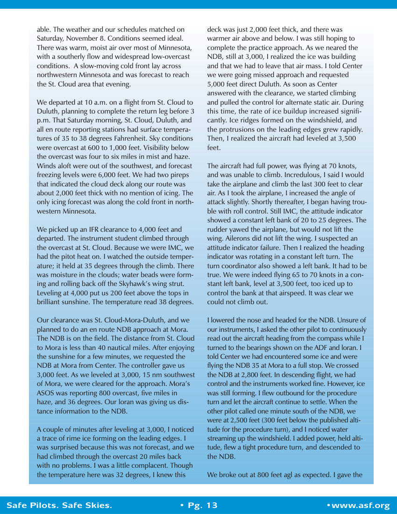

Safe Pilots. Safe Skies. 
• Pg. 13
•www.asf.org
able. The weather and our schedules matched on
Saturday, November 8. Conditions seemed ideal.
There was warm, moist air over most of Minnesota,
with a southerly flow and widespread low-overcast
conditions.  A slow-moving cold front lay across
northwestern Minnesota and was forecast to reach
the St. Cloud area that evening.
We departed at 10 a.m. on a flight from St. Cloud to
Duluth, planning to complete the return leg before 3
p.m. That Saturday morning, St. Cloud, Duluth, and
all en route reporting stations had surface tempera-
tures of 35 to 38 degrees Fahrenheit. Sky conditions
were overcast at 600 to 1,000 feet. Visibility below
the overcast was four to six miles in mist and haze.
Winds aloft were out of the southwest, and forecast
freezing levels were 6,000 feet. We had two pireps
that indicated the cloud deck along our route was
about 2,000 feet thick with no mention of icing. The
only icing forecast was along the cold front in north-
western Minnesota.
We picked up an IFR clearance to 4,000 feet and
departed. The instrument student climbed through
the overcast at St. Cloud. Because we were IMC, we
had the pitot heat on. I watched the outside temper-
ature; it held at 35 degrees through the climb. There
was moisture in the clouds; water beads were form-
ing and rolling back off the Skyhawk’s wing strut.
Leveling at 4,000 put us 200 feet above the tops in
brilliant sunshine. The temperature read 38 degrees.
Our clearance was St. Cloud-Mora-Duluth, and we
planned to do an en route NDB approach at Mora.
The NDB is on the field. The distance from St. Cloud
to Mora is less than 40 nautical miles. After enjoying
the sunshine for a few minutes, we requested the
NDB at Mora from Center. The controller gave us
3,000 feet. As we leveled at 3,000, 15 nm southwest
of Mora, we were cleared for the approach. Mora’s
ASOS was reporting 800 overcast, five miles in
haze, and 36 degrees. Our loran was giving us dis-
tance information to the NDB.
A couple of minutes after leveling at 3,000, I noticed
a trace of rime ice forming on the leading edges. I
was surprised because this was not forecast, and we
had climbed through the overcast 20 miles back
with no problems. I was a little complacent. Though
the temperature here was 32 degrees, I knew this
deck was just 2,000 feet thick, and there was
warmer air above and below. I was still hoping to
complete the practice approach. As we neared the
NDB, still at 3,000, I realized the ice was building
and that we had to leave that air mass. I told Center
we were going missed approach and requested
5,000 feet direct Duluth. As soon as Center
answered with the clearance, we started climbing
and pulled the control for alternate static air. During
this time, the rate of ice buildup increased signifi-
cantly. Ice ridges formed on the windshield, and
the protrusions on the leading edges grew rapidly.
Then, I realized the aircraft had leveled at 3,500
feet.
The aircraft had full power, was flying at 70 knots,
and was unable to climb. Incredulous, I said I would
take the airplane and climb the last 300 feet to clear
air. As I took the airplane, I increased the angle of
attack slightly. Shortly thereafter, I began having trou-
ble with roll control. Still IMC, the attitude indicator
showed a constant left bank of 20 to 25 degrees. The
rudder yawed the airplane, but would not lift the
wing. Ailerons did not lift the wing. I suspected an
attitude indicator failure. Then I realized the heading
indicator was rotating in a constant left turn. The
turn coordinator also showed a left bank. It had to be
true. We were indeed flying 65 to 70 knots in a con-
stant left bank, level at 3,500 feet, too iced up to
control the bank at that airspeed. It was clear we
could not climb out.
I lowered the nose and headed for the NDB. Unsure of
our instruments, I asked the other pilot to continuously
read out the aircraft heading from the compass while I
turned to the bearings shown on the ADF and loran. I
told Center we had encountered some ice and were
flying the NDB 35 at Mora to a full stop. We crossed
the NDB at 2,800 feet. In descending flight, we had
control and the instruments worked fine. However, ice
was still forming. I flew outbound for the procedure
turn and let the aircraft continue to settle. When the
other pilot called one minute south of the NDB, we
were at 2,500 feet (300 feet below the published alti-
tude for the procedure turn), and I noticed water
streaming up the windshield. I added power, held alti-
tude, flew a tight procedure turn, and descended to
the NDB.
We broke out at 800 feet agl as expected. I gave the

## Page 14

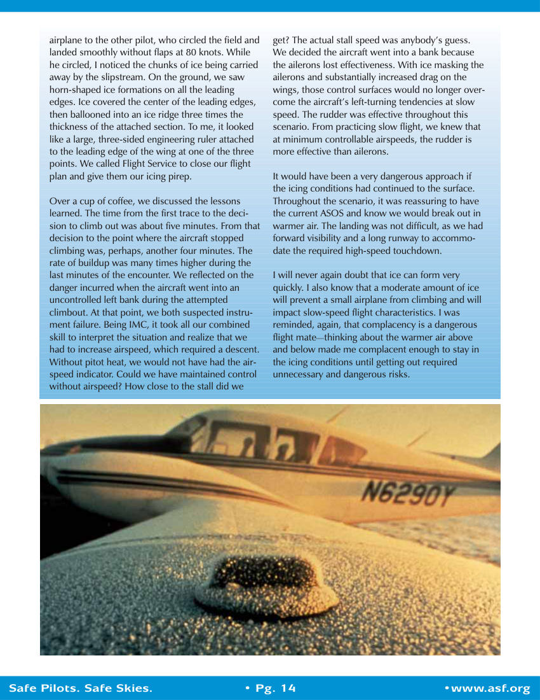

Safe Pilots. Safe Skies. 
• Pg. 14
•www.asf.org
airplane to the other pilot, who circled the field and
landed smoothly without flaps at 80 knots. While
he circled, I noticed the chunks of ice being carried
away by the slipstream. On the ground, we saw
horn-shaped ice formations on all the leading
edges. Ice covered the center of the leading edges,
then ballooned into an ice ridge three times the
thickness of the attached section. To me, it looked
like a large, three-sided engineering ruler attached
to the leading edge of the wing at one of the three
points. We called Flight Service to close our flight
plan and give them our icing pirep.
Over a cup of coffee, we discussed the lessons
learned. The time from the first trace to the deci-
sion to climb out was about five minutes. From that
decision to the point where the aircraft stopped
climbing was, perhaps, another four minutes. The
rate of buildup was many times higher during the
last minutes of the encounter. We reflected on the
danger incurred when the aircraft went into an
uncontrolled left bank during the attempted
climbout. At that point, we both suspected instru-
ment failure. Being IMC, it took all our combined
skill to interpret the situation and realize that we
had to increase airspeed, which required a descent.
Without pitot heat, we would not have had the air-
speed indicator. Could we have maintained control
without airspeed? How close to the stall did we
get? The actual stall speed was anybody’s guess.
We decided the aircraft went into a bank because
the ailerons lost effectiveness. With ice masking the
ailerons and substantially increased drag on the
wings, those control surfaces would no longer over-
come the aircraft’s left-turning tendencies at slow
speed. The rudder was effective throughout this
scenario. From practicing slow flight, we knew that
at minimum controllable airspeeds, the rudder is
more effective than ailerons.
It would have been a very dangerous approach if
the icing conditions had continued to the surface.
Throughout the scenario, it was reassuring to have
the current ASOS and know we would break out in
warmer air. The landing was not difficult, as we had
forward visibility and a long runway to accommo-
date the required high-speed touchdown.
I will never again doubt that ice can form very
quickly. I also know that a moderate amount of ice
will prevent a small airplane from climbing and will
impact slow-speed flight characteristics. I was
reminded, again, that complacency is a dangerous
flight mate—thinking about the warmer air above
and below made me complacent enough to stay in
the icing conditions until getting out required
unnecessary and dangerous risks.

## Page 15

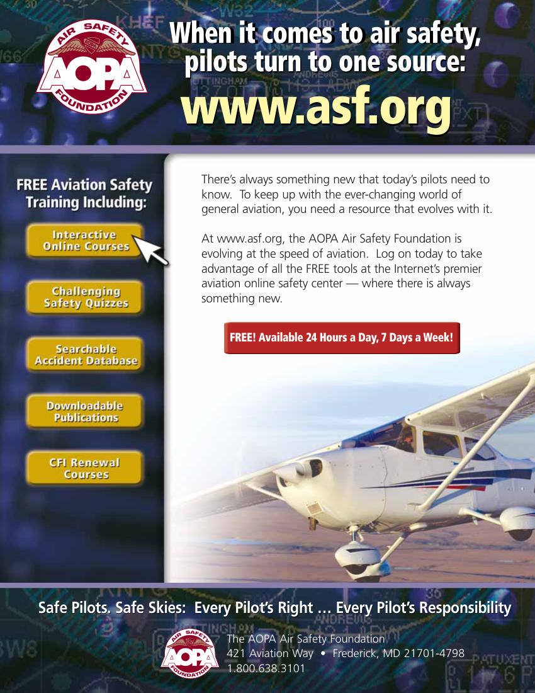

Safe Pilots. Safe Skies. 
• Pg. 15
•www.asf.org
There’s always something new that today’s pilots need to
know.  To keep up with the ever-changing world of
general aviation, you need a resource that evolves with it.
At www.asf.org, the AOPA Air Safety Foundation is
evolving at the speed of aviation.  Log on today to take
advantage of all the FREE tools at the Internet’s premier
aviation online safety center — where there is always
something new.
www.asf.org
www.asf.org
When it comes to air safety 
pilots turn to one source:
When it comes to air safety,
pilots turn to one source:
FREE! Available 24 Hours a Day, 7 Days a Week!
Safe Pilots. Safe Skies:  Every Pilot’s Right … Every Pilot’s Responsibility
Safe Pilots. Safe Skies:  Every Pilot’s Right … Every Pilot’s Responsibility
The AOPA Air Safety Foundation
421 Aviation Way  •  Frederick, MD 21701-4798
1.800.638.3101

## Page 16

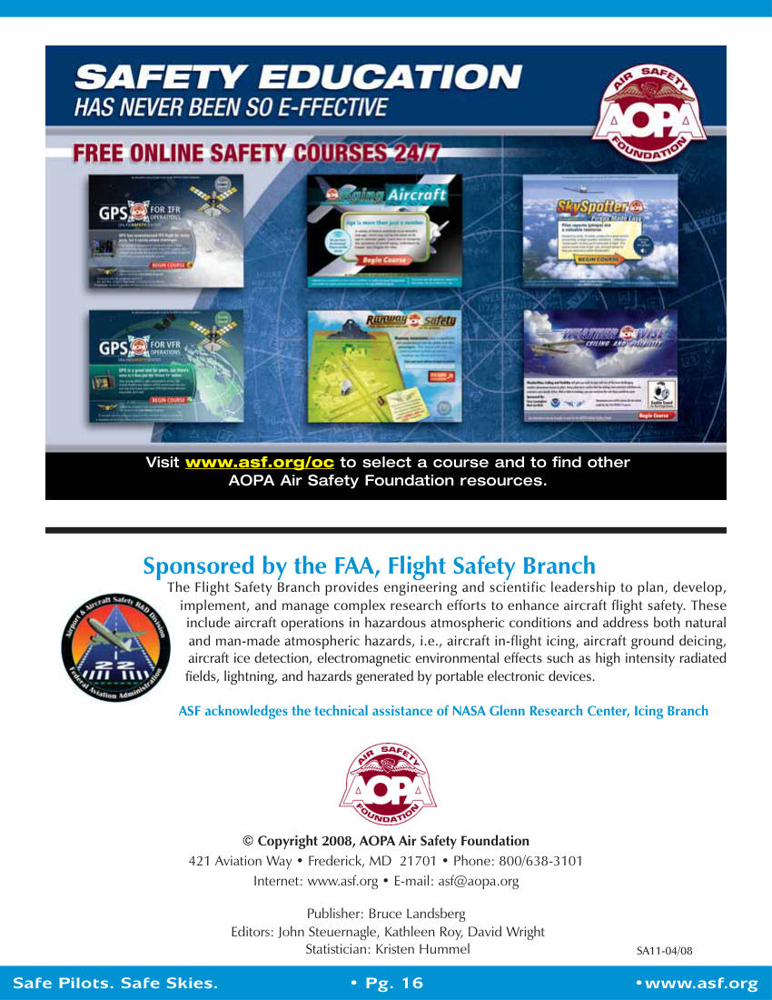

Safe Pilots. Safe Skies. 
• Pg. 16
•www.asf.org
Visit www.asf.org/oc to select a course and to find other 
AOPA Air Safety Foundation resources.
SA11-04/08
© Copyright 2008, AOPA Air Safety Foundation
421 Aviation Way • Frederick, MD  21701 • Phone: 800/638-3101 
Internet: www.asf.org • E-mail: asf@aopa.org
Publisher: Bruce Landsberg 
Editors: John Steuernagle, Kathleen Roy, David Wright
Statistician: Kristen Hummel
Sponsored by the FAA, Flight Safety Branch
The Flight Safety Branch provides engineering and scientific leadership to plan, develop, 
implement, and manage complex research efforts to enhance aircraft flight safety. These
include aircraft operations in hazardous atmospheric conditions and address both natural
and man-made atmospheric hazards, i.e., aircraft in-flight icing, aircraft ground deicing, 
aircraft ice detection, electromagnetic environmental effects such as high intensity radiated
fields, lightning, and hazards generated by portable electronic devices. 
ASF acknowledges the technical assistance of NASA Glenn Research Center, Icing Branch
