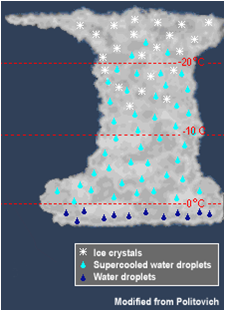
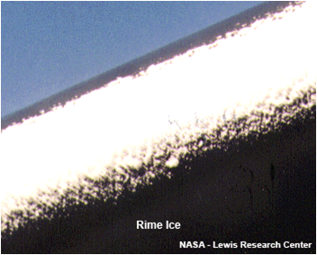
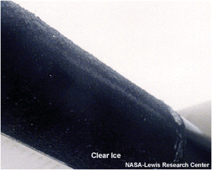
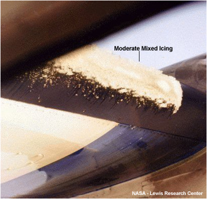
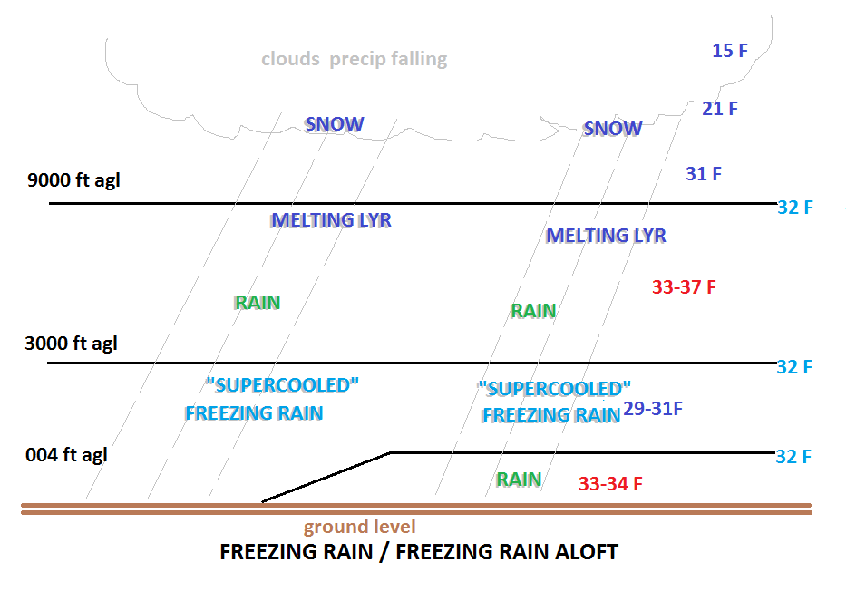
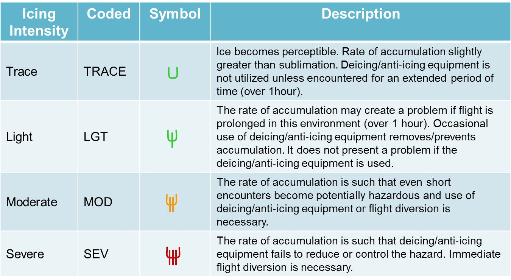
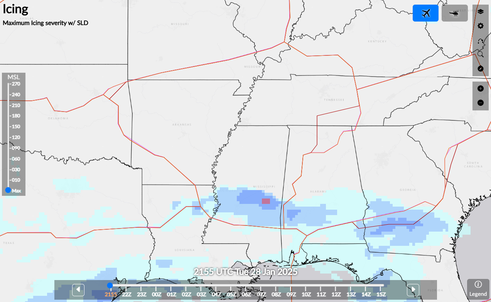
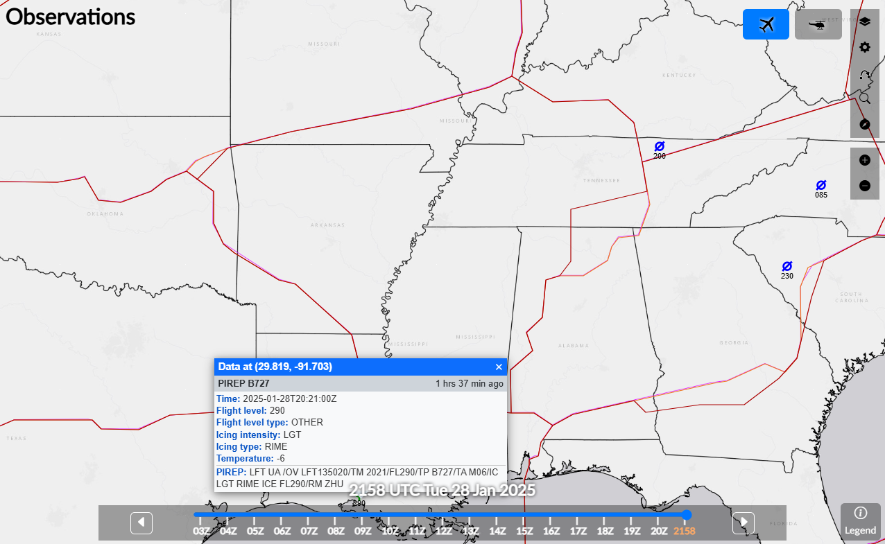
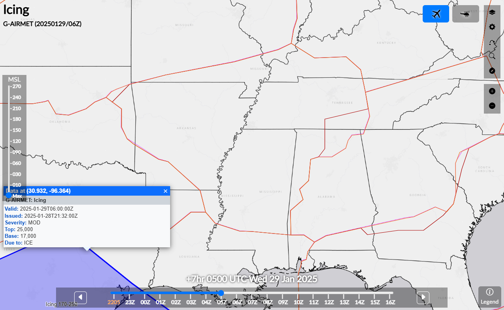

# Icing Tutorial — Tutorial 3

> Source: <https://www.weather.gov/zme/safety_ice>  
> Section: Icing  
> Captured: 2026-08-19 06:00 UTC  
> PDF: [icing-tutorial-tutorial-3.pdf](icing-tutorial-tutorial-3.pdf) · Original HTML: [source/original.html](source/original.html)

---

- [HOME](#)
- [FORECAST](https://www.weather.gov/forecastmaps/)

  - [Local](https://www.weather.gov)
  - [Graphical](https://digital.weather.gov)
  - [Aviation](https://aviationweather.gov)
  - [Marine](https://www.weather.gov/marine/)
  - [Rivers and Lakes](https://water.noaa.gov)
  - [Hurricanes](https://www.nhc.noaa.gov)
  - [Severe Weather](https://www.spc.noaa.gov)
  - [Fire Weather](https://www.weather.gov/fire/)
  - [Sunrise/Sunset](https://gml.noaa.gov/grad/solcalc/)
  - [Long Range Forecasts](https://www.cpc.ncep.noaa.gov)
  - [Climate Prediction](https://www.cpc.ncep.noaa.gov)
  - [Space Weather](https://www.swpc.noaa.gov)
- [PAST WEATHER](https://www.weather.gov/wrh/climate)

  - [Past Weather](https://www.weather.gov/wrh/climate)
  - [Astronomical Data](https://gml.noaa.gov/grad/solcalc/)
  - [Certified Weather Data](https://www.climate.gov/maps-data/dataset/past-weather-zip-code-data-table)
- [SAFETY](https://www.weather.gov/safety/)
- [INFORMATION](https://www.weather.gov/informationcenter)

  - [Wireless Emergency Alerts](https://www.weather.gov/wrn/wea)
  - [Weather-Ready Nation](https://www.weather.gov/wrn/)
  - [Brochures](https://www.weather.gov/owlie/publication_brochures)
  - [Cooperative Observers](https://www.weather.gov/coop/)
  - [Daily Briefing](https://www.weather.gov/briefing/)
  - [Damage/Fatality/Injury Statistics](https://www.weather.gov/hazstat)
  - [Forecast Models](http://mag.ncep.noaa.gov)
  - [GIS Data Portal](https://www.weather.gov/gis/)
  - [NOAA Weather Radio](https://www.weather.gov/nwr)
  - [Publications](https://www.weather.gov/publications/)
  - [SKYWARN Storm Spotters](https://www.weather.gov/skywarn/)
  - [StormReady](https://www.weather.gov/stormready)
  - [TsunamiReady](https://www.weather.gov/tsunamiready/)
  - [Service Change Notices](https://www.weather.gov/notification/)
- [EDUCATION](https://www.weather.gov/education/)
- [NEWS](https://www.weather.gov/news)
- [SEARCH](https://www.weather.gov/search/)

  - Search For

    NWS

    All NOAA
- [ABOUT](https://www.weather.gov/about/)

  - [About NWS](https://www.weather.gov/about/)
  - [Organization](https://www.weather.gov/organization)
  - [For NWS Employees](https://sites.google.com/a/noaa.gov/nws-insider/)
  - [National Centers](https://www.weather.gov/ncep/)
  - [Careers](https://www.noaa.gov/nws-careers)
  - [Contact Us](https://www.weather.gov/contact)
  - [Glossary](../../15-weather-glossaries/national-weather-service-glossary/national-weather-service-glossary.md)
  - [Social Media](https://www.weather.gov/socialmedia)
  - [NWS Transformation](https://www.noaa.gov/NWStransformation)

Local forecast by
"City, St" or ZIP code

Sorry, the location you searched for was not found. Please try another search.

Multiple locations were found. Please select one of the following:

[Location Help](javascript:void(window.open('https://www.weather.gov/ForecastSearchHelp.html','locsearchhelp','status=0,toolbar=0,location=0,menubar=0,directories=0,resizable=1,scrollbars=1,height=500,width=530').focus());)

#topnews.important {
background-color: #d2d2d2;
height: 100%;
margin-bottom: 5px;
position: relative;
}
#topnews .icon {
display: none;
}
#topnews.important .icon {
background-color: #135997;
display: table-cell;
height: 100%;
text-align: center;
vertical-align: middle;
width: 80px;
}
#topnews.important .body {
color: #141414;
display: table-cell;
padding: 10px;
}

# Severe Thunderstorms in the Central Plains and Lower Missouri Valley; Heat Continues in the Southeast and Southwest

Severe thunderstorms capable of large hail and damaging wind gusts are forecast to impact the central Plains into the Lower Missouri Valley through this afternoon. Dangerous heat persists across the southern Plains, Southeast U.S. and Puerto Rico this week, and will return to the Southwest today.
[Read More >](http://www.wpc.ncep.noaa.gov/discussions/hpcdiscussions.php?disc=pmdspd)

Memphis

Center Weather Service Unit

# safety\_ice

[Weather.gov](https://www.weather.gov)
> [Memphis](https://www.weather.gov/zme)
> safety\_ice

- [Current Hazards](#)

  - [SIGMETs](https://aviationweather.gov/gfa/?tab=sigmet&mapLayers=basicMap,firMap,artccHiMap&center=34.082,-90.243&zoom=6.5&autoRefresh=5&sigmetheights=1)
  - [G-AIRMETs](https://aviationweather.gov/gfa/?tab=gairmet&mapLayers=basicMap,firMap,artccHiMap&center=34.082,-90.243&zoom=6.5&autoRefresh=5&gairmettype=ifr,mtn-obs,llws,sfc-wind,turb-hi,turb-lo,icing&gairmetheights=1)
  - [ZME CWA's](https://aviationweather.gov/gfa/?tab=cwa&mapLayers=basicMap,firMap,artccHiMap&center=34.082,-90.243&zoom=6.5&autoRefresh=5)
  - [KMEM Airport Weather Warning (AWW)](https://www.weather.gov/zme/mem_aww)
  - [KHSV AWW](https://www.weather.gov/zme/hsv_aww)
  - [KJAN AWW](https://www.weather.gov/zme/jan_aww)
  - [ZME PIREP reports](https://aviationweather.gov/gfa/?tab=obs&mapLayers=basicMap,firMap,artccHiMap&center=34.082,-90.243&zoom=6.5&autoRefresh=5&er=1&layers=airep&airepage=2&airepbottom=180)
  - [Hazard Map](https://www.weather.gov/zse/OLv3?full&lat=35&lon=-90.5&zoom=7&map=topo&p=fcic,ar)
  - [Aviation Weather Center](http://www.aviationweather.gov/)
- [Current Conditions](#)

  - [Satellite](https://www.weather.gov/zme/satellite)
  - [Pireps](https://aviationweather.gov/gfa/?tab=obs&mapLayers=basicMap,firMap,artccHiMap&layers=airep&center=34.082,-90.243&zoom=6.5&autoRefresh=5&airepage=3)
  - [FAA Airport RVRs](http://rvr.fly.faa.gov/cgi-bin/rvr-status.pl)
  - [MEM Observations](https://www.weather.gov/wrh/timeseries?site=KMEM)
  - [BNA Observations](https://www.weather.gov/wrh/timeseries?site=Kbna)
  - [LIT Observations](https://www.weather.gov/wrh/timeseries?site=Klit)
  - [JAN Observations](https://www.weather.gov/wrh/timeseries?site=Kjan)
  - [HSV Observations](https://www.weather.gov/wrh/timeseries?site=Khsv)
  - [XNA Observations](https://www.weather.gov/wrh/timeseries?site=Kxna)
- [Radar](#)

  - [Regional Radar](https://www.weather.gov/zme/weatherradar?speed=0.4&mins=5&count=10&lt=34.98&ln=-90.5&zm=6.5&rad=1&ltg=0&vis=0&ir=0&fc=0&hover=0&size=0)
  - [Memphis - NQA](https://radar.weather.gov/?settings=v1_eyJhZ2VuZGEiOnsiaWQiOiJsb2NhbCIsImNlbnRlciI6Wy04OS44NzMsMzUuMzQ1XSwibG9jYXRpb24iOm51bGwsInpvb20iOjksImZpbHRlciI6IldTUi04OEQiLCJsYXllciI6InNyX2JyZWYiLCJzdGF0aW9uIjoiS05RQSJ9LCJhbmltYXRpbmciOmZhbHNlLCJiYXNlIjoic3RhbmRhcmQiLCJhcnRjYyI6ZmFsc2UsImNvdW50eSI6ZmFsc2UsImN3YSI6ZmFsc2UsInJmYyI6ZmFsc2UsInN0YXRlIjpmYWxzZSwibWVudSI6dHJ1ZSwic2hvcnRGdXNlZE9ubHkiOnRydWUsIm9wYWNpdHkiOnsiYWxlcnRzIjowLjgsImxvY2FsIjowLjYsImxvY2FsU3RhdGlvbnMiOjAuOCwibmF0aW9uYWwiOjAuNn19)
  - [Nashville - OHX](https://radar.weather.gov/?settings=v1_eyJhZ2VuZGEiOnsiaWQiOiJsb2NhbCIsImNlbnRlciI6Wy04Ni41NjMsMzYuMjQ3XSwiem9vbSI6OSwiZmlsdGVyIjoiV1NSLTg4RCIsImxheWVyIjoiYnJlZl9yYXciLCJzdGF0aW9uIjoiS09IWCIsInRyYW5zcGFyZW50Ijp0cnVlLCJhbGVydHNPdmVybGF5Ijp0cnVlLCJzdGF0aW9uSWNvbnNPdmVybGF5Ijp0cnVlfSwiYmFzZSI6InN0YW5kYXJkIiwiY291bnR5IjpmYWxzZSwiY3dhIjpmYWxzZSwic3RhdGUiOmZhbHNlLCJtZW51Ijp0cnVlLCJzaG9ydEZ1c2VkT25seSI6dHJ1ZX0%3D#/)
  - [Little Rock - LZK](https://radar.weather.gov/?settings=v1_eyJhZ2VuZGEiOnsiaWQiOiJsb2NhbCIsImNlbnRlciI6Wy05Mi4yNjUsMzQuNzYzXSwiem9vbSI6OSwiZmlsdGVyIjoiV1NSLTg4RCIsImxheWVyIjoiYnJlZl9yYXciLCJzdGF0aW9uIjoiS0xaSyIsInRyYW5zcGFyZW50Ijp0cnVlLCJhbGVydHNPdmVybGF5Ijp0cnVlLCJzdGF0aW9uSWNvbnNPdmVybGF5Ijp0cnVlfSwiYmFzZSI6InN0YW5kYXJkIiwiY291bnR5IjpmYWxzZSwiY3dhIjpmYWxzZSwic3RhdGUiOmZhbHNlLCJtZW51Ijp0cnVlLCJzaG9ydEZ1c2VkT25seSI6dHJ1ZX0%3D#/)
  - [Huntsville - HTX](https://radar.weather.gov/?settings=v1_eyJhZ2VuZGEiOnsiaWQiOiJsb2NhbCIsImNlbnRlciI6Wy04Ni4wODQsMzQuOTMxXSwiem9vbSI6OSwiZmlsdGVyIjoiV1NSLTg4RCIsImxheWVyIjoiYnJlZl9yYXciLCJzdGF0aW9uIjoiS0hUWCIsInRyYW5zcGFyZW50Ijp0cnVlLCJhbGVydHNPdmVybGF5Ijp0cnVlLCJzdGF0aW9uSWNvbnNPdmVybGF5Ijp0cnVlfSwiYmFzZSI6InN0YW5kYXJkIiwiY291bnR5IjpmYWxzZSwiY3dhIjpmYWxzZSwic3RhdGUiOmZhbHNlLCJtZW51Ijp0cnVlLCJzaG9ydEZ1c2VkT25seSI6dHJ1ZX0%3D#/)
  - [Fort Smith - SRX](https://radar.weather.gov/?settings=v1_eyJhZ2VuZGEiOnsiaWQiOiJsb2NhbCIsImNlbnRlciI6Wy05NC4zNjIsMzUuMjldLCJ6b29tIjo5LCJmaWx0ZXIiOiJXU1ItODhEIiwibGF5ZXIiOiJicmVmX3JhdyIsInN0YXRpb24iOiJLU1JYIiwidHJhbnNwYXJlbnQiOnRydWUsImFsZXJ0c092ZXJsYXkiOnRydWUsInN0YXRpb25JY29uc092ZXJsYXkiOnRydWV9LCJiYXNlIjoic3RhbmRhcmQiLCJjb3VudHkiOmZhbHNlLCJjd2EiOmZhbHNlLCJzdGF0ZSI6ZmFsc2UsIm1lbnUiOnRydWUsInNob3J0RnVzZWRPbmx5Ijp0cnVlfQ%3D%3D#/)
  - [Columbus AFB](https://radar.weather.gov/?settings=v1_eyJhZ2VuZGEiOnsiaWQiOiJsb2NhbCIsImNlbnRlciI6Wy04OC4zMjksMzMuODk3XSwiem9vbSI6OSwiZmlsdGVyIjoiV1NSLTg4RCIsImxheWVyIjoiYnJlZl9yYXciLCJzdGF0aW9uIjoiS0dXWCIsInRyYW5zcGFyZW50Ijp0cnVlLCJhbGVydHNPdmVybGF5Ijp0cnVlLCJzdGF0aW9uSWNvbnNPdmVybGF5Ijp0cnVlfSwiYmFzZSI6InN0YW5kYXJkIiwiY291bnR5IjpmYWxzZSwiY3dhIjpmYWxzZSwic3RhdGUiOmZhbHNlLCJtZW51Ijp0cnVlLCJzaG9ydEZ1c2VkT25seSI6dHJ1ZX0%3D#/)
  - [Jackson, MS - DGX](https://radar.weather.gov/?settings=v1_eyJhZ2VuZGEiOnsiaWQiOiJsb2NhbCIsImNlbnRlciI6Wy05MC4wMTYsMzIuMzU3XSwiem9vbSI6OSwiZmlsdGVyIjoiV1NSLTg4RCIsImxheWVyIjoiYnJlZl9yYXciLCJzdGF0aW9uIjoiS0RHWCIsInRyYW5zcGFyZW50Ijp0cnVlLCJhbGVydHNPdmVybGF5Ijp0cnVlLCJzdGF0aW9uSWNvbnNPdmVybGF5Ijp0cnVlfSwiYmFzZSI6InN0YW5kYXJkIiwiY291bnR5IjpmYWxzZSwiY3dhIjpmYWxzZSwic3RhdGUiOmZhbHNlLCJtZW51Ijp0cnVlLCJzaG9ydEZ1c2VkT25seSI6dHJ1ZX0%3D#/)
  - [Paducah, KY - PAH](https://radar.weather.gov/?settings=v1_eyJhZ2VuZGEiOnsiaWQiOiJsb2NhbCIsImNlbnRlciI6Wy04OC43NzIsMzcuMDY4XSwiem9vbSI6OSwiZmlsdGVyIjoiV1NSLTg4RCIsImxheWVyIjoiYnJlZl9yYXciLCJzdGF0aW9uIjoiS1BBSCIsInRyYW5zcGFyZW50Ijp0cnVlLCJhbGVydHNPdmVybGF5Ijp0cnVlLCJzdGF0aW9uSWNvbnNPdmVybGF5Ijp0cnVlfSwiYmFzZSI6InN0YW5kYXJkIiwiY291bnR5IjpmYWxzZSwiY3dhIjpmYWxzZSwic3RhdGUiOmZhbHNlLCJtZW51Ijp0cnVlLCJzaG9ydEZ1c2VkT25seSI6dHJ1ZX0%3D#/)
  - [NEXRAD Status](http://radar3pub.ncep.noaa.gov/)
- [Forecasts](#)

  - [MEM TRACON Cargo Briefing](https://www.weather.gov/images/zme/TRACONBriefing.png)
  - [Icing Products](https://aviationweather.gov/gfa/?tab=ice&mapLayers=basicMap,firMap,artccHiMap&center=34.082,-90.243&zoom=6.5&autoRefresh=5&layers=gairmet,weather,airep&level=max)
  - [High Turbulence Products](https://aviationweather.gov/gfa/?tab=turb&mapLayers=basicMap,firMap,artccHiMap&center=34.082,-90.243&zoom=6.5&autoRefresh=5&layers=gairmet,weather,airep,sigmet,cwa&level=%3E180)
  - [Low Turbulence Products](https://aviationweather.gov/gfa/?tab=turb&mapLayers=basicMap,firMap,artccHiMap&center=34.082,-90.243&zoom=6.5&autoRefresh=5&layers=gairmet,weather,airep,sigmet,cwa&level=%3C180)
  - [WPC Analysis](https://www.weather.gov/zme/sfc_analysis)
  - [SREF Guidance](http://www.spc.noaa.gov/exper/sref/sref.php?run=latest&id=SREF_PROB_TRW_CALIBRATED_HRLY__)
  - [MEM TAF TDA](https://www.weather.gov/zme/tda)
  - [Memphis WFO](http://www.weather.gov/meg/)
  - [MEM RAP Winds](https://www.weather.gov/zme/rucwinds?site=mem&height=10&output=barb&table=yes&tailwind=no&runway=00&model=rap&tooltips=on)
  - [BNA RAP Winds](https://www.weather.gov/zme/rucwinds?site=bna&height=10&output=barb&table=yes&tailwind=no&runway=00&model=rap&tooltips=on)
  - [SPC HREF Ensemble](https://www.spc.noaa.gov/exper/href/index.php?model=href&product=cref_members&sector=conus)
  - [HRRR Guidance](https://rapidrefresh.noaa.gov/hrrr/HRRR/Welcome.cgi)
  - [Numerical Data](https://www.weather.gov/zme/model)
  - [Space Weather](http://www.swpc.noaa.gov/communities/aviation-community-dashboard)
- [Strategic Planning Aids](#)

  - [Pre-Duty Weather Briefing](https://www.weather.gov/zme/predutyweatherbriefing)
  - [TCF](https://www.weather.gov/zme/tcf)
  - [Airport Delays](http://www.fly.faa.gov/flyfaa/usmap.jsp)
  - [Playbooks](http://www.weather.gov/nwsexit.php?site=zme&url=http://www.fly.faa.gov/PLAYBOOK/pbindex.html)
  - [NAS Status](https://www.fly.faa.gov/ois/?legacy=true)
  - [FAA - Airport Demand](https://www.fly.faa.gov/aadc/)
- [Tactical Planning Aids](#)

  - [Low Level Winds - MEM](https://www.weather.gov/zse/ZSEModelVWP?site=kmem&height=02&output=barb&table=yes&tailwind=no&runway=00&model=multiple&tooltips=on#ZSEcontent)
  - [Memphis TRACON Briefing Page](https://www.weather.gov/zme/pdwb_mem)
  - [Nashville TRACON Briefing Page](https://www.weather.gov/zme/pdwb_bna)
  - [Little Rock TRACON Briefing Page](https://www.weather.gov/zme/pdwb_lit)
  - [Jackson TRACON Briefing Page](https://www.weather.gov/zme/pdwb_jan)
  - [Ft. Smith TRACON Briefing Page](https://www.weather.gov/zme/pdwb_fsm)
  - [Fayetteville/NW Arkansas TRACON Briefing Page](https://www.weather.gov/zme/pdwb_rzc)
  - [Huntsville TRACON Briefing Page](https://www.weather.gov/zme/pdwb_hsv)
  - [MEM Experimental TS Gate Guidance](https://aviationweather.gov/api/plot/gate_plot?arpt=KMEM)
  - [Tower Forecasts with PDWB](https://www.weather.gov/zme/PDWB_sites)
- [Additional Info](#)

  - [National Forecast Maps](https://www.weather.gov/forecastmaps/)
  - [Aviation Safety](https://www.weather.gov/zme/safety)
  - [About us](https://www.weather.gov/zme/aboutus)
  - [Other CWSUs](https://www.weather.gov/aviation/cwsu)
  - [WFO Resource page](https://www.weather.gov/zme/resourcepage)
  - [Storm Prediction Center](http://www.spc.noaa.gov/)
  - [National Hurricane Center](http://www.nhc.noaa.gov/)
  - [Weather Prediction Center](http://www.wpc.ncep.noaa.gov/)
  - [Climate Prediction Center](http://www.cpc.ncep.noaa.gov/)
  - [NWS EDD](https://digital.weather.gov/)
  - [Miscellaneous](https://www.weather.gov/zme/page2)

Return to [Safety Homepage](https://www.weather.gov/zme/safety)

**Icing**

Icing can occur if an airplane passes through a cloud when the air temperature is at or below freezing.  This can happen during widespread rain, scattered showers, or even in a thunderstorm.

 

This is hazardous to flight because it can increase drag and weight on the aircraft and also decrease lift.  All of these effects can degrade the ability of the aircraft to maintain altitude.

**Common Types of Icing**

****

**Rime Icing** occurs whentiny supercooled water droplets freeze onto a surface that is below freezing (typically an airplane wing or pitot tube).  This tends to be nuisance rime that becomes a rough surface, although accumulation on the pitot tube can lead to instrument failure.  It is the most common type of icing.**

****

**Clear Icing** occurs as a result of Supercooled Large Drops (SLD) in a cloud.  These are large raindrops that have cooled to below 0ºC, but are still liquid.  When they come into contact with a solid object (like an airplane wing), they can accumulate rapidly as large sheets of ice.  This can be very hazardous because they can disrupt the air flow and reduce lift on an aircraft.  More importantly, it can spread beyond the reach of de-icing equipment on the aircraft and can be difficult for a pilot to see.**

****

**Mixed Icing** is when both clear and rime ice occur at the same time.

**Other Types of Icing**

**Freezing Rain**:  Icing can also occur when a plane is on or near the ground, as a result of freezing rain.  During the winter season, the atmosphere can set up such that a warm layer (about 38ºF/3ºC and about 5000ft thick) can ride over top of a shallow cold layer (30ºF/-1ºC and 3000ft thick) near the ground.  This creates a very strong inversion. Ice crystals forming in the upper atmosphere fall through through the warm layer and melt to become liquid.  Finally, the liquid falls through the cold temperatures and re-freezes on contact with surfaces on the ground (such as an airplane wing).

**High-Altitude Ice Crystals** This rare type of ice can be hazardous if ingested at high altitudes.  It usually occurs in or near convective weather, such as thunderstorms, in a tropical environment at high altitudes (FL250-FL350).  Unlike supercooled drops or droplets, ice crystals do not accumulate on the airframe.  Rather, they can partially melt and stick to relatively warm internal engine surfaces.  This can cause engine flameouts, a surge (and subsequent stall), or engine damage.  If it occurs, it should be reported as "ice crystal icing", so as not to be confused with typical ice accumulation. (Video courtesy of [NASA Glenn Research Center](https://www.nasa.gov/centers/glenn/aeronautics/frigid_heat.html))

**Icing Intensity**

There are varying intensities of icing.  If icing occurs, it should be reported as Trace, Light, Moderate or Severe.

Here's a link to a tool that forecasters use to determine icing severity and probability:

To avoid areas of icing, look for any reports of icing and AIRMETs on the route of flight before departure.  While in flight, listen for hazardous weather messages and other pilot reports of icing. AIRMETs are issued for areas of moderate icing, while SIGMETs are issued for areas of severe icing.

 

For a current display of PIREPs, [click here](https://aviationweather.gov/gfa/?mapLayers=basicMap,firMap,artccHiMap,artccLoMap&center=34.172,-89.87&zoom=6.5&autoRefresh=5&layers=airep&aireptype=icing&airepage=2).

For a current display of AIRMETs in effect, [click here](https://aviationweather.gov/gfa/?tab=gairmet&mapLayers=basicMap,firMap,artccHiMap,artccLoMap&center=34.172,-89.87&zoom=6.5&autoRefresh=5&gairmettype=icing&gairmetheights=1).

## [Turbulence](https://www.weather.gov/zme/safety_turb "Turbulence")

## [Thunderstorms](https://www.weather.gov/zme/safety_ts "Thunderstorms")

## [Icing](icing-tutorial-tutorial-3.md "Icing")

## [Ceiling and Visibility](https://www.weather.gov/zme/safety_cigvis "Ceiling and Visibility")

## [LLWS](https://www.weather.gov/zme/safety_llws "LLWS")

## [Density Altitude](https://www.weather.gov/zme/safety_da "Density Altitude")

[  Follow us on Facebook](https://www.facebook.com/CWSUMemphis)

[  ZME RSS Feed](https://www.weather.gov/rss_page.php?site_name=zme)

[US Dept of Commerce](http://www.commerce.gov)
[National Oceanic and Atmospheric Administration](http://www.noaa.gov)
[National Weather Service](https://www.weather.gov)
Memphis
 3229 Democrat Road
Memphis, TN 38118

[Comments? Questions? Please Contact Us.](mailto:nws.zme@noaa.gov)

[Disclaimer](https://www.weather.gov/disclaimer)
[Information Quality](http://www.cio.noaa.gov/services_programs/info_quality.html)
[Help](https://www.weather.gov/help)
[Glossary](https://www.weather.gov/glossary)

[Privacy Policy](https://www.weather.gov/privacy)
[Freedom of Information Act (FOIA)](https://www.noaa.gov/foia-freedom-of-information-act)
[About Us](https://www.weather.gov/about)
[Career Opportunities](https://www.weather.gov/careers)
