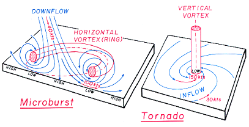
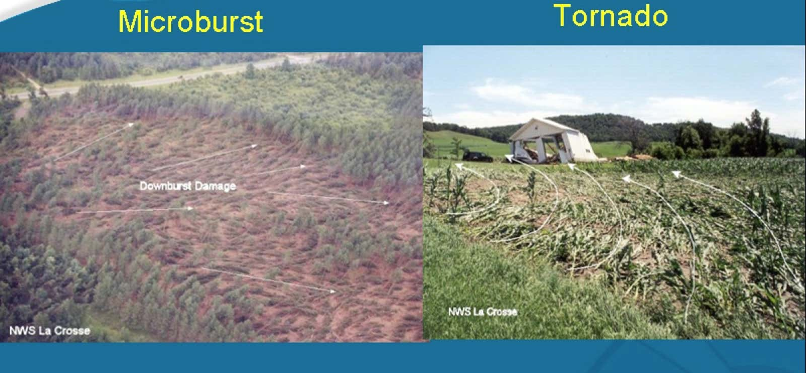
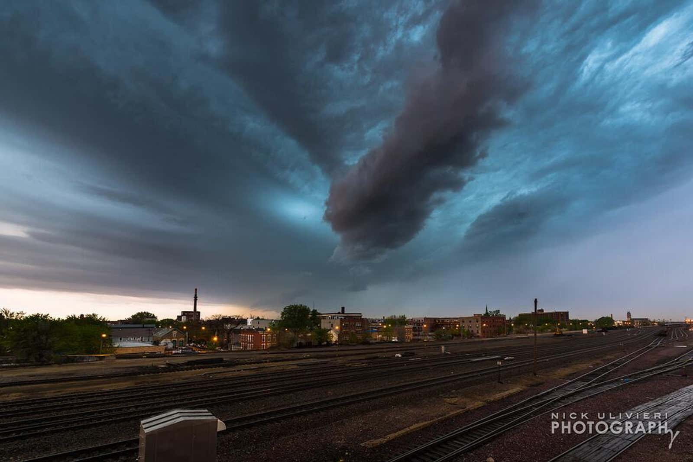

# Downburst Tutorial #1 — Downburst Tutorial #2

> Source: <http://www.weather.com/storms/severe/news/downbursts-macrobursts-microbursts-tornadoes>  
> Section: Thunderstorms  
> Captured: 2026-08-19 06:00 UTC  
> PDF: [downburst-tutorial-1-downburst-tutorial-2.pdf](downburst-tutorial-1-downburst-tutorial-2.pdf) · Original HTML: [source/original.html](source/original.html)

---

[The Weather Company](http://www.weather.com/)

- [Today

  Forecasts](http://www.weather.com/weather/today/l/)
- [Radar

  Radar](http://www.weather.com/weather/radar/interactive/l/)
- [Home

  News](http://www.weather.com/news)
- [Explore](http://www.weather.com/explore)
- Overflow Menu Horizontal

  More

- [User Avatar

  Sign in](http://www.weather.com/login)
- [lightning

  Get PremiumUpgrade

  Chevron Right](http://www.weather.com/subscribe/checkout?products=e251f39b-afd7-4ad9-9c87-5e2a8ed63fbb&tpcc=mktg-leftrail-menu-upgrade)

Advertisement

[Severe Weather](http://www.weather.com/storms/severe)

# Downbursts, Macrobursts, Microbursts: Just as Damaging as Tornadoes

## Downbursts, Macrobursts, Microbursts: Just as Damaging as Tornadoes

ByChrissy Warrilow•April 26, 2015Updated: April 26, 2015, 12:27 pm EDTPublished: April 26, 2015, 12:27 pm EDT

When severe thunderstorms impact an area, many times the weather produces damaging winds that down trees and power lines.

Weather in your inbox

Forecast Location

Sign Up

By signing up you agree to the [Terms](http://www.weather.com/privacy/terms-of-use) & [Privacy Policy](http://www.weather.com/privacy/privacy-policy). Unsubscribe at any time.

Animated gif of a downburst. (Courtesy: NWS Birmingham)

Often, the damage is so severe or extensive, it is difficult to fathom that anything other than a tornado produced the damage. Yet, there are straight-line wind features, called downbursts, that can be just as damaging as tornadoes.

## Get More of Our News on Google

Set The Weather Company as a 'Preferred Source' to get quicker access to the news you value.

### What Is a Downburst?

A downburst is an area of strong, downward moving air associated with a downdraft from a thunderstorm. As the downdraft impacts the ground, the air is forced outwards in all directions while it also curls backwards. This results in incredible wind damage close to the surface of the ground, as well as horizontal rotation midway up between the ground and the base of the thundercloud.

Often, downbursts can produce straight-line wind damage over an area as small as 1 mile to as large as 250 miles from the center of the downdraft.

In fact, a downburst that spans a distance less than 2.5 miles in diameter is considered a *microburst*.

**(WATCH:** [**Dramatic Microburst Caught on Camera by Australian Farmer**](https://www.weather.com/science/nature/news/microburst-caught-on-camera)**)**

Schematic of a microburst. (NWS)

Microbursts last for about five minutes and can [cause wind speeds in excess of 160 mph](http://www.srh.noaa.gov/jetstream/tstorms/wind.htm). Because of their extremely fast winds, incredible wind shear and relatively small size, microbursts prove hazardous to aircraft and have been the cause of tragic airplane crashes, including the [1985 Delta Airlines Flight 191 crash in Dallas-Fort Worth](http://lessonslearned.faa.gov/ll_main.cfm?TabID=1&LLID=32&LLTypeID=2).

Conversely, downbursts that span greater than 2.5 miles in radius are called *macrobursts.* Macrobursts can last nearly half an hour and produce wind speeds in excess of 130 mph. According to NOAA, [macrobursts can produce wind damage comparable to an EF-3 tornado](http://www.srh.noaa.gov/jetstream/tstorms/wind.htm).

When the downdraft hits the ground, the air is forced to spread outwards in all directions, causing extremely powerful and damaging winds to fan out in all directions.

Radar imagery depicting two downbursts. (Source: NWS Sioux Falls)

Meteorologists detect microbursts on radar by identifying areas of divergence or wind quickly moving away from a central point.

Visually, this diverging behavior is represented on Doppler radar velocity displays by bright red and green pixels, indicating high wind speeds, that are nearby but not circulating into each other.

In other words, a downburst will appear as a circular area that is half red (which denotes air moving away from the radar) and half green (which denotes air moving towards the radar). Importantly, these bright colors must be aligned along the same radar beam, with the green half closer to the radar site and the red half farther away. If bright red and green colors are close together but are instead side-by-side an equal distance from the radar, it's a signature of rotation and a possible tornado.

**Downbursts vs. Tornadoes: Similarities and Differences**

Schematic difference between a tornado and a downburst. (NWS)

Compare and contrast the wind damage caused by a downburst (left) and a tornado (right). (Courtesy NWS La Crosse)

There are a few similarities between downbursts and tornadoes:

- Both are parented by severe thunderstorms
- Both can form rapidly
- Both have the potential to produce very high wind speeds, and therefore significant wind damage

However, there are siginificant differences between downbursts and tornadoes:

- Tornadoes form within the interaction of warm, moist updrafts pulled higher into the thundercloud while rain-cooled, dry air descends from the thundercloud. Rotation present during this interaction forms a swirling vortex seen as the tornado
- Damage patterns from tornadoes show the swirl, or rotating wind patterns that drive the tornado
- Downbursts form when super-cooled air within a thundercloud sinks rapidly down towards the ground
- When this air makes impact with the ground, it is forced to spread, or fan out, in all directions. The resulting wind damage lacks the distinctive rotating swirl of a tornado, but rather looks like a straight line of wind had raked through the area

According to the [National Storm Damage Center](https://stormdamagecenter.org/storm-damage-insurance-faqs.php), an independent consumer advocacy organization founded to help homeowners affected by violent storms, most homeowners' insurance policies cover damage from storms, no matter whether the damage was caused by a tornado, straight-line winds or hail. Keep this in mind the next time a microburst or a macroburst blows through your area.

**MORE ON WEATHER.COM:** [**Scud Clouds, Shelf Clouds, And Other "Faux-Nadoes"**](https://www.weather.com/news/news/thats-not-a-tornado-20130307)

1/17

### Scud Cloud

Nick Ulivieri snapped this photo of a 'faux tornado' above the skies of Chicago, Ill. In actuality, the cloud was not a tornado but rather a harmless scud cloud. (Photo: Nick Ulivieri/@ChiPhotoGuy)

Loading comments...

Advertisement

- 
- 
- 
- 

**The Weather Channel is the world's most accurate forecaster** according to ForecastWatch, [Global and Regional Weather Forecast Accuracy Overview](https://forecastwatch.com/AccuracyOverview2021-2024), 2021-2024, commissioned by The Weather Company.

Weather Channel.

Privacy & Legal

- [Terms of Use](http://www.weather.com/privacy/terms-of-use)
- [Privacy Policy](http://www.weather.com/privacy/privacy-policy)
- [Data Rights](http://www.weather.com/data-rights)
- [Privacy Settings](http://www.weather.com/privacy-settings)
- [Cookie Notice

  External Link](http://www.weather.com/en-US/privacy/privacy-policy#data-collection-outside-our-consumer-weather-products)
- [Data Vendors](http://www.weather.com/data-vendors)
- [AdChoices

  ](http://www.weather.com/services/ad-choices)
- [Accessibility Statement](http://www.weather.com/accessibility-statement)
- [California Notice](http://www.weather.com/en-US/privacy/privacy-policy#2-california-consumer-privacy-act-ccpa-notice)
- [Do Not Sell or Share My Personal Information](http://www.weather.com/privacy-settings#do-not-sell)
- [Community Guidelines

  External Link](http://www.weather.com/privacy/community-guidelines)

More

- [Mission](http://www.weather.com/mission)
- [Newsletter Sign Up](https://weather.com/newsletters?cm_ven=dnt_newsletter_footer)
- [Feedback

  External Link](http://support.weather.com?language=en_US)
- [Careers

  External Link](https://www.weathercompany.com/careers)
- [News Room

  External Link](https://www.weathercompany.com/newsroom)
- [Advertise With Us

  External Link](https://www.weathercompany.com/advertising/)
- [TV

  External Link](https://www.weathergroup.com/brands/the-weather-channel/)
- [Weather Data APIs

  External Link](https://www.weathercompany.com/weather-data-apis/)
- [Alexa Skill

  External Link](https://www.amazon.com/The-Weather-Company-Channel/dp/B07YPYHQ1Q)
- [Weather Labs

  External Link](https://labs.weather.com)
- [Atmosphere](http://www.weather.com/atmosphere)
- [Sitemap](http://www.weather.com/sitemap)

- [Facebook](https://www.facebook.com/TheWeatherChannel)
- [Twitter](http://www.twitter.com/weatherchannel)
- [Instagram](http://instagram.com/weatherchannel)
- [YouTube](http://www.youtube.com/user/TheWeatherChannel/)

© The Weather Company, LLC 2026

- 
- 
