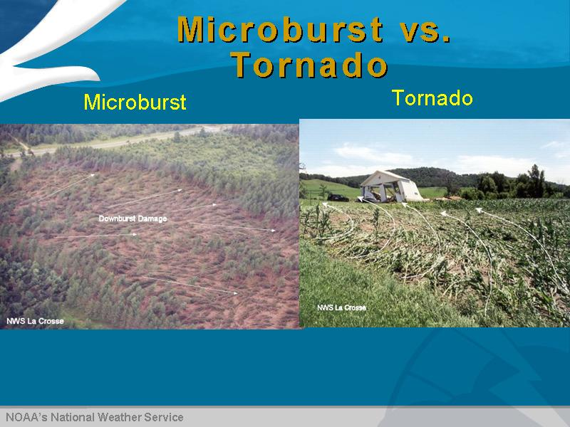
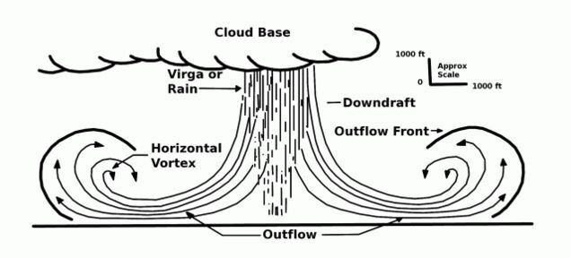
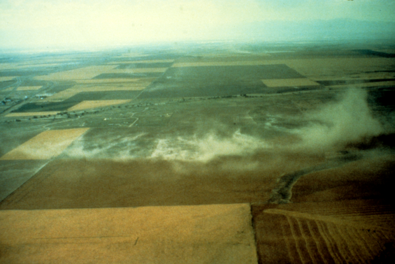
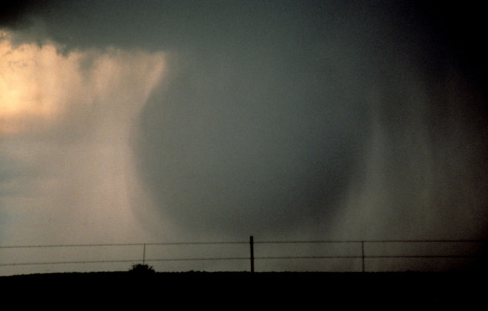
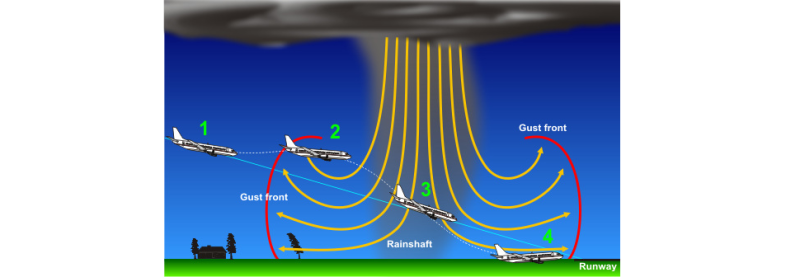

# Downburst Tutorial #1

> Source: <http://thevane.gawker.com/explaining-microbursts-one-of-natures-most-dangerous-w-1643929336>  
> Section: Thunderstorms  
> Captured: 2026-08-19 06:00 UTC (via Wayback Machine: https://web.archive.org/web/20160121120515/http://thevane.gawker.com/explaining-microbursts-one-of-natures-most-dangerous-w-1643929336)  
> PDF: [downburst-tutorial-1.pdf](downburst-tutorial-1.pdf) · Original HTML: [source/original.html](source/original.html)

---

[Log in / Sign up](#)

- [Follow The Vane](#)[Following The Vane](#)

- Blogs you may like
- [Deadspin](http://deadspin.com)
- [Gawker](http://gawker.com)
- [Gizmodo](http://gizmodo.com)
- [Jalopnik](http://jalopnik.com)
- [Jezebel](http://jezebel.com)
- [Kotaku](http://kotaku.com)
- [Lifehacker](http://lifehacker.com)

[Follow](# "Follow The Vane")[Following](# "Unfollow The Vane")

[You can skip this ad in 5 seconds.](#)

# [Explaining Microbursts, One of Nature's Most Dangerous Wind Storms](downburst-tutorial-1.md)

[Dennis Mersereau](http://kinja.com/dennismersereau)

[10/08/14 2:59pm](downburst-tutorial-1.md "10/08/14 2:59pm")

[Filed to: microbursts](http://thevane.gawker.com/tag/microbursts)

- [thunderstorms](http://thevane.gawker.com/tag/thunderstorms)
- [severe weather](http://thevane.gawker.com/tag/severe-weather)
- [damaging winds](http://thevane.gawker.com/tag/damaging-winds)
- [airplane crashes](http://thevane.gawker.com/tag/airplane-crashes)
- [explainer](http://thevane.gawker.com/tag/explainer)

[79](downburst-tutorial-1.md#replies)[20](# "Recommend")

- [Edit](#)
- [Invite manually](#)
- [Promote](#)
- [Dismiss](#)[Undismiss](#)
- [Block for thevane](#)
- [Hide](#)
- [Share to Kinja](#)
- [Go to permalink](downburst-tutorial-1.md)

A major wind event known as a "microburst" leveled thousands of trees in Easthampton, Massachusetts this morning. Microbursts can create more damage than a weak tornado, and they're responsible for many lethal airplane crashes. What is a microburst and how do they form?

### What Are They?

Microbursts, also called "downbursts," are a sudden downward burst of wind from the base of a thunderstorm. The air can rush towards the ground at speeds of 60 MPH before impacting the surface and spreading out in all directions. Winds at the surface can exceed 100 MPH in the strongest microbursts, often causing extensive tree and building damage.

Advertisement

As the name suggests, microbursts tend to affect a small area, no larger than a few square miles in most cases. The intense damage these wind events leave behind can cause residents to think they had a tornado. While weak tornadoes and microbursts can produce similar amounts of damage, there is a marked swirl in tornado debris on the ground when viewed from above, while microbursts produce damage in a starburst pattern, with straight-line winds radiating away from the point of impact.

### How Do Microbursts Form?

Thunderstorms have two main components: an updraft and a downdraft. The updraft feeds warm, moist air into the storm, while the downdraft exhausts rain-cooled air with precipitation out of its base. It's important to note that down*drafts* and down*bursts* (microbursts) are two different things. General, run-of-the-mill downdrafts occur over a much wider area and their winds usually don't reach severe levels.

Sponsored

Microbursts occur through two processes: dry air entrainment and water loading. Dry air entrainment occurs when dry air mixes in with raindrops within a cloud. The dry air causes the drops to evaporate, lowering the air temperature through evaporative cooling. This area of cooler air begins to sink through the thunderstorm and gains speed as it falls. If there is a steep lapse rate (large and steady change in temperatures) beneath the storm, the cool bubble of air will sink faster because the air around it will grow warmer (and less dense) closer to the ground. This rapidly-descending column of air will eventually slam into the ground and spread out in all directions with winds of 60+ MPH, creating the microburst.

Another process that can help to create a microburst is called water loading, or the weight of the raindrops in the thunderstorm. It goes without saying that water is heavy; when combined with dry air entrainment, the incredible weight of millions and millions of gallons of water falling out of a thunderstorm can help drag the cooler air to the surface, creating a microburst.

### Two Types of Microbursts

There are two types of microbursts—dry microbursts and wet microbursts—each native to certain parts of the United States.

#### Dry Microbursts

Drier climates, such as Denver, experience dry microbursts. Dry microbursts hit the ground without any precipitation, making them virtually impossible to see unless they kick up dust and dirt at the surface. Dry air entrainment is basically the only process driving these wind events.

The above image is an incredible example of a dry microburst. You see no precipitation falling from the storm—the only clue that severe winds are occurring is the dust radiating away from the base of the microburst.

#### Wet Microbursts

East of the Rockies, especially in the southeastern United States, wet microbursts are dominant. Wet microbursts form from both dry air entrainment (causing cold air to sink towards the ground) and water loading (weight of the rain dragging the air). Seen from a distance, wet microbursts look like an upside-down mushroom cloud—a narrow rainshaft extending from the cloud to the ground, with a large burst of wind-driven water and dirt puffing away from the point of impact at the surface.

Here's a photo from NOAA showing a wet microburst as it falls from a thunderstorm. You can see the bubble of water and air as it's falling to the ground. When it hits, it will burst and spread out in all directions, much like a water balloon.

Here's a great video from Oklahoma showing a wet microburst (and an annoying child) as it happens. Skip to 1 minute 35 seconds in the video if it doesn't do so for you when you click play. Winds of up to 82 MPH were measured in Norman when [this microburst](http://www.srh.noaa.gov/oun/?n=events-20110614) occurred.

### Danger to Aircraft

Up until a few decades ago, microbursts were one of the leading causes of weather-related airplane crashes in the United States. Since microbursts happen suddenly, airplanes that are taking off or landing are especially vulnerable to these severe winds.

While an airplane is landing, it has to fly slow enough to safely land but just fast enough that it doesn't stall. If an airplane unwittingly flies into a microburst, the plane's instruments will indicate a sudden spike in airspeed, followed by a sharp drop in forward speed, leading to a stall and possibly a crash.

Here's an example from NOAA of how most microburst plane crashes unfold:

The aircraft is on final approach into the airport, going slow and low to the ground (stage one). At stage two, the aircraft experiences a sharp spike in indicated airspeed as the airplane's forward speed meets the oncoming rush of air from the leading edge of the microburst. If the pilots don't know what's going on, they'll reduce the throttles to slow down. As the aircraft flies into the microburst, the winds will push directly down on the aircraft, causing it to rapidly lose altitude. The pilots will increase the throttle and try to pull the aircraft back up to a safe altitude. In the last stage, the plane now experiences a strong tailwind, greatly reducing its airspeed and causing the aircraft to stall and crash.

All commercial aircraft and many commercial airports in the United States and around the world now have wind shear detection systems to alert aircraft to the dangers of microbursts. Thanks to better training and major advances in technology, the last commercial airplane crash in the U.S. attributed to a microburst was [USAir Flight 1016](http://en.wikipedia.org/wiki/US_Airways_Flight_1016) back in 1994.

Microbursts are a dangerous severe weather phenomenon that can cause great amounts of damage with little or no warning. The best way to protect against microbursts is to pay attention to severe thunderstorm warnings issued by the [National Weather Service](http://www.weather.gov). Meteorologists are able to forecast environments capable of producing microbursts, and using weather radar, they can often issue warnings some minutes before one potentially occurs.

[*Images: NWS and NOAA, Easthampton Damage Video by [Pat Brough](https://www.youtube.com/watch?v=JQhHNpZksHc)*]

---

#### Previous Severe Weather Explainers:

- [Heat bursts](http://thevane.gawker.com/rare-heat-burst-causes-temps-to-soar-to-95-at-night-in-1585816231) (closely related to microbursts)
- [Derechos](http://thevane.gawker.com/what-is-a-derecho-1559663436)
- [Supercells](http://thevane.gawker.com/what-is-a-supercell-thunderstorm-1564133584)
- [Shelf clouds](http://thevane.gawker.com/shelf-clouds-one-of-natures-most-alarming-and-awesome-1538431006)

---

**You can follow [the author on Twitter](http://www.twitter.com/wxdam) or [send him an email](mailto:dennis.mersereau@gawker.com).**

[Reply](#)79 replies

[Leave a reply](#)

## **You** may also like

[**Deadspin** · Barry Petchesky

#### Time Inc. Is In The Midst Of A Replyallpocalypse

Yesterday 3:07pm](http://deadspin.com/time-inc-is-in-the-midst-of-a-replyallpocalypse-1754078898)[**Kotaku** · Richard Eisenbeis

#### The Massive World of *Steins;Gate,*Explained

Today 5:00am](http://kotaku.com/the-massive-world-of-steins-gate-explained-1753728099)[**Kotaku** · Brian Ashcraft

#### Last Week, Microsoft Reportedly Sold 99 Xbox Ones in Japan

Today 4:30am](http://kotaku.com/last-week-microsoft-reportedly-sold-99-xbox-ones-in-ja-1754211746)

## **Recent** from [Dennis Mersereau](http://kinja.com/dennismersereau)

[- 1
- 4
- 308

**Dennis Mersereau** · Dennis Mersereau

#### Contact Me

12/26/15 8:42pm](http://dennismersereau.kinja.com/contact-me-1749807957)

[- 40
- 200
- 27.7K

**The Vane** · Dennis Mersereau

#### Nature Goes for Bingo Across the U.S. This Week With Every Kind of Bad Weather Imaginable

11/16/15 5:05pm](http://thevane.gawker.com/nature-goes-for-bingo-across-the-u-s-this-week-with-ev-1742862078)

[- 49
- 278
- 56.8K

**The Vane** · Dennis Mersereau

#### Five Important Things Everyone Should Know to Survive the Next Weather Disaster

11/13/15 3:27pm](http://thevane.gawker.com/five-important-things-everyone-should-know-to-survive-t-1742219943)

[79](#replies)[20](#)

---

---

- [Need Help?](http://help.gawker.com/)
- [Content Guide](http://legal.kinja.com/content-guidelines-90185358)

- [Permissions](http://advertising.gawker.com/about/index.php#contact)
- [Privacy](http://legal.kinja.com/privacy-policy-90190742)
- [Terms of Use](http://legal.kinja.com/kinja-terms-of-use-90161644)
- [Advertising](http://advertising.gawker.com/)
- [Jobs](http://gawker.com/careers)
- [RSS](http://thevane.gawker.com/rss)

Kinja is in read-only mode. We are working to restore service.
