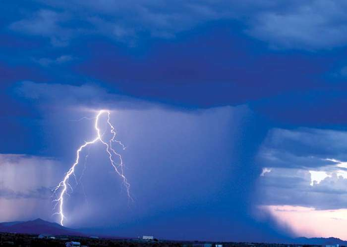
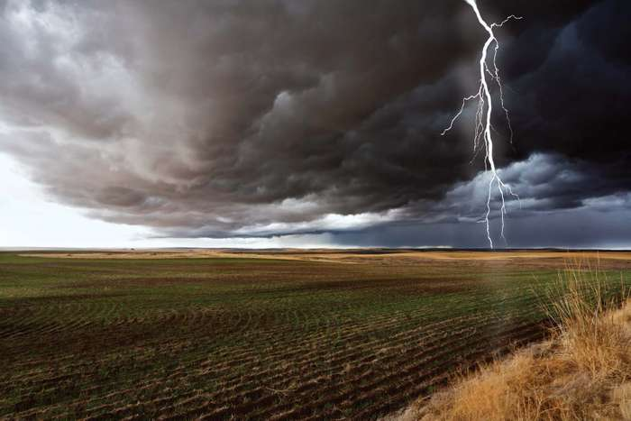

# NWS Jetstream — Britannica

> Source: <https://www.britannica.com/science/thunderstorm/Types-of-thunderstorms>  
> Section: Thunderstorms  
> Captured: 2026-08-19 06:00 UTC (via Wayback Machine: https://web.archive.org/web/20191115161839/https://www.britannica.com/science/thunderstorm/Types-of-thunderstorms)  
> PDF: [nws-jetstream-britannica.pdf](nws-jetstream-britannica.pdf) · Original HTML: [source/original.html](source/original.html)

---

[ENCYCLOPÆDIA BRITANNICA](https://www.britannica.com/)

[START YOUR FREE TRIAL

](https://subscription.britannica.com/subscribe?partnerCode=BP_GN_Articles_USD_B)

[Log In · Join](#)

- [Demystified](https://www.britannica.com/stories/demystified)
- [Quizzes](https://www.britannica.com/quiz/browse)
- [#WTFact](https://www.britannica.com/stories/wtfact)
- [Lists](https://www.britannica.com/list/browse)
- [On This Day](https://www.britannica.com/on-this-day)
- [Biographies](https://www.britannica.com/biographies)
- [Explore](https://www.britannica.com/explore)

[START YOUR FREE TRIAL

](https://subscription.britannica.com/subscribe?partnerCode=BP_GN_Articles_USD_B)

Search Britannica

Search

Click here to search

[Fact-checked results at the top of your browser search.

Britannica Insights](https://www.britannica.com/insights)

Contents

Thunderstorm

meteorology

Article
[Media](https://www.britannica.com/science/thunderstorm/images-videos)

Info

Print

Print

Please select which sections you would like to print:

- Table Of Contents

Cite

Feedback

Feedback

Corrections? Updates? Omissions? Let us know if you have suggestions to improve this article
(requires login).

Select feedback type:

Select a type (Required)
Factual Correction
Spelling/Grammar Correction
Link Correction
Additional Information
Other

Submit Feedback

Thank you for your feedback

Our editors will review what you’ve submitted and determine whether to revise the article.

[Join **Britannica's Publishing Partner Program** and our community of experts to gain a global audience for your work!](http://corporate.britannica.com/publishing-partner-program/)

Share

SHARE

[Facebook](https://www.facebook.com/BRITANNICA/)
[Twitter](https://twitter.com/britannica)

- [Introduction](https://www.britannica.com/science/thunderstorm)
- [Thunderstorm formation and structure](https://www.britannica.com/science/thunderstorm#ref218323)
  - [Vertical atmospheric motion](https://www.britannica.com/science/thunderstorm#ref218324)
  - [Types of thunderstorms](nws-jetstream-britannica.md)
    - [Isolated thunderstorms](nws-jetstream-britannica.md#ref218325)
    - [Multiple-cell thunderstorms and mesoscale convective systems](nws-jetstream-britannica.md#ref218326)
    - [Supercell storms](https://www.britannica.com/science/thunderstorm/Supercell-storms)
  - [Physical characteristics of thunderstorms](https://www.britannica.com/science/thunderstorm/Supercell-storms#ref49572)
    - [Updrafts and downdrafts](https://www.britannica.com/science/thunderstorm/Supercell-storms#ref49573)
    - [Downbursts](https://www.britannica.com/science/thunderstorm/Supercell-storms#ref218328)
    - [Vertical extent](https://www.britannica.com/science/thunderstorm/Supercell-storms#ref49574)
    - [Turbulence](https://www.britannica.com/science/thunderstorm/Supercell-storms#ref49575)
    - [Movement of thunderstorms](https://www.britannica.com/science/thunderstorm/Movement-of-thunderstorms)
    - [Energy](https://www.britannica.com/science/thunderstorm/Movement-of-thunderstorms#ref218329)
    - [Weather under thunderstorms](https://www.britannica.com/science/thunderstorm/Movement-of-thunderstorms#ref49577)
      - [Downdrafts and gust fronts](https://www.britannica.com/science/thunderstorm/Movement-of-thunderstorms#ref218330)
      - [Rainfall](https://www.britannica.com/science/thunderstorm/Movement-of-thunderstorms#ref218331)
- [Thunderstorm electrification](https://www.britannica.com/science/thunderstorm/Thunderstorm-electrification)
  - [Lightning occurrence](https://www.britannica.com/science/thunderstorm/Thunderstorm-electrification#ref218333)
    - [Global lightning distribution](https://www.britannica.com/science/thunderstorm/Thunderstorm-electrification#ref218334)
    - [Lightning distribution in the United States](https://www.britannica.com/science/thunderstorm/Thunderstorm-electrification#ref218335)
    - [Cloud-to-ground lightning](https://www.britannica.com/science/thunderstorm/Cloud-to-ground-lightning)
      - [Initial stroke](https://www.britannica.com/science/thunderstorm/Cloud-to-ground-lightning#ref218336)
      - [Return stroke](https://www.britannica.com/science/thunderstorm/Cloud-to-ground-lightning#ref218337)
      - [Subsequent return strokes](https://www.britannica.com/science/thunderstorm/Cloud-to-ground-lightning#ref218338)
      - [Dissipation of energy](https://www.britannica.com/science/thunderstorm/Cloud-to-ground-lightning#ref218339)
      - [Thunder](https://www.britannica.com/science/thunderstorm/Thunder)
    - [Triggered lightning](https://www.britannica.com/science/thunderstorm/Thunder#ref218340)
    - [Cloud-to-cloud and intracloud lightning](https://www.britannica.com/science/thunderstorm/Thunder#ref49567)
  - [Lightning damage](https://www.britannica.com/science/thunderstorm/Lightning-damage)
  - [Lightning protection](https://www.britannica.com/science/thunderstorm/Lightning-protection)

Load Previous Page

# Types of thunderstorms

At one time, thunderstorms were classified according to where they occurred—for example, as local, frontal, or orographic (mountain-initiated) thunderstorms. Today it is more common to classify storms according to the characteristics of the storms themselves, and such characteristics depend largely on the meteorological [environment](https://www.merriam-webster.com/dictionary/environment) in which the storms develop. The [United States](https://www.britannica.com/place/United-States) [National Weather Service](https://www.britannica.com/topic/National-Weather-Service) has defined a severe thunderstorm as any [storm](https://www.britannica.com/science/storm) that produces a [tornado](https://www.britannica.com/science/tornado), winds greater than 26 metres per second (94 km [58 miles] per hour), or [hail](https://www.britannica.com/science/hail-meteorology) with a diameter greater than 1.9 cm (0.75 inch).

## Isolated thunderstorms

Isolated thunderstorms tend to occur where there are light winds that do not change dramatically with height and where there is abundant moisture at [low](https://www.britannica.com/science/cyclone-meteorology) and middle levels of the atmosphere—that is, from near the surface of the ground up to around 10,000 metres (33,000 feet) in altitude. These storms are sometimes called [air-mass](https://www.britannica.com/science/air-mass-thunderstorm) or local thunderstorms. They are mostly vertical in structure, are relatively short-lived, and usually do not produce violent [weather](https://www.britannica.com/science/weather) at the ground. Aircraft and radar measurements show that such storms are composed of one or more convective cells, each of which goes through a well-defined life cycle. Early in the development of a cell, the air motions are mostly upward, not as a steady, uniform stream but as one that is composed of a series of rising eddies. Cloud and [precipitation](https://www.britannica.com/science/precipitation) particles form and grow as the cell grows. When the accumulated load of water and ice becomes excessive, a [downdraft](https://www.britannica.com/science/downdraft) starts. The downward motion is [enhanced](https://www.merriam-webster.com/dictionary/enhanced) when the [cloud](https://www.britannica.com/science/cloud-meteorology) particles evaporate and cool the air—almost the reverse of the processes in an updraft. At maturity, the cell contains both [updrafts and downdrafts](https://www.britannica.com/science/updraft) in close proximity. In its later stages, the downdraft spreads throughout the cell and diminishes in intensity as precipitation falls from the cloud. Isolated thunderstorms contain one or more convective cells in different stages of evolution. Frequently, the downdrafts and associated outflows from a storm trigger new convective cells nearby, resulting in the formation of a multiple-cell thunderstorm.

Rain and lightning during a thunderstorm in Arizona.© Steven Love/Fotolia

Solar heating is an important factor in triggering local, isolated thunderstorms. Most such storms occur in the late afternoon and early evening, when surface temperatures are highest.

## Multiple-cell thunderstorms and mesoscale convective systems

Violent weather at the ground is usually produced by organized multiple-cell storms, [squall lines](https://www.britannica.com/science/squall-line), or a supercell. All of these tend to be associated with a [mesoscale](https://www.britannica.com/science/mesoscale) disturbance (a weather system of intermediate size, that is, 10 to 1,000 km [6 to 600 miles] in horizontal extent). Multiple-cell storms have several [updrafts and downdrafts](https://www.britannica.com/science/updraft) in close proximity to one another. They occur in clusters of cells in various stages of development moving together as a group. Within the cluster one cell dominates for a time before weakening, and then another cell repeats the cycle. In squall lines, thunderstorms form in an organized line and create a single, continuous [gust](https://www.britannica.com/science/gust) front (the leading edge of a storm’s outflow from its downdraft). Supercell storms have one intense updraft and downdraft; they are discussed in more detail below.

**lightning: cloud-to-ground**Cloud-to-ground lightning discharge in a field from a cumulonimbus cloud.© Hemera/Thinkstock

Sometimes the development of a mesoscale weather disturbance causes thunderstorms to develop over a region hundreds of kilometres in diameter. Examples of such disturbances include frontal wave [cyclones](https://www.britannica.com/science/cyclone-meteorology) (low-pressure systems that develop from a wave on a front separating warm and cool air masses) and low-pressure troughs at upper levels of the [atmosphere](https://www.britannica.com/science/atmosphere). The resulting pattern of storms is called a mesoscale convective system (MCS). Severe multiple-cell thunderstorms and supercell storms are frequently associated with MCSs. Precipitation produced by these systems typically includes rainfall from convective clouds and from [stratiform](https://www.britannica.com/science/stratiform-cloud) clouds (cloud layers with a large horizontal extent). Stratiform precipitation is primarily due to the remnants of older cells with a relatively low vertical velocity—that is, with limited convection occurring.

Thunderstorms can be triggered by a [cold front](https://www.britannica.com/science/cold-front) that moves into moist, unstable air. Sometimes [squall](https://www.britannica.com/science/squall) lines develop in the warm [air mass](https://www.britannica.com/science/air-mass) tens to hundreds of kilometres ahead of a cold front. The tendency of prefrontal storms to be more or less aligned parallel to the front indicates that they are initiated by atmospheric disturbances caused by the front.

In the central United States, severe thunderstorms commonly occur in the springtime, when cool westerly winds at middle levels (3,000 to 10,000 metres [10,000 to 33,000 feet] in altitude) move over warm and moist surface air flowing northward from the [Gulf of Mexico](https://www.britannica.com/place/Gulf-of-Mexico). The resulting broad region of instability produces MCSs that persist for many hours or even days.

In the tropics, the northeast [trade winds](https://www.britannica.com/science/trade-wind) meet the southeast trades near the [Equator](https://www.britannica.com/place/Equator), and the resulting [intertropical convergence zone](https://www.britannica.com/science/intertropical-convergence-zone) (ITCZ) is characterized by air that is both moist and unstable. Thunderstorms and MCSs appear in great abundance in the ITCZ; they play an important role in the transport of heat to upper levels of the atmosphere and to higher latitudes.

Similar Topics

- [Whirlwind](https://www.britannica.com/science/whirlwind)
- [Tropical storm](https://www.britannica.com/science/tropical-storm)
- [Windstorm](https://www.britannica.com/science/windstorm)
- [Cyclone](https://www.britannica.com/science/cyclone-meteorology)
- [Blizzard](https://www.britannica.com/science/blizzard)
- [Saint Elmo's fire](https://www.britannica.com/science/Saint-Elmos-fire)
- [Haboob](https://www.britannica.com/science/haboob)
- [Squall](https://www.britannica.com/science/squall)

Load Next Page

Thunderstorm

Additional Information

## [More About](#)

## [Additional Reading](#)

## [External Websites](#)

- [NOAA's National Weather Service - Thunderstorm Formation and Aviation Hazards](http://www.nws.noaa.gov/os/aviation/front/11jul-front.pdf)
- [Weather Wiz Kids - Thunderstorm](http://www.weatherwizkids.com/weather-thunderstorms.htm)

Britannica Websites

Articles from Britannica Encyclopedias for elementary and high school students.

- [thunderstorm - Children's Encyclopedia (Ages 8-11)](https://kids.britannica.com/kids/article/thunderstorm/399624)

## [Article History](#)

## [Article Contributors](#)

Load Next Article

**Inspire your inbox –**
Sign up for daily fun facts about this day in history, updates, and special offers.

Subscribe

By signing up for this email, you are agreeing to news, offers, and information from Encyclopaedia Britannica.
Click here to view our [Privacy Notice](https://corporate.britannica.com/privacy-policy). Easy unsubscribe links are provided in every email.

Thank you for subscribing!

Be on the lookout for your Britannica newsletter to get trusted stories delivered right to your inbox.

Stay Connected

[Facebook](https://www.facebook.com/BRITANNICA/)
[Twitter](https://twitter.com/britannica)
[YouTube](https://www.youtube.com/c/encyclopaediabritannica)
[Instagram](https://www.instagram.com/britannica/)
[Pinterest](https://www.pinterest.com/britannica/)
[*Newsletters*](https://cloud.email.britannica.com/PreferenceCenter "Newsletters")

- [About Us](https://corporate.britannica.com)
- [About Our Ads](https://corporate.britannica.com/privacy-policy)
- [Partner Program](https://corporate.britannica.com/publishing-partner-program/)
- [Contact Us](https://corporate.britannica.com/contact/)
- [Privacy Notice](https://corporate.britannica.com/privacy-policy)
- [Terms of Use](https://corporate.britannica.com/termsofuse.html)

©2019 Encyclopædia Britannica, Inc.

Menu

[BRITANNICA](https://www.britannica.com/)

- [Home](https://www.britannica.com/)
- [Demystified](https://www.britannica.com/stories/demystified)
- [Quizzes](https://www.britannica.com/quiz/browse)
- [#WTFact](https://www.britannica.com/stories/wtfact)
- [Lists](https://www.britannica.com/list/browse)
- [On This Day](https://www.britannica.com/on-this-day)
- [Biographies](https://www.britannica.com/biographies)
- [Explore](https://www.britannica.com/explore)
- ---
- **[Login](#)**
- **[Join](#)**

Search

×

close
.marketing-slider .close-btn {
color: white;
}
.marketing-slider .preview {
background-color: #064566;
color: white;
}
.marketing-slider .preview .orange-circle {
background-color: #064566;
border-radius: 100%;
height: 250px;
position: absolute;
right: 180px;
top: -80px;
width: 250px;
}
.marketing-slider .preview .orange-circle img {
opacity: 0.7;
width: 130px;
}
.marketing-slider .offer .md-button-gradient {
font-size: 12px;
background:#F87307;
}

Are we living through a mass extinction?

