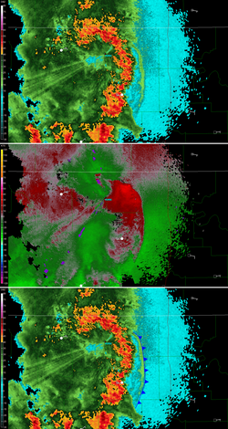
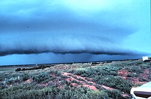
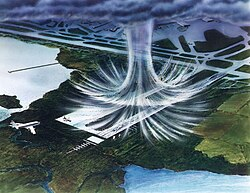
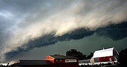
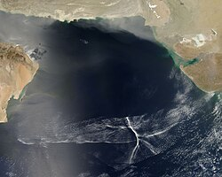

# Thunderstorm Outflow Boundaries — Tutorial #2

> Source: <https://en.wikipedia.org/wiki/Outflow_boundary#:~:text=An%20outflow%20boundary%2C%20also%20known,and%20a%20related%20pressure%20jump.>  
> Section: Thunderstorms  
> Captured: 2026-08-19 06:00 UTC  
> PDF: [thunderstorm-outflow-boundaries-tutorial-2.pdf](thunderstorm-outflow-boundaries-tutorial-2.pdf) · Original HTML: [source/original.html](source/original.html)

---

[Jump to content](#bodyContent)

Main menu

Main menu

move to sidebar
hide

Navigation

- [Main page](https://en.wikipedia.org/wiki/Main_Page "Visit the main page [z]")
- [Contents](https://en.wikipedia.org/wiki/Wikipedia:Contents "Guides to browsing Wikipedia")
- [Current events](https://en.wikipedia.org/wiki/Portal:Current_events "Articles related to current events")
- [Random article](https://en.wikipedia.org/wiki/Special:Random "Visit a randomly selected article [x]")
- [About Wikipedia](https://en.wikipedia.org/wiki/Wikipedia:About "Learn about Wikipedia and how it works")
- [Contact us](https://en.wikipedia.org/wiki/Wikipedia:Contact_us "How to contact Wikipedia")

Contribute

- [Help](https://en.wikipedia.org/wiki/Help:Contents "Guidance on how to use and edit Wikipedia")
- [Learn to edit](https://en.wikipedia.org/wiki/Help:Introduction "Learn how to edit Wikipedia")
- [Community portal](https://en.wikipedia.org/wiki/Wikipedia:Community_portal "The hub for editors")
- [Recent changes](https://en.wikipedia.org/wiki/Special:RecentChanges "A list of recent changes to Wikipedia [r]")
- [Upload file](https://en.wikipedia.org/wiki/Wikipedia:File_upload_wizard "Add images or other media for use on Wikipedia")
- [Special pages](https://en.wikipedia.org/wiki/Special:SpecialPages "A list of all special pages [q]")

[Search](https://en.wikipedia.org/wiki/Special:Search "Search Wikipedia [f]")

Search

Appearance

- [Donate](https://donate.wikimedia.org/?wmf_source=donate&wmf_medium=sidebar&wmf_campaign=en.wikipedia.org&uselang=en)
- [Create account](https://en.wikipedia.org/w/index.php?title=Special:CreateAccount&returnto=Outflow+boundary "You are encouraged to create an account and log in; however, it is not mandatory")
- [Log in](https://en.wikipedia.org/w/index.php?title=Special:UserLogin&returnto=Outflow+boundary "You're encouraged to log in; however, it's not mandatory. [o]")

Personal tools

- [Donate](https://donate.wikimedia.org/?wmf_source=donate&wmf_medium=sidebar&wmf_campaign=en.wikipedia.org&uselang=en)
- [Create account](https://en.wikipedia.org/w/index.php?title=Special:CreateAccount&returnto=Outflow+boundary "You are encouraged to create an account and log in; however, it is not mandatory")
- [Log in](https://en.wikipedia.org/w/index.php?title=Special:UserLogin&returnto=Outflow+boundary "You're encouraged to log in; however, it's not mandatory. [o]")

## Contents

move to sidebar
hide

- [(Top)](#)
- [1
  Definition](#Definition)
- [2
  Origin](#Origin)
- [3
  Appearance](#Appearance)
- [4
  Effects](#Effects)
- [5
  See also](#See_also)
- [6
  References](#References)
- [7
  External links](#External_links)

Toggle the table of contents

# Outflow boundary

10 languages

- [Català](https://ca.wikipedia.org/wiki/Front_de_r%C3%A0fega "Front de ràfega – Catalan")
- [Deutsch](https://de.wikipedia.org/wiki/B%C3%B6enfront "Böenfront – German")
- [Español](https://es.wikipedia.org/wiki/Frente_de_r%C3%A1faga "Frente de ráfaga – Spanish")
- [Suomi](https://fi.wikipedia.org/wiki/Puuskarintama "Puuskarintama – Finnish")
- [Français](https://fr.wikipedia.org/wiki/Front_de_rafales "Front de rafales – French")
- [Italiano](https://it.wikipedia.org/wiki/Fronte_di_raffiche "Fronte di raffiche – Italian")
- [日本語](https://ja.wikipedia.org/wiki/%E3%82%AC%E3%82%B9%E3%83%88%E3%83%95%E3%83%AD%E3%83%B3%E3%83%88 "ガストフロント – Japanese")
- [Lombard](https://lmo.wikipedia.org/wiki/Front_di_reb%C3%B9ff "Front di rebùff – Lombard")
- [Norsk nynorsk](https://nn.wikipedia.org/wiki/Vindst%C3%B8ytfront "Vindstøytfront – Norwegian Nynorsk")
- [Português](https://pt.wikipedia.org/wiki/Frente_de_rajada "Frente de rajada – Portuguese")

[Edit links](https://www.wikidata.org/wiki/Special:EntityPage/Q1019652#sitelinks-wikipedia "Edit interlanguage links")

- [Article](thunderstorm-outflow-boundaries-tutorial-2.md "View the content page [c]")
- [Talk](https://en.wikipedia.org/wiki/Talk:Outflow_boundary "Discuss improvements to the content page [t]")

English

- [Read](thunderstorm-outflow-boundaries-tutorial-2.md)
- [Edit](https://en.wikipedia.org/w/index.php?title=Outflow_boundary&action=edit "Edit this page [e]")
- [View history](https://en.wikipedia.org/w/index.php?title=Outflow_boundary&action=history "Past revisions of this page [h]")

Tools

Tools

move to sidebar
hide

Actions

- [Read](thunderstorm-outflow-boundaries-tutorial-2.md)
- [Edit](https://en.wikipedia.org/w/index.php?title=Outflow_boundary&action=edit "Edit this page [e]")
- [View history](https://en.wikipedia.org/w/index.php?title=Outflow_boundary&action=history "Past revisions of this page [h]")

General

- [What links here](https://en.wikipedia.org/wiki/Special:WhatLinksHere/Outflow_boundary "List of all English Wikipedia pages containing links to this page [j]")
- [Related changes](https://en.wikipedia.org/wiki/Special:RecentChangesLinked/Outflow_boundary "Recent changes in pages linked from this page [k]")
- [Upload file](https://en.wikipedia.org/wiki/Wikipedia:File_Upload_Wizard "Upload files [u]")
- [Permanent link](https://en.wikipedia.org/w/index.php?title=Outflow_boundary&oldid=1314645063 "Permanent link to this revision of this page")
- [Page information](https://en.wikipedia.org/w/index.php?title=Outflow_boundary&action=info "More information about this page")
- [Cite this page](https://en.wikipedia.org/w/index.php?title=Special:CiteThisPage&page=Outflow_boundary&id=1314645063&wpFormIdentifier=titleform "Information on how to cite this page")
- [Get shortened URL](https://en.wikipedia.org/w/index.php?title=Special:UrlShortener&url=https%3A%2F%2Fen.wikipedia.org%2Fwiki%2FOutflow_boundary)
- [Switch to legacy parser](https://en.wikipedia.org/w/index.php?title=Outflow_boundary&useparsoid=0)

Print/export

- [Download as PDF](https://en.wikipedia.org/w/index.php?title=Special:DownloadAsPdf&page=Outflow_boundary&action=show-download-screen "Download this page as a PDF file")
- [Printable version](https://en.wikipedia.org/w/index.php?title=Outflow_boundary&printable=yes "Printable version of this page [p]")

In other projects

- [Wikimedia Commons](https://commons.wikimedia.org/wiki/Category:Outflow_boundary)
- [Wikidata item](https://www.wikidata.org/wiki/Special:EntityPage/Q1019652 "Structured data on this page hosted by Wikidata [g]")

Appearance

move to sidebar
hide

From Wikipedia, the free encyclopedia

Mesoscale boundary separating outflow from the surrounding air

.mw-parser-output .hatnote{font-style:italic}.mw-parser-output div.hatnote{padding-left:1.6em;margin-bottom:0.5em}.mw-parser-output .hatnote i{font-style:normal}.mw-parser-output .hatnote+.mw-empty-elt+.hatnote{margin-top:-0.5em}@media print{body.ns-0 .mw-parser-output .hatnote{display:none!important}}

"Gust Front" redirects here. For the Legacy of the Aldenata military science fiction novel by John Ringo, see [Gust Front (novel)](https://en.wikipedia.org/wiki/Gust_Front_(novel) "Gust Front (novel)").

Outflow boundary on [radar](https://en.wikipedia.org/wiki/Radar "Radar") with radial velocity and frontal boundary drawn in.

An **outflow boundary**, also known as a **gust front**, is a [storm-scale](https://en.wikipedia.org/wiki/Storm-scale?action=edit&redlink=1 "Storm-scale (page does not exist)") or [mesoscale](https://en.wikipedia.org/wiki/Mesoscale_meteorology "Mesoscale meteorology") boundary separating [thunderstorm](https://en.wikipedia.org/wiki/Thunderstorm "Thunderstorm")-cooled air ([outflow](https://en.wikipedia.org/wiki/Outflow_(meteorology) "Outflow (meteorology)")) from the surrounding air; similar in effect to a [cold front](https://en.wikipedia.org/wiki/Cold_front "Cold front"), with passage marked by a wind shift and usually a drop in [temperature](https://en.wikipedia.org/wiki/Temperature "Temperature") and a related pressure jump. Outflow boundaries can persist for 24 hours or more after the thunderstorms that generated them dissipate, and can travel hundreds of kilometers from their area of origin. New thunderstorms often develop along outflow boundaries, especially near the point of intersection with another boundary ([cold front](https://en.wikipedia.org/wiki/Cold_front "Cold front"), [dry line](https://en.wikipedia.org/wiki/Dry_line "Dry line"), another outflow boundary, etc.). Outflow boundaries can be seen either as fine lines on [weather radar](https://en.wikipedia.org/wiki/Weather_radar "Weather radar") imagery or else as arcs of low clouds on [weather satellite](https://en.wikipedia.org/wiki/Weather_satellite "Weather satellite") imagery. From the ground, outflow boundaries can be co-located with the appearance of [roll clouds](https://en.wikipedia.org/wiki/Roll_cloud "Roll cloud") and [shelf clouds](https://en.wikipedia.org/wiki/Shelf_cloud "Shelf cloud").[[1]](#cite_note-nws-1)

Outflow boundaries create low-level [wind shear](https://en.wikipedia.org/wiki/Wind_shear "Wind shear") which can be hazardous during aircraft takeoffs and landings. If a thunderstorm runs into an outflow boundary, the low-level wind shear from the boundary can cause thunderstorms to exhibit rotation at the base of the storm, at times causing tornadic activity. Strong versions of these features known as downbursts can be generated in environments of vertical wind shear and mid-level dry air. [Microbursts](https://en.wikipedia.org/wiki/Microburst "Microburst") have a diameter of influence less than 4 kilometres (2.5 mi), while [macrobursts](https://en.wikipedia.org/wiki/Macroburst "Macroburst") occur over a diameter greater than 4 kilometres (2.5 mi). Wet microbursts occur in atmospheres where the low levels are saturated, while dry microbursts occur in drier atmospheres from high-based thunderstorms. When an outflow boundary moves into a more stable low level environment, such as into a region of cooler air or over regions of cooler water temperatures out at sea, it can lead to the development of an [undular bore](https://en.wikipedia.org/wiki/Undular_bore "Undular bore").[[2]](#cite_note-atkins-2)

## Definition

[[edit](https://en.wikipedia.org/w/index.php?title=Outflow_boundary&action=edit&section=1 "Edit section: Definition")]

Thunderstorm with lead gust front near Brookhaven, New Mexico, United States. The gust front is marked by a [shelf cloud](https://en.wikipedia.org/wiki/Arcus_cloud#Shelf_cloud "Arcus cloud").

An outflow boundary, also known as a gust front or arc cloud, is the leading edge of gusty, cooler surface winds from thunderstorm [downdrafts](https://en.wikipedia.org/wiki/Downdraft "Downdraft"); sometimes associated with a [shelf cloud](https://en.wikipedia.org/wiki/Shelf_cloud "Shelf cloud") or [roll cloud](https://en.wikipedia.org/wiki/Roll_cloud "Roll cloud"). A pressure jump is associated with its passage.[[3]](#cite_note-3) Outflow boundaries can persist for over 24 hours and travel hundreds of kilometers (miles) from their area of origin.[[1]](#cite_note-nws-1) A wrapping gust front is a front that wraps around the [mesocyclone](https://en.wikipedia.org/wiki/Mesocyclone "Mesocyclone"), cutting off the inflow of warm moist air and resulting in occlusion. This is sometimes the case during the event of a collapsing storm, in which the wind literally "rips it apart".[[4]](#cite_note-nws-gust-4)

## Origin

[[edit](https://en.wikipedia.org/w/index.php?title=Outflow_boundary&action=edit&section=2 "Edit section: Origin")]

Illustration of a microburst. The wind regime in a microburst is opposite to that of a tornado.

See also: [Downburst](https://en.wikipedia.org/wiki/Downburst "Downburst") and [Squall line](https://en.wikipedia.org/wiki/Squall_line "Squall line")

A [microburst](https://en.wikipedia.org/wiki/Microburst "Microburst") is a very localized column of sinking air known as a downburst, producing damaging divergent and [straight-line winds](https://en.wikipedia.org/wiki/Straight-line_winds "Straight-line winds") at the surface that are similar to but distinguishable from [tornadoes](https://en.wikipedia.org/wiki/Tornado "Tornado") which generally have convergent damage.[[2]](#cite_note-atkins-2) The term was defined as affecting an area 4 kilometres (2.5 mi) in diameter or less,[[5]](#cite_note-5) distinguishing them as a type of downburst and apart from common wind shear which can encompass greater areas. They are normally associated with individual thunderstorms. Microburst soundings show the presence of mid-level dry air, which enhances evaporative cooling.[[6]](#cite_note-micro-6)

Organized areas of thunderstorm activity reinforce pre-existing frontal zones, and can outrun cold fronts. This outrunning occurs within the [westerlies](https://en.wikipedia.org/wiki/Westerlies "Westerlies") in a pattern where the upper-level jet splits into two streams. The resultant [mesoscale convective system](https://en.wikipedia.org/wiki/Mesoscale_convective_system "Mesoscale convective system") (MCS) forms at the point of the upper level split in the wind pattern in the area of best low level inflow. The convection then moves east and toward the [equator](https://en.wikipedia.org/wiki/Equator "Equator") into the warm sector, parallel to low-level thickness lines. When the convection is strong and linear or curved, the MCS is called a [squall line](https://en.wikipedia.org/wiki/Squall_line "Squall line"), with the feature placed at the leading edge of the significant wind shift and pressure rise which is normally just ahead of its radar signature.[[7]](#cite_note-FCM-P11-2001-7) This feature is commonly depicted in the warm season across the United States on surface analyses, as they lie within sharp surface troughs.

A macroburst, normally associated with squall lines, is a strong downburst larger than 4 kilometres (2.5 mi).[[8]](#cite_note-8) A wet microburst consists of precipitation and an atmosphere saturated in the low-levels. A dry microburst emanates from high-based thunderstorms with [virga](https://en.wikipedia.org/wiki/Virga "Virga") falling from their base.[[6]](#cite_note-micro-6) All types are formed by precipitation-cooled air rushing to the surface. Downbursts can occur over large areas. In the extreme case, a [derecho](https://en.wikipedia.org/wiki/Derecho "Derecho") can cover a huge area more than 200 miles (320 km) wide and over 1,000 miles (1,600 km) long, lasting up to 12 hours or more, and is associated with some of the most intense straight-line winds, but the generative process is somewhat different from that of most downbursts.[[9]](#cite_note-9)

## Appearance

[[edit](https://en.wikipedia.org/w/index.php?title=Outflow_boundary&action=edit&section=3 "Edit section: Appearance")]

This shelf cloud preceded a [derecho](https://en.wikipedia.org/wiki/Derecho "Derecho") in [Minnesota](https://en.wikipedia.org/wiki/Minnesota "Minnesota")

At ground level, [shelf clouds](https://en.wikipedia.org/wiki/Shelf_cloud "Shelf cloud") and [roll clouds](https://en.wikipedia.org/wiki/Roll_cloud "Roll cloud") can be seen at the leading edge of outflow boundaries.[[10]](#cite_note-FCM-H11B-2005-10) Through [satellite](https://en.wikipedia.org/wiki/Weather_satellite "Weather satellite") imagery, an arc cloud is visible as an arc of low clouds spreading out from a thunderstorm. If the skies are cloudy behind the arc, or if the arc is moving quickly, high wind gusts are likely behind the gust front.[[11]](#cite_note-11) Sometimes a gust front can be seen on [weather radar](https://en.wikipedia.org/wiki/Weather_radar "Weather radar"), showing as a thin arc or line of weak radar echos pushing out from a collapsing storm. The thin line of weak radar echoes is known as a fine line.[[12]](#cite_note-12) Occasionally, winds caused by the gust front are so high in velocity that they also show up on radar. This cool outdraft can then energize other storms which it hits by assisting in [updrafts](https://en.wikipedia.org/wiki/Updraft "Updraft"). Gust fronts colliding from two storms can even create new storms. Usually, however, no rain accompanies the shifting winds. An expansion of the rain shaft near ground level, in the general shape of a human foot, is a telltale sign of a downburst. *Gustnadoes*, short-lived vertical circulations near ground level, can be spawned by outflow boundaries.[[6]](#cite_note-micro-6)

## Effects

[[edit](https://en.wikipedia.org/w/index.php?title=Outflow_boundary&action=edit&section=4 "Edit section: Effects")]

Satellite image of an undular bore

See also: [Wind shear](https://en.wikipedia.org/wiki/Wind_shear "Wind shear") and [Undular bore](https://en.wikipedia.org/wiki/Undular_bore "Undular bore")

Gust fronts create low-level [wind shear](https://en.wikipedia.org/wiki/Wind_shear "Wind shear") which can be hazardous to planes when they takeoff or land.[[13]](#cite_note-13) Flying [insects](https://en.wikipedia.org/wiki/Insect "Insect") are swept along by the [prevailing winds](https://en.wikipedia.org/wiki/Prevailing_winds "Prevailing winds").[[14]](#cite_note-14) As such, fine line patterns within [weather radar](https://en.wikipedia.org/wiki/Weather_radar "Weather radar") imagery, associated with converging winds, are dominated by insect returns.[[15]](#cite_note-15) At the surface, clouds of dust can be raised by outflow boundaries. If squall lines form over arid regions, a duststorm known as a [haboob](https://en.wikipedia.org/wiki/Haboob "Haboob") can result from the high winds picking up dust in their wake from the desert floor.[[16]](#cite_note-16) If outflow boundaries move into areas of the atmosphere which are stable in the low levels, such through the cold sector of [extratropical cyclones](https://en.wikipedia.org/wiki/Extratropical_cyclone "Extratropical cyclone") or a nocturnal boundary layer, they can create a phenomenon known as an undular bore, which shows up on satellite and radar imagery as a series of [transverse waves](https://en.wikipedia.org/wiki/Transverse_wave "Transverse wave") in the cloud field oriented perpendicular to the low-level winds.[[17]](#cite_note-17)

## See also

[[edit](https://en.wikipedia.org/w/index.php?title=Outflow_boundary&action=edit&section=5 "Edit section: See also")]

.mw-parser-output .side-box{margin:4px 0;box-sizing:border-box;border:1px solid #aaa;font-size:88%;line-height:1.25em;background-color:var(--background-color-interactive-subtle,#f8f9fa);color:inherit;display:flow-root}.mw-parser-output .infobox .side-box{font-size:100%}.mw-parser-output .side-box-abovebelow,.mw-parser-output .side-box-text{padding:0.25em 0.9em}.mw-parser-output .side-box-image{padding:2px 0 2px 0.9em;text-align:center}.mw-parser-output .side-box-imageright{padding:2px 0.9em 2px 0;text-align:center}@media(min-width:500px){.mw-parser-output .side-box-flex{display:flex;align-items:center}.mw-parser-output .side-box-text{flex:1;min-width:0}}@media(min-width:640px){.mw-parser-output .side-box{width:238px}.mw-parser-output .side-box-right{clear:right;float:right;margin-left:1em}.mw-parser-output .side-box-left{margin-right:1em}}@media print{body.ns-0 .mw-parser-output .sistersitebox{display:none!important}}@media screen{html.skin-theme-clientpref-night .mw-parser-output .sistersitebox img[src\*="Wiktionary-logo-en-v2.svg"]{filter:invert(1)brightness(55%)contrast(250%)hue-rotate(180deg)}}@media screen and (prefers-color-scheme:dark){html.skin-theme-clientpref-os .mw-parser-output .sistersitebox img[src\*="Wiktionary-logo-en-v2.svg"]{filter:invert(1)brightness(55%)contrast(250%)hue-rotate(180deg)}}

.mw-parser-output .plainlist ol,.mw-parser-output .plainlist ul{line-height:inherit;list-style:none;margin:0;padding:0}.mw-parser-output .plainlist ol li,.mw-parser-output .plainlist ul li{margin-bottom:0}

Wikimedia Commons has media related to [gust front](https://commons.wikimedia.org/wiki/gust%20front "commons:gust front").

- [Density](https://en.wikipedia.org/wiki/Density "Density")
- [Derecho](https://en.wikipedia.org/wiki/Derecho "Derecho")
- [Gustnado](https://en.wikipedia.org/wiki/Gustnado "Gustnado")
- [Haboob](https://en.wikipedia.org/wiki/Haboob "Haboob")
- [Heat burst](https://en.wikipedia.org/wiki/Heat_burst "Heat burst")
- [Inflow (meteorology)](https://en.wikipedia.org/wiki/Inflow_(meteorology) "Inflow (meteorology)")
- [Lake-effect snow](https://en.wikipedia.org/wiki/Lake-effect_snow "Lake-effect snow")
- [Mathematical singularity](https://en.wikipedia.org/wiki/Mathematical_singularity "Mathematical singularity")
- [Sea breeze](https://en.wikipedia.org/wiki/Sea_breeze "Sea breeze")
- [Tropical cyclogenesis](https://en.wikipedia.org/wiki/Tropical_cyclogenesis "Tropical cyclogenesis")
- [Wake low](https://en.wikipedia.org/wiki/Wake_low "Wake low")
- [Weather front](https://en.wikipedia.org/wiki/Weather_front "Weather front")
- [Pseudo-cold front](https://en.wikipedia.org/wiki/Pseudo-cold_front "Pseudo-cold front")

## References

[[edit](https://en.wikipedia.org/w/index.php?title=Outflow_boundary&action=edit&section=6 "Edit section: References")]

.mw-parser-output .reflist-columns-2{column-width:30em}.mw-parser-output .reflist-columns-3{column-width:25em}body.skin-vector-2022 .mw-parser-output .reflist-columns-2{column-width:27em}body.skin-vector-2022 .mw-parser-output .reflist-columns-3{column-width:22.5em}.mw-parser-output .references[data-mw-group=upper-alpha]{list-style-type:upper-alpha}.mw-parser-output .references[data-mw-group=upper-roman]{list-style-type:upper-roman}.mw-parser-output .references[data-mw-group=lower-alpha]{list-style-type:lower-alpha}.mw-parser-output .references[data-mw-group=lower-greek]{list-style-type:lower-greek}.mw-parser-output .references[data-mw-group=lower-roman]{list-style-type:lower-roman}.mw-parser-output div.reflist-liststyle-upper-alpha .references{list-style-type:upper-alpha}.mw-parser-output div.reflist-liststyle-upper-roman .references{list-style-type:upper-roman}.mw-parser-output div.reflist-liststyle-lower-alpha .references{list-style-type:lower-alpha}.mw-parser-output div.reflist-liststyle-lower-greek .references{list-style-type:lower-greek}.mw-parser-output div.reflist-liststyle-lower-roman .references{list-style-type:lower-roman}

1. [1](#cite_ref-nws_1-0) [2](#cite_ref-nws_1-1) .mw-parser-output cite.citation{font-style:inherit;word-wrap:break-word}.mw-parser-output .citation q{quotes:"\"""\"""'""'"}.mw-parser-output .citation:target{background-color:rgba(0,127,255,0.133)}.mw-parser-output .id-lock-free.id-lock-free a{background:url("Lock-green.svg")right 0.1em center/9px no-repeat}.mw-parser-output .id-lock-limited.id-lock-limited a,.mw-parser-output .id-lock-registration.id-lock-registration a{background:url("Lock-gray-alt-2.svg")right 0.1em center/9px no-repeat}.mw-parser-output .id-lock-subscription.id-lock-subscription a{background:url("Lock-red-alt-2.svg")right 0.1em center/9px no-repeat}.mw-parser-output .cs1-ws-icon a{background:url("Wikisource-logo.svg")right 0.1em center/12px no-repeat}body:not(.skin-timeless):not(.skin-minerva) .mw-parser-output .id-lock-free a,body:not(.skin-timeless):not(.skin-minerva) .mw-parser-output .id-lock-limited a,body:not(.skin-timeless):not(.skin-minerva) .mw-parser-output .id-lock-registration a,body:not(.skin-timeless):not(.skin-minerva) .mw-parser-output .id-lock-subscription a,body:not(.skin-timeless):not(.skin-minerva) .mw-parser-output .cs1-ws-icon a{background-size:contain;padding:0 1em 0 0}.mw-parser-output .cs1-code{color:inherit;background:inherit;border:none;padding:inherit}.mw-parser-output .cs1-hidden-error{display:none;color:var(--color-error,#bf3c2c)}.mw-parser-output .cs1-visible-error{color:var(--color-error,#bf3c2c)}.mw-parser-output .cs1-maint{display:none;color:#085;margin-left:0.3em}.mw-parser-output .cs1-kern-left{padding-left:0.2em}.mw-parser-output .cs1-kern-right{padding-right:0.2em}.mw-parser-output .citation .mw-selflink{font-weight:inherit}@media screen{.mw-parser-output .cs1-format{font-size:95%}html.skin-theme-clientpref-night .mw-parser-output .cs1-maint{color:#18911f}}@media screen and (prefers-color-scheme:dark){html.skin-theme-clientpref-os .mw-parser-output .cs1-maint{color:#18911f}}[National Weather Service](https://en.wikipedia.org/wiki/National_Weather_Service "National Weather Service") (2004-11-01). ["Outflow Boundary"](https://www.weather.gov/glossary/index.php?word=OUTFLOW%20Boundary). Retrieved 2008-07-09.
2. [1](#cite_ref-atkins_2-0) [2](#cite_ref-atkins_2-1) Nolan Atkins (2009). ["How to distinguish between tornado and microburst (straight-line) wind damage"](http://apollo.lsc.vsc.edu/classes/met130/notes/chapter14/tornado_mb_damage.html). [Lyndon State College](https://en.wikipedia.org/wiki/Lyndon_State_College "Lyndon State College") Meteorology. Retrieved 2008-07-09.
3. [↑](#cite_ref-3) Glossary of Meteorology (2009). ["Gust Front"](http://amsglossary.allenpress.com/glossary/search?p=1&query=gust+front&submit=Search). [American Meteorological Society](https://en.wikipedia.org/wiki/American_Meteorological_Society "American Meteorological Society"). Archived from [the original](http://amsglossary.allenpress.com/glossary/search?p=1&query=gust+front&submit=Search) on 2011-05-05. Retrieved 2009-07-03.
4. [↑](#cite_ref-nws-gust_4-0) [National Weather Service](https://en.wikipedia.org/wiki/National_Weather_Service "National Weather Service") (2004-11-01). ["Wrapping Gust Front"](https://www.weather.gov/glossary/index.php?word=Wrapping+gust+front). Retrieved 2009-07-03.
5. [↑](#cite_ref-5) [National Weather Association](https://en.wikipedia.org/wiki/National_Weather_Association "National Weather Association") (2003-11-23). ["Welcome to Lesson 5"](http://www.nwas.org/committees/avnwxcourse/lesson5.htm). Archived from [the original](http://www.nwas.org/committees/avnwxcourse/lesson5.htm) on 2009-01-06. Retrieved 2008-07-09.
6. [1](#cite_ref-micro_6-0) [2](#cite_ref-micro_6-1) [3](#cite_ref-micro_6-2) Fernando Caracena; Ronald L. Holle & Charles A. Doswell III (2002-06-26). ["Microbursts: A Handbook for Visual Identification"](http://www.cimms.ou.edu/~doswell/microbursts/Handbook.html). Cooperative Institute for Mesoscale Meteorological Studies. Retrieved 2008-07-09.
7. [↑](#cite_ref-FCM-P11-2001_7-0) [National Oceanic and Atmospheric Administration](https://en.wikipedia.org/wiki/National_Oceanic_and_Atmospheric_Administration "National Oceanic and Atmospheric Administration") –  [Office of the Federal Coordinator for Meteorological Services and Supporting Research](https://en.wikipedia.org/wiki/National_Oceanic_and_Atmospheric_Administration#NOAA_Services "National Oceanic and Atmospheric Administration") (May 2001). ["National Severe Local Storms Operations Plan –  FCM-P11-2001 –  Chapter 2: Definitions"](http://www.ofcm.gov/slso/pdf/slsochp2.pdf) (PDF). Washington, D.C.: [United States Department of Commerce](https://en.wikipedia.org/wiki/United_States_Department_of_Commerce "United States Department of Commerce"). pp. 2–1. Archived from [the original](http://www.ofcm.gov/slso/pdf/slsochp2.pdf) (PDF) on 2009-05-06. Retrieved 2019-07-01.`{{cite web}}`: CS1 maint: multiple names: authors list ([link](https://en.wikipedia.org/wiki/Category:CS1_maint:_multiple_names:_authors_list "Category:CS1 maint: multiple names: authors list")) CS1 maint: numeric names: authors list ([link](https://en.wikipedia.org/wiki/Category:CS1_maint:_numeric_names:_authors_list "Category:CS1 maint: numeric names: authors list"))
8. [↑](#cite_ref-8) Ali Tokay (2000-04-21). ["Chapter #13: Thunderstorms"](http://userpages.umbc.edu/~tokay/chapter13.html). University of Maryland Baltimore College. Archived from [the original](http://userpages.umbc.edu/~tokay/chapter13.html) on 2008-06-14. Retrieved 2008-07-09.
9. [↑](#cite_ref-9) Peter S. Parke & Norvan J. Larson (2005-11-23). ["Boundary Waters Windstorm"](http://www.crh.noaa.gov/dlh/science/event_archive/summer_archive/1999blowdown/1999blowdown.php). Duluth, Minnesota: [National Weather Service](https://en.wikipedia.org/wiki/National_Weather_Service "National Weather Service") Forecast Office. Retrieved 2008-07-30.
10. [↑](#cite_ref-FCM-H11B-2005_10-0) [National Oceanic and Atmospheric Administration](https://en.wikipedia.org/wiki/National_Oceanic_and_Atmospheric_Administration "National Oceanic and Atmospheric Administration") –  [Office of the Federal Coordinator for Meteorological Services and Supporting Research](https://en.wikipedia.org/wiki/National_Oceanic_and_Atmospheric_Administration#NOAA_Services "National Oceanic and Atmospheric Administration") (December 2005). ["Federal Meteorological Handbook No. 11 –  FCM-H11B-2005 – Doppler RADAR Meteorological Observations Part B Doppler RADAR Theory and Meteorology"](http://www.met.utah.edu/class/jhorel/5140/radar_handbook.pdf) (PDF). Washington, D.C.: [United States Department of Commerce](https://en.wikipedia.org/wiki/United_States_Department_of_Commerce "United States Department of Commerce"). Retrieved 2019-07-01.`{{cite web}}`: CS1 maint: multiple names: authors list ([link](https://en.wikipedia.org/wiki/Category:CS1_maint:_multiple_names:_authors_list "Category:CS1 maint: multiple names: authors list")) CS1 maint: numeric names: authors list ([link](https://en.wikipedia.org/wiki/Category:CS1_maint:_numeric_names:_authors_list "Category:CS1 maint: numeric names: authors list"))
11. [↑](#cite_ref-11) Pravas Mahapatra; [Richard Doviak](https://en.wikipedia.org/wiki/Richard_Doviak "Richard Doviak"); Vladislav Mazur; [Dušan S. Zrnić](https://en.wikipedia.org/wiki/Dusan_S._Zrnic "Dusan S. Zrnic") (1999). [*Aviation weather surveillance systems: advanced radar and surface sensors for flight safety and air traffic management, Volume 183*](https://books.google.com/books?id=o2wfF7xNqGYC&q=satellite+arc+cloud+outflow+boundary+book&pg=PA322). Institution of Electrical Engineers. p. 322. [ISBN](https://en.wikipedia.org/wiki/ISBN_(identifier) "ISBN (identifier)") [978-0-85296-937-3](https://en.wikipedia.org/wiki/Special:BookSources/978-0-85296-937-3 "Special:BookSources/978-0-85296-937-3"). Retrieved 2009-09-01.
12. [↑](#cite_ref-12) Glossary of Meteorology (2009). ["Fine Line"](http://amsglossary.allenpress.com/glossary/search?p=1&query=fine+line&submit=Search). [American Meteorological Society](https://en.wikipedia.org/wiki/American_Meteorological_Society "American Meteorological Society"). Archived from [the original](http://amsglossary.allenpress.com/glossary/search?p=1&query=fine+line&submit=Search) on 2011-06-06. Retrieved 2009-07-03.
13. [↑](#cite_ref-13) Diana L. Klingle; David R. Smith & Marilyn M. Wolfson (May 1987). ["Gust Front Characteristics as Detected by Doppler Radar"](https://doi.org/10.1175%2F1520-0493%281987%29115%3C0905%3AGFCADB%3E2.0.CO%3B2). *Monthly Weather Review*. **115** (5): 905–918. [Bibcode](https://en.wikipedia.org/wiki/Bibcode_(identifier) "Bibcode (identifier)"):[1987MWRv..115..905K](https://ui.adsabs.harvard.edu/abs/1987MWRv..115..905K). [doi](https://en.wikipedia.org/wiki/Doi_(identifier) "Doi (identifier)"):[10.1175/1520-0493(1987)115<0905:GFCADB>2.0.CO;2](https://doi.org/10.1175%2F1520-0493%281987%29115%3C0905%3AGFCADB%3E2.0.CO%3B2).
14. [↑](#cite_ref-14) Diana Yates (2008). ["Birds migrate together at night in dispersed flocks, new study indicates"](http://news.illinois.edu/news/08/0707birds.html). [University of Illinois at Urbana–Champaign](https://en.wikipedia.org/wiki/University_of_Illinois_at_Urbana–Champaign "University of Illinois at Urbana–Champaign"). Archived from [the original](http://news.illinois.edu/news/08/0707birds.html) on 2008-10-22. Retrieved 2009-04-26.
15. [↑](#cite_ref-15) Bart Geerts & Dave Leon (2003). ["P5A.6 Fine-Scale Vertical Structure of a Cold Front As Revealed By Airborne 95 GHz Radar"](http://www-das.uwyo.edu/wcr/projects/ihop02/coldfront_preprint.pdf) (PDF). [University of Wyoming](https://en.wikipedia.org/wiki/University_of_Wyoming "University of Wyoming"). Retrieved 2009-04-26.
16. [↑](#cite_ref-16) Western Region Climate Center (2002). ["H"](http://www.wrcc.dri.edu/ams/glossary.html#H). Desert Research Institute. Archived from [the original](http://www.wrcc.dri.edu/ams/glossary.html#H) on 2017-05-21. Retrieved 2006-10-22.
17. [↑](#cite_ref-17) Martin Setvak; Jochen Kerkmann; Alexander Jacob; HansPeter Roesli; Stefano Gallino & Daniel Lindsey (2007-03-19). ["Outflow from convective storm, Mauritania and adjacent Atlantic Ocean (13 August 2006)"](http://www.arpal.org/Pubbl/paper/eumetsat-mauritania.pdf) (PDF). Agenzia Regionale per la Protezione dell'Ambiente Ligure. Archived from the original on 25 July 2011. Retrieved 2009-07-03.`{{cite web}}`: CS1 maint: bot: original URL status unknown ([link](https://en.wikipedia.org/wiki/Category:CS1_maint:_bot:_original_URL_status_unknown "Category:CS1 maint: bot: original URL status unknown"))

## External links

[[edit](https://en.wikipedia.org/w/index.php?title=Outflow_boundary&action=edit&section=7 "Edit section: External links")]

- [Outflow boundary over south Florida](http://rsd.gsfc.nasa.gov/rsd/movies/GOES9_1min_1930-2100.mpg) MPEG, 854KB

Retrieved from "<https://en.wikipedia.org/w/index.php?title=Outflow_boundary&oldid=1314645063>"

[Categories](https://en.wikipedia.org/wiki/Help:Category "Help:Category"):

- [Atmospheric dynamics](https://en.wikipedia.org/wiki/Category:Atmospheric_dynamics "Category:Atmospheric dynamics")
- [Wind](https://en.wikipedia.org/wiki/Category:Wind "Category:Wind")

Hidden categories:

- [Articles with short description](https://en.wikipedia.org/wiki/Category:Articles_with_short_description "Category:Articles with short description")
- [Short description is different from Wikidata](https://en.wikipedia.org/wiki/Category:Short_description_is_different_from_Wikidata "Category:Short description is different from Wikidata")
- [CS1 maint: multiple names: authors list](https://en.wikipedia.org/wiki/Category:CS1_maint:_multiple_names:_authors_list "Category:CS1 maint: multiple names: authors list")
- [CS1 maint: numeric names: authors list](https://en.wikipedia.org/wiki/Category:CS1_maint:_numeric_names:_authors_list "Category:CS1 maint: numeric names: authors list")
- [CS1 maint: bot: original URL status unknown](https://en.wikipedia.org/wiki/Category:CS1_maint:_bot:_original_URL_status_unknown "Category:CS1 maint: bot: original URL status unknown")
- [Commons link is locally defined](https://en.wikipedia.org/wiki/Category:Commons_link_is_locally_defined "Category:Commons link is locally defined")
- [Good articles](https://en.wikipedia.org/wiki/Category:Good_articles "Category:Good articles")

- This page was last edited on 2 October 2025, at 14:29 (UTC).
- Page was rendered with [Parsoid](https://www.mediawiki.org/wiki/Special:MyLanguage/Parsoid "mw:Special:MyLanguage/Parsoid").
- Text is available under the [Creative Commons Attribution-ShareAlike 4.0 License](https://en.wikipedia.org/wiki/Wikipedia:Text_of_the_Creative_Commons_Attribution-ShareAlike_4.0_International_License "Wikipedia:Text of the Creative Commons Attribution-ShareAlike 4.0 International License");
  additional terms may apply. By using this site, you agree to the [Terms of Use](https://foundation.wikimedia.org/wiki/Special:MyLanguage/Policy:Terms_of_Use "foundation:Special:MyLanguage/Policy:Terms of Use") and [Privacy Policy](https://foundation.wikimedia.org/wiki/Special:MyLanguage/Policy:Privacy_policy "foundation:Special:MyLanguage/Policy:Privacy policy"). Wikipedia® is a registered trademark of the [Wikimedia Foundation, Inc.](https://wikimediafoundation.org/), a non-profit organization.

- [Privacy policy](https://foundation.wikimedia.org/wiki/Special:MyLanguage/Policy:Privacy_policy)
- [About Wikipedia](https://en.wikipedia.org/wiki/Wikipedia:About)
- [Disclaimers](https://en.wikipedia.org/wiki/Wikipedia:General_disclaimer)
- [Contact Wikipedia](https://en.wikipedia.org/wiki/Wikipedia:Contact_us)
- [Legal & safety contacts](https://foundation.wikimedia.org/wiki/Special:MyLanguage/Legal:Wikimedia_Foundation_Legal_and_Safety_Contact_Information)
- [Code of Conduct](https://foundation.wikimedia.org/wiki/Special:MyLanguage/Policy:Universal_Code_of_Conduct)
- [Developers](https://developer.wikimedia.org)
- [Statistics](https://stats.wikimedia.org/#/en.wikipedia.org)
- [Cookie statement](https://foundation.wikimedia.org/wiki/Special:MyLanguage/Policy:Cookie_statement)
- [Mobile view](https://en.wikipedia.org/w/index.php?title=Outflow_boundary&mobileaction=toggle_view_mobile)

- 
- 

Search

Search

Toggle the table of contents

Outflow boundary

10 languages
[Add topic](#)
