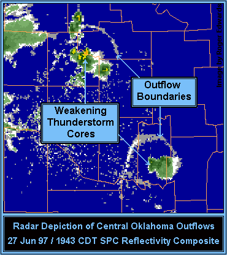

# Thunderstorm Outflow Boundaries

> Source: <https://www.theweatherprediction.com/habyhints/146/>  
> Section: Thunderstorms  
> Captured: 2026-08-19 06:00 UTC  
> PDF: [thunderstorm-outflow-boundaries.pdf](thunderstorm-outflow-boundaries.pdf) · Original HTML: [source/original.html](source/original.html)

---

**

[--**[MAIN HOME](http://www.theweatherprediction.com/)**--]
[--**[ALL HABYHINTS](../../19-weather-handbooks-and-important-links/www-theweatherprediction-com-haby-s-weather-prediction-hints/www-theweatherprediction-com-haby-s-weather-prediction-hints.md)**--]
[--**[FACEBOOK PAGE](https://www.facebook.com/pages/theweatherpredictioncom/265852916887147)**--]

**THUNDERSTORM OUTFLOW BOUNDARIES**

**METEOROLOGIST JEFF HABY**

**An outflow boundary is generated from the divergence of air within the
[downdraft](http://www.theweatherprediction.com/severe/structure/) of a thunderstorm that crashes
into the earth's surface. It is similar to smashing a water balloon on a concrete surface. The fluid spreads out
in all directions once the fluid impacts the earth's surface. The outflow from a thunderstorm will spread most rapidly
in the direction the low level winds are flowing. One side of the downdraft will have to flow against the prevailing
low level wind flow while the other side will be flowing with the prevailing low level wind flow. The angle the
downdraft accelerates into the earth's surface is also important in determining how the downdraft's air will be
distributed once impacting the surface. The acceleration rate of the downdraft is also important. Intense evaporational
cooling in the middle levels of the atmosphere, minimal influence of the updraft, and a warm
[PBL](http://www.theweatherprediction.com/basic/pbl/) maximizes the
acceleration of a downdraft of air.

The "edge" of the outflow boundary can often be detected by Doppler radar
(especially in clear air mode).
[Convergence](http://www.theweatherprediction.com/habyhints/149/) occurs along the leading edge of the downdraft. Convergence of dust, aerosols,
and bugs at the leading edge will lead to a higher clear air signature. The signature of the leading edge is also
influenced by the density change between the cold air from the downdraft and the warm environmental air. This density
boundary will increase the number of echo returns from the leading edge. Clouds, hydrometeors and new thunderstorms
can also develop along the outflow's leading edge. This makes it possible to locate the outflow boundary when using
precipitation mode. The image below is that of two outflow boundaries from two separate storms. Often, the outflow
boundary will bow in the direction it is moving the quickest.

**
