# Thunderstorm Tutorial — Tutorial #2

> Source: <https://twister.caps.ou.edu/MM2015/docs/chapter4/chapter4_b.pdf>  
> Section: Thunderstorms  
> Captured: 2026-08-19 06:00 UTC  
> PDF: [thunderstorm-tutorial-tutorial-2.pdf](thunderstorm-tutorial-tutorial-2.pdf) (16 pages)

---

## Page 1

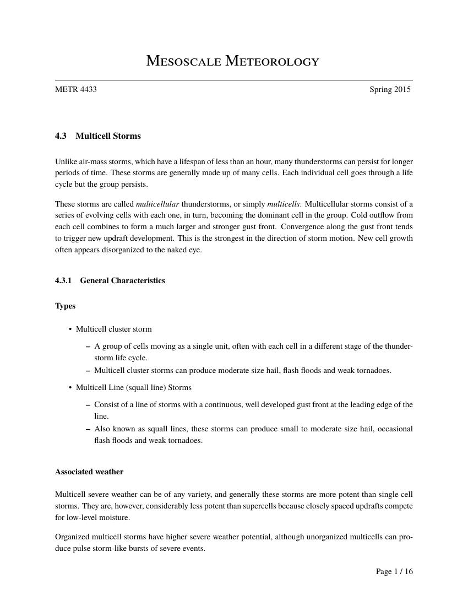

Mesoscale Meteorology
METR 4433
Spring 2015
4.3
Multicell Storms
Unlike air-mass storms, which have a lifespan of less than an hour, many thunderstorms can persist for longer
periods of time. These storms are generally made up of many cells. Each individual cell goes through a life
cycle but the group persists.
These storms are called multicellular thunderstorms, or simply multicells. Multicellular storms consist of a
series of evolving cells with each one, in turn, becoming the dominant cell in the group. Cold outflow from
each cell combines to form a much larger and stronger gust front. Convergence along the gust front tends
to trigger new updraft development. This is the strongest in the direction of storm motion. New cell growth
often appears disorganized to the naked eye.
4.3.1
General Characteristics
Types
• Multicell cluster storm
– A group of cells moving as a single unit, often with each cell in a different stage of the thunder-
storm life cycle.
– Multicell cluster storms can produce moderate size hail, flash floods and weak tornadoes.
• Multicell Line (squall line) Storms
– Consist of a line of storms with a continuous, well developed gust front at the leading edge of the
line.
– Also known as squall lines, these storms can produce small to moderate size hail, occasional
flash floods and weak tornadoes.
Associated weather
Multicell severe weather can be of any variety, and generally these storms are more potent than single cell
storms. They are, however, considerably less potent than supercells because closely spaced updrafts compete
for low-level moisture.
Organized multicell storms have higher severe weather potential, although unorganized multicells can pro-
duce pulse storm-like bursts of severe events.
Page 1 / 16

## Page 2

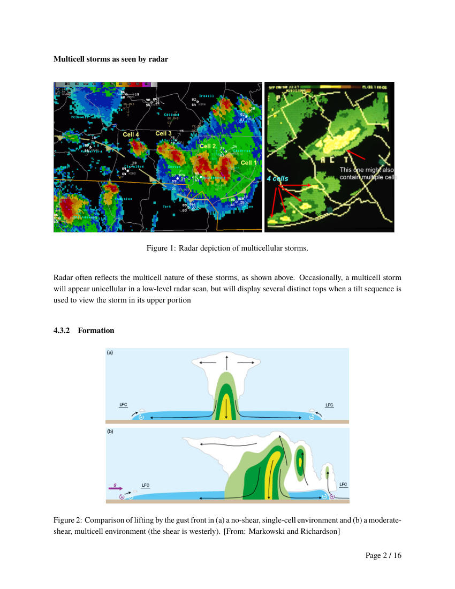

Multicell storms as seen by radar
Figure 1: Radar depiction of multicellular storms.
Radar often reflects the multicell nature of these storms, as shown above. Occasionally, a multicell storm
will appear unicellular in a low-level radar scan, but will display several distinct tops when a tilt sequence is
used to view the storm in its upper portion
4.3.2
Formation
Figure 2: Comparison of lifting by the gust front in (a) a no-shear, single-cell environment and (b) a moderate-
shear, multicell environment (the shear is westerly). [From: Markowski and Richardson]
Page 2 / 16

## Page 3

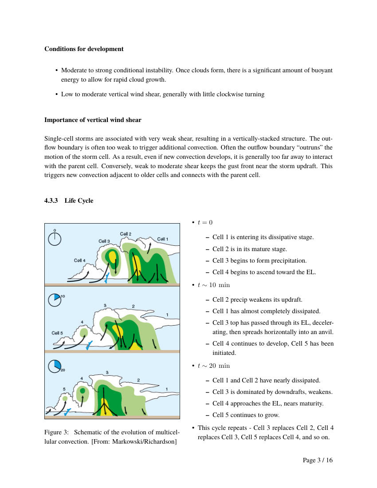

Conditions for development
• Moderate to strong conditional instability. Once clouds form, there is a significant amount of buoyant
energy to allow for rapid cloud growth.
• Low to moderate vertical wind shear, generally with little clockwise turning
Importance of vertical wind shear
Single-cell storms are associated with very weak shear, resulting in a vertically-stacked structure. The out-
flow boundary is often too weak to trigger additional convection. Often the outflow boundary “outruns” the
motion of the storm cell. As a result, even if new convection develops, it is generally too far away to interact
with the parent cell. Conversely, weak to moderate shear keeps the gust front near the storm updraft. This
triggers new convection adjacent to older cells and connects with the parent cell.
4.3.3
Life Cycle
Figure 3: Schematic of the evolution of multicel-
lular convection. [From: Markowski/Richardson]
• t = 0
– Cell 1 is entering its dissipative stage.
– Cell 2 is in its mature stage.
– Cell 3 begins to form precipitation.
– Cell 4 begins to ascend toward the EL.
• t ∼10 min
– Cell 2 precip weakens its updraft.
– Cell 1 has almost completely dissipated.
– Cell 3 top has passed through its EL, deceler-
ating, then spreads horizontally into an anvil.
– Cell 4 continues to develop, Cell 5 has been
initiated.
• t ∼20 min
– Cell 1 and Cell 2 have nearly dissipated.
– Cell 3 is dominated by downdrafts, weakens.
– Cell 4 approaches the EL, nears maturity.
– Cell 5 continues to grow.
• This cycle repeats - Cell 3 replaces Cell 2, Cell 4
replaces Cell 3, Cell 5 replaces Cell 4, and so on.
Page 3 / 16

## Page 4

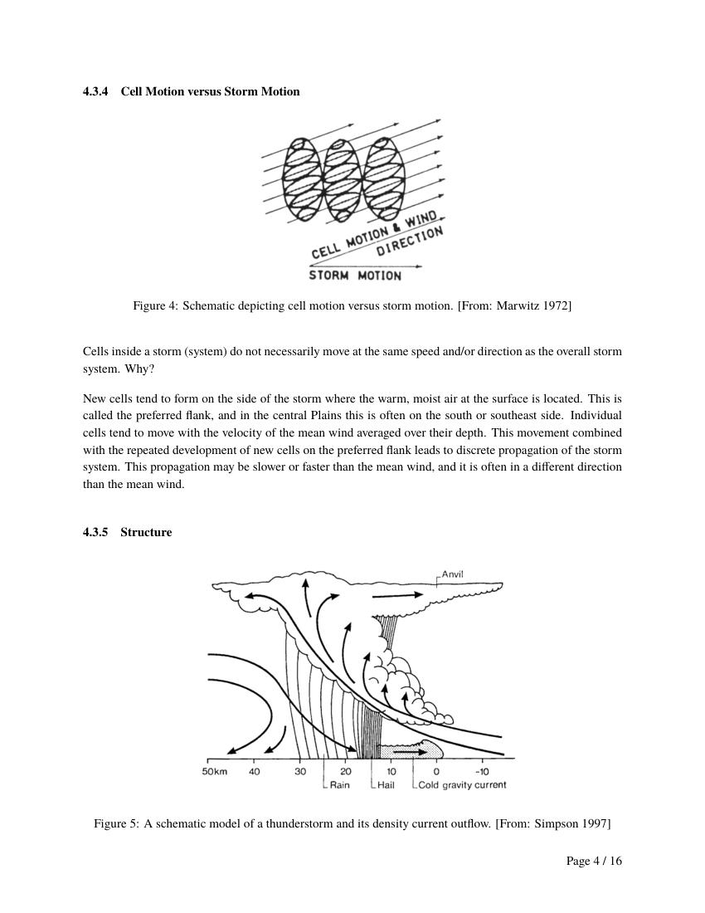

4.3.4
Cell Motion versus Storm Motion
Figure 4: Schematic depicting cell motion versus storm motion. [From: Marwitz 1972]
Cells inside a storm (system) do not necessarily move at the same speed and/or direction as the overall storm
system. Why?
New cells tend to form on the side of the storm where the warm, moist air at the surface is located. This is
called the preferred flank, and in the central Plains this is often on the south or southeast side. Individual
cells tend to move with the velocity of the mean wind averaged over their depth. This movement combined
with the repeated development of new cells on the preferred flank leads to discrete propagation of the storm
system. This propagation may be slower or faster than the mean wind, and it is often in a different direction
than the mean wind.
4.3.5
Structure
Figure 5: A schematic model of a thunderstorm and its density current outflow. [From: Simpson 1997]
Page 4 / 16

## Page 5

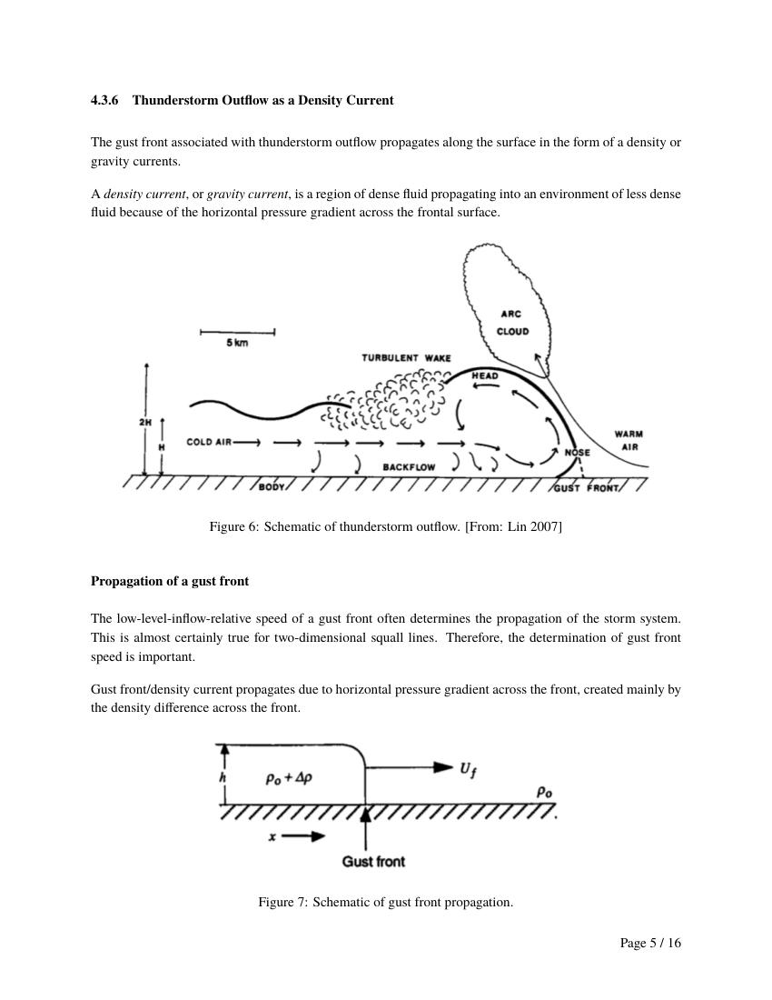

4.3.6
Thunderstorm Outflow as a Density Current
The gust front associated with thunderstorm outflow propagates along the surface in the form of a density or
gravity currents.
A density current, or gravity current, is a region of dense fluid propagating into an environment of less dense
fluid because of the horizontal pressure gradient across the frontal surface.
Figure 6: Schematic of thunderstorm outflow. [From: Lin 2007]
Propagation of a gust front
The low-level-inflow-relative speed of a gust front often determines the propagation of the storm system.
This is almost certainly true for two-dimensional squall lines. Therefore, the determination of gust front
speed is important.
Gust front/density current propagates due to horizontal pressure gradient across the front, created mainly by
the density difference across the front.
Figure 7: Schematic of gust front propagation.
Page 5 / 16

## Page 6

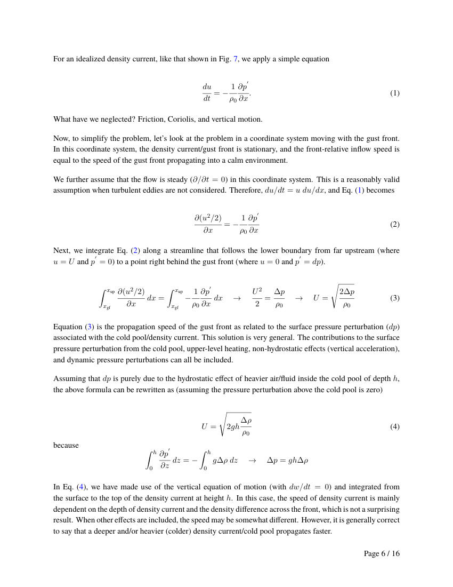

For an idealized density current, like that shown in Fig. 7, we apply a simple equation
du
dt = −1
ρ0
∂p
′
∂x.
(1)
What have we neglected? Friction, Coriolis, and vertical motion.
Now, to simplify the problem, let’s look at the problem in a coordinate system moving with the gust front.
In this coordinate system, the density current/gust front is stationary, and the front-relative inflow speed is
equal to the speed of the gust front propagating into a calm environment.
We further assume that the flow is steady (∂/∂t = 0) in this coordinate system. This is a reasonably valid
assumption when turbulent eddies are not considered. Therefore, du/dt = u du/dx, and Eq. (1) becomes
∂(u2/2)
∂x
= −1
ρ0
∂p
′
∂x
(2)
Next, we integrate Eq. (2) along a streamline that follows the lower boundary from far upstream (where
u = U and p
′ = 0) to a point right behind the gust front (where u = 0 and p
′ = dp).
Z xup
xgf
∂(u2/2)
∂x
dx =
Z xup
xgf
−1
ρ0
∂p
′
∂x dx
→
U2
2 = ∆p
ρ0
→
U =
s
2∆p
ρ0
(3)
Equation (3) is the propagation speed of the gust front as related to the surface pressure perturbation (dp)
associated with the cold pool/density current. This solution is very general. The contributions to the surface
pressure perturbation from the cold pool, upper-level heating, non-hydrostatic effects (vertical acceleration),
and dynamic pressure perturbations can all be included.
Assuming that dp is purely due to the hydrostatic effect of heavier air/fluid inside the cold pool of depth h,
the above formula can be rewritten as (assuming the pressure perturbation above the cold pool is zero)
U =
s
2gh∆ρ
ρ0
(4)
because
Z h
0
∂p
′
∂z dz = −
Z h
0
g∆ρ dz
→
∆p = gh∆ρ
In Eq. (4), we have made use of the vertical equation of motion (with dw/dt = 0) and integrated from
the surface to the top of the density current at height h. In this case, the speed of density current is mainly
dependent on the depth of density current and the density difference across the front, which is not a surprising
result. When other effects are included, the speed may be somewhat different. However, it is generally correct
to say that a deeper and/or heavier (colder) density current/cold pool propagates faster.
Page 6 / 16

## Page 7

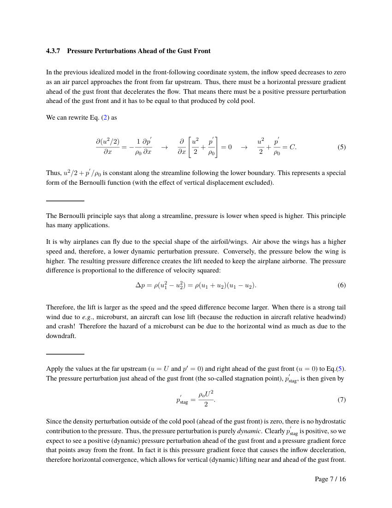

4.3.7
Pressure Perturbations Ahead of the Gust Front
In the previous idealized model in the front-following coordinate system, the inflow speed decreases to zero
as an air parcel approaches the front from far upstream. Thus, there must be a horizontal pressure gradient
ahead of the gust front that decelerates the flow. That means there must be a positive pressure perturbation
ahead of the gust front and it has to be equal to that produced by cold pool.
We can rewrite Eq. (2) as
∂(u2/2)
∂x
= −1
ρ0
∂p
′
∂x
→
∂
∂x
"
u2
2 + p
′
ρ0
#
= 0
→
u2
2 + p
′
ρ0
= C.
(5)
Thus, u2/2 + p
′/ρ0 is constant along the streamline following the lower boundary. This represents a special
form of the Bernoulli function (with the effect of vertical displacement excluded).
The Bernoulli principle says that along a streamline, pressure is lower when speed is higher. This principle
has many applications.
It is why airplanes can fly due to the special shape of the airfoil/wings. Air above the wings has a higher
speed and, therefore, a lower dynamic perturbation pressure. Conversely, the pressure below the wing is
higher. The resulting pressure difference creates the lift needed to keep the airplane airborne. The pressure
difference is proportional to the difference of velocity squared:
∆p = ρ(u2
1 −u2
2) = ρ(u1 + u2)(u1 −u2).
(6)
Therefore, the lift is larger as the speed and the speed difference become larger. When there is a strong tail
wind due to e.g., microburst, an aircraft can lose lift (because the reduction in aircraft relative headwind)
and crash! Therefore the hazard of a microburst can be due to the horizontal wind as much as due to the
downdraft.
Apply the values at the far upstream (u = U and p′ = 0) and right ahead of the gust front (u = 0) to Eq.(5).
The pressure perturbation just ahead of the gust front (the so-called stagnation point), p
′
stag, is then given by
p
′
stag = ρoU2
2
.
(7)
Since the density perturbation outside of the cold pool (ahead of the gust front) is zero, there is no hydrostatic
contribution to the pressure. Thus, the pressure perturbation is purely dynamic. Clearly p
′
stag is positive, so we
expect to see a positive (dynamic) pressure perturbation ahead of the gust front and a pressure gradient force
that points away from the front. In fact it is this pressure gradient force that causes the inflow deceleration,
therefore horizontal convergence, which allows for vertical (dynamic) lifting near and ahead of the gust front.
Page 7 / 16

## Page 8

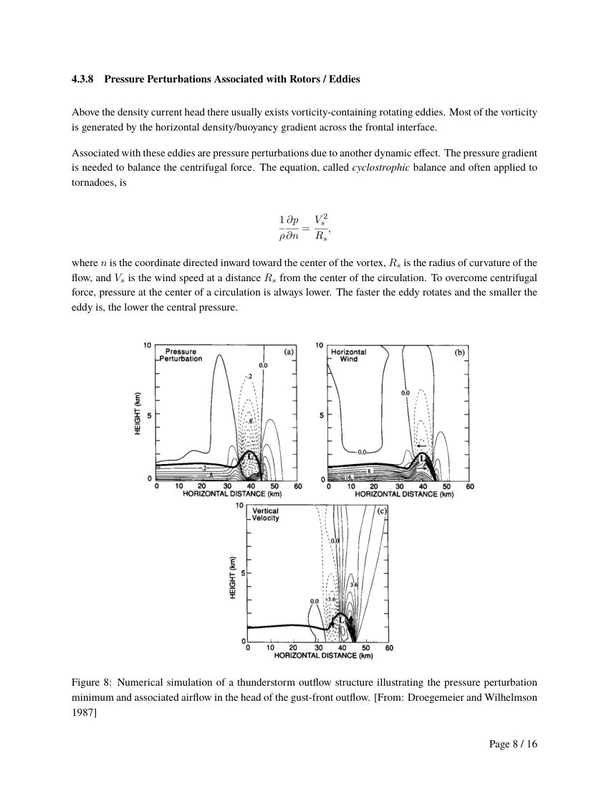

4.3.8
Pressure Perturbations Associated with Rotors / Eddies
Above the density current head there usually exists vorticity-containing rotating eddies. Most of the vorticity
is generated by the horizontal density/buoyancy gradient across the frontal interface.
Associated with these eddies are pressure perturbations due to another dynamic effect. The pressure gradient
is needed to balance the centrifugal force. The equation, called cyclostrophic balance and often applied to
tornadoes, is
1
ρ
∂p
∂n = V 2
s
Rs
,
where n is the coordinate directed inward toward the center of the vortex, Rs is the radius of curvature of the
flow, and Vs is the wind speed at a distance Rs from the center of the circulation. To overcome centrifugal
force, pressure at the center of a circulation is always lower. The faster the eddy rotates and the smaller the
eddy is, the lower the central pressure.
Figure 8: Numerical simulation of a thunderstorm outflow structure illustrating the pressure perturbation
minimum and associated airflow in the head of the gust-front outflow. [From: Droegemeier and Wilhelmson
1987]
Page 8 / 16

## Page 9

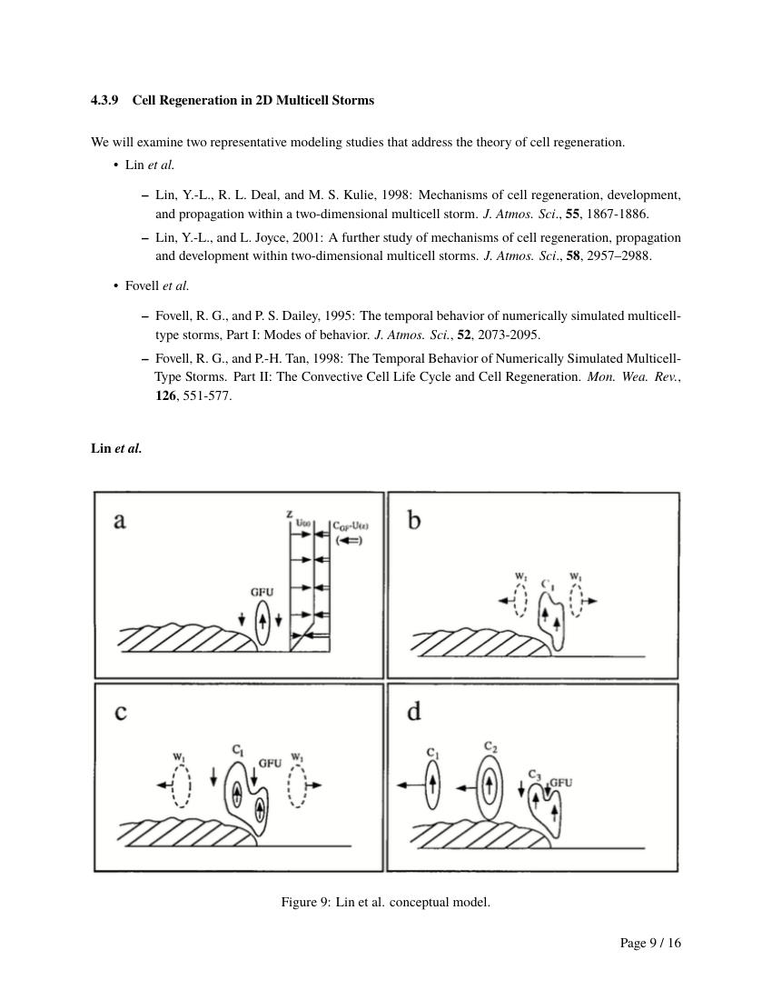

4.3.9
Cell Regeneration in 2D Multicell Storms
We will examine two representative modeling studies that address the theory of cell regeneration.
• Lin et al.
– Lin, Y.-L., R. L. Deal, and M. S. Kulie, 1998: Mechanisms of cell regeneration, development,
and propagation within a two-dimensional multicell storm. J. Atmos. Sci., 55, 1867-1886.
– Lin, Y.-L., and L. Joyce, 2001: A further study of mechanisms of cell regeneration, propagation
and development within two-dimensional multicell storms. J. Atmos. Sci., 58, 2957–2988.
• Fovell et al.
– Fovell, R. G., and P. S. Dailey, 1995: The temporal behavior of numerically simulated multicell-
type storms, Part I: Modes of behavior. J. Atmos. Sci., 52, 2073-2095.
– Fovell, R. G., and P.-H. Tan, 1998: The Temporal Behavior of Numerically Simulated Multicell-
Type Storms. Part II: The Convective Cell Life Cycle and Cell Regeneration. Mon. Wea. Rev.,
126, 551-577.
Lin et al.
Figure 9: Lin et al. conceptual model.
Page 9 / 16

## Page 10

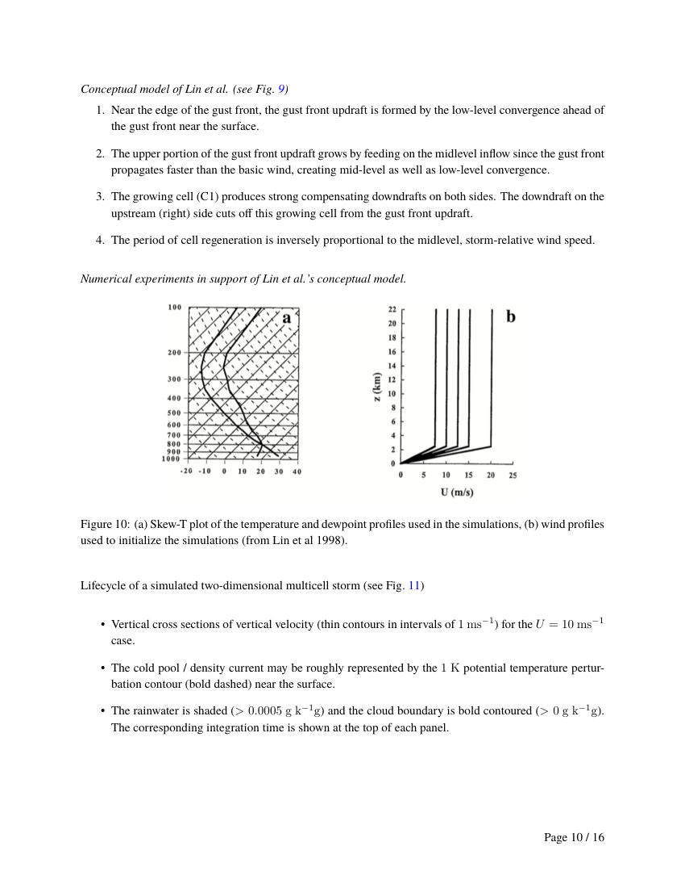

Conceptual model of Lin et al. (see Fig. 9)
1. Near the edge of the gust front, the gust front updraft is formed by the low-level convergence ahead of
the gust front near the surface.
2. The upper portion of the gust front updraft grows by feeding on the midlevel inflow since the gust front
propagates faster than the basic wind, creating mid-level as well as low-level convergence.
3. The growing cell (C1) produces strong compensating downdrafts on both sides. The downdraft on the
upstream (right) side cuts offthis growing cell from the gust front updraft.
4. The period of cell regeneration is inversely proportional to the midlevel, storm-relative wind speed.
Numerical experiments in support of Lin et al.’s conceptual model.
Figure 10: (a) Skew-T plot of the temperature and dewpoint profiles used in the simulations, (b) wind profiles
used to initialize the simulations (from Lin et al 1998).
Lifecycle of a simulated two-dimensional multicell storm (see Fig. 11)
• Vertical cross sections of vertical velocity (thin contours in intervals of 1 ms−1) for the U = 10 ms−1
case.
• The cold pool / density current may be roughly represented by the 1 K potential temperature pertur-
bation contour (bold dashed) near the surface.
• The rainwater is shaded (> 0.0005 g k−1g) and the cloud boundary is bold contoured (> 0 g k−1g).
The corresponding integration time is shown at the top of each panel.
Page 10 / 16

## Page 11

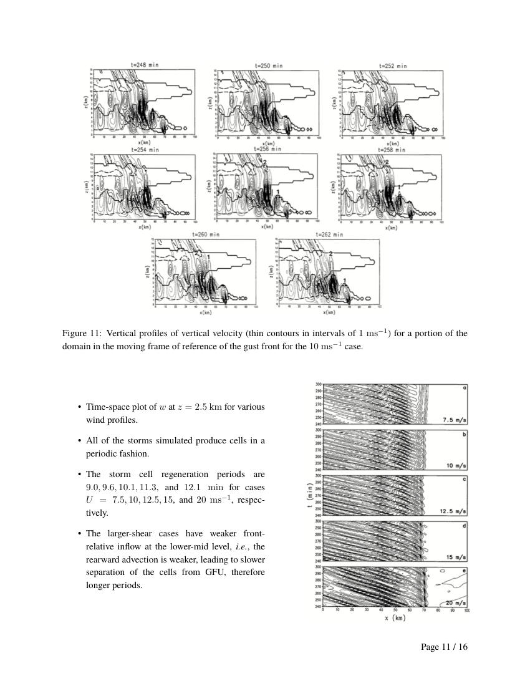

Figure 11: Vertical profiles of vertical velocity (thin contours in intervals of 1 ms−1) for a portion of the
domain in the moving frame of reference of the gust front for the 10 ms−1 case.
• Time-space plot of w at z = 2.5 km for various
wind profiles.
• All of the storms simulated produce cells in a
periodic fashion.
• The
storm
cell
regeneration
periods
are
9.0, 9.6, 10.1, 11.3, and 12.1 min for cases
U = 7.5, 10, 12.5, 15, and 20 ms−1, respec-
tively.
• The larger-shear cases have weaker front-
relative inflow at the lower-mid level, i.e., the
rearward advection is weaker, leading to slower
separation of the cells from GFU, therefore
longer periods.
Page 11 / 16

## Page 12

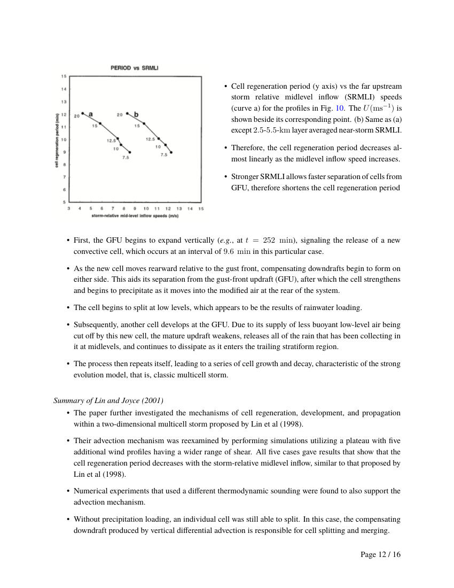

• Cell regeneration period (y axis) vs the far upstream
storm relative midlevel inflow (SRMLI) speeds
(curve a) for the profiles in Fig. 10. The U(ms−1) is
shown beside its corresponding point. (b) Same as (a)
except 2.5-5.5-km layer averaged near-storm SRMLI.
• Therefore, the cell regeneration period decreases al-
most linearly as the midlevel inflow speed increases.
• Stronger SRMLI allows faster separation of cells from
GFU, therefore shortens the cell regeneration period
• First, the GFU begins to expand vertically (e.g., at t = 252 min), signaling the release of a new
convective cell, which occurs at an interval of 9.6 min in this particular case.
• As the new cell moves rearward relative to the gust front, compensating downdrafts begin to form on
either side. This aids its separation from the gust-front updraft (GFU), after which the cell strengthens
and begins to precipitate as it moves into the modified air at the rear of the system.
• The cell begins to split at low levels, which appears to be the results of rainwater loading.
• Subsequently, another cell develops at the GFU. Due to its supply of less buoyant low-level air being
cut offby this new cell, the mature updraft weakens, releases all of the rain that has been collecting in
it at midlevels, and continues to dissipate as it enters the trailing stratiform region.
• The process then repeats itself, leading to a series of cell growth and decay, characteristic of the strong
evolution model, that is, classic multicell storm.
Summary of Lin and Joyce (2001)
• The paper further investigated the mechanisms of cell regeneration, development, and propagation
within a two-dimensional multicell storm proposed by Lin et al (1998).
• Their advection mechanism was reexamined by performing simulations utilizing a plateau with five
additional wind profiles having a wider range of shear. All five cases gave results that show that the
cell regeneration period decreases with the storm-relative midlevel inflow, similar to that proposed by
Lin et al (1998).
• Numerical experiments that used a different thermodynamic sounding were found to also support the
advection mechanism.
• Without precipitation loading, an individual cell was still able to split. In this case, the compensating
downdraft produced by vertical differential advection is responsible for cell splitting and merging.
Page 12 / 16

## Page 13

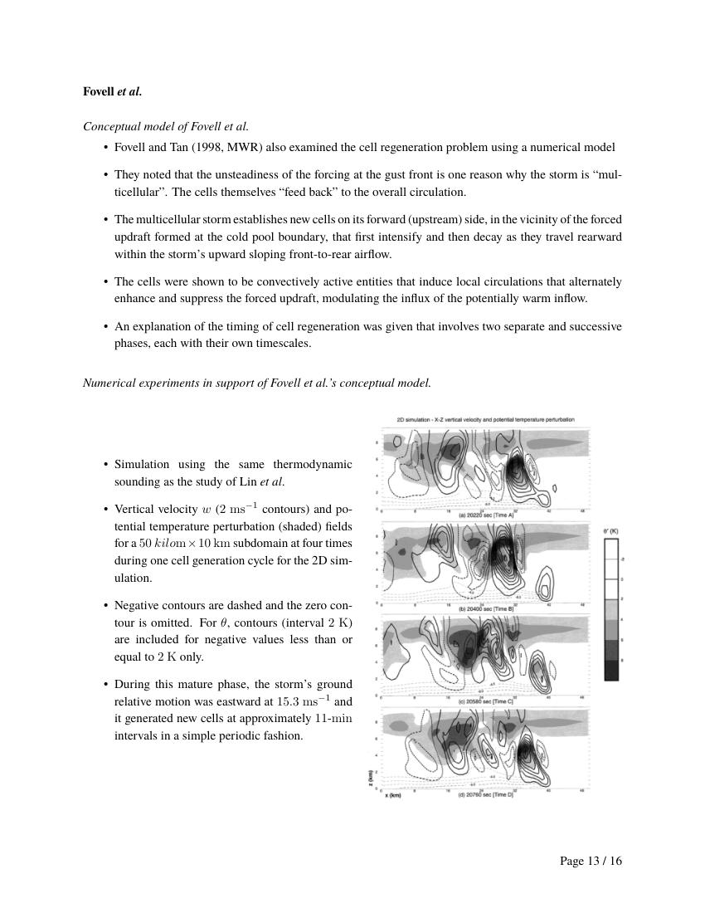

Fovell et al.
Conceptual model of Fovell et al.
• Fovell and Tan (1998, MWR) also examined the cell regeneration problem using a numerical model
• They noted that the unsteadiness of the forcing at the gust front is one reason why the storm is “mul-
ticellular”. The cells themselves “feed back” to the overall circulation.
• The multicellular storm establishes new cells on its forward (upstream) side, in the vicinity of the forced
updraft formed at the cold pool boundary, that first intensify and then decay as they travel rearward
within the storm’s upward sloping front-to-rear airflow.
• The cells were shown to be convectively active entities that induce local circulations that alternately
enhance and suppress the forced updraft, modulating the influx of the potentially warm inflow.
• An explanation of the timing of cell regeneration was given that involves two separate and successive
phases, each with their own timescales.
Numerical experiments in support of Fovell et al.’s conceptual model.
• Simulation using the same thermodynamic
sounding as the study of Lin et al.
• Vertical velocity w (2 ms−1 contours) and po-
tential temperature perturbation (shaded) fields
for a 50 kilom×10 km subdomain at four times
during one cell generation cycle for the 2D sim-
ulation.
• Negative contours are dashed and the zero con-
tour is omitted. For θ, contours (interval 2 K)
are included for negative values less than or
equal to 2 K only.
• During this mature phase, the storm’s ground
relative motion was eastward at 15.3 ms−1 and
it generated new cells at approximately 11-min
intervals in a simple periodic fashion.
Page 13 / 16

## Page 14

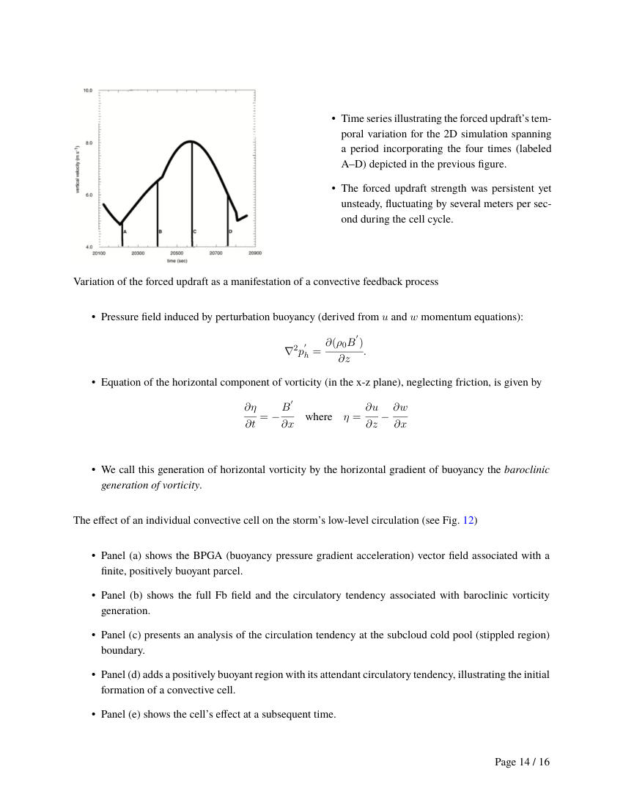

• Time series illustrating the forced updraft’s tem-
poral variation for the 2D simulation spanning
a period incorporating the four times (labeled
A–D) depicted in the previous figure.
• The forced updraft strength was persistent yet
unsteady, fluctuating by several meters per sec-
ond during the cell cycle.
Variation of the forced updraft as a manifestation of a convective feedback process
• Pressure field induced by perturbation buoyancy (derived from u and w momentum equations):
∇2p
′
h = ∂(ρ0B
′)
∂z
.
• Equation of the horizontal component of vorticity (in the x-z plane), neglecting friction, is given by
∂η
∂t = −B
′
∂x
where
η = ∂u
∂z −∂w
∂x
• We call this generation of horizontal vorticity by the horizontal gradient of buoyancy the baroclinic
generation of vorticity.
The effect of an individual convective cell on the storm’s low-level circulation (see Fig. 12)
• Panel (a) shows the BPGA (buoyancy pressure gradient acceleration) vector field associated with a
finite, positively buoyant parcel.
• Panel (b) shows the full Fb field and the circulatory tendency associated with baroclinic vorticity
generation.
• Panel (c) presents an analysis of the circulation tendency at the subcloud cold pool (stippled region)
boundary.
• Panel (d) adds a positively buoyant region with its attendant circulatory tendency, illustrating the initial
formation of a convective cell.
• Panel (e) shows the cell’s effect at a subsequent time.
Page 14 / 16

## Page 15

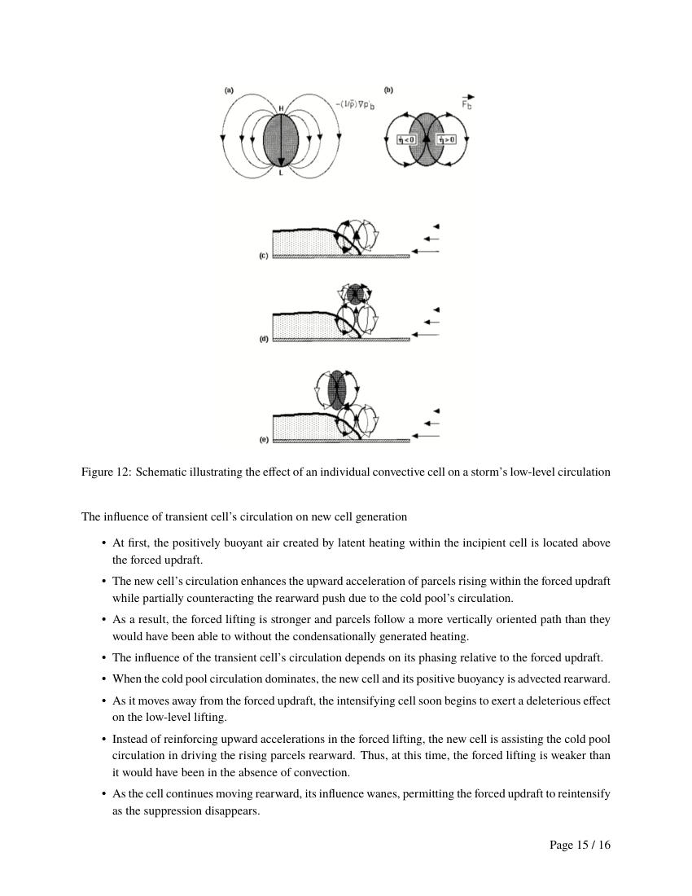

Figure 12: Schematic illustrating the effect of an individual convective cell on a storm’s low-level circulation
The influence of transient cell’s circulation on new cell generation
• At first, the positively buoyant air created by latent heating within the incipient cell is located above
the forced updraft.
• The new cell’s circulation enhances the upward acceleration of parcels rising within the forced updraft
while partially counteracting the rearward push due to the cold pool’s circulation.
• As a result, the forced lifting is stronger and parcels follow a more vertically oriented path than they
would have been able to without the condensationally generated heating.
• The influence of the transient cell’s circulation depends on its phasing relative to the forced updraft.
• When the cold pool circulation dominates, the new cell and its positive buoyancy is advected rearward.
• As it moves away from the forced updraft, the intensifying cell soon begins to exert a deleterious effect
on the low-level lifting.
• Instead of reinforcing upward accelerations in the forced lifting, the new cell is assisting the cold pool
circulation in driving the rising parcels rearward. Thus, at this time, the forced lifting is weaker than
it would have been in the absence of convection.
• As the cell continues moving rearward, its influence wanes, permitting the forced updraft to reintensify
as the suppression disappears.
Page 15 / 16

## Page 16

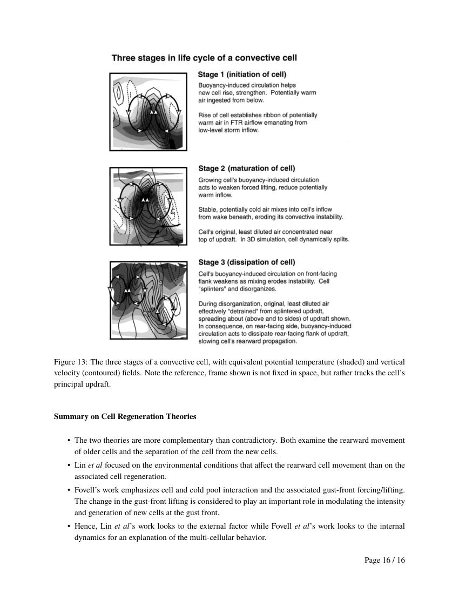

Figure 13: The three stages of a convective cell, with equivalent potential temperature (shaded) and vertical
velocity (contoured) fields. Note the reference, frame shown is not fixed in space, but rather tracks the cell’s
principal updraft.
Summary on Cell Regeneration Theories
• The two theories are more complementary than contradictory. Both examine the rearward movement
of older cells and the separation of the cell from the new cells.
• Lin et al focused on the environmental conditions that affect the rearward cell movement than on the
associated cell regeneration.
• Fovell’s work emphasizes cell and cold pool interaction and the associated gust-front forcing/lifting.
The change in the gust-front lifting is considered to play an important role in modulating the intensity
and generation of new cells at the gust front.
• Hence, Lin et al’s work looks to the external factor while Fovell et al’s work looks to the internal
dynamics for an explanation of the multi-cellular behavior.
Page 16 / 16
