# Thunderstorm Tutorial — here

> Source: <http://www.weather.gov/media/zhu/ZHU_Training_Page/thunderstorm_stuff/splitting_supercells/Supercell_Structure.pdf>  
> Section: Thunderstorms  
> Captured: 2026-08-19 06:00 UTC  
> PDF: [supercell-structure.pdf](supercell-structure.pdf) (29 pages)

---

## Page 1

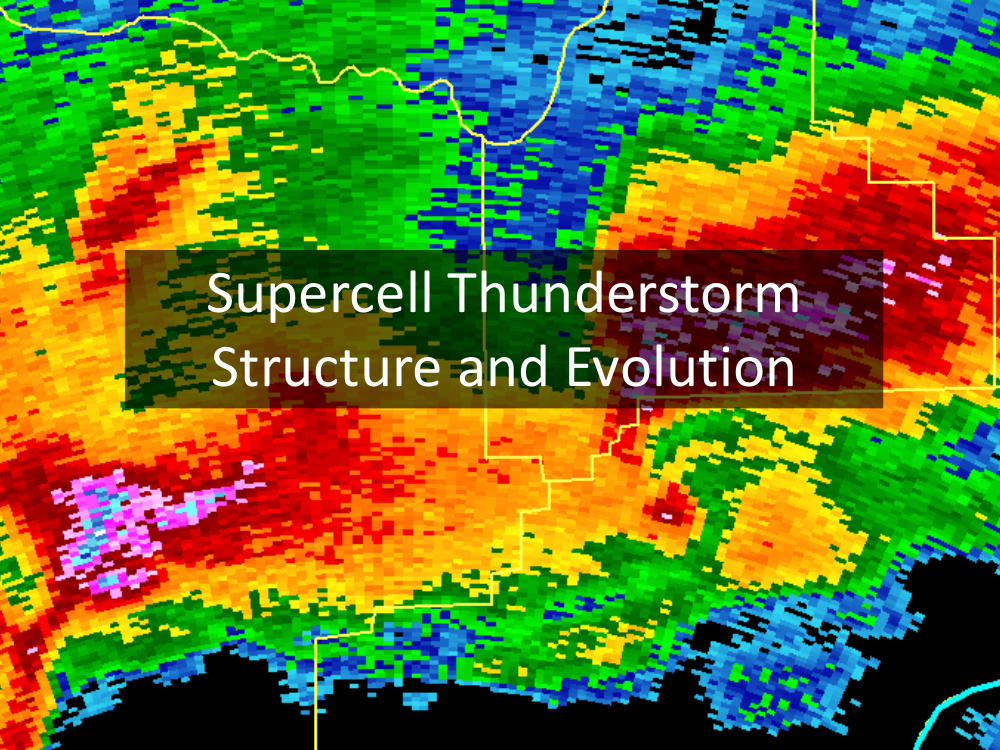

Supercell Thunderstorm               
Structure and Evolution

## Page 2

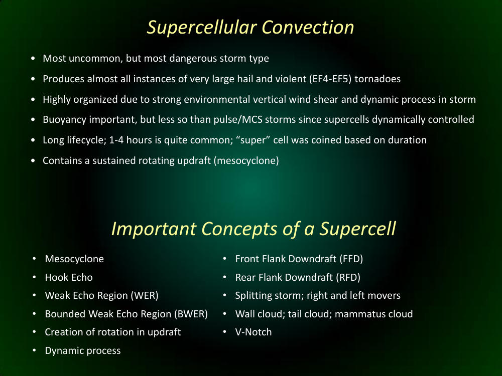

• Most uncommon, but most dangerous storm type 
• Produces almost all instances of very large hail and violent (EF4-EF5) tornadoes 
• Highly organized due to strong environmental vertical wind shear and dynamic process in storm 
• Buoyancy important, but less so than pulse/MCS storms since supercells dynamically controlled 
• Long lifecycle; 1-4 hours is quite common; “super” cell was coined based on duration 
• Contains a sustained rotating updraft (mesocyclone) 
 
Supercellular Convection 
• Mesocyclone 
• Hook Echo 
 
 
• Weak Echo Region (WER) 
 
• Bounded Weak Echo Region (BWER) 
• Creation of rotation in updraft  
• Dynamic process 
• Front Flank Downdraft (FFD) 
• Rear Flank Downdraft (RFD) 
• Splitting storm; right and left movers 
• Wall cloud; tail cloud; mammatus cloud 
• V-Notch 
 Important Concepts of a Supercell

## Page 3

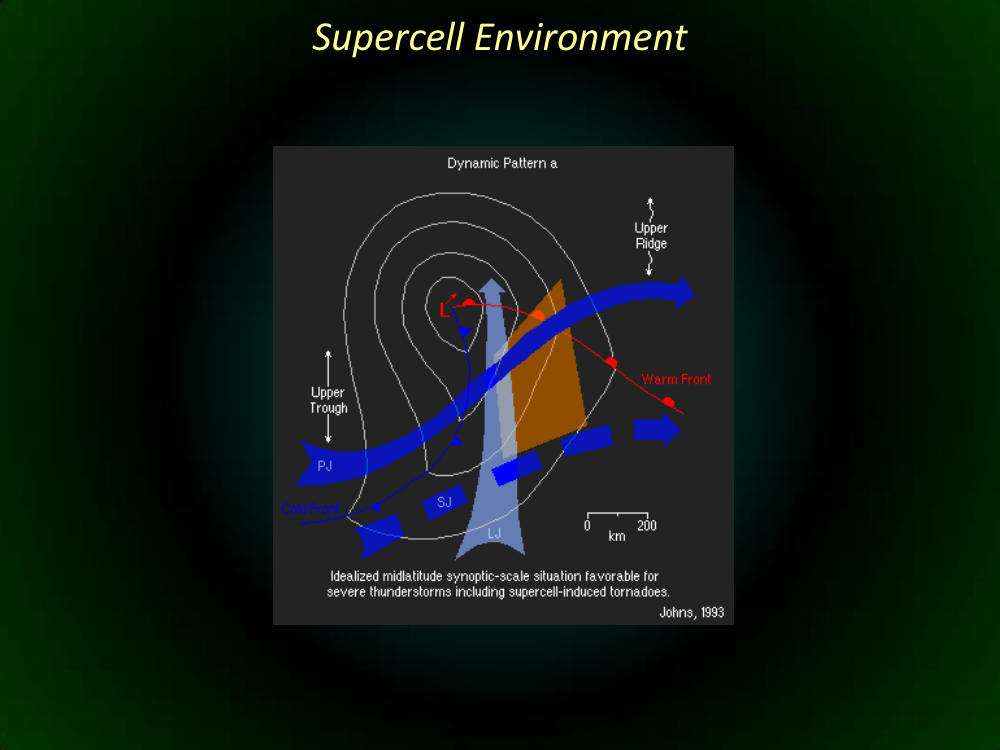

Supercell Environment

## Page 4

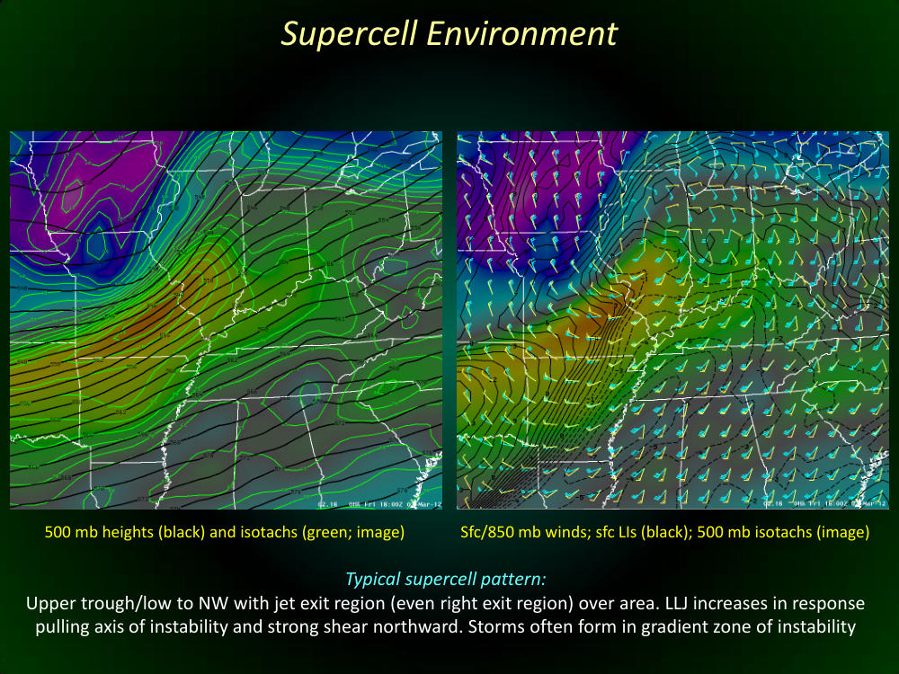

500 mb heights (black) and isotachs (green; image) 
Sfc/850 mb winds; sfc LIs (black); 500 mb isotachs (image) 
Typical supercell pattern:  
Upper trough/low to NW with jet exit region (even right exit region) over area. LLJ increases in response 
pulling axis of instability and strong shear northward. Storms often form in gradient zone of instability 
Supercell Environment

## Page 5

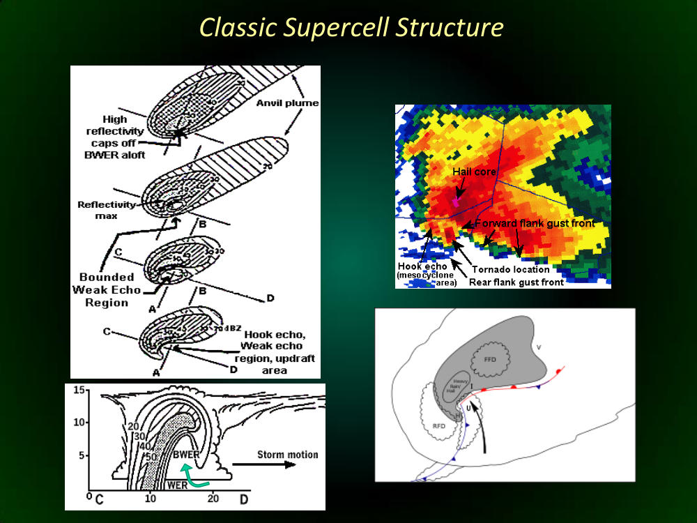

Classic Supercell Structure

## Page 6

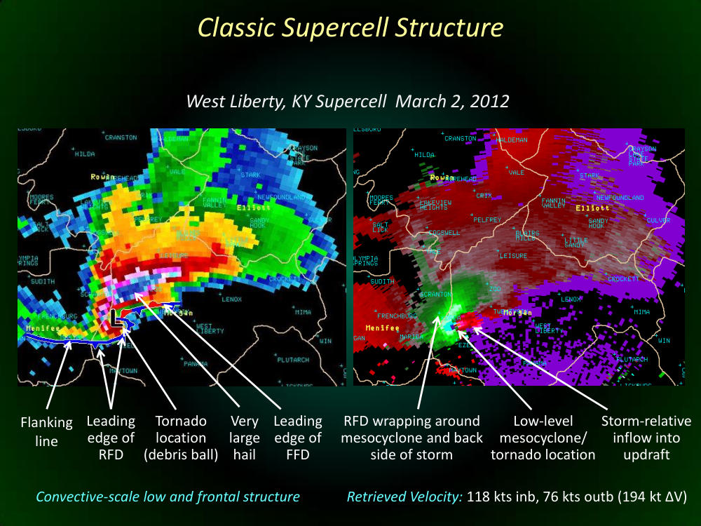

Retrieved Velocity: 
Retrieved Velocity: 118 kts inb, 76 kts outb (194 kt ∆V) 
West Liberty, KY Supercell  March 2, 2012 
Very 
large 
hail 
Tornado 
location 
(debris ball) 
Flanking 
line 
Leading 
edge of 
RFD 
Classic Supercell Structure 
Low-level 
mesocyclone/ 
tornado location 
Convective-scale low and frontal structure 
Leading 
edge of 
FFD 
RFD wrapping around 
mesocyclone and back 
side of storm 
Storm-relative 
inflow into 
updraft

## Page 7

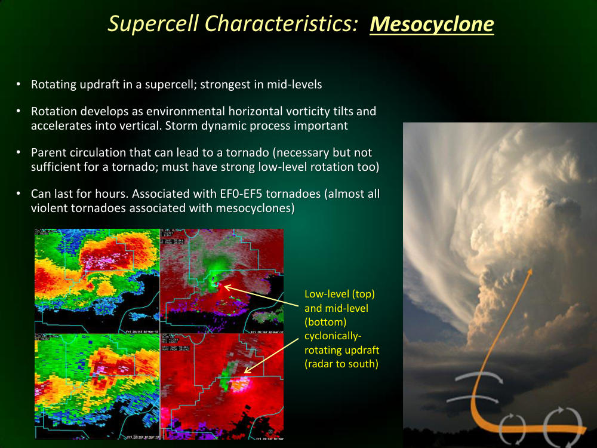

• R
 
•Parent circulation that can lead to a tornado (necessary but not sufficient for a tornado; must have strong low
-level rotation too)
 
• Can last for hours. Associated with EF0
-EF5 tornadoes (almost all 
violent tornadoes associated with mesocyclones)
 
• Rotating updraft in a supercell; strongest in mid-levels 
• Rotation develops as environmental horizontal vorticity tilts and 
accelerates into vertical. Storm dynamic process important  
• Parent circulation that can lead to a tornado (necessary but not 
sufficient for a tornado; must have strong low-level rotation too) 
• Can last for hours. Associated with EF0-EF5 tornadoes (almost all 
violent tornadoes associated with mesocyclones) 
Supercell Characteristics:  Mesocyclone 
Low
-level (top) and mid
-level 
(bottom) cyclonically
-
rotating updraft (radar to south)
 
Low-level (top) 
and mid-level 
(bottom) 
cyclonically-
rotating updraft 
(radar to south)

## Page 8

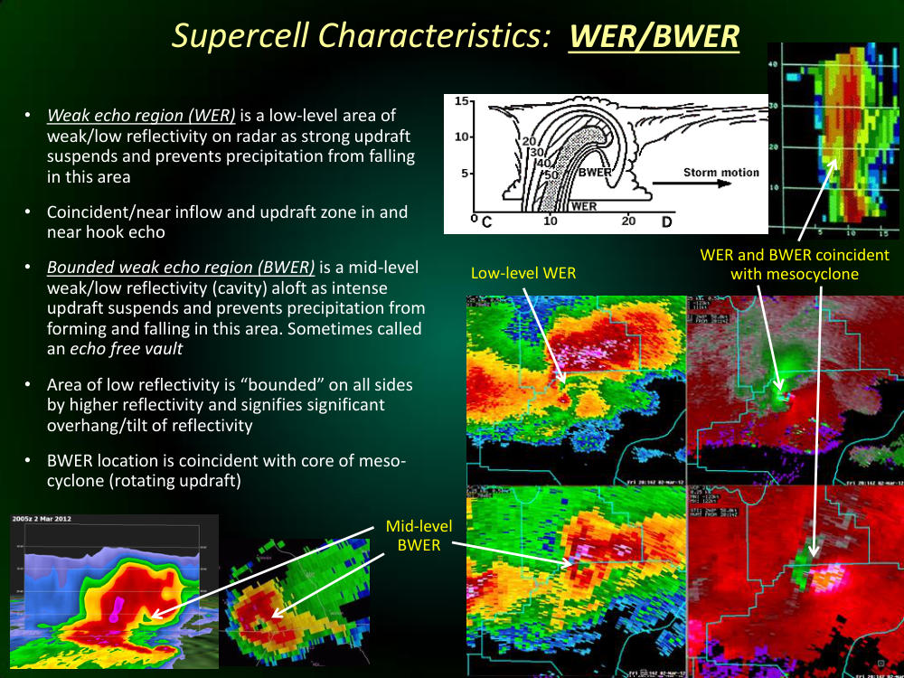

•
Weak echo region (WER) is a low-level area of 
weak/low reflectivity on radar as strong updraft 
suspends and prevents precipitation from falling 
in this area 
•
Coincident/near inflow and updraft zone in and 
near hook echo 
•
Bounded weak echo region (BWER) is a mid-level 
weak/low reflectivity (cavity) aloft as intense 
updraft suspends and prevents precipitation from 
forming and falling in this area. Sometimes called 
an echo free vault 
•
Area of low reflectivity is “bounded” on all sides 
by higher reflectivity and signifies significant 
overhang/tilt of reflectivity 
•
BWER location is coincident with core of meso-
cyclone (rotating updraft) 
Supercell Characteristics:  WER/BWER 
Mid-level 
BWER 
Low-level WER 
WER and BWER coincident 
with mesocyclone

## Page 9

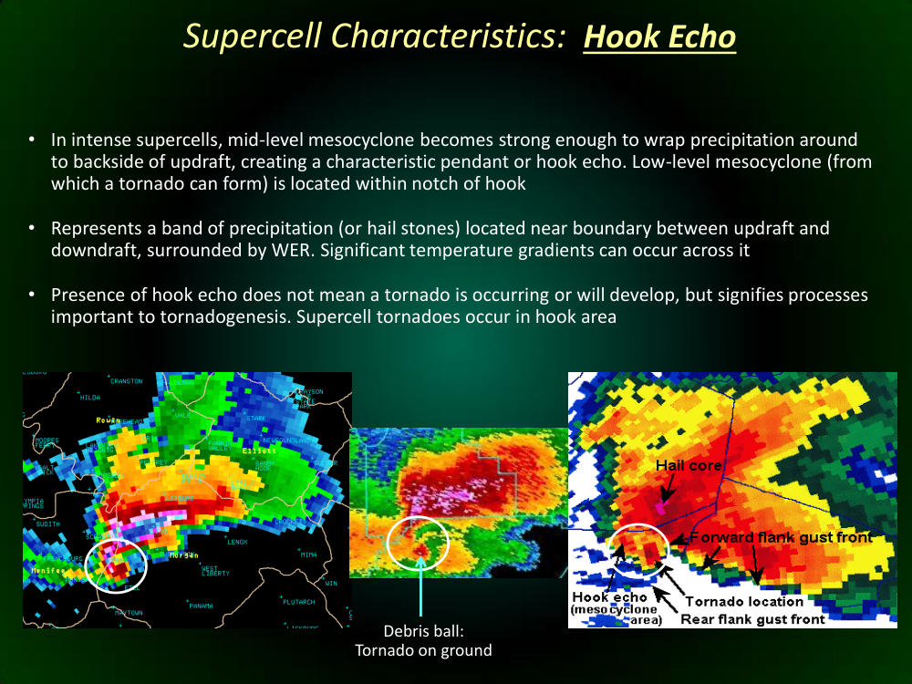

• In intense supercells, mid-level mesocyclone becomes strong enough to wrap precipitation around 
to backside of updraft, creating a characteristic pendant or hook echo. Low-level mesocyclone (from 
which a tornado can form) is located within notch of hook 
• Represents a band of precipitation (or hail stones) located near boundary between updraft and 
downdraft, surrounded by WER. Significant temperature gradients can occur across it 
• Presence of hook echo does not mean a tornado is occurring or will develop, but signifies processes 
important to tornadogenesis. Supercell tornadoes occur in hook area 
Supercell Characteristics:  Hook Echo 
Debris ball:        
Tornado on ground

## Page 10

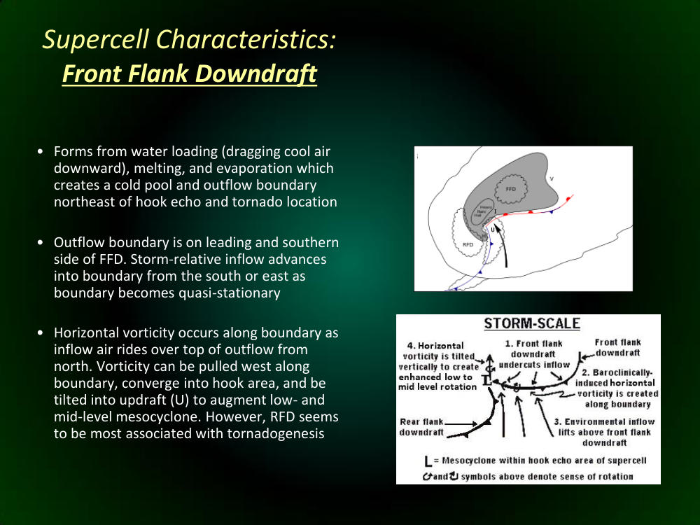

• Forms from water loading (dragging cool air 
downward), melting, and evaporation which 
creates a cold pool and outflow boundary 
northeast of hook echo and tornado location 
• Outflow boundary is on leading and southern 
side of FFD. Storm-relative inflow advances 
into boundary from the south or east as 
boundary becomes quasi-stationary 
• Horizontal vorticity occurs along boundary as 
inflow air rides over top of outflow from 
north. Vorticity can be pulled west along 
boundary, converge into hook area, and be 
tilted into updraft (U) to augment low- and 
mid-level mesocyclone. However, RFD seems 
to be most associated with tornadogenesis 
Supercell Characteristics:  
Front Flank Downdraft

## Page 11

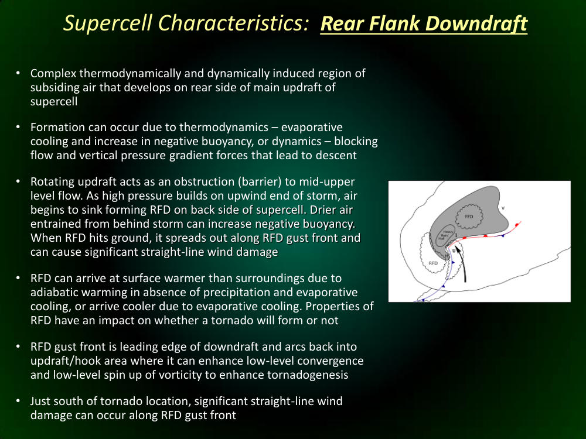

RFD on back side of supercell. Drier air 
entrained from behind storm can increase negative buoyancy. When RFD hits ground, it spreads out along RFD gust front and can cause significant straight
-line wind damage
• Complex thermodynamically and dynamically induced region of 
subsiding air that develops on rear side of main updraft of 
supercell 
• Formation can occur due to thermodynamics – evaporative 
cooling and increase in negative buoyancy, or dynamics – blocking 
flow and vertical pressure gradient forces that lead to descent 
• Rotating updraft acts as an obstruction (barrier) to mid-upper 
level flow. As high pressure builds on upwind end of storm, air 
begins to sink forming RFD on back side of supercell. Drier air 
entrained from behind storm can increase negative buoyancy. 
When RFD hits ground, it spreads out along RFD gust front and 
can cause significant straight-line wind damage 
• RFD can arrive at surface warmer than surroundings due to 
adiabatic warming in absence of precipitation and evaporative 
cooling, or arrive cooler due to evaporative cooling. Properties of 
RFD have an impact on whether a tornado will form or not 
• RFD gust front is leading edge of downdraft and arcs back into 
updraft/hook area where it can enhance low-level convergence 
and low-level spin up of vorticity to enhance tornadogenesis 
• Just south of tornado location, significant straight-line wind 
damage can occur along RFD gust front 
Supercell Characteristics:  Rear Flank Downdraft

## Page 12

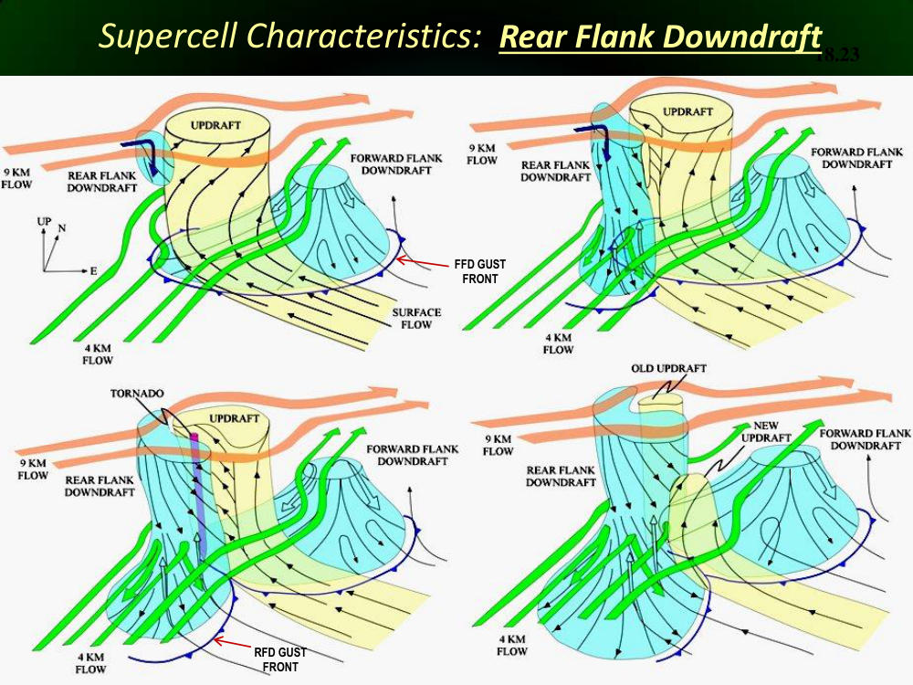

18.23 
Supercell Characteristics:  Rear Flank Downdraft 
FFD GUST 
FRONT 
RFD GUST 
FRONT

## Page 13

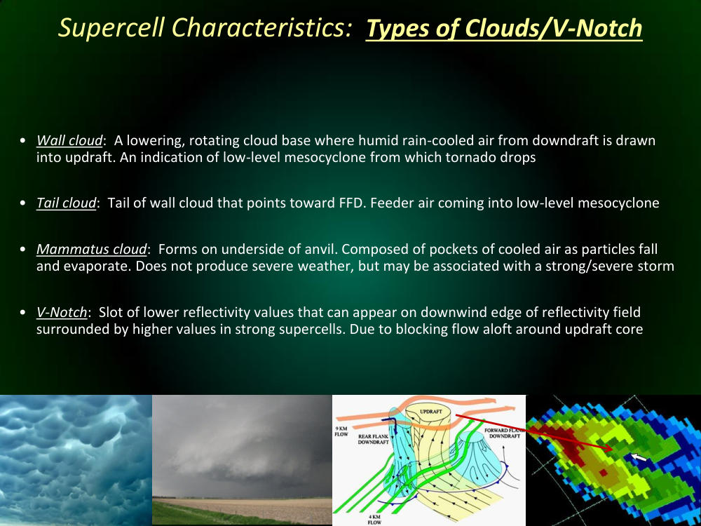

• Wall cloud:  A lowering, rotating cloud base where humid rain-cooled air from downdraft is drawn 
into updraft. An indication of low-level mesocyclone from which tornado drops 
• Tail cloud:  Tail of wall cloud that points toward FFD. Feeder air coming into low-level mesocyclone 
• Mammatus cloud:  Forms on underside of anvil. Composed of pockets of cooled air as particles fall 
and evaporate. Does not produce severe weather, but may be associated with a strong/severe storm  
• V-Notch:  Slot of lower reflectivity values that can appear on downwind edge of reflectivity field 
surrounded by higher values in strong supercells. Due to blocking flow aloft around updraft core 
Supercell Characteristics:  Types of Clouds/V-Notch

## Page 14

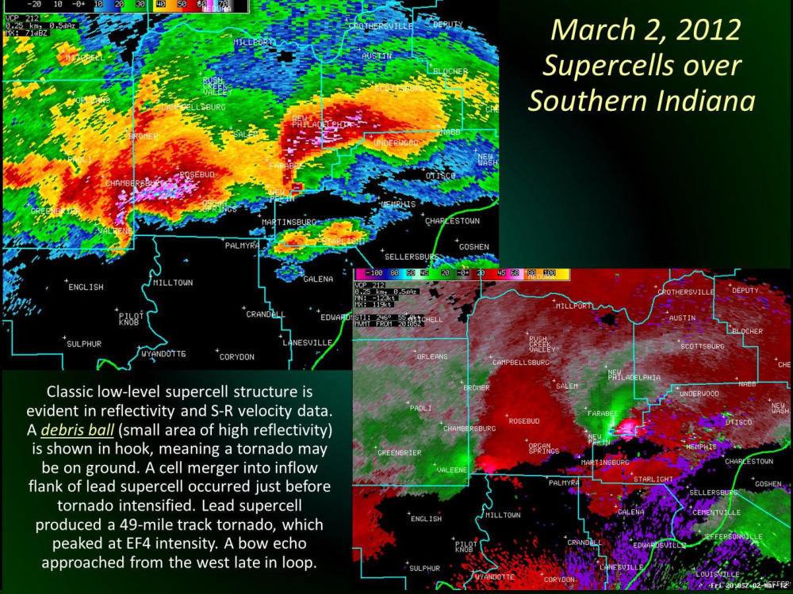

_(no extractable text on this page — see rendered image above)_

## Page 15

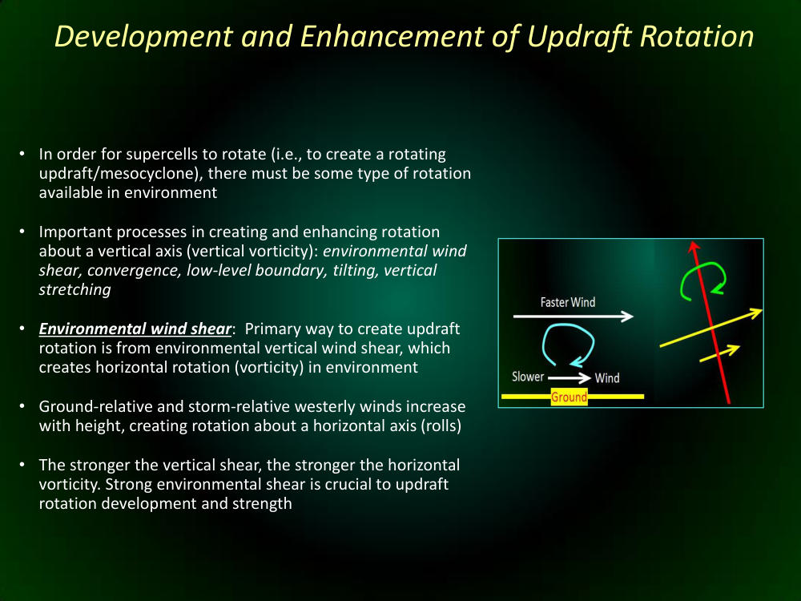

• In order for supercells to rotate (i.e., to create a rotating 
updraft/mesocyclone), there must be some type of rotation 
available in environment 
• Important processes in creating and enhancing rotation 
about a vertical axis (vertical vorticity): environmental wind 
shear, convergence, low-level boundary, tilting, vertical 
stretching 
• Environmental wind shear:  Primary way to create updraft 
rotation is from environmental vertical wind shear, which 
creates horizontal rotation (vorticity) in environment  
• Ground-relative and storm-relative westerly winds increase 
with height, creating rotation about a horizontal axis (rolls) 
• The stronger the vertical shear, the stronger the horizontal 
vorticity. Strong environmental shear is crucial to updraft 
rotation development and strength 
 Development and Enhancement of Updraft Rotation

## Page 16

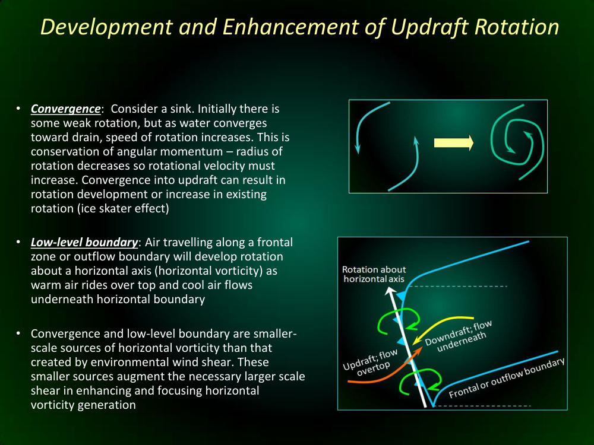

Development and Enhancement of Updraft Rotation 
• Convergence:  Consider a sink. Initially there is 
some weak rotation, but as water converges 
toward drain, speed of rotation increases. This is 
conservation of angular momentum – radius of 
rotation decreases so rotational velocity must 
increase. Convergence into updraft can result in 
rotation development or increase in existing 
rotation (ice skater effect) 
• Low-level boundary: Air travelling along a frontal 
zone or outflow boundary will develop rotation 
about a horizontal axis (horizontal vorticity) as 
warm air rides over top and cool air flows 
underneath horizontal boundary 
• Convergence and low-level boundary are smaller-
scale sources of horizontal vorticity than that 
created by environmental wind shear. These 
smaller sources augment the necessary larger scale 
shear in enhancing and focusing horizontal 
vorticity generation

## Page 17

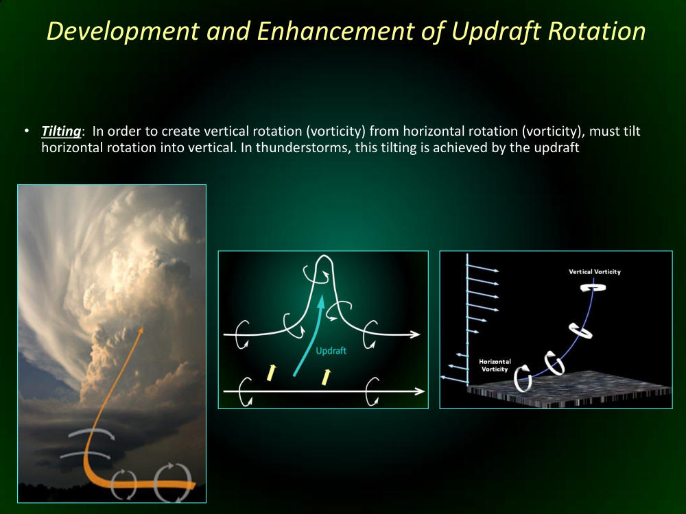

• Tilting:  In order to create vertical rotation (vorticity) from horizontal rotation (vorticity), must tilt 
horizontal rotation into vertical. In thunderstorms, this tilting is achieved by the updraft 
 Development and Enhancement of Updraft Rotation

## Page 18

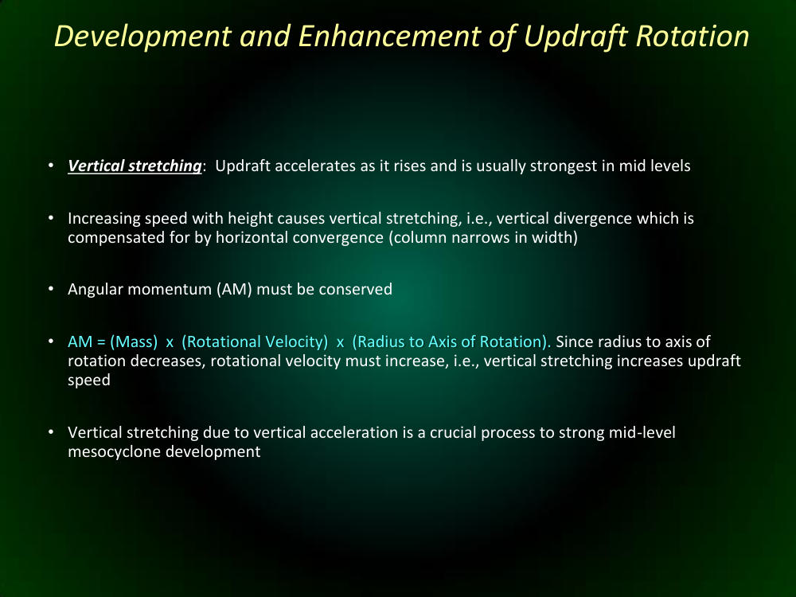

• AM = (Mass)  x  (Rotational Velocity)  x  (Radius to Axis of Rotation). 
• Vertical stretching:  Updraft accelerates as it rises and is usually strongest in mid levels 
• Increasing speed with height causes vertical stretching, i.e., vertical divergence which is 
compensated for by horizontal convergence (column narrows in width) 
• Angular momentum (AM) must be conserved 
• AM = (Mass)  x  (Rotational Velocity)  x  (Radius to Axis of Rotation). Since radius to axis of 
rotation decreases, rotational velocity must increase, i.e., vertical stretching increases updraft 
speed 
• Vertical stretching due to vertical acceleration is a crucial process to strong mid-level 
mesocyclone development 
 Development and Enhancement of Updraft Rotation

## Page 19

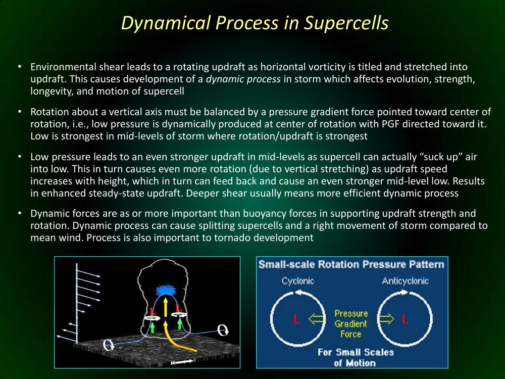

Dynamical Process in Supercells 
• Environmental shear leads to a rotating updraft as horizontal vorticity is titled and stretched into 
updraft. This causes development of a dynamic process in storm which affects evolution, strength, 
longevity, and motion of supercell 
• Rotation about a vertical axis must be balanced by a pressure gradient force pointed toward center of 
rotation, i.e., low pressure is dynamically produced at center of rotation with PGF directed toward it. 
Low is strongest in mid-levels of storm where rotation/updraft is strongest 
• Low pressure leads to an even stronger updraft in mid-levels as supercell can actually “suck up” air 
into low. This in turn causes even more rotation (due to vertical stretching) as updraft speed 
increases with height, which in turn can feed back and cause an even stronger mid-level low. Results 
in enhanced steady-state updraft. Deeper shear usually means more efficient dynamic process 
• Dynamic forces are as or more important than buoyancy forces in supporting updraft strength and 
rotation. Dynamic process can cause splitting supercells and a right movement of storm compared to 
mean wind. Process is also important to tornado development

## Page 20

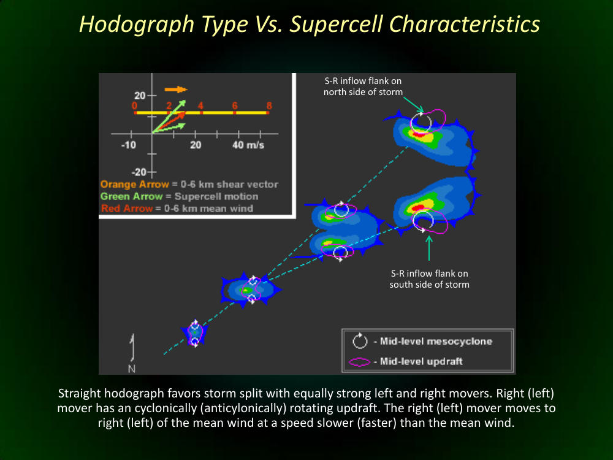

Hodograph Type Vs. Supercell Characteristics 
Straight hodograph favors storm split with equally strong left and right movers. Right (left) 
mover has an cyclonically (anticylonically) rotating updraft. The right (left) mover moves to 
right (left) of the mean wind at a speed slower (faster) than the mean wind. 
S-R inflow flank on 
north side of storm 
S-R inflow flank on 
south side of storm

## Page 21

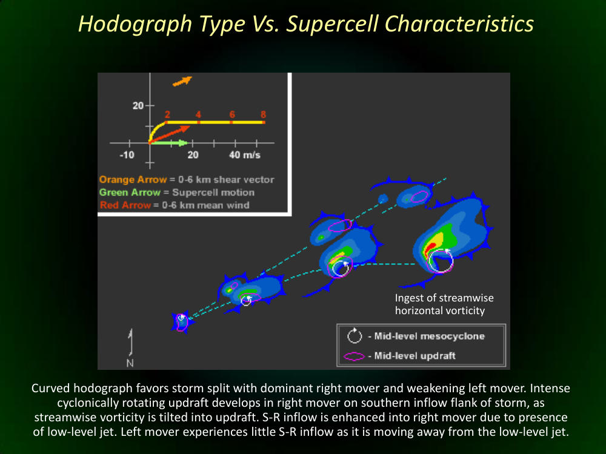

Hodograph Type Vs. Supercell Characteristics 
Curved hodograph favors storm split with dominant right mover and weakening left mover. Intense 
cyclonically rotating updraft develops in right mover on southern inflow flank of storm, as 
streamwise vorticity is tilted into updraft. S-R inflow is enhanced into right mover due to presence 
of low-level jet. Left mover experiences little S-R inflow as it is moving away from the low-level jet.  
Ingest of streamwise 
horizontal vorticity

## Page 22

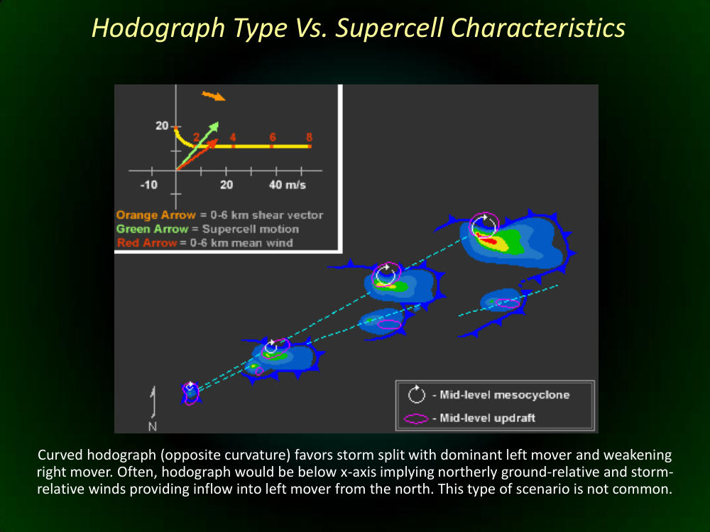

Hodograph Type Vs. Supercell Characteristics 
Curved hodograph (opposite curvature) favors storm split with dominant left mover and weakening 
right mover. Often, hodograph would be below x-axis implying northerly ground-relative and storm-
relative winds providing inflow into left mover from the north. This type of scenario is not common.

## Page 23

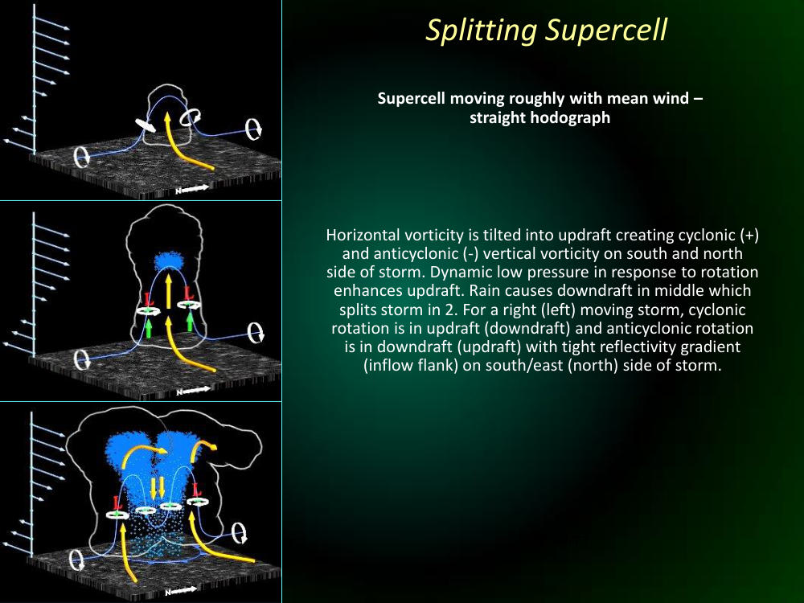

© COMET 
 Splitting Supercell 
Horizontal vorticity is tilted into updraft creating cyclonic (+) 
and anticyclonic (-) vertical vorticity on south and north 
side of storm. Dynamic low pressure in response to rotation 
enhances updraft. Rain causes downdraft in middle which 
splits storm in 2. For a right (left) moving storm, cyclonic 
rotation is in updraft (downdraft) and anticyclonic rotation 
is in downdraft (updraft) with tight reflectivity gradient 
(inflow flank) on south/east (north) side of storm.  
Supercell moving roughly with mean wind – 
straight hodograph

## Page 24

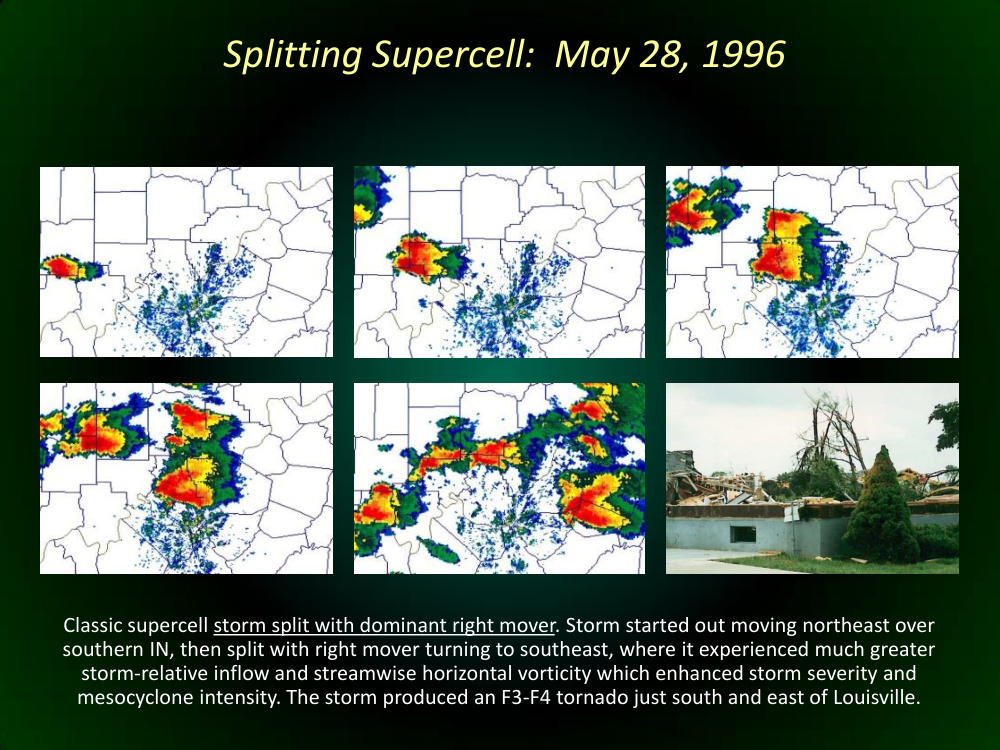

Classic supercell storm split with dominant right mover. Storm started out moving northeast over 
southern IN, then split with right mover turning to southeast, where it experienced much greater 
storm-relative inflow and streamwise horizontal vorticity which enhanced storm severity and 
mesocyclone intensity. The storm produced an F3-F4 tornado just south and east of Louisville.  
 Splitting Supercell:  May 28, 1996

## Page 25

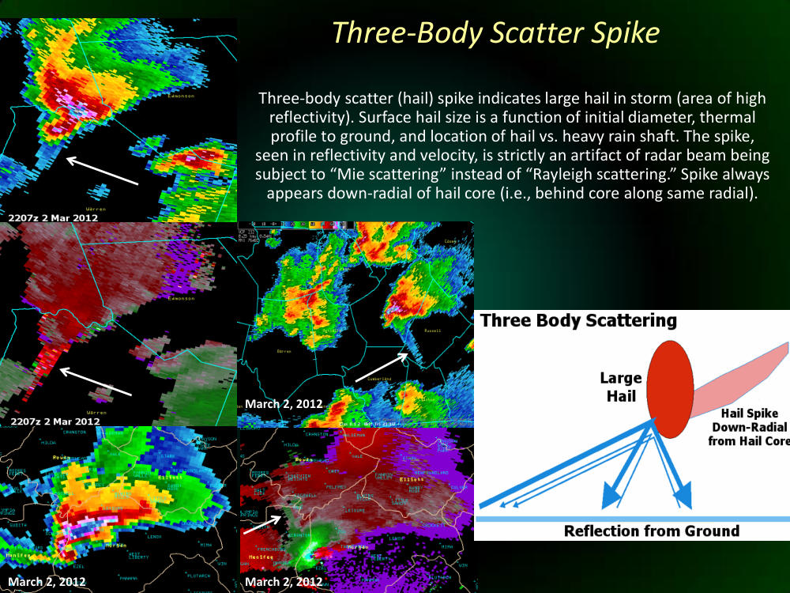

Three-Body Scatter Spike  
Three-body scatter (hail) spike indicates large hail in storm (area of high 
reflectivity). Surface hail size is a function of initial diameter, thermal 
profile to ground, and location of hail vs. heavy rain shaft. The spike, 
seen in reflectivity and velocity, is strictly an artifact of radar beam being 
subject to “Mie scattering” instead of “Rayleigh scattering.” Spike always 
appears down-radial of hail core (i.e., behind core along same radial). 
March 2, 2012 
March 2, 2012 
March 2, 2012

## Page 26

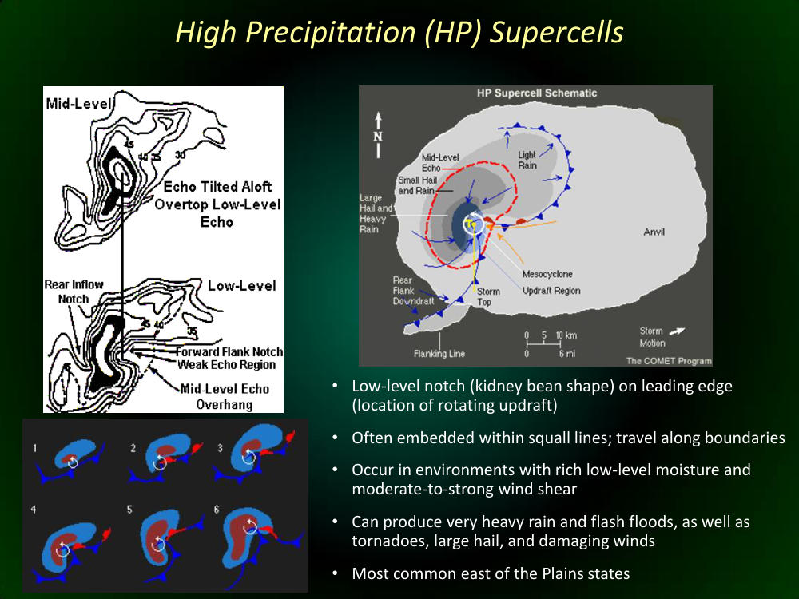

High Precipitation (HP) Supercells 
• Low-level notch (kidney bean shape) on leading edge 
(location of rotating updraft) 
• Often embedded within squall lines; travel along boundaries 
• Occur in environments with rich low-level moisture and 
moderate-to-strong wind shear 
• Can produce very heavy rain and flash floods, as well as 
tornadoes, large hail, and damaging winds 
• Most common east of the Plains states

## Page 27

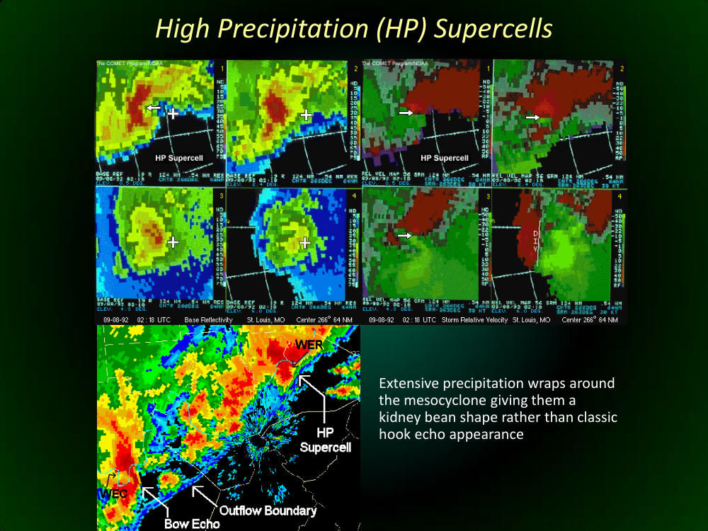

High Precipitation (HP) Supercells 
Extensive precipitation wraps around 
the mesocyclone giving them a 
kidney bean shape rather than classic 
hook echo appearance

## Page 28

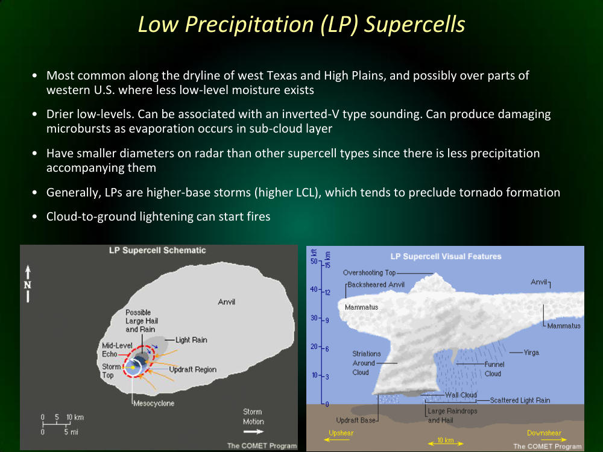

• Most common along the dryline of west Texas and High Plains, and possibly over parts of 
western U.S. where less low-level moisture exists 
• Drier low-levels. Can be associated with an inverted-V type sounding. Can produce damaging 
microbursts as evaporation occurs in sub-cloud layer  
• Have smaller diameters on radar than other supercell types since there is less precipitation 
accompanying them 
• Generally, LPs are higher-base storms (higher LCL), which tends to preclude tornado formation 
• Cloud-to-ground lightening can start fires 
Low Precipitation (LP) Supercells

## Page 29

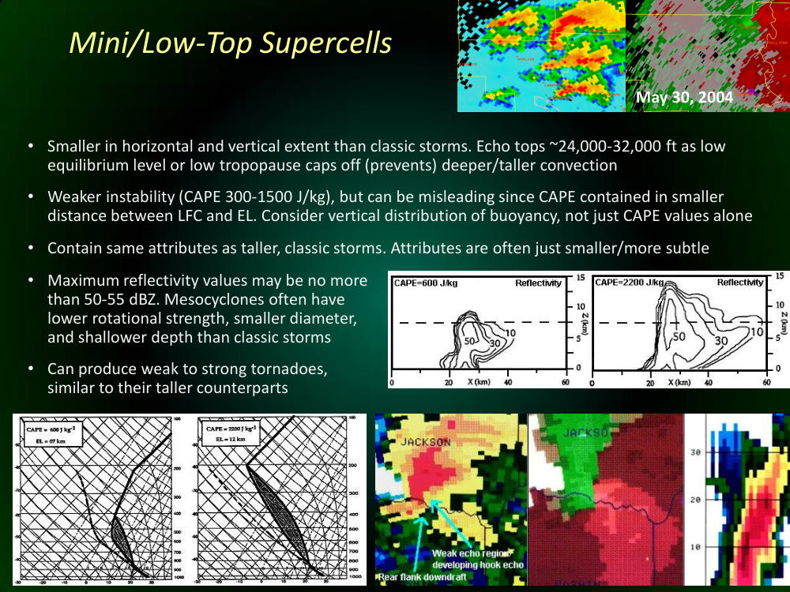

Mini/Low-Top Supercells 
• Smaller in horizontal and vertical extent than classic storms. Echo tops ~24,000-32,000 ft as low 
equilibrium level or low tropopause caps off (prevents) deeper/taller convection 
• Weaker instability (CAPE 300-1500 J/kg), but can be misleading since CAPE contained in smaller 
distance between LFC and EL. Consider vertical distribution of buoyancy, not just CAPE values alone 
• Contain same attributes as taller, classic storms. Attributes are often just smaller/more subtle 
• Maximum reflectivity values may be no more                                                                                                
than 50-55 dBZ. Mesocyclones often have                                                                                                     
lower rotational strength, smaller diameter,                                                                                                            
and shallower depth than classic storms  
• Can produce weak to strong tornadoes,                                                                                                     
similar to their taller counterparts 
May 30, 2004
